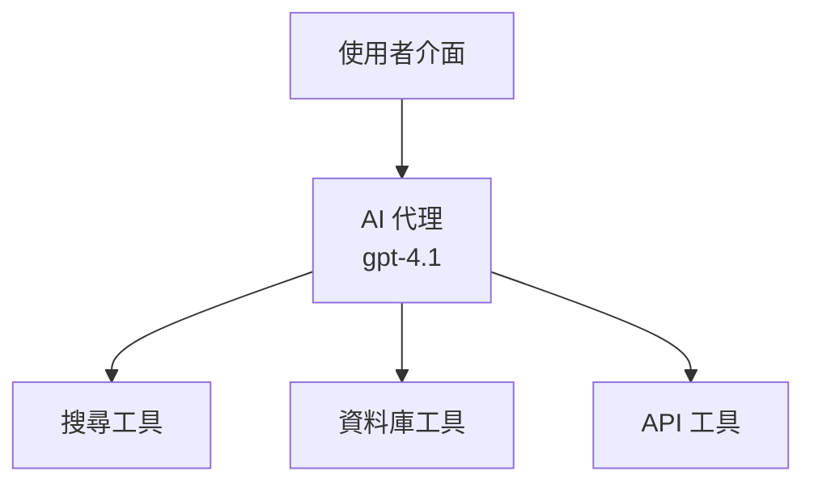
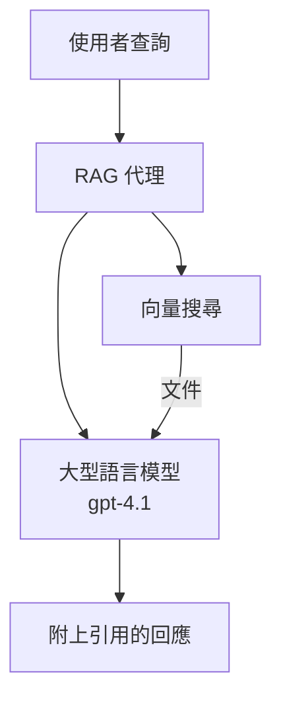
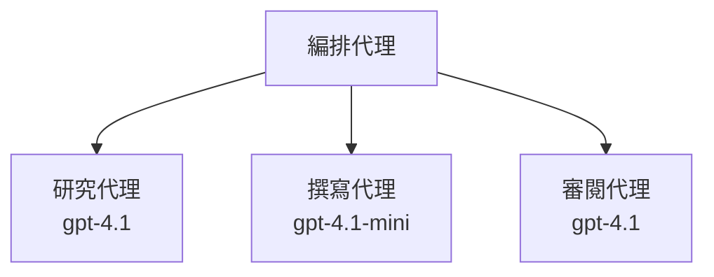

# AI Agents with Azure Developer CLI

**Chapter Navigation:**
- **📚 Course Home**: [AZD For Beginners](../../README.md)
- **📖 Current Chapter**: 第 2 章 - 以 AI 為先的開發
- **⬅️ Previous**: [Microsoft Foundry Integration](microsoft-foundry-integration.md)
- **➡️ Next**: [AI Model Deployment](ai-model-deployment.md)
- **🚀 Advanced**: [Multi-Agent Solutions](../../examples/retail-scenario.md)

---

## Introduction

AI agents 是能夠感知其環境、做出決策並採取行動以達成特定目標的自主程式。與只回應提示的簡單聊天機器人不同，代理可以：

- <strong>使用工具</strong> - 呼叫 API、搜尋資料庫、執行程式碼
- <strong>規劃與推理</strong> - 將複雜任務拆解成步驟
- <strong>從上下文學習</strong> - 維持記憶並調整行為
- <strong>協作</strong> - 與其他代理合作（多代理系統）

本指南示範如何使用 Azure Developer CLI (azd) 將 AI 代理部署到 Azure。

> **Validation note (2026-03-25):** 本指南已針對 `azd` `1.23.12` 與 `azure.ai.agents` `0.1.18-preview` 進行審查。`azd ai` 體驗仍以預覽為主，若您安裝的擴充功能版本有差異，請檢查擴充功能說明。

## Learning Goals

完成本指南後，您將能：
- 了解 AI 代理為何與聊天機器人不同
- 使用 AZD 部署預先建置的 AI 代理範本
- 為自訂代理設定 Foundry Agents
- 實作基本代理模式（工具使用、RAG、多代理）
- 監控與除錯已部署的代理

## Learning Outcomes

完成後，您將能夠：
- 以單一指令將 AI 代理應用部署到 Azure
- 設定代理工具與功能
- 與代理一起實作檢索增強生成（RAG）
- 為複雜工作流程設計多代理架構
- 疑難排解常見的代理部署問題

---

## 🤖 What Makes an Agent Different from a Chatbot?

| Feature | Chatbot | AI Agent |
|---------|---------|----------|
| **Behavior** | 回應提示 | 採取自主行動 |
| **Tools** | 無 | 可呼叫 API、搜尋、執行程式碼 |
| **Memory** | 僅基於工作階段 | 跨工作階段的持久記憶 |
| **Planning** | 單次回應 | 多步驟推理 |
| **Collaboration** | 單一個體 | 可與其他代理協同工作 |

### Simple Analogy

- **Chatbot** = 在資訊櫃檯回答問題的友善人員
- **AI Agent** = 可為您撥打電話、預約並完成任務的私人助理

---

## 🚀 Quick Start: Deploy Your First Agent

### Option 1: Foundry Agents Template (Recommended)

```bash
# 初始化 AI 代理範本
azd init --template get-started-with-ai-agents

# 部署到 Azure
azd up
```

**What gets deployed:**
- ✅ Foundry Agents
- ✅ Microsoft Foundry Models (gpt-4.1)
- ✅ Azure AI Search (用於 RAG)
- ✅ Azure Container Apps（網頁介面）
- ✅ Application Insights（監控）

**Time:** 約 15-20 分鐘
**Cost:** 約 $100-150/月（開發環境）

### Option 2: OpenAI Agent with Prompty

```bash
# 初始化基於 Prompty 的代理範本
azd init --template agent-openai-python-prompty

# 部署到 Azure
azd up
```

**What gets deployed:**
- ✅ Azure Functions（無伺服器代理執行）
- ✅ Microsoft Foundry Models
- ✅ Prompty 設定檔
- ✅ 範例代理實作

**Time:** 約 10-15 分鐘
**Cost:** 約 $50-100/月（開發環境）

### Option 3: RAG Chat Agent

```bash
# 初始化 RAG 聊天範本
azd init --template azure-search-openai-demo

# 部署到 Azure
azd up
```

**What gets deployed:**
- ✅ Microsoft Foundry Models
- ✅ 含範例資料的 Azure AI Search
- ✅ 文件處理管線
- ✅ 含引證的聊天介面

**Time:** 約 15-25 分鐘
**Cost:** 約 $80-150/月（開發環境）

### Option 4: AZD AI Agent Init (Manifest- or Template-Based Preview)

如果您有代理清單檔（agent manifest），可以使用 `azd ai` 指令直接支援建立 Foundry Agent Service 專案。近期的預覽版也新增了基於範本的初始化支援，因此依您安裝的擴充功能版本，實際提示流程可能略有不同。

```bash
# 安裝 AI 代理擴充功能
azd extension install azure.ai.agents

# 可選：驗證已安裝的預覽版本
azd extension show azure.ai.agents

# 從代理清單初始化
azd ai agent init -m agent-manifest.yaml

# 部署到 Azure
azd up

# 測試已部署的代理（顯示延遲與首位元組時間）
azd ai agent invoke
```

**When to use `azd ai agent init` vs `azd init --template`:**

| Approach | Best For | How It Works |
|----------|----------|------|
| `azd init --template` | 從可運作的示例應用開始 | 會複製包含程式碼 + 基礎設施的完整範本 repo |
| `azd ai agent init -m` | 從您自己的代理清單建立 | 根據您的代理定義建構專案結構 |

> **Tip:** 學習時建議使用 `azd init --template`（上面選項 1-3）。在以您自己的 manifest 建置生產代理時使用 `azd ai agent init`。

在執行 `azd up` 之後，相同的擴充功能會引導您完成代理生命週期的其餘步驟：使用 `azd ai agent invoke` 進行測試，使用 `azd ai agent eval generate` 與 `azd ai agent optimize` 測量並提升品質，使用 `azd ai agent delete` 進行清除。完整參考請見 [AZD AI CLI Commands](../chapter-08-production/production-ai-practices.md#azd-ai-cli-commands-and-extensions)。

---

## 🏗️ Agent Architecture Patterns

### Pattern 1: Single Agent with Tools

最簡單的代理模式 — 一個可以使用多種工具的代理。



**Best for:**
- 客戶支援聊天機器人
- 研究助理
- 資料分析代理

**AZD Template:** `azure-search-openai-demo`

### Pattern 2: RAG Agent (Retrieval-Augmented Generation)

在生成回應前先檢索相關文件的代理。



**Best for:**
- 企業知識庫
- 文件問答系統
- 合規與法律研究

**AZD Template:** `azure-search-openai-demo`

### Pattern 3: Multi-Agent System

多個專門化代理共同合作處理複雜任務。



**Best for:**
- 複雜內容生成
- 多步驟工作流程
- 需要不同專業知識的任務

**Learn More:** [Multi-Agent Coordination Patterns](../chapter-06-pre-deployment/coordination-patterns.md)

---

## ⚙️ Configuring Agent Tools

當代理能使用工具時會變得很強大。以下說明如何設定常見工具：

### Tool Configuration in Foundry Agents

```python
# agent_config.py
from azure.ai.projects import AIProjectClient
from azure.ai.projects.models import FunctionTool, CodeInterpreterTool

# 定義自訂工具
search_tool = FunctionTool(
    name="search_knowledge_base",
    description="Search the company knowledge base for relevant documents",
    parameters={
        "type": "object",
        "properties": {
            "query": {
                "type": "string",
                "description": "The search query"
            }
        },
        "required": ["query"]
    }
)

# 使用工具建立代理
agent = project_client.agents.create_agent(
    model="gpt-4.1",
    name="Support Agent",
    instructions="You are a helpful support agent. Use the search tool to find relevant information.",
    tools=[search_tool, CodeInterpreterTool()]
)
```

### Environment Configuration

```bash
# 設定代理專屬的環境變數
azd env set AZURE_OPENAI_MODEL "gpt-4.1"
azd env set AGENT_INSTRUCTIONS "You are a helpful assistant..."
azd env set ENABLE_CODE_INTERPRETER "true"
azd env set ENABLE_FILE_SEARCH "true"

# 以更新後的設定進行部署
azd deploy
```

---

## 📊 Monitoring Agents

### Application Insights Integration

所有 AZD 代理範本都包含 Application Insights 用於監控：

```bash
# 開啟監控儀表板
azd monitor --overview

# 檢視即時日誌
azd monitor --logs

# 檢視即時指標
azd monitor --live
```

### Key Metrics to Track

| Metric | Description | Target |
|--------|-------------|--------|
| Response Latency | 產生回應所需時間 | < 5 秒 |
| Token Usage | 每次請求的 tokens | 監控以控制成本 |
| Tool Call Success Rate | 工具呼叫成功率百分比 | > 95% |
| Error Rate | 代理請求失敗率 | < 1% |
| User Satisfaction | 反饋評分 | > 4.0/5.0 |

### Custom Logging for Agents

```python
import os
from azure.monitor.opentelemetry import configure_azure_monitor
from opentelemetry import trace

# 使用 OpenTelemetry 設定 Azure Monitor
configure_azure_monitor(
    connection_string=os.environ["APPLICATIONINSIGHTS_CONNECTION_STRING"]
)

tracer = trace.get_tracer(__name__)

def log_agent_interaction(user_query, agent_response, tools_used, latency_ms):
    with tracer.start_as_current_span("agent_interaction") as span:
        span.set_attributes({
            "user_query": user_query,
            "response_length": len(agent_response),
            "tools_used": tools_used,
            "latency_ms": latency_ms
        })
```

> **Note:** 安裝所需套件：`pip install azure-monitor-opentelemetry opentelemetry`

---

## 💰 Cost Considerations

### Estimated Monthly Costs by Pattern

| Pattern | Dev Environment | Production |
|---------|-----------------|------------|
| Single Agent | $50-100 | $200-500 |
| RAG Agent | $80-150 | $300-800 |
| Multi-Agent (2-3 agents) | $150-300 | $500-1,500 |
| Enterprise Multi-Agent | $300-500 | $1,500-5,000+ |

### Cost Optimization Tips

1. **Use gpt-4.1-mini for simple tasks**
   ```bash
   azd env set AZURE_OPENAI_MODEL "gpt-4.1-mini"
   ```

2. **Implement caching for repeated queries**
   ```python
   from functools import lru_cache
   
   @lru_cache(maxsize=1000)
   def get_cached_response(query_hash):
       return agent.run(query_hash)
   ```

3. **Set token limits per run**
   ```python
   # 在執行代理時設定 max_completion_tokens，而不是在建立時
   run = project_client.agents.create_run(
       thread_id=thread.id,
       agent_id=agent.id,
       max_completion_tokens=1000  # 限制回應長度
   )
   ```

4. **Scale to zero when not in use**
   ```bash
   # 容器應用程式會自動縮減至零
   azd env set MIN_REPLICAS "0"
   ```

---

## 🔧 Troubleshooting Agents

### Common Issues and Solutions

<details>
<summary><strong>❌ 代理未回應工具呼叫</strong></summary>

```bash
# 檢查工具是否已正確註冊
azd show

# 驗證 OpenAI 的部署是否正確
az cognitiveservices account deployment list \
  --name $AZURE_OPENAI_NAME \
  --resource-group $RG_NAME

# 檢查代理程式日誌
azd monitor --logs
```

**Common causes:**
- 工具函式簽章不匹配
- 缺少必要權限
- API 端點無法存取
</details>

<details>
<summary><strong>❌ 代理回應延遲過高</strong></summary>

```bash
# 檢查 Application Insights 以找出瓶頸
azd monitor --live

# 考慮使用較快的模型
azd env set AZURE_OPENAI_MODEL "gpt-4.1-mini"
azd deploy
```

**Optimization tips:**
- 使用串流回應
- 實作回應快取
- 減少上下文視窗大小
</details>

<details>
<summary><strong>❌ 代理回傳不正確或杜撰的資訊</strong></summary>

```python
# 透過更佳的系統提示改進
instructions = """
You are a helpful assistant. IMPORTANT:
- Only answer based on provided context
- If you don't know, say "I don't know"
- Always cite your sources
- Never make up information
"""

# 新增檢索功能以建立依據
agent = project_client.agents.create_agent(
    model="gpt-4.1",
    instructions=instructions,
    tools=[FileSearchTool()]  # 以文件為回應建立依據
)
```
</details>

<details>
<summary><strong>❌ 超出 Token 限制錯誤</strong></summary>

```python
# 實作上下文視窗管理
def truncate_context(messages, max_tokens=8000, model="gpt-4.1"):
    """Keep only recent messages within token limit."""
    import tiktoken
    encoding = tiktoken.encoding_for_model(model)
    total_tokens = 0
    truncated = []
    
    for msg in reversed(messages):
        msg_tokens = len(encoding.encode(msg.content))
        if total_tokens + msg_tokens > max_tokens:
            break
        truncated.insert(0, msg)
        total_tokens += msg_tokens
    
    return truncated
```
</details>

---

## 🎓 Hands-On Exercises

### Exercise 1: Deploy a Basic Agent (20 minutes)

**Goal:** 使用 AZD 部署您的第一個 AI 代理

```bash
# 步驟 1: 初始化範本
azd init --template get-started-with-ai-agents

# 步驟 2: 登入 Azure
azd auth login
# 若您跨租戶作業，請加入 --tenant-id <tenant-id>

# 步驟 3: 部署
azd up

# 步驟 4: 測試代理程式
# 部署後預期輸出:
#   部署完成!
#   端點: https://<app-name>.<region>.azurecontainerapps.io
# 打開輸出中顯示的 URL，然後嘗試詢問一個問題

# 步驟 5: 檢視監控
azd monitor --overview

# 步驟 6: 清理
azd down --force --purge
```

**Success Criteria:**
- [ ] 代理能回應問題
- [ ] 可透過 `azd monitor` 存取監控儀表板
- [ ] 資源已成功清除

### Exercise 2: Add a Custom Tool (30 minutes)

**Goal:** 為代理擴充自訂工具

1. Deploy the agent template:
   ```bash
   azd init --template get-started-with-ai-agents
   azd up
   ```
2. Create a new tool function in your agent code:
   ```python
   def get_weather(location: str) -> str:
       """Get current weather for a location."""
       # 對天氣服務的 API 呼叫
       return f"Weather in {location}: Sunny, 72°F"
   ```
3. Register the tool with the agent:
   ```python
   from azure.ai.projects.models import FunctionTool

   weather_tool = FunctionTool(
       name="get_weather",
       description="Get current weather for a location",
       parameters={
           "type": "object",
           "properties": {
               "location": {"type": "string", "description": "City name"}
           },
           "required": ["location"]
       }
   )

   agent = project_client.agents.create_agent(
       model="gpt-4.1",
       name="Weather Agent",
       tools=[weather_tool]
   )
   ```
4. Redeploy and test:
   ```bash
   azd deploy
   # 詢問：「西雅圖的天氣如何？」
   # 預期：代理會呼叫 get_weather("Seattle") 並回傳天氣資訊
   ```

**Success Criteria:**
- [ ] 代理能識別與天氣相關的查詢
- [ ] 工具被正確呼叫
- [ ] 回應包含天氣資訊

### Exercise 3: Build a RAG Agent (45 minutes)

**Goal:** 建立一個能從您的文件回答問題的代理

```bash
# 步驟 1：部署 RAG 範本
azd init --template azure-search-openai-demo
azd up

# 步驟 2：上載您的文件
# 將 PDF/TXT 檔案放入 data/ 目錄，然後執行：
python scripts/prepdocs.py

# 步驟 3：使用特定領域的問題進行測試
# 從 azd up 的輸出中開啟網頁應用程式的 URL
# 就您上載的文件提出問題
# 回應應包括像 [doc.pdf] 這樣的引用參考
```

**Success Criteria:**
- [ ] 代理可從上傳的文件中回答
- [ ] 回應包含引證
- [ ] 對於範圍外的問題不會產生杜撰內容

---

## 📚 Next Steps

既然您已了解 AI 代理，請探索以下進階主題：

| Topic | Description | Link |
|-------|-------------|------|
| **Multi-Agent Systems** | 建立由多個協作代理組成的系統 | [Retail Multi-Agent Example](../../examples/retail-scenario.md) |
| **Coordination Patterns** | 學習編排與通訊模式 | [Coordination Patterns](../chapter-06-pre-deployment/coordination-patterns.md) |
| **Production Deployment** | 企業級代理部署 | [Production AI Practices](../chapter-08-production/production-ai-practices.md) |
| **Agent Evaluation** | 測試與評估代理效能 | [AI Troubleshooting](../chapter-07-troubleshooting/ai-troubleshooting.md) |
| **AI Workshop Lab** | 實作操作：讓您的 AI 解決方案適用於 AZD | [AI Workshop Lab](ai-workshop-lab.md) |

---

## 📖 Additional Resources

### Official Documentation
- [Microsoft Foundry Agent Service](https://learn.microsoft.com/azure/ai-services/agents/)
- [Microsoft Foundry Agent Service Quickstart](https://learn.microsoft.com/azure/ai-services/agents/quickstart)
- [Semantic Kernel Agent Framework](https://learn.microsoft.com/semantic-kernel/)

### AZD Templates for Agents
- [Get Started with AI Agents](https://github.com/Azure-Samples/get-started-with-ai-agents)
- [Agent OpenAI Python Prompty](https://github.com/Azure-Samples/agent-openai-python-prompty)
- [Azure Search OpenAI Demo](https://github.com/Azure-Samples/azure-search-openai-demo)

### Community Resources
- [Awesome AZD - Agent Templates](https://azure.github.io/awesome-azd/?tags=ai-agents)
- [Azure AI Discord](https://discord.gg/microsoft-azure)
- [Microsoft Foundry Discord](https://discord.gg/nTYy5BXMWG)

### Agent Skills for Your Editor
- [**Microsoft Azure Agent Skills**](https://skills.sh/microsoft/github-copilot-for-azure) - 在 GitHub Copilot、Cursor 或任何支援的代理中安裝可重用的 Azure 開發 AI 代理技能。包含針對 [Azure AI](https://skills.sh/microsoft/github-copilot-for-azure/azure-ai)、[Microsoft Foundry](https://skills.sh/microsoft/github-copilot-for-azure/microsoft-foundry)、[deployment](https://skills.sh/microsoft/github-copilot-for-azure/azure-deploy) 與 [diagnostics](https://skills.sh/microsoft/github-copilot-for-azure/azure-diagnostics) 的技能：
  ```bash
  npx skills add microsoft/github-copilot-for-azure
  ```

---

**Navigation**
- **Previous Lesson**: [Microsoft Foundry Integration](microsoft-foundry-integration.md)
- **Next Lesson**: [AI Model Deployment](ai-model-deployment.md)

---

<!-- CO-OP TRANSLATOR DISCLAIMER START -->
**免責聲明**：
本文件使用 AI 翻譯服務 [Co-op Translator](https://github.com/Azure/co-op-translator) 進行翻譯。雖然我們力求準確，但請注意，自動翻譯可能包含錯誤或不準確之處。原始文件的母語版本應被視為權威來源。對於重要資訊，建議尋求專業人工翻譯。我們不對因使用本翻譯而引起的任何誤解或曲解承擔責任。
<!-- CO-OP TRANSLATOR DISCLAIMER END -->