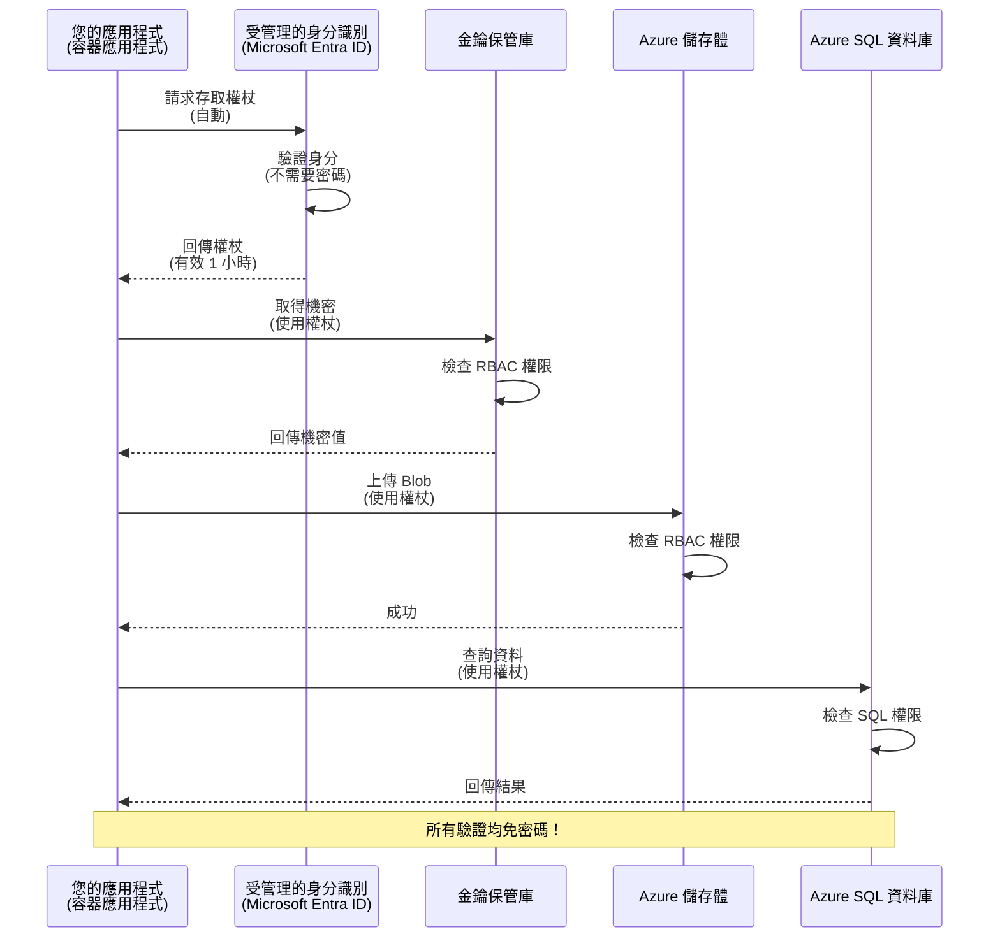
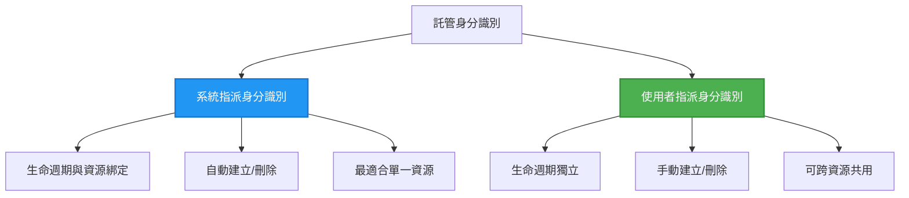

# 驗證模式與受管理的身分識別

⏱️ <strong>預估時間</strong>: 45-60 分鐘 | 💰 <strong>費用影響</strong>: 免費（無額外收費） | ⭐ <strong>複雜度</strong>: 中等

**📚 學習路徑:**
- ← 上一步: [組態管理](configuration.md) - 管理環境變數與機密
- 🎯 <strong>你在這裡</strong>: 驗證與安全（受管理的身分識別、Key Vault（金鑰保管庫）、安全做法）
- → 下一步: [第一個專案](first-project.md) - 建立你的第一個 AZD 應用程式
- 🏠 [課程首頁](../../README.md)

---

## 你將學到什麼

完成本課程後，你將能：
- 了解 Azure 的驗證模式（金鑰、連接字串、受管理的身分識別）
- 實作 <strong>受管理的身分識別</strong> 以達成無密碼驗證
- 透過 **Azure Key Vault** 整合保護機密
- 為 AZD 部署設定 **基於角色的存取控制 (RBAC)**
- 在 Container Apps 與 Azure 服務中應用安全最佳實務
- 從基於金鑰的驗證遷移到基於身分的驗證

## 為何受管理的身分識別很重要

### 問題：傳統驗證方式

**在採用受管理的身分識別之前：**
```javascript
// ❌ 安全風險：程式碼中硬編碼的機密
const connectionString = "Server=mydb.database.windows.net;User=admin;Password=P@ssw0rd123";
const storageKey = "xK7mN9pQ2wR5tY8uI0oP3aS6dF1gH4jK...";
const cosmosKey = "C2x7B9n4M1p8Q5w3E6r0T2y5U8i1O4p7...";
```

**問題：**
- 🔴 **機密在程式碼、設定檔或環境變數中暴露**
- 🔴 <strong>憑證輪換</strong> 需要變更程式並重新部署
- 🔴 <strong>稽核惡夢</strong> — 誰在何時存取了什麼？
- 🔴 <strong>擴散</strong> — 機密散落在多個系統中
- 🔴 <strong>合規風險</strong> — 無法通過安全稽核

### 解決方案：受管理的身分識別

**採用受管理的身分識別之後：**
```javascript
// ✅ 安全：程式碼中沒有機密資訊
const credential = new DefaultAzureCredential();
const client = new BlobServiceClient(
  "https://mystorageaccount.blob.core.windows.net",
  credential  // Azure 會自動處理身份驗證
);
```

**好處：**
- ✅ <strong>程式碼或設定中無任何機密</strong>
- ✅ <strong>自動輪換</strong> — 由 Azure 處理
- ✅ **在 Microsoft Entra ID 日誌中有完整稽核記錄**
- ✅ <strong>集中式安全性</strong> — 在 Azure 入口網站管理
- ✅ <strong>符合合規要求</strong> — 滿足安全標準

<strong>類比</strong>：傳統驗證就像攜帶多把不同門的實體鑰匙。受管理的身分識別就像擁有一張安全證件，會根據你的身分自動授權——不用擔心鑰匙遺失、被複製或需要輪換。

---

## 架構概覽

### 受管理的身分識別的驗證流程



### 受管理身分識別的類型



| 功能 | 系統指派 (System-Assigned) | 使用者指派 (User-Assigned) |
|---------|----------------|---------------|
| <strong>生命週期</strong> | 綁定於資源 | 獨立 |
| <strong>建立</strong> | 與資源自動建立 | 手動建立 |
| <strong>刪除</strong> | 隨資源刪除 | 在資源刪除後仍保留 |
| <strong>共用</strong> | 僅限單一資源 | 多個資源 |
| <strong>使用情境</strong> | 簡單情境 | 複雜的多資源情境 |
| **AZD 預設** | ✅ 建議 | 選用 |

---

## 先決條件

### 所需工具

您應已在先前課程安裝這些：

```bash
# 驗證 Azure Developer CLI
azd version
# ✅ 預期：azd 版本 1.0.0 或更高

# 驗證 Azure CLI
az --version
# ✅ 預期：azure-cli 2.50.0 或更高
```

### Azure 要求

- 有效的 Azure 訂閱
- 權限：
  - 建立受管理的身分
  - 指派 RBAC 角色
  - 建立 Key Vault 資源
  - 部署 Container Apps

### 知識先備條件

您應已完成：
- [安裝指南](installation.md) - AZD 設定
- [AZD 基礎](azd-basics.md) - 核心概念
- [組態管理](configuration.md) - 環境變數

---

## 課程 1：了解驗證模式

### 模式 1：連接字串（舊式 - 避免使用）

**運作方式：**
```bash
# 連線字串包含認證資訊
STORAGE_CONNECTION_STRING="DefaultEndpointsProtocol=https;AccountName=myaccount;AccountKey=xK7mN9pQ2wR5..."
COSMOS_CONNECTION_STRING="AccountEndpoint=https://myaccount.documents.azure.com:443/;AccountKey=C2x7..."
SQL_CONNECTION_STRING="Server=myserver.database.windows.net;User=admin;Password=P@ssw0rd..."
```

**問題：**
- ❌ 機密暴露在環境變數中
- ❌ 被記錄在部署系統中
- ❌ 難以輪換
- ❌ 沒有存取稽核記錄

**使用時機：** 僅用於本地開發，切勿用於生產環境。

---

### 模式 2：Key Vault 參考（較佳）

**運作方式：**
```bicep
// Store secret in Key Vault
resource keyVault 'Microsoft.KeyVault/vaults@2023-02-01' = {
  name: 'mykv'
  properties: {
    enableRbacAuthorization: true
  }
}

// Reference in Container App
env: [
  {
    name: 'STORAGE_KEY'
    secretRef: 'storage-key'  // References Key Vault
  }
]
```

**好處：**
- ✅ 機密安全儲存在 Key Vault
- ✅ 集中化的機密管理
- ✅ 可在不修改程式的情況下輪換

**限制：**
- ⚠️ 仍使用金鑰/密碼
- ⚠️ 需管理 Key Vault 的存取權

**使用時機：** 作為從連接字串向受管理身分識別過渡的步驟。

---

### 模式 3：受管理的身分識別（最佳實務）

**運作方式：**
```bicep
// Enable managed identity
resource containerApp 'Microsoft.App/containerApps@2023-05-01' = {
  name: 'myapp'
  identity: {
    type: 'SystemAssigned'  // Automatically creates identity
  }
}

// Grant permissions
resource roleAssignment 'Microsoft.Authorization/roleAssignments@2022-04-01' = {
  scope: storageAccount
  properties: {
    roleDefinitionId: storageBlobDataContributorRole
    principalId: containerApp.identity.principalId
  }
}
```

**應用程式程式碼：**
```javascript
// 毋須任何秘密！
const { DefaultAzureCredential } = require('@azure/identity');
const { BlobServiceClient } = require('@azure/storage-blob');

const credential = new DefaultAzureCredential();
const blobServiceClient = new BlobServiceClient(
  'https://mystorageaccount.blob.core.windows.net',
  credential
);
```

**好處：**
- ✅ 程式碼/設定中無機密
- ✅ 自動憑證輪換
- ✅ 完整稽核記錄
- ✅ 基於 RBAC 的權限控制
- ✅ 符合合規要求

**使用時機：** 在生產環境中始終使用。

---

### 模式 4：服務主體（CI/CD 與自動化）

受管理的身分識別是 *在 Azure 內部執行的資源* 的黃金標準。但對於在 **Azure 外部** 執行的項目——像是在建置代理上的 CI/CD 管線，或是無法使用互動式登入的筆記型電腦上的腳本——就需要 <strong>服務主體</strong>：一個具有自己憑證的非人類身分，自動化程序可以用它來登入。

**運作方式：**

建立範圍為資源群組的服務主體（最小權限）：

```bash
az ad sp create-for-rbac \
  --name "myapp-cicd" \
  --role contributor \
  --scopes /subscriptions/<sub-id>/resourceGroups/<rg-name>
```

這會列印出 client ID、client secret 與 tenant ID。azd 可使用它們進行非互動式登入：

```bash
azd auth login \
  --client-id "<appId>" \
  --client-secret "<password>" \
  --tenant-id "<tenant>"
```

**建議使用聯合憑證 (OIDC) 而非祕密。** 與其使用長期存在的 client secret，不如設定聯合憑證，使管線交換短期憑證——無需儲存或輪換祕密：

```bash
azd auth login \
  --client-id "<appId>" \
  --federated-credential-provider "github" \
  --tenant-id "<tenant>"
```

> `azd pipeline config` 會自動為您設定。請參閱 [第 8 章](../chapter-08-production/production-ai-practices.md) 的 CI/CD 操作教學。

**好處：**
- ✅ 可在 Azure 之外運作（建置代理、內部部署或其他雲端）
- ✅ 可範圍限定於單一資源群組並指派單一角色
- ✅ 聯合（OIDC）變體不使用儲存的祕密

**權衡：**
- ⚠️ 基於祕密的變體需要謹慎儲存與輪換
- ⚠️ 祕密洩露會授權服務主體可執行的一切操作——務必縮小範圍

**使用時機：** 適用於無法使用受管理身分識別的 CI/CD 管線與自動化工作。始終優先使用 **聯合/OIDC** 方案而非 client secret，且當工作負載在 Azure 上執行時，盡量使用受管理身分識別。

**安全儲存憑證：**
- 切勿將祕密提交至原始碼庫—使用管線的祕密儲存（GitHub Actions secrets、Azure DevOps 變數群組 / Key Vault）。
- 將服務主體的範圍與角色縮小到必要的最小權限。
- 設定到期並輪換，或使用 OIDC 完全消除祕密。

---

## 課程 2：在 AZD 中實作受管理的身分識別

### 逐步實作

讓我們建立一個使用受管理身分識別來存取 Azure Storage 與 Key Vault 的安全 Container App。

### 專案結構

```
secure-app/
├── azure.yaml                 # AZD configuration
├── infra/
│   ├── main.bicep            # Main infrastructure
│   ├── core/
│   │   ├── identity.bicep    # Managed identity setup
│   │   ├── keyvault.bicep    # Key Vault configuration
│   │   └── storage.bicep     # Storage with RBAC
│   └── app/
│       └── container-app.bicep
└── src/
    ├── app.js                # Application code
    ├── package.json
    └── Dockerfile
```

### 1. 設定 AZD (azure.yaml)

```yaml
name: secure-app
metadata:
  template: secure-app@1.0.0

services:
  api:
    project: ./src
    language: js
    host: containerapp

# Enable managed identity (AZD handles this automatically)
```

### 2. 基礎架構：啟用受管理身分識別

**檔案：`infra/main.bicep`**

```bicep
targetScope = 'subscription'

param environmentName string
param location string = 'eastus'

var tags = { 'azd-env-name': environmentName }

// Resource group
resource rg 'Microsoft.Resources/resourceGroups@2021-04-01' = {
  name: 'rg-${environmentName}'
  location: location
  tags: tags
}

// Storage Account
module storage './core/storage.bicep' = {
  name: 'storage'
  scope: rg
  params: {
    name: 'st${uniqueString(rg.id)}'
    location: location
    tags: tags
  }
}

// Key Vault
module keyVault './core/keyvault.bicep' = {
  name: 'keyvault'
  scope: rg
  params: {
    name: 'kv-${uniqueString(rg.id)}'
    location: location
    tags: tags
  }
}

// Container App with Managed Identity
module containerApp './app/container-app.bicep' = {
  name: 'container-app'
  scope: rg
  params: {
    name: 'ca-${environmentName}'
    location: location
    tags: tags
    storageAccountName: storage.outputs.name
    keyVaultName: keyVault.outputs.name
  }
}

// Grant Container App access to Storage
module storageRoleAssignment './core/role-assignment.bicep' = {
  name: 'storage-role'
  scope: rg
  params: {
    principalId: containerApp.outputs.identityPrincipalId
    roleDefinitionId: 'ba92f5b4-2d11-453d-a403-e96b0029c9fe'  // Storage Blob Data Contributor
    targetResourceId: storage.outputs.id
  }
}

// Grant Container App access to Key Vault
module kvRoleAssignment './core/role-assignment.bicep' = {
  name: 'kv-role'
  scope: rg
  params: {
    principalId: containerApp.outputs.identityPrincipalId
    roleDefinitionId: '4633458b-17de-408a-b874-0445c86b69e6'  // Key Vault Secrets User
    targetResourceId: keyVault.outputs.id
  }
}

// Outputs
output AZURE_STORAGE_ACCOUNT_NAME string = storage.outputs.name
output AZURE_KEY_VAULT_NAME string = keyVault.outputs.name
output APP_URL string = containerApp.outputs.url
```

### 3. 具有系統指派身分的 Container App

**檔案：`infra/app/container-app.bicep`**

```bicep
param name string
param location string
param tags object = {}
param storageAccountName string
param keyVaultName string

resource containerApp 'Microsoft.App/containerApps@2023-05-01' = {
  name: name
  location: location
  tags: tags
  identity: {
    type: 'SystemAssigned'  // 🔑 Enable managed identity
  }
  properties: {
    configuration: {
      ingress: {
        external: true
        targetPort: 3000
      }
    }
    template: {
      containers: [
        {
          name: 'api'
          image: 'myregistry.azurecr.io/api:latest'
          resources: {
            cpu: json('0.5')
            memory: '1Gi'
          }
          env: [
            {
              name: 'AZURE_STORAGE_ACCOUNT_NAME'
              value: storageAccountName
            }
            {
              name: 'AZURE_KEY_VAULT_NAME'
              value: keyVaultName
            }
            // 🔑 No secrets - managed identity handles authentication!
          ]
        }
      ]
    }
  }
}

// Output the identity for RBAC assignments
output identityPrincipalId string = containerApp.identity.principalId
output id string = containerApp.id
output url string = 'https://${containerApp.properties.configuration.ingress.fqdn}'
```

### 4. RBAC 角色指派模組

**檔案：`infra/core/role-assignment.bicep`**

```bicep
param principalId string
param roleDefinitionId string  // Azure built-in role ID
param targetResourceId string

resource roleAssignment 'Microsoft.Authorization/roleAssignments@2022-04-01' = {
  name: guid(principalId, roleDefinitionId, targetResourceId)
  scope: resourceId('Microsoft.Resources/resourceGroups', resourceGroup().name)
  properties: {
    roleDefinitionId: subscriptionResourceId('Microsoft.Authorization/roleDefinitions', roleDefinitionId)
    principalId: principalId
    principalType: 'ServicePrincipal'
  }
}

output id string = roleAssignment.id
```

### 5. 使用受管理身分識別的應用程式程式碼

**檔案：`src/app.js`**

```javascript
const express = require('express');
const { DefaultAzureCredential } = require('@azure/identity');
const { BlobServiceClient } = require('@azure/storage-blob');
const { SecretClient } = require('@azure/keyvault-secrets');

const app = express();
const PORT = process.env.PORT || 3000;

// 🔑 初始化憑證（使用託管身份時會自動運作）
const credential = new DefaultAzureCredential();

// Azure 儲存體設定
const storageAccountName = process.env.AZURE_STORAGE_ACCOUNT_NAME;
const blobServiceClient = new BlobServiceClient(
  `https://${storageAccountName}.blob.core.windows.net`,
  credential  // 不需要金鑰！
);

// Key Vault 設定
const keyVaultName = process.env.AZURE_KEY_VAULT_NAME;
const secretClient = new SecretClient(
  `https://${keyVaultName}.vault.azure.net`,
  credential  // 不需要金鑰！
);

// 健康檢查
app.get('/health', (req, res) => {
  res.json({ status: 'healthy', authentication: 'managed-identity' });
});

// 將檔案上傳到 Blob 儲存體
app.post('/upload', async (req, res) => {
  try {
    const containerClient = blobServiceClient.getContainerClient('uploads');
    await containerClient.createIfNotExists();
    
    const blobName = `file-${Date.now()}.txt`;
    const blockBlobClient = containerClient.getBlockBlobClient(blobName);
    
    await blockBlobClient.upload('Hello from managed identity!', 30);
    
    res.json({
      success: true,
      blobName: blobName,
      message: 'File uploaded using managed identity!'
    });
  } catch (error) {
    console.error('Upload error:', error);
    res.status(500).json({ error: error.message });
  }
});

// 從 Key Vault 取得機密
app.get('/secret/:name', async (req, res) => {
  try {
    const secretName = req.params.name;
    const secret = await secretClient.getSecret(secretName);
    
    res.json({
      name: secretName,
      value: secret.value,
      message: 'Secret retrieved using managed identity!'
    });
  } catch (error) {
    console.error('Secret error:', error);
    res.status(500).json({ error: error.message });
  }
});

// 列出 Blob 容器（示範讀取權限）
app.get('/containers', async (req, res) => {
  try {
    const containers = [];
    for await (const container of blobServiceClient.listContainers()) {
      containers.push(container.name);
    }
    
    res.json({
      containers: containers,
      count: containers.length,
      message: 'Containers listed using managed identity!'
    });
  } catch (error) {
    console.error('List error:', error);
    res.status(500).json({ error: error.message });
  }
});

app.listen(PORT, () => {
  console.log(`Secure API listening on port ${PORT}`);
  console.log('Authentication: Managed Identity (passwordless)');
});
```

**檔案：`src/package.json`**

```json
{
  "name": "secure-app",
  "version": "1.0.0",
  "dependencies": {
    "express": "^4.18.2",
    "@azure/identity": "^4.0.0",
    "@azure/storage-blob": "^12.17.0",
    "@azure/keyvault-secrets": "^4.7.0"
  },
  "scripts": {
    "start": "node app.js"
  }
}
```

### 6. 部署與測試

```bash
# 初始化 AZD 環境
azd init

# 部署基礎架構和應用程式
azd up

# 取得應用程式的 URL
APP_URL=$(azd env get-values | grep APP_URL | cut -d '=' -f2 | tr -d '"')

# 測試健康檢查
curl $APP_URL/health
```

**✅ 預期輸出：**
```json
{
  "status": "healthy",
  "authentication": "managed-identity"
}
```

**測試 blob 上傳：**
```bash
curl -X POST $APP_URL/upload
```

**✅ 預期輸出：**
```json
{
  "success": true,
  "blobName": "file-1700404800000.txt",
  "message": "File uploaded using managed identity!"
}
```

**測試容器列舉：**
```bash
curl $APP_URL/containers
```

**✅ 預期輸出：**
```json
{
  "containers": ["uploads"],
  "count": 1,
  "message": "Containers listed using managed identity!"
}
```

---

## 常見的 Azure RBAC 角色

### 受管理身分識別的內建角色 ID

| 服務 | 角色名稱 | 角色 ID | 權限 |
|---------|-----------|---------|-------------|
| **Storage** | Storage Blob Data Reader | `2a2b9908-6b94-4a3d-8e5a-a7d8f8cc8a12` | 讀取 Blob 與容器 |
| **Storage** | Storage Blob Data Contributor | `ba92f5b4-2d11-453d-a403-e96b0029c9fe` | 讀取、寫入、刪除 Blob |
| **Storage** | Storage Queue Data Contributor | `974c5e8b-45b9-4653-ba55-5f855dd0fb88` | 讀取、寫入、刪除佇列訊息 |
| **Key Vault** | Key Vault Secrets User | `4633458b-17de-408a-b874-0445c86b69e6` | 讀取機密 |
| **Key Vault** | Key Vault Secrets Officer | `b86a8fe4-44ce-4948-aee5-eccb2c155cd7` | 讀取、寫入、刪除機密 |
| **Cosmos DB** | Cosmos DB Built-in Data Reader | `00000000-0000-0000-0000-000000000001` | 讀取 Cosmos DB 資料 |
| **Cosmos DB** | Cosmos DB Built-in Data Contributor | `00000000-0000-0000-0000-000000000002` | 讀取、寫入 Cosmos DB 資料 |
| **SQL Database** | SQL DB Contributor | `9b7fa17d-e63e-47b0-bb0a-15c516ac86ec` | 管理 SQL 資料庫 |
| **Service Bus** | Azure Service Bus Data Owner | `090c5cfd-751d-490a-894a-3ce6f1109419` | 傳送、接收與管理訊息 |

### 如何查找角色 ID

```bash
# 列出所有內建角色
az role definition list --query "[].{Name:roleName, ID:name}" --output table

# 搜尋特定角色
az role definition list --query "[?contains(roleName, 'Storage Blob')].{Name:roleName, ID:name}" --output table

# 取得角色詳細資料
az role definition list --name "Storage Blob Data Contributor"
```

---

## 實作練習

### 練習 1：為現有應用啟用受管理身分識別 ⭐⭐（中等）

<strong>目標</strong>：為現有 Container App 部署新增受管理身分識別

<strong>情境</strong>：您有一個使用連接字串的 Container App，將其轉換為使用受管理身分識別。

<strong>起始點</strong>：具備下列設定的 Container App：

```bicep
// ❌ Current: Using connection string
env: [
  {
    name: 'STORAGE_CONNECTION_STRING'
    secretRef: 'storage-connection'
  }
]
```

**步驟：**

1. **在 Bicep 中啟用受管理身分識別：**

```bicep
resource containerApp 'Microsoft.App/containerApps@2023-05-01' = {
  name: 'myapp'
  identity: {
    type: 'SystemAssigned'  // Add this
  }
  // ... rest of configuration
}
```

2. **授予 Storage 存取權：**

```bicep
// Get storage account reference
resource storageAccount 'Microsoft.Storage/storageAccounts@2023-01-01' existing = {
  name: storageAccountName
}

// Assign role
resource roleAssignment 'Microsoft.Authorization/roleAssignments@2022-04-01' = {
  name: guid(containerApp.id, 'ba92f5b4-2d11-453d-a403-e96b0029c9fe', storageAccount.id)
  scope: storageAccount
  properties: {
    roleDefinitionId: subscriptionResourceId('Microsoft.Authorization/roleDefinitions', 'ba92f5b4-2d11-453d-a403-e96b0029c9fe')
    principalId: containerApp.identity.principalId
    principalType: 'ServicePrincipal'
  }
}
```

3. **更新應用程式程式碼：**

**之前（連接字串）：**
```javascript
const { BlobServiceClient } = require('@azure/storage-blob');

const blobServiceClient = BlobServiceClient.fromConnectionString(
  process.env.STORAGE_CONNECTION_STRING
);
```

**之後（受管理身分識別）：**
```javascript
const { DefaultAzureCredential } = require('@azure/identity');
const { BlobServiceClient } = require('@azure/storage-blob');

const credential = new DefaultAzureCredential();
const blobServiceClient = new BlobServiceClient(
  `https://${process.env.STORAGE_ACCOUNT_NAME}.blob.core.windows.net`,
  credential
);
```

4. **更新環境變數：**

```bicep
env: [
  {
    name: 'STORAGE_ACCOUNT_NAME'
    value: storageAccountName  // Just the name, no secrets!
  }
  // Remove STORAGE_CONNECTION_STRING
]
```

5. **部署並測試：**

```bash
# 重新部署
azd up

# 測試它是否仍能運作
curl https://myapp.azurecontainerapps.io/upload
```

**✅ 成功準則：**
- ✅ 應用程式無錯誤部署完成
- ✅ Storage 操作可正常運作（上傳、列舉、下載）
- ✅ 環境變數中沒有連接字串
- ✅ 在 Azure 入口網站的「Identity」窗格下可看到身分

**驗證：**

```bash
# 檢查是否已啟用受管理身分
az containerapp show \
  --name myapp \
  --resource-group rg-myapp \
  --query "identity.type"
# ✅ 預期: "SystemAssigned"

# 檢查角色指派
az role assignment list \
  --assignee $(az containerapp show --name myapp --resource-group rg-myapp --query "identity.principalId" -o tsv) \
  --scope /subscriptions/{sub-id}/resourceGroups/rg-myapp/providers/Microsoft.Storage/storageAccounts/mystorageaccount
# ✅ 預期: 顯示 "Storage Blob Data Contributor" 角色
```

<strong>時間</strong>：20-30 分鐘

---

### 練習 2：使用使用者指派身分識別的多服務存取 ⭐⭐⭐（進階）

<strong>目標</strong>：建立一個可跨多個 Container Apps 共用的使用者指派身分識別

<strong>情境</strong>：您有 3 個微服務都需要存取同一個 Storage 帳戶與 Key Vault。

<strong>步驟</strong>：

1. **建立使用者指派身分：**

**檔案：`infra/core/identity.bicep`**

```bicep
param name string
param location string
param tags object = {}

resource userAssignedIdentity 'Microsoft.ManagedIdentity/userAssignedIdentities@2023-01-31' = {
  name: name
  location: location
  tags: tags
}

output id string = userAssignedIdentity.id
output principalId string = userAssignedIdentity.properties.principalId
output clientId string = userAssignedIdentity.properties.clientId
```

2. **將角色指派給使用者指派身分：**

```bicep
// In main.bicep
module userIdentity './core/identity.bicep' = {
  name: 'user-identity'
  scope: rg
  params: {
    name: 'id-${environmentName}'
    location: location
    tags: tags
  }
}

// Grant Storage access
resource storageRoleAssignment 'Microsoft.Authorization/roleAssignments@2022-04-01' = {
  name: guid(userIdentity.outputs.principalId, 'storage-contributor')
  scope: storageAccount
  properties: {
    roleDefinitionId: subscriptionResourceId('Microsoft.Authorization/roleDefinitions', 'ba92f5b4-2d11-453d-a403-e96b0029c9fe')
    principalId: userIdentity.outputs.principalId
    principalType: 'ServicePrincipal'
  }
}

// Grant Key Vault access
resource kvRoleAssignment 'Microsoft.Authorization/roleAssignments@2022-04-01' = {
  name: guid(userIdentity.outputs.principalId, 'kv-secrets-user')
  scope: keyVault
  properties: {
    roleDefinitionId: subscriptionResourceId('Microsoft.Authorization/roleDefinitions', '4633458b-17de-408a-b874-0445c86b69e6')
    principalId: userIdentity.outputs.principalId
    principalType: 'ServicePrincipal'
  }
}
```

3. **將身分指派給多個 Container Apps：**

```bicep
resource apiGateway 'Microsoft.App/containerApps@2023-05-01' = {
  name: 'api-gateway'
  identity: {
    type: 'UserAssigned'
    userAssignedIdentities: {
      '${userIdentity.outputs.id}': {}
    }
  }
  // ... rest of config
}

resource productService 'Microsoft.App/containerApps@2023-05-01' = {
  name: 'product-service'
  identity: {
    type: 'UserAssigned'
    userAssignedIdentities: {
      '${userIdentity.outputs.id}': {}
    }
  }
  // ... rest of config
}

resource orderService 'Microsoft.App/containerApps@2023-05-01' = {
  name: 'order-service'
  identity: {
    type: 'UserAssigned'
    userAssignedIdentities: {
      '${userIdentity.outputs.id}': {}
    }
  }
  // ... rest of config
}
```

4. **應用程式程式碼（所有服務使用相同模式）：**

```javascript
const { DefaultAzureCredential, ManagedIdentityCredential } = require('@azure/identity');

// 對於使用者指派的身份，請指定用戶端 ID
const credential = new ManagedIdentityCredential(
  process.env.AZURE_CLIENT_ID  // 使用者指派的身份的用戶端 ID
);

// 或使用 DefaultAzureCredential（自動偵測）
const credential = new DefaultAzureCredential();

const blobServiceClient = new BlobServiceClient(
  `https://${process.env.STORAGE_ACCOUNT_NAME}.blob.core.windows.net`,
  credential
);
```

5. **部署並驗證：**

```bash
azd up

# 測試所有服務能否存取儲存空間
curl https://api-gateway.azurecontainerapps.io/upload
curl https://product-service.azurecontainerapps.io/upload
curl https://order-service.azurecontainerapps.io/upload
```

**✅ 成功準則：**
- ✅ 一個身分可在 3 個服務間共用
- ✅ 所有服務皆可存取 Storage 與 Key Vault
- ✅ 若刪除單一服務，身分仍保留
- ✅ 集中化的權限管理

**使用者指派身分的好處：**
- 單一身分可管理
- 各服務權限一致
- 刪除服務時身分會保留
- 適合複雜架構

<strong>時間</strong>：30-40 分鐘

---

### 練習 3：實作 Key Vault 機密輪換 ⭐⭐⭐（進階）

<strong>目標</strong>：將第三方 API 金鑰儲存在 Key Vault，並使用受管理身分識別存取它們

<strong>情境</strong>：您的應用需要呼叫需要 API 金鑰的外部 API（OpenAI、Stripe、SendGrid）。

<strong>步驟</strong>：

1. **建立啟用 RBAC 的 Key Vault：**

**檔案：`infra/core/keyvault.bicep`**

```bicep
param name string
param location string
param tags object = {}

resource keyVault 'Microsoft.KeyVault/vaults@2023-02-01' = {
  name: name
  location: location
  tags: tags
  properties: {
    enableRbacAuthorization: true  // Use RBAC instead of access policies
    sku: {
      family: 'A'
      name: 'standard'
    }
    tenantId: subscription().tenantId
    enableSoftDelete: true
    softDeleteRetentionInDays: 90
  }
}

// Allow Container App to read secrets
output id string = keyVault.id
output name string = keyVault.name
output uri string = keyVault.properties.vaultUri
```

2. **在 Key Vault 中儲存機密：**

```bash
# 取得 Key Vault 名稱
KV_NAME=$(azd env get-values | grep AZURE_KEY_VAULT_NAME | cut -d '=' -f2 | tr -d '"')

# 儲存第三方 API 金鑰
az keyvault secret set \
  --vault-name $KV_NAME \
  --name "OpenAI-ApiKey" \
  --value "sk-proj-xxxxxxxxxxxxx"

az keyvault secret set \
  --vault-name $KV_NAME \
  --name "Stripe-ApiKey" \
  --value "sk_live_xxxxxxxxxxxxx"

az keyvault secret set \
  --vault-name $KV_NAME \
  --name "SendGrid-ApiKey" \
  --value "SG.xxxxxxxxxxxxx"
```

3. **應用程式程式碼以擷取機密：**

**檔案：`src/config.js`**

```javascript
const { DefaultAzureCredential } = require('@azure/identity');
const { SecretClient } = require('@azure/keyvault-secrets');

class Config {
  constructor() {
    this.credential = new DefaultAzureCredential();
    this.secretClient = new SecretClient(
      `https://${process.env.AZURE_KEY_VAULT_NAME}.vault.azure.net`,
      this.credential
    );
    this.cache = {};
  }

  async getSecret(secretName) {
    // 先檢查快取
    if (this.cache[secretName]) {
      return this.cache[secretName];
    }

    try {
      const secret = await this.secretClient.getSecret(secretName);
      this.cache[secretName] = secret.value;
      console.log(`✅ Retrieved secret: ${secretName}`);
      return secret.value;
    } catch (error) {
      console.error(`❌ Failed to get secret ${secretName}:`, error.message);
      throw error;
    }
  }

  async getOpenAIKey() {
    return this.getSecret('OpenAI-ApiKey');
  }

  async getStripeKey() {
    return this.getSecret('Stripe-ApiKey');
  }

  async getSendGridKey() {
    return this.getSecret('SendGrid-ApiKey');
  }
}

module.exports = new Config();
```

4. **在應用程式中使用機密：**

**檔案：`src/app.js`**

```javascript
const express = require('express');
const config = require('./config');
const { OpenAI } = require('openai');

const app = express();

// 使用金鑰保管庫中的金鑰初始化 OpenAI
let openaiClient;

async function initializeServices() {
  const openaiKey = await config.getOpenAIKey();
  openaiClient = new OpenAI({ apiKey: openaiKey });
  console.log('✅ Services initialized with secrets from Key Vault');
}

// 在啟動時呼叫
initializeServices().catch(console.error);

app.post('/chat', async (req, res) => {
  try {
    const completion = await openaiClient.chat.completions.create({
      model: 'gpt-4.1',
      messages: [{ role: 'user', content: 'Hello!' }]
    });
    
    res.json({
      response: completion.choices[0].message.content,
      authentication: 'Key from Key Vault via Managed Identity'
    });
  } catch (error) {
    res.status(500).json({ error: error.message });
  }
});

app.listen(3000, () => {
  console.log('Secure API with Key Vault integration running');
});
```

5. **部署並測試：**

```bash
azd up

# 測試 API 金鑰是否可正常運作
curl -X POST https://myapp.azurecontainerapps.io/chat \
  -H "Content-Type: application/json" \
  -d '{"message":"Hello AI"}'
```

**✅ 成功準則：**
- ✅ 不要在程式碼或環境變數中放 API 金鑰
- ✅ 應用程式從 Key Vault 取得金鑰
- ✅ 第三方 API 正常運作
- ✅ 可以在不變更程式碼的情況下輪換金鑰

**輪換一個祕密:**

```bash
# 更新 Key Vault 中的機密
az keyvault secret set \
  --vault-name $KV_NAME \
  --name "OpenAI-ApiKey" \
  --value "sk-proj-NEW_KEY_HERE"

# 重新啟動應用程式以載入新金鑰
az containerapp revision restart \
  --name myapp \
  --resource-group rg-myapp
```

<strong>時間</strong>: 25-35 分鐘

---

## 知識檢核點

### 1. 認證模式 ✓

測試你的理解：

- [ ] **Q1**： 三種主要的認證模式是什麼？ 
  - **A**： 連線字串（舊有）、Key Vault 參考（過渡）、託管識別（最佳）

- [ ] **Q2**： 為什麼託管識別比連線字串好？
  - **A**： 程式碼中沒有祕密、自動輪換、完整稽核紀錄、RBAC 權限

- [ ] **Q3**： 何時會使用使用者指派識別而非系統指派？
  - **A**： 當要在多個資源間共用識別或識別的生命週期獨立於資源生命週期時

**動手驗證：**
```bash
# 檢查您的應用程式使用的是哪種類型的身分
az containerapp show \
  --name myapp \
  --resource-group rg-myapp \
  --query "identity.type"

# 列出該身分的所有角色指派
az role assignment list \
  --assignee $(az containerapp show --name myapp --resource-group rg-myapp --query "identity.principalId" -o tsv)
```

---

### 2. RBAC 與權限 ✓

測試你的理解：

- [ ] **Q1**： "Storage Blob Data Contributor" 的角色 ID 是什麼？
  - **A**： `ba92f5b4-2d11-453d-a403-e96b0029c9fe`

- [ ] **Q2**： "Key Vault Secrets User" 提供哪些權限？
  - **A**： 對祕密的唯讀存取（無法建立、更新或刪除）

- [ ] **Q3**： 如何授予 Container App 存取 Azure SQL？
  - **A**： 指派 "SQL DB Contributor" 角色或為 SQL 設定 Microsoft Entra ID 驗證

**動手驗證：**
```bash
# 尋找特定角色
az role definition list --name "Storage Blob Data Contributor"

# 檢查有哪些角色已指派給你的身份
PRINCIPAL_ID=$(az containerapp show --name myapp --resource-group rg-myapp --query "identity.principalId" -o tsv)
az role assignment list --assignee $PRINCIPAL_ID --output table
```

---

### 3. Key Vault 整合 ✓

測試你的理解：

- [ ] **Q1**： 如何為 Key Vault 啟用 RBAC（而不是存取原則）？
  - **A**： 在 Bicep 中設定 `enableRbacAuthorization: true`

- [ ] **Q2**： 哪個 Azure SDK 函式庫處理託管識別的認證？
  - **A**： `@azure/identity`，使用 `DefaultAzureCredential` 類別

- [ ] **Q3**： Key Vault 的祕密會在快取中保留多久？
  - **A**： 視應用程式而定；請實作自己的快取策略

**動手驗證：**
```bash
# 測試金鑰保管庫存取
az keyvault secret show \
  --vault-name $KV_NAME \
  --name "OpenAI-ApiKey" \
  --query "value"

# 檢查 RBAC 是否已啟用
az keyvault show \
  --name $KV_NAME \
  --query "properties.enableRbacAuthorization"
# ✅ 預期：true
```

---

## 安全最佳實務

### ✅ 建議做：

1. <strong>生產環境務必使用託管識別</strong>
   ```bicep
   identity: {
     type: 'SystemAssigned'
   }
   ```

2. **使用最小權限的 RBAC 角色**
   - 盡可能使用 "Reader" 角色
   - 除非必要，避免使用 "Owner" 或 "Contributor"

3. **將第三方金鑰儲存在 Key Vault**
   ```javascript
   const apiKey = await secretClient.getSecret('ThirdPartyApiKey');
   ```

4. <strong>啟用稽核日誌</strong>
   ```bicep
   diagnosticSettings: {
     logs: [{ category: 'AuditEvent', enabled: true }]
   }
   ```

5. **為 dev/staging/prod 使用不同的識別**
   ```bash
   azd env new dev
   azd env new staging
   azd env new prod
   ```

6. <strong>定期輪換祕密</strong>
   - 為 Key Vault 的祕密設定到期日
   - 使用 Azure Functions 自動化輪換

### ❌ 不建議：

1. <strong>絕對不要將祕密硬編碼</strong>
   ```javascript
   // ❌ 唔好
   const apiKey = "sk-proj-xxxxxxxxxxxxx";
   ```

2. <strong>生產環境不要使用連線字串</strong>
   ```javascript
   // ❌ 不好
   BlobServiceClient.fromConnectionString(process.env.STORAGE_CONNECTION_STRING)
   ```

3. <strong>不要授予過多權限</strong>
   ```bicep
   // ❌ BAD - too much access
   roleDefinitionId: 'Owner'
   
   // ✅ GOOD - least privilege
   roleDefinitionId: 'Storage Blob Data Reader'
   ```

4. <strong>不要將祕密寫入日誌</strong>
   ```javascript
   // ❌ 不好
   console.log('API Key:', apiKey);
   
   // ✅ 好
   console.log('API Key retrieved successfully');
   ```

5. <strong>不要在環境間共用生產身份</strong>
   ```bicep
   // ❌ BAD - same identity for dev and prod
   // ✅ GOOD - separate identities per environment
   ```

---

## 疑難排解指南

### 問題：存取 Azure Storage 時出現 "Unauthorized"

**症狀：**
```
Error: Unauthorized (403)
AuthorizationPermissionMismatch: This request is not authorized to perform this operation
```

**診斷：**

```bash
# 檢查是否已啟用受管理的身分識別
az containerapp show \
  --name myapp \
  --resource-group rg-myapp \
  --query "identity.type"
# ✅ 預期： "SystemAssigned" 或 "UserAssigned"

# 檢查角色指派
PRINCIPAL_ID=$(az containerapp show --name myapp --resource-group rg-myapp --query "identity.principalId" -o tsv)
az role assignment list --assignee $PRINCIPAL_ID

# 預期：應該會看到 "Storage Blob Data Contributor" 或類似的角色
```

**解決方案：**

1. **授予正確的 RBAC 角色：**
```bash
STORAGE_ID=$(az storage account show --name mystorageaccount --resource-group rg-myapp --query "id" -o tsv)
az role assignment create \
  --assignee $PRINCIPAL_ID \
  --role "Storage Blob Data Contributor" \
  --scope $STORAGE_ID
```

2. **等待變更傳播（可能需 5-10 分鐘）：**
```bash
# 檢查角色指派狀態
az role assignment list --assignee $PRINCIPAL_ID --scope $STORAGE_ID
```

3. **確認應用程式程式碼使用正確的憑證：**
```javascript
// 請確保您正在使用 DefaultAzureCredential
const credential = new DefaultAzureCredential();
```

---

### 問題：無法存取 Key Vault（存取被拒）

**症狀：**
```
Error: Forbidden (403)
The user, group or application does not have secrets get permission
```

**診斷：**

```bash
# 檢查 Key Vault 的 RBAC 是否已啟用
az keyvault show \
  --name $KV_NAME \
  --query "properties.enableRbacAuthorization"
# ✅ 預期: true

# 檢查角色指派
az role assignment list \
  --assignee $PRINCIPAL_ID \
  --scope /subscriptions/{sub-id}/resourceGroups/rg-myapp/providers/Microsoft.KeyVault/vaults/$KV_NAME
```

**解決方案：**

1. **在 Key Vault 上啟用 RBAC：**
```bash
az keyvault update \
  --name $KV_NAME \
  --enable-rbac-authorization true
```

2. **授予 Key Vault Secrets User 角色：**
```bash
KV_ID=$(az keyvault show --name $KV_NAME --query "id" -o tsv)
az role assignment create \
  --assignee $PRINCIPAL_ID \
  --role "Key Vault Secrets User" \
  --scope $KV_ID
```

---

### 問題：DefaultAzureCredential 在本機失敗

**症狀：**
```
Error: DefaultAzureCredential failed to retrieve a token
CredentialUnavailableError: No credential available
```

**診斷：**

```bash
# 檢查你是否已登入
az account show

# 檢查 Azure CLI 的驗證
az ad signed-in-user show
```

**解決方案：**

1. **登入 Azure CLI：**
```bash
az login
```

2. **設定 Azure 訂閱：**
```bash
az account set --subscription "Your Subscription Name"
```

3. **在本機開發時，使用環境變數：**
```bash
export AZURE_TENANT_ID="your-tenant-id"
export AZURE_CLIENT_ID="your-client-id"
export AZURE_CLIENT_SECRET="your-client-secret"
```

4. **或在本機使用不同的憑證：**
```javascript
const { DefaultAzureCredential, AzureCliCredential } = require('@azure/identity');

// 本地開發時使用 AzureCliCredential
const credential = process.env.NODE_ENV === 'production' 
  ? new DefaultAzureCredential()
  : new AzureCliCredential();
```

---

### 問題：角色指派傳播耗時過久

**症狀：**
- 角色已成功指派
- 仍收到 403 錯誤
- 存取間歇性（有時有效，有時無效）

**說明：**
Azure RBAC 的變更可能需要 5-10 分鐘才能在全球範圍傳播。

**解決方案：**

```bash
# 請稍候並重試
echo "Waiting for RBAC propagation..."
sleep 300  # 請稍候 5 分鐘

# 測試存取
curl https://myapp.azurecontainerapps.io/upload

# 如果仍然失敗，重新啟動應用程式
az containerapp revision restart \
  --name myapp \
  --resource-group rg-myapp
```

---

## 成本考量

### 託管識別 成本

| 資源 | 成本 |
|----------|------|
| <strong>託管識別</strong> | 🆓 <strong>免費</strong> - 不收費 |
| **RBAC 角色指派** | 🆓 <strong>免費</strong> - 不收費 |
| **Microsoft Entra ID 代幣請求** | 🆓 <strong>免費</strong> - 已包含 |
| **Key Vault 操作** | $0.03 每 10,000 次操作 |
| **Key Vault 儲存** | $0.024 每個祕密每月 |

**託管識別可以節省成本：**
- ✅ 消除服務對服務驗證時對 Key Vault 操作的需求
- ✅ 減少安全事件（沒有憑證外洩）
- ✅ 降低營運負擔（無需手動輪換）

**範例成本比較（每月）：**

| 情境 | 連線字串 | 託管識別 | 節省 |
|----------|-------------------|-----------------|---------|
| 小型應用（1M 請求） | ~$50（Key Vault + 操作） | ~$0 | $50/月 |
| 中型應用（10M 請求） | ~$200 | ~$0 | $200/月 |
| 大型應用（100M 請求） | ~$1,500 | ~$0 | $1,500/月 |

---

## 進一步閱讀

### 官方文件
- [Azure 託管識別](https://learn.microsoft.com/entra/identity/managed-identities-azure-resources/overview)
- [Azure RBAC](https://learn.microsoft.com/azure/role-based-access-control/overview)
- [Azure Key Vault](https://learn.microsoft.com/azure/key-vault/general/overview)
- [DefaultAzureCredential](https://learn.microsoft.com/dotnet/api/azure.identity.defaultazurecredential)

### SDK 文件
- [@azure/identity (Node.js)](https://www.npmjs.com/package/@azure/identity)
- [Azure.Identity (C#)](https://www.nuget.org/packages/Azure.Identity/)
- [azure-identity (Python)](https://pypi.org/project/azure-identity/)

### 本課程的下一步
- ← 上一節: [設定管理](configuration.md)
- → 下一節: [第一個專案](first-project.md)
- 🏠 [課程首頁](../../README.md)

### 相關範例
- [Microsoft Foundry 模型聊天範例](../../../../examples/azure-openai-chat) - 使用託管識別來存取 Microsoft Foundry 模型
- [微服務範例](../../../../examples/microservices) - 多服務的認證模式

---

## 摘要

**你已學到：**
- ✅ 三種認證模式（連線字串、Key Vault、託管識別）
- ✅ 如何在 AZD 中啟用及設定託管識別
- ✅ Azure 服務的 RBAC 角色指派
- ✅ 對第三方祕密使用 Key Vault 的整合
- ✅ 使用者指派與系統指派識別的差異
- ✅ 安全最佳做法與疑難排解

**重點整理：**
1. <strong>生產環境務必使用託管識別</strong> - 零祕密，自動輪換
2. **使用最小權限的 RBAC 角色** - 僅授予必要的權限
3. **將第三方金鑰儲存在 Key Vault** - 集中管理祕密
4. <strong>為不同環境分開使用識別</strong> - Dev、staging、prod 隔離
5. <strong>啟用稽核日誌</strong> - 追蹤誰存取了什麼

**下一步：**
1. 完成上述實作練習
2. 將現有應用從連線字串遷移到託管識別
3. 建立你的第一個 AZD 專案，從一開始就把安全納入： [第一個專案](first-project.md)

---

<!-- CO-OP TRANSLATOR DISCLAIMER START -->
**免責聲明**：
本文件使用 AI 翻譯服務 [Co-op Translator](https://github.com/Azure/co-op-translator) 進行翻譯。雖然我們力求準確，但請注意，自動翻譯可能包含錯誤或不準確之處。原始文件的母語版本應被視為權威來源。對於重要資訊，建議尋求專業人工翻譯。我們不對因使用本翻譯而引起的任何誤解或曲解承擔責任。
<!-- CO-OP TRANSLATOR DISCLAIMER END -->