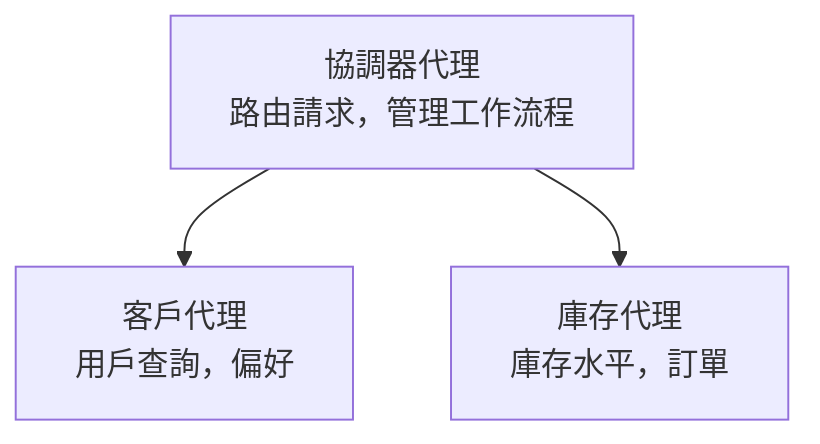

# 第五章：多代理人工智能解決方案

**📚 課程**：[AZD 初學者指南](../../README.md) | **⏱️ 時長**：2-3 小時 | **⭐ 難度**：高級

---

## 概述

本章涵蓋進階多代理架構模式、代理協調與生產環境下的 AI 部署，以應對複雜場景。

> 依據 2026 年 3 月 `azd 1.23.12` 版本驗證。

## 學習目標

完成本章後，您將能：
- 了解多代理架構模式
- 部署協調式的 AI 代理系統
- 實作代理間通訊
- 建構生產級多代理解決方案

---

## 📚 課程內容

| # | 課程 | 說明 | 時間 |
|---|--------|-------------|------|
| 1 | [零售多代理解決方案](../../examples/retail-scenario.md) | 完整實作流程演示 | 90 分鐘 |
| 2 | [協調模式](../chapter-06-pre-deployment/coordination-patterns.md) | 代理協調策略 | 30 分鐘 |
| 3 | [ARM 範本部署](../../examples/retail-multiagent-arm-template/README.md) | 一鍵部署 | 30 分鐘 |

---

## 🚀 快速開始

```bash
# 選項 1：從範本部署
azd init --template agent-openai-python-prompty
azd up

# 選項 2：從代理程式清單部署（需要 azure.ai.agents 擴充功能）
azd extension install azure.ai.agents
azd ai agent init -m agent-manifest.yaml
azd up
```

> **選擇哪種方式？** 使用 `azd init --template` 從現成範例開始。當您已有自己的代理說明檔時，請使用 `azd ai agent init`。詳細內容請參考 [AZD AI CLI 參考](../chapter-08-production/production-ai-practices.md#azd-ai-cli-commands-and-extensions)。

---

## 🤖 多代理架構


---

## 🎯 特色解決方案：零售多代理

[零售多代理解決方案](../../examples/retail-scenario.md) 演示了：

- <strong>客戶代理</strong>：處理用戶互動與偏好
- <strong>庫存代理</strong>：管理庫存與訂單處理
- <strong>協調者</strong>：負責代理間協調
- <strong>共用記憶體</strong>：跨代理上下文管理

### 使用服務

| 服務 | 目的 |
|---------|---------|
| Microsoft Foundry 模型 | 語言理解 |
| Azure AI 搜尋 | 產品目錄 |
| Cosmos DB | 代理狀態與記憶 |
| 容器應用 | 代理主機 |
| 應用程式診斷 | 監控 |

---

## 🔗 導覽

| 方向 | 章節 |
|-----------|---------|
| <strong>上一章</strong> | [第四章：基礎架構](../chapter-04-infrastructure/README.md) |
| <strong>下一章</strong> | [第六章：預部署](../chapter-06-pre-deployment/README.md) |

---

## 📖 相關資源

- [AI 代理指南](../chapter-02-ai-development/agents.md)
- [生產 AI 實務](../chapter-08-production/production-ai-practices.md)
- [AI 疑難排解](../chapter-07-troubleshooting/ai-troubleshooting.md)

---

<!-- CO-OP TRANSLATOR DISCLAIMER START -->
**免責聲明**：  
本文件由 AI 翻譯服務 [Co-op Translator](https://github.com/Azure/co-op-translator) 進行翻譯。雖然我們致力於準確性，但請注意，自動翻譯可能包含錯誤或不準確之處。原始語言的文件應被視為權威來源。對於重要資訊，建議採用專業人工翻譯。我們不對因使用本翻譯而引致的任何誤解或誤譯承擔責任。
<!-- CO-OP TRANSLATOR DISCLAIMER END -->