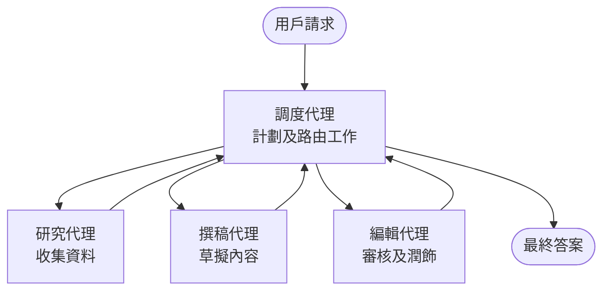

# 多代理基礎 - 部署你的第一個協調 AI 系統

**章節導航：**
- **📚 課程主頁**: [AZD 入門](../../README.md)
- **📖 本章**: 第 5 章 - 多代理 AI 解決方案
- **⬅️ 上一章**: [第 4 章：基礎架構](../chapter-04-infrastructure/README.md)
- **➡️ 下一章**: [協調模式](../chapter-06-pre-deployment/coordination-patterns.md)

> 已於 2026 年 7 月以 `azd 1.27.1` 版本驗證通過。

## 介紹

在前面的章節中，你部署了單一應用程式——而在第 2 章你部署了一個單一 AI 代理。本課程帶你邁出下一步：部署一個<strong>多代理系統</strong>，多個專門的代理協同工作，解決單一代理無法獨立有效處理的問題。

初學者的好消息是：**你不需要新的指令。** 多代理解決方案仍然是 azd 專案。你將使用 `azd init`、`azd up`、測試和 `azd down`——完全是你已經熟悉的工作流程。改變的是應用內部的<em>結構</em>。

## 學習目標

完成本課程後，你將能：
- 了解「多代理」的意義及其何時值得承擔額外的複雜度
- 辨識多代理系統中的常見角色（指揮官 + 專家）
- 使用 `azd up` 部署一個真實可運作的多代理範本
- 理解支援多代理應用的 Azure 資源
- 知道如何安全地驗證、自定義與拆除解決方案

## 學習成果

完成本課程後，你將能夠：
- 解釋單一代理與多代理系統之間的差異
- 在單一附工具代理與真正多代理設計間做出選擇
- 使用 azd 完整部署並測試一個多代理範本
- 辨別每個代理運行的位置及其通訊方式
- 清理所有資源，避免持續收費

---

## 什麼是多代理系統？

單一 AI 代理是指一個模型配合一組指令及（可選的）一些工具。這對專注任務十分有效。但當任務變大——研究、寫作、編輯、查證——所有工作塞入一個提示，會使代理變慢、不可靠且不易除錯。

<strong>多代理系統</strong>將工作拆分成由指揮官協調的多個專家，每個專家專注做好一項工作：



### 你必會見到的兩種角色

| 角色 | 工作 | 範例 |
|------|-----|---------|
| <strong>指揮官</strong> | 決定<em>下一步動作</em>並在代理間調度工作 | 「先研究，再寫作，最後編輯」 |
| <strong>專家</strong> | 專注執行一項工作並回傳結果 | 專門蒐集資料的「研究員」 |

### 你真的需要多個代理嗎？

從簡單開始。只有當符合以下條件之一才採用多代理：

- ✅ 任務具有<strong>明確階段</strong>，適合不同指令（研究、寫作、審閱）
- ✅ 希望專家能<strong>平行執行</strong>以節省時間
- ✅ 不同階段需要<strong>不同工具或資料來源</strong>
- ✅ 希望每個階段能<strong>獨立測試與除錯</strong>

若你的任務是簡單的問答或工具呼叫，使用<strong>單一工具代理</strong>（第2章）更簡單、省錢且操作容易。

> **入門提示：**「代理越多」不代表「越好」。每增加一個代理都會增加延遲、成本和監控項目。只有當問題明確分拆成多部分時才增加代理。

---

## 兩種 Azure 多代理建置方式

| 方法 | 內容 | 適用場景 |
|----------|-----------|----------|
| **單代理 + 工具** | 一個 Foundry 代理調用函式/工具 | 簡單流程、入門使用 |
| <strong>多個協調代理</strong> | 幾個代理由指揮官協調 | 明確階段、平行工作、分工專精 |

本課程著重於第二種方法，利用<strong>現成範本</strong>，讓你先看見一個真實多代理系統運作再開始打造自己的。

---

## 實作：部署工作中的多代理應用

我們將部署 **Contoso Creative Writer**，一個官方 Azure 範例，使用多位代理（研究員、作家、編輯）協調合作產出文章。這是理想的第一個多代理應用，因角色易於理解。

### 步驟 1：初始化範本

```bash
# 建立工作資料夾
mkdir creative-writer && cd creative-writer

# 從官方多代理範本初始化
azd init --template contoso-creative-writer
```

> 隨時可於 [Awesome AZD AI gallery](https://azure.github.io/awesome-azd/?tags=ai) 瀏覽更多多代理範本。其他適合初學者的選項包括 `get-started-with-ai-agents` 和 `azure-ai-travel-agents`。

### 步驟 2：驗證身分

```bash
# azd 工作流程所需
azd auth login
```

### 步驟 3：建立環境

```bash
azd env new dev
```

### 步驟 4：預覽，再部署

```bash
# 在花費任何資源之前先看看會創建什麼（建議）
azd provision --preview

# 在一步中提供基礎設施並部署所有代理人
azd up
```

`azd up` 會提示選擇訂閱與區域，然後配置 Azure 資源並部署應用。AI 部署通常比簡單的網頁應用耗時更長——如果部署大型模型，可延長部署逾時時間：

```bash
azd deploy --timeout 1800
```

> **成本與容量提醒：** 多代理應用會部署消耗配額和產生費用的 AI 模型。若 `azd up` 因模型配額失敗，請參考 [AI 疑難排解](../chapter-07-troubleshooting/ai-troubleshooting.md) 了解區域與配額修復，及第 6 章[容量規劃](../chapter-06-pre-deployment/capacity-planning.md)。

---

## 理解你部署了什麼

類似這樣的多代理應用會建立一組 Azure 資源，與上圖責任直接對應：

| 資源 | 存在原因 |
|----------|----------------|
| **Microsoft Foundry / Models** | 托管每個代理使用的語言模型 |
| **Azure AI Search** | 提供研究員代理可搜尋的基礎資料 |
| **Container Apps**（或應用服務） | 托管指揮官及代理程式碼 |
| **Cosmos DB**（部分範例） | 儲存代理間共享的狀態/記憶 |
| **Application Insights** | 跟蹤跨代理的請求，便於除錯流程 |

### 代理如何互相通訊

大多數 azd 多代理範本中，<strong>指揮官運行在你的應用程式碼中</strong>（例如，使用 Semantic Kernel 或 Microsoft Agent Framework 等框架）。指揮官依次呼叫每個專家代理，傳遞結果，並組裝最終答案。代理間共享上下文透過：

- **函式/工具呼叫** — 指揮官調用專家代理並獲取結果
- <strong>共享記憶</strong> — 通常以 Cosmos DB 資料庫儲存雙方皆可讀狀態
- **消息/事件** — 為鬆耦合設計，代理透過佇列或服務匯流排通訊

> **除錯的關鍵：** 因為每個階段獨立，Application Insights 能告訴你<em>哪個</em>代理較慢或失敗。這是分拆代理工作的一大實用理由。

---

## 驗證部署結果

在繼續前，確認系統確實運作：

```bash
# 顯示已部署的端點
azd show

# 開啟應用程式的監控儀表板
azd monitor

# 如果有異常情況，追蹤日誌
azd monitor --logs
```

然後開啟從 `azd show` 換取的應用 URL，試著發送一個涵蓋所有代理的請求（例如 Creative Writer，請它撰寫一篇主題短文）。在 Application Insights <strong>交易搜尋</strong>中，你會看到研究員、作家、編輯等階段的請求被展開。

**成功標準：**
- ✅ `azd show` 顯示可連結的端點
- ✅ 請求產出結果清楚通過多階段流程
- ✅ Application Insights 顯示多個代理階段的追蹤

---

## 自定義：新增或調整代理

因為每個代理只是一組指令加工具，自定義相當容易：

1. <strong>找到範本中的代理定義</strong>（通常在 `prompts/`、`agents/` 或 `*.prompty` 檔案集中）。
2. <strong>調整代理指令</strong> — 例如，告訴編輯代理強制使用特定風格或字數。
3. <strong>僅重新部署程式碼</strong>（基礎架構不變）：

   ```bash
   azd deploy
   ```

若想更進一步從<em>自己的</em> manifest 建立即代理，可使用代理擴展及其完整生命週期：

```bash
azd extension install azure.ai.agents
azd ai agent init -m agent-manifest.yaml
azd up
azd ai agent invoke      # 測試，包含回應時間
```

請參閱 [第 2 章：代理](../chapter-02-ai-development/agents.md) 及 [AZD AI CLI 參考](../chapter-08-production/production-ai-practices.md#azd-ai-cli-commands-and-extensions) 了解完整代理生命週期指令（`invoke`、`eval generate`、`optimize`、`delete`）。

---

## 清理

多代理應用會運行多個需計費的服務。使用後務必拆除所有資源：

```bash
azd down --force --purge
```

`--purge` 參數還會清除軟刪除的 AI 資源（如 Foundry/Azure AI 服務帳戶），避免阻礙未來重新部署或持續產生費用。

---

## 關於生產環境多代理系統的一點說明

本存放庫中的 [零售多代理解決方案](../../examples/retail-scenario.md) 是一份<strong>架構藍圖</strong>，非一鍵部署範本——它記錄了生產零售系統<em>應如何</em>建置（且明確指出完整構建工作量龐大）。請在這裡部署並操作範例後，再用它作為設計參考。關於生產環境的韌性、成本、監控、治理，請繼續參閱[第 8 章：生產 AI 實踐](../chapter-08-production/production-ai-practices.md)。

---

## 總結

- 多代理系統將工作分配給多名專家，由指揮官協調。
- 只有當任務有明確階段、並行性或每階段使用不同工具時，才使用多代理，否則建議使用單代理。
- azd 工作流程不變：`azd init` → `azd up` → 測試 → `azd down`。
- 使用像 `contoso-creative-writer` 這樣的真實範本，讓你今天就能看到並自訂工作多代理應用。
- 跨代理的 Application Insights 追蹤是多代理設計最大的實用收益之一。

---

## 🔗 導覽

| 方向 | 課程 |
|-----------|--------|
| <strong>上一章</strong> | [第 4 章：基礎架構](../chapter-04-infrastructure/README.md) |
| <strong>下一章</strong> | [協調模式](../chapter-06-pre-deployment/coordination-patterns.md) |

## 📖 相關資源

- [AI 代理指南](../chapter-02-ai-development/agents.md)
- [協調模式](../chapter-06-pre-deployment/coordination-patterns.md)
- [生產 AI 實踐](../chapter-08-production/production-ai-practices.md)
- [AI 疑難排解](../chapter-07-troubleshooting/ai-troubleshooting.md)

---

<!-- CO-OP TRANSLATOR DISCLAIMER START -->
**免責聲明**：
本文件使用 AI 翻譯服務 [Co-op Translator](https://github.com/Azure/co-op-translator) 進行翻譯。雖然我們力求準確，但請注意，自動翻譯可能包含錯誤或不準確之處。原始文件的母語版本應被視為權威來源。對於重要資訊，建議尋求專業人工翻譯。我們不對因使用本翻譯而引起的任何誤解或曲解承擔責任。
<!-- CO-OP TRANSLATOR DISCLAIMER END -->