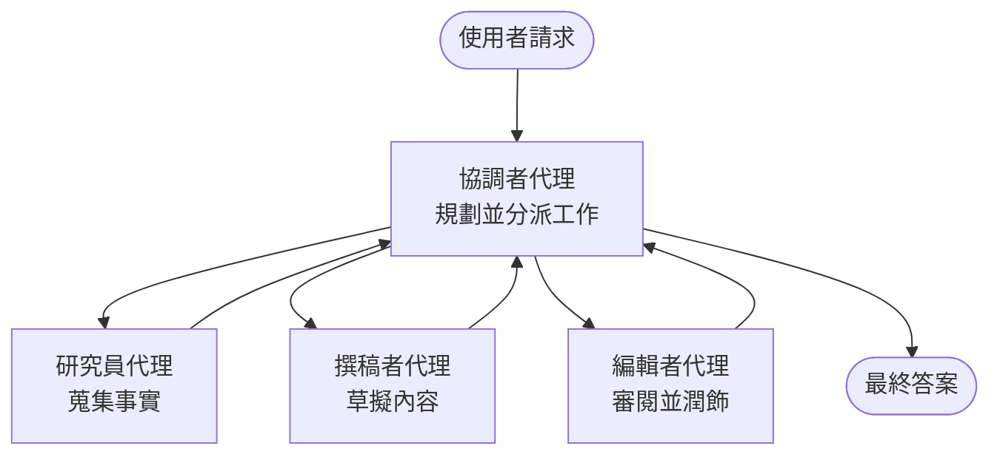

# Multi-Agent Basics - Deploy Your First Coordinated AI System

**Chapter Navigation:**
- **📚 Course Home**: [AZD 初學者指南](../../README.md)
- **📖 Current Chapter**: 第 5 章 - 多代理 AI 解決方案
- **⬅️ Previous**: [第 4 章：基礎設施](../chapter-04-infrastructure/README.md)
- **➡️ Next**: [協調模式](../chapter-06-pre-deployment/coordination-patterns.md)

> 已於 2026 年 6 月以 `azd 1.25.6` 進行驗證。

## 介紹

在之前的章節你部署了一個單一應用程式——在第 2 章你也部署了一個單一的 AI 代理。本課堂帶你邁出下一步：部署一個 <strong>多代理系統</strong>，由數個專門化代理協同合作，解決單一代理難以良好處理的問題。

對初學者的好消息是：**你不需要新的命令。** 多代理解決方案仍然是一個 azd 專案。你仍會 `azd init`、`azd up`、測試，然後 `azd down`——工作流程跟你已知的一模一樣。改變的只是應用程式內部的「形狀」。

## 學習目標

完成本課後，你將能：
- 了解「多代理」是什麼，以及何時值得承擔額外的複雜性
- 辨識多代理系統中常見的角色（協調者 + 專家）
- 使用 `azd up` 部署一個真實可運作的多代理範本
- 了解支持多代理應用的 Azure 資源
- 知道如何驗證、自訂並安全地拆除該解決方案

## 學習成效

完成本課後，你將能夠：
- 解釋單一代理與多代理系統之間的差異
- 在「單一代理加工具」與真正的多代理設計之間做出選擇
- 使用 azd 端到端部署並測試多代理範本
- 辨識每個代理在哪裡執行以及它們如何通訊
- 清除所有資源以避免持續費用

---

## 甚麼是多代理系統？

單一 AI 代理就是一個模型搭配一組指令及（可選）一些工具。這對聚焦任務非常管用。但當任務變大——先研究、然後撰寫、再編輯、最後事實查核——把所有東西塞進一個提示會讓代理變得更慢、不那麼可靠，且不易除錯。

一個 <strong>多代理系統</strong> 將工作拆成各個專家，每個專家把一件事做得好，由一個協調者負責協同：



### 你會常見的兩種角色

| Role | Job | Example |
|------|-----|---------|
| **Orchestrator** | 決定「接下來要做什麼」，並在代理間分派工作 | 「先研究、然後撰寫、最後編輯」 |
| **Specialist** | 專注做一件事並回傳結果 | 只負責蒐集事實的「研究員」 |

### 你真的需要多個代理嗎？

從簡單開始。只有在下列情況之一為真時，才考慮多代理：

- ✅ 任務有 <strong>明確階段</strong>，各階段受益於不同指示（研究 vs. 撰寫 vs. 審核）
- ✅ 你想讓專家 <strong>平行運作</strong> 以節省時間
- ✅ 不同步驟需要 <strong>不同的工具或資料來源</strong>
- ✅ 你需要每個步驟能 <strong>獨立測試和除錯</strong>

如果你的任務只是單一問答或簡單的工具呼叫，使用 <strong>具工具的單一代理</strong>（第 2 章）會更簡單、更便宜、也更容易操作。

> **初學者提示：**「更多代理」不等於「更好」。每個代理都會增加延遲、成本，以及需要監控的項目。只有當問題明顯可拆分為多個部分時才增加代理。

---

## 在 Azure 上構建多代理的兩種方式

| Approach | What it is | Best for |
|----------|-----------|----------|
| **Single agent + tools** | 一個 Foundry 代理呼叫函式/工具 | 簡單工作流程、入門 |
| **Multiple coordinated agents** | 幾個代理由協調者協同工作 | 明確階段、平行工作、專業分工 |

本課著重第二種方式，使用一個 <strong>現成範本</strong>，讓你先看到真實的多代理系統運作，再去建立自己的系統。

---

## 實作：部署一個可運作的多代理應用

我們將部署 **Contoso Creative Writer**，這是官方的 Azure 範例，使用多個代理（研究員、撰寫者、編輯者）協同產出文章。這是個很適合的第一個多代理應用，因為各角色容易理解。

### 第 1 步：初始化範本

```bash
# 建立工作資料夾
mkdir creative-writer && cd creative-writer

# 從官方多代理範本初始化
azd init --template contoso-creative-writer
```

> 隨時可在 [Awesome AZD AI gallery](https://azure.github.io/awesome-azd/?tags=ai) 瀏覽更多多代理範本。其他友善的入門選項包括 `get-started-with-ai-agents` 和 `azure-ai-travel-agents`。

### 第 2 步：驗證身分

```bash
# azd 工作流程所需
azd auth login
```

### 第 3 步：建立環境

```bash
azd env new dev
```

### 第 4 步：預覽，然後部署

```bash
# 在花費任何費用之前，先檢視將會建立的項目（建議）
azd provision --preview

# 一步完成基礎設施佈建並部署所有代理
azd up
```

`azd up` 會提示選取訂閱與地區，接著佈建 Azure 資源並部署應用。AI 部署可能比單純的 Web 應用花更久時間——如果你正在部署較大型的模型，可以延長部署的逾時時間：

```bash
azd deploy --timeout 1800
```

> **關於成本與容量的提醒：** 多代理應用會部署消耗配額且產生成本的 AI 模型。如果 `azd up` 因模型配額失敗，請參閱 [AI Troubleshooting](../chapter-07-troubleshooting/ai-troubleshooting.md) 以取得地區與配額的修正資訊，及第 6 章的 [容量規劃](../chapter-06-pre-deployment/capacity-planning.md)。

---

## 了解你所部署的內容

像本範例的典型多代理應用會佈建一組 Azure 資源，這些資源直接對應到上面圖示中的責任：

| Resource | Why it's there |
|----------|----------------|
| **Microsoft Foundry / Models** | 主機每個代理使用的語言模型 |
| **Azure AI Search** | 提供研究代理可檢索的具體資料 |
| **Container Apps** (or App Service) | 承載協調者與代理程式碼 |
| **Cosmos DB** (in some samples) | 儲存代理之間傳遞的共享狀態/記憶 |
| **Application Insights** | 跟蹤跨代理的請求，以便除錯流程 |

### 代理之間如何互相通訊

在大多數 azd 的多代理範例中，<strong>協調者在你的應用程式碼中執行</strong>（例如使用像 Semantic Kernel 或 Microsoft Agent Framework 這類框架）。協調者依序呼叫各個專家代理，傳遞結果，並組裝最終答案。代理共享上下文的方式包括：

- **函式/工具呼叫** — 協調者呼叫專家代理並取得回傳結果
- <strong>共享記憶</strong> — 一個資料庫（通常是 Cosmos DB）保存狀態，供代理共享讀取
- **訊息/事件** — 為了鬆耦合，代理透過佇列或 Service Bus 傳遞訊息

> **為何這對除錯重要：** 因為每個步驟是分開的，Application Insights 可讓你看到是哪個代理速度慢或失敗。這就是當初把工作拆成多個代理的一大原因。

---

## 驗證部署

在繼續之前，先確認系統實際運作：

```bash
# 顯示已部署的端點
azd show

# 開啟應用程式的監控儀表板
azd monitor

# 若發現異常，即時追蹤日誌
azd monitor --logs
```

然後從 `azd show` 打開應用程式的 URL，嘗試發出一個會觸發所有代理的請求（對 Creative Writer，請求它就某個主題寫一篇短文）。在 Application Insights 的 **transaction search** 中，你應該會看到該請求在研究員、撰寫者與編輯步驟間展開。

**成功標準：**
- ✅ `azd show` 列出一個可存取的端點
- ✅ 一個請求產生明顯經過多個階段的結果
- ✅ Application Insights 顯示多個代理步驟的追蹤記錄

---

## 自訂：新增或調整代理

因為每個代理只是指令加工具，自訂相對容易：

1. <strong>在範本中找到代理定義</strong>（通常是 `prompts/`、`agents/`，或 `*.prompty` 的一組檔案）。
2. <strong>調整代理的指示</strong>——例如，告訴編輯代理強制特定語氣或字數限制。
3. <strong>僅重新部署程式碼</strong>（基礎設施不變）：

   ```bash
   azd deploy
   ```

若要更進一步並從你自己的宣告檔建立代理，請使用代理擴充套件及其完整生命週期：

```bash
azd extension install azure.ai.agents
azd ai agent init -m agent-manifest.yaml
azd up
azd ai agent invoke      # 測試，包含回應時間
```

請參閱 [第 2 章：代理](../chapter-02-ai-development/agents.md) 與 [AZD AI CLI 參考](../chapter-08-production/production-ai-practices.md#azd-ai-cli-commands-and-extensions) 以取得完整的代理生命週期（`invoke`, `eval generate`, `optimize`, `delete`）。

---

## 清理

多代理應用會執行多個可計費服務。完成後請拆除所有資源：

```bash
azd down --force --purge
```

`--purge` 旗標也會移除軟刪除的 AI 資源（例如 Foundry/Azure AI Services 帳戶），以免它們阻礙未來的重新部署或繼續產生成本。

---

## 關於生產環境的多代理系統

本倉儲中的 [Retail Multi-Agent Solution](../../examples/retail-scenario.md) 是一個 <strong>架構藍圖</strong>，而不是一個一鍵部署的範本——它說明了生產零售系統 <em>會如何</em> 建置（並明確指出完整建置是一項龐大的工作）。在你在此處部署並運行一個範例後，可將其用作設計參考。至於生產環境的考量（韌性、成本、監控、治理），請繼續閱讀 [第 8 章：生產 AI 實務](../chapter-08-production/production-ai-practices.md)。

---

## 小結

- 多代理系統將工作分給由協調者協同的各個專家。
- 只有在任務具有明確階段、需要平行處理或每步驟需不同工具時才使用——否則優先單一代理。
- azd 的工作流程不變：`azd init` → `azd up` → 測試 → `azd down`。
- 使用像 `contoso-creative-writer` 這類真實範本，讓你今天就能看到並自訂一個可運作的多代理應用。
- 跨代理的 Application Insights 追蹤是多代理設計最實際的好處之一。

---

## 🔗 Navigation

| Direction | Lesson |
|-----------|--------|
| **Previous** | [第 4 章：基礎設施](../chapter-04-infrastructure/README.md) |
| **Next** | [協調模式](../chapter-06-pre-deployment/coordination-patterns.md) |

## 📖 相關資源

- [AI Agents Guide](../chapter-02-ai-development/agents.md)
- [協調模式](../chapter-06-pre-deployment/coordination-patterns.md)
- [生產 AI 實務](../chapter-08-production/production-ai-practices.md)
- [AI Troubleshooting](../chapter-07-troubleshooting/ai-troubleshooting.md)

---

<!-- CO-OP TRANSLATOR DISCLAIMER START -->
**免責聲明**：
本文件使用 AI 翻譯服務 [Co-op Translator](https://github.com/Azure/co-op-translator) 進行翻譯。雖然我們力求準確，但請注意，自動翻譯可能包含錯誤或不準確之處。原始文件的母語版本應被視為權威來源。對於重要資訊，建議尋求專業人工翻譯。我們不對因使用本翻譯而引起的任何誤解或曲解承擔責任。
<!-- CO-OP TRANSLATOR DISCLAIMER END -->