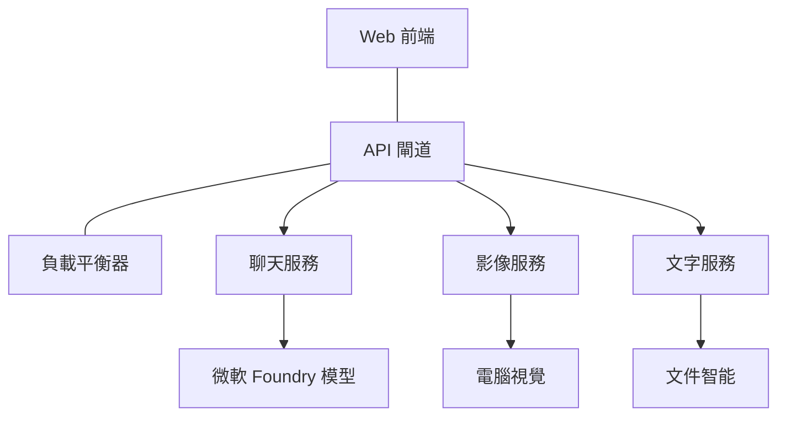

# 使用 AZD 的生產 AI 工作負載最佳實務

**Chapter Navigation:**
- **📚 Course Home**: [AZD 新手入門](../../README.md)
- **📖 Current Chapter**: 第 8 章 - 生產與企業範式
- **⬅️ Previous Chapter**: [第 7 章：故障排除](../chapter-07-troubleshooting/debugging.md)
- **⬅️ Also Related**: [AI 工作坊實驗室](ai-workshop-lab.md)
- **🎯 Course Complete**: [AZD 新手入門](../../README.md)

## 概覽

本指南提供使用 Azure Developer CLI (AZD) 部署生產就緒 AI 工作負載的完整最佳實務。根據 Microsoft Foundry Discord 社群的回饋與實際客戶部署經驗，這些做法針對生產 AI 系統中最常見的挑戰提出解決方案。

## 解決的主要挑戰

根據我們社群投票結果，以下是開發者面臨的主要挑戰：

- **45%** 在多服務 AI 部署方面遇到困難
- **38%** 在憑證與祕密管理上有問題  
- **35%** 覺得生產就緒與擴充很困難
- **32%** 需要更好的成本優化策略
- **29%** 需要改善監控與故障排查

## 生產 AI 的架構範式

### 範式 1：微服務 AI 架構

<strong>適用時機</strong>：具有多種功能的複雜 AI 應用程式



**AZD 實作**：

```yaml
# azure.yaml
name: enterprise-ai-platform
services:
  web:
    project: ./web
    host: staticwebapp
  api-gateway:
    project: ./api-gateway
    host: containerapp
  chat-service:
    project: ./services/chat
    host: containerapp
  vision-service:
    project: ./services/vision
    host: containerapp
  text-service:
    project: ./services/text
    host: containerapp
```

### 範式 2：事件驅動的 AI 處理

<strong>適用時機</strong>：批次處理、文件分析、非同步工作流程

```bicep
// Event Hub for AI processing pipeline
resource eventHub 'Microsoft.EventHub/namespaces@2023-01-01-preview' = {
  name: eventHubNamespaceName
  location: location
  sku: {
    name: 'Standard'
    tier: 'Standard'
    capacity: 1
  }
}

// Service Bus for reliable message processing
resource serviceBus 'Microsoft.ServiceBus/namespaces@2022-10-01-preview' = {
  name: serviceBusNamespaceName
  location: location
  sku: {
    name: 'Premium'
    tier: 'Premium'
    capacity: 1
  }
}

// Function App for processing
resource functionApp 'Microsoft.Web/sites@2023-01-01' = {
  name: functionAppName
  location: location
  kind: 'functionapp,linux'
  properties: {
    siteConfig: {
      appSettings: [
        {
          name: 'FUNCTIONS_EXTENSION_VERSION'
          value: '~4'
        }
        {
          name: 'AZURE_OPENAI_ENDPOINT'
          value: '@Microsoft.KeyVault(VaultName=${keyVault.name};SecretName=openai-endpoint)'
        }
      ]
    }
  }
}
```

## 關於 AI 代理的健康狀態思維

當傳統的網頁應用程式故障時，症狀很熟悉：頁面無法載入、API 回傳錯誤或部署失敗。AI 驅動的應用程式也會以這些方式故障——但它們也可能以較微妙的方式異常，並不會產生明顯的錯誤訊息。

本節協助你建立監控 AI 工作負載的心智模型，讓你在系統不如預期時知道該往哪裡看。

### 代理健康與傳統應用健康的不同

傳統應用程式要麼正常，要麼不正常。AI 代理看起來可能正常，但產生的結果卻很差。可以將代理健康視為兩層：

| 層級 | 觀察項目 | 查找位置 |
|-------|--------------|---------------|
| <strong>基礎設施健康</strong> | 服務是否在執行？資源是否已佈建？端點是否可達？ | `azd monitor`, Azure Portal 資源健康, container/app 日誌 |
| <strong>行為健康</strong> | 代理是否回應準確？回應是否及時？模型呼叫是否正確？ | Application Insights 追蹤、模型呼叫延遲度量、回應品質日誌 |

基礎設施健康是熟悉的——對任何 azd 應用程式都是一樣的。行為健康是 AI 工作負載新增的一層。

### 當 AI 應用程式行為不如預期時該往哪裡看

如果你的 AI 應用程式未產生預期結果，以下是一份概念性檢查清單：

1. **從基礎開始檢查。** 應用程式是否在執行？是否能連到它的相依服務？像檢查任何應用程式一樣，查看 `azd monitor` 與資源健康狀態。
2. **檢查模型連線。** 你的應用程式是否成功呼叫 AI 模型？模型呼叫失敗或逾時是 AI 應用問題最常見的原因，會顯示在你的應用程式日誌中。
3. **查看模型收到的內容。** AI 的回應取決於輸入（prompt 與任何檢索到的上下文）。如果輸出錯誤，通常是輸入有問題。檢查你的應用程式是否傳送正確的資料給模型。
4. **檢閱回應延遲。** AI 模型呼叫比典型的 API 呼叫慢。如果你的應用程式感覺遲緩，檢查模型回應時間是否增加——這可能表示被節流、容量限制或區域層級的壅塞。
5. **留意成本訊號。** 權杖使用量或 API 呼叫出現意外尖峰，可能表示迴圈、設定錯誤的 prompt，或過度重試。

你不需要立刻精通可觀察性工具。關鍵要點是 AI 應用程式有一層額外的行為需要監控，而 azd 的內建監控（`azd monitor`）能為你調查這兩層提供起點。

---

## 安全最佳實務

### 1. 零信任安全模型

<strong>實作策略</strong>：
- 未經驗證不得進行服務對服務的通訊
- 所有 API 呼叫使用受管理的身分識別
- 使用私人端點進行網路隔離
- 最小權限存取控制

```bicep
// Managed Identity for each service
resource chatServiceIdentity 'Microsoft.ManagedIdentity/userAssignedIdentities@2023-01-31' = {
  name: 'chat-service-identity'
  location: location
}

// Role assignments with minimal permissions
resource openAIUserRole 'Microsoft.Authorization/roleAssignments@2022-04-01' = {
  scope: openAIAccount
  name: guid(openAIAccount.id, chatServiceIdentity.id, openAIUserRoleDefinitionId)
  properties: {
    roleDefinitionId: subscriptionResourceId('Microsoft.Authorization/roleDefinitions', '5e0bd9bd-7b93-4f28-af87-19fc36ad61bd')
    principalId: chatServiceIdentity.properties.principalId
    principalType: 'ServicePrincipal'
  }
}
```

### 2. 安全的祕密管理

**Key Vault 整合範式**：

```bicep
// Key Vault with proper access policies
resource keyVault 'Microsoft.KeyVault/vaults@2023-02-01' = {
  name: keyVaultName
  location: location
  properties: {
    tenantId: tenant().tenantId
    sku: {
      family: 'A'
      name: 'premium'  // Use premium for production
    }
    enableRbacAuthorization: true  // Use RBAC instead of access policies
    enablePurgeProtection: true    // Prevent accidental deletion
    enableSoftDelete: true
    softDeleteRetentionInDays: 90
  }
}

// Store all AI service credentials
resource openAIKeySecret 'Microsoft.KeyVault/vaults/secrets@2023-02-01' = {
  parent: keyVault
  name: 'openai-api-key'
  properties: {
    value: openAIAccount.listKeys().key1
    attributes: {
      enabled: true
    }
  }
}
```

### 3. 網路安全

<strong>私人端點設定</strong>：

```bicep
// Virtual Network for AI services
resource virtualNetwork 'Microsoft.Network/virtualNetworks@2023-04-01' = {
  name: vnetName
  location: location
  properties: {
    addressSpace: {
      addressPrefixes: ['10.0.0.0/16']
    }
    subnets: [
      {
        name: 'ai-services-subnet'
        properties: {
          addressPrefix: '10.0.1.0/24'
          privateEndpointNetworkPolicies: 'Disabled'
        }
      }
      {
        name: 'app-services-subnet'
        properties: {
          addressPrefix: '10.0.2.0/24'
          delegations: [
            {
              name: 'Microsoft.Web/serverFarms'
              properties: {
                serviceName: 'Microsoft.Web/serverFarms'
              }
            }
          ]
        }
      }
    ]
  }
}

// Private endpoints for all AI services
resource openAIPrivateEndpoint 'Microsoft.Network/privateEndpoints@2023-04-01' = {
  name: '${openAIAccountName}-pe'
  location: location
  properties: {
    subnet: {
      id: virtualNetwork.properties.subnets[0].id
    }
    privateLinkServiceConnections: [
      {
        name: 'openai-connection'
        properties: {
          privateLinkServiceId: openAIAccount.id
          groupIds: ['account']
        }
      }
    ]
  }
}
```

## 效能與擴充

### 1. 自動擴充策略

**Container Apps 自動擴充**：

```bicep
resource containerApp 'Microsoft.App/containerApps@2023-05-01' = {
  name: containerAppName
  location: location
  properties: {
    configuration: {
      ingress: {
        external: true
        targetPort: 8000
        transport: 'http'
      }
    }
    template: {
      scale: {
        minReplicas: 2  // Always have 2 instances minimum
        maxReplicas: 50 // Scale up to 50 for high load
        rules: [
          {
            name: 'http-scaling'
            http: {
              metadata: {
                concurrentRequests: '20'  // Scale when >20 concurrent requests
              }
            }
          }
          {
            name: 'cpu-scaling'
            custom: {
              type: 'cpu'
              metadata: {
                type: 'Utilization'
                value: '70'  // Scale when CPU >70%
              }
            }
          }
        ]
      }
    }
  }
}
```

### 2. 快取策略

**用於 AI 回應的 Redis 快取**：

```bicep
// Redis Premium for production workloads
resource redisCache 'Microsoft.Cache/redis@2023-04-01' = {
  name: redisCacheName
  location: location
  properties: {
    sku: {
      name: 'Premium'
      family: 'P'
      capacity: 1
    }
    enableNonSslPort: false
    minimumTlsVersion: '1.2'
    redisConfiguration: {
      'maxmemory-policy': 'allkeys-lru'
    }
    // Enable clustering for high availability
    redisVersion: '6.0'
    shardCount: 2
  }
}

// Cache configuration in application
var cacheConnectionString = '${redisCache.properties.hostName}:6380,password=${redisCache.listKeys().primaryKey},ssl=True,abortConnect=False'
```

### 3. 負載平衡與流量管理

**搭配 WAF 的 Application Gateway**：

```bicep
// Application Gateway with Web Application Firewall
resource applicationGateway 'Microsoft.Network/applicationGateways@2023-04-01' = {
  name: appGatewayName
  location: location
  properties: {
    sku: {
      name: 'WAF_v2'
      tier: 'WAF_v2'
      capacity: 2
    }
    webApplicationFirewallConfiguration: {
      enabled: true
      firewallMode: 'Prevention'
      ruleSetType: 'OWASP'
      ruleSetVersion: '3.2'
    }
    // Backend pools for AI services
    backendAddressPools: [
      {
        name: 'ai-services-pool'
        properties: {
          backendAddresses: [
            {
              fqdn: '${containerApp.properties.configuration.ingress.fqdn}'
            }
          ]
        }
      }
    ]
  }
}
```

## 💰 成本優化

### 1. 資源適當調整規模

<strong>環境特定設定</strong>：

```bash
# 開發環境
azd env new development
azd env set AZURE_OPENAI_SKU "S0"
azd env set AZURE_OPENAI_CAPACITY 10
azd env set AZURE_SEARCH_SKU "basic"
azd env set CONTAINER_CPU 0.5
azd env set CONTAINER_MEMORY 1.0

# 生產環境
azd env new production
azd env set AZURE_OPENAI_SKU "S0"
azd env set AZURE_OPENAI_CAPACITY 100
azd env set AZURE_SEARCH_SKU "standard"
azd env set CONTAINER_CPU 2.0
azd env set CONTAINER_MEMORY 4.0
```

### 2. 成本監控與預算

```bicep
// Cost management and budgets
resource budget 'Microsoft.Consumption/budgets@2023-05-01' = {
  name: 'ai-workload-budget'
  properties: {
    timePeriod: {
      startDate: '2024-01-01'
      endDate: '2024-12-31'
    }
    timeGrain: 'Monthly'
    amount: 2000  // $2000 monthly budget
    category: 'Cost'
    notifications: {
      warning: {
        enabled: true
        operator: 'GreaterThan'
        threshold: 80
        contactEmails: [
          'finance@company.com'
          'engineering@company.com'
        ]
        contactRoles: [
          'Owner'
          'Contributor'
        ]
      }
      critical: {
        enabled: true
        operator: 'GreaterThan'
        threshold: 95
        contactEmails: [
          'cto@company.com'
        ]
      }
    }
  }
}
```

### 3. 權杖使用最佳化

**OpenAI 成本管理**：

```typescript
// 應用程式層級的代幣優化
class TokenOptimizer {
  private readonly maxTokens = 4000;
  private readonly reserveTokens = 500;
  
  optimizePrompt(userInput: string, context: string): string {
    const availableTokens = this.maxTokens - this.reserveTokens;
    const estimatedTokens = this.estimateTokens(userInput + context);
    
    if (estimatedTokens > availableTokens) {
      // 截斷上下文，而非使用者輸入
      context = this.truncateContext(context, availableTokens - this.estimateTokens(userInput));
    }
    
    return `${context}\n\nUser: ${userInput}`;
  }
  
  private estimateTokens(text: string): number {
    // 粗略估算：1 個代幣 ≈ 4 個字元
    return Math.ceil(text.length / 4);
  }
}
```

## 監控與可觀察性

### 1. 全面性的 Application Insights

```bicep
// Application Insights with advanced features
resource applicationInsights 'Microsoft.Insights/components@2020-02-02' = {
  name: applicationInsightsName
  location: location
  kind: 'web'
  properties: {
    Application_Type: 'web'
    WorkspaceResourceId: logAnalyticsWorkspace.id
    SamplingPercentage: 100  // Full sampling for AI apps
    DisableIpMasking: false  // Enable for security
  }
}

// Custom metrics for AI operations
resource aiMetricAlerts 'Microsoft.Insights/metricAlerts@2018-03-01' = {
  name: 'ai-high-error-rate'
  location: 'global'
  properties: {
    description: 'Alert when AI service error rate is high'
    severity: 2
    enabled: true
    scopes: [
      applicationInsights.id
    ]
    evaluationFrequency: 'PT1M'
    windowSize: 'PT5M'
    criteria: {
      'odata.type': 'Microsoft.Azure.Monitor.SingleResourceMultipleMetricCriteria'
      allOf: [
        {
          name: 'high-error-rate'
          metricName: 'requests/failed'
          operator: 'GreaterThan'
          threshold: 10
          timeAggregation: 'Count'
        }
      ]
    }
  }
}
```

### 2. AI 專屬監控

**AI 指標的自訂儀表板**：

```json
// Dashboard configuration for AI workloads
{
  "dashboard": {
    "name": "AI Application Monitoring",
    "tiles": [
      {
        "name": "OpenAI Request Volume",
        "query": "requests | where name contains 'openai' | summarize count() by bin(timestamp, 5m)"
      },
      {
        "name": "AI Response Latency",
        "query": "requests | where name contains 'openai' | summarize avg(duration) by bin(timestamp, 5m)"
      },
      {
        "name": "Token Usage",
        "query": "customMetrics | where name == 'openai_tokens_used' | summarize sum(value) by bin(timestamp, 1h)"
      },
      {
        "name": "Cost per Hour",
        "query": "customMetrics | where name == 'openai_cost' | summarize sum(value) by bin(timestamp, 1h)"
      }
    ]
  }
}
```

### 3. 健康檢查與可用性監控

```bicep
// Application Insights availability tests
resource availabilityTest 'Microsoft.Insights/webtests@2022-06-15' = {
  name: 'ai-app-availability-test'
  location: location
  tags: {
    'hidden-link:${applicationInsights.id}': 'Resource'
  }
  properties: {
    SyntheticMonitorId: 'ai-app-availability-test'
    Name: 'AI Application Availability Test'
    Description: 'Tests AI application endpoints'
    Enabled: true
    Frequency: 300  // 5 minutes
    Timeout: 120    // 2 minutes
    Kind: 'ping'
    Locations: [
      {
        Id: 'us-east-2-azr'
      }
      {
        Id: 'us-west-2-azr'
      }
    ]
    Configuration: {
      WebTest: '''
        <WebTest Name="AI Health Check" 
                 Id="8d2de8d2-a2b0-4c2e-9a0d-8f9c9a0b8c8d" 
                 Enabled="True" 
                 CssProjectStructure="" 
                 CssIteration="" 
                 Timeout="120" 
                 WorkItemIds="" 
                 xmlns="http://microsoft.com/schemas/VisualStudio/TeamTest/2010" 
                 Description="" 
                 CredentialUserName="" 
                 CredentialPassword="" 
                 PreAuthenticate="True" 
                 Proxy="default" 
                 StopOnError="False" 
                 RecordedResultFile="" 
                 ResultsLocale="">
          <Items>
            <Request Method="GET" 
                     Guid="a5f10126-e4cd-570d-961c-cea43999a200" 
                     Version="1.1" 
                     Url="${webApp.properties.defaultHostName}/health" 
                     ThinkTime="0" 
                     Timeout="120" 
                     ParseDependentRequests="True" 
                     FollowRedirects="True" 
                     RecordResult="True" 
                     Cache="False" 
                     ResponseTimeGoal="0" 
                     Encoding="utf-8" 
                     ExpectedHttpStatusCode="200" 
                     ExpectedResponseUrl="" 
                     ReportingName="" 
                     IgnoreHttpStatusCode="False" />
          </Items>
        </WebTest>
      '''
    }
  }
}
```

## 災難復原與高可用性

### 1. 多地區部署

```yaml
# azure.yaml - Multi-region configuration
name: ai-app-multiregion
services:
  api-primary:
    project: ./api
    host: containerapp
    env:
      - AZURE_REGION=eastus
  api-secondary:
    project: ./api
    host: containerapp
    env:
      - AZURE_REGION=westus2
```

```bicep
// Traffic Manager for global load balancing
resource trafficManager 'Microsoft.Network/trafficManagerProfiles@2022-04-01' = {
  name: trafficManagerProfileName
  location: 'global'
  properties: {
    profileStatus: 'Enabled'
    trafficRoutingMethod: 'Priority'
    dnsConfig: {
      relativeName: trafficManagerProfileName
      ttl: 30
    }
    monitorConfig: {
      protocol: 'HTTPS'
      port: 443
      path: '/health'
      intervalInSeconds: 30
      toleratedNumberOfFailures: 3
      timeoutInSeconds: 10
    }
    endpoints: [
      {
        name: 'primary-endpoint'
        type: 'Microsoft.Network/trafficManagerProfiles/azureEndpoints'
        properties: {
          targetResourceId: primaryAppService.id
          endpointStatus: 'Enabled'
          priority: 1
        }
      }
      {
        name: 'secondary-endpoint'
        type: 'Microsoft.Network/trafficManagerProfiles/azureEndpoints'
        properties: {
          targetResourceId: secondaryAppService.id
          endpointStatus: 'Enabled'
          priority: 2
        }
      }
    ]
  }
}
```

### 2. 資料備份與復原

```bicep
// Backup configuration for critical data
resource backupVault 'Microsoft.DataProtection/backupVaults@2023-05-01' = {
  name: backupVaultName
  location: location
  identity: {
    type: 'SystemAssigned'
  }
  properties: {
    storageSettings: [
      {
        datastoreType: 'VaultStore'
        type: 'LocallyRedundant'
      }
    ]
  }
}

// Backup policy for AI models and data
resource backupPolicy 'Microsoft.DataProtection/backupVaults/backupPolicies@2023-05-01' = {
  parent: backupVault
  name: 'ai-data-backup-policy'
  properties: {
    policyRules: [
      {
        backupParameters: {
          backupType: 'Full'
          objectType: 'AzureBackupParams'
        }
        trigger: {
          schedule: {
            repeatingTimeIntervals: [
              'R/2024-01-01T02:00:00+00:00/P1D'  // Daily at 2 AM
            ]
          }
          objectType: 'ScheduleBasedTriggerContext'
        }
        dataStore: {
          datastoreType: 'VaultStore'
          objectType: 'DataStoreInfoBase'
        }
        name: 'BackupDaily'
        objectType: 'AzureBackupRule'
      }
    ]
  }
}
```

## DevOps 與 CI/CD 整合

### 1. GitHub Actions Workflow

```yaml
# .github/workflows/deploy-ai-app.yml
name: Deploy AI Application

on:
  push:
    branches: [main]
  pull_request:
    branches: [main]

jobs:
  test:
    runs-on: ubuntu-latest
    steps:
      - uses: actions/checkout@v4
      
      - name: Setup Python
        uses: actions/setup-python@v4
        with:
          python-version: '3.11'
          
      - name: Install dependencies
        run: |
          pip install -r requirements.txt
          pip install pytest
          
      - name: Run tests
        run: pytest tests/
        
      - name: AI Safety Tests
        run: |
          python scripts/test_ai_safety.py
          python scripts/validate_prompts.py

  deploy-staging:
    needs: test
    if: github.event_name == 'pull_request'
    runs-on: ubuntu-latest
    steps:
      - uses: actions/checkout@v4
      
      - name: Setup AZD
        uses: Azure/setup-azd@v2
        
      - name: Login to Azure
        uses: azure/login@v1
        with:
          creds: ${{ secrets.AZURE_CREDENTIALS }}
          
      - name: Deploy to Staging
        run: |
          azd env select staging
          azd deploy

  deploy-production:
    needs: test
    if: github.ref == 'refs/heads/main'
    runs-on: ubuntu-latest
    steps:
      - uses: actions/checkout@v4
      
      - name: Setup AZD
        uses: Azure/setup-azd@v2
        
      - name: Login to Azure
        uses: azure/login@v1
        with:
          creds: ${{ secrets.AZURE_CREDENTIALS }}
          
      - name: Deploy to Production
        run: |
          azd env select production
          azd deploy
          
      - name: Run Production Health Checks
        run: |
          python scripts/health_check.py --env production
```

### 2. 基礎設施驗證

```bash
# scripts/validate_infrastructure.sh
#!/bin/bash

echo "Validating AI infrastructure deployment..."

# 檢查所有所需的服務是否正在執行
services=("openai" "search" "storage" "keyvault")
for service in "${services[@]}"; do
    echo "Checking $service..."
    if ! az resource list --resource-type "Microsoft.CognitiveServices/accounts" --query "[?contains(name, '$service')]" -o tsv; then
        echo "ERROR: $service not found"
        exit 1
    fi
done

# 驗證 OpenAI 模型部署
echo "Validating OpenAI model deployments..."
models=$(az cognitiveservices account deployment list --name $AZURE_OPENAI_NAME --resource-group $AZURE_RESOURCE_GROUP --query "[].name" -o tsv)
if [[ ! $models == *"gpt-4.1-mini"* ]]; then
  echo "ERROR: Required model gpt-4.1-mini not deployed"
    exit 1
fi

# 測試 AI 服務連線
echo "Testing AI service connectivity..."
python scripts/test_connectivity.py

echo "Infrastructure validation completed successfully!"
```

## 生產準備檢查清單

### 安全 ✅
- [ ] 所有服務使用受管理的身分識別
- [ ] 祕密儲存在 Key Vault
- [ ] 已設定私人端點
- [ ] 已實施網路安全群組
- [ ] RBAC 以最小權限
- [ ] 在公開端點啟用 WAF

### 效能 ✅
- [ ] 已設定自動擴充
- [ ] 已實作快取
- [ ] 已設定負載平衡
- [ ] 靜態內容使用 CDN
- [ ] 資料庫連線池
- [ ] 權杖使用最佳化

### 監控 ✅
- [ ] 已設定 Application Insights
- [ ] 已定義自訂指標
- [ ] 已設定警示規則
- [ ] 已建立儀表板
- [ ] 已實作健康檢查
- [ ] 日誌保留政策

### 可靠性 ✅
- [ ] 多地區部署
- [ ] 備份與復原計畫
- [ ] 已實作斷路器
- [ ] 已設定重試策略
- [ ] 優雅降級
- [ ] 健康檢查端點

### 成本管理 ✅
- [ ] 已設定預算警示
- [ ] 資源調整為適當規模
- [ ] 已套用開發/測試折扣
- [ ] 已購買預留實例
- [ ] 成本監控儀表板
- [ ] 定期成本檢討

### 合規 ✅
- [ ] 符合資料駐留要求
- [ ] 已啟用稽核日誌
- [ ] 已套用合規政策
- [ ] 已實作安全基準
- [ ] 定期安全評估
- [ ] 事件回應計畫

## 效能基準

### 典型生產指標

| 指標 | 目標 | 監控 |
|--------|--------|------------|
| <strong>回應時間</strong> | < 2 seconds | Application Insights |
| <strong>可用性</strong> | 99.9% | 可用性監控 |
| <strong>錯誤率</strong> | < 0.1% | 應用程式日誌 |
| <strong>權杖使用</strong> | < $500/month | 成本管理 |
| <strong>同時使用者</strong> | 1000+ | 負載測試 |
| <strong>恢復時間</strong> | < 1 hour | 災難復原測試 |

### 負載測試

```bash
# 用於 AI 應用程式的負載測試腳本
python scripts/load_test.py \
  --endpoint https://your-ai-app.azurewebsites.net \
  --concurrent-users 100 \
  --duration 300 \
  --ramp-up 60
```

## 🤝 社群最佳實務

根據 Microsoft Foundry Discord 社群回饋：

### 社群的主要建議：

1. **從小開始，逐步擴充**：以基本 SKU 起步，根據實際使用情況再擴充
2. <strong>監控一切</strong>：從第一天起就建立全面的監控
3. <strong>自動化安全</strong>：使用基礎設施即程式碼以確保安全一致性
4. <strong>完整測試</strong>：在你的管線中加入 AI 專屬測試
5. <strong>規劃成本</strong>：監控權杖使用並及早設定預算警示

### 常見陷阱要避免：

- ❌ 在程式碼中硬編 API 金鑰
- ❌ 未設定適當的監控
- ❌ 忽略成本優化
- ❌ 未測試失敗情境
- ❌ 部署時未加上健康檢查

## AZD AI CLI 指令與擴充套件

AZD 包含一組日益成長的 AI 專屬指令與擴充套件，可簡化生產 AI 的工作流程。這些工具縮短了 AI 工作負載從本地開發到生產部署之間的落差。

### AZD 的 AI 擴充套件

AZD 使用擴充系統來加入 AI 專屬功能。使用以下指令安裝與管理擴充套件：

```bash
# 列出所有可用擴充功能（包括 AI）
azd extension list

# 檢視已安裝擴充功能的詳細資料
azd extension show azure.ai.agents

# 安裝 Foundry agents 擴充功能
azd extension install azure.ai.agents

# 安裝微調擴充功能
azd extension install azure.ai.finetune

# 安裝自訂模型擴充功能
azd extension install azure.ai.models

# 升級所有已安裝的擴充功能
azd extension upgrade --all
```

**可用的 AI 擴充套件：**

| 擴充套件 | 目的 | 狀態 |
|-----------|---------|--------|
| `azure.ai.agents` | Foundry Agent Service 管理 | 預覽 |
| `azure.ai.skills` | 可重複使用的代理技能 | 預覽 |
| `azure.ai.connections` | Foundry 連線（資料來源、工具） | 預覽 |
| `azure.ai.finetune` | Foundry 模型微調 | 預覽 |
| `azure.ai.models` | Foundry 自訂模型 | 預覽 |
| `azure.coding-agent` | 程式編寫代理設定 | 可用 |

> `azure.ai.agents` 擴充套件變化很快。本課程已針對 `0.1.40-preview` 進行驗證。執行 `azd extension upgrade --all` 以取得最新指令集，並以 `azd extension show azure.ai.agents` 確認你安裝的版本。

**什麼是更新的 `skills` 與 `connections` 擴充套件？**

有兩個預覽擴充套件與代理工具一同出現，值得初學者了解：

- **`azure.ai.skills`** — 一個 **skill（技能）** 是可重複使用的能力（打包的工具或行為），你可以將它附加到一個或多個代理，而不是每次都重新實作。把它想像成共用的建構模組：定義一次「搜尋文件」或「查詢訂單」的技能，然後在多個代理間重複使用。這能讓多代理系統（第 5 章）保持一致，避免複製貼上。
- **`azure.ai.connections`** — 一個 **connection（連線）** 是你的 Foundry 專案到代理需要的外部資源（資料來源，如 Azure AI Search）、工具端點或其他服務的受管理連結。連線把代理如何與何處存取資料集中管理，讓憑證與端點集中在一個受治理的位置，而不是散落在程式碼中。

你並不需要這些來部署你的第一批代理——在學習時先使用 `azure.ai.agents`。當你發現自己在多個代理間重複相同工具時，再使用 `skills`；若多個代理共用相同資料來源，則使用 `connections`。

### 使用 `azd ai agent init` 初始化代理專案

`azd ai agent init` 指令會為整合 Microsoft Foundry Agent Service 的生產就緒 AI 代理專案建立腳手架：

```bash
# 從代理清單初始化一個新的代理專案
azd ai agent init -m <manifest-path-or-uri>

# 初始化並將目標設定為特定的 Foundry 專案
azd ai agent init -m agent-manifest.yaml --project-id <foundry-project-id>

# 使用自訂來源目錄初始化
azd ai agent init -m agent-manifest.yaml --src ./agents/my-agent

# 將 Container Apps 指定為主機
azd ai agent init -m agent-manifest.yaml --host containerapp
```

**主要選項：**

| Flag | 說明 |
|------|-------------|
| `-m, --manifest` | 要加入專案的代理清單檔路徑或 URI |
| `-p, --project-id` | 用於你的 azd 環境的現有 Microsoft Foundry 專案 ID |
| `-s, --src` | 下載代理定義的目錄（預設為 `src/<agent-id>`） |
| `--host` | 覆寫預設主機（例如：`containerapp`） |
| `-e, --environment` | 要使用的 azd 環境 |

<strong>生產提示</strong>：使用 `--project-id` 可直接連接到既有的 Foundry 專案，從一開始就將你的代理程式碼與雲端資源關聯起來。

### 管理代理的生命週期

除了 `init` 之外，`azure.ai.agents` 擴充套件提供了託管代理完整生命週期的指令——測試、評估、優化與退役：

```bash
# 調用已部署的代理並檢視伺服器回應時間
# (總延遲與首字節時間)
azd ai agent invoke

# 在更改前顯示線上端點的設定
azd ai agent endpoint show

# 為代理生成評估資料集
azd ai agent eval generate --dataset ./eval/dataset.jsonl

# 根據你的評估資料優化代理指令
# (需要在代理專案中有 optimization_model)
azd ai agent optimize

# 下載已部署的以程式碼為基礎的託管代理原始碼
# (含 SHA-256 驗證)
azd ai agent code download

# 刪除託管代理及其所有版本
# (--force 會終止活動會話)
azd ai agent delete --force
```

**生命週期一覽：**

| 階段 | 指令 | 生產用途 |
|-------|---------|----------------|
| Test | `azd ai agent invoke` | 在釋出前驗證回應並測量延遲 |
| Inspect | `azd ai agent endpoint show` | 檢視端點的驗證/設定；及早發現破壞性變更 |
| Measure | `azd ai agent eval generate` | 從實際追蹤建立可重複的評估集 |
| Improve | `azd ai agent optimize` | 根據測量到的品質調整指令 |
| Recover | `azd ai agent code download` | 取得已部署之原始碼以進行稽核/回滾 |
| Retire | `azd ai agent delete --force` | 清理地移除代理及其版本 |

> 這些為預覽指令，且可能會在擴充套件釋出間變動。執行 `azd ai agent --help` 以查看你已安裝版本中可用的確切子指令。

### 使用 `azd mcp` 的模型上下文協定 (MCP)
AZD 包含內建的 MCP 伺服器支援（Alpha），讓 AI 代理與工具透過標準化協定與你的 Azure 資源互動：

```bash
# 為你的專案啟動 MCP 伺服器
azd mcp start

# 檢閱目前 Copilot 對工具執行的同意規則
azd copilot consent list
```

The MCP server exposes your azd project context—environments, services, and Azure resources—to AI-powered development tools. This enables:

- **AI 輔助部署**：允許程式代理查詢你的專案狀態並觸發部署
- <strong>資源探索</strong>：AI 工具可以找出你的專案使用哪些 Azure 資源
- <strong>環境管理</strong>：代理可以在 開發 / 測試 / 生產 環境間切換

### Infrastructure Generation with `azd infra generate`

針對生產環境的 AI 工作負載，你可以產生並自訂基礎設施即程式碼，而非依賴自動佈建：

```bash
# 根據你的專案定義產生 Bicep/Terraform 檔案
azd infra generate
```

這會把 IaC 寫到磁碟，讓你可以：
- 在部署前檢閱及稽核基礎設施
- 加入自訂安全原則（網路規則、私有端點）
- 整合現有的 IaC 審查流程
- 將基礎設施變更與應用程式原始碼分開版本控制

### Production Lifecycle Hooks

AZD 掛鉤允許你在部署生命週期的每個階段注入自訂邏輯——這對生產 AI 工作流程至關重要：

```yaml
# azure.yaml - Production hooks example
name: ai-production-app
hooks:
  preprovision:
    shell: sh
    run: scripts/validate-quotas.sh    # Check AI model quota before provisioning
  postprovision:
    shell: sh
    run: scripts/configure-networking.sh  # Set up private endpoints
  predeploy:
    shell: sh
    run: scripts/run-ai-safety-tests.sh  # Run prompt safety checks
  postdeploy:
    shell: sh
    run: scripts/smoke-test.sh           # Verify agent responses post-deploy
services:
  agent-api:
    project: ./src/agent
    host: containerapp
    hooks:
      predeploy:
        shell: sh
        run: scripts/validate-model-access.sh  # Per-service hook
```

```bash
# 在開發期間手動執行特定的掛鉤
azd hooks run predeploy
```

**建議用於 AI 工作負載的生產掛鉤：**

| 掛鉤 | 使用情境 |
|------|----------|
| `preprovision` | 驗證訂閱配額以支援 AI 模型容量 |
| `postprovision` | 設定私有端點，部署模型權重 |
| `predeploy` | 執行 AI 安全測試，驗證提示模板 |
| `postdeploy` | 對代理回應做冒煙測試，驗證模型連線性 |

### CI/CD Pipeline Configuration

使用 `azd pipeline config` 將你的專案連接到 GitHub Actions 或 Azure Pipelines，並透過安全的 Azure 認證：

```bash
# 設定 CI/CD 管道 (互動式)
azd pipeline config

# 使用特定提供者進行設定
azd pipeline config --provider github
```

此指令：
- 建立具最小權限存取的服務主體
- 設定聯合認證（不儲存祕密）
- 產生或更新你的管線定義檔
- 在你的 CI/CD 系統中設定必要的環境變數

#### Step-by-step: your first GitHub Actions pipeline

以下是從可運作的 azd 專案到在每次 push 時自動部署的完整操作流程。

**1. Make sure your project is on GitHub**

```bash
git init
git add .
git commit -m "Initial azd project"
gh repo create my-ai-app --private --source=. --push
```

**2. Run pipeline config**

```bash
azd pipeline config --provider github
```

azd 將以互動方式：
- 詢問要針對哪個 Azure 訂閱和環境
- 為管線建立 Entra **應用註冊 + 服務主體**
- 設定 **聯合認證 (OIDC)**——讓 GitHub 使用短命的權杖向 Azure 驗證，且<strong>不會儲存祕密</strong>
- 將需要的 <strong>變數</strong> 推送到你的 GitHub 儲存庫（`AZURE_CLIENT_ID`、`AZURE_TENANT_ID`、`AZURE_SUBSCRIPTION_ID`、`AZURE_ENV_NAME`、`AZURE_LOCATION`）

**3. Understand the generated workflow**

azd 會新增 `.github/workflows/azure-dev.yml`。關鍵部分看起來像這樣：

```yaml
# .github/workflows/azure-dev.yml
on:
  push:
    branches: [ main ]
  workflow_dispatch:        # lets you run it manually too

permissions:
  id-token: write           # required for OIDC federated login
  contents: read

jobs:
  build:
    runs-on: ubuntu-latest
    env:
      AZURE_CLIENT_ID: ${{ vars.AZURE_CLIENT_ID }}
      AZURE_TENANT_ID: ${{ vars.AZURE_TENANT_ID }}
      AZURE_SUBSCRIPTION_ID: ${{ vars.AZURE_SUBSCRIPTION_ID }}
      AZURE_ENV_NAME: ${{ vars.AZURE_ENV_NAME }}
      AZURE_LOCATION: ${{ vars.AZURE_LOCATION }}
    steps:
      - uses: actions/checkout@v4
      - name: Install azd
        uses: Azure/setup-azd@v2
      - name: Log in with OIDC
        run: azd auth login --client-id "$AZURE_CLIENT_ID" --federated-credential-provider "github" --tenant-id "$AZURE_TENANT_ID"
      - name: Provision infrastructure
        run: azd provision --no-prompt
      - name: Deploy application
        run: azd deploy --no-prompt
```

**4. Verify it works**

```bash
# 推送變更以觸發流水線
git commit -am "Trigger pipeline" --allow-empty
git push
```

開啟你 GitHub 儲存庫的 **Actions** 分頁，觀察工作流程自動執行 `azd provision` 與 `azd deploy`。

> **為何聯合認證很重要：** 早期的管線會在 GitHub 中儲存用戶端祕密。OIDC 聯合認證會完全移除該祕密——GitHub 在執行時請求短命權杖，這既更安全，也不需要輪換或擔心外洩。這是 `azd pipeline config` 預設會設定的方式。

> **祕密 vs. 變數：** 非敏感的識別項（`AZURE_CLIENT_ID` 等）放在儲存庫的 **variables**。若你的應用在建置時確實需要祕密，請將它新增為 GitHub 的 **secret** 並以 `${{ secrets.NAME }}` 參考——但在執行時優先使用 Key Vault + 管理識別（managed identity）（參見 [Chapter 3](../chapter-03-configuration/authsecurity.md)）。

**Production workflow with pipeline config:**

```bash
# 1. 設定生產環境
azd env new production
azd env set AZURE_OPENAI_CAPACITY 100

# 2. 設定管線
azd pipeline config --provider github

# 3. 管線會在每次推送到 main 時執行 azd deploy
```

#### Step-by-step: Azure DevOps Pipelines

比較偏好使用 Azure DevOps 而非 GitHub Actions？azd 以 `azdo` 提供者原生支援。流程幾乎相同——azd 會產生管線檔案、建立服務連線，並設定認證。

**1. Make sure you have an Azure DevOps project**

你需要在 `https://dev.azure.com/<your-org>` 擁有一個組織及專案。產生一個具備 **Build (Read & execute)**、**Code (Read & write)** 與 **Service Connections (Read, query & manage)** 權限範圍的個人存取權杖 (PAT)——azd 會提示你輸入。

**2. Configure the pipeline**

```bash
azd pipeline config --provider azdo
```

azd 會：
- 詢問你的 Azure DevOps 組織與專案
- 使用服務主體建立（或重用）連接到 Azure 的 **service connection**
- 設定 **workload identity federation (OIDC)**，以確保不儲存用戶端祕密
- 將 `azure-dev.yml` 管線定義提交到你的儲存庫

**3. Review the generated `azure-dev.yml`**

azd 會寫入一個在每次 push 到 `main` 時進行佈建與部署的管線：

```yaml
# azure-dev.yml
trigger:
  - main

pool:
  vmImage: ubuntu-latest

steps:
  - task: setup-azd@1
    displayName: Install azd

  - script: azd provision --no-prompt
    displayName: Provision Infrastructure
    env:
      AZURE_SUBSCRIPTION_ID: $(AZURE_SUBSCRIPTION_ID)
      AZURE_ENV_NAME: $(AZURE_ENV_NAME)
      AZURE_LOCATION: $(AZURE_LOCATION)

  - script: azd deploy --no-prompt
    displayName: Deploy Application
    env:
      AZURE_SUBSCRIPTION_ID: $(AZURE_SUBSCRIPTION_ID)
      AZURE_ENV_NAME: $(AZURE_ENV_NAME)
      AZURE_LOCATION: $(AZURE_LOCATION)
```

**4. Where the variables come from**

azd 將環境值（`AZURE_ENV_NAME`、`AZURE_LOCATION`、`AZURE_SUBSCRIPTION_ID`）以 **variable group** 的方式儲存在 Azure DevOps 中，供管線讀取。你可以在 **Pipelines → Library** 查看與編輯它們。

> **與 GitHub 相同的 OIDC 優勢：** `azdo` 提供者預設也會設定 workload identity federation，因此服務連線中不會儲存用戶端祕密——Azure DevOps 在執行時交換短命權杖。僅當你的組織尚無法使用 OIDC 時，才傳入 `--auth-type client-credentials`。

**5. Run it**

```bash
git commit -am "Add Azure DevOps pipeline" --allow-empty
git push
```

在 Azure DevOps 開啟 **Pipelines**，觀察 `azd provision` 與 `azd deploy` 的執行情況。

### Adding Components with `azd add`

逐步向既有專案新增 Azure 服務：

```bash
# 以互動方式新增一個服務元件
azd add
```

這對於擴充生產 AI 應用特別有用——例如向現有部署新增向量搜尋服務、新的代理端點或監控元件。

## Additional Resources

- **Azure 優良架構框架**： [AI 工作負載指引](https://learn.microsoft.com/azure/well-architected/ai/)
- **Microsoft Foundry 文件**： [官方文件](https://learn.microsoft.com/azure/ai-studio/)
- **Community Templates**： [Azure Samples](https://github.com/Azure-Samples)
- **Discord 社群**： [#Azure 頻道](https://discord.gg/microsoft-azure)
- **Agent Skills for Azure**： [microsoft/github-copilot-for-azure on skills.sh](https://skills.sh/microsoft/github-copilot-for-azure) - 為 Azure AI、Foundry、部署、成本優化與診斷提供 37 個開放的 agent 技能。安裝到你的編輯器：
  ```bash
  npx skills add microsoft/github-copilot-for-azure
  ```

---

**章節導覽：**
- **📚 課程首頁**： [AZD For Beginners](../../README.md)
- **📖 目前章節**： 第 8 章 - 生產與企業模式
- **⬅️ 上一章**： [第 7 章：疑難排解](../chapter-07-troubleshooting/debugging.md)
- **⬅️ 相關連結**： [AI Workshop Lab](ai-workshop-lab.md)
- **� 課程完成**： [AZD For Beginners](../../README.md)

<strong>記得</strong>：生產 AI 工作負載需要謹慎規劃、監控與持續優化。從這些模式開始，並依你的具體需求做調整。

---

<!-- CO-OP TRANSLATOR DISCLAIMER START -->
**免責聲明**：
本文件使用 AI 翻譯服務 [Co-op Translator](https://github.com/Azure/co-op-translator) 進行翻譯。雖然我們力求準確，但請注意，自動翻譯可能包含錯誤或不準確之處。原始文件的母語版本應被視為權威來源。對於重要資訊，建議尋求專業人工翻譯。我們不對因使用本翻譯而引起的任何誤解或曲解承擔責任。
<!-- CO-OP TRANSLATOR DISCLAIMER END -->