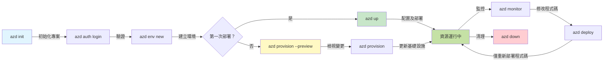
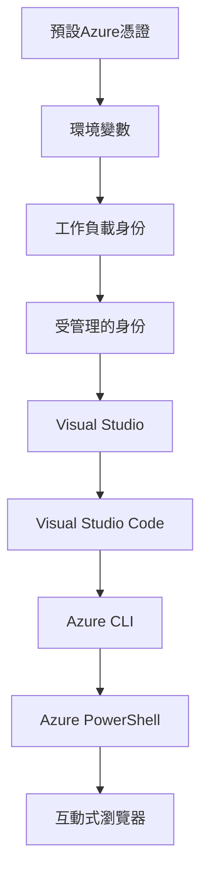

# AZD 基礎 - 認識 Azure Developer CLI

# AZD 基礎 - 核心概念與基本原理

**章節導航：**
- **📚 課程首頁**：[AZD 初學者指南](../../README.md)
- **📖 本章內容**：第 1 章 - 基礎與快速入門
- **⬅️ 上一章**：[課程概述](../../README.md#-chapter-1-foundation--quick-start)
- **➡️ 下一章**：[安裝與設置](installation.md)
- **🚀 下一章節**：[第 2 章：以 AI 為核心的開發](../microsoft-foundry/microsoft-foundry-integration.md)

## 簡介

本課程將介紹 Azure Developer CLI (azd)，這是一個強大的命令列工具，能加速您從本地開發到 Azure 部署的過程。您將學習基本概念、核心功能，並了解 azd 如何簡化雲原生應用程式的部署。

## 學習目標

完成本課程後，您將能夠：
- 了解 Azure Developer CLI 的用途及主要目的
- 學習模板、環境和服務的核心概念
- 探索包括模板驅動開發和基礎架構即代碼的主要功能
- 理解 azd 專案結構及工作流程
- 為您的開發環境安裝和配置 azd 做好準備

## 學習成果

完成本課程後，您將能夠：
- 解釋 azd 在現代雲端開發工作流程中的角色
- 識別 azd 專案結構的組成部分
- 描述模板、環境和服務如何協同工作
- 理解使用 azd 的基礎架構即代碼的好處
- 認識不同的 azd 命令及其用途

## 什麼是 Azure Developer CLI (azd)?

Azure Developer CLI (azd) 是一個命令列工具，旨在加速您從本地開發到 Azure 部署的過程。它簡化了在 Azure 上構建、部署和管理雲原生應用程式的流程。

### 🎯 為什麼使用 AZD？現實世界的比較

以下是部署一個簡單的網頁應用程式及資料庫的比較：

#### ❌ 沒有 AZD：手動 Azure 部署（30 分鐘以上）

```bash
# 第一步：建立資源群組
az group create --name myapp-rg --location eastus

# 第二步：建立應用服務計劃
az appservice plan create --name myapp-plan \
  --resource-group myapp-rg \
  --sku B1 --is-linux

# 第三步：建立網頁應用
az webapp create --name myapp-web-unique123 \
  --resource-group myapp-rg \
  --plan myapp-plan \
  --runtime "NODE:18-lts"

# 第四步：建立 Cosmos DB 帳戶（10-15 分鐘）
az cosmosdb create --name myapp-cosmos-unique123 \
  --resource-group myapp-rg \
  --kind MongoDB

# 第五步：建立資料庫
az cosmosdb mongodb database create \
  --account-name myapp-cosmos-unique123 \
  --resource-group myapp-rg \
  --name tododb

# 第六步：建立集合
az cosmosdb mongodb collection create \
  --account-name myapp-cosmos-unique123 \
  --resource-group myapp-rg \
  --database-name tododb \
  --name todos

# 第七步：獲取連接字串
CONN_STR=$(az cosmosdb keys list \
  --name myapp-cosmos-unique123 \
  --resource-group myapp-rg \
  --type connection-strings \
  --query "connectionStrings[0].connectionString" -o tsv)

# 第八步：配置應用程式設定
az webapp config appsettings set \
  --name myapp-web-unique123 \
  --resource-group myapp-rg \
  --settings MONGODB_URI="$CONN_STR"

# 第九步：啟用日誌記錄
az webapp log config --name myapp-web-unique123 \
  --resource-group myapp-rg \
  --application-logging filesystem \
  --detailed-error-messages true

# 第十步：設置應用程式洞察
az monitor app-insights component create \
  --app myapp-insights \
  --location eastus \
  --resource-group myapp-rg

# 第十一步：將應用程式洞察連接到網頁應用
INSTRUMENTATION_KEY=$(az monitor app-insights component show \
  --app myapp-insights \
  --resource-group myapp-rg \
  --query "instrumentationKey" -o tsv)

az webapp config appsettings set \
  --name myapp-web-unique123 \
  --resource-group myapp-rg \
  --settings APPINSIGHTS_INSTRUMENTATIONKEY="$INSTRUMENTATION_KEY"

# 第十二步：在本地構建應用程式
npm install
npm run build

# 第十三步：建立部署包
zip -r app.zip . -x "*.git*" "node_modules/*"

# 第十四步：部署應用程式
az webapp deployment source config-zip \
  --resource-group myapp-rg \
  --name myapp-web-unique123 \
  --src app.zip

# 第十五步：等待並祈禱它能正常運作 🙏
# （無自動驗證，需手動測試）
```

**問題：**
- ❌ 需要記住並執行超過 15 條命令
- ❌ 30-45 分鐘的手動操作
- ❌ 容易出錯（打字錯誤、參數錯誤）
- ❌ 連接字串暴露在終端歷史記錄中
- ❌ 如果出現問題，無法自動回滾
- ❌ 團隊成員難以複製
- ❌ 每次都不同（不可重現）

#### ✅ 使用 AZD：自動化部署（5 條命令，10-15 分鐘）

```bash
# 第一步：從模板初始化
azd init --template todo-nodejs-mongo

# 第二步：驗證身份
azd auth login

# 第三步：創建環境
azd env new dev

# 第四步：預覽更改（可選但建議）
azd provision --preview

# 第五步：部署所有內容
azd up

# ✨ 完成！所有內容已部署、配置並監控
```

**優勢：**
- ✅ **5 條命令** vs. 15+ 手動步驟
- ✅ **10-15 分鐘** 總時間（主要等待 Azure）
- ✅ **零錯誤** - 自動化且經過測試
- ✅ **安全管理機密** - 使用 Key Vault
- ✅ **失敗時自動回滾**
- ✅ **完全可重現** - 每次結果相同
- ✅ **適合團隊** - 任何人都能使用相同命令部署
- ✅ **基礎架構即代碼** - 版本控制的 Bicep 模板
- ✅ **內建監控** - 自動配置 Application Insights

### 📊 時間與錯誤減少

| 指標 | 手動部署 | AZD 部署 | 改善 |
|:-------|:------------------|:---------------|:------------|
| **命令數量** | 15+ | 5 | 減少 67% |
| **時間** | 30-45 分鐘 | 10-15 分鐘 | 快速 60% |
| **錯誤率** | ~40% | <5% | 減少 88% |
| **一致性** | 低（手動） | 100%（自動化） | 完美 |
| **團隊上手時間** | 2-4 小時 | 30 分鐘 | 快速 75% |
| **回滾時間** | 30+ 分鐘（手動） | 2 分鐘（自動化） | 快速 93% |

## 核心概念

### 模板
模板是 azd 的基礎。它包含：
- **應用程式代碼** - 您的源代碼及依賴項
- **基礎架構定義** - 使用 Bicep 或 Terraform 定義的 Azure 資源
- **配置文件** - 設定和環境變數
- **部署腳本** - 自動化部署工作流程

### 環境
環境代表不同的部署目標：
- **開發** - 用於測試和開發
- **測試** - 預生產環境
- **生產** - 正式生產環境

每個環境都維護自己的：
- Azure 資源群組
- 配置設定
- 部署狀態

### 服務
服務是應用程式的構建模塊：
- **前端** - 網頁應用程式、單頁應用程式
- **後端** - API、微服務
- **資料庫** - 資料存儲解決方案
- **存儲** - 文件和 Blob 存儲

## 主要功能

### 1. 模板驅動開發
```bash
# 瀏覽可用的模板
azd template list

# 從模板初始化
azd init --template <template-name>
```

### 2. 基礎架構即代碼
- **Bicep** - Azure 的領域專用語言
- **Terraform** - 多雲基礎架構工具
- **ARM 模板** - Azure 資源管理器模板

### 3. 整合工作流程
```bash
# 完成部署工作流程
azd up            # 配置 + 部署，這是首次設置的免操作流程

# 🧪 新功能：在部署前預覽基礎設施更改（安全）
azd provision --preview    # 模擬基礎設施部署而不進行更改

azd provision     # 如果更新基礎設施，請使用此功能來創建 Azure 資源
azd deploy        # 部署應用程式代碼或在更新後重新部署應用程式代碼
azd down          # 清理資源
```

#### 🛡️ 安全基礎架構規劃與預覽
`azd provision --preview` 命令是安全部署的革命性工具：
- **模擬分析** - 顯示將創建、修改或刪除的內容
- **零風險** - 不會對 Azure 環境進行實際更改
- **團隊協作** - 部署前共享預覽結果
- **成本估算** - 在承諾前了解資源成本

```bash
# 範例預覽工作流程
azd provision --preview           # 查看將會更改的內容
# 審查輸出，與團隊討論
azd provision                     # 自信地應用更改
```

### 📊 圖示：AZD 開發工作流程


**工作流程說明：**
1. **初始化** - 使用模板或新專案開始
2. **認證** - 與 Azure 驗證
3. **環境** - 創建隔離的部署環境
4. **預覽** - 🆕 始終先預覽基礎架構更改（安全實踐）
5. **配置** - 創建/更新 Azure 資源
6. **部署** - 推送您的應用程式代碼
7. **監控** - 觀察應用程式性能
8. **迭代** - 進行更改並重新部署代碼
9. **清理** - 完成後移除資源

### 4. 環境管理
```bash
# 建立和管理環境
azd env new <environment-name>
azd env select <environment-name>
azd env list
```

## 📁 專案結構

典型的 azd 專案結構：
```
my-app/
├── .azd/                    # azd configuration
│   └── config.json
├── .azure/                  # Azure deployment artifacts
├── .devcontainer/          # Development container config
├── .github/workflows/      # GitHub Actions
├── .vscode/               # VS Code settings
├── infra/                 # Infrastructure code
│   ├── main.bicep        # Main infrastructure template
│   ├── main.parameters.json
│   └── modules/          # Reusable modules
├── src/                  # Application source code
│   ├── api/             # Backend services
│   └── web/             # Frontend application
├── azure.yaml           # azd project configuration
└── README.md
```

## 🔧 配置文件

### azure.yaml
主要專案配置文件：
```yaml
name: my-awesome-app
metadata:
  template: my-template@1.0.0

services:
  web:
    project: ./src/web
    language: js
    host: appservice
  api:
    project: ./src/api
    language: js
    host: appservice

hooks:
  preprovision:
    shell: pwsh
    run: echo "Preparing to provision..."
```

### .azure/config.json
特定環境的配置：
```json
{
  "version": 1,
  "defaultEnvironment": "dev",
  "environments": {
    "dev": {
      "subscriptionId": "your-subscription-id",
      "location": "eastus"
    }
  }
}
```

## 🎪 常見工作流程與實作練習

> **💡 學習提示：** 按順序完成這些練習，以逐步提升您的 AZD 技能。

### 🎯 練習 1：初始化您的第一個專案

**目標：** 創建一個 AZD 專案並探索其結構

**步驟：**
```bash
# 使用已驗證的模板
azd init --template todo-nodejs-mongo

# 探索生成的文件
ls -la  # 查看所有文件，包括隱藏文件

# 創建的主要文件：
# - azure.yaml（主要配置）
# - infra/（基礎設施代碼）
# - src/（應用程式代碼）
```

**✅ 成功：** 您擁有 azure.yaml、infra/ 和 src/ 目錄

---

### 🎯 練習 2：部署到 Azure

**目標：** 完成端到端部署

**步驟：**
```bash
# 1. 驗證身份
az login && azd auth login

# 2. 建立環境
azd env new dev
azd env set AZURE_LOCATION eastus

# 3. 預覽更改（建議）
azd provision --preview

# 4. 部署所有內容
azd up

# 5. 驗證部署
azd show    # 查看您的應用程式 URL
```

**預計時間：** 10-15 分鐘  
**✅ 成功：** 應用程式 URL 在瀏覽器中打開

---

### 🎯 練習 3：多個環境

**目標：** 部署到開發和測試環境

**步驟：**
```bash
# 已經有開發，創建測試環境
azd env new staging
azd env set AZURE_LOCATION westus2
azd up

# 在它們之間切換
azd env list
azd env select dev
```

**✅ 成功：** Azure Portal 中有兩個獨立的資源群組

---

### 🛡️ 清理：`azd down --force --purge`

當您需要完全重置時：

```bash
azd down --force --purge
```

**它的作用：**
- `--force`：無需確認提示
- `--purge`：刪除所有本地狀態和 Azure 資源

**使用時機：**
- 部署中途失敗
- 切換專案
- 需要全新開始

---

## 🎪 原始工作流程參考

### 開始新專案
```bash
# 方法一：使用現有模板
azd init --template todo-nodejs-mongo

# 方法二：從頭開始
azd init

# 方法三：使用當前目錄
azd init .
```

### 開發週期
```bash
# 設置開發環境
azd auth login
azd env new dev
azd env select dev

# 部署所有內容
azd up

# 進行更改並重新部署
azd deploy

# 完成後清理
azd down --force --purge # Azure Developer CLI 中的命令是對您的環境進行**硬重置**——特別是在您排查部署失敗問題、清理孤立資源或準備重新部署時非常有用。
```

## 理解 `azd down --force --purge`
`azd down --force --purge` 命令是一種完全拆除 azd 環境及所有相關資源的強大方式。以下是每個標誌的作用：
```
--force
```
- 跳過確認提示。
- 適用於無法進行手動輸入的自動化或腳本。
- 確保拆除過程不受干擾，即使 CLI 檢測到不一致。

```
--purge
```
刪除 **所有相關元數據**，包括：
環境狀態
本地 `.azure` 文件夾
緩存的部署信息
防止 azd "記住" 之前的部署，這可能導致資源群組不匹配或過時的註冊表引用。

### 為什麼要同時使用？
當您因殘留狀態或部分部署而在 `azd up` 上遇到障礙時，此組合確保 **全新開始**。

它在手動刪除 Azure Portal 中的資源後，或切換模板、環境或資源群組命名約定時特別有用。

### 管理多個環境
```bash
# 建立暫存環境
azd env new staging
azd env select staging
azd up

# 切換回開發環境
azd env select dev

# 比較環境
azd env list
```

## 🔐 認證與憑證

理解認證對於成功的 azd 部署至關重要。Azure 使用多種認證方法，而 azd 利用與其他 Azure 工具相同的憑證鏈。

### Azure CLI 認證 (`az login`)

在使用 azd 之前，您需要使用 Azure 進行認證。最常見的方法是使用 Azure CLI：

```bash
# 互動式登入（開啟瀏覽器）
az login

# 使用特定租戶登入
az login --tenant <tenant-id>

# 使用服務主體登入
az login --service-principal -u <app-id> -p <password> --tenant <tenant-id>

# 檢查當前登入狀態
az account show

# 列出可用的訂閱
az account list --output table

# 設定預設訂閱
az account set --subscription <subscription-id>
```

### 認證流程
1. **互動式登錄**：打開默認瀏覽器進行認證
2. **設備代碼流程**：適用於無瀏覽器訪問的環境
3. **服務主體**：適用於自動化和 CI/CD 場景
4. **托管身份**：適用於 Azure 托管的應用程式

### DefaultAzureCredential 鏈

`DefaultAzureCredential` 是一種憑證類型，通過自動嘗試特定順序中的多個憑證來源提供簡化的認證體驗：

#### 憑證鏈順序

#### 1. 環境變數
```bash
# 設置服務主體的環境變數
export AZURE_CLIENT_ID="<app-id>"
export AZURE_CLIENT_SECRET="<password>"
export AZURE_TENANT_ID="<tenant-id>"
```

#### 2. 工作負載身份（Kubernetes/GitHub Actions）
自動用於：
- Azure Kubernetes Service (AKS) 的工作負載身份
- GitHub Actions 的 OIDC 聯邦
- 其他聯邦身份場景

#### 3. 托管身份
適用於 Azure 資源，例如：
- 虛擬機器
- 應用服務
- Azure Functions
- 容器實例

```bash
# 檢查是否在具有受管理身份的 Azure 資源上運行
az account show --query "user.type" --output tsv
# 返回："servicePrincipal" 如果使用受管理身份
```

#### 4. 開發工具整合
- **Visual Studio**：自動使用已登錄的帳戶
- **VS Code**：使用 Azure 帳戶擴展憑證
- **Azure CLI**：使用 `az login` 憑證（本地開發最常見）

### AZD 認證設置

```bash
# 方法 1：使用 Azure CLI（建議用於開發）
az login
azd auth login  # 使用現有的 Azure CLI 憑證

# 方法 2：直接 azd 驗證
azd auth login --use-device-code  # 用於無頭環境

# 方法 3：檢查驗證狀態
azd auth login --check-status

# 方法 4：登出並重新驗證
azd auth logout
azd auth login
```

### 認證最佳實踐

#### 用於本地開發
```bash
# 1. 使用 Azure CLI 登錄
az login

# 2. 驗證正確的訂閱
az account show
az account set --subscription "Your Subscription Name"

# 3. 使用 azd 和現有憑證
azd auth login
```

#### 用於 CI/CD 管道
```yaml
# GitHub Actions example
- name: Azure Login
  uses: azure/login@v1
  with:
    creds: ${{ secrets.AZURE_CREDENTIALS }}

- name: Deploy with azd
  run: |
    azd auth login --client-id ${{ secrets.AZURE_CLIENT_ID }} \
                    --client-secret ${{ secrets.AZURE_CLIENT_SECRET }} \
                    --tenant-id ${{ secrets.AZURE_TENANT_ID }}
    azd up --no-prompt
```

#### 用於生產環境
- 在 Azure 資源上運行時使用 **托管身份**
- 自動化場景使用 **服務主體**
- 避免在代碼或配置文件中存儲憑證
- 使用 **Azure Key Vault** 存儲敏感配置

### 常見認證問題及解決方案

#### 問題："未找到訂閱"
```bash
# 解決方案：設置默認訂閱
az account list --output table
az account set --subscription "<subscription-id>"
azd env set AZURE_SUBSCRIPTION_ID "<subscription-id>"
```

#### 問題："權限不足"
```bash
# 解決方案：檢查並分配所需角色
az role assignment list --assignee $(az account show --query user.name --output tsv)

# 常見所需角色：
# - 貢獻者（用於資源管理）
# - 使用者訪問管理員（用於角色分配）
```

#### 問題："令牌過期"
```bash
# 解決方案：重新驗證
az logout
az login
azd auth logout
azd auth login
```

### 不同場景下的認證

#### 本地開發
```bash
# 個人發展帳戶
az login
azd auth login
```

#### 團隊開發
```bash
# 使用特定租戶為組織
az login --tenant contoso.onmicrosoft.com
azd auth login
```

#### 多租戶場景
```bash
# 切換租戶
az login --tenant tenant1.onmicrosoft.com
# 部署到租戶 1
azd up

az login --tenant tenant2.onmicrosoft.com  
# 部署到租戶 2
azd up
```

### 安全考量

1. **憑證存儲**：切勿將憑證存儲在源代碼中
2. **範圍限制**：對服務主體使用最小權限原則
3. **令牌輪換**：定期輪換服務主體密鑰
4. **審計追蹤**：監控認證和部署活動
5. **網絡安全**：盡可能使用私有端點

### 認證故障排除

```bash
# 調試身份驗證問題
azd auth login --check-status
az account show
az account get-access-token

# 常見診斷命令
whoami                          # 當前使用者上下文
az ad signed-in-user show      # Azure AD 使用者詳細資料
az group list                  # 測試資源訪問
```

## 理解 `azd down --force --purge`

### 探索
```bash
azd template list              # 瀏覽範本
azd template show <template>   # 範本詳情
azd init --help               # 初始化選項
```

### 專案管理
```bash
azd show                     # 項目概述
azd env show                 # 當前環境
azd config list             # 配置設定
```

### 監控
```bash
azd monitor                  # 打開 Azure 入口網站
azd pipeline config          # 設置 CI/CD
azd logs                     # 查看應用程式日誌
```

## 最佳實踐

### 1. 使用有意義的名稱
```bash
# 好
azd env new production-east
azd init --template web-app-secure

# 避免
azd env new env1
azd init --template template1
```

### 2. 利用模板
- 從現有模板開始
- 根據需求進行自定義
- 為您的組織創建可重用模板

### 3. 環境隔離
- 為開發/測試/生產使用獨立環境
- 切勿直接從本地機器部署到生產環境
- 使用 CI/CD 管道進行生產部署

### 4. 配置管理
- 使用環境變數存儲敏感數據
- 將配置保存在版本控制中
- 記錄環境特定的設置

## 學習進度

### 初學者（第 1-2 週）
1. 安裝 azd 並進行認證
2. 部署簡單模板
3. 理解專案結構
4. 學習基本命令（up, down, deploy）

### 中級（第 3-4 週）
1. 自定義模板
2. 管理多個環境
3. 理解基礎架構代碼
4. 設置 CI/CD 管道

### 高級（第 5 週及以上）
1. 創建自定義模板
2. 高級基礎架構模式
3. 多區域部署
4. 企業級配置

## 下一步

**📖 繼續學習第 1 章內容：**
- [安裝與設定](installation.md) - 安裝及配置 azd
- [你的第一個專案](first-project.md) - 完整的實作教學
- [配置指南](configuration.md) - 進階配置選項

**🎯 準備好進入下一章節了嗎？**
- [第2章：AI優先開發](../microsoft-foundry/microsoft-foundry-integration.md) - 開始構建 AI 應用程式

## 其他資源

- [Azure Developer CLI 概覽](https://learn.microsoft.com/en-us/azure/developer/azure-developer-cli/)
- [範本庫](https://azure.github.io/awesome-azd/)
- [社群範例](https://github.com/Azure-Samples)

---

## 🙋 常見問題解答

### 一般問題

**問：AZD 和 Azure CLI 有什麼不同？**

答：Azure CLI (`az`) 用於管理單一 Azure 資源，而 AZD (`azd`) 用於管理整個應用程式：

```bash
# Azure CLI - 低層資源管理
az webapp create --name myapp --resource-group rg
az sql server create --name myserver --resource-group rg
# ...需要更多命令

# AZD - 應用程式層級管理
azd up  # 部署整個應用程式及所有資源
```

**這樣想：**
- `az` = 操作單個樂高積木
- `azd` = 處理完整的樂高套裝

---

**問：使用 AZD 需要了解 Bicep 或 Terraform 嗎？**

答：不需要！從範本開始：
```bash
# 使用現有模板 - 不需要基礎設施即代碼知識
azd init --template todo-nodejs-mongo
azd up
```

你可以稍後學習 Bicep 來自訂基礎架構。範本提供了可學習的實際範例。

---

**問：執行 AZD 範本需要多少費用？**

答：費用因範本而異。大多數開發範本每月費用約為 $50-150：

```bash
# 部署前預覽成本
azd provision --preview

# 不使用時請務必清理
azd down --force --purge  # 移除所有資源
```

**專業提示：** 使用免費層級（如有）：
- App Service：F1（免費）層級
- Azure OpenAI：每月 50,000 個免費代幣
- Cosmos DB：每秒 1000 RU 的免費層級

---

**問：我可以將 AZD 用於現有的 Azure 資源嗎？**

答：可以，但從頭開始會更簡單。AZD 在管理完整生命週期時效果最佳。對於現有資源：

```bash
# 選項 1：導入現有資源（進階）
azd init
# 然後修改 infra/ 以引用現有資源

# 選項 2：重新開始（推薦）
azd init --template matching-your-stack
azd up  # 創建新環境
```

---

**問：如何與團隊成員分享我的專案？**

答：將 AZD 專案提交到 Git（但不要提交 .azure 資料夾）：

```bash
# 已預設包含在 .gitignore 中
.azure/        # 包含秘密和環境數據
*.env          # 環境變數

# 團隊成員當時：
git clone <your-repo>
azd auth login
azd env new <their-name>-dev
azd up
```

每個人都能從相同的範本獲得相同的基礎架構。

---

### 疑難排解問題

**問："azd up" 執行到一半失敗了。我該怎麼辦？**

答：檢查錯誤，修正後重試：

```bash
# 查看詳細日誌
azd show

# 常見修復：

# 1. 如果配額超出：
azd env set AZURE_LOCATION "westus2"  # 嘗試不同的地區

# 2. 如果資源名稱衝突：
azd down --force --purge  # 清除所有
azd up  # 重試

# 3. 如果授權過期：
az login
azd auth login
azd up
```

**最常見的問題：** 選擇了錯誤的 Azure 訂閱
```bash
az account list --output table
az account set --subscription "<correct-subscription>"
```

---

**問：如何僅部署程式碼變更而不重新配置？**

答：使用 `azd deploy` 而非 `azd up`：

```bash
azd up          # 第一次：提供 + 部署（慢）

# 進行代碼更改...

azd deploy      # 後續次數：僅部署（快）
```

速度比較：
- `azd up`：10-15 分鐘（配置基礎架構）
- `azd deploy`：2-5 分鐘（僅程式碼）

---

**問：我可以自訂基礎架構範本嗎？**

答：可以！編輯 `infra/` 資料夾中的 Bicep 檔案：

```bash
# 在 azd 初始化後
cd infra/
code main.bicep  # 在 VS Code 中編輯

# 預覽更改
azd provision --preview

# 套用更改
azd provision
```

**提示：** 從小處開始 - 先更改 SKU：
```bicep
// infra/main.bicep
sku: {
  name: 'B1'  // Change to 'P1V2' for production
}
```

---

**問：如何刪除 AZD 建立的所有內容？**

答：一個指令即可移除所有資源：

```bash
azd down --force --purge

# 這會刪除：
# - 所有 Azure 資源
# - 資源群組
# - 本地環境狀態
# - 快取的部署數據
```

**務必在以下情況執行：**
- 測試範本完成後
- 切換到不同專案時
- 想要重新開始時

**節省成本：** 刪除未使用的資源 = $0 費用

---

**問：如果我不小心在 Azure Portal 中刪除了資源怎麼辦？**

答：AZD 狀態可能會不同步。採用清除重建的方法：

```bash
# 1. 移除本地狀態
azd down --force --purge

# 2. 從頭開始
azd up

# 替代方案：讓 AZD 檢測並修復
azd provision  # 將創建缺失的資源
```

---

### 進階問題

**問：我可以在 CI/CD 管線中使用 AZD 嗎？**

答：可以！GitHub Actions 範例：

```yaml
# .github/workflows/deploy.yml
name: Deploy with AZD

on:
  push:
    branches: [main]

jobs:
  deploy:
    runs-on: ubuntu-latest
    steps:
      - uses: actions/checkout@v2
      
      - name: Install azd
        run: curl -fsSL https://aka.ms/install-azd.sh | bash
      
      - name: Azure Login
        run: |
          azd auth login \
            --client-id ${{ secrets.AZURE_CLIENT_ID }} \
            --client-secret ${{ secrets.AZURE_CLIENT_SECRET }} \
            --tenant-id ${{ secrets.AZURE_TENANT_ID }}
      
      - name: Deploy
        run: azd up --no-prompt
```

---

**問：如何處理機密和敏感數據？**

答：AZD 自動整合 Azure Key Vault：

```bash
# 秘密儲存在密鑰保管庫中，而不是在代碼中
azd env set DATABASE_PASSWORD "$(openssl rand -base64 32)"

# AZD 自動：
# 1. 創建密鑰保管庫
# 2. 儲存秘密
# 3. 通過托管身份授予應用程式訪問權限
# 4. 在運行時注入
```

**切勿提交：**
- `.azure/` 資料夾（包含環境數據）
- `.env` 檔案（本地機密）
- 連接字串

---

**問：我可以部署到多個區域嗎？**

答：可以，為每個區域建立環境：

```bash
# 東美環境
azd env new prod-eastus
azd env set AZURE_LOCATION eastus
azd up

# 西歐環境
azd env new prod-westeurope
azd env set AZURE_LOCATION westeurope
azd up

# 每個環境都是獨立的
azd env list
```

對於真正的多區域應用程式，自訂 Bicep 範本以同時部署到多個區域。

---

**問：如果遇到問題，我可以在哪裡尋求幫助？**

1. **AZD 文件：** https://learn.microsoft.com/azure/developer/azure-developer-cli/
2. **GitHub 問題：** https://github.com/Azure/azure-dev/issues
3. **Discord：** [Azure Discord](https://discord.gg/microsoft-azure) - #azure-developer-cli 頻道
4. **Stack Overflow：** 標籤 `azure-developer-cli`
5. **本課程：** [疑難排解指南](../troubleshooting/common-issues.md)

**專業提示：** 提問前，執行：
```bash
azd show       # 顯示當前狀態
azd version    # 顯示您的版本
```
在問題中包含此資訊以加快協助速度。

---

## 🎓 接下來做什麼？

你現在已了解 AZD 的基礎知識。選擇你的路徑：

### 🎯 初學者：
1. **下一步：** [安裝與設定](installation.md) - 在你的電腦上安裝 AZD
2. **然後：** [你的第一個專案](first-project.md) - 部署你的第一個應用程式
3. **練習：** 完成本課程中的所有 3 個練習

### 🚀 AI 開發者：
1. **跳到：** [第2章：AI優先開發](../microsoft-foundry/microsoft-foundry-integration.md)
2. **部署：** 從 `azd init --template get-started-with-ai-chat` 開始
3. **學習：** 在部署過程中學習

### 🏗️ 有經驗的開發者：
1. **檢閱：** [配置指南](configuration.md) - 進階設定
2. **探索：** [基礎架構即程式碼](../deployment/provisioning.md) - 深入了解 Bicep
3. **構建：** 為你的技術堆疊創建自訂範本

---

**章節導航：**
- **📚 課程首頁：** [AZD 初學者指南](../../README.md)
- **📖 當前章節：** 第1章 - 基礎與快速入門  
- **⬅️ 上一節：** [課程概覽](../../README.md#-chapter-1-foundation--quick-start)
- **➡️ 下一節：** [安裝與設定](installation.md)
- **🚀 下一章節：** [第2章：AI優先開發](../microsoft-foundry/microsoft-foundry-integration.md)

---

<!-- CO-OP TRANSLATOR DISCLAIMER START -->
**免責聲明**：  
本文件已使用人工智能翻譯服務 [Co-op Translator](https://github.com/Azure/co-op-translator) 進行翻譯。儘管我們努力確保翻譯的準確性，但請注意，自動翻譯可能包含錯誤或不準確之處。原始文件的母語版本應被視為權威來源。對於關鍵信息，建議使用專業人工翻譯。我們對因使用此翻譯而引起的任何誤解或誤釋不承擔責任。
<!-- CO-OP TRANSLATOR DISCLAIMER END -->