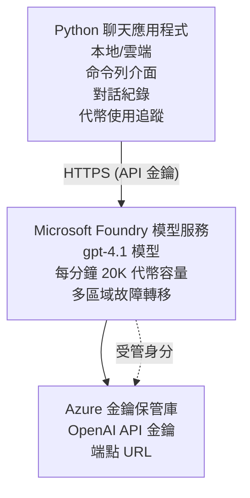

# Microsoft Foundry Models 聊天應用程式

**學習路徑：** 中級 ⭐⭐ | **時間：** 35-45 分鐘 | **費用：** $50-200/月

使用 Azure Developer CLI (azd) 部署的完整 Microsoft Foundry Models 聊天應用程式。本範例示範 gpt-4.1 部署、安全的 API 存取，以及一個簡單的聊天介面。

## 🎯 你會學到

- 部署 Microsoft Foundry Models 服務，使用 gpt-4.1 模型
- 使用 Key Vault 保護 OpenAI API 金鑰
- 使用 Python 建立簡單的聊天介面
- 監控 token 使用量和費用
- 實作速率限制和錯誤處理

## 📦 內容包含

✅ **Microsoft Foundry Models Service** - gpt-4.1 模型部署  
✅ **Python 聊天應用程式** - 簡單的命令列聊天介面  
✅ **Key Vault 整合** - 安全的 API 金鑰儲存  
✅ **ARM 範本** - 完整的基礎設施即程式碼  
✅ <strong>費用監控</strong> - token 使用量追蹤  
✅ <strong>速率限制</strong> - 防止配額耗盡  

## Architecture


## Prerequisites

### 必要條件

- **Azure Developer CLI (azd)** - [安裝指南](https://learn.microsoft.com/azure/developer/azure-developer-cli/install-azd)
- **Azure 訂閱**（具 OpenAI 存取權） - [申請存取](https://aka.ms/oai/access)
- **Python 3.9+** - [安裝 Python](https://www.python.org/downloads/)

### 驗證先決條件

```bash
# 檢查 azd 版本（需要 1.5.0 或更高）
azd version

# 驗證 Azure 登入
azd auth login

# 檢查 Python 版本
python --version  # 或 python3 --version

# 驗證 OpenAI 存取權限（在 Azure 入口網站檢查）
az cognitiveservices account list-skus \
  --kind OpenAI \
  --location eastus
```

> **⚠️ 重要：** Microsoft Foundry Models 需要申請核准。如果您尚未申請，請造訪 [aka.ms/oai/access](https://aka.ms/oai/access)。核准通常需 1-2 個工作天。

## ⏱️ 部署時程

| 階段 | 大約時間 | 發生事項 |
|-------|----------|--------------|
| 先決條件檢查 | 2-3 分鐘 | 驗證 OpenAI 配額是否可用 |
| 部署基礎設施 | 8-12 分鐘 | 建立 OpenAI、Key Vault、模型部署 |
| 設定應用程式 | 2-3 分鐘 | 設定環境與相依套件 |
| <strong>總計</strong> | **12-18 分鐘** | 準備好與 gpt-4.1 聊天 |

**注意：** 首次部署 OpenAI 可能因模型佈建而需要較長時間。

## 快速開始

```bash
# 前往範例
cd examples/azure-openai-chat

# 初始化環境
azd env new myopenai

# 部署所有內容（基礎設施 + 設定）
azd up
# 系統會提示您：
# 1. 選擇 Azure 訂閱
# 2. 選擇有 OpenAI 可用性的地區（例如：eastus、eastus2、westus）
# 3. 等待部署完成，約需 12–18 分鐘

# 安裝 Python 相依套件
pip install -r requirements.txt

# 開始聊天！
python chat.py
```

**預期輸出：**
```
🤖 Microsoft Foundry Models Chat Application
Connected to: gpt-4.1 (eastus)
Type your message (or 'quit' to exit)

You: Hello! Tell me about Microsoft Foundry Models.
Assistant: Microsoft Foundry Models Service provides REST API access to OpenAI's powerful language models including gpt-4.1, GPT-3.5-Turbo, and Embeddings...

[Tokens used: 145 | Estimated cost: $0.0044]
```

## ✅ 驗證部署

### 步驟 1：檢查 Azure 資源

```bash
# 檢視已部署的資源
azd show

# 預期輸出顯示:
# - OpenAI 服務: (資源名稱)
# - 金鑰保管庫: (資源名稱)
# - 部署: gpt-4.1
# - 位置: eastus (或您選擇的區域)
```

### 步驟 2：測試 OpenAI API

```bash
# 取得 OpenAI 端點與金鑰
OPENAI_ENDPOINT=$(azd env get-value AZURE_OPENAI_ENDPOINT)
OPENAI_KEY=$(azd env get-value AZURE_OPENAI_API_KEY)

# 測試 API 呼叫
curl "$OPENAI_ENDPOINT/openai/deployments/gpt-4.1/chat/completions?api-version=2024-08-01-preview" \
  -H "Content-Type: application/json" \
  -H "api-key: $OPENAI_KEY" \
  -d '{
    "messages": [{"role": "user", "content": "Say hello!"}],
    "max_tokens": 50
  }'
```

**預期回應：**
```json
{
  "choices": [
    {
      "message": {
        "role": "assistant",
        "content": "Hello! How can I assist you today?"
      }
    }
  ],
  "usage": {
    "prompt_tokens": 8,
    "completion_tokens": 9,
    "total_tokens": 17
  }
}
```

### 步驟 3：驗證 Key Vault 存取

```bash
# 列出 Key Vault 中的祕密
KV_NAME=$(azd env get-value AZURE_KEY_VAULT_NAME)

az keyvault secret list \
  --vault-name $KV_NAME \
  --query "[].name" \
  --output table
```

**預期的機密：**
- `openai-api-key`
- `openai-endpoint`

**成功標準：**
- ✅ 已部署 OpenAI 服務並使用 gpt-4.1
- ✅ API 呼叫回傳有效的完成回應
- ✅ 機密已儲存在 Key Vault
- ✅ token 使用量追蹤運作正常

## 專案結構

```
azure-openai-chat/
├── README.md                   ✅ This guide
├── azure.yaml                  ✅ AZD configuration
├── infra/                      ✅ Infrastructure as Code
│   ├── main.bicep             ✅ Main Bicep template
│   ├── main.parameters.json   ✅ Parameters
│   └── openai.bicep           ✅ OpenAI resource definition
├── src/                        ✅ Application code
│   ├── chat.py                ✅ Chat interface
│   ├── config.py              ✅ Configuration loader
│   └── requirements.txt       ✅ Python dependencies
└── .gitignore                  ✅ Git ignore rules
```

## 應用程式功能

### 聊天介面 (`chat.py`)

聊天應用程式包括：

- <strong>對話歷史</strong> - 維持跨訊息的上下文
- **Token 計數** - 追蹤使用量並估算費用
- <strong>錯誤處理</strong> - 優雅處理速率限制和 API 錯誤
- <strong>費用估算</strong> - 每則訊息的即時費用計算
- <strong>串流支援</strong> - 選用的串流回應

### 指令

聊天時，您可以使用：
- `quit` 或 `exit` - 結束會話
- `clear` - 清除對話歷史
- `tokens` - 顯示總 token 使用量
- `cost` - 顯示估算總費用

### 設定 (`config.py`)

從環境變數載入設定：
```python
AZURE_OPENAI_ENDPOINT  # 來自金鑰保管庫
AZURE_OPENAI_API_KEY   # 來自金鑰保管庫
AZURE_OPENAI_MODEL     # 預設：gpt-4.1
AZURE_OPENAI_MAX_TOKENS # 預設：800
```

## 使用範例

### 基本聊天

```bash
python chat.py
```

### 使用自訂模型聊天

```bash
export AZURE_OPENAI_MODEL=gpt-35-turbo
python chat.py
```

### 串流聊天

```bash
python chat.py --stream
```

### 範例對話

```
You: Explain Microsoft Foundry Models Service in 3 sentences.
Assistant: Microsoft Foundry Models Service is Microsoft Azure's cloud platform offering 
that provides access to OpenAI's powerful language models. It enables developers 
to integrate capabilities like gpt-4.1 into their applications with enterprise-grade 
security and compliance. The service includes features for content filtering, 
abuse monitoring, and responsible AI practices.

[Tokens used: 89 | Estimated cost: $0.0027]

You: What models are available?
Assistant: Microsoft Foundry Models Service offers several model families including gpt-4.1 
(most capable), GPT-3.5-Turbo (faster and cost-effective), and Embeddings models 
for vector search. Each model has different capabilities, pricing, and token limits.

[Tokens used: 67 | Estimated cost: $0.0020]

Total session: 156 tokens | $0.0047
```

## 成本管理

### Token 價格（gpt-4.1）

| 模型 | 輸入（每 1K tokens） | 輸出（每 1K tokens） |
|-------|----------------------|------------------------|
| gpt-4.1 | $0.03 | $0.06 |
| GPT-3.5-Turbo | $0.0015 | $0.002 |

### 預估每月費用

根據使用模式：

| 使用等級 | 每日訊息數 | 每日 tokens | 每月費用 |
|-------------|--------------|------------|--------------|
| <strong>輕量</strong> | 20 則訊息 | 3,000 tokens | $3-5 |
| <strong>中度</strong> | 100 則訊息 | 15,000 tokens | $15-25 |
| <strong>大量</strong> | 500 則訊息 | 75,000 tokens | $75-125 |

**基礎設施成本：** $1-2/月（Key Vault + 最小計算資源）

### 成本優化建議

```bash
# 1. 對於較簡單的任務，使用 GPT-3.5-Turbo（便宜 20 倍）
export AZURE_OPENAI_MODEL=gpt-35-turbo

# 2. 減少最大 token 數量以縮短回應
export AZURE_OPENAI_MAX_TOKENS=400

# 3. 監控 token 使用情況
python chat.py --show-tokens

# 4. 設定預算警示
az consumption budget create \
  --budget-name "openai-budget" \
  --amount 50 \
  --time-grain Monthly
```

## 監控

### 檢視 Token 使用量

```bash
# 在 Azure 入口網站：
# OpenAI 資源 → 指標 → 選擇「Token Transaction」

# 或透過 Azure CLI：
az monitor metrics list \
  --resource $(azd env get-value AZURE_OPENAI_RESOURCE_ID) \
  --metric "TokenTransaction" \
  --start-time $(date -u -d '1 hour ago' '+%Y-%m-%dT%H:%M:%S') \
  --interval PT1M
```

### 檢視 API 日誌

```bash
# 串流診斷日誌
az monitor diagnostic-settings create \
  --resource $(azd env get-value AZURE_OPENAI_RESOURCE_ID) \
  --name openai-logs \
  --logs '[{"category": "Audit", "enabled": true}]' \
  --workspace $(azd env get-value LOG_ANALYTICS_WORKSPACE_ID)

# 查詢日誌
az monitor log-analytics query \
  --workspace $(azd env get-value LOG_ANALYTICS_WORKSPACE_ID) \
  --analytics-query "AzureDiagnostics | where Category == 'Audit' | top 10 by TimeGenerated"
```

## 疑難排解

### 問題： "Access Denied" 錯誤

**症狀：** 呼叫 API 時出現 403 Forbidden

**解決方法：**
```bash
# 1. 驗證 OpenAI 存取是否已獲批准
az cognitiveservices account show \
  --name $(azd env get-value AZURE_OPENAI_NAME) \
  --resource-group $(azd env get-value AZURE_RESOURCE_GROUP)

# 2. 檢查 API 金鑰是否正確
azd env get-value AZURE_OPENAI_API_KEY

# 3. 驗證端點 URL 格式
azd env get-value AZURE_OPENAI_ENDPOINT
# 應為： https://[name].openai.azure.com/
```

### 問題： "Rate Limit Exceeded"

**症狀：** 429 Too Many Requests

**解決方法：**
```bash
# 1. 檢查目前的配額
az cognitiveservices account deployment show \
  --name $(azd env get-value AZURE_OPENAI_NAME) \
  --resource-group $(azd env get-value AZURE_RESOURCE_GROUP) \
  --deployment-name gpt-4.1

# 2. 如有需要，申請增加配額
# 前往 Azure 入口網站 → OpenAI 資源 → 配額 → 申請提高

# 3. 實作重試邏輯（已在 chat.py 中）
# 應用程式會自動以指數退避方式重試
```

### 問題： "Model Not Found"

**症狀：** 部署時出現 404 錯誤

**解決方法：**
```bash
# 1. 列出可用的部署
az cognitiveservices account deployment list \
  --name $(azd env get-value AZURE_OPENAI_NAME) \
  --resource-group $(azd env get-value AZURE_RESOURCE_GROUP)

# 2. 驗證環境中的模型名稱
echo $AZURE_OPENAI_MODEL

# 3. 更新為正確的部署名稱
export AZURE_OPENAI_MODEL=gpt-4.1  # 或 gpt-35-turbo
```

### 問題：高延遲

**症狀：** 回應時間緩慢（>5 秒）

**解決方法：**
```bash
# 1. 檢查地區延遲
# 部署到最接近使用者的地區

# 2. 減少 max_tokens 以加快回應速度
export AZURE_OPENAI_MAX_TOKENS=400

# 3. 使用串流以改善使用者體驗
python chat.py --stream
```

## 安全最佳實務

### 1. 保護 API 金鑰

```bash
# 切勿將金鑰提交到原始碼管理系統
# 使用金鑰保管庫（已配置）

# 定期輪換金鑰
az cognitiveservices account keys regenerate \
  --name $(azd env get-value AZURE_OPENAI_NAME) \
  --resource-group $(azd env get-value AZURE_RESOURCE_GROUP) \
  --key-name key1
```

### 2. 實施內容過濾

```python
# Microsoft Foundry Models 包含內建的內容過濾
# 在 Azure 入口網站設定：
# OpenAI 資源 → 內容篩選 → 建立自訂篩選器

# 類別：仇恨、性內容、暴力、自我傷害
# 過濾等級：低、中、高
```

### 3. 使用 Managed Identity（生產環境）

```bash
# 在生產部署時，請使用託管身分識別
# 而非使用 API 金鑰（需要在 Azure 上託管應用程式）

# 更新 infra/openai.bicep 以包含：
# identity: { type: 'SystemAssigned' }
```

## 開發

### 本機執行

```bash
# 安裝相依套件
pip install -r src/requirements.txt

# 設定環境變數
export AZURE_OPENAI_ENDPOINT="https://[name].openai.azure.com/"
export AZURE_OPENAI_API_KEY="your-api-key"
export AZURE_OPENAI_MODEL="gpt-4.1"

# 執行應用程式
python src/chat.py
```

### 執行測試

```bash
# 安裝測試依賴
pip install pytest pytest-cov

# 執行測試
pytest tests/ -v

# 包含測試覆蓋率
pytest tests/ --cov=src --cov-report=html
```

### 更新模型部署

```bash
# 部署不同的模型版本
az cognitiveservices account deployment create \
  --name $(azd env get-value AZURE_OPENAI_NAME) \
  --resource-group $(azd env get-value AZURE_RESOURCE_GROUP) \
  --deployment-name gpt-35-turbo \
  --model-name gpt-35-turbo \
  --model-version "0613" \
  --model-format OpenAI \
  --sku-capacity 20 \
  --sku-name "Standard"
```

## 清理

```bash
# 刪除所有 Azure 資源
azd down --force --purge

# 這將移除：
# - OpenAI 服務
# - Key Vault（附帶 90 天的軟刪除）
# - 資源群組
# - 所有部署和設定
```

## 下一步

### 擴展此範例

1. <strong>新增網頁介面</strong> - 建置 React/Vue 前端
   ```bash
   # 在 azure.yaml 中新增前端服務
   # 部署到 Azure Static Web Apps
   ```

2. **實作 RAG** - 使用 Azure AI Search 新增文件搜尋
   ```python
   # 整合 Azure 認知搜尋
   # 上傳文件並建立向量索引
   ```

3. **新增 Function Calling** - 啟用工具使用
   ```python
   # 在 chat.py 中定義函數
   # 讓 gpt-4.1 呼叫外部 API
   ```

4. <strong>多模型支援</strong> - 部署多個模型
   ```bash
   # 新增 gpt-35-turbo 及嵌入模型
   # 實作模型路由邏輯
   ```

### 相關範例

- **[零售多代理](../retail-scenario.md)** - 進階多代理架構
- **[資料庫應用程式](../../../../examples/database-app)** - 新增持久化儲存
- **[容器應用程式](../../../../examples/container-app)** - 以容器化服務部署

### 學習資源

- 📚 [AZD 初學者課程](../../README.md) - 主要課程首頁
- 📚 [Microsoft Foundry Models 文件](https://learn.microsoft.com/azure/ai-services/openai/) - 官方文件
- 📚 [OpenAI API 參考](https://platform.openai.com/docs/api-reference) - API 詳細資訊
- 📚 [負責任的 AI](https://www.microsoft.com/ai/responsible-ai) - 最佳實務

## 額外資源

### 文件
- **[Microsoft Foundry Models 服務](https://learn.microsoft.com/azure/ai-services/openai/)** - 完整指南
- **[gpt-4.1 模型](https://learn.microsoft.com/azure/ai-services/openai/concepts/models)** - 模型能力
- **[內容過濾](https://learn.microsoft.com/azure/ai-services/openai/concepts/content-filter)** - 安全功能
- **[Azure Developer CLI](https://learn.microsoft.com/azure/developer/azure-developer-cli/)** - azd 參考

### 教學
- **[OpenAI 快速入門](https://learn.microsoft.com/azure/ai-services/openai/quickstart)** - 首次部署
- **[聊天完成（Chat Completions）](https://learn.microsoft.com/azure/ai-services/openai/how-to/chatgpt)** - 建置聊天應用程式
- **[Function Calling](https://learn.microsoft.com/azure/ai-services/openai/how-to/function-calling)** - 進階功能

### 工具
- **[Microsoft Foundry Models Studio](https://oai.azure.com/)** - 線上互動平台
- **[提示工程指南](https://platform.openai.com/docs/guides/prompt-engineering)** - 撰寫更佳的提示詞
- **[Token 計算器](https://platform.openai.com/tokenizer)** - 估算 token 使用量

### 社群
- **[Azure AI Discord](https://discord.gg/azure)** - 從社群獲得協助
- **[GitHub Discussions](https://github.com/Azure-Samples/openai/discussions)** - 問答論壇
- **[Azure Blog](https://azure.microsoft.com/blog/tag/azure-openai-service/)** - 最新更新

---

**🎉 成功！** 您已部署 Microsoft Foundry Models 並建立運作中的聊天應用程式。開始探索 gpt-4.1 的功能，並嘗試不同的提示詞與應用情境。

**有問題嗎？** [提出 issue](https://github.com/microsoft/AZD-for-beginners/issues) 或查看 [常見問答](../../resources/faq.md)

**費用提醒：** 測試完成後請記得執行 `azd down` 以避免持續產生費用（約 $50-100/月 的活躍使用費用）。

---

<!-- CO-OP TRANSLATOR DISCLAIMER START -->
**Disclaimer**:
本文件已使用 AI 翻譯服務 [Co-op Translator](https://github.com/Azure/co-op-translator) 進行翻譯。雖然我們力求準確，但請注意自動翻譯可能包含錯誤或不準確之處。原始文件之原文版本應被視為具權威性的來源。對於重要或關鍵資訊，建議採用專業人工翻譯。我們不對因使用本翻譯而引致的任何誤解或曲解承擔責任。
<!-- CO-OP TRANSLATOR DISCLAIMER END -->