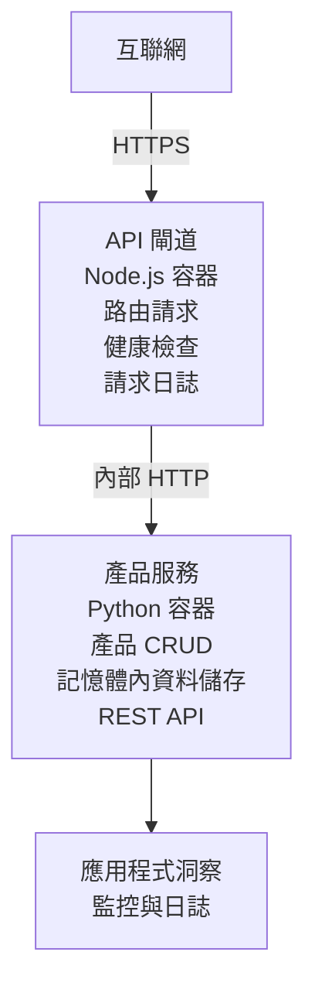

# Microservices Architecture - Container App Example

⏱️ <strong>估計時間</strong>: 25-35 分鐘 | 💰 <strong>估計成本</strong>: ~$50-100/月 | ⭐ <strong>複雜度</strong>: 進階

一個 <strong>簡化但可運作</strong> 的微服務架構，使用 AZD CLI 部署到 Azure Container Apps。此範例示範服務間通訊、容器編排與監控，採用實用的 2 服務設定。

> **📚 學習方式**: 本範例從最小的 2 服務架構（API Gateway + 後端服務）開始，您可以實際部署並從中學習。掌握基礎後，我們會提供擴展到完整微服務生態系統的指引。

## 您將學到什麼

完成此範例後，您將能：
- 將多個容器部署到 Azure Container Apps
- 使用內部網路實現服務到服務的通訊
- 設定基於環境的調整與健康檢查
- 使用 Application Insights 監控分散式應用程式
- 了解微服務的部署模式與最佳實踐
- 學習如何從簡單逐步擴展到複雜架構

## 架構

### 第 1 階段：我們正在建造的內容（包含於此範例）


**為什麼從簡單開始？**
- ✅ 快速部署並理解（25-35 分鐘）
- ✅ 在不複雜化的情況下學習核心微服務模式
- ✅ 可修改與實驗的可運作程式碼
- ✅ 學習成本較低（約 $50-100/月，相對於 $300-1400/月）
- ✅ 在加入資料庫與訊息佇列前建立信心

<strong>比喻</strong>：把這當作學開車。您從空蕩的停車場（2 個服務）開始，熟悉基礎後再進入市區交通（5 個以上服務加上資料庫）。

### 第 2 階段：未來擴展（參考架構）

掌握 2 服務架構後，您可以擴展到：

```
Full Architecture (Not Included - For Reference)
├── API Gateway (✅ Included)
├── Product Service (✅ Included)
├── Order Service (🔜 Add next)
├── User Service (🔜 Add next)
├── Notification Service (🔜 Add last)
├── Azure Service Bus (🔜 For async communication)
├── Cosmos DB (🔜 For product persistence)
├── Azure SQL (🔜 For order management)
└── Azure Storage (🔜 For file storage)
```

請參閱文件結尾的「Expansion Guide」章節，獲得逐步指示。

## 包含的功能

✅ <strong>服務發現</strong>：容器之間的自動 DNS 發現  
✅ <strong>負載平衡</strong>：跨複本的內建負載平衡  
✅ <strong>自動擴縮</strong>：依服務獨立擴縮，依據 HTTP 請求  
✅ <strong>健康監控</strong>：兩個服務的 Liveness 與 Readiness 探針  
✅ <strong>分散式日誌</strong>：使用 Application Insights 的集中式日誌  
✅ <strong>內部網路</strong>：安全的服務間通訊  
✅ <strong>容器編排</strong>：自動部署與擴縮  
✅ <strong>零停機更新</strong>：搭配版本管理的滾動更新  

## 先決條件

### 所需工具

在開始前，請確認您已安裝以下工具：

1. **[Azure 開發人員 CLI (azd)](https://learn.microsoft.com/azure/developer/azure-developer-cli/install-azd)**（版本 1.0.0 或更高）
   ```bash
   azd version
   # 預期輸出：azd 版本 1.0.0 或更高版本
   ```

2. **[Azure CLI](https://learn.microsoft.com/cli/azure/install-azure-cli)**（版本 2.50.0 或更高）
   ```bash
   az --version
   # 預期輸出：azure-cli 2.50.0 或更高版本
   ```

3. **[Docker](https://www.docker.com/get-started)**（用於本機開發/測試 - 選用）
   ```bash
   docker --version
   # 預期輸出：Docker 版本 20.10 或更高
   ```

### Azure 要求

- 有效的 **Azure 訂閱**（[建立免費帳戶](https://azure.microsoft.com/free/)）
- 在訂閱中建立資源的權限
- 在訂閱或資源群組上具有 **Contributor** 角色

### 知識先備

這是一個 <strong>進階範例</strong>。您應具備：
- 已完成 [Simple Flask API example](../../../../../examples/container-app/simple-flask-api) 
- 微服務架構的基本理解
- 熟悉 REST API 與 HTTP
- 了解容器概念

**剛接觸 Container Apps？** 建議先從 [Simple Flask API example](../../../../../examples/container-app/simple-flask-api) 開始，學習基礎。

## 快速上手（逐步）

### 步驟 1：克隆並進入目錄

```bash
git clone https://github.com/microsoft/AZD-for-beginners.git
cd AZD-for-beginners/examples/container-app/microservices
```

**✓ 成功檢查**：確認您看到 `azure.yaml`：
```bash
ls
# 預期：README.md、azure.yaml、infra/、src/
```

### 步驟 2：使用 Azure 驗證

```bash
azd auth login
```

此操作會在瀏覽器中開啟 Azure 驗證頁面。請使用您的 Azure 憑證登入。

**✓ 成功檢查**：您應該會看到：
```
Logged in to Azure.
```

### 步驟 3：初始化環境

```bash
azd init
```

<strong>您將看到的提示</strong>：
- <strong>環境名稱</strong>：輸入一個簡短名稱（例如 `microservices-dev`）
- **Azure 訂閱**：選擇您的訂閱
- **Azure 區域**：選擇一個地區（例如 `eastus`、`westeurope`）

**✓ 成功檢查**：您應該會看到：
```
SUCCESS: New project initialized!
```

### 步驟 4：部署基礎設施與服務

```bash
azd up
```

<strong>會發生的事</strong>（需時 8-12 分鐘）：
1. 建立 Container Apps 環境
2. 為監控建立 Application Insights
3. 建置 API Gateway 容器（Node.js）
4. 建置 Product Service 容器（Python）
5. 將兩個容器部署到 Azure
6. 設定網路與健康檢查
7. 設置監控與日誌

**✓ 成功檢查**：您應該會看到：
```
SUCCESS: Your application was deployed to Azure in X minutes Y seconds.
Endpoint: https://api-gateway-<unique-id>.azurecontainerapps.io
```

**⏱️ 時間**：8-12 分鐘

### 步驟 5：測試部署

```bash
# 取得閘道端點
GATEWAY_URL=$(azd env get-values | grep API_GATEWAY_URL | cut -d '=' -f2 | tr -d '"')

# 測試 API 閘道的健康狀態
curl $GATEWAY_URL/health

# 預期輸出:
# {"status":"健康","service":"api-閘道","timestamp":"2025-11-19T10:30:00Z"}
```

**透過 gateway 測試 product service**：
```bash
# 列出產品
curl $GATEWAY_URL/api/products

# 預期輸出:
# [
#   {"id":1,"name":"手提電腦","price":999.99,"stock":50},
#   {"id":2,"name":"滑鼠","price":29.99,"stock":200},
#   {"id":3,"name":"鍵盤","price":79.99,"stock":150}
# ]
```

**✓ 成功檢查**：兩個端點皆回傳 JSON 且無錯誤。

---

**🎉 恭喜！** 您已將微服務架構部署到 Azure！

## 專案結構

所有實作檔案皆包含在內—這是一個完整、可運作的範例：

```
microservices/
│
├── README.md                         # This file
├── azure.yaml                        # AZD configuration
├── .gitignore                        # Git ignore patterns
│
├── infra/                           # Infrastructure as Code (Bicep)
│   ├── main.bicep                   # Main orchestration
│   ├── abbreviations.json           # Naming conventions
│   ├── core/                        # Shared infrastructure
│   │   ├── container-apps-environment.bicep  # Container environment + registry
│   │   └── monitor.bicep            # Application Insights + Log Analytics
│   └── app/                         # Service definitions
│       ├── api-gateway.bicep        # API Gateway container app
│       └── product-service.bicep    # Product Service container app
│
└── src/                             # Application source code
    ├── api-gateway/                 # Node.js API Gateway
    │   ├── app.js                   # Express server with routing
    │   ├── package.json             # Node dependencies
    │   └── Dockerfile               # Container definition
    └── product-service/             # Python Product Service
        ├── main.py                  # Flask API with product data
        ├── requirements.txt         # Python dependencies
        └── Dockerfile               # Container definition
```

**各元件的功能：**

**基礎設施 (infra/)**：
- `main.bicep`: 協調所有 Azure 資源與其相依性
- `core/container-apps-environment.bicep`: 建立 Container Apps 環境與 Azure Container Registry
- `core/monitor.bicep`: 設定 Application Insights 以進行分散式日誌
- `app/*.bicep`: 個別的 container app 定義，包含擴縮與健康檢查

**API Gateway (src/api-gateway/)**：
- 對外的服務，將請求路由到後端服務
- 實作日誌、錯誤處理與請求轉發
- 示範服務到服務的 HTTP 通訊

**Product Service (src/product-service/)**：
- 內部服務，含產品目錄（為簡單起見採記憶體儲存）
- 提供 REST API 與健康檢查
- 範例後端微服務模式

## 服務概覽

### API Gateway (Node.js/Express)

<strong>埠</strong>：8080  
<strong>存取</strong>：公開（外部進入）  
<strong>用途</strong>：將進來的請求路由到適當的後端服務  

<strong>端點</strong>：
- `GET /` - 服務資訊
- `GET /health` - 健康檢查端點
- `GET /api/products` - 轉發到 product service（列出全部）
- `GET /api/products/:id` - 轉發到 product service（依 ID 取得）

<strong>主要功能</strong>：
- 使用 axios 的請求路由
- 集中式日誌
- 錯誤處理與逾時管理
- 透過環境變數進行服務發現
- 與 Application Insights 整合

<strong>程式碼重點</strong>（`src/api-gateway/app.js`）：
```javascript
// 內部服務之間的通訊
app.get('/api/products', async (req, res) => {
  const response = await axios.get(`${PRODUCT_SERVICE_URL}/products`);
  res.json(response.data);
});
```

### Product Service (Python/Flask)

<strong>埠</strong>：8000  
<strong>存取</strong>：僅內部（無外部進入）  
<strong>用途</strong>：管理產品目錄，使用記憶體資料  

<strong>端點</strong>：
- `GET /` - 服務資訊
- `GET /health` - 健康檢查端點
- `GET /products` - 列出所有產品
- `GET /products/<id>` - 依 ID 取得產品

<strong>主要功能</strong>：
- 使用 Flask 的 RESTful API
- 記憶體產品儲存（簡單，無需資料庫）
- 使用探針進行健康監控
- 結構化日誌
- 與 Application Insights 整合

<strong>資料模型</strong>：
```python
{
  "id": 1,
  "name": "Laptop",
  "description": "High-performance laptop",
  "price": 999.99,
  "stock": 50
}
```

**為什麼僅限內部？**
Product Service 不對外公開。所有請求必須透過 API Gateway，API Gateway 提供：
- 安全性：受控的存取點
- 彈性：可在不影響客戶端的情況下變更後端
- 監控：集中式的請求日誌

## 了解服務通訊

### 服務如何相互通訊

在此範例中，API Gateway 使用 **內部 HTTP 呼叫** 與 Product Service 通訊：

```javascript
// API 網關 (src/api-gateway/app.js)
const PRODUCT_SERVICE_URL = process.env.PRODUCT_SERVICE_URL;

// 發出內部 HTTP 請求
const response = await axios.get(`${PRODUCT_SERVICE_URL}/products`);
```

<strong>要點</strong>：

1. **基於 DNS 的發現**：Container Apps 自動提供內部服務的 DNS
   - Product Service FQDN: `product-service.internal.<environment>.azurecontainerapps.io`
   - 簡化為：`http://product-service`（Container Apps 會解析）

2. <strong>無公開暴露</strong>：在 Bicep 中 Product Service 設定為 `external: false`
   - 僅能在 Container Apps 環境內存取
   - 無法從網際網路直接存取

3. <strong>環境變數</strong>：服務 URL 在部署時注入
   - Bicep 將內部 FQDN 傳給 gateway
   - 應用程式程式碼中沒有硬編碼的 URL

<strong>比喻</strong>：把它想像成辦公室房間。API Gateway 是接待櫃檯（對外），Product Service 是辦公室房間（僅內部）。訪客必須經由接待才能到達各辦公室。

## 部署選項

### 完整部署（建議）

```bash
# 部署基礎設施及兩個服務
azd up
```

此部署包含：
1. Container Apps 環境
2. Application Insights
3. Container Registry
4. API Gateway 容器
5. Product Service 容器

<strong>時間</strong>：8-12 分鐘

### 部署單一服務

```bash
# 只部署一個服務（在初次 azd up 之後）
azd deploy api-gateway

# 或部署產品服務
azd deploy product-service
```

<strong>使用情境</strong>：當您更新了一個服務的程式碼並只想重新部署該服務時。

### 更新組態

```bash
# 變更縮放參數
azd env set GATEWAY_MAX_REPLICAS 30

# 以新配置重新部署
azd up
```

## 組態

### 擴縮組態

兩個服務在其 Bicep 檔案中皆設定為基於 HTTP 的自動擴縮：

**API Gateway**：
- 最少複本數：2（為可用性至少保留 2 個）
- 最大複本數：20
- 擴縮觸發：每個複本 50 個並發請求

**Product Service**：
- 最少複本數：1（如需可縮減為零）
- 最大複本數：10
- 擴縮觸發：每個複本 100 個並發請求

<strong>自訂擴縮</strong>（在 `infra/app/*.bicep`）：
```bicep
scale: {
  minReplicas: 1
  maxReplicas: 10
  rules: [
    {
      name: 'http-scale-rule'
      http: {
        metadata: {
          concurrentRequests: '100'  // Adjust this
        }
      }
    }
  ]
}
```

### 資源配置

**API Gateway**：
- CPU：1.0 vCPU
- 記憶體：2 GiB
- 原因：處理所有外部流量

**Product Service**：
- CPU：0.5 vCPU
- 記憶體：1 GiB
- 原因：輕量級記憶體運算

### 健康檢查

兩個服務皆包含 liveness 與 readiness 探針：

```bicep
probes: [
  {
    type: 'Liveness'
    httpGet: {
      path: '/health'
      port: 8080
    }
    initialDelaySeconds: 10
    periodSeconds: 30
  }
  {
    type: 'Readiness'
    httpGet: {
      path: '/health'
      port: 8080
    }
    initialDelaySeconds: 5
    periodSeconds: 10
  }
]
```

<strong>這代表什麼</strong>：
- **Liveness**：若健康檢查失敗，Container Apps 會重新啟動容器
- **Readiness**：若尚未準備好，Container Apps 會停止將流量導向該複本


## 監控與可觀測性

### 檢視服務日誌

```bash
# 使用 azd monitor 檢視日誌
azd monitor --logs

# 或使用 Azure CLI 來針對特定 Container Apps：
# 串流 API Gateway 的日誌
az containerapp logs show --name api-gateway --resource-group $RG_NAME --follow

# 檢視最近的產品服務日誌
az containerapp logs show --name product-service --resource-group $RG_NAME --tail 100
```

<strong>預期輸出</strong>：
```
[api-gateway] API Gateway listening on port 8080
[api-gateway] Product Service URL: http://product-service
[api-gateway] GET /api/products 200 - 45ms
[product-service] Retrieved 5 products
```

### Application Insights 查詢

在 Azure 入口網站存取 Application Insights，然後執行這些查詢：

<strong>找出慢速請求</strong>：
```kusto
requests
| where timestamp > ago(1h)
| where duration > 1000  // Requests taking >1 second
| summarize count() by name, cloud_RoleName
| order by count_ desc
```

<strong>追蹤服務間呼叫</strong>：
```kusto
dependencies
| where timestamp > ago(1h)
| where type == "Http"
| project timestamp, name, target, duration, success
| order by timestamp desc
```

<strong>依服務分類的錯誤率</strong>：
```kusto
exceptions
| where timestamp > ago(24h)
| summarize errorCount = count() by cloud_RoleName, type
| order by errorCount desc
```

<strong>時間序列的請求量</strong>：
```kusto
requests
| where timestamp > ago(1h)
| summarize requestCount = count() by bin(timestamp, 5m), cloud_RoleName
| render timechart
```

### 存取監控儀表板

```bash
# 取得 Application Insights 詳細資料
azd env get-values | grep APPLICATIONINSIGHTS

# 開啟 Azure 入口網站監控
az monitor app-insights component show \
  --app $(azd env get-values | grep APPLICATIONINSIGHTS_CONNECTION_STRING | cut -d '=' -f2) \
  --resource-group $(azd env get-values | grep AZURE_RESOURCE_GROUP | cut -d '=' -f2) \
  --query "appId" -o tsv
```

### 即時指標

1. 前往 Azure 入口網站中的 Application Insights
2. 點選「即時指標」
3. 查看即時請求、失敗與效能
4. 測試方式：執行 `curl $(azd env get-values | grep API_GATEWAY_URL | cut -d '=' -f2 | tr -d '"')/api/products`

## 實作練習

[註：請參閱上方「實作練習」章節中的完整練習，內容包含逐步驗證部署、資料修改、自動擴縮測試、錯誤處理，以及加入第三個服務等詳細步驟。]

## 成本分析

### 預估每月成本（此 2 服務範例）

| Resource | Configuration | Estimated Cost |
|----------|--------------|----------------|
| API Gateway | 2-20 replicas, 1 vCPU, 2GB RAM | $30-150 |
| Product Service | 1-10 replicas, 0.5 vCPU, 1GB RAM | $15-75 |
| Container Registry | Basic tier | $5 |
| Application Insights | 1-2 GB/month | $5-10 |
| Log Analytics | 1 GB/month | $3 |
| **Total** | | **$58-243/month** |

<strong>依使用情況的成本細分</strong>：
- <strong>輕量流量</strong>（測試/學習）：約 $60/月
- <strong>中等流量</strong>（小型生產）：約 $120/月
- <strong>高流量</strong>（繁忙時段）：約 $240/月

### 成本優化建議

1. <strong>開發時縮減至零</strong>：
   ```bicep
   scale: {
     minReplicas: 0  // Save $30-40/month when not in use
     maxReplicas: 10
   }
   ```

2. **在加入 Cosmos DB 時使用 Consumption Plan**：
   - 僅為實際使用付費
   - 無最低收費

3. **設定 Application Insights 篩樣（Sampling）**：
   ```javascript
   appInsights.defaultClient.config.samplingPercentage = 50; // 對 50% 的請求進行抽樣
   ```

4. <strong>不需要時清理資源</strong>：
   ```bash
   azd down
   ```

### 免費額度選項

在學習/測試期間，可考慮：
- 使用 Azure 免費額度（首 30 日）
- 保持最少副本數
- 測試後刪除（避免持續收費）

---

## 清理

為避免持續收費，請刪除所有資源：

```bash
azd down --force --purge
```

<strong>確認提示</strong>:
```
? Total resources to delete: 6, are you sure you want to continue? (y/N)
```

輸入 `y` 以確認。

<strong>將被刪除的項目</strong>:
- Container Apps Environment
- Both Container Apps (gateway & product service)
- Container Registry
- Application Insights
- Log Analytics Workspace
- Resource Group

**✓ 驗證清理**:
```bash
az group list --query "[?starts_with(name,'rg-microservices')]" --output table
```

應該會回傳空結果。

---

## 擴充指南：從 2 個服務到 5 個以上

當你熟悉這個 2 服務架構後，以下是擴充的方法：

### 階段 1：新增資料庫持久化（下一步）

**為 Product Service 新增 Cosmos DB**:

1. 建立 `infra/core/cosmos.bicep`:
   ```bicep
   resource cosmosAccount 'Microsoft.DocumentDB/databaseAccounts@2023-04-15' = {
     name: name
     location: location
     kind: 'GlobalDocumentDB'
     properties: {
       databaseAccountOfferType: 'Standard'
       locations: [{ locationName: location, failoverPriority: 0 }]
     }
   }
   ```

2. 更新 product service，改用 Cosmos DB 取代記憶體內資料

3. 預估額外成本：約 $25/月（無伺服器）

### 階段 2：新增第三個服務（訂單管理）

**建立 Order Service**:

1. 新資料夾：`src/order-service/`（Python/Node.js/C#）
2. 新 Bicep：`infra/app/order-service.bicep`
3. 更新 API Gateway，路由至 `/api/orders`
4. 新增 Azure SQL Database 作為訂單持久化

<strong>架構變為</strong>:
```
API Gateway → Product Service (Cosmos DB)
           → Order Service (Azure SQL)
```

### 階段 3：新增非同步通訊（Service Bus）

<strong>實作事件驅動架構</strong>:

1. 新增 Azure Service Bus：`infra/core/servicebus.bicep`
2. Product Service 發佈「ProductCreated」事件
3. Order Service 訂閱產品事件
4. 新增 Notification Service 以處理事件

<strong>模式</strong>：Request/Response（HTTP）+ 事件驅動（Service Bus）

### 階段 4：新增使用者驗證

<strong>實作使用者服務</strong>:

1. 建立 `src/user-service/`（Go/Node.js）
2. 新增 Azure AD B2C 或自訂 JWT 驗證
3. API Gateway 驗證令牌
4. 服務檢查使用者權限

### 階段 5：生產環境準備

<strong>新增下列元件</strong>:
- Azure Front Door（全球負載平衡）
- Azure Key Vault（祕密管理）
- Azure Monitor Workbooks（自訂儀表板）
- CI/CD 管道（GitHub Actions）
- 藍綠部署
- 為所有服務設定 Managed Identity（託管身分）

<strong>完整生產環境架構成本</strong>：約 $300-1,400/月

---

## 進一步學習

### 相關文件
- [Azure Container Apps 文件](https://learn.microsoft.com/azure/container-apps/)
- [微服務架構指南](https://learn.microsoft.com/azure/architecture/guide/architecture-styles/microservices)
- [Application Insights 的分散式追蹤](https://learn.microsoft.com/azure/azure-monitor/app/distributed-tracing)
- [Azure Developer CLI 文件](https://learn.microsoft.com/azure/developer/azure-developer-cli/)

### 本課程的下一步
- ← 上一節： [簡單的 Flask API](../../../../../examples/container-app/simple-flask-api) - 初學者單一容器範例
- → 下一節： [AI 整合指南](../../../../../examples/docs/ai-foundry) - 新增 AI 功能
- 🏠 [課程首頁](../../README.md)

### 比較：何時使用哪種方式

**單一 Container App**（簡單 Flask API 範例）:
- ✅ 簡易應用程式
- ✅ 單體式架構
- ✅ 部署快速
- ❌ 可擴充性有限
- <strong>成本</strong>：約 $15-50/月

<strong>微服務</strong>（本範例）:
- ✅ 適用複雜應用程式
- ✅ 服務可獨立擴展
- ✅ 團隊自治（不同服務可由不同團隊負責）
- ❌ 管理較為複雜
- <strong>成本</strong>：約 $60-250/月

**Kubernetes (AKS)**:
- ✅ 極高的控制與彈性
- ✅ 跨雲可攜性
- ✅ 進階網路功能
- ❌ 需具備 Kubernetes 專業知識
- <strong>成本</strong>：最低約 $150-500/月

<strong>建議</strong>：以 Container Apps（本範例）開始，僅在需要 Kubernetes 特定功能時再遷移到 AKS。

---

## 常見問題

**問：為何只用 2 個服務而不是 5 個以上？**  
答：逐步學習。透過簡單範例掌握基礎（服務通訊、監控、縮放），再增加複雜度。此處學到的模式可套用至 100 個服務的架構。

**問：我可以自己新增更多服務嗎？**  
答：當然可以！依照上方的擴充指南。每個新服務遵循相同模式：建立 src 資料夾、建立 Bicep 檔案、更新 azure.yaml、部署。

**問：這能直接用於生產環境嗎？**  
答：它是一個穩健的基礎。要達到生產就緒，請加入：Managed Identity、Key Vault、持久化資料庫、CI/CD 管道、監控警示，以及備份策略。

**問：為何不使用 Dapr 或其他 service mesh？**  
答：為了學習時保持簡單。一旦你理解原生 Container Apps 的網路機制，就可以在進階情境中加入 Dapr。

**問：我如何在本機進行除錯？**  
答：使用 Docker 在本機執行服務：
```bash
cd src/api-gateway
docker build -t local-gateway .
docker run -p 8080:8080 -e PRODUCT_SERVICE_URL=http://localhost:8000 local-gateway
```

**問：我可以使用不同程式語言嗎？**  
答：可以！本範例示範 Node.js（gateway）+ Python（product service）。你可以混合任何能在容器中執行的語言。

**問：如果我沒有 Azure 額度怎麼辦？**  
答：使用 Azure 免費方案（新帳號首 30 日）或只部署短期測試並立即刪除。

---

> **🎓 學習路徑摘要**：你已學會部署具自動縮放、內部網路、集中監控與生產就緒模式的多服務架構。這個基礎能讓你準備好面對複雜的分散式系統與企業級微服務架構。

**📚 課程導覽：**
- ← 上一節： [簡單的 Flask API](../../../../../examples/container-app/simple-flask-api)
- → 下一節： [資料庫整合範例](../../../../../examples/database-app)
- 🏠 [課程首頁](../../../README.md)
- 📖 [Container Apps 最佳實務](../../../docs/chapter-04-infrastructure/deployment-guide.md)

---

<!-- CO-OP TRANSLATOR DISCLAIMER START -->
**免責聲明**:
本文件由 AI 翻譯服務 [Co-op Translator](https://github.com/Azure/co-op-translator) 翻譯。雖然我們力求準確，但請注意，自動翻譯可能包含錯誤或不精確之處。原始語言的文件應被視為具權威性的來源。對於重要資訊，建議採用專業人工翻譯。我們不對因使用本翻譯而引起的任何誤解或誤釋負責。
<!-- CO-OP TRANSLATOR DISCLAIMER END -->