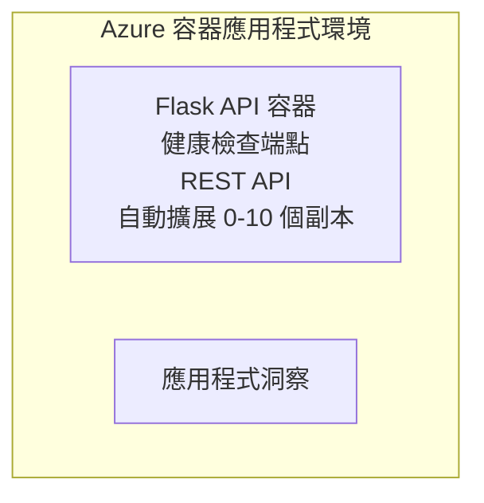

# 簡單的 Flask API - Container App 範例

**學習路線：** 初學者 ⭐ | **時間：** 25-35 分鐘 | **費用：** $0-15/月

一個完整、可運作的 Python Flask REST API，使用 Azure Developer CLI (azd) 部署到 Azure Container Apps。本範例示範容器部署、自動縮放與監控的基本概念。

## 🎯 你會學到

- 將容器化的 Python 應用程式部署到 Azure
- 設定具備縮放至零的自動縮放
- 實作健康探針與就緒檢查
- 監控應用程式日誌與指標
- 使用 Azure Developer CLI 進行快速部署

## 📦 包含內容

✅ **Flask 應用程式** - 完整的 REST API，包含 CRUD 操作 (`src/app.py`)  
✅ **Dockerfile** - 生產環境可用的容器設定  
✅ **Bicep 基礎架構** - Container Apps 環境與 API 部署  
✅ **AZD 設定** - 一鍵部署設定  
✅ <strong>健康探針</strong> - 已設定 Liveness 與 Readiness 檢查  
✅ <strong>自動縮放</strong> - 根據 HTTP 載入從 0-10 個複本縮放  

## 架構



## 先決條件

### 必要條件
- **Azure Developer CLI (azd)** - [安裝指南](https://learn.microsoft.com/azure/developer/azure-developer-cli/install-azd)
- **Azure 訂閱** - [免費帳戶](https://azure.microsoft.com/free/)
- **Docker Desktop** - [安裝 Docker](https://www.docker.com/products/docker-desktop/) (用於本地測試)

### 驗證先決條件

```bash
# 檢查 azd 版本（需要 1.5.0 或更高）
azd version

# 驗證 Azure 登入
azd auth login

# 檢查 Docker（可選，用於本地測試）
docker --version
```

## ⏱️ 部署時間表

| Phase | Duration | What Happens |
|-------|----------|--------------||
| Environment setup | 30 seconds | Create azd environment |
| Build container | 2-3 minutes | Docker build Flask app |
| Provision infrastructure | 3-5 minutes | Create Container Apps, registry, monitoring |
| Deploy application | 2-3 minutes | Push image and deploy to Container Apps |
| **Total** | **8-12 minutes** | Complete deployment ready |

## 快速開始

```bash
# 導覽至範例
cd examples/container-app/simple-flask-api

# 初始化環境（選擇唯一名稱）
azd env new myflaskapi

# 部署所有項目（基礎架構 + 應用程式）
azd up
# 您會被提示：
# 1. 選擇 Azure 訂閱
# 2. 選擇地點（例如：eastus2）
# 3. 等候 8-12 分鐘以完成部署

# 取得您的 API 端點
azd env get-values

# 測試 API
curl $(azd env get-value API_ENDPOINT)/health
```

**預期輸出：**
```json
{
  "status": "healthy",
  "timestamp": "2025-11-19T10:30:00Z",
  "service": "simple-flask-api",
  "version": "1.0.0"
}
```

## ✅ 驗證部署

### 步驟 1：檢查部署狀態

```bash
# 檢視已部署的服務
azd show

# 預期輸出顯示：
# - 服務：api
# - 端點：https://ca-api-[env].xxx.azurecontainerapps.io
# - 狀態：執行中
```

### 步驟 2：測試 API 端點

```bash
# 取得 API 端點
API_URL=$(azd env get-value API_ENDPOINT)

# 測試健康狀態
curl $API_URL/health

# 測試根端點
curl $API_URL/

# 建立一個項目
curl -X POST $API_URL/api/items \
  -H "Content-Type: application/json" \
  -d '{"name": "Test Item", "description": "My first item"}'

# 取得所有項目
curl $API_URL/api/items
```

**成功條件：**
- ✅ 健康端點回傳 HTTP 200
- ✅ 根端點顯示 API 資訊
- ✅ POST 可建立項目並回傳 HTTP 201
- ✅ GET 可回傳已建立的項目

### 步驟 3：查看日誌

```bash
# 使用 azd monitor 串流即時日誌
azd monitor --logs

# 或使用 Azure CLI：
az containerapp logs show --name api --resource-group $RG_NAME --follow

# 你應該會看到：
# - Gunicorn 啟動訊息
# - HTTP 請求日誌
# - 應用程式資訊日誌
```

## 專案結構

```
simple-flask-api/
├── azure.yaml              # AZD configuration
├── infra/
│   ├── main.bicep         # Main infrastructure
│   ├── main.parameters.json
│   └── app/
│       ├── container-env.bicep
│       └── api.bicep
└── src/
    ├── app.py             # Flask application
    ├── requirements.txt
    └── Dockerfile
```

## API 端點

| Endpoint | Method | Description |
|----------|--------|-------------|
| `/health` | GET | Health check |
| `/api/items` | GET | List all items |
| `/api/items` | POST | Create new item |
| `/api/items/{id}` | GET | Get specific item |
| `/api/items/{id}` | PUT | Update item |
| `/api/items/{id}` | DELETE | Delete item |

## 設定

### 環境變數

```bash
# 設定自訂配置
azd env set PORT 8000
azd env set LOG_LEVEL info
azd env set MAX_REPLICAS 20
```

### 縮放設定

此 API 會根據 HTTP 流量自動縮放：
- <strong>最小複本數</strong>: 0 (閒置時縮放至零)
- <strong>最大複本數</strong>: 10
- <strong>每個複本的並行請求數</strong>: 50

## 開發

### 本機執行

```bash
# 安裝相依套件
cd src
pip install -r requirements.txt

# 執行應用程式
python app.py

# 在本機測試
curl http://localhost:8000/health
```

### 建置並測試容器

```bash
# 建立 Docker 映像檔
docker build -t flask-api:local ./src

# 在本機執行容器
docker run -p 8000:8000 flask-api:local

# 測試容器
curl http://localhost:8000/health
```

## 部署

### 完整部署

```bash
# 部署基礎設施與應用程式
azd up
```

### 僅程式碼部署

```bash
# 只部署應用程式代碼（基礎設施保持不變）
azd deploy api
```

### 更新設定

```bash
# 更新環境變數
azd env set API_KEY "new-api-key"

# 使用新配置重新部署
azd deploy api
```

## 監控

### 查看日誌

```bash
# 使用 azd monitor 串流即時日誌
azd monitor --logs

# 或者使用 Azure CLI 針對 Container Apps：
az containerapp logs show --name api --resource-group $RG_NAME --follow

# 檢視最後 100 行
az containerapp logs show --name api --resource-group $RG_NAME --tail 100
```

### 監控指標

```bash
# 開啟 Azure Monitor 儀表板
azd monitor --overview

# 檢視特定指標
az monitor metrics list \
  --resource $(azd show --output json | jq -r '.services.api.resourceId') \
  --metric "Requests,ResponseTime"
```

## 測試

### 健康檢查

```bash
curl $(azd show --output json | jq -r '.services.api.endpoint')/health
```

預期回應：
```json
{
  "status": "healthy",
  "timestamp": "2025-11-19T10:30:00Z"
}
```

### 建立項目

```bash
curl -X POST $(azd show --output json | jq -r '.services.api.endpoint')/api/items \
  -H "Content-Type: application/json" \
  -d '{"name": "Test Item", "description": "A test item"}'
```

### 取得所有項目

```bash
curl $(azd show --output json | jq -r '.services.api.endpoint')/api/items
```

## 成本優化

此部署使用縮放至零（scale-to-zero），因此只有在 API 處理請求時才會產生費用：

- <strong>閒置成本</strong>：約 $0/月（縮放至零）
- <strong>啟用成本</strong>：約 $0.000024/秒（每複本）
- <strong>預期每月費用</strong>（輕度使用）：$5-15

### 進一步降低成本

```bash
# 為開發環境縮減最大副本數
azd env set MAX_REPLICAS 3

# 使用較短的閒置逾時
azd env set SCALE_TO_ZERO_TIMEOUT 300  # 5 分鐘
```

## 疑難排解

### 容器無法啟動

```bash
# 使用 Azure CLI 檢查容器日誌
az containerapp logs show --name api --resource-group $RG_NAME --tail 100

# 在本地驗證 Docker 映像能否建置
docker build -t test ./src
```

### API 無法存取

```bash
# 驗證 ingress 是否為外部
az containerapp show --name api --resource-group rg-simple-flask-api \
  --query properties.configuration.ingress.external
```

### 回應時間過長

```bash
# 檢查 CPU/記憶體 使用率
az monitor metrics list \
  --resource $(azd show --output json | jq -r '.services.api.resourceId') \
  --metric "CPUPercentage,MemoryPercentage"

# 如有需要，擴充資源
az containerapp update --name api --resource-group rg-simple-flask-api \
  --cpu 1.0 --memory 2Gi
```

## 清除資源

```bash
# 刪除所有資源
azd down --force --purge
```

## 下一步

### 擴展此範例

1. <strong>加入資料庫</strong> - 整合 Azure Cosmos DB 或 SQL Database
   ```bash
   # 在 infra/main.bicep 新增 Cosmos DB 模組
   # 更新 app.py 以加入資料庫連線
   ```

2. <strong>加入驗證</strong> - 實作 Microsoft Entra ID 或 API 金鑰
   ```python
   # 在 app.py 新增認證中介軟體
   from functools import wraps
   ```

3. **設定 CI/CD** - GitHub Actions 工作流程
   ```yaml
   # Create .github/workflows/deploy.yml
   name: Deploy to Azure
   on: [push]
   ```

4. **加入受管理的身分識別（Managed Identity）** - 保護對 Azure 服務的存取
   ```bicep
   # Update infra/app/api.bicep
   identity: { type: 'SystemAssigned' }
   ```

### 相關範例

- **[資料庫應用](../../../../../examples/database-app)** - 含 SQL Database 的完整範例
- **[微服務](../../../../../examples/container-app/microservices)** - 多服務架構
- **[Container Apps 主導指南](../README.md)** - 所有容器模式

### 學習資源

- 📚 [AZD 初學者課程](../../../README.md) - 主要課程首頁
- 📚 [Container Apps 範例模式](../README.md) - 更多部署模式
- 📚 [AZD 範本畫廊](https://azure.github.io/awesome-azd/) - 社群範本

## 額外資源

### 文件
- **[Flask Documentation](https://flask.palletsprojects.com/)** - Flask 框架指南
- **[Azure Container Apps](https://learn.microsoft.com/azure/container-apps/)** - 官方 Azure 文件
- **[Azure Developer CLI](https://learn.microsoft.com/azure/developer/azure-developer-cli/)** - azd 指令參考

### 教學
- **[Container Apps Quickstart](https://learn.microsoft.com/azure/container-apps/quickstart-portal)** - 部署你的第一個應用程式
- **[Python on Azure](https://learn.microsoft.com/azure/developer/python/)** - Python 開發指南
- **[Bicep Language](https://learn.microsoft.com/azure/azure-resource-manager/bicep/)** - 基礎架構即程式碼

### 工具
- **[Azure Portal](https://portal.azure.com)** - 以視覺化方式管理資源
- **[VS Code Azure Extension](https://marketplace.visualstudio.com/items?itemName=ms-azuretools.vscode-azurecontainerapps)** - IDE 整合

---

**🎉 恭喜！** 你已將生產就緒的 Flask API 部署到 Azure Container Apps，並具備自動縮放與監控功能。

**有問題嗎？** [開啟議題](https://github.com/microsoft/AZD-for-beginners/issues) 或查看 [常見問題](../../../resources/faq.md)

---

<!-- CO-OP TRANSLATOR DISCLAIMER START -->
**免責聲明**：
本文件使用 AI 翻譯服務 [Co-op Translator](https://github.com/Azure/co-op-translator) 進行翻譯。雖然我們力求準確，但請注意，自動翻譯可能包含錯誤或不準確之處。原始文件的母語版本應被視為權威來源。對於重要資訊，建議尋求專業人工翻譯。我們不對因使用本翻譯而引起的任何誤解或曲解承擔責任。
<!-- CO-OP TRANSLATOR DISCLAIMER END -->