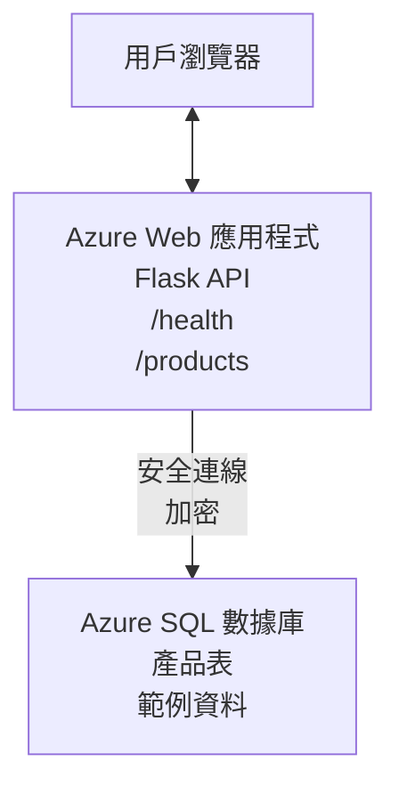

# 使用 AZD 部署 Microsoft SQL 資料庫與網頁應用程式

⏱️ <strong>預計時間</strong>：20-30 分鐘 | 💰 <strong>預估費用</strong>：約 $15-25/月 | ⭐ <strong>難度</strong>：中階

這個 <strong>完整且可運行的範例</strong> 展示如何使用 [Azure Developer CLI (azd)](https://learn.microsoft.com/azure/developer/azure-developer-cli/) 來部署一個搭配 Microsoft SQL 資料庫的 Python Flask 網頁應用程式到 Azure。所有程式碼皆包含並經測試 — 不需外部依賴。

## 你將學會什麼

完成此範例後，你將會：
- 使用基礎架構即程式碼部署多層應用程式（網頁應用程式 + 資料庫）
- 配置安全的資料庫連線，而無需在程式碼中硬編密碼
- 使用 Application Insights 監控應用程式健康狀況
- 使用 AZD CLI 高效管理 Azure 資源
- 遵循 Azure 關於安全、成本優化與可觀察性的最佳實踐

## 情境概述
- <strong>網頁應用程式</strong>：Python Flask REST API，具備資料庫連接功能
- <strong>資料庫</strong>：Azure SQL Database，含範例資料
- <strong>基礎架構</strong>：使用 Bicep 編排（模組化，可重用模板）
- <strong>部署</strong>：完全自動化，使用 `azd` 指令執行
- <strong>監控</strong>：採用 Application Insights 進行日誌及遙測收集

## 先決條件

### 必備工具

開始前，請確認你已安裝以下工具：

1. **[Azure CLI](https://learn.microsoft.com/cli/azure/install-azure-cli)**（版本 2.50.0 或以上）
   ```sh
   az --version
   # 預期輸出：azure-cli 2.50.0 或更高版本
   ```

2. **[Azure Developer CLI (azd)](https://learn.microsoft.com/azure/developer/azure-developer-cli/install-azd)**（版本 1.0.0 或以上）
   ```sh
   azd version
   # 預期輸出：azd 版本 1.0.0 或以上
   ```

3. **[Python 3.8+](https://www.python.org/downloads/)**（用於本機開發）
   ```sh
   python --version
   # 預期輸出：Python 3.8 或以上版本
   ```

4. **[Docker](https://www.docker.com/get-started)**（非必要，本機容器化開發用）
   ```sh
   docker --version
   # 預期輸出：Docker 版本 20.10 或更高
   ```

### Azure 要求

- 一個有效的 **Azure 訂閱**（[建立免費帳號](https://azure.microsoft.com/free/)）
- 有權限在訂閱中創建資源
- 訂閱或資源群組擁有 <strong>擁有者</strong> 或 <strong>參與者</strong> 角色

### 知識先修

此例為 <strong>中階</strong>。你應該具備：
- 基本命令行操作能力
- 雲端基礎概念（資源、資源群組）
- 網頁應用程式與資料庫基礎知識

**初次接觸 AZD？** 建議先閱讀 [入門指南](../../docs/chapter-01-foundation/azd-basics.md)。

## 架構

此範例部署一個兩層架構，含網頁應用程式與 SQL 資料庫：


**資源部署：**
- <strong>資源群組</strong>：容納所有資源的容器
- <strong>應用服務方案</strong>：基於 Linux 的主機方案（選用 B1 層以節省成本）
- <strong>網頁應用程式</strong>：Python 3.11 執行環境，搭配 Flask 應用
- **SQL 伺服器**：託管資料庫伺服器，最低 TLS 1.2
- **SQL 資料庫**：基礎層（2GB，適合開發/測試）
- **Application Insights**：監控與日誌記錄
- **Log Analytics 工作區**：集中式日誌存儲

<strong>比喻</strong>：類似餐廳（網頁應用程式）有一個冷凍庫（資料庫）。顧客從菜單（API 端點）下單，廚房（Flask 應用程式）從冷凍庫中取出食材（資料）。餐廳經理（Application Insights）監控所有作業。

## 資料夾結構

所有檔案皆包含在此範例中 — 不需外部依賴：

```
examples/database-app/
│
├── README.md                    # This file
├── azure.yaml                   # AZD configuration file
├── .env.sample                  # Sample environment variables
├── .gitignore                   # Git ignore patterns
│
├── infra/                       # Infrastructure as Code (Bicep)
│   ├── main.bicep              # Main orchestration template
│   ├── abbreviations.json      # Azure naming conventions
│   └── resources/              # Modular resource templates
│       ├── sql-server.bicep    # SQL Server configuration
│       ├── sql-database.bicep  # Database configuration
│       ├── app-service-plan.bicep  # Hosting plan
│       ├── app-insights.bicep  # Monitoring setup
│       └── web-app.bicep       # Web application
│
└── src/
    └── web/                    # Application source code
        ├── app.py              # Flask REST API
        ├── requirements.txt    # Python dependencies
        └── Dockerfile          # Container definition
```

**各檔案說明：**
- **azure.yaml**：告訴 AZD 如何及在哪裡部署
- **infra/main.bicep**：協調所有 Azure 資源
- **infra/resources/*.bicep**：獨立資源定義（模組化以便重用）
- **src/web/app.py**：帶有資料庫邏輯的 Flask 應用程式
- **requirements.txt**：Python 套件依賴
- **Dockerfile**：部署用容器化指令

## 快速開始（逐步說明）

### 步驟 1：複製並進入專案目錄

```sh
git clone https://github.com/microsoft/AZD-for-beginners.git
cd AZD-for-beginners/examples/database-app
```

**✓ 成功檢查**：確認目錄中有 `azure.yaml` 文件及 `infra/` 資料夾：
```sh
ls
# 預期: README.md, azure.yaml, infra/, src/
```

### 步驟 2：登入 Azure

```sh
azd auth login
```

系統將開啟瀏覽器進行 Azure 認證。請使用你的 Azure 帳號登入。

**✓ 成功檢查**：你應該會看到：
```
Logged in to Azure.
```

### 步驟 3：初始化環境

```sh
azd init
```

<strong>發生了什麼</strong>：AZD 為你的部署建立本機設定檔。

<strong>你將看到的提示</strong>：
- <strong>環境名稱</strong>：輸入短名稱（例如 `dev`、`myapp`）
- **Azure 訂閱**：從清單中選擇你的訂閱
- **Azure 區域**：選擇部署區域（例如 `eastus`、`westeurope`）

**✓ 成功檢查**：你會看到：
```
SUCCESS: New project initialized!
```

### 步驟 4：配置 Azure 資源

```sh
azd provision
```

<strong>發生了什麼</strong>：AZD 部署所有基礎架構（約需 5-8 分鐘）：
1. 創建資源群組
2. 創建 SQL 伺服器與資料庫
3. 創建應用服務方案
4. 創建網頁應用程式
5. 創建 Application Insights
6. 配置網路與安全性

<strong>你將被要求輸入</strong>：
- **SQL 管理員使用者名稱**：輸入使用者名稱（例如 `sqladmin`）
- **SQL 管理員密碼**：輸入複雜密碼（務必記住！）

**✓ 成功檢查**：你會看到：
```
SUCCESS: Your application was provisioned in Azure in X minutes Y seconds.
You can view the resources created under the resource group rg-<env-name> in Azure Portal:
https://portal.azure.com/#@/resource/subscriptions/.../resourceGroups/rg-<env-name>
```

**⏱️ 時間**：5-8 分鐘

### 步驟 5：部署應用程式

```sh
azd deploy
```

<strong>發生了什麼</strong>：AZD 建置及部署 Flask 應用程式：
1. 打包 Python 應用程式
2. 建置 Docker 容器
3. 推送至 Azure 網頁應用程式
4. 初始化資料庫並匯入範例資料
5. 啟動應用程式

**✓ 成功檢查**：你會看到：
```
SUCCESS: Your application was deployed to Azure in X minutes Y seconds.
You can view the resources created under the resource group rg-<env-name> in Azure Portal:
https://portal.azure.com/#@/resource/subscriptions/.../resourceGroups/rg-<env-name>
```

**⏱️ 時間**：3-5 分鐘

### 步驟 6：瀏覽應用程式

```sh
azd browse
```

系統會於瀏覽器打開部署好的網頁應用程式網址：`https://app-<unique-id>.azurewebsites.net`

**✓ 成功檢查**：你會看到 JSON 輸出：
```json
{
  "message": "Welcome to the Database App API",
  "endpoints": {
    "/": "This help message",
    "/health": "Health check endpoint",
    "/products": "List all products",
    "/products/<id>": "Get product by ID"
  }
}
```

### 步驟 7：測試 API 端點

<strong>健康檢查</strong>（確認資料庫連線正常）：
```sh
curl https://app-<your-id>.azurewebsites.net/health
```

<strong>預期回應</strong>：
```json
{
  "status": "healthy",
  "database": "connected"
}
```

<strong>列出產品</strong>（範例資料）：
```sh
curl https://app-<your-id>.azurewebsites.net/products
```

<strong>預期回應</strong>：
```json
[
  {
    "id": 1,
    "name": "Laptop",
    "description": "High-performance laptop",
    "price": 1299.99,
    "created_at": "2025-11-19T10:30:00"
  },
  ...
]
```

<strong>取得單一產品</strong>：
```sh
curl https://app-<your-id>.azurewebsites.net/products/1
```

**✓ 成功檢查**：所有端點皆以 JSON 格式回應且無錯誤。

---

**🎉 恭喜！** 你已成功利用 AZD 將含資料庫的網頁應用程式部署至 Azure。

## 設定深入解析

### 環境變數

密碼透過 Azure 應用服務設定安全管理 — <strong>絕不硬編於原始碼中</strong>。

**由 AZD 自動設定**：
- `SQL_CONNECTION_STRING`：含加密認證的資料庫連接字串
- `APPLICATIONINSIGHTS_CONNECTION_STRING`：監控遙測端點連接字串
- `SCM_DO_BUILD_DURING_DEPLOYMENT`：啟用自動安裝依賴套件

<strong>密碼儲存位置</strong>：
1. `azd provision` 時，透過安全提示輸入 SQL 認證
2. AZD 將認證存於本機 `.azure/<env-name>/.env` 檔案（git 排除）
3. AZD 注入設定至 Azure 應用服務配置（靜態加密）
4. 應用程式執行時，經由 `os.getenv()` 讀取環境變數

### 本機開發

本機測試可由樣板建立 `.env` 檔案：

```sh
cp .env.sample .env
# 使用本地數據庫連接編輯 .env
```

<strong>本機開發流程</strong>：
```sh
# 安裝依賴
cd src/web
pip install -r requirements.txt

# 設定環境變數
export SQL_CONNECTION_STRING="your-local-connection-string"

# 執行應用程式
python app.py
```

<strong>本地測試</strong>：
```sh
curl http://localhost:8000/health
# 預期：{"status": "healthy", "database": "connected"}
```

### 基礎架構即程式碼

所有 Azure 資源皆定義於 **Bicep 模板**（`infra/` 目錄）：

- <strong>模組化設計</strong>：每種資源都有獨立文件，方便重用
- <strong>參數化</strong>：可自訂 SKU、區域、命名規則
- <strong>最佳實踐</strong>：遵循 Azure 命名規範與安全預設
- <strong>版本控管</strong>：基礎架構變更納入 Git 管理

<strong>自訂範例</strong>：若需變更資料庫層級，編輯 `infra/resources/sql-database.bicep`：
```bicep
sku: {
  name: 'Standard'  // Changed from 'Basic'
  tier: 'Standard'
  capacity: 10
}
```

## 安全最佳實務

本範例遵循 Azure 安全最佳實務：

### 1. <strong>原始程式碼不含密碼</strong>
- ✅ 憑證儲存在 Azure 應用服務設定（加密）
- ✅ `.env` 檔排除於 Git（透過 `.gitignore`）
- ✅ 密碼於部署時透過安全參數傳遞

### 2. <strong>加密連線</strong>
- ✅ SQL 伺服器最低採用 TLS 1.2
- ✅ 網頁應用程式強制 HTTPS
- ✅ 資料庫連線皆以加密通道通訊

### 3. <strong>網路安全</strong>
- ✅ SQL 伺服器防火牆限制僅允許 Azure 服務
- ✅ 公共網路存取受限（可進一步鎖定 Private Endpoint）
- ✅ 停用應用服務上的 FTPS

### 4. <strong>認證與授權</strong>
- ⚠️ <strong>目前</strong>：採用 SQL 認證（使用者名稱/密碼）
- ✅ <strong>生產環境建議</strong>：使用 Azure 託管身份實現無密碼認證

**升級為託管身份（生產環境）**：
1. 啟用網頁應用的託管身份
2. 授權該身份 SQL 權限
3. 更新連接字串使用託管身份
4. 移除基於密碼的認證

### 5. <strong>稽核與合規</strong>
- ✅ Application Insights 記錄所有請求與錯誤
- ✅ SQL 資料庫啟用稽核（可自訂符合合規需求）
- ✅ 所有資源皆加標籤以利治理

<strong>生產環境安全檢查清單</strong>：
- [ ] 啟用 Azure Defender for SQL
- [ ] 配置 SQL 資料庫 Private Endpoint
- [ ] 啟用 Web Application Firewall (WAF)
- [ ] 實施 Azure Key Vault 管理密碼輪替
- [ ] 配置 Azure AD 認證
- [ ] 啟用所有資源診斷日誌記錄

## 成本優化

<strong>預估月費</strong>（截至 2025 年 11 月）：

| 資源 | SKU/層級 | 預估費用 |
|----------|----------|--------------|
| 應用服務方案 | B1 （基礎層） | 約 $13/月 |
| SQL 資料庫 | 基礎層 (2GB) | 約 $5/月 |
| Application Insights | 按使用付費 | 約 $2/月（流量低） |
| <strong>總計</strong> | | **約 $20/月** |

**💡 節省費用小撇步**：

1. <strong>學習用建議使用免費層</strong>：
   - 應用服務：F1 層（免費，限制使用時數）
   - SQL 資料庫：使用 Azure SQL Database Serverless
   - Application Insights：每月前 5GB 免費遙測攝取

2. <strong>不使用時暫停資源</strong>：
   ```sh
   # 停止網頁應用程式（資料庫依然收費）
   az webapp stop --name <app-name> --resource-group <rg-name>
   
   # 需要時重新啟動
   az webapp start --name <app-name> --resource-group <rg-name>
   ```

3. <strong>測試後刪除所有資源</strong>：
   ```sh
   azd down
   ```
 藉此移除所有資源並停止費用產生。

4. <strong>開發與生產不同規格</strong>：
   - <strong>開發環境</strong>：基礎層（本範例使用）
   - <strong>生產環境</strong>：標準／高階層，具備高可用與備援

<strong>成本監控</strong>：
- 於 [Azure 成本管理](https://portal.azure.com/#view/Microsoft_Azure_CostManagement) 查看費用
- 設定成本警示防止意外超支
- 為所有資源加註 `azd-env-name` 標籤以便追蹤

<strong>免費層方案</strong>：
學習用途可修改 `infra/resources/app-service-plan.bicep`：
```bicep
sku: {
  name: 'F1'  // Free tier
  tier: 'Free'
}
```
<strong>注意</strong>：免費層有限制（每日 CPU 使用 60 分鐘，無法保持常駐）。

## 監控與可觀察性

### Application Insights 整合

本範例包含 **Application Insights**，提供完整監控功能：

<strong>監控項目</strong>：
- ✅ HTTP 請求（延遲、狀態碼、端點）
- ✅ 應用程式錯誤與例外
- ✅ Flask 應用的自訂日誌
- ✅ 資料庫連線健康狀況
- ✅ 性能監控（CPU、記憶體）

**存取 Application Insights**：
1. 開啟 [Azure 入口網站](https://portal.azure.com)
2. 導覽至你的資源群組（`rg-<env-name>`）
3. 點選 Application Insights 資源（`appi-<unique-id>`）

<strong>有用查詢</strong>（Application Insights → 日誌）：

<strong>查看所有請求</strong>：
```kusto
requests
| where timestamp > ago(1h)
| order by timestamp desc
| project timestamp, name, url, resultCode, duration
```

<strong>尋找錯誤</strong>：
```kusto
exceptions
| where timestamp > ago(24h)
| order by timestamp desc
| project timestamp, type, outerMessage, operation_Name
```

<strong>檢查健康端點</strong>：
```kusto
requests
| where name contains "health"
| summarize count() by resultCode, bin(timestamp, 1h)
```

### SQL 資料庫稽核

**已啟用 SQL 資料庫稽核**，可追蹤：
- 資料庫存取模式
- 登入失敗嘗試
- 結構變更
- 資料存取（合規需求）

<strong>存取稽核日誌</strong>：
1. Azure 入口網站 → SQL 資料庫 → 稽核設定
2. 於 Log Analytics 工作區查看日誌

### 即時監控

<strong>查看即時指標</strong>：
1. Application Insights → 即時指標
2. 即時監控請求、失敗率與效能

<strong>設定警示</strong>：
為關鍵事件建立警示：
- HTTP 500 錯誤 5 次以上（5 分鐘內）
- 資料庫連線失敗
- 高延遲（超過 2 秒）

<strong>範例警示建立</strong>：
```sh
az monitor metrics alert create \
  --name "High-Response-Time" \
  --resource-group <rg-name> \
  --scopes <app-insights-resource-id> \
  --condition "avg requests/duration > 2000" \
  --description "Alert when response time exceeds 2 seconds"
```

## 疑難排解
### 常見問題與解決方案

#### 1. `azd provision` 失敗並顯示「Location not available」

<strong>症狀</strong>：  
```
Error: The subscription is not registered for the resource type 'components' in the location 'centralus'.
```
  
<strong>解決方案</strong>：  
選擇不同的 Azure 區域或註冊資源提供者：  
```sh
az provider register --namespace Microsoft.Insights
```
  
#### 2. 部署期間 SQL 連接失敗

<strong>症狀</strong>：  
```
pyodbc.OperationalError: ('08001', '[08001] [Microsoft][ODBC Driver 18 for SQL Server]TCP Provider...')
```
  
<strong>解決方案</strong>：  
- 確認 SQL Server 防火牆允許 Azure 服務（自動設定）  
- 確認在 `azd provision` 過程中正確輸入 SQL 管理員密碼  
- 確保 SQL Server 完全配置（可能需時 2-3 分鐘）  

<strong>驗證連線</strong>：  
```sh
# 從 Azure 入口網站，前往 SQL 資料庫 → 查詢編輯器
# 嘗試使用您的憑證連線
```
  
#### 3. Web 應用顯示「Application Error」

<strong>症狀</strong>：  
瀏覽器顯示一般錯誤頁面。

<strong>解決方案</strong>：  
檢查應用日誌：  
```sh
# 檢視最近記錄
az webapp log tail --name <app-name> --resource-group <rg-name>
```
  
<strong>常見原因</strong>：  
- 缺少環境變數（檢查 App Service → Configuration）  
- Python 套件安裝失敗（檢查部署日誌）  
- 資料庫初始化錯誤（檢查 SQL 連接性）  

#### 4. `azd deploy` 失敗並顯示「Build Error」

<strong>症狀</strong>：  
```
Error: Failed to build project
```
  
<strong>解決方案</strong>：  
- 確保 `requirements.txt` 無語法錯誤  
- 檢查 `infra/resources/web-app.bicep` 中指定 Python 3.11  
- 確認 Dockerfile 使用正確的基底映像  

<strong>本地除錯</strong>：  
```sh
cd src/web
docker build -t test-app .
docker run -p 8000:8000 test-app
```
  
#### 5. 執行 AZD 指令時顯示「Unauthorized」

<strong>症狀</strong>：  
```
ERROR: (Unauthorized) The client '<id>' with object id '<id>' does not have authorization
```
  
<strong>解決方案</strong>：  
重新進行 Azure 登入：  
```sh
# AZD 工作流程所需
azd auth login

# 如果您也直接使用 Azure CLI 命令，則為可選
az login
```
  
確認你在訂閱中擁有正確權限（參與者角色）。

#### 6. 高額資料庫費用

<strong>症狀</strong>：  
意外收到 Azure 帳單。

<strong>解決方案</strong>：  
- 檢查是否忘記在測試後執行 `azd down`  
- 確認 SQL Database 使用 Basic 等級（非 Premium）  
- 透過 Azure 成本管理檢視費用  
- 設定費用警示  

### 尋求協助

**檢視所有 AZD 環境變數**：  
```sh
azd env get-values
```
  
<strong>檢查部署狀態</strong>：  
```sh
az webapp show --name <app-name> --resource-group <rg-name> --query state
```
  
<strong>存取應用程式日誌</strong>：  
```sh
az webapp log download --name <app-name> --resource-group <rg-name> --log-file app-logs.zip
```
  
**需要更多幫助？**  
- [AZD 故障排除指南](../../docs/chapter-07-troubleshooting/common-issues.md)  
- [Azure App Service 故障排除](https://learn.microsoft.com/azure/app-service/troubleshoot-diagnostic-logs)  
- [Azure SQL 故障排除](https://learn.microsoft.com/azure/azure-sql/database/troubleshoot-common-errors-issues)  

## 實務練習

### 練習 1：驗證部署（初階）

<strong>目標</strong>：確認所有資源皆已部署且應用正常運作。

<strong>步驟</strong>：  
1. 列出資源群組中的所有資源：  
   ```sh
   az resource list --resource-group rg-<env-name> --output table
   ```
  
   <strong>預期結果</strong>：6-7 個資源（Web App、SQL Server、SQL Database、App Service Plan、Application Insights、Log Analytics）  

2. 測試所有 API 端點：  
   ```sh
   curl https://app-<your-id>.azurewebsites.net/
   curl https://app-<your-id>.azurewebsites.net/health
   curl https://app-<your-id>.azurewebsites.net/products
   curl https://app-<your-id>.azurewebsites.net/products/1
   ```
  
   <strong>預期結果</strong>：全部返回有效 JSON，無錯誤  

3. 檢查 Application Insights：  
   - 開啟 Azure Portal 中的 Application Insights  
   - 進入 "Live Metrics"  
   - 在 Web App 頁面重新整理瀏覽器  
   <strong>預期結果</strong>：看到即時出現的請求紀錄  

<strong>成功標準</strong>：所有 6-7 個資源存在，所有端點返回資料，Live Metrics 顯示活動。

---

### 練習 2：新增 API 端點（中階）

<strong>目標</strong>：為 Flask 應用增加新的端點。

<strong>起始程式碼</strong>：`src/web/app.py` 中現有端點

<strong>步驟</strong>：  
1. 編輯 `src/web/app.py`，在 `get_product()` 函數後新增端點：  
   ```python
   @app.route('/products/search/<keyword>')
   def search_products(keyword):
       """Search products by name or description."""
       try:
           conn = get_db_connection()
           cursor = conn.cursor()
           cursor.execute(
               "SELECT id, name, description, price, created_at FROM products WHERE name LIKE ? OR description LIKE ?",
               (f'%{keyword}%', f'%{keyword}%')
           )
           
           products = []
           for row in cursor.fetchall():
               products.append({
                   'id': row[0],
                   'name': row[1],
                   'description': row[2],
                   'price': float(row[3]) if row[3] else None,
                   'created_at': row[4].isoformat() if row[4] else None
               })
           
           cursor.close()
           conn.close()
           
           logger.info(f"Search for '{keyword}' returned {len(products)} results")
           return jsonify(products), 200
           
       except Exception as e:
           logger.error(f"Error searching products: {str(e)}")
           return jsonify({'error': str(e)}), 500
   ```
  
2. 部署更新後的應用程式：  
   ```sh
   azd deploy
   ```
  
3. 測試新的端點：  
   ```sh
   curl https://app-<your-id>.azurewebsites.net/products/search/laptop
   ```
  
   <strong>預期結果</strong>：返回含有「laptop」的產品  

<strong>成功標準</strong>：新端點可用，返回篩選結果，並能在 Application Insights 日誌中看到。

---

### 練習 3：新增監控和警示（進階）

<strong>目標</strong>：設置提前監控與警示。

<strong>步驟</strong>：  
1. 建立 HTTP 500 錯誤警示：  
   ```sh
   # 獲取 Application Insights 資源 ID
   AI_ID=$(az monitor app-insights component show \
     --app appi-<your-id> \
     --resource-group rg-<env-name> \
     --query id -o tsv)
   
   # 創建警報
   az monitor metrics alert create \
     --name "High-Error-Rate" \
     --resource-group rg-<env-name> \
     --scopes $AI_ID \
     --condition "count requests/failed > 5" \
     --window-size 5m \
     --evaluation-frequency 1m \
     --description "Alert when >5 failed requests in 5 minutes"
   ```
  
2. 觸發錯誤以引發警示：  
   ```sh
   # 請求一個不存在的產品
   for i in {1..10}; do curl https://app-<your-id>.azurewebsites.net/products/999; done
   ```
  
3. 檢查警示是否觸發：  
   - Azure Portal → Alerts → Alert Rules  
   - 檢查郵件（若有設定）  

<strong>成功標準</strong>：警示規則建立且可觸發錯誤通知。

---

### 練習 4：資料庫結構變更（進階）

<strong>目標</strong>：新增資料表並修改應用程式使用。

<strong>步驟</strong>：  
1. 透過 Azure Portal Query Editor 連接 SQL Database

2. 新增 `categories` 資料表：  
   ```sql
   CREATE TABLE categories (
       id INT PRIMARY KEY IDENTITY(1,1),
       name NVARCHAR(50) NOT NULL,
       description NVARCHAR(200)
   );
   
   INSERT INTO categories (name, description) VALUES
   ('Electronics', 'Electronic devices and accessories'),
   ('Office Supplies', 'Office equipment and supplies');
   
   -- Add category to products table
   ALTER TABLE products ADD category_id INT;
   UPDATE products SET category_id = 1; -- Set all to Electronics
   ```
  
3. 更新 `src/web/app.py`，在回應中加入分類資訊

4. 部署並測試

<strong>成功標準</strong>：新資料表存在，產品顯示分類資訊，應用仍正常。

---

### 練習 5：實作快取（專家）

<strong>目標</strong>：新增 Azure Redis Cache 以提升效能。

<strong>步驟</strong>：  
1. 在 `infra/main.bicep` 新增 Redis Cache  
2. 更新 `src/web/app.py` 對產品查詢進行快取  
3. 使用 Application Insights 測量效能提升  
4. 比較快取前後的回應時間

<strong>成功標準</strong>：Redis 已部署，快取生效，回應時間提升超過 50%。

<strong>提示</strong>：參考 [Azure Cache for Redis 文件](https://learn.microsoft.com/azure/azure-cache-for-redis/)。

---

## 清理資源

為避免額外費用，完成後刪除所有資源：

```sh
azd down
```
  
<strong>確認提示</strong>：  
```
? Total resources to delete: 7, are you sure you want to continue? (y/N)
```
  
輸入 `y` 確認。

**✓ 成功檢查**：  
- Azure Portal 中已刪除所有資源  
- 無持續產生的費用  
- 可以刪除本機的 `.azure/<env-name>` 資料夾  

<strong>替代方案</strong>（保留基礎結構，刪除資料）：  
```sh
# 只刪除資源群組（保留 AZD 配置）
az group delete --name rg-<env-name> --yes
```
  
## 深入了解

### 相關文件  
- [Azure Developer CLI 文件](https://learn.microsoft.com/azure/developer/azure-developer-cli/)  
- [Azure SQL Database 文件](https://learn.microsoft.com/azure/azure-sql/database/)  
- [Azure App Service 文件](https://learn.microsoft.com/azure/app-service/)  
- [Application Insights 文件](https://learn.microsoft.com/azure/azure-monitor/app/app-insights-overview)  
- [Bicep 語言參考](https://learn.microsoft.com/azure/azure-resource-manager/bicep/)  

### 本課程後續步驟  
- **[Container Apps 範例](../../../../examples/container-app)**：使用 Azure Container Apps 部署微服務  
- **[AI 整合指南](../../../../docs/ai-foundry)**：為應用新增 AI 功能  
- **[部署最佳實務](../../docs/chapter-04-infrastructure/deployment-guide.md)**：生產環境部署範例  

### 進階主題  
- **Managed Identity**：移除密碼，改用 Azure AD 認證  
- **Private Endpoints**：在虛擬網路中保護資料庫連線  
- **CI/CD 整合**：使用 GitHub Actions 或 Azure DevOps 自動化部署  
- <strong>多環境管理</strong>：設定開發、測試與生產環境  
- <strong>資料庫遷移</strong>：使用 Alembic 或 Entity Framework 進行結構版本控管  

### 與其他方法比較

**AZD vs. ARM 模板**：  
- ✅ AZD：較高階抽象，指令更簡單  
- ⚠️ ARM：較冗長，控制更細緻  

**AZD vs. Terraform**：  
- ✅ AZD：Azure 原生，與 Azure 服務整合良好  
- ⚠️ Terraform：支援多雲，生態系更大  

**AZD vs. Azure Portal**：  
- ✅ AZD：可重複使用，版本控管，自動化  
- ⚠️ Portal：手動操作，不易重現  

**你可以把 AZD 想成是**：Azure 的 Docker Compose—用簡化設定來管理複雜部署。

---

## 常見問題

**問：可以使用其他程式語言嗎？**  
答：可以！將 `src/web/` 替換成 Node.js、C#、Go 或任何語言，並更新 `azure.yaml` 和 Bicep。

**問：如何新增更多資料庫？**  
答：在 `infra/main.bicep` 新增另一個 SQL Database 模組，或使用 Azure Database 的 PostgreSQL/MySQL。

**問：可以用於生產環境嗎？**  
答：這是起點。生產環境還需加入：Managed Identity、Private Endpoints、冗餘、備份策略、WAF、加強監控。

**問：想用容器代替程式碼部署怎麼辦？**  
答：參考 [Container Apps 範例](../../../../examples/container-app)，全程使用 Docker 容器。

**問：如何從本機連接資料庫？**  
答：將你的 IP 加入 SQL Server 防火牆：  
```sh
az sql server firewall-rule create \
  --resource-group rg-<env-name> \
  --server sql-<unique-id> \
  --name AllowMyIP \
  --start-ip-address <your-ip> \
  --end-ip-address <your-ip>
```
  
**問：可以使用現有資料庫而不新建嗎？**  
答：可以，修改 `infra/main.bicep` 指定現有 SQL Server，並更新連線字串參數。

---

> **注意：** 本範例示範使用 AZD 部署含資料庫的 Web 應用的最佳實務，包含可運行的程式碼、詳細文檔與實務練習，加深學習印象。生產環境部署請依組織安全性、擴充性、法規遵從與費用需求額外規劃。  

**📚 課程導覽：**  
- ← 上一課：[Container Apps 範例](../../../../examples/container-app)  
- → 下一課：[AI 整合指南](../../../../docs/ai-foundry)  
- 🏠 [課程首頁](../../README.md)

---

<!-- CO-OP TRANSLATOR DISCLAIMER START -->
**免責聲明**：  
本文件係使用 AI 翻譯服務 [Co-op Translator](https://github.com/Azure/co-op-translator) 所翻譯。儘管我們致力於準確性，請注意自動翻譯可能存在錯誤或不準確之處。原始文件的母語版本應被視為權威來源。對於重要資訊，建議採用專業人工翻譯。本公司不對使用此翻譯而產生之任何誤解或誤釋負責。
<!-- CO-OP TRANSLATOR DISCLAIMER END -->