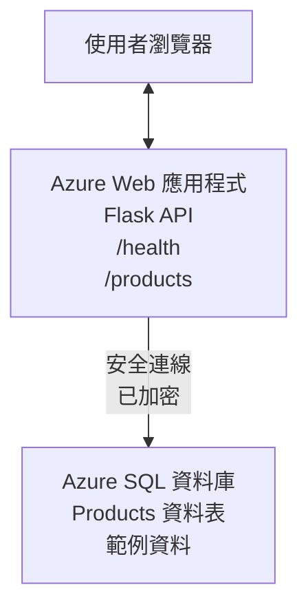

# 使用 AZD 部署 Microsoft SQL 資料庫和 Web 應用程式

⏱️ <strong>估計時間</strong>：20-30 分鐘 | 💰 <strong>估計費用</strong>：約 $15-25/月 | ⭐ <strong>複雜度</strong>：中階

這個 <strong>完整且可執行的範例</strong> 示範如何使用 [Azure 開發者 CLI (azd)](https://learn.microsoft.com/azure/developer/azure-developer-cli/) 將 Python Flask Web 應用程式與 Microsoft SQL 資料庫部署到 Azure。所有程式碼皆已包含並經過測試—不需要外部相依項目。

## 你將學到的內容

完成此範例後，你將會：
- 使用基礎架構即程式碼部署多層應用（Web 應用 + 資料庫）
- 在不硬編碼祕密的情況下設定安全的資料庫連線
- 使用 Application Insights 監控應用程式健康狀態
- 使用 AZD CLI 有效率地管理 Azure 資源
- 遵循 Azure 的安全、成本優化與可觀察性最佳實務

## 情境概述
- **Web 應用程式**：具有資料庫連線的 Python Flask REST API
- <strong>資料庫</strong>：含範例資料的 Azure SQL Database
- <strong>基礎架構</strong>：使用 Bicep 佈建（模組化、可重用的範本）
- <strong>部署</strong>：以 `azd` 指令完全自動化
- <strong>監控</strong>：使用 Application Insights 進行日誌與遙測

## 前置需求

### 必要工具

開始之前，確認已安裝以下工具：

1. **[Azure CLI](https://learn.microsoft.com/cli/azure/install-azure-cli)**（版本 2.50.0 或更高）
   ```sh
   az --version
   # 預期輸出：azure-cli 2.50.0 或更高版本
   ```

2. **[Azure 開發者 CLI (azd)](https://learn.microsoft.com/azure/developer/azure-developer-cli/install-azd)**（版本 1.0.0 或更高）
   ```sh
   azd version
   # 預期輸出：azd 版本 1.0.0 或更高
   ```

3. **[Python 3.8+](https://www.python.org/downloads/)**（用於本地開發）
   ```sh
   python --version
   # 預期輸出：Python 3.8 或更高版本
   ```

4. **[Docker](https://www.docker.com/get-started)**（可選，用於本地容器化開發）
   ```sh
   docker --version
   # 預期輸出：Docker 版本 20.10 或更高
   ```

### Azure 要求

- 活躍的 **Azure 訂閱**（[建立免費帳戶](https://azure.microsoft.com/free/)）
- 在您的訂閱中建立資源的權限
- 在訂閱或資源群組上具有 **Owner** 或 **Contributor** 角色

### 知識前置條件

這是個 <strong>中階</strong> 範例。您應該熟悉：
- 基本的命令列操作
- 雲端基本概念（資源、資源群組）
- 對 Web 應用程式和資料庫有基本了解

**不熟悉 AZD？** 請先閱讀 [入門指南](../../docs/chapter-01-foundation/azd-basics.md)。

## 架構

此範例會部署一個由 Web 應用程式與 SQL 資料庫組成的雙層架構：


**資源部署：**
- <strong>資源群組</strong>：所有資源的容器
- **App Service 計劃**：基於 Linux 的主機（為節省成本使用 B1 等級）
- **Web 應用程式**：使用 Python 3.11 執行階段的 Flask 應用程式
- **SQL Server**：受管理的資料庫伺服器，最低支援 TLS 1.2
- **SQL Database**：Basic 等級（2GB，適用於開發/測試）
- **Application Insights**：監控與記錄
- **Log Analytics Workspace**：集中式日誌儲存

<strong>比喻</strong>：可以把它想像成一家餐廳（Web 應用程式）搭配一個大型冷庫（資料庫）。顧客從菜單（API 端點）點餐，廚房（Flask 應用程式）從冷庫拿食材（資料）。餐廳經理（Application Insights）會追蹤所有發生的事。

## 資料夾結構

此範例包含所有檔案—不需要外部相依項目：

```
examples/database-app/
│
├── README.md                    # This file
├── azure.yaml                   # AZD configuration file
├── .env.sample                  # Sample environment variables
├── .gitignore                   # Git ignore patterns
│
├── infra/                       # Infrastructure as Code (Bicep)
│   ├── main.bicep              # Main orchestration template
│   ├── abbreviations.json      # Azure naming conventions
│   └── resources/              # Modular resource templates
│       ├── sql-server.bicep    # SQL Server configuration
│       ├── sql-database.bicep  # Database configuration
│       ├── app-service-plan.bicep  # Hosting plan
│       ├── app-insights.bicep  # Monitoring setup
│       └── web-app.bicep       # Web application
│
└── src/
    └── web/                    # Application source code
        ├── app.py              # Flask REST API
        ├── requirements.txt    # Python dependencies
        └── Dockerfile          # Container definition
```

**每個檔案的作用：**
- **azure.yaml**：告訴 AZD 要部署什麼以及部署位置
- **infra/main.bicep**：協調所有 Azure 資源
- **infra/resources/*.bicep**：個別資源定義（模組化以利重用）
- **src/web/app.py**：具有資料庫邏輯的 Flask 應用程式
- **requirements.txt**：Python 套件相依
- **Dockerfile**：部署的容器化說明

## 快速開始（逐步）

### 步驟 1：複製並導覽

```sh
git clone https://github.com/microsoft/AZD-for-beginners.git
cd AZD-for-beginners/examples/database-app
```

**✓ 成功檢查**：確認您看到 `azure.yaml` 與 `infra/` 資料夾：
```sh
ls
# 預期：README.md、azure.yaml、infra/、src/
```

### 步驟 2：使用 Azure 驗證

```sh
azd auth login
```

這會開啟瀏覽器進行 Azure 驗證。使用您的 Azure 憑證登入。

**✓ 成功檢查**：您應該會看到：
```
Logged in to Azure.
```

### 步驟 3：初始化環境

```sh
azd init
```

<strong>發生的事</strong>：AZD 會為您的部署建立本地設定。

<strong>您會看到的提示</strong>：
- <strong>環境名稱</strong>：輸入一個簡短名稱（例如：`dev`、`myapp`）
- **Azure 訂閱**：從清單中選擇您的訂閱
- **Azure 位置**：選擇一個區域（例如：`eastus`、`westeurope`）

**✓ 成功檢查**：您應該會看到：
```
SUCCESS: New project initialized!
```

### 步驟 4：佈建 Azure 資源

```sh
azd provision
```

<strong>發生的事</strong>：AZD 會部署所有基礎架構（需要 5-8 分鐘）：
1. 建立資源群組
2. 建立 SQL Server 與資料庫
3. 建立 App Service 計劃
4. 建立 Web 應用程式
5. 建立 Application Insights
6. 設定網路與安全性

<strong>您將被提示輸入</strong>：
- **SQL 管理員使用者名稱**：輸入使用者名稱（例如：`sqladmin`）
- **SQL 管理員密碼**：輸入強密碼（請保存！）

**✓ 成功檢查**：您應該會看到：
```
SUCCESS: Your application was provisioned in Azure in X minutes Y seconds.
You can view the resources created under the resource group rg-<env-name> in Azure Portal:
https://portal.azure.com/#@/resource/subscriptions/.../resourceGroups/rg-<env-name>
```

**⏱️ 時間**：5-8 分鐘

### 步驟 5：部署應用程式

```sh
azd deploy
```

<strong>發生的事</strong>：AZD 會建置並部署您的 Flask 應用程式：
1. 打包 Python 應用程式
2. 建置 Docker 容器
3. 推送到 Azure Web App
4. 用範例資料初始化資料庫
5. 啟動應用程式

**✓ 成功檢查**：您應該會看到：
```
SUCCESS: Your application was deployed to Azure in X minutes Y seconds.
You can view the resources created under the resource group rg-<env-name> in Azure Portal:
https://portal.azure.com/#@/resource/subscriptions/.../resourceGroups/rg-<env-name>
```

**⏱️ 時間**：3-5 分鐘

### 步驟 6：瀏覽應用程式

```sh
azd browse
```

這會在瀏覽器中開啟您已部署的 Web 應用，位於 `https://app-<unique-id>.azurewebsites.net`

**✓ 成功檢查**：您應該會看到 JSON 輸出：
```json
{
  "message": "Welcome to the Database App API",
  "endpoints": {
    "/": "This help message",
    "/health": "Health check endpoint",
    "/products": "List all products",
    "/products/<id>": "Get product by ID"
  }
}
```

### 步驟 7：測試 API 端點

<strong>健檢</strong>（驗證資料庫連線）：
```sh
curl https://app-<your-id>.azurewebsites.net/health
```

<strong>預期回應</strong>：
```json
{
  "status": "healthy",
  "database": "connected"
}
```

<strong>列出產品</strong>（範例資料）：
```sh
curl https://app-<your-id>.azurewebsites.net/products
```

<strong>預期回應</strong>：
```json
[
  {
    "id": 1,
    "name": "Laptop",
    "description": "High-performance laptop",
    "price": 1299.99,
    "created_at": "2025-11-19T10:30:00"
  },
  ...
]
```

<strong>取得單一產品</strong>：
```sh
curl https://app-<your-id>.azurewebsites.net/products/1
```

**✓ 成功檢查**：所有端點皆回傳 JSON 資料且無錯誤。

---

**🎉 恭喜！** 您已成功使用 AZD 將 Web 應用程式與資料庫部署到 Azure。

## 設定深入解析

### 環境變數

機密透過 Azure App Service 設定進行安全管理—<strong>絕不在原始程式碼中硬編碼</strong>。

**由 AZD 自動設定**：
- `SQL_CONNECTION_STRING`：含加密憑證的資料庫連線字串
- `APPLICATIONINSIGHTS_CONNECTION_STRING`：監控遙測端點
- `SCM_DO_BUILD_DURING_DEPLOYMENT`：啟用自動相依項安裝

<strong>機密儲存位置</strong>：
1. 在執行 `azd provision` 時，您會透過安全提示提供 SQL 憑證
2. AZD 將它們儲存在您本機的 `.azure/<env-name>/.env` 檔案（已加入 .gitignore）
3. AZD 將它們注入到 Azure App Service 的設定中（靜態時已加密）
4. 應用程式在執行時透過 `os.getenv()` 讀取它們

### 本地開發

要在本地測試，請從範本建立 `.env` 檔案：

```sh
cp .env.sample .env
# 編輯 .env，使用本機的資料庫連線設定
```

<strong>本地開發工作流程</strong>：
```sh
# 安裝相依套件
cd src/web
pip install -r requirements.txt

# 設定環境變數
export SQL_CONNECTION_STRING="your-local-connection-string"

# 執行應用程式
python app.py
```

<strong>本地測試</strong>：
```sh
curl http://localhost:8000/health
# 預期: {"status": "healthy", "database": "connected"}
```

### 以程式碼定義基礎架構

所有 Azure 資源都在 **Bicep 範本**（`infra/` 資料夾）中定義：

- <strong>模組化設計</strong>：每種資源類型都有自己的檔案以利重用
- <strong>參數化</strong>：可自訂 SKU、區域、命名慣例
- <strong>最佳實務</strong>：遵循 Azure 命名標準與安全預設
- <strong>版本控制</strong>：基礎架構變更受 Git 追蹤

<strong>自訂範例</strong>：
若要變更資料庫等級，請編輯 `infra/resources/sql-database.bicep`：
```bicep
sku: {
  name: 'Standard'  // Changed from 'Basic'
  tier: 'Standard'
  capacity: 10
}
```

## 安全最佳實務

此範例遵循 Azure 的安全最佳實務：

### 1. <strong>原始程式碼中不應有機密</strong>
- ✅ 憑證儲存在 Azure App Service 設定中（已加密）
- ✅ 透過 `.gitignore` 將 `.env` 檔案排除在 Git 外
- ✅ 機密在佈建期間以安全參數傳遞

### 2. <strong>加密連線</strong>
- ✅ SQL Server 最低使用 TLS 1.2
- ✅ Web 應用程式強制僅允許 HTTPS
- ✅ 資料庫連線使用加密通道

### 3. <strong>網路安全</strong>
- ✅ SQL Server 防火牆設定為僅允許 Azure 服務
- ✅ 限制公共網路存取（可進一步透過 Private Endpoints 鎖定）
- ✅ Web 應用程式停用 FTPS

### 4. <strong>驗證與授權</strong>
- ⚠️ <strong>目前</strong>：SQL 驗證（使用者名稱/密碼）
- ✅ <strong>生產建議</strong>：使用 Azure Managed Identity 來實現無密碼驗證

**升級到 Managed Identity（適用於生產）的方法：**
1. 在 Web App 上啟用 Managed Identity
2. 授予該身分 SQL 權限
3. 更新連線字串以使用 Managed Identity
4. 移除基於密碼的驗證

### 5. <strong>稽核與合規</strong>
- ✅ Application Insights 紀錄所有請求與錯誤
- ✅ 已啟用 SQL Database 稽核（可針對合規性進行設定）
- ✅ 所有資源都有標籤以便治理

<strong>上線前的安全檢查清單</strong>：
- [ ] 啟用 Azure Defender for SQL
- [ ] 為 SQL Database 設定 Private Endpoints
- [ ] 啟用 Web 應用程式防火牆（WAF）
- [ ] 實作 Azure Key Vault 以進行機密輪換
- [ ] 設定 Azure AD 驗證
- [ ] 為所有資源啟用診斷記錄

## 成本最佳化

<strong>預估每月成本</strong>（截至 2025 年 11 月）：

| 資源 | SKU/等級 | 預估費用 |
|----------|----------|----------------|
| App Service 計劃 | B1 (Basic) | 約 $13/月 |
| SQL Database | Basic (2GB) | 約 $5/月 |
| Application Insights | 逐量計費 | 約 $2/月（低流量） |
| <strong>總計</strong> | | **約 $20/月** |

**💡 成本節省建議**：

1. <strong>使用免費方案作為學習用途</strong>：
   - App Service：F1 等級（免費，時數有限）
   - SQL Database：使用 Azure SQL Database serverless
   - Application Insights：每月 5GB 免費輸入量

2. <strong>未使用時停止資源</strong>：
   ```sh
   # 停止 Web 應用程式（資料庫仍會收費）
   az webapp stop --name <app-name> --resource-group <rg-name>
   
   # 需要時重新啟動
   az webapp start --name <app-name> --resource-group <rg-name>
   ```

3. <strong>測試完畢後刪除所有資源</strong>：
   ```sh
   azd down
   ```
   這會移除所有資源並停止收費。

4. **開發與生產的 SKU**：
   - <strong>開發</strong>：Basic 等級（本範例使用）
   - <strong>生產</strong>：Standard/Premium 等級，具備冗餘

<strong>成本監控</strong>：
- 在 [Azure Cost Management](https://portal.azure.com/#view/Microsoft_Azure_CostManagement) 查看費用
- 設定成本警示以避免意外
- 為所有資源加上 `azd-env-name` 標籤以便追蹤

<strong>免費方案替代</strong>：
為了學習用途，您可以變更 `infra/resources/app-service-plan.bicep`：
```bicep
sku: {
  name: 'F1'  // Free tier
  tier: 'Free'
}
```
<strong>注意</strong>: 免費方案有其限制（每天 60 分鐘 CPU，無常開）。

## 監控與可觀察性

### Application Insights 整合

此範例包含 **Application Insights** 以提供完整的監控：

<strong>監控項目</strong>：
- ✅ HTTP 請求（延遲、狀態碼、端點）
- ✅ 應用程式錯誤與例外
- ✅ 來自 Flask 應用的自訂日誌
- ✅ 資料庫連線健康狀態
- ✅ 效能指標（CPU、記憶體）

**存取 Application Insights**：
1. 開啟 [Azure Portal](https://portal.azure.com)
2. 導覽到您的資源群組（`rg-<env-name>`）
3. 點選 Application Insights 資源（`appi-<unique-id>`）

<strong>有用查詢</strong>（Application Insights → Logs）：

<strong>檢視所有請求</strong>：
```kusto
requests
| where timestamp > ago(1h)
| order by timestamp desc
| project timestamp, name, url, resultCode, duration
```

<strong>尋找錯誤</strong>：
```kusto
exceptions
| where timestamp > ago(24h)
| order by timestamp desc
| project timestamp, type, outerMessage, operation_Name
```

<strong>檢查健康端點</strong>：
```kusto
requests
| where name contains "health"
| summarize count() by resultCode, bin(timestamp, 1h)
```

### SQL 資料庫稽核

**已啟用 SQL 資料庫稽核** 以追蹤：
- 資料庫存取模式
- 失敗的登入嘗試
- 結構變更
- 資料存取（符合法規需求）

<strong>存取稽核日誌</strong>：
1. Azure Portal → SQL Database → Auditing
2. 在 Log Analytics 工作區查看日誌

### 即時監控

<strong>檢視即時度量</strong>：
1. Application Insights → Live Metrics
2. 即時查看請求、失敗與效能

<strong>設定警示</strong>：
為關鍵事件建立警示：
- HTTP 500 錯誤 > 5 次（5 分鐘內）
- 資料庫連線失敗
- 高響應時間（>2 秒）

<strong>範例警示建立</strong>：
```sh
az monitor metrics alert create \
  --name "High-Response-Time" \
  --resource-group <rg-name> \
  --scopes <app-insights-resource-id> \
  --condition "avg requests/duration > 2000" \
  --description "Alert when response time exceeds 2 seconds"
```

## 疑難排解
### 常見問題與解決方法

#### 1. `azd provision` 失敗並顯示 "Location not available"

<strong>症狀</strong>:
```
Error: The subscription is not registered for the resource type 'components' in the location 'centralus'.
```

<strong>解決方法</strong>:
選擇不同的 Azure 區域或註冊資源提供者：
```sh
az provider register --namespace Microsoft.Insights
```

#### 2. 部署期間 SQL 連線失敗

<strong>症狀</strong>:
```
pyodbc.OperationalError: ('08001', '[08001] [Microsoft][ODBC Driver 18 for SQL Server]TCP Provider...')
```

<strong>解決方法</strong>:
- 驗證 SQL Server 防火牆是否允許 Azure 服務（通常會自動設定）
- 檢查在 `azd provision` 時 SQL 管理員密碼是否正確輸入
- 確保 SQL Server 已完全佈建（可能需要 2-3 分鐘）

<strong>驗證連線</strong>:
```sh
# 從 Azure 入口網站，前往 SQL Database → 查詢編輯器
# 嘗試使用你的憑證連線
```

#### 3. Web 應用顯示 "Application Error"

<strong>症狀</strong>:
瀏覽器顯示一般錯誤頁面。

<strong>解決方法</strong>:
檢查應用程式日誌：
```sh
# 檢視最近的日誌
az webapp log tail --name <app-name> --resource-group <rg-name>
```

<strong>常見原因</strong>:
- 缺少環境變數（檢查 App Service → Configuration）
- Python 套件安裝失敗（檢查部署日誌）
- 資料庫初始化錯誤（檢查 SQL 連線）

#### 4. `azd deploy` 失敗並顯示 "Build Error"

<strong>症狀</strong>:
```
Error: Failed to build project
```

<strong>解決方法</strong>:
- 確保 `requirements.txt` 沒有語法錯誤
- 檢查 `infra/resources/web-app.bicep` 是否指定 Python 3.11
- 驗證 Dockerfile 是否使用正確的基底映像

<strong>本機除錯</strong>:
```sh
cd src/web
docker build -t test-app .
docker run -p 8000:8000 test-app
```

#### 5. 執行 AZD 命令時顯示 "Unauthorized"

<strong>症狀</strong>:
```
ERROR: (Unauthorized) The client '<id>' with object id '<id>' does not have authorization
```

<strong>解決方法</strong>:
重新向 Azure 驗證：
```sh
azd auth login
az login
```

驗證您在訂閱上是否具有正確的權限（Contributor 角色）。

#### 6. 資料庫費用過高

<strong>症狀</strong>:
出現意外的 Azure 帳單。

<strong>解決方法</strong>:
- 檢查測試後是否忘記執行 `azd down`
- 驗證 SQL Database 是否使用 Basic 層（而非 Premium）
- 在 Azure Cost Management 檢視費用
- 設定成本警示

### 尋求協助

**檢視所有 AZD 環境變數**：
```sh
azd env get-values
```

<strong>檢查部署狀態</strong>：
```sh
az webapp show --name <app-name> --resource-group <rg-name> --query state
```

<strong>存取應用程式日誌</strong>：
```sh
az webapp log download --name <app-name> --resource-group <rg-name> --log-file app-logs.zip
```

**需要更多協助？**
- [AZD 疑難排解指南](../../docs/chapter-07-troubleshooting/common-issues.md)
- [Azure App Service 疑難排解](https://learn.microsoft.com/azure/app-service/troubleshoot-diagnostic-logs)
- [Azure SQL 疑難排解](https://learn.microsoft.com/azure/azure-sql/database/troubleshoot-common-errors-issues)

## 實作練習

### 練習 1：驗證您的部署（初學者）

<strong>目標</strong>：確認所有資源已佈建且應用程式正常運作。

<strong>步驟</strong>:
1. 列出您資源群組中的所有資源：
   ```sh
   az resource list --resource-group rg-<env-name> --output table
   ```
   <strong>預期</strong>: 6-7 個資源 (Web App, SQL Server, SQL Database, App Service Plan, Application Insights, Log Analytics)

2. 測試所有 API 端點：
   ```sh
   curl https://app-<your-id>.azurewebsites.net/
   curl https://app-<your-id>.azurewebsites.net/health
   curl https://app-<your-id>.azurewebsites.net/products
   curl https://app-<your-id>.azurewebsites.net/products/1
   ```
   <strong>預期</strong>: 全部返回有效的 JSON 並無錯誤

3. 檢查 Application Insights:
   - 在 Azure 入口網站導覽至 Application Insights
   - 前往 "Live Metrics"
   - 在 Web 應用上重新整理您的瀏覽器
   <strong>預期</strong>: 即時看到請求出現

<strong>成功標準</strong>: 所有 6-7 個資源存在，所有端點回傳資料，Live Metrics 顯示活動。

---

### 練習 2：新增 API 端點（中階）

<strong>目標</strong>：在 Flask 應用中擴充新端點。

<strong>起始程式碼</strong>: 目前位於 `src/web/app.py` 的端點

<strong>步驟</strong>:
1. 編輯 `src/web/app.py` 並在 `get_product()` 函式之後新增一個端點：
   ```python
   @app.route('/products/search/<keyword>')
   def search_products(keyword):
       """Search products by name or description."""
       try:
           conn = get_db_connection()
           cursor = conn.cursor()
           cursor.execute(
               "SELECT id, name, description, price, created_at FROM products WHERE name LIKE ? OR description LIKE ?",
               (f'%{keyword}%', f'%{keyword}%')
           )
           
           products = []
           for row in cursor.fetchall():
               products.append({
                   'id': row[0],
                   'name': row[1],
                   'description': row[2],
                   'price': float(row[3]) if row[3] else None,
                   'created_at': row[4].isoformat() if row[4] else None
               })
           
           cursor.close()
           conn.close()
           
           logger.info(f"Search for '{keyword}' returned {len(products)} results")
           return jsonify(products), 200
           
       except Exception as e:
           logger.error(f"Error searching products: {str(e)}")
           return jsonify({'error': str(e)}), 500
   ```

2. 部署更新後的應用程式：
   ```sh
   azd deploy
   ```

3. 測試新端點：
   ```sh
   curl https://app-<your-id>.azurewebsites.net/products/search/laptop
   ```
   <strong>預期</strong>: 回傳符合 "laptop" 的產品

<strong>成功標準</strong>: 新端點運作，回傳已篩選的結果，且在 Application Insights 日誌中出現。

---

### 練習 3：新增監控與警示（進階）

<strong>目標</strong>：設定主動監控和警示。

<strong>步驟</strong>:
1. 為 HTTP 500 錯誤建立一個警示：
   ```sh
   # 取得 Application Insights 資源 ID
   AI_ID=$(az monitor app-insights component show \
     --app appi-<your-id> \
     --resource-group rg-<env-name> \
     --query id -o tsv)
   
   # 建立警示
   az monitor metrics alert create \
     --name "High-Error-Rate" \
     --resource-group rg-<env-name> \
     --scopes $AI_ID \
     --condition "count requests/failed > 5" \
     --window-size 5m \
     --evaluation-frequency 1m \
     --description "Alert when >5 failed requests in 5 minutes"
   ```

2. 透過造成錯誤來觸發該警示：
   ```sh
   # 請求不存在的產品
   for i in {1..10}; do curl https://app-<your-id>.azurewebsites.net/products/999; done
   ```

3. 檢查警示是否觸發：
   - Azure 入口網站 → Alerts → Alert Rules
   - 檢查您的電子郵件（若已設定）

<strong>成功標準</strong>: 建立警示規則、在錯誤時觸發、並收到通知。

---

### 練習 4：資料庫結構變更（進階）

<strong>目標</strong>：新增一個資料表並修改應用程式以使用它。

<strong>步驟</strong>:
1. 透過 Azure 入口網站 Query Editor 連線至 SQL Database

2. 建立新的 `categories` 資料表：
   ```sql
   CREATE TABLE categories (
       id INT PRIMARY KEY IDENTITY(1,1),
       name NVARCHAR(50) NOT NULL,
       description NVARCHAR(200)
   );
   
   INSERT INTO categories (name, description) VALUES
   ('Electronics', 'Electronic devices and accessories'),
   ('Office Supplies', 'Office equipment and supplies');
   
   -- Add category to products table
   ALTER TABLE products ADD category_id INT;
   UPDATE products SET category_id = 1; -- Set all to Electronics
   ```

3. 更新 `src/web/app.py`，在回應中包含分類資訊

4. 部署並測試

<strong>成功標準</strong>: 新資料表存在，產品顯示分類資訊，應用程式仍可正常運作。

---

### 練習 5：實作快取（專家）

<strong>目標</strong>：加入 Azure Redis Cache 以提升效能。

<strong>步驟</strong>:
1. 在 `infra/main.bicep` 中新增 Redis Cache
2. 更新 `src/web/app.py` 以快取產品查詢
3. 使用 Application Insights 測量效能改善
4. 比較快取前後的回應時間

<strong>成功標準</strong>: Redis 已佈建、快取運作、回應時間提升超過 50%。

<strong>提示</strong>：從 [Azure Cache for Redis documentation](https://learn.microsoft.com/azure/azure-cache-for-redis/) 開始。

---

## 清理

為避免持續產生費用，完成後刪除所有資源：

```sh
azd down
```

<strong>確認提示</strong>：
```
? Total resources to delete: 7, are you sure you want to continue? (y/N)
```

輸入 `y` 以確認。

**✓ 成功檢查**: 
- 所有資源已從 Azure 入口網站刪除
- 無持續費用
- 本機 `.azure/<env-name>` 資料夾可刪除

<strong>替代方案</strong>（保留基礎架構，刪除資料）:
```sh
# 只刪除資源群組（保留 AZD 設定）
az group delete --name rg-<env-name> --yes
```
## 瞭解更多

### 相關文件
- [Azure Developer CLI Documentation](https://learn.microsoft.com/azure/developer/azure-developer-cli/)
- [Azure SQL Database Documentation](https://learn.microsoft.com/azure/azure-sql/database/)
- [Azure App Service Documentation](https://learn.microsoft.com/azure/app-service/)
- [Application Insights Documentation](https://learn.microsoft.com/azure/azure-monitor/app/app-insights-overview)
- [Bicep Language Reference](https://learn.microsoft.com/azure/azure-resource-manager/bicep/)

### 本課程的後續步驟
- **[Container Apps 範例](../../../../examples/container-app)**：使用 Azure Container Apps 部署微服務
- **[AI 整合指南](../../../../docs/ai-foundry)**：為您的應用新增 AI 能力
- **[部署最佳實務](../../docs/chapter-04-infrastructure/deployment-guide.md)**：生產部署模式

### 進階主題
- **Managed Identity**：移除密碼並使用 Azure AD 驗證
- **Private Endpoints**：在虛擬網路內保護資料庫連線
- **CI/CD 整合**：使用 GitHub Actions 或 Azure DevOps 自動化部署
- <strong>多環境</strong>：設定開發、測試與生產環境
- <strong>資料庫遷移</strong>：使用 Alembic 或 Entity Framework 做結構版本控制

### 與其他方法的比較

**AZD vs. ARM Templates**：
- ✅ AZD：更高階的抽象，指令較簡單
- ⚠️ ARM：更冗長、控制更細粒度

**AZD vs. Terraform**：
- ✅ AZD：原生於 Azure，與 Azure 服務整合
- ⚠️ Terraform：支援多雲、擁有較大的生態系

**AZD vs. Azure Portal**：
- ✅ AZD：可重複、具版本控制、可自動化
- ⚠️ 入口網站：手動點選，難以重現

**把 AZD 想成**：Azure 的 Docker Compose—為複雜部署提供簡化的設定。

---

## 常見問題

**問：我可以使用不同的程式語言嗎？**  
答：可以！將 `src/web/` 替換為 Node.js、C#、Go，或任何語言。相應更新 `azure.yaml` 和 Bicep。

**問：如何新增更多資料庫？**  
答：在 `infra/main.bicep` 中新增另一個 SQL Database 模組，或使用 Azure Database 的 PostgreSQL/MySQL。

**問：我可以用這個在生產環境嗎？**  
答：這是一個起點。若用於生產，請加入：managed identity、private endpoints、冗餘、備份策略、WAF，以及增強的監控。

**問：如果我想使用容器而不是程式碼部署該怎麼辦？**  
答：請查看 [Container Apps 範例](../../../../examples/container-app)，該範例在整個流程中使用 Docker 容器。

**問：如何從本機連線到資料庫？**  
答：將您的 IP 新增到 SQL Server 防火牆：
```sh
az sql server firewall-rule create \
  --resource-group rg-<env-name> \
  --server sql-<unique-id> \
  --name AllowMyIP \
  --start-ip-address <your-ip> \
  --end-ip-address <your-ip>
```

**問：我可以使用現有的資料庫而不是建立新的嗎？**  
答：可以，修改 `infra/main.bicep` 以參考現有的 SQL Server，並更新連線字串參數。

---

> **注意：** 此範例示範使用 AZD 部署含資料庫的 Web 應用的最佳實務。它包含可運作的程式碼、完整文件，以及強化學習的實作練習。對於生產部署，請依您組織的安全性、擴充性、合規性與成本需求進行檢閱。

**📚 課程導覽：**
- ← 先前： [Container Apps 範例](../../../../examples/container-app)
- → 下一步： [AI 整合指南](../../../../docs/ai-foundry)
- 🏠 [課程首頁](../../README.md)

---

<!-- CO-OP TRANSLATOR DISCLAIMER START -->
**免責聲明**: 本文件已使用 AI 翻譯服務 [Co-op Translator](https://github.com/Azure/co-op-translator) 進行翻譯。雖然我們力求準確，但請注意，自動翻譯可能包含錯誤或不準確之處。原始語言的文件應視為具權威性的版本。若為關鍵資訊，建議採用專業人工翻譯。我們不對因使用本翻譯而產生的任何誤解或誤釋承擔責任。
<!-- CO-OP TRANSLATOR DISCLAIMER END -->