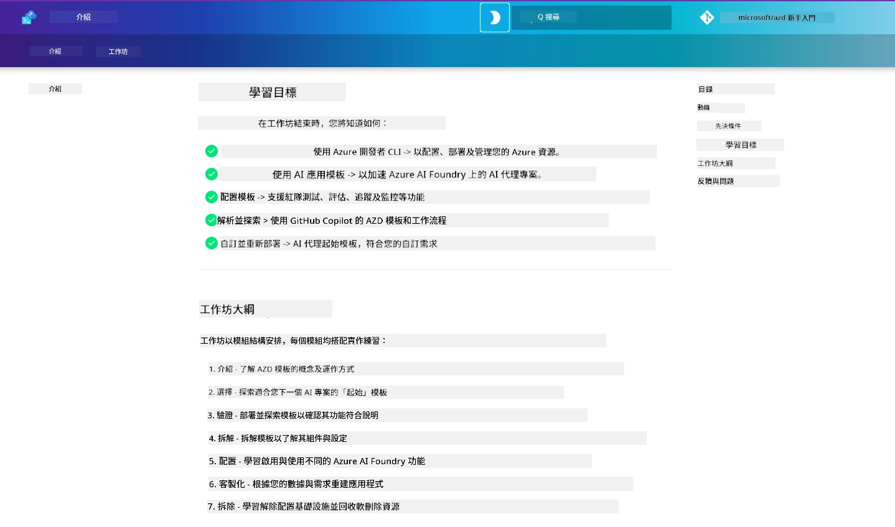

<div align="center">
  <div style="background: linear-gradient(135deg, #0078d4, #106ebe); border-radius: 10px; padding: 20px; margin: 20px 0; box-shadow: 0 4px 15px rgba(0, 120, 212, 0.3); border: 2px solid #005a9e;">
    <h2 style="color: white; margin: 0; font-size: 24px; text-shadow: 1px 1px 2px rgba(0,0,0,0.3);">
      🎯 AI 開發者的 AZD 工作坊
    </h2>
    <p style="color: white; margin: 10px 0 0 0; font-size: 16px; text-shadow: 1px 1px 2px rgba(0,0,0,0.3);">
      <strong>使用 Azure Developer CLI 建立 AI 應用的動手工作坊。</strong><br>
      完成 7 個模組，掌握 AZD 範本與 AI 部署工作流程。
    </p>
    <div style="margin-top: 15px;">
      <span style="background: rgba(255,255,255,0.2); padding: 5px 10px; border-radius: 15px; color: white; font-size: 14px;">
        📅 最後更新：2026 年 3 月
      </span>
    </div>
  </div>
</div>

# AI 開發者的 AZD 工作坊

歡迎參加聚焦於 AI 應用部署的 Azure Developer CLI (AZD) 動手工作坊。本工作坊透過三個步驟，幫助你實作理解 AZD 範本：

1. <strong>探索</strong> — 找出適合你的範本。
1. <strong>部署</strong> — 部署並驗證其運作
1. <strong>客製化</strong> — 修改並反覆調整，讓它成為你的專屬！

在此工作坊過程中，你亦會接觸核心開發工具與工作流程，協助你精簡端到端開發旅程。

<br/>

## 瀏覽器內建導覽

工作坊課程使用 Markdown 撰寫。你可以直接在 GitHub 中瀏覽，或按以下截圖所示啟動瀏覽器預覽。



使用此選項的方法是：將此儲存庫派生到你的個人帳號，並啟動 GitHub Codespaces。當 VS Code 終端機啟動後，輸入以下指令：

此瀏覽器預覽適用於 GitHub Codespaces、開發容器，或本機安裝 Python 和 MkDocs 的複本。

```bash title="" linenums="0"
mkdocs serve > /dev/null 2>&1 &
```

數秒後會顯示彈出對話框。選擇「Open in browser」選項，基於網頁的導覽將會在新瀏覽器標籤開啟。此預覽的優點包括：

1. <strong>內建搜尋</strong> — 快速找到關鍵字或課程。
1. <strong>複製圖示</strong> — 滑鼠懸停在程式碼區塊上即見此選項
1. <strong>主題切換</strong> — 深色與淺色主題自由切換
1. <strong>尋求協助</strong> — 點擊頁腳中的 Discord 圖示加入社群！

<br/>

## 工作坊概覽

**時長：** 3-4 小時  
**程度：** 初學者至中階  
**先備知識：** 熟悉 Azure、AI 概念、VS Code 及命令行工具。

這是一場動手實作的工作坊，透過練習學習。完成後，我們建議繼續研讀 AZD 初學者課程，要深入了解安全性和生產力等最佳實務。

| 時間| 模組  | 目標 |
|:---|:---|:---|
| 15 分鐘 | [簡介](docs/instructions/0-Introduction.md) | 開啟工作坊序幕，了解目標 |
| 30 分鐘 | [選擇 AI 範本](docs/instructions/1-Select-AI-Template.md) | 探索範本選項，挑選起點 | 
| 30 分鐘 | [驗證 AI 範本](docs/instructions/2-Validate-AI-Template.md) | 部署預設方案至 Azure |
| 30 分鐘 | [解構 AI 範本](docs/instructions/3-Deconstruct-AI-Template.md) | 探索結構和設定檔 |
| 30 分鐘 | [設定 AI 範本](docs/instructions/4-Configure-AI-Template.md) | 啟用並嘗試可用功能 |
| 30 分鐘 | [自訂 AI 範本](docs/instructions/5-Customize-AI-Template.md) | 根據需求調整範本 |
| 30 分鐘 | [拆除基礎架構](docs/instructions/6-Teardown-Infrastructure.md) | 清理並釋放資源 |
| 15 分鐘 | [總結與後續](docs/instructions/7-Wrap-up.md) | 學習資源及工作坊挑戰 |

<br/>

## 你將學會什麼

將 AZD 範本視為探索 Microsoft Foundry 上端到端開發各種能力與工具的學習沙盒。完成工作坊後，你將對這些工具和概念有直覺性的理解。

| 概念  | 目標 |
|:---|:---|
| **Azure Developer CLI** | 理解工具指令與工作流程|
| **AZD 範本**| 了解專案結構與設定 |
| **Azure AI Agent**| 部署 Microsoft Foundry 專案  |
| **Azure AI Search**| 啟用代理的情境工程 |
| <strong>觀測能力</strong>| 探索追蹤、監控與評估 |
| <strong>紅隊測試</strong>| 探索對抗測試與緩解方法 |

<br/>

## 工作坊架構

本工作坊引導你從範本探索，進入部署、解構及自訂，並以官方[Getting Started with AI Agents](https://github.com/Azure-Samples/get-started-with-ai-agents)入門範本為基礎。

### [模組 1：選擇 AI 範本](docs/instructions/1-Select-AI-Template.md) (30 分鐘)

- 什麼是 AI 範本？
- 我在哪尋找 AI 範本？
- 如何開始建構 AI 代理？
- <strong>實作</strong>：在 Codespaces 或開發容器快速啟動

### [模組 2：驗證 AI 範本](docs/instructions/2-Validate-AI-Template.md) (30 分鐘)

- AI 範本架構是什麼？
- AZD 開發工作流程如何？
- 如何協助 AZD 開發？
- <strong>實作</strong>：部署並驗證 AI 代理範本

### [模組 3：解構 AI 範本](docs/instructions/3-Deconstruct-AI-Template.md) (30 分鐘)

- 探索 `.azure/` 環境資料夾
- 探索 `infra/` 資源設定
- 探索 `azure.yaml` 中的 AZD 設定
- <strong>實作</strong>：修改環境變數並重新部署

### [模組 4：設定 AI 範本](docs/instructions/4-Configure-AI-Template.md) (30 分鐘)
- 探索：檢索增強生成
- 探索：代理評估與紅隊測試
- 探索：追蹤和監控
- <strong>實作</strong>：探索 AI 代理 + 觀測能力

### [模組 5：自訂 AI 範本](docs/instructions/5-Customize-AI-Template.md) (30 分鐘)
- 定義：帶有場景需求的產品需求文件 (PRD)
- 設定：AZD 的環境變數
- 實作：生命週期掛鉤以執行額外任務
- <strong>實作</strong>：為我的場景自訂範本

### [模組 6：拆除基礎架構](docs/instructions/6-Teardown-Infrastructure.md) (30 分鐘)
- 回顧：什麼是 AZD 範本？
- 回顧：為何使用 Azure Developer CLI？
- 下一步：嘗試不同範本！
- <strong>實作</strong>：解除資源佈建及清理

<br/>

## 工作坊挑戰

想挑戰更多自己嗎？以下是一些專案建議，或分享你的想法給我們！

| 專案 | 描述 |
|:---|:---|
|1. **解構複雜的 AI 範本** | 使用我們介紹的工作流程和工具，嘗試部署、驗證並自訂另一個 AI 解決方案範本。_你學到了什麼？_ |
|2. <strong>根據你的場景自訂</strong>  | 試著為不同場景撰寫產品需求文件（PRD）。然後在範本庫的代理模型中使用 GitHub Copilot，請它為你生成自訂工作流程。_你學到了什麼？如何改進這些建議？_ |
| | |

## 有回饋嗎？

1. 在此儲存庫中發問題單 — 標記 `Workshop` 以便識別。
1. 加入 Microsoft Foundry 的 Discord — 與同儕交流！

| | | 
|:---|:---|
| **📚 課程首頁**| [AZD 初學者](../README.md)|
| **📖 文件** | [開始使用 AI 範本](https://learn.microsoft.com/en-us/azure/ai-foundry/how-to/develop/ai-template-get-started)|
| **🛠️AI 範本** | [Microsoft Foundry 範本](https://ai.azure.com/templates) |
|**🚀 下一步** | [開始工作坊](#工作坊概覽) |
| | |

<br/>

---

**導覽：** [主課程](../README.md) | [簡介](docs/instructions/0-Introduction.md) | [模組 1：選擇範本](docs/instructions/1-Select-AI-Template.md)

**準備使用 AZD 開始建置 AI 應用嗎？**

[開始工作坊：簡介 →](docs/instructions/0-Introduction.md)

---

<!-- CO-OP TRANSLATOR DISCLAIMER START -->
**免責聲明**：  
本文件乃使用 AI 翻譯服務 [Co-op Translator](https://github.com/Azure/co-op-translator) 進行翻譯。雖然我們致力於準確性，但請注意，自動翻譯可能包含錯誤或不準確之處。原始文件之母語版本應視為權威來源。對於關鍵資訊，建議採用專業人工翻譯。我們不對因使用本翻譯而產生之任何誤解或誤釋負責。
<!-- CO-OP TRANSLATOR DISCLAIMER END -->