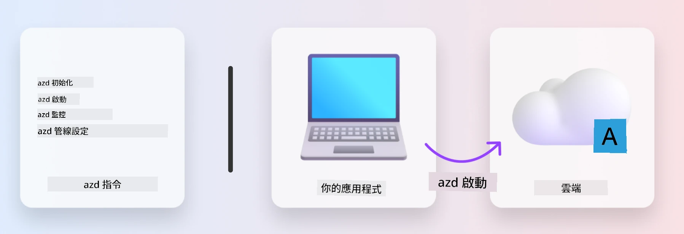
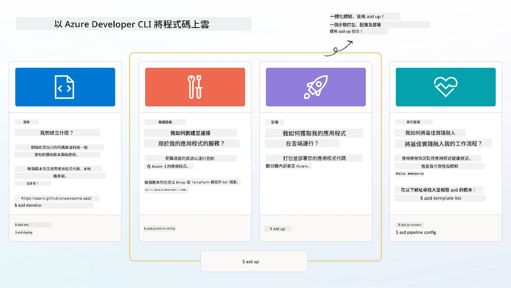

# 1. 選擇範本

!!! tip "在本模組結束時，您將能夠"

    - [ ] 描述什麼是 AZD 範本
    - [ ] 探索並使用適用於 AI 的 AZD 範本
    - [ ] 開始使用 AI Agents 範本
    - [ ] **Lab 1:** 使用 GitHub Codespaces 的 AZD 快速入門

---

## 1. 建造者類比

從頭開始建立現代化、可供企業使用的 AI 應用程式 _from scratch_ 可能令人生畏。這有點像自己一磚一瓦地蓋新房子。沒錯，這是可以做到的！但這不是達成期望結果的最有效方法！

相反地，我們通常會從現有的 _設計藍圖_ 開始，並與建築師合作以依個人需求進行客製化。這正是建構智慧化應用程式時應採取的方法。先找到符合您問題領域的良好設計架構，然後與解決方案架構師合作，為您的特定情境量身打造並開發解決方案。

但我們在哪裡可以找到這些設計藍圖？又如何找到願意教我們如何自行客製化並部署這些藍圖的架構師？在本工作坊中，我們透過介紹三項技術來回答這些問題：

1. [Azure Developer CLI](https://aka.ms/azd) - 一個開源工具，可加速開發者從本機開發（建置）到雲端部署（發佈）的流程。
1. [Microsoft Foundry Templates](https://ai.azure.com/templates) - 標準化的開源資源庫，內含範例程式碼、基礎設施與設定檔，用於部署 AI 解決方案架構。
1. [GitHub Copilot Agent Mode](https://code.visualstudio.com/docs/copilot/chat/chat-agent-mode) - 以 Azure 知識為基礎的程式編寫代理，能以自然語言引導我們在程式碼庫中導航並進行修改。

有了這些工具，我們現在可以 _發現_ 適合的範本、將其 _部署_ 以驗證可行性，並進行 _客製化_ 以符合我們的特定情境。讓我們深入了解這些工具如何運作。

---

## 2. Azure Developer CLI

The [Azure Developer CLI](https://learn.microsoft.com/en-us/azure/developer/azure-developer-cli/) (or `azd`) 是一個開源指令列工具，可透過一組對開發者友善的命令，在您的 IDE（開發）與 CI/CD（部屬）環境之間提供一致的體驗，從而加速您的程式碼到雲端旅程。

使用 `azd`，您的部署流程可以如此簡單：

- `azd init` - 從現有的 AZD 範本初始化一個新的 AI 專案。
- `azd up` - 佈建基礎設施並一步部署您的應用程式。
- `azd monitor` - 取得已部署應用程式的即時監控與診斷。
- `azd pipeline config` - 設定 CI/CD 管線以自動化部署到 Azure。

**🎯 | 練習**: <br/> 立即在您的 GitHub Codespaces 環境中探索 `azd` 指令列工具。先輸入以下指令看看該工具能做什麼：

```bash title="" linenums="0"
azd help
```



---

## 3. AZD 範本

為了讓 `azd` 能做到上述功能，它需要知道要佈建的基礎設施、要強制執行的設定，以及要部署的應用程式。這就是 [AZD templates](https://learn.microsoft.com/en-us/azure/developer/azure-developer-cli/azd-templates?tabs=csharp) 的用途。

AZD 範本是開源的資源庫，結合了範例程式碼與部署此解決方案架構所需的基礎設施與設定檔。透過採用 _基礎設施即程式碼_（Infrastructure-as-Code，IaC）的方法，範本資源定義與設定可以像應用程式原始碼一樣進行版本控制——為該專案的使用者建立可重複且一致的工作流程。

在為「您」的情境建立或重用 AZD 範本時，請考慮以下問題：

1. 你在建立什麼？ → 是否有範本包含該情境的起始程式碼？
1. 你的解決方案如何被架構？ → 是否有範本擁有所需的資源？
1. 你的解決方案如何部署？ → 想想 `azd deploy` 並搭配前/後處理掛鉤！
1. 你如何進一步優化？ → 想想內建的監控與自動化管線！

**🎯 | 練習**: <br/> 
造訪 [Awesome AZD](https://azure.github.io/awesome-azd/) 展示館並使用篩選器探索目前可用的 250+ 範本。看看是否能找到符合「您」情境需求的範本。



---

## 4. AI 應用程式範本

對於以 AI 為驅動的應用程式，Microsoft 提供以 **Microsoft Foundry** 與 **Foundry Agents** 為基礎的專用範本。這些範本能加速您建立具生產力且智慧化應用程式的過程。

### Microsoft Foundry 與 Foundry Agents 範本

在下方選擇一個範本進行部署。每個範本都可在 [Awesome AZD](https://azure.github.io/awesome-azd/) 找到，並可透過單一指令來初始化。

| Template | Description | Deploy Command |
|----------|-------------|----------------|
| **[AI 聊天（RAG）](https://azure.github.io/awesome-azd/?tags=ai&tags=rag)** | 使用 Microsoft Foundry 的檢索增強生成 (Retrieval Augmented Generation) 的聊天應用程式 | `azd init -t azure-samples/azure-search-openai-demo` |
| **[Foundry Agent 服務入門範本](https://azure.github.io/awesome-azd/?tags=ai&tags=agents)** | 使用 Foundry Agents 建立 AI 代理以自動執行任務 | `azd init -t azure-samples/foundry-agent-service-starter` |
| **[多代理協調](https://azure.github.io/awesome-azd/?tags=ai&tags=agents)** | 協調多個 Foundry Agents 以處理複雜工作流程 | `azd init -t azure-samples/multi-agent-orchestration` |
| **[AI 文件智能](https://azure.github.io/awesome-azd/?tags=ai&tags=document)** | 使用 Microsoft Foundry 模型擷取並分析文件 | `azd init -t azure-samples/ai-document-processing` |
| **[會話式 AI 機器人](https://azure.github.io/awesome-azd/?tags=ai&tags=bot)** | 建構與 Microsoft Foundry 整合的智慧聊天機器人 | `azd init -t azure-samples/ai-chat-protocol` |
| **[AI 影像生成](https://azure.github.io/awesome-azd/?tags=ai&tags=dalle)** | 透過 Microsoft Foundry 使用 DALL-E 生成影像 | `azd init -t azure-samples/ai-image-generation` |
| **[語意核心代理](https://azure.github.io/awesome-azd/?tags=ai&tags=semantic-kernel)** | 使用 Semantic Kernel 與 Foundry Agents 的 AI 代理 | `azd init -t azure-samples/semantic-kernel-agent` |
| **[AutoGen 多代理](https://azure.github.io/awesome-azd/?tags=ai&tags=autogen)** | 使用 AutoGen 架構的多代理系統 | `azd init -t azure-samples/autogen-multi-agent` |

### 快速入門

1. **瀏覽範本**：造訪 [https://azure.github.io/awesome-azd/](https://azure.github.io/awesome-azd/) 並以 `AI`、`Agents` 或 `Microsoft Foundry` 篩選
2. **選擇您的範本**：挑選符合您使用情境的範本
3. **初始化**：對所選範本執行 `azd init` 指令
4. **部署**：執行 `azd up` 以佈建並部署

**🎯 | 練習**: <br/>
根據您的情境從上方範本中選擇一個：

- **要建立聊天機器人嗎？** → 從 **AI 聊天（RAG）** 或 **會話式 AI 機器人** 開始
- **需要自主代理？** → 嘗試 **Foundry Agent 服務入門範本** 或 **多代理協調**
- **要處理文件？** → 使用 **AI 文件智能**
- **想要 AI 程式碼協助？** → 探索 **語意核心代理** 或 **AutoGen 多代理**

```bash title="Example: Deploy the AI Chat with RAG template" linenums="0"
azd init -t azure-samples/azure-search-openai-demo
azd up
```

!!! info "探索更多範本"
    The [Awesome AZD Gallery](https://azure.github.io/awesome-azd/) contains 250+ templates. Use the filters to find templates matching your specific requirements for language, framework, and Azure services.

---

<!-- CO-OP TRANSLATOR DISCLAIMER START -->
免責聲明：
本文件由 AI 翻譯服務 Co-op Translator（https://github.com/Azure/co-op-translator）進行翻譯。雖然我們力求準確，但請注意自動翻譯可能包含錯誤或不準確之處。原始文件之母語版本應被視為具權威性的來源。對於關鍵資訊，建議採用專業人工翻譯。我們對因使用此翻譯而導致的任何誤解或誤釋概不負責。
<!-- CO-OP TRANSLATOR DISCLAIMER END -->