# 2. 驗證範本

!!! tip "在本模組結束時，您將能夠"

    - [ ] 分析 AI 解決方案架構
    - [ ] 了解 AZD 部署工作流程
    - [ ] 使用 GitHub Copilot 取得 AZD 使用上的協助
    - [ ] **Lab 2:** 部署並驗證 AI Agents 範本

---


## 1. 介紹

The [Azure 開發人員 CLI](https://learn.microsoft.com/en-us/azure/developer/azure-developer-cli/) or `azd` 是一個開源命令列工具，能在建置與部署應用程式到 Azure 時簡化開發流程。 

[AZD 範本](https://learn.microsoft.com/azure/developer/azure-developer-cli/azd-templates) 是標準化的程式庫，包含範例應用程式程式碼、_基礎設施即程式碼_ 資產，以及 `azd` 設定檔，以形成一致的解決方案架構。實作基礎設施只需一個 `azd provision` 命令 — 使用 `azd up` 則可以一次同時實作基礎設施 <strong>並</strong> 部署您的應用程式！

因此，啟動您的應用程式開發流程可以很簡單：找出最接近您應用程式與基礎設施需求的 _AZD Starter 範本_，然後自訂該程式庫以符合您的情境需求。

在開始之前，讓我們先確定您已安裝 Azure Developer CLI。

1. Open a VS Code terminal and type this command:

      ```bash title="" linenums="0"
      azd version
      ```

1. You should see something like this!

      ```bash title="" linenums="0"
      azd version 1.19.0 (commit b3d68cea969b2bfbaa7b7fa289424428edb93e97)
      ```

**您現在已準備好使用 azd 選擇並部署範本**

---

## 2. 範本選擇

Microsoft Foundry 平台附帶 [一組建議的 AZD 範本](https://learn.microsoft.com/en-us/azure/ai-foundry/how-to/develop/ai-template-get-started)，涵蓋熱門的解決方案情境，例如 _多代理工作流程自動化_ 與 _多模態內容處理_。您也可以透過 Microsoft Foundry 入口網站探索這些範本。

1. Visit [https://ai.azure.com/templates](https://ai.azure.com/templates)
1. Log into the Microsoft Foundry portal when prompted - you will see something like this.

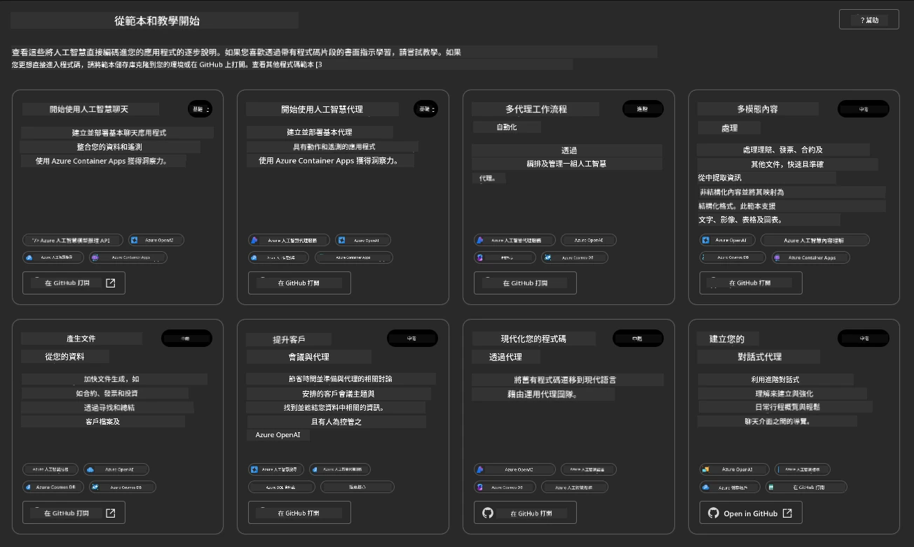


The **Basic** options are your starter templates:

1. [ ] [開始使用 AI 聊天](https://github.com/Azure-Samples/get-started-with-ai-chat) 會部署一個基礎的聊天應用程式 _搭配您的資料_ 到 Azure Container Apps。使用此範本來探索基本的 AI 聊天機器人情境。
1. [X] [開始使用 AI Agents](https://github.com/Azure-Samples/get-started-with-ai-agents) 也會部署一個標準的 AI Agent（使用 Foundry Agents）。使用此範本來熟悉包含工具與模型的 agentic AI 解決方案。

Visit the second link in a new browser tab (or click `Open in GitHub` for the related card). You should see the repository for this AZD Template. Take a minute to explore the README. The application architecture looks like this:

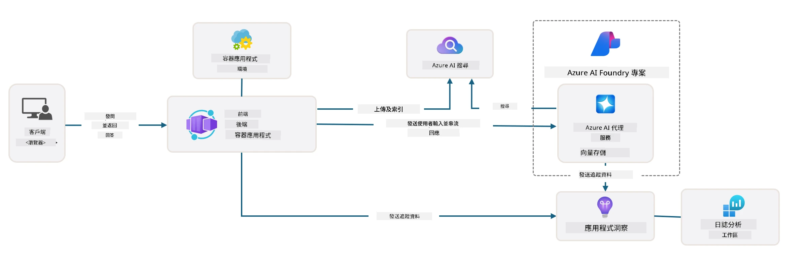

---

## 3. Template Activation

Let's try to deploy this template and make sure it is valid. We'll follow the guidelines in the [開始使用](https://github.com/Azure-Samples/get-started-with-ai-agents?tab=readme-ov-file#getting-started) section.

1. Click [this link](https://github.com/codespaces/new/Azure-Samples/get-started-with-ai-agents) - confirm the default action to `Create codespace`
1. This opens a new browser tab - wait for the GitHub Codespaces session to complete loading
1. Open the VS Code terminal in Codespaces - type the following command:

   ```bash title="" linenums="0"
   azd up
   ```

Complete the workflow steps that this will trigger:

1. You will be prompted to log into Azure - follow instructions to authenticate
1. Enter a unique environment name for you - e.g., I used `nitya-mshack-azd`
1. This  will create a `.azure/` folder - you will see a subfolder with the env name
1. You will be prompted to select a subscription name - select the default
1. You will be prompted for a location - use `East US 2`

Now, you wait for the provisioning to complete. **This takes 10-15 minutes**

1. When done, your console will show a SUCCESS message like this:
      ```bash title="" linenums="0"
      SUCCESS: Your up workflow to provision and deploy to Azure completed in 10 minutes 17 seconds.
      ```
1. Your Azure Portal will now have a provisioned resource group with that env name:

      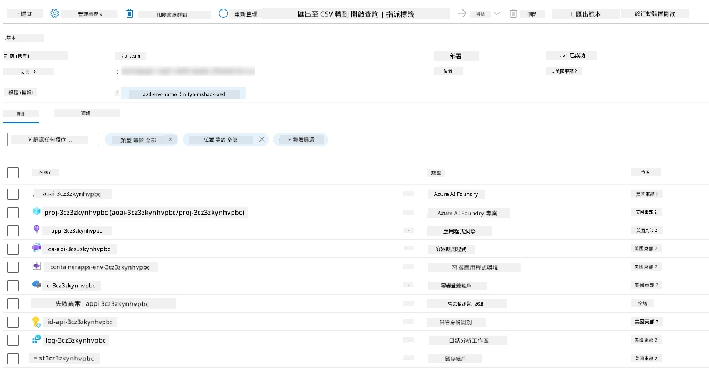

1. <strong>您現在已準備好驗證已部署的基礎設施與應用程式</strong>。

---

## 4. Template Validation

1. Visit Azure Portal [資源群組](https://portal.azure.com/#browse/resourcegroups) page - log in when prompted
1. Click on RG for your environment name - you see the page above

      - 點選 Azure Container Apps 資源
      - 在 _Essentials_ 區段（右上）點選 Application Url

1. You should see a hosted application front-end UI like this:

   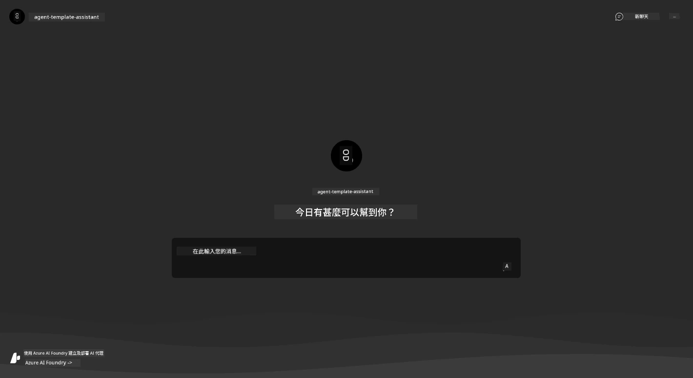

1. Try asking a couple of [範例問題](https://github.com/Azure-Samples/get-started-with-ai-agents/blob/main/docs/sample_questions.md)

      1. Ask: ```法國的首都是哪裡？``` 
      1. Ask: ```什麼是兩人使用、價格在 $200 以下的最佳帳篷，且它包含哪些功能？```

1. You should get answers similar to what is shown below. _But how does this work?_ 

      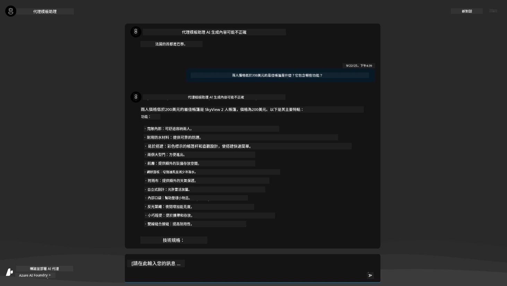

---

## 5.  Agent Validation

The Azure Container App deploys an endpoint that connects to the AI Agent provisioned in the Microsoft Foundry project for this template. Let's take a look at what that means.

1. Return to the Azure Portal _Overview_ page for your resource group

1. Click on the `Microsoft Foundry` resource in that list

1. You should see this. Click the `Go to Microsoft Foundry Portal` button. 
   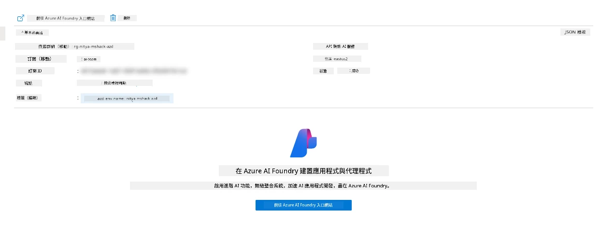

1. You should see the Foundry Project page for your AI application
   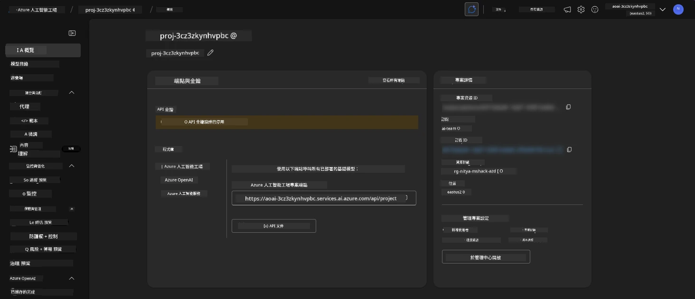

1. Click on `Agents` - you see the default Agent provisioned in your project
   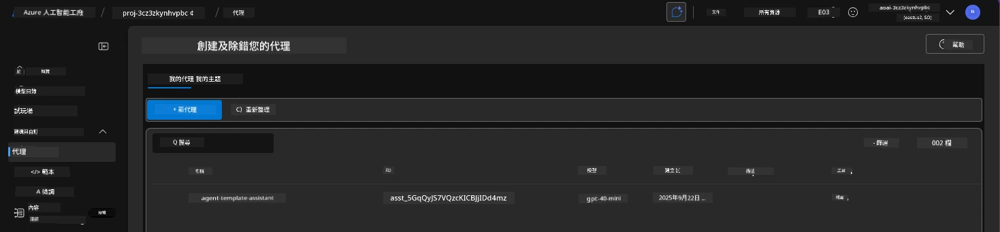

1. Select it - and you see the Agent details. Note the following:

      - 該 agent 預設（永遠）使用 File Search
      - Agent 的 `Knowledge` 顯示已上傳 32 個檔案（供檔案搜尋使用）
      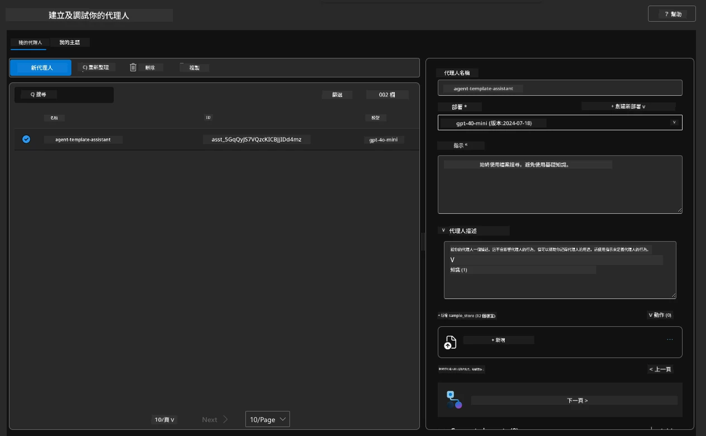

1. Look for the `Data+indexes` option in the left menu and click for details. 

      - 您應該會看到已為知識上傳的 32 個資料檔案。
      - 這些會對應到 `src/files` 下的 12 個客戶檔案與 20 個產品檔案
      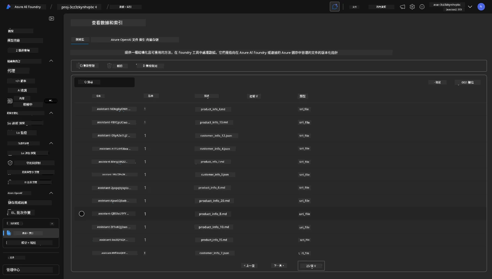

**您已驗證 Agent 的運作！** 

1. Agent 的回應是依據那些檔案中的知識為基礎。
1. 您現在可以提出與該資料相關的問題，並取得有依據的回應。
1. 範例：`customer_info_10.json` 描述了 Amanda Perez 所做的 3 次購買

Revisit the browser tab with the Container App endpoint and ask: `Amanda Perez 擁有哪些產品？`. You should see something like this:

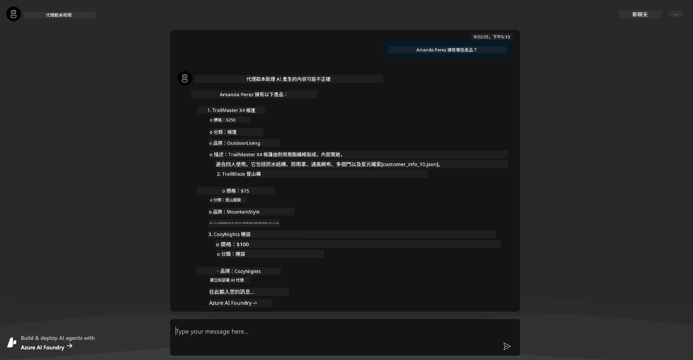

---

## 6. Agent Playground

Let's build a bit more intuition for the capabilities of Microsoft Foundry, by taking the Agent for a spin in the Agents Playground. 

1. Return to the `Agents` page in Microsoft Foundry - select the default agent
1. Click the `Try in Playground` option - you should get a Playground UI like this
1. Ask the same question: `Amanda Perez 擁有哪些產品？`

    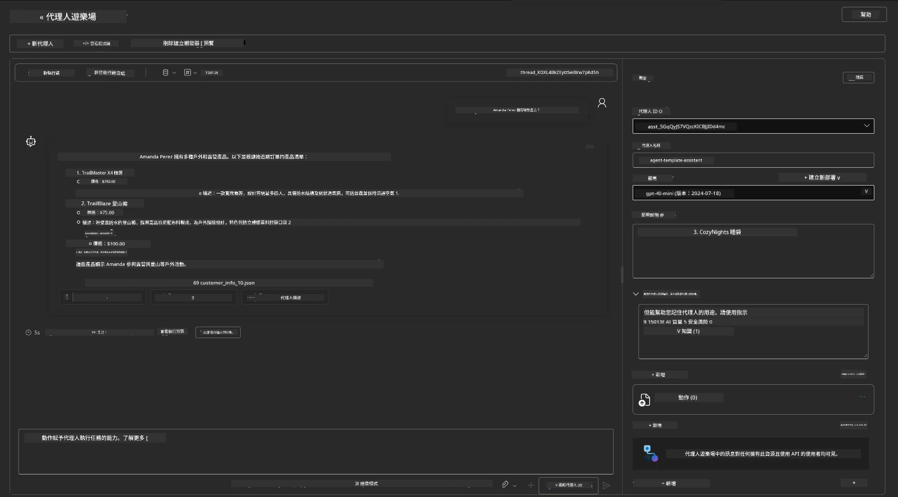

You get the same (or similar) response - but you also get additional information that you can use to understand the quality, cost, and performance of your agentic app. For example:

1. 注意回應會引用用來作為回應依據的資料檔案
1. 將滑鼠移到任一檔案標籤上方 - 該資料是否與您的查詢和顯示的回應相符？

You also see a _stats_ row below the response. 

1. Hover over any metric - e.g., Safety. You see something like this
1. Does the assessed rating match your intuition for the response safety level?

      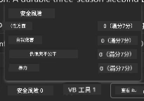

---

## 7. Built-in Observability

Observability is about instrumenting your application to generate data that can be used to understand, debug, and optimize, its operations. To get a sense for this:

1. Click the `View Run Info` button - you should see this view. This is an example of [Agent tracing](https://learn.microsoft.com/en-us/azure/ai-foundry/how-to/develop/trace-agents-sdk#view-trace-results-in-the-azure-ai-foundry-agents-playground) in action. _You can also get this view by clicking Thread Logs in the top-level menu_.

   - 了解執行步驟和 Agent 使用的工具
   - 瞭解回應所使用的總 Token 數（相較於輸出 token 的使用）
   - 瞭解延遲以及執行中時間花費的位置

      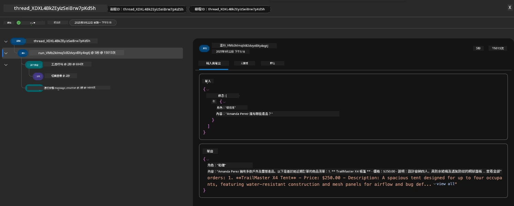

1. Click the `Metadata` tab to see additional attributes for the run, that may provide useful context for debugging issues later.   

      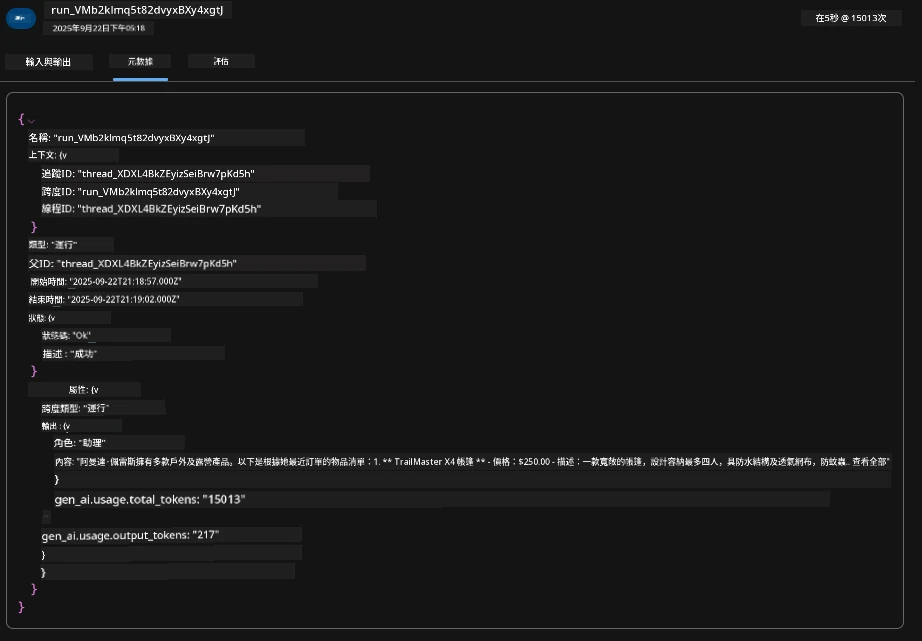


1. Click the `Evaluations` tab to see auto-assessments made on the agent response. These include safety evaluations (e.g., Self-harm) and agent-specifc evaluations (e.g., Intent resolution, Task adherence).

      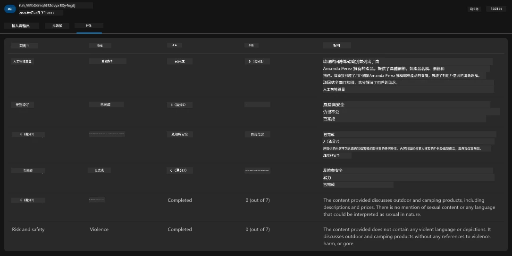

1. Last but not least, click the `Monitoring` tab in the sidebar menu.

      - Select `Resource usage` tab in the displayed page - and view the metrics.
      - Track application usage in terms of costs (tokens) and load (requests).
      - Track applicaton latency to first byte (input processing) and last byte (output).

      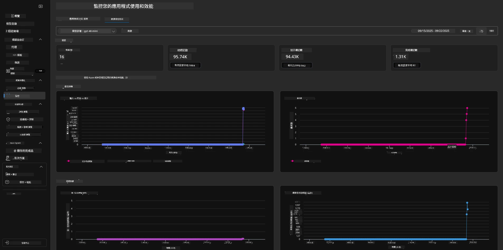

---

## 8. 環境變數

So far, we've walked through the deployment in the browser - and validated that our infrastructure is provisioned and the application is operational. But to work with the application _code-first_, we need to configure our local development environment with the relevant variables required to work with these resources. Using `azd` makes it easy.

1. The Azure Developer CLI [使用環境變數](https://learn.microsoft.com/en-us/azure/developer/azure-developer-cli/manage-environment-variables?tabs=bash) to store and manage configuration settings for  the application deployments.

1. Environment variables are stored in `.azure/<env-name>/.env` - this scopes them to the `env-name` environment used during deployment and helps you isolate environments between different deployment targets in the same repo.

1. Environment variables are automatically loaded by the `azd` command whenever it executes a specific command (e.g., `azd up`). Note that `azd` does not automatically read _OS-level_ environment variables (e.g., set in the shell) - instead use `azd set env` and `azd get env` to transfer information within scripts.


Let's try out a few commands:

1. Get all the environment variables set for `azd` in this environment:

      ```bash title="" linenums="0"
      azd env get-values
      ```
      
      You see something like:

      ```bash title="" linenums="0"
      AZURE_AI_AGENT_DEPLOYMENT_NAME="gpt-4.1-mini"
      AZURE_AI_AGENT_NAME="agent-template-assistant"
      AZURE_AI_EMBED_DEPLOYMENT_NAME="text-embedding-3-small"
      AZURE_AI_EMBED_DIMENSIONS=100
      ...
      ```

1. Get a specific value - e.g., I want to know if we set the `AZURE_AI_AGENT_MODEL_NAME` value

      ```bash title="" linenums="0"
      azd env get-value AZURE_AI_AGENT_MODEL_NAME 
      ```
      
      You see something like this - it was not set by default!

      ```bash title="" linenums="0"
      ERROR: key 'AZURE_AI_AGENT_MODEL_NAME' not found in the environment values
      ```

1. Set a new environment variable for `azd`. Here, we update the agent model name. _Note: any changes made will be immediately reflected in the `.azure/<env-name>/.env` file.

      ```bash title="" linenums="0"
      azd env set AZURE_AI_AGENT_MODEL_NAME gpt-4.1
      azd env set AZURE_AI_AGENT_MODEL_VERSION 2025-04-14
      azd env set AZURE_AI_AGENT_DEPLOYMENT_CAPACITY 150
      ```

      Now, we should find the value is set:

      ```bash title="" linenums="0"
      azd env get-value AZURE_AI_AGENT_MODEL_NAME 
      ```

1. Note that some resources are persistent (e.g., model deployments) and will require more than just an `azd up` to force the redeployment. Let's try tearing down the original deployment and redeploying with changed env vars.

1. **Refresh** If you had previously deployed infrastructure using an azd template - you can _refresh_ the state of your local environment variables based on the current state of your Azure deployment using this command:

      ```bash title="" linenums="0"
      azd env refresh
      ```

      這是一個強大的方式，可以在兩個或以上的本地開發環境之間 _同步_ 環境變數（例如，多位開發人員的團隊） - 讓已部署的基礎設施成為環境變數狀態的真實依據。團隊成員只要 _重新整理_ 變數即可回復同步。

---

## 9. 恭喜 🏆

你剛剛完成了一個端到端的工作流程，內容包括：

- [X] 選擇你想使用的 AZD 範本
- [X] 使用 GitHub Codespaces 啟動該範本 
- [X] 部署該範本並驗證其可正常運作

---

<!-- CO-OP TRANSLATOR DISCLAIMER START -->
**免責聲明**:
本文件已使用 AI 翻譯服務 [Co-op Translator](https://github.com/Azure/co-op-translator) 進行翻譯。儘管我們致力於準確性，請注意自動翻譯可能包含錯誤或不準確之處。原始語言版本的文件應被視為具權威性的來源。若屬關鍵資訊，建議採用專業人工翻譯。我們不對因使用本翻譯而引致的任何誤解或誤釋承擔任何責任。
<!-- CO-OP TRANSLATOR DISCLAIMER END -->