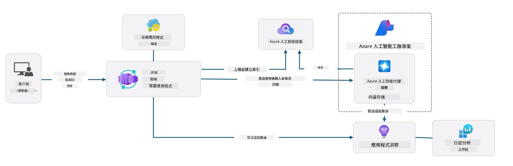

# 3. 分解模板

!!! tip "完成本模組後，您將能夠"

    - [ ] 項目
    - [ ] 項目
    - [ ] 項目
    - [ ] **實驗 3：**

---

使用 AZD 模板和 Azure Developer CLI (`azd`)，我們可以快速啟動 AI 開發旅程，透過標準化的儲存庫提供範例程式碼、基礎架構和配置檔案——以一個可立即部署的 _入門_ 專案形式呈現。

**但現在，我們需要了解專案結構和程式碼庫，並能夠在沒有任何 AZD 相關經驗或理解的情況下自訂 AZD 模板！**

---

## 1. 啟用 GitHub Copilot

### 1.1 安裝 GitHub Copilot Chat

是時候探索 [GitHub Copilot 的代理模式](https://code.visualstudio.com/docs/copilot/chat/chat-agent-mode)了。現在，我們可以使用自然語言來高層次描述任務，並獲得執行上的協助。在本實驗中，我們將使用 [Copilot 免費方案](https://github.com/github-copilot/signup)，該方案每月有完成和聊天互動的限制。

該擴展可以從市場安裝，但應該已在您的 Codespaces 環境中可用。_從 Copilot 圖標下拉選單中點擊 `Open Chat`，並輸入提示，例如 `What can you do?`_——您可能需要登錄。**GitHub Copilot Chat 已準備就緒**。

### 1.2 安裝 MCP 伺服器

為了使代理模式有效，它需要訪問正確的工具來幫助檢索知識或執行操作。這就是 MCP 伺服器的作用。我們將配置以下伺服器：

1. [Azure MCP Server](../../../../../workshop/docs/instructions)
1. [Microsoft Docs MCP Server](../../../../../workshop/docs/instructions)

啟用這些伺服器：

1. 如果尚未存在，請建立一個名為 `.vscode/mcp.json` 的檔案
1. 將以下內容複製到該檔案中，並啟動伺服器！
   ```json title=".vscode/mcp.json"
   {
      "servers": {
         "Azure MCP Server": {
            "command": "npx",
            "args": [
            "-y",
            "@azure/mcp@latest",
            "server",
            "start"
            ]
         },
         "microsoft.docs.mcp": {
            "type": "http",
            "url": "https://learn.microsoft.com/api/mcp"
         }
      }
   }
   ```

??? warning "您可能會收到 `npx` 未安裝的錯誤（點擊展開以修復）"

      要修復此問題，打開 `.devcontainer/devcontainer.json` 檔案，並在 features 部分添加以下行。然後重建容器。現在應該已安裝 `npx`。

      ```title="" linenums="0"
         "features": {
            "ghcr.io/devcontainers/features/node:1": {},
            ...
         },
      ```

---

### 1.3 測試 GitHub Copilot Chat

**首先使用 `az login` 從 VS Code 命令行進行 Azure 身份驗證。**

現在，您應該能夠查詢您的 Azure 訂閱狀態，並詢問有關已部署資源或配置的問題。嘗試以下提示：

1. `List my Azure resource groups`
1. `#foundry list my current deployments`

您還可以詢問有關 Azure 文件的問題，並從 Microsoft Docs MCP 伺服器獲得基於文件的回應。嘗試以下提示：

1. `#microsoft_docs_search What is Azure Developer CLI?`
1. `#microsoft_docs_search Show me a Python tutorial to chat with deployed model`

或者，您可以要求完成任務的程式碼片段。嘗試以下提示：

1. `Give me a Python code example that uses AAD for an interactive chat client`

在 `Ask` 模式下，這將提供您可以複製粘貼並嘗試的程式碼。在 `Agent` 模式下，這可能會更進一步，為您創建相關資源——包括設置腳本和文件——以幫助您執行該任務。

**您現在已準備好開始探索模板儲存庫**

---

## 2. 分解架構

??? prompt "ASK: 用一段話解釋 docs/images/architecture.png 中的應用架構"

      此應用是一個基於 Azure 的 AI 驅動聊天應用，展示了現代代理架構。解決方案的核心是一個 Azure Container App，該應用承載主要應用程式碼，負責處理使用者輸入並透過 AI 代理生成智能回應。

      架構以 Azure AI Foundry Project 為基礎，連接到提供底層語言模型（如 GPT-4o-mini）和代理功能的 Azure AI Services。使用者互動透過基於 React 的前端流向 FastAPI 後端，後端與 AI 代理服務通信以生成上下文回應。

      系統透過檔案搜索或 Azure AI Search 服務整合知識檢索功能，使代理能夠訪問並引用上傳的文件中的信息。為了實現卓越運營，架構包括透過 Application Insights 和 Log Analytics Workspace 進行的全面監控，用於追蹤、記錄和性能優化。

      Azure Storage 提供應用數據和文件上傳的 Blob 存儲，而 Managed Identity 確保 Azure 資源之間的安全訪問，無需存儲憑據。整個解決方案設計為可擴展且易於維護，容器化應用根據需求自動擴展，同時透過 Azure 的托管服務生態系統提供內建的安全性、監控和 CI/CD 功能。



---

## 3. 儲存庫結構

!!! prompt "ASK: 解釋模板文件夾結構。從視覺層次圖開始。"

??? info "ANSWER: 視覺層次圖"

      ```bash title="" 
      get-started-with-ai-agents/
      ├── 📋 配置與設置
      │   ├── azure.yaml                    # Azure Developer CLI 配置
      │   ├── docker-compose.yaml           # 本地開發容器
      │   ├── pyproject.toml                # Python 專案配置
      │   ├── requirements-dev.txt          # 開發依賴項
      │   └── .devcontainer/                # VS Code 開發容器設置
      │
      ├── 🏗️ 基礎架構 (infra/)
      │   ├── main.bicep                    # 主基礎架構模板
      │   ├── api.bicep                     # API 特定資源
      │   ├── main.parameters.json          # 基礎架構參數
      │   └── core/                         # 模組化基礎架構組件
      │       ├── ai/                       # AI 服務配置
      │       ├── host/                     # 託管基礎架構
      │       ├── monitor/                  # 監控與記錄
      │       ├── search/                   # Azure AI Search 設置
      │       ├── security/                 # 安全性與身份
      │       └── storage/                  # 存儲帳戶配置
      │
      ├── 💻 應用程式源碼 (src/)
      │   ├── api/                          # 後端 API
      │   │   ├── main.py                   # FastAPI 應用入口
      │   │   ├── routes.py                 # API 路由定義
      │   │   ├── search_index_manager.py   # 搜索功能
      │   │   ├── data/                     # API 數據處理
      │   │   ├── static/                   # 靜態網頁資產
      │   │   └── templates/                # HTML 模板
      │   ├── frontend/                     # React/TypeScript 前端
      │   │   ├── package.json              # Node.js 依賴項
      │   │   ├── vite.config.ts            # Vite 構建配置
      │   │   └── src/                      # 前端源碼
      │   ├── data/                         # 範例數據文件
      │   │   └── embeddings.csv            # 預計算嵌入
      │   ├── files/                        # 知識庫文件
      │   │   ├── customer_info_*.json      # 客戶數據範例
      │   │   └── product_info_*.md         # 產品文檔
      │   ├── Dockerfile                    # 容器配置
      │   └── requirements.txt              # Python 依賴項
      │
      ├── 🔧 自動化與腳本 (scripts/)
      │   ├── postdeploy.sh/.ps1           # 部署後設置
      │   ├── setup_credential.sh/.ps1     # 憑據配置
      │   ├── validate_env_vars.sh/.ps1    # 環境驗證
      │   └── resolve_model_quota.sh/.ps1  # 模型配額管理
      │
      ├── 🧪 測試與評估
      │   ├── tests/                        # 單元與整合測試
      │   │   └── test_search_index_manager.py
      │   ├── evals/                        # 代理評估框架
      │   │   ├── evaluate.py               # 評估執行器
      │   │   ├── eval-queries.json         # 測試查詢
      │   │   └── eval-action-data-path.json
      │   ├── sandbox/                      # 開發沙盒
      │   │   ├── 1-quickstart.py           # 快速入門範例
      │   │   └── aad-interactive-chat.py   # 身份驗證範例
      │   └── airedteaming/                 # AI 安全性評估
      │       └── ai_redteaming.py          # 紅隊測試
      │
      ├── 📚 文件 (docs/)
      │   ├── deployment.md                 # 部署指南
      │   ├── local_development.md          # 本地設置說明
      │   ├── troubleshooting.md            # 常見問題與修復
      │   ├── azure_account_setup.md        # Azure 先決條件
      │   └── images/                       # 文件資產
      │
      └── 📄 專案元數據
         ├── README.md                     # 專案概述
         ├── CODE_OF_CONDUCT.md           # 社群指南
         ├── CONTRIBUTING.md              # 貢獻指南
         ├── LICENSE                      # 授權條款
         └── next-steps.md                # 部署後指導
      ```

### 3.1 核心應用架構

此模板遵循 **全端網頁應用** 模式，包含：

- **後端**：Python FastAPI 與 Azure AI 整合
- **前端**：TypeScript/React 與 Vite 構建系統
- **基礎架構**：Azure Bicep 模板用於雲端資源
- **容器化**：使用 Docker 確保一致性部署

### 3.2 基礎架構即程式碼 (bicep)

基礎架構層使用 **Azure Bicep** 模板，模組化組織：

   - **`main.bicep`**：協調所有 Azure 資源
   - **`core/` 模組**：不同服務的可重用組件
      - AI 服務（Azure OpenAI、AI Search）
      - 容器託管（Azure Container Apps）
      - 監控（Application Insights、Log Analytics）
      - 安全性（Key Vault、Managed Identity）

### 3.3 應用程式源碼 (`src/`)

**後端 API (`src/api/`)**：

- 基於 FastAPI 的 REST API
- Azure AI 代理服務整合
- 知識檢索的搜索索引管理
- 文件上傳與處理功能

**前端 (`src/frontend/`)**：

- 現代化 React/TypeScript SPA
- Vite 用於快速開發與優化構建
- 聊天界面與代理互動

**知識庫 (`src/files/`)**：

- 客戶與產品數據範例
- 展示基於文件的知識檢索
- JSON 與 Markdown 格式範例

### 3.4 DevOps 與自動化

**腳本 (`scripts/`)**：

- 跨平台 PowerShell 與 Bash 腳本
- 環境驗證與設置
- 部署後配置
- 模型配額管理

**Azure Developer CLI 整合**：

- `azure.yaml` 配置用於 `azd` 工作流程
- 自動化配置與部署
- 環境變數管理

### 3.5 測試與品質保證

**評估框架 (`evals/`)**：

- 代理性能評估
- 查詢回應品質測試
- 自動化評估管道

**AI 安全性 (`airedteaming/`)**：

- AI 安全性紅隊測試
- 安全漏洞掃描
- 負責任的 AI 實踐

---

## 4. 恭喜 🏆

您已成功使用 GitHub Copilot Chat 與 MCP 伺服器，探索儲存庫。

- [X] 啟用了 GitHub Copilot for Azure
- [X] 理解了應用架構
- [X] 探索了 AZD 模板結構

這讓您對此模板的 _基礎架構即程式碼_ 資產有了初步了解。接下來，我們將查看 AZD 的配置檔案。

---

