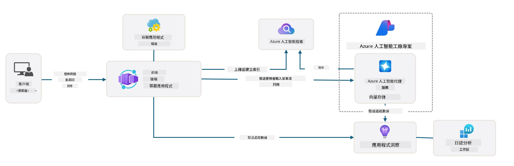

# 3. 拆解範本

!!! tip "在本模組結束時，你將能夠"

    - [ ] 啟用結合 MCP 伺服器的 GitHub Copilot 以協助 Azure
    - [ ] 了解 AZD 範本資料夾結構與元件
    - [ ] 探索基礎建設即程式碼 (Bicep) 的組織模式
    - [ ] **實驗 3:** 使用 GitHub Copilot 探索並了解儲存庫架構

---

使用 AZD 範本與 Azure 開發者 CLI (`azd`)，我們可以快速啟動 AI 開發之旅，透過標準化儲存庫提供的範例程式碼、基礎設施及設定檔 —— 以完整可部署的 _starter_ 專案形式呈現。

**但現在，我們需要理解專案結構和程式碼庫，並能自訂 AZD 範本 —— 即使沒有任何先前 AZD 經驗或了解！**

---

## 1. 啟用 GitHub Copilot

### 1.1 安裝 GitHub Copilot 聊天

是時候探索 [GitHub Copilot 代理模式](https://code.visualstudio.com/docs/copilot/chat/chat-agent-mode) 了。現在，我們可以用自然語言描述任務的高階目標，並得到執行協助。在此實驗中，我們將使用 [Copilot 免費方案](https://github.com/github-copilot/signup)，該方案對完成度和聊天互動有月度限制。

可從市場擴充功能安裝，且通常在 Codespaces 或開發容器環境中已預安裝。 _點擊從 Copilot 圖示下拉選單的「Open Chat」——輸入提示如「What can you do?」_ —— 可能會提示你登入。**GitHub Copilot 聊天功能已就緒**。

### 1.2. 安裝 MCP 伺服器

為讓代理模式有效，需有權限使用合適的工具以協助擷取知識或執行操作。這正是 MCP 伺服器的作用。我們將設定以下伺服器：

1. [Azure MCP 伺服器](../../../../../workshop/docs/instructions)
1. [Microsoft Docs MCP 伺服器](../../../../../workshop/docs/instructions)

啟用步驟：

1. 建立檔案 `.vscode/mcp.json`（若不存在）
1. 將以下內容複製到該檔案中 —— 並啟動伺服器！
   ```json title=".vscode/mcp.json"
   {
      "servers": {
         "Azure MCP Server": {
            "command": "npx",
            "args": [
            "-y",
            "@azure/mcp@latest",
            "server",
            "start"
            ]
         },
         "microsoft.docs.mcp": {
            "type": "http",
            "url": "https://learn.microsoft.com/api/mcp"
         }
      }
   }
   ```

??? warning "你可能會遇到 `npx` 尚未安裝的錯誤（點擊展開修復方法）"

      修復方法是開啟 `.devcontainer/devcontainer.json` 檔案，並在 features 區段加入此行。接著重建容器。你就會有 `npx` 安裝完成。

      ```title="" linenums="0"
         "features": {
            "ghcr.io/devcontainers/features/node:1": {},
            ...
         },
      ```

---

### 1.3. 測試 GitHub Copilot 聊天

**先使用 `azd auth login` 透過 VS Code 命令列認證 Azure；若要直接執行 Azure CLI 指令，也請使用 `az login` 認證。**

現在你應該可以查詢 Azure 訂閱狀態，並詢問已部署的資源或設定相關問題。試試這些提示：

1. `List my Azure resource groups`
1. `#foundry list my current deployments`

你也可以針對 Azure 文件提問，並由 Microsoft Docs MCP 伺服器提供回覆。試試這些提示：

1. `#microsoft_docs_search What is Azure Developer CLI?`
1. `#microsoft_docs_search Show me a Python tutorial to chat with deployed model`

或者要求程式碼片段來完成任務。試試這個：

1. `Give me a Python code example that uses AAD for an interactive chat client`

在「詢問」模式中，這會提供可複製貼上的程式碼讓你試用。在「代理」模式中，可能會更進一步自動建立相關資源 —— 包含設定腳本和文件 —— 協助你執行該任務。

<strong>你現在已具備能力開始探索範本儲存庫</strong>

---

## 2. 拆解架構

??? prompt "提問：用一段文字解釋 docs/images/architecture.png 中的應用程式架構"

      該應用程式是基於 Azure 的 AI 聊天應用，展示了現代代理架構。此方案以托管主應用程式程式碼的 Azure Container App 為核心，該程式碼處理使用者輸入，並藉由 AI 代理產生智慧回應。

      架構利用 Microsoft Foundry 專案作為 AI 能力基礎，連結至提供語言模型（如 gpt-4.1-mini）及代理功能的 Azure AI 服務。使用者互動透過 React 前端送往 FastAPI 後端，與 AI 代理服務溝通以生成上下文回應。

      系統具備透過檔案搜尋或 Azure AI 搜尋服務的知識擷取能力，使代理可存取並引用上傳文件中的資訊。為營運卓越，該架構包含 Application Insights 與 Log Analytics 工作區做全面監控、日誌與效能優化。

      Azure Storage 提供應用資料及檔案上傳的 Blob 儲存，而 Managed Identity 確保 Azure 資源間安全存取，無須儲存憑證。整個方案設計具備可擴展性與維護性，容器化應用會隨需求自動擴展，並透過 Azure 托管服務生態支援內建安全性、監控及 CI/CD 功能。



---

## 3. 儲存庫結構

!!! prompt "提問：說明範本資料夾結構。先呈現視覺化階層圖。"

??? info "回答：視覺化階層圖"

      ```bash title="" 
      get-started-with-ai-agents/
      ├── 📋 Configuration & Setup
      │   ├── azure.yaml                    # Azure Developer CLI 配置
      │   ├── docker-compose.yaml           # 本地開發容器設定
      │   ├── pyproject.toml                # Python 專案配置
      │   ├── requirements-dev.txt          # 開發依賴套件
      │   └── .devcontainer/                # VS Code 開發容器設定
      │
      ├── 🏗️ Infrastructure (infra/)
      │   ├── main.bicep                    # 主要基礎設施範本
      │   ├── api.bicep                     # API 相關資源
      │   ├── main.parameters.json          # 基礎設施參數
      │   └── core/                         # 模組化基礎設施元件
      │       ├── ai/                       # AI 服務設定
      │       ├── host/                     # 主機基礎設施
      │       ├── monitor/                  # 監控與記錄
      │       ├── search/                   # Azure AI 搜尋設定
      │       ├── security/                 # 安全及身份管理
      │       └── storage/                  # 儲存帳戶配置
      │
      ├── 💻 Application Source (src/)
      │   ├── api/                          # 後端 API
      │   │   ├── main.py                   # FastAPI 應用入口
      │   │   ├── routes.py                 # API 路由定義
      │   │   ├── search_index_manager.py   # 搜尋功能管理
      │   │   ├── data/                     # API 資料處理
      │   │   ├── static/                   # 靜態網頁資源
      │   │   └── templates/                # HTML 範本
      │   ├── frontend/                     # React/TypeScript 前端
      │   │   ├── package.json              # Node.js 依賴檔
      │   │   ├── vite.config.ts            # Vite 建置設定
      │   │   └── src/                      # 前端原始碼
      │   ├── data/                         # 範例資料檔案
      │   │   └── embeddings.csv            # 預先計算的嵌入向量
      │   ├── files/                        # 知識庫檔案
      │   │   ├── customer_info_*.json      # 客戶資料範例
      │   │   └── product_info_*.md         # 產品文件
      │   ├── Dockerfile                    # 容器設定檔
      │   └── requirements.txt              # Python 依賴套件
      │
      ├── 🔧 Automation & Scripts (scripts/)
      │   ├── postdeploy.sh/.ps1           # 部署後設定腳本
      │   ├── setup_credential.sh/.ps1     # 憑證設定腳本
      │   ├── validate_env_vars.sh/.ps1    # 環境變數驗證
      │   └── resolve_model_quota.sh/.ps1  # 模型配額管理
      │
      ├── 🧪 Testing & Evaluation
      │   ├── tests/                        # 單元與整合測試
      │   │   └── test_search_index_manager.py
      │   ├── evals/                        # 代理評估框架
      │   │   ├── evaluate.py               # 評估執行程式
      │   │   ├── eval-queries.json         # 測試查詢
      │   │   └── eval-action-data-path.json
      │   ├── sandbox/                      # 開發試驗場
      │   │   ├── 1-quickstart.py           # 快速入門範例
      │   │   └── aad-interactive-chat.py   # 認證範例
      │   └── airedteaming/                 # AI 安全評估
      │       └── ai_redteaming.py          # 紅隊測試
      │
      ├── 📚 Documentation (docs/)
      │   ├── deployment.md                 # 部署指南
      │   ├── local_development.md          # 本地開發設定說明
      │   ├── troubleshooting.md            # 常見問題與解決方案
      │   ├── azure_account_setup.md        # Azure 前置條件
      │   └── images/                       # 文件資產
      │
      └── 📄 Project Metadata
         ├── README.md                     # 專案總覽
         ├── CODE_OF_CONDUCT.md           # 社群規範
         ├── CONTRIBUTING.md              # 貢獻指南
         ├── LICENSE                      # 授權條款
         └── next-steps.md                # 部署後指引
      ```

### 3.1. 核心應用架構

此範本採用 <strong>全端網頁應用程式</strong> 模式：

- <strong>後端</strong>：Python FastAPI 與 Azure AI 整合
- <strong>前端</strong>：TypeScript/React 搭配 Vite 建置系統
- <strong>基礎設施</strong>：Azure Bicep 範本管理雲端資源
- <strong>容器化</strong>：使用 Docker 以確保部署一致性

### 3.2 基礎設施即程式碼 (bicep)

基礎設施層使用<strong>Azure Bicep</strong> 範本，且模組化組織：

   - **`main.bicep`**：統籌所有 Azure 資源
   - **`core/` 模組**：不同服務的可重用元件
      - AI 服務（Microsoft Foundry 模型、AI 搜尋）
      - 容器主機（Azure Container Apps）
      - 監控（Application Insights、Log Analytics）
      - 安全（Key Vault、Managed Identity）

### 3.3 應用程式原始碼 (`src/`)

**後端 API (`src/api/`)**：

- 基於 FastAPI 的 REST API
- Foundry 代理整合
- 搜尋索引管理支援知識擷取
- 支援檔案上傳與處理功能

**前端 (`src/frontend/`)**：

- 現代 React/TypeScript 單頁應用程式 (SPA)
- 使用 Vite 加速開發及最佳化建置
- 代理互動的聊天介面

**知識庫 (`src/files/`)**：

- 範例客戶及產品資料
- 展示基於檔案的知識擷取
- 包含 JSON 及 Markdown 格式範例

### 3.4 DevOps 與自動化

**腳本 (`scripts/`)**：

- 跨平台 PowerShell 與 Bash 腳本
- 環境驗證與設定作業
- 部署後配置腳本
- 模型配額管理

**Azure 開發者 CLI 整合**：

- `azure.yaml` 配置 `azd` 工作流程
- 自動化資源佈建與部署
- 環境變數管理

### 3.5 測試與品質保證

**評估框架 (`evals/`)**：

- 代理效能評估
- 查詢與回應品質測試
- 自動化評量管線

**AI 安全 (`airedteaming/`)**：

- 代理安全紅隊測試
- 安全漏洞掃描
- 負責任的 AI 實踐

---

## 4. 恭喜你 🏆

你已成功使用結合 MCP 伺服器的 GitHub Copilot Chat，探索了此儲存庫。

- [X] 啟用 Azure 專用 GitHub Copilot
- [X] 理解應用程式架構
- [X] 探索 AZD 範本結構

現在你對此範本的 _基礎設施即程式碼_ 資產已有初步認識。接下來，我們將看看 AZD 的設定檔。

---

<!-- CO-OP TRANSLATOR DISCLAIMER START -->
**免責聲明**：  
本文件係使用 AI 翻譯服務 [Co-op Translator](https://github.com/Azure/co-op-translator) 翻譯而成。雖然我們力求準確，但請注意，自動翻譯可能包含錯誤或不準確之處。原始語言文件應視為權威資料來源。對於重要資訊，建議委託專業人工翻譯。我們不對因使用本翻譯而引致之任何誤解或誤譯承擔責任。
<!-- CO-OP TRANSLATOR DISCLAIMER END -->