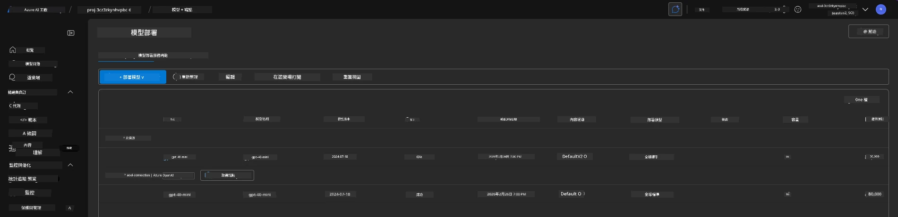
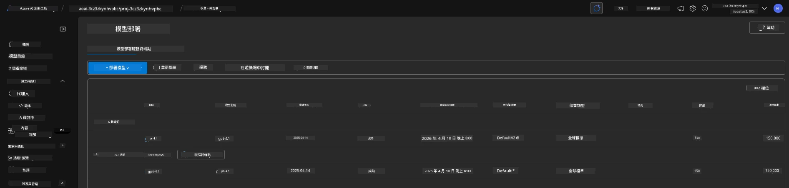

# 6. 拆除基礎設施

!!! tip "在本模組結束時您將能夠"

    - [ ] 了解資源清理與成本管理的重要性
    - [ ] 使用 `azd down` 安全地取消配置基礎設施
    - [ ] 必要時復原被軟刪除的認知服務
    - [ ] **Lab 6:** 清理 Azure 資源並驗證已移除

---

## 額外練習

在我們拆除專案之前，花幾分鐘做一些開放式探索。

!!! info "試試這些探索提示"

    **與 GitHub Copilot 進行實驗：**
    
    1. 詢問： `What other AZD templates could I try for multi-agent scenarios?`
    2. 詢問： `How can I customize the agent instructions for a healthcare use case?`
    3. 詢問： `What environment variables control cost optimization?`
    
    **探索 Azure 入口網站：**
    
    1. 檢視您部署的 Application Insights 指標
    2. 檢查已配置資源的成本分析
    3. 再度探索 Microsoft Foundry 入口網站中的 agent playground

---

## 取消配置基礎設施

1. 拆除基礎設施很簡單：
      
      ```bash title="" linenums="0"
      azd down --purge
      ```
1. `--purge` 旗標會確保同時清除已軟刪除的認知服務資源，從而釋放這些資源佔用的配額。完成後您會看到類似這樣的畫面：
      
      ```bash title="" linenums="0"
      ? Total resources to delete: 11, are you sure you want to continue? Yes
      Deleting your resources can take some time.
      (✓) Done: Deleted resource group rg-nitya-mshack-azd
      (✓) Done: Purging Cognitive Account: aoai-3cz3zkynhvpbc

      SUCCESS: Your application was removed from Azure in 11 minutes 4 seconds.
      ```

1. （可選）如果您現在再次執行 `azd up`，您會注意到 gpt-4.1 模型會被部署，因為環境變數已在本機 `.azure` 資料夾中變更（並已保存）。 

      以下是模型部署 **之前**：

      

      而這是 **之後**：
      

---

<!-- CO-OP TRANSLATOR DISCLAIMER START -->
免責聲明：

本文件已透過 AI 翻譯服務 Co-op Translator (https://github.com/Azure/co-op-translator) 進行翻譯。儘管我們力求準確，但請注意，自動翻譯可能包含錯誤或不準確之處。原始語言的文件應被視為權威來源。對於關鍵資訊，建議採用專業人工翻譯。我們不對因使用本翻譯而導致的任何誤解或錯誤詮釋承擔責任。
<!-- CO-OP TRANSLATOR DISCLAIMER END -->