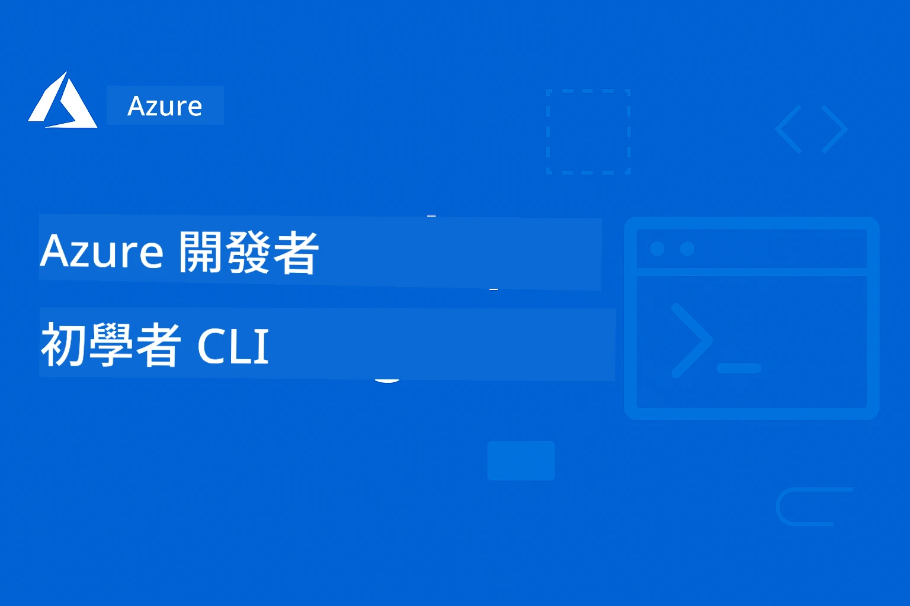

# AZD 初學者指南：有結構的學習旅程

 

[](https://GitHub.com/microsoft/azd-for-beginners/watchers/)
[](https://GitHub.com/microsoft/azd-for-beginners/network/)
[](https://GitHub.com/microsoft/azd-for-beginners/stargazers/)

[](https://discord.gg/microsoft-azure)
[](https://discord.gg/nTYy5BXMWG)

## 開始此課程

請依照以下步驟開始你的 AZD 學習之旅：

1. **叉出此倉庫**：點擊 [](https://GitHub.com/microsoft/azd-for-beginners/fork)
2. **克隆倉庫**：`git clone https://github.com/microsoft/azd-for-beginners.git`
3. **加入社群**：[Azure Discord Communities](https://discord.com/invite/ByRwuEEgH4) 獲得專家支援
4. **選擇你的學習路徑**：從下方章節中選擇符合你經驗水平的部分

### 多語言支援

#### 自動翻譯（持續更新）

<!-- CO-OP TRANSLATOR LANGUAGES TABLE START -->
[阿拉伯語](../ar/README.md) | [孟加拉語](../bn/README.md) | [保加利亞語](../bg/README.md) | [緬甸語 (Myanmar)](../my/README.md) | [中文 (簡體)](../zh-CN/README.md) | [中文 (繁體，香港)](../zh-HK/README.md) | [中文 (繁體，澳門)](../zh-MO/README.md) | [中文 (繁體，台灣)](./README.md) | [克羅埃西亞語](../hr/README.md) | [捷克語](../cs/README.md) | [丹麥語](../da/README.md) | [荷蘭語](../nl/README.md) | [愛沙尼亞語](../et/README.md) | [芬蘭語](../fi/README.md) | [法語](../fr/README.md) | [德語](../de/README.md) | [希臘語](../el/README.md) | [希伯來語](../he/README.md) | [印地語](../hi/README.md) | [匈牙利語](../hu/README.md) | [印尼語](../id/README.md) | [義大利語](../it/README.md) | [日語](../ja/README.md) | [坎納達語](../kn/README.md) | [韓語](../ko/README.md) | [立陶宛語](../lt/README.md) | [馬來語](../ms/README.md) | [馬拉雅拉姆語](../ml/README.md) | [馬拉地語](../mr/README.md) | [尼泊爾語](../ne/README.md) | [奈及利亞皮欽語](../pcm/README.md) | [挪威語](../no/README.md) | [波斯語 (法爾西語)](../fa/README.md) | [波蘭語](../pl/README.md) | [葡萄牙語 (巴西)](../pt-BR/README.md) | [葡萄牙語 (葡萄牙)](../pt-PT/README.md) | [旁遮普語 (Gurmukhi)](../pa/README.md) | [羅馬尼亞語](../ro/README.md) | [俄語](../ru/README.md) | [塞爾維亞語 (西里爾字母)](../sr/README.md) | [斯洛伐克語](../sk/README.md) | [斯洛維尼亞語](../sl/README.md) | [西班牙語](../es/README.md) | [斯瓦希里語](../sw/README.md) | [瑞典語](../sv/README.md) | [他加祿語 (菲律賓語)](../tl/README.md) | [泰米爾語](../ta/README.md) | [泰盧固語](../te/README.md) | [泰語](../th/README.md) | [土耳其語](../tr/README.md) | [烏克蘭語](../uk/README.md) | [烏爾都語](../ur/README.md) | [越南語](../vi/README.md)

> **想要本地克隆？**

> 本倉庫包含超過 50 種語言翻譯，會顯著增加下載大小。若想克隆且不帶翻譯檔，請使用 sparse checkout：  
> ```bash
> git clone --filter=blob:none --sparse https://github.com/microsoft/AZD-for-beginners.git
> cd AZD-for-beginners
> git sparse-checkout set --no-cone '/*' '!translations' '!translated_images'
> ```
> 這樣你會以更快的速度獲得完成課程所需的所有檔案。  
<!-- CO-OP TRANSLATOR LANGUAGES TABLE END -->

## 課程總覽

透過有結構的章節掌握 Azure Developer CLI（azd），設計成循序漸進學習。**特別強調結合 Microsoft Foundry 的 AI 應用部署。**

### 為什麼本課程對於現代開發者至關重要

基於 Microsoft Foundry Discord 社群見解，**45% 的開發者想用 AZD 進行 AI 工作負載**，但遇到以下挑戰：
- 複雜的多服務 AI 架構
- AI 生產部署最佳實踐  
- Azure AI 服務整合與配置
- AI 工作負載的成本優化
- AI 專屬部署問題的故障排除

### 學習目標

完成此有結構課程後，你將能：
- **精通 AZD 基礎**：核心概念、安裝和配置
- **部署 AI 應用**：結合 Microsoft Foundry 服務使用 AZD
- **實作基礎建設即程式碼**：運用 Bicep 模板管理 Azure 資源
- **故障排除部署**：解決常見問題並進行除錯
- **優化生產環境**：安全性、擴充、監控與成本管理
- **建置多代理 AI 解決方案**：部署複雜 AI 架構

## 📚 學習章節

*根據你的經驗和目標選擇學習路徑*

### 🚀 第 1 章：基礎與快速入門
**先決條件**：Azure 訂閱，基本命令列知識  
**時長**：30-45 分鐘  
**複雜度**：⭐

#### 你將學到
- 了解 Azure Developer CLI 基本原理
- 在你的平台安裝 AZD
- 完成第一個成功部署

#### 學習資源
- **🎯 從這裡開始**：[什麼是 Azure Developer CLI？](../..)
- **📖 理論**：[AZD 基礎](docs/getting-started/azd-basics.md) - 核心概念和術語
- **⚙️ 安裝設定**：[安裝與設置](docs/getting-started/installation.md) - 平台專屬指南
- **🛠️ 實作操作**：[你的第一個專案](docs/getting-started/first-project.md) - 分步教學
- **📋 快速參考**：[指令速查表](resources/cheat-sheet.md)

#### 實作練習
```bash
# 快速安裝檢查
azd version

# 部署您的第一個應用程式
azd init --template todo-nodejs-mongo
azd up
```

**💡 章節成果**：成功使用 AZD 部署簡易網頁應用至 Azure

**✅ 成功驗證：**  
```bash
# 完成第一章後，您應該能夠：
azd version              # 顯示已安裝版本
azd init --template todo-nodejs-mongo  # 初始化專案
azd up                  # 部署到 Azure
azd show                # 顯示執行中的應用程式 URL
# 應用程式在瀏覽器中開啟並正常運作
azd down --force --purge  # 清理資源
```

**📊 預估時間:** 30-45 分鐘  
**📈 完成後技能:** 能獨立部署基本應用

**✅ 成功驗證：**  
```bash
# 完成第1章後，你應該能夠：
azd version              # 顯示已安裝的版本
azd init --template todo-nodejs-mongo  # 初始化專案
azd up                  # 部署至 Azure
azd show                # 顯示運行中應用程式的 URL
# 應用程式在瀏覽器中開啟並正常運作
azd down --force --purge  # 清理資源
```

**📊 預估時間:** 30-45 分鐘  
**📈 完成後技能:** 能獨立部署基本應用

---

### 🤖 第 2 章：AI-優先開發（推薦給 AI 開發者）
**先決條件**：完成第 1 章  
**時長**：1-2 小時  
**複雜度**：⭐⭐

#### 你將學到
- Microsoft Foundry 與 AZD 整合
- 部署 AI 驅動的應用程式
- 理解 AI 服務配置

#### 學習資源
- **🎯 從這裡開始**：[Microsoft Foundry 整合](docs/microsoft-foundry/microsoft-foundry-integration.md)
- **📖 模式**：[AI 模型部署](docs/microsoft-foundry/ai-model-deployment.md) - 部署及管理 AI 模型
- **🛠️ 實作工作坊**：[AI 工作坊實驗室](docs/microsoft-foundry/ai-workshop-lab.md) - 讓你的 AI 解決方案 AZD 就緒
- **🎥 互動式指南**：[工作坊教材](workshop/README.md) - MkDocs 瀏覽 + DevContainer 環境學習
- **📋 模板**：[Microsoft Foundry 模板](../..)
- **📝 範例**：[AZD 部署範例](examples/README.md)

#### 實作練習
```bash
# 部署您的第一個AI應用程式
azd init --template azure-search-openai-demo
azd up

# 嘗試其他AI範本
azd init --template openai-chat-app-quickstart
azd init --template agent-openai-python-prompty
```

**💡 章節成果**：部署並配置具備 RAG 功能的 AI 聊天應用

**✅ 成功驗證：**  
```bash
# 在第二章之後，您應該能夠：
azd init --template azure-search-openai-demo
azd up
# 測試 AI 聊天介面
# 提問並取得包含來源的 AI 回應
# 驗證搜尋整合是否運作
azd monitor  # 檢查應用程式洞察顯示遙測資訊
azd down --force --purge
```

**📊 預估時間:** 1-2 小時  
**📈 完成後技能:** 能部署及配置生產等級 AI 應用  
**💰 成本認知:** 了解開發期約 $80-150/月，生產期約 $300-3500/月成本

#### 💰 AI 部署成本考量

**開發環境（估計 $80-150/月）：**
- Azure OpenAI（依使用付費）：$0-50/月（依標記使用量）
- AI 搜尋（基礎層）：$75/月
- Container Apps（用量付費）：$0-20/月
- 儲存（標準層）：$1-5/月

**生產環境（估計 $300-3500+/月）：**
- Azure OpenAI（PTU 保持高穩定性）：$3000+/月 或 高量使用的依使用付費
- AI 搜尋（標準層）：$250/月
- Container Apps（專用層）：$50-100/月
- Application Insights：$5-50/月
- 儲存（高級層）：$10-50/月

**💡 成本優化建議：**
- 使用 **免費層** Azure OpenAI 學習（含 50,000 tokens/月）
- 不開發時運行 `azd down` 解分配資源
- 開發期使用用量付費，僅生產期切換 PTU
- 使用 `azd provision --preview` 預估部署成本
- 啟用自動擴充，僅支付實際使用費用

**成本監控：**  
```bash
# 檢查估計的每月成本
azd provision --preview

# 在 Azure 入口網站監控實際成本
az consumption budget list --resource-group <your-rg>
```

---

### ⚙️ 第 3 章：配置與認證
**先決條件**：完成第 1 章  
**時長**：45-60 分鐘  
**複雜度**：⭐⭐

#### 你將學到
- 環境配置與管理
- 認證與安全最佳實務
- 資源命名與組織

#### 學習資源
- **📖 配置指南**：[環境設定](docs/getting-started/configuration.md)
- **🔐 安全性**：[認證模式與受管身分](docs/getting-started/authsecurity.md)
- **📝 範例**：[資料庫應用範例](examples/database-app/README.md)

#### 實作練習
- 配置多個環境（開發、測試、生產）
- 設定受管身分認證
- 實作環境專屬配置

**💡 章節成果**：管理多環境且具備妥善認證與安全性

---

### 🏗️ 第 4 章：基礎建設即程式碼與部署
**先決條件**：完成第 1-3 章  
**時長**：1-1.5 小時  
**複雜度**：⭐⭐⭐

#### 你將學到
- 進階部署模式
- 使用 Bicep 進行基礎建設即程式碼
- 資源佈建策略

#### 學習資源
- **📖 部署指南**：[完整工作流程](docs/deployment/deployment-guide.md)
- **🏗️ 佈建資源**：[Azure 資源管理](docs/deployment/provisioning.md)
- **📝 範例**：[Container App 範例](../../examples/container-app)

#### 實作練習
- 建立自訂 Bicep 模板
- 部署多服務應用
- 實作藍綠部署策略

**💡 章節成果**：使用自訂基礎建設模板部署複雜多服務應用

---

### 🎯 第 5 章：多代理 AI 解決方案（進階）
**先決條件**：完成第 1-2 章  
**時長**：2-3 小時  
**複雜度**：⭐⭐⭐⭐
#### 你將學習到的內容
- 多代理架構模式
- 代理協同與協調
- 生產環境級的 AI 部署

#### 學習資源
- **🤖 精選專案**: [零售多代理解決方案](examples/retail-scenario.md) - 完整實作
- **🛠️ ARM 範本**: [ARM 範本套件](../../examples/retail-multiagent-arm-template) - 一鍵部署
- **📖 架構**: [多代理協調模式](/docs/pre-deployment/coordination-patterns.md) - 模式介紹

#### 實作練習
```bash
# 部署完整的零售多智能體解決方案
cd examples/retail-multiagent-arm-template
./deploy.sh

# 探索智能體配置
az deployment group show --resource-group <rg-name> --name <deployment-name>
```

**💡 章節成果**：部署並管理具備客戶與庫存代理的生產級多代理 AI 解決方案

---

### 🔍 第六章：部署前驗證與規劃
**前提條件**：完成第四章  
**時長**：1 小時  
**難度**：⭐⭐

#### 你將學習到的內容
- 容量規劃與資源驗證
- SKU 選擇策略
- 部署前檢查與自動化

#### 學習資源
- **📊 規劃**：[容量規劃](docs/pre-deployment/capacity-planning.md) - 資源驗證
- **💰 選擇**：[SKU 選擇](docs/pre-deployment/sku-selection.md) - 成本效益選擇
- **✅ 驗證**：[部署前檢查](docs/pre-deployment/preflight-checks.md) - 自動化腳本

#### 實作練習
- 執行容量驗證腳本
- 優化 SKU 選擇以降低成本
- 實作自動化部署前檢查

**💡 章節成果**：部署前驗證並優化流程

---

### 🚨 第七章：疑難排解與除錯
**前提條件**：完成任一部署章節  
**時長**：1 至 1.5 小時  
**難度**：⭐⭐

#### 你將學習到的內容
- 系統性除錯方法
- 常見問題與解決方案
- AI 專屬疑難排解

#### 學習資源
- **🔧 常見問題**：[常見問題](docs/troubleshooting/common-issues.md) - FAQ 與解決技巧
- **🕵️ 除錯指南**：[除錯指南](docs/troubleshooting/debugging.md) - 分步策略
- **🤖 AI 問題**：[AI 專屬疑難排解](docs/troubleshooting/ai-troubleshooting.md) - AI 服務問題

#### 實作練習
- 診斷部署失敗原因
- 解決身份驗證問題
- 除錯 AI 服務連線問題

**💡 章節成果**：獨立診斷並解決常見部署問題

---

### 🏢 第八章：生產環境與企業模式
**前提條件**：完成第一至四章  
**時長**：2 至 3 小時  
**難度**：⭐⭐⭐⭐

#### 你將學習到的內容
- 生產環境部署策略
- 企業安全模式
- 監控與成本優化

#### 學習資源
- **🏭 生產環境**：[生產級 AI 優良實踐](docs/microsoft-foundry/production-ai-practices.md) - 企業模式
- **📝 範例**：[微服務範例](../../examples/microservices) - 複雜架構
- **📊 監控**：[Application Insights 整合](docs/pre-deployment/application-insights.md) - 監控

#### 實作練習
- 實作企業安全模式
- 建置全面監控系統
- 於生產環境安全治理下部署

**💡 章節成果**：部署具備完整生產能力的企業級應用程式

---

## 🎓 工作坊概覽：實作式學習體驗

> **⚠️ 工作坊狀態：積極開發中**  
> 工作坊教材正在開發與完善中。核心模組已可使用，但部分進階章節尚未完成。我們持續努力完成所有內容。[追蹤進度 →](workshop/README.md)

### 互動式工作坊教材
**全方位實作學習，結合瀏覽器工具與引導式練習**

我們的工作坊教材提供有結構、互動的學習體驗，搭配上述章節式課程設計。工作坊適合自行學習與講師帶領課程。

#### 🛠️ 工作坊特色
- **瀏覽器界面**：完整 MkDocs 平台，支援搜尋、複製及主題風格
- **GitHub Codespaces 整合**：一鍵設定開發環境
- **系統化學習路徑**：7 步驟引導練習（共 3.5 小時）
- **探索 → 部署 → 自訂**：逐步實踐流程
- **互動式 DevContainer 環境**：預配置工具與相依套件

#### 📚 工作坊結構
工作坊採用 **探索 → 部署 → 自訂** 流程：

1. **探索階段**（45 分鐘）
   - 探索 Microsoft Foundry 範本與服務
   - 了解多代理架構模式
   - 檢視部署需求與前置條件

2. **部署階段**（2 小時）
   - 使用 AZD 實作 AI 應用部署
   - 配置 Azure AI 服務與端點
   - 實作安全與驗證模式

3. **自訂階段**（45 分鐘）
   - 修改應用以符合特定需求
   - 優化生產環境部署
   - 實施監控與成本管理

#### 🚀 開始使用工作坊
```bash
# 選項 1：GitHub Codespaces （推薦）
# 在儲存庫中點選「Code」→「Create codespace on main」

# 選項 2：本地開發
git clone https://github.com/microsoft/azd-for-beginners.git
cd azd-for-beginners/workshop
# 請依照 workshop/README.md 中的設定說明進行設定
```

#### 🎯 工作坊學習成果
完成工作坊後，學員將能：
- **部署生產級 AI 應用**：使用 AZD 與 Microsoft Foundry 服務
- **精通多代理架構**：實作協同 AI 代理解決方案
- **落實安全最佳實踐**：配置驗證與存取控制
- **規模優化部署**：設計具成本效益及效能的方案
- **自主排解部署問題**：獨立解決常見問題

#### 📖 工作坊資源
- **🎥 互動指南**：[工作坊教材](workshop/README.md) - 瀏覽器學習環境
- **📋 詳細步驟**：[引導式練習](../../workshop/docs/instructions) - 詳細操作說明
- **🛠️ AI 工作坊實驗室**：[AI 工作坊實驗室](docs/microsoft-foundry/ai-workshop-lab.md) - AI 專題練習
- **💡 快速上手**：[工作坊設定指南](workshop/README.md#quick-start) - 環境配置說明

**適合對象**：企業培訓、大學課程、自學及開發者訓練營。

---

## 📖 什麼是 Azure Developer CLI？

Azure Developer CLI（azd）是一款以開發者為中心的命令列介面，能加速應用程式在 Azure 的建置與部署流程。它提供：

- **範本式部署** - 使用預建範本實現常見應用模式
- **基礎設施即程式碼** - 以 Bicep 或 Terraform 管理 Azure 資源  
- **整合式工作流** - 無縫完成佈署、監控與管理
- **開發者友善** - 優化開發生產力與體驗

### **AZD + Microsoft Foundry：AI 部署的完美組合**

**為何 AZD 是 AI 解決方案首選？** AZD 針對 AI 開發面臨的主要挑戰提供解答：

- **AI 預設範本** - 支援 Azure OpenAI、認知服務及機器學習工作負載
- **安全 AI 部署** - 內建 AI 服務、API 金鑰及模型端點的安全模式  
- **生產級 AI 模式** - 可擴充且成本效益高的部署最佳實踐
- **端到端 AI 工作流程** - 從模型開發到生產部署及監控全方位支持
- **成本優化** - 智慧資源分配及彈性擴展策略
- **Microsoft Foundry 整合** - 與 Microsoft Foundry 模型目錄及端點無縫接軌

---

## 🎯 範本與範例庫

### 精選：Microsoft Foundry 範本
**若您要部署 AI 應用，請從這裡開始！**

> **注意：** 這些範本展示各種 AI 模式，有些為外部 Azure 範例，有些為本地實作。

| 範本 | 章節 | 難度 | 服務 | 類型 |
|----------|---------|------------|----------|------|
| [**AI 聊天入門**](https://github.com/Azure-Samples/get-started-with-ai-chat) | 第二章 | ⭐⭐ | AzureOpenAI + Azure AI 模型推斷 API + Azure AI 搜尋 + Azure 容器應用 + Application Insights | 外部 |
| [**AI 代理入門**](https://github.com/Azure-Samples/get-started-with-ai-agents) | 第二章 | ⭐⭐ | Azure AI 代理服務 + AzureOpenAI + Azure AI 搜尋 + Azure 容器應用 + Application Insights| 外部 |
| [**Azure 搜尋與 OpenAI 示範**](https://github.com/Azure-Samples/azure-search-openai-demo) | 第二章 | ⭐⭐ | AzureOpenAI + Azure AI 搜尋 + 應用服務 + 儲存體 | 外部 |
| [**OpenAI 聊天應用快速入門**](https://github.com/Azure-Samples/openai-chat-app-quickstart) | 第二章 | ⭐ | AzureOpenAI + 容器應用 + Application Insights | 外部 |
| [**Agent OpenAI Python Prompty**](https://github.com/Azure-Samples/agent-openai-python-prompty) | 第五章 | ⭐⭐⭐ | AzureOpenAI + Azure Functions + Prompty | 外部 |
| [**Contoso 聊天 RAG**](https://github.com/Azure-Samples/contoso-chat) | 第八章 | ⭐⭐⭐⭐ | AzureOpenAI + AI 搜尋 + Cosmos DB + 容器應用 | 外部 |
| [**零售多代理解決方案**](examples/retail-scenario.md) | 第五章 | ⭐⭐⭐⭐ | AzureOpenAI + AI 搜尋 + 儲存體 + 容器應用 + Cosmos DB | **本地** |

### 精選：完整學習場景
**與學習章節對應的生產應用範本**

| 範本 | 學習章節 | 難度 | 主要學習內容 |
|----------|------------------|------------|--------------|
| [**openai-chat-app-quickstart**](https://github.com/Azure-Samples/openai-chat-app-quickstart) | 第二章 | ⭐ | 基本 AI 部署模式 |
| [**azure-search-openai-demo**](https://github.com/Azure-Samples/azure-search-openai-demo) | 第二章 | ⭐⭐ | 結合 Azure AI 搜尋的 RAG 實作 |
| [**ai-document-processing**](https://github.com/Azure-Samples/ai-document-processing) | 第四章 | ⭐⭐ | 文件智慧整合 |
| [**agent-openai-python-prompty**](https://github.com/Azure-Samples/agent-openai-python-prompty) | 第五章 | ⭐⭐⭐ | 代理框架與函式呼叫 |
| [**contoso-chat**](https://github.com/Azure-Samples/contoso-chat) | 第八章 | ⭐⭐⭐ | 企業 AI 協作 |
| [**retail-multi-agent-solution**](examples/retail-scenario.md) | 第五章 | ⭐⭐⭐⭐ | 多代理架構，包含客戶與庫存代理 |

### 依範例類型學習

> **📌 本地與外部範例說明:**  
> **本地範例**（本倉儲內）= 即刻可用  
> **外部範例**（Azure Samples）= 從外部儲存庫克隆使用

#### 本地範例（即刻可用）
- [**零售多代理解決方案**](examples/retail-scenario.md) - 生產級完整實作與 ARM 範本
  - 多代理架構（客戶 + 庫存代理）
  - 全面監控與評估
  - ARM 範本一鍵部署

#### 本地範例 - 容器應用（第二至五章）
**本倉庫包含完整容器部署範例：**
- [**容器應用範例**](examples/container-app/README.md) - 容器化部署全指南
  - [簡易 Flask API](../../examples/container-app/simple-flask-api) - 可垂直縮減至零的基礎 REST API
  - [微服務架構](../../examples/container-app/microservices) - 生產環境多服務部署
  - 快速入門、正式生產與進階部署模式
  - 監控、安全與成本優化指導

#### 外部範例 - 簡易應用（第一、二章）
**克隆下列 Azure 範例儲存庫開始使用：**
- [簡易網頁應用 - Node.js + MongoDB](https://github.com/Azure-Samples/todo-nodejs-mongo) - 基礎部署模式
- [靜態網站 - React SPA](https://github.com/Azure-Samples/todo-csharp-sql-swa-func) - 靜態內容部署
- [容器應用 - Python Flask](https://github.com/Azure-Samples/container-apps-store-api-microservice) - REST API 部署

#### 外部範例 - 資料庫整合（第三、四章）  
- [資料庫應用 - C# + SQL](https://github.com/Azure-Samples/todo-csharp-sql) - 資料庫連線模式
- [Functions + Cosmos DB](https://github.com/Azure-Samples/todo-python-mongo-swa-func) - 無伺服器資料工作流

#### 外部範例 - 進階模式（第四至八章）
- [Java 微服務](https://github.com/Azure-Samples/java-microservices-aca-lab) - 多服務架構
- [容器應用任務](https://github.com/Azure-Samples/container-apps-jobs) - 背景作業  
- [企業機器學習管線](https://github.com/Azure-Samples/mlops-v2) - 生產級 ML 模式

### 外部範本集
- [**官方 AZD 範本庫**](https://azure.github.io/awesome-azd/) - 精選官方與社群範本集錦
- [**Azure 開發者 CLI 範本**](https://learn.microsoft.com/en-us/azure/developer/azure-developer-cli/azd-templates) - Microsoft Learn 範本文件
- [**範例目錄**](examples/README.md) - 本地學習範例並附詳細說明

---

## 📚 學習資源與參考資料

### 快速參考
- [**指令速查表**](resources/cheat-sheet.md) - 依章節整理的重要 azd 指令
- [**術語表**](resources/glossary.md) - Azure 與 azd 專有名詞  
- [**常見問題**](resources/faq.md) - 依學習章節整理的常見問題
- [**學習指南**](resources/study-guide.md) - 全面實作練習題

### 實作工作坊
- [**AI 工作坊實驗室**](docs/microsoft-foundry/ai-workshop-lab.md) - 讓您的 AI 解決方案支援 AZD 部署（2-3 小時）
- [**互動式工作坊指南**](workshop/README.md) - 透過 MkDocs 和 DevContainer 環境的瀏覽器工作坊
- [**結構化學習路徑**](../../workshop/docs/instructions) - 7 步驟引導練習（探索 → 部署 → 自訂）
- [**AZD 初學者工作坊**](workshop/README.md) - 完整實作工作坊教材，整合 GitHub Codespaces

### 外部學習資源
- [Azure 開發者 CLI 文件](https://learn.microsoft.com/en-us/azure/developer/azure-developer-cli/)
- [Azure 架構中心](https://learn.microsoft.com/en-us/azure/architecture/)
- [Azure 定價計算機](https://azure.microsoft.com/pricing/calculator/)
- [Azure 狀態](https://status.azure.com/)

---

## 🔧 快速故障排除指南

**初學者常見問題與即時解決方案：**

### ❌ "azd: 找不到指令"

```bash
# 請先安裝 AZD
# Windows（PowerShell）：
winget install microsoft.azd

# macOS：
brew tap azure/azd && brew install azd

# Linux：
curl -fsSL https://aka.ms/install-azd.sh | bash

# 驗證安裝結果
azd version
```

### ❌ "找不到訂閱" 或 "未設定訂閱"

```bash
# 列出可用的訂閱
az account list --output table

# 設定預設訂閱
az account set --subscription "<subscription-id-or-name>"

# 為 AZD 環境設定
azd env set AZURE_SUBSCRIPTION_ID "<subscription-id>"

# 驗證
az account show
```

### ❌ "配額不足" 或 "配額超過"

```bash
# 嘗試不同的 Azure 區域
azd env set AZURE_LOCATION "westus2"
azd up

# 或在開發時使用較小的 SKU
# 編輯 infra/main.parameters.json：
{
  "sku": "B1"  // Instead of "P1V2"
}
```

### ❌ "azd up" 半途失敗

```bash
# 選項 1：清理並重試
azd down --force --purge
azd up

# 選項 2：僅修復基礎設施
azd provision

# 選項 3：檢查詳細日誌
azd show
azd logs
```

### ❌ "驗證失敗" 或 "令牌已過期"

```bash
# 重新驗證
az logout
az login

azd auth logout
azd auth login

# 驗證身份認證
az account show
```

### ❌ "資源已存在" 或 命名衝突

```bash
# AZD 會產生唯一名稱，但如果發生衝突：
azd down --force --purge

# 則使用新的環境重新嘗試
azd env new dev-v2
azd up
```

### ❌ 範本部署花費太長時間

**正常等待時間：**
- 簡單網頁應用程式：5-10 分鐘
- 帶資料庫的應用程式：10-15 分鐘
- AI 應用程式：15-25 分鐘（OpenAI 配置較慢）

```bash
# 檢查進度
azd show

# 如果卡住超過30分鐘，請檢查 Azure 入口網站：
azd monitor
# 尋找失敗的部署
```

### ❌ "權限被拒絕" 或 "禁止存取"

```bash
# 檢查您的 Azure 角色
az role assignment list --assignee $(az account show --query user.name -o tsv)

# 您至少需要「參與者」角色
# 請您的 Azure 管理員授權：
# - 參與者（用於資源）
# - 使用者存取管理員（用於角色指派）
```

### ❌ 找不到已部署的應用程式網址

```bash
# 顯示所有服務端點
azd show

# 或打開 Azure 入口網站
azd monitor

# 檢查特定服務
azd env get-values
# 尋找 *_URL 變數
```

### 📚 完整故障排除資源

- **常見問題指南：** [詳細解決方案](docs/troubleshooting/common-issues.md)
- **AI 專屬問題：** [AI 故障排除](docs/troubleshooting/ai-troubleshooting.md)
- **除錯指南：** [逐步除錯](docs/troubleshooting/debugging.md)
- **尋求協助：** [Azure Discord](https://discord.gg/microsoft-azure) #azure-developer-cli

---

## 🔧 快速故障排除指南

**初學者常見問題與即時解決方案：**

<details>
<summary><strong>❌ "azd: 找不到指令"</strong></summary>

```bash
# 請先安裝 AZD
# Windows（PowerShell）：
winget install microsoft.azd

# macOS：
brew tap azure/azd && brew install azd

# Linux：
curl -fsSL https://aka.ms/install-azd.sh | bash

# 驗證安裝
azd version
```
</details>

<details>
<summary><strong>❌ "找不到訂閱" 或 "未設定訂閱"</strong></summary>

```bash
# 列出可用訂閱
az account list --output table

# 設定預設訂閱
az account set --subscription "<subscription-id-or-name>"

# 設定 AZD 環境
azd env set AZURE_SUBSCRIPTION_ID "<subscription-id>"

# 驗證
az account show
```
</details>

<details>
<summary><strong>❌ "配額不足" 或 "配額超過"</strong></summary>

```bash
# 嘗試不同的 Azure 區域
azd env set AZURE_LOCATION "westus2"
azd up

# 或在開發階段使用較小的 SKU
# 編輯 infra/main.parameters.json：
{
  "sku": "B1"  // Instead of "P1V2"
}
```
</details>

<details>
<summary><strong>❌ "azd up" 半途失敗</strong></summary>

```bash
# 選項 1：清理並重試
azd down --force --purge
azd up

# 選項 2：僅修復基礎設施
azd provision

# 選項 3：檢查詳細日誌
azd show
azd logs
```
</details>

<details>
<summary><strong>❌ "驗證失敗" 或 "令牌已過期"</strong></summary>

```bash
# 重新驗證
az logout
az login

azd auth logout
azd auth login

# 驗證身份認證
az account show
```
</details>

<details>
<summary><strong>❌ "資源已存在" 或 命名衝突</strong></summary>

```bash
# AZD 會產生唯一名稱，但若發生衝突：
azd down --force --purge

# 那麼重新嘗試並使用新的環境
azd env new dev-v2
azd up
```
</details>

<details>
<summary><strong>❌ 範本部署花費太長時間</strong></summary>

**正常等待時間：**
- 簡單網頁應用程式：5-10 分鐘
- 帶資料庫的應用程式：10-15 分鐘
- AI 應用程式：15-25 分鐘（OpenAI 配置較慢）

```bash
# 檢查進度
azd show

# 如果卡住超過30分鐘，檢查 Azure 入口網站：
azd monitor
# 查找部署失敗的項目
```
</details>

<details>
<summary><strong>❌ "權限被拒絕" 或 "禁止存取"</strong></summary>

```bash
# 檢查您的 Azure 角色
az role assignment list --assignee $(az account show --query user.name -o tsv)

# 您至少需要「參與者」角色
# 請您的 Azure 管理員授予：
# - 參與者（針對資源）
# - 使用者存取管理員（針對角色指派）
```
</details>

<details>
<summary><strong>❌ 找不到已部署的應用程式網址</strong></summary>

```bash
# 顯示所有服務端點
azd show

# 或打開 Azure 入口網站
azd monitor

# 檢查特定服務
azd env get-values
# 尋找 *_URL 變數
```
</details>

### 📚 完整故障排除資源

- **常見問題指南：** [詳細解決方案](docs/troubleshooting/common-issues.md)
- **AI 專屬問題：** [AI 故障排除](docs/troubleshooting/ai-troubleshooting.md)
- **除錯指南：** [逐步除錯](docs/troubleshooting/debugging.md)
- **尋求協助：** [Azure Discord](https://discord.gg/microsoft-azure) #azure-developer-cli

---

## 🎓 課程完成與認證

### 進度追蹤
追蹤每章學習進度：

- [ ] **第 1 章**：基礎與快速入門 ✅
- [ ] **第 2 章**：AI 為先的開發 ✅  
- [ ] **第 3 章**：設定與驗證 ✅
- [ ] **第 4 章**：基礎架構即程式碼與部署 ✅
- [ ] **第 5 章**：多代理 AI 解決方案 ✅
- [ ] **第 6 章**：部署前驗證與規劃 ✅
- [ ] **第 7 章**：故障排除與除錯 ✅
- [ ] **第 8 章**：生產環境與企業架構 ✅

### 學習驗證
每章完成後，驗證您對內容的掌握：
1. **實務練習**：完成該章的實機部署
2. **知識檢測**：回顧該章的常見問題區
3. **社群討論**：在 Azure Discord 分享心得
4. **後續章節**：進入下一個難度層級

### 課程完成效益
完成所有章節後，您將擁有：
- **生產經驗**：已部署實際 AI 應用至 Azure
- **專業技能**：具備企業級部署能力  
- **社群認可**：成為活躍 Azure 開發者社群成員
- **職涯提升**：掌握熱門 AZD 與 AI 部署專業知識

---

## 🤝 社群與支援

### 尋求協助與支援
- **技術問題**： [回報問題與功能請求](https://github.com/microsoft/azd-for-beginners/issues)
- **學習相關問題**： [Microsoft Azure Discord 社群](https://discord.gg/microsoft-azure) 與 [](https://discord.gg/nTYy5BXMWG)
- **AI 專屬協助**： 加入 [](https://discord.gg/nTYy5BXMWG)
- **官方文件**： [Azure 開發者 CLI 官方文件](https://learn.microsoft.com/en-us/azure/developer/azure-developer-cli/)

### Microsoft Foundry Discord 社群見解

**#Azure 頻道近期調查結果：**
- **45%** 開發者想用 AZD 來處理 AI 工作負載
- **主要挑戰**：多服務部署、憑證管理、生產環境準備  
- **最常請求**：AI 專屬範本、故障排除指南、最佳實踐

**加入我們社群以：**
- 分享您的 AZD + AI 經驗並獲得協助
- 優先試用新的 AI 範本
- 參與 AI 部署最佳實踐制定
- 影響未來 AI + AZD 功能開發

### 參與課程貢獻
歡迎各界共同參與！詳情請閱讀 [貢獻指南](CONTRIBUTING.md)：
- **內容改進**：提升現有章節與範例
- **新增範例**：加入真實案例與範本  
- **翻譯協助**：維護多語言支持
- **錯誤回報**：改善準確性與清晰度
- **社群規範**：遵守多元包容的社群守則

---

## 📄 課程資訊

### 授權條款
本專案採用 MIT 授權條款，詳見 [LICENSE](../../LICENSE) 檔案。

### 相關 Microsoft 學習資源

我們團隊也製作其他完整學習課程：

<!-- CO-OP TRANSLATOR OTHER COURSES START -->
### LangChain
[](https://aka.ms/langchain4j-for-beginners)
[](https://aka.ms/langchainjs-for-beginners?WT.mc_id=m365-94501-dwahlin)
[](https://github.com/microsoft/langchain-for-beginners?WT.mc_id=m365-94501-dwahlin)
---

### Azure / Edge / MCP / Agents
[](https://github.com/microsoft/AZD-for-beginners?WT.mc_id=academic-105485-koreyst)
[](https://github.com/microsoft/edgeai-for-beginners?WT.mc_id=academic-105485-koreyst)
[](https://github.com/microsoft/mcp-for-beginners?WT.mc_id=academic-105485-koreyst)
[](https://github.com/microsoft/ai-agents-for-beginners?WT.mc_id=academic-105485-koreyst)

---
 
### 生成式 AI 系列
[](https://github.com/microsoft/generative-ai-for-beginners?WT.mc_id=academic-105485-koreyst)
[-9333EA?style=for-the-badge&labelColor=E5E7EB&color=9333EA)](https://github.com/microsoft/Generative-AI-for-beginners-dotnet?WT.mc_id=academic-105485-koreyst)
[-C084FC?style=for-the-badge&labelColor=E5E7EB&color=C084FC)](https://github.com/microsoft/generative-ai-for-beginners-java?WT.mc_id=academic-105485-koreyst)
[-E879F9?style=for-the-badge&labelColor=E5E7EB&color=E879F9)](https://github.com/microsoft/generative-ai-with-javascript?WT.mc_id=academic-105485-koreyst)

---
 
### 核心學習

[](https://aka.ms/ml-beginners?WT.mc_id=academic-105485-koreyst)
[](https://aka.ms/datascience-beginners?WT.mc_id=academic-105485-koreyst)
[](https://aka.ms/ai-beginners?WT.mc_id=academic-105485-koreyst)
[](https://github.com/microsoft/Security-101?WT.mc_id=academic-96948-sayoung)
[](https://aka.ms/webdev-beginners?WT.mc_id=academic-105485-koreyst)
[](https://aka.ms/iot-beginners?WT.mc_id=academic-105485-koreyst)
[](https://github.com/microsoft/xr-development-for-beginners?WT.mc_id=academic-105485-koreyst)

---
 
### Copilot 系列
[](https://aka.ms/GitHubCopilotAI?WT.mc_id=academic-105485-koreyst)
[](https://github.com/microsoft/mastering-github-copilot-for-dotnet-csharp-developers?WT.mc_id=academic-105485-koreyst)
[](https://github.com/microsoft/CopilotAdventures?WT.mc_id=academic-105485-koreyst)
<!-- CO-OP TRANSLATOR OTHER COURSES END -->

---

## 🗺️ 課程導覽

**🚀 準備好開始學習了嗎？**

**初學者**：從[第 1 章：基礎與快速入門](../..)開始  
**AI 開發者**：直接跳到[第 2 章：以 AI 為先的開發](../..)  
**有經驗的開發者**：從[第 3 章：配置與驗證](../..)開始

**下一步**：[開始第 1 章 - AZD 基礎](docs/getting-started/azd-basics.md) →

---

<!-- CO-OP TRANSLATOR DISCLAIMER START -->
**免責聲明**：  
本文件係使用 AI 翻譯服務 [Co-op Translator](https://github.com/Azure/co-op-translator) 進行翻譯。雖然我們致力於準確性，但請注意自動翻譯可能包含錯誤或不準確之處。原始文件之母語版本應視為權威來源。對於重要資訊，建議採用專業人工翻譯。我們不對因使用本翻譯而產生的任何誤解或誤譯負責。
<!-- CO-OP TRANSLATOR DISCLAIMER END -->