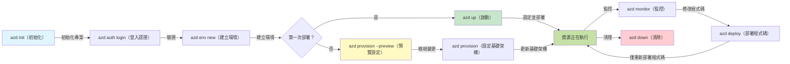
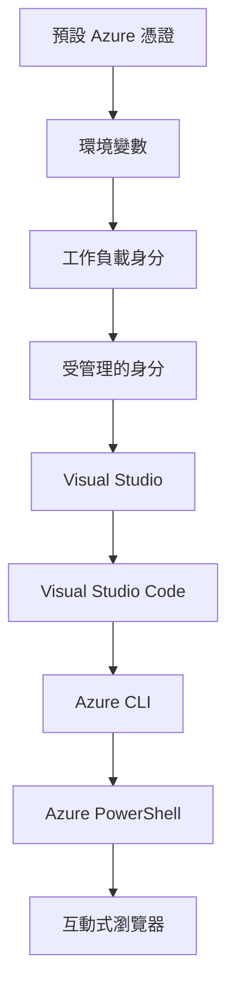

# AZD Basics - 了解 Azure Developer CLI

# AZD Basics - 核心概念與基礎

**Chapter Navigation:**
- **📚 Course Home**: [AZD 新手指南](../../README.md)
- **📖 Current Chapter**: 第 1 章 - 基礎與快速上手
- **⬅️ Previous**: [課程總覽](../../README.md#-chapter-1-foundation--quick-start)
- **➡️ Next**: [安裝與設定](installation.md)
- **🚀 Next Chapter**: [第 2 章：以 AI 為先的開發](../chapter-02-ai-development/microsoft-foundry-integration.md)

## 介紹

本課程介紹 Azure Developer CLI (azd)，一個強大的命令列工具，能加速你從本地開發到部署到 Azure 的流程。你將學習基本概念、核心功能，並了解 azd 如何簡化雲原生應用程式的部署。

## 學習目標

完成本課程後，你將會：
- 了解 Azure Developer CLI 是什麼以及它的主要用途
- 學習模板、環境與服務的核心概念
- 探索主要功能，包括以模板驅動的開發與基礎架構即程式碼
- 了解 azd 專案結構與工作流程
- 準備好於開發環境中安裝與設定 azd

## 學習成效

完成本課程後，你應能：
- 說明 azd 在現代雲端開發流程中的角色
- 辨識 azd 專案結構的組成元件
- 描述模板、環境與服務如何協同運作
- 了解使用 azd 實現基礎架構即程式碼的好處
- 識別不同的 azd 命令及其用途

## 什麼是 Azure Developer CLI (azd)?

Azure Developer CLI (azd) 是一個命令列工具，旨在加速你從本地開發到 Azure 部署的流程。它簡化了在 Azure 上構建、部署與管理雲原生應用程式的過程。

### 使用 azd 可以部署什麼？

azd 支援各種工作負載，且支援範圍持續擴展。今天，你可以使用 azd 部署：

| 工作負載類型 | 範例 | 相同工作流程？ |
|---------------|----------|----------------|
| <strong>傳統應用程式</strong> | Web 應用程式、REST API、靜態網站 | ✅ `azd up` |
| <strong>服務與微服務</strong> | Container Apps、Function Apps、多服務後端 | ✅ `azd up` |
| **AI 驅動應用程式** | 使用 Microsoft Foundry 模型的聊天應用、結合 AI Search 的 RAG 解決方案 | ✅ `azd up` |
| <strong>智慧代理</strong> | 在 Foundry 託管的代理、多代理協同編排 | ✅ `azd up` |

關鍵在於 **無論部署什麼，azd 的生命週期都相同**。你會初始化專案、佈建基礎架構、部署程式碼、監控應用程式，然後清理資源——無論是簡單網站或是複雜的 AI 代理。

這種連續性是刻意設計的。azd 將 AI 能力視為應用程式可以使用的另一種服務，而非根本不同的東西。對 azd 而言，由 Microsoft Foundry 模型支援的聊天端點，只不過是另一個需要設定和部署的服務。

### 🎯 為何使用 AZD？實際案例比較

我們來比較部署一個帶資料庫的簡單網站：

#### ❌ 未使用 AZD：手動在 Azure 部署（30+ 分鐘）

```bash
# 步驟 1：建立資源群組
az group create --name myapp-rg --location eastus

# 步驟 2：建立 App Service 計劃
az appservice plan create --name myapp-plan \
  --resource-group myapp-rg \
  --sku B1 --is-linux

# 步驟 3：建立 Web 應用程式
az webapp create --name myapp-web-unique123 \
  --resource-group myapp-rg \
  --plan myapp-plan \
  --runtime "NODE:18-lts"

# 步驟 4：建立 Cosmos DB 帳戶（10-15 分鐘）
az cosmosdb create --name myapp-cosmos-unique123 \
  --resource-group myapp-rg \
  --kind MongoDB

# 步驟 5：建立資料庫
az cosmosdb mongodb database create \
  --account-name myapp-cosmos-unique123 \
  --resource-group myapp-rg \
  --name tododb

# 步驟 6：建立集合
az cosmosdb mongodb collection create \
  --account-name myapp-cosmos-unique123 \
  --resource-group myapp-rg \
  --database-name tododb \
  --name todos

# 步驟 7：取得連線字串
CONN_STR=$(az cosmosdb keys list \
  --name myapp-cosmos-unique123 \
  --resource-group myapp-rg \
  --type connection-strings \
  --query "connectionStrings[0].connectionString" -o tsv)

# 步驟 8：設定應用程式設定
az webapp config appsettings set \
  --name myapp-web-unique123 \
  --resource-group myapp-rg \
  --settings MONGODB_URI="$CONN_STR"

# 步驟 9：啟用記錄
az webapp log config --name myapp-web-unique123 \
  --resource-group myapp-rg \
  --application-logging filesystem \
  --detailed-error-messages true

# 步驟 10：設定 Application Insights
az monitor app-insights component create \
  --app myapp-insights \
  --location eastus \
  --resource-group myapp-rg

# 步驟 11：將 App Insights 連結到 Web 應用程式
INSTRUMENTATION_KEY=$(az monitor app-insights component show \
  --app myapp-insights \
  --resource-group myapp-rg \
  --query "instrumentationKey" -o tsv)

az webapp config appsettings set \
  --name myapp-web-unique123 \
  --resource-group myapp-rg \
  --settings APPINSIGHTS_INSTRUMENTATIONKEY="$INSTRUMENTATION_KEY"

# 步驟 12：在本機建置應用程式
npm install
npm run build

# 步驟 13：建立部署封包
zip -r app.zip . -x "*.git*" "node_modules/*"

# 步驟 14：部署應用程式
az webapp deployment source config-zip \
  --resource-group myapp-rg \
  --name myapp-web-unique123 \
  --src app.zip

# 步驟 15：等一下並祈禱它能順利運作 🙏
# （沒有自動驗證，需進行手動測試）
```

**問題：**
- ❌ 需記住並按順序執行 15+ 個命令
- ❌ 30–45 分鐘的手動操作
- ❌ 容易出錯（打字錯誤、參數錯誤）
- ❌ 連線字串會暴露在終端歷史中
- ❌ 若發生失敗無自動回滾
- ❌ 團隊成員難以複現
- ❌ 每次都不同（不可重現）

#### ✅ 使用 AZD：自動化部署（5 個命令，10–15 分鐘）

```bash
# 步驟 1：從範本初始化
azd init --template todo-nodejs-mongo

# 步驟 2：驗證
azd auth login

# 步驟 3：建立環境
azd env new dev

# 步驟 4：預覽變更（可選，但建議）
azd provision --preview

# 步驟 5：部署所有內容
azd up

# ✨ 完成！所有項目已部署、設定並受監控
```

**優點：**
- ✅ **5 個命令** 與 15+ 個手動步驟相比
- ✅ **10–15 分鐘** 總時間（大多在等待 Azure）
- ✅ <strong>零錯誤</strong> - 自動化且經測試
- ✅ **機密透過 Key Vault 安全管理**
- ✅ <strong>在失敗時自動回滾</strong>
- ✅ <strong>完全可重現</strong> - 每次結果相同
- ✅ <strong>團隊就緒</strong> - 任何人都能用相同命令部署
- ✅ <strong>基礎架構即程式碼</strong> - Bicep 範本納入版本控制
- ✅ <strong>內建監控</strong> - 自動設定 Application Insights

### 📊 時間與錯誤減少

| 指標 | 手動部署 | AZD 部署 | 改善 |
|:-------|:------------------|:---------------|:------------|
| <strong>命令數</strong> | 15+ | 5 | 減少 67% |
| <strong>時間</strong> | 30–45 分鐘 | 10–15 分鐘 | 快 60% |
| <strong>錯誤率</strong> | 約 40% | <5% | 降低 88% |
| <strong>一致性</strong> | 低（手動） | 100%（自動） | 完美 |
| <strong>團隊入門時間</strong> | 2–4 小時 | 30 分鐘 | 快 75% |
| <strong>回滾時間</strong> | 30+ 分鐘（手動） | 2 分鐘（自動） | 快 93% |

## 核心概念

### 範本
範本是 azd 的基礎。它們包含：
- <strong>應用程式程式碼</strong> - 你的原始程式碼與相依套件
- <strong>基礎架構定義</strong> - 以 Bicep 或 Terraform 定義的 Azure 資源
- <strong>設定檔</strong> - 設定與環境變數
- <strong>部署腳本</strong> - 自動化部署工作流程

### 環境
環境代表不同的部署目標：
- **開發（Development）** - 用於測試與開發
- **預演（Staging）** - 準生產環境
- **生產（Production）** - 線上生產環境

每個環境各自維護：
- Azure 資源群組
- 設定值
- 部署狀態

### 服務
服務是應用程式的構建模組：
- **前端（Frontend）** - Web 應用程式、單頁應用（SPA）
- **後端（Backend）** - API、微服務
- **資料庫（Database）** - 資料儲存解決方案
- **儲存（Storage）** - 檔案與 Blob 儲存

## 主要功能

### 1. 以範本驅動的開發
```bash
# 瀏覽可用的範本
azd template list

# 從範本初始化
azd init --template <template-name>
```

### 2. 基礎架構即程式碼
- **Bicep** - Azure 的領域特定語言
- **Terraform** - 多雲環境的基礎架構工具
- **ARM 範本** - Azure Resource Manager 範本

### 3. 整合工作流程
```bash
# 完整的部署工作流程
azd up            # 配置與部署：適用於首次設定的無需手動干預

# 🧪 新增：在部署前預覽基礎設施變更（安全）
azd provision --preview    # 模擬基礎設施部署而不做任何變更

azd provision     # 當你更新基礎設施並需要建立 Azure 資源時使用此功能
azd deploy        # 部署或在更新後重新部署應用程式程式碼
azd down          # 清理資源
```

#### 🛡️ 使用預覽安全規劃基礎架構
`azd provision --preview` 命令是安全部署的關鍵工具：
- **模擬執行分析（Dry-run）** - 顯示將被建立、修改或刪除的項目
- <strong>零風險</strong> - 不會對你的 Azure 環境進行實際變更
- <strong>團隊協作</strong> - 在部署前分享預覽結果
- <strong>成本估算</strong> - 在承諾前了解資源成本

```bash
# 範例預覽工作流程
azd provision --preview           # 查看將會改變的內容
# 檢視輸出，與團隊討論
azd provision                     # 放心地套用變更
```

### 📊 視覺：AZD 開發工作流程


**工作流程說明：**
1. **Init** - 從範本或新專案開始
2. **Auth** - 與 Azure 進行驗證
3. **Environment** - 建立獨立的部署環境
4. **Preview** - 🆕 始終先預覽基礎架構變更（安全作法）
5. **Provision** - 建立/更新 Azure 資源
6. **Deploy** - 推送你的應用程式程式碼
7. **Monitor** - 觀察應用程式效能
8. **Iterate** - 做出變更並重新部署程式碼
9. **Cleanup** - 完成後移除資源

### 4. 環境管理
```bash
# 建立與管理環境
azd env new <environment-name>
azd env select <environment-name>
azd env list
```

### 5. 擴充套件與 AI 命令

azd 使用擴充套件系統來新增核心 CLI 以外的功能。這對 AI 工作負載特別有用：

```bash
# 列出可用的擴充功能
azd extension list

# 安裝 Foundry agents 擴充功能
azd extension install azure.ai.agents

# 從宣告檔初始化 AI 代理專案
azd ai agent init -m agent-manifest.yaml

# 啟動用於 AI 輔助開發的 MCP 伺服器 (Alpha)
azd mcp start
```

> 擴充套件在 [第 2 章：以 AI 為先的開發](../chapter-02-ai-development/agents.md) 與 [AZD AI CLI 命令](../chapter-08-production/production-ai-practices.md#azd-ai-cli-commands-and-extensions) 參考中有詳細說明。

## 📁 專案結構

典型的 azd 專案結構：
```
my-app/
├── .azd/                    # azd configuration
│   └── config.json
├── .azure/                  # Azure deployment artifacts
├── .devcontainer/          # Development container config
├── .github/workflows/      # GitHub Actions
├── .vscode/               # VS Code settings
├── infra/                 # Infrastructure code
│   ├── main.bicep        # Main infrastructure template
│   ├── main.parameters.json
│   └── modules/          # Reusable modules
├── src/                  # Application source code
│   ├── api/             # Backend services
│   └── web/             # Frontend application
├── azure.yaml           # azd project configuration
└── README.md
```

## 🔧 設定檔案

### azure.yaml
主要專案設定檔：
```yaml
name: my-awesome-app
metadata:
  template: my-template@1.0.0

services:
  web:
    project: ./src/web
    language: js
    host: appservice
  api:
    project: ./src/api
    language: js
    host: appservice

hooks:
  preprovision:
    shell: pwsh
    run: echo "Preparing to provision..."
```

### .azure/config.json
環境特定配置：
```json
{
  "version": 1,
  "defaultEnvironment": "dev",
  "environments": {
    "dev": {
      "subscriptionId": "your-subscription-id",
      "location": "eastus"
    }
  }
}
```

## 🎪 常見工作流程與實作練習

> **💡 學習技巧：** 按順序完成這些練習，逐步建立你的 AZD 技能。

### 🎯 練習 1：初始化你的第一個專案

**目標：** 建立 AZD 專案並探索其結構

**步驟：**
```bash
# 使用經驗證的範本
azd init --template todo-nodejs-mongo

# 檢視已產生的檔案
ls -la  # 檢視所有檔案（包括隱藏檔）

# 已建立的主要檔案：
# - azure.yaml（主要設定檔）
# - infra/（基礎架構程式碼）
# - src/（應用程式原始碼）
```

**✅ 成功：** 你會看到 azure.yaml、infra/ 與 src/ 目錄

---

### 🎯 練習 2：部署到 Azure

**目標：** 完成端到端部署

**步驟：**
```bash
# 1. 驗證身分
az login && azd auth login

# 2. 建立環境
azd env new dev
azd env set AZURE_LOCATION eastus

# 3. 預覽變更 (建議)
azd provision --preview

# 4. 全部部署
azd up

# 5. 驗證部署
azd show    # 檢視您的應用程式網址
```

**預計時間：** 10–15 分鐘  
**✅ 成功：** 應用程式網址會在瀏覽器中開啟

---

### 🎯 練習 3：多個環境

**目標：** 部署到 dev 與 staging

**步驟：**
```bash
# 已經有 dev，建立 staging
azd env new staging
azd env set AZURE_LOCATION westus2
azd up

# 在它們之間切換
azd env list
azd env select dev
```

**✅ 成功：** 在 Azure 入口網站會看到兩個獨立的資源群組

---

### 🛡️ 清除現有狀態： `azd down --force --purge`

當你需要完全重置時：

```bash
azd down --force --purge
```

**功能說明：**
- `--force`：不會有確認提示
- `--purge`：刪除所有本地狀態與 Azure 資源

**使用情境：**
- 部署中途失敗
- 切換專案
- 需要全新開始

---

## 🎪 原始工作流程參考

### 開始一個新專案
```bash
# 方法 1：使用現有範本
azd init --template todo-nodejs-mongo

# 方法 2：從頭開始
azd init

# 方法 3：使用目前目錄
azd init .
```

### 開發週期
```bash
# 設定開發環境
azd auth login
azd env new dev
azd env select dev

# 部署所有項目
azd up

# 進行變更並重新部署
azd deploy

# 完成後清理
azd down --force --purge # Azure Developer CLI 的命令會對您的環境執行完全重置—在您疑難排解失敗的部署、清理遺留資源或準備重新部署時尤其有用。
```

## 了解 `azd down --force --purge`
`azd down --force --purge` 命令是一個強而有力的方式，可完全移除你的 azd 環境以及所有相關資源。以下是每個旗標的說明：
```
--force
```
- 會跳過確認提示。
- 適用於自動化或腳本化場景，當手動輸入不可行時。
- 即使 CLI 偵測到不一致，也能確保拆除程序不中斷。

```
--purge
```
刪除 <strong>所有相關的中繼資料</strong>，包括：
環境狀態
本地 `.azure` 資料夾
快取的部署資訊
防止 azd “記住”先前的部署，這可能導致資源群組不匹配或暫存的註冊表參考等問題。


### 為何同時使用兩者？
當你因為殘留狀態或部分部署而在執行 `azd up` 時遇到障礙，這組合可確保一個 <strong>乾淨的起點</strong>。

這在你在 Azure 入口網站中手動刪除資源後，或在切換範本、環境或資源群組命名慣例時特別有幫助。


### 管理多個環境
```bash
# 建立暫存環境
azd env new staging
azd env select staging
azd up

# 切換回開發環境
azd env select dev

# 比較環境
azd env list
```

## 🔐 認證與憑證

了解認證對於成功使用 azd 進行部署至關重要。Azure 使用多種認證方法，而 azd 利用與其他 Azure 工具相同的憑證鏈。

### Azure CLI 認證 (`az login`)

在使用 azd 之前，你需要先對 Azure 進行驗證。最常見的方法是使用 Azure CLI：

```bash
# 互動式登入（開啟瀏覽器）
az login

# 使用特定租戶登入
az login --tenant <tenant-id>

# 使用服務主體登入
az login --service-principal -u <app-id> -p <password> --tenant <tenant-id>

# 檢查目前登入狀態
az account show

# 列出可用的訂閱
az account list --output table

# 設定預設訂閱
az account set --subscription <subscription-id>
```

### 認證流程
1. **互動式登入（Interactive Login）**：開啟預設瀏覽器進行驗證
2. **裝置代碼流程（Device Code Flow）**：用於無瀏覽器存取的環境
3. **Service Principal**：用於自動化與 CI/CD 場景
4. **Managed Identity**：用於在 Azure 上執行的應用程式

### DefaultAzureCredential 憑證串

`DefaultAzureCredential` 是一種憑證類型，透過以特定順序自動嘗試多種憑證來源，提供簡化的認證體驗：

#### 憑證串順序

#### 1. 環境變數
```bash
# 為服務主體設定環境變數
export AZURE_CLIENT_ID="<app-id>"
export AZURE_CLIENT_SECRET="<password>"
export AZURE_TENANT_ID="<tenant-id>"
```

#### 2. Workload Identity (Kubernetes/GitHub Actions)
自動用於：
- 使用 Workload Identity 的 Azure Kubernetes Service (AKS)
- 使用 OIDC 聯合的 GitHub Actions
- 其他聯合身分情境

#### 3. Managed Identity
適用於 Azure 資源，例如：
- 虛擬機器
- App Service
- Azure Functions
- Container Instances

```bash
# 檢查是否在具有託管身分的 Azure 資源上執行
az account show --query "user.type" --output tsv
# 回傳：若使用託管身分則為 "servicePrincipal"
```

#### 4. 開發工具整合
- **Visual Studio**：自動使用已登入的帳戶
- **VS Code**：使用 Azure Account 延伸套件的憑證
- **Azure CLI**：使用 `az login` 憑證（本地開發最常見）

### AZD 認證設定

```bash
# 方法 1：使用 Azure CLI（建議用於開發）
az login
azd auth login  # 使用現有的 Azure CLI 憑證

# 方法 2：以 azd 直接進行驗證
azd auth login --use-device-code  # 適用於無頭環境

# 方法 3：檢查驗證狀態
azd auth login --check-status

# 方法 4：登出並重新驗證
azd auth logout
azd auth login
```

### 認證最佳實務

#### 本地開發
```bash
# 1. 使用 Azure CLI 登入
az login

# 2. 驗證是否為正確的訂閱
az account show
az account set --subscription "Your Subscription Name"

# 3. 使用現有認證執行 azd
azd auth login
```

#### CI/CD 管線
```yaml
# GitHub Actions example
- name: Azure Login
  uses: azure/login@v1
  with:
    creds: ${{ secrets.AZURE_CREDENTIALS }}

- name: Deploy with azd
  run: |
    azd auth login --client-id ${{ secrets.AZURE_CLIENT_ID }} \
                    --client-secret ${{ secrets.AZURE_CLIENT_SECRET }} \
                    --tenant-id ${{ secrets.AZURE_TENANT_ID }}
    azd up --no-prompt
```

#### 生產環境
- 在 Azure 資源上執行時使用 **Managed Identity**
- 在自動化情境使用 **Service Principal**
- 避免在程式碼或設定檔中儲存憑證
- 對於敏感設定，使用 **Azure Key Vault**

### 常見認證問題與解法

#### 問題： "No subscription found"
```bash
# 解決方案：設定預設訂閱
az account list --output table
az account set --subscription "<subscription-id>"
azd env set AZURE_SUBSCRIPTION_ID "<subscription-id>"
```

#### 問題："Insufficient permissions"
```bash
# 解決方案：檢查並指派所需的角色
az role assignment list --assignee $(az account show --query user.name --output tsv)

# 常見必要角色：
# - 參與者（用於資源管理）
# - 使用者存取管理員（用於角色指派）
```

#### 問題："Token expired"
```bash
# 解決方案：重新驗證
az logout
az login
azd auth logout
azd auth login
```

### 不同情境下的認證

#### 本地開發
```bash
# 個人發展帳戶
az login
azd auth login
```

#### 團隊開發
```bash
# 為組織使用特定租戶
az login --tenant contoso.onmicrosoft.com
azd auth login
```

#### 多租戶情境
```bash
# 在租戶之間切換
az login --tenant tenant1.onmicrosoft.com
# 部署到租戶 1
azd up

az login --tenant tenant2.onmicrosoft.com  
# 部署到租戶 2
azd up
```

### 安全性考量
1. <strong>憑證儲存</strong>: 永遠不要在原始程式碼中儲存憑證
2. <strong>範圍限制</strong>: 對服務主體採用最小權限原則
3. <strong>權杖輪換</strong>: 定期輪換服務主體的密鑰
4. <strong>稽核追蹤</strong>: 監控驗證與部署活動
5. <strong>網路安全</strong>: 盡可能使用私有端點

### 認證疑難排解

```bash
# 除錯驗證問題
azd auth login --check-status
az account show
az account get-access-token

# 常用診斷命令
whoami                          # 目前使用者上下文
az ad signed-in-user show      # Azure AD 使用者詳細資料
az group list                  # 測試資源存取
```

## 了解 `azd down --force --purge`

### 發現
```bash
azd template list              # 瀏覽範本
azd template show <template>   # 範本詳細資料
azd init --help               # 初始化選項
```

### 專案管理
```bash
azd show                     # 專案概覽
azd env show                 # 目前環境
azd config list             # 組態設定
```

### 監控
```bash
azd monitor                  # 開啟 Azure 入口網站的監控
azd monitor --logs           # 檢視應用程式日誌
azd monitor --live           # 檢視即時指標
azd pipeline config          # 設定 CI/CD
```

## 最佳做法

### 1. 使用具意義的名稱
```bash
# 好
azd env new production-east
azd init --template web-app-secure

# 避免
azd env new env1
azd init --template template1
```

### 2. 利用範本
- 從現有範本開始
- 依需求自訂
- 為您的組織建立可重複使用的範本

### 3. 環境隔離
- 為 dev/staging/prod 使用獨立環境
- 切勿從本機直接部署到 production
- 對生產部署使用 CI/CD 管線

### 4. 設定管理
- 對敏感資料使用環境變數
- 將設定保存在版本控制中
- 記錄環境特定的設定

## 學習進度

### 初學者（第 1-2 週）
1. 安裝 azd 並進行驗證
2. 部署簡單範本
3. 了解專案結構
4. 學習基本指令 (up, down, deploy)

### 中階（第 3-4 週）
1. 自訂範本
2. 管理多個環境
3. 了解基礎架構程式碼
4. 設定 CI/CD 管線

### 進階（第 5 週以上）
1. 建立自訂範本
2. 進階基礎架構模式
3. 跨區域部署
4. 企業級配置

## 下一步

**📖 繼續第 1 章學習：**
- [Installation & Setup](installation.md) - 取得並設定 azd
- [Your First Project](first-project.md) - 完成實作教學
- [Configuration Guide](configuration.md) - 進階設定選項

**🎯 準備好下一章了嗎？**
- [Chapter 2: AI-First Development](../chapter-02-ai-development/microsoft-foundry-integration.md) - 開始構建 AI 應用程式

## 其他資源

- [Azure Developer CLI Overview](https://learn.microsoft.com/en-us/azure/developer/azure-developer-cli/)
- [Template Gallery](https://azure.github.io/awesome-azd/)
- [Community Samples](https://github.com/Azure-Samples)

---

## 🙋 常見問題

### 一般問題

**問：AZD 與 Azure CLI 有何不同？**

答：Azure CLI (`az`) 用於管理個別的 Azure 資源。AZD (`azd`) 用於管理整個應用程式：

```bash
# Azure CLI - 低階資源管理
az webapp create --name myapp --resource-group rg
az sql server create --name myserver --resource-group rg
# ...還需要更多指令

# AZD - 應用程式層級管理
azd up  # 部署整個應用程式及所有資源
```

**這樣想：**
- `az` = 操作單個樂高積木
- `azd` = 處理整套樂高組合

---

**問：使用 AZD 是否需要懂 Bicep 或 Terraform？**

答：不需要！從範本開始：
```bash
# 使用現有範本 - 無需 IaC（基礎設施即程式碼）知識
azd init --template todo-nodejs-mongo
azd up
```

您可以稍後學習 Bicep 來自訂基礎架構。範本提供可運行的範例供學習。

---

**問：執行 AZD 範本的成本是多少？**

答：成本依範本而異。大多數開發範本的費用約為每月 $50-150：

```bash
# 在部署前預覽費用
azd provision --preview

# 不使用時請務必清理
azd down --force --purge  # 移除所有資源
```

**小技巧：** 盡量使用可用的免費方案：
- App Service：F1（免費）方案
- Microsoft Foundry Models：Azure OpenAI 每月 50,000 代幣免費
- Cosmos DB：1000 RU/s 免費方案

---

**問：我可以在現有的 Azure 資源上使用 AZD 嗎？**

答：可以，但從頭開始會比較簡單。當 AZD 管理整個生命週期時效果最佳。對於現有資源：

```bash
# 選項1：匯入現有資源（進階）
azd init
# 接著修改 infra/ 以參照現有資源

# 選項2：從頭開始（建議）
azd init --template matching-your-stack
azd up  # 建立新的環境
```

---

**問：如何與團隊成員共享我的專案？**

答：把 AZD 專案提交到 Git（但不要提交 .azure 資料夾）：

```bash
# 預設已包含在 .gitignore
.azure/        # 包含機密與環境資料
*.env          # 環境變數

# 當時的團隊成員：
git clone <your-repo>
azd auth login
azd env new <their-name>-dev
azd up
```

每個人都能從相同的範本取得相同的基礎架構。

---

### 疑難排解問題

**問：'azd up' 執行到一半失敗。該怎麼做？**

答：檢查錯誤、修正後重新嘗試：

```bash
# 檢視詳細日誌
azd show

# 常見修復：

# 1. 如果配額超過：
azd env set AZURE_LOCATION "westus2"  # 嘗試不同區域

# 2. 如果資源名稱衝突：
azd down --force --purge  # 從頭開始
azd up  # 重試

# 3. 如果認證已過期：
az login
azd auth login
azd up
```

**最常見的問題：** 選錯 Azure 訂閱
```bash
az account list --output table
az account set --subscription "<correct-subscription>"
```

---

**問：如何只部署程式碼變更而不重新配置資源？**

答：使用 `azd deploy` 替代 `azd up`：

```bash
azd up          # 第一次：佈建 + 部署 (慢)

# 修改程式碼...

azd deploy      # 之後：僅部署 (快)
```

速度比較：
- `azd up`: 10-15 分鐘（建立基礎架構）
- `azd deploy`: 2-5 分鐘（僅程式碼）

---

**問：我可以自訂基礎架構範本嗎？**

答：可以！編輯 `infra/` 中的 Bicep 檔案：

```bash
# 在 azd init 之後
cd infra/
code main.bicep  # 在 VS Code 中編輯

# 預覽變更
azd provision --preview

# 套用變更
azd provision
```

**提示：** 從小處著手 — 先變更 SKUs：
```bicep
// infra/main.bicep
sku: {
  name: 'B1'  // Change to 'P1V2' for production
}
```

---

**問：如何刪除 AZD 建立的所有內容？**

答：一個指令即可移除所有資源：

```bash
azd down --force --purge

# 這會刪除：
# - 所有 Azure 資源
# - 資源群組
# - 本機環境狀態
# - 快取的部署資料
```

**在以下情況務必執行：**
- 完成範本測試
- 切換到不同專案
- 想要重新開始

**節省成本：** 刪除未使用的資源 = $0 費用

---

**問：如果我不小心在 Azure 入口網站刪除了資源怎麼辦？**

答：AZD 的狀態可能會不同步。採用重置方式：

```bash
# 1. 移除本機狀態
azd down --force --purge

# 2. 從頭開始
azd up

# 替代方案：讓 AZD 偵測並修復
azd provision  # 會建立缺少的資源
```

---

### 進階問題

**問：我可以在 CI/CD 管線中使用 AZD 嗎？**

答：可以！以下為 GitHub Actions 範例：

```yaml
# .github/workflows/deploy.yml
name: Deploy with AZD

on:
  push:
    branches: [main]

jobs:
  deploy:
    runs-on: ubuntu-latest
    steps:
      - uses: actions/checkout@v2
      
      - name: Install azd
        run: curl -fsSL https://aka.ms/install-azd.sh | bash
      
      - name: Azure Login
        run: |
          azd auth login \
            --client-id ${{ secrets.AZURE_CLIENT_ID }} \
            --client-secret ${{ secrets.AZURE_CLIENT_SECRET }} \
            --tenant-id ${{ secrets.AZURE_TENANT_ID }}
      
      - name: Deploy
        run: azd up --no-prompt
```

---

**問：如何處理祕密與敏感資料？**

答：AZD 會自動整合 Azure Key Vault：

```bash
# 機密儲存在 Key Vault，而不是程式碼中
azd env set DATABASE_PASSWORD "$(openssl rand -base64 32)"

# AZD 自動：
# 1. 建立 Key Vault
# 2. 儲存機密
# 3. 透過受管身分授予應用程式存取權限
# 4. 在執行時注入
```

**切勿提交：**
- `.azure/` 資料夾（包含環境資料）
- `.env` 檔案（本機機密）
- 連線字串

---

**問：我可以部署到多個區域嗎？**

答：可以，為每個區域建立環境：

```bash
# 美國東部環境
azd env new prod-eastus
azd env set AZURE_LOCATION eastus
azd up

# 西歐環境
azd env new prod-westeurope
azd env set AZURE_LOCATION westeurope
azd up

# 每個環境彼此獨立
azd env list
```

對於真正在多區域部署的應用程式，請自訂 Bicep 範本以同時部署到多個區域。

---

**問：如果卡住了，我可以在哪裡獲得幫助？**

1. **AZD 文件：** https://learn.microsoft.com/azure/developer/azure-developer-cli/
2. **GitHub 問題回報：** https://github.com/Azure/azure-dev/issues
3. **Discord：** [Azure Discord](https://discord.gg/microsoft-azure) - #azure-developer-cli 頻道
4. **Stack Overflow：** 標籤 `azure-developer-cli`
5. **本課程：** [Troubleshooting Guide](../chapter-07-troubleshooting/common-issues.md)

**小技巧：** 在提問前，請執行：
```bash
azd show       # 顯示目前狀態
azd version    # 顯示您的版本
```
在您的問題中包含這些資訊以加快獲得協助的速度。

---

## 🎓 接下來？

您現在已了解 AZD 的基礎。選擇您的道路：

### 🎯 初學者：
1. **下一步：** [Installation & Setup](installation.md) - 在您的機器上安裝 AZD
2. **然後：** [Your First Project](first-project.md) - 部署您的第一個應用程式
3. **練習：** 完成本課程中的所有 3 個練習題

### 🚀 AI 開發者：
1. **跳到：** [Chapter 2: AI-First Development](../chapter-02-ai-development/microsoft-foundry-integration.md)
2. **部署：** 從 `azd init --template get-started-with-ai-chat` 開始
3. **學習：** 在部署的同時建構

### 🏗️ 資深開發者：
1. **檢視：** [Configuration Guide](configuration.md) - 進階設定
2. **探索：** [Infrastructure as Code](../chapter-04-infrastructure/provisioning.md) - Bicep 深入探討
3. **建置：** 為您的技術堆疊建立自訂範本

---

**章節導覽：**
- **📚 課程首頁**: [AZD For Beginners](../../README.md)
- **📖 目前章節**: 第 1 章 - 基礎與快速入門  
- **⬅️ 上一頁**: [Course Overview](../../README.md#-chapter-1-foundation--quick-start)
- **➡️ 下一頁**: [Installation & Setup](installation.md)
- **🚀 下一章**: [Chapter 2: AI-First Development](../chapter-02-ai-development/microsoft-foundry-integration.md)

---

<!-- CO-OP TRANSLATOR DISCLAIMER START -->
**免責聲明**:
本文件係使用 AI 翻譯服務 [Co-op Translator](https://github.com/Azure/co-op-translator) 翻譯。雖然我們力求準確，但請注意，自動翻譯可能包含錯誤或不精確之處。原始語言之原文應視為具權威性的來源。對於重要資訊，建議採用專業人工翻譯。我們不對因使用本翻譯而產生的任何誤解或錯誤詮釋負責。
<!-- CO-OP TRANSLATOR DISCLAIMER END -->