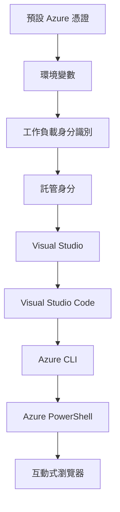

# AZD 基礎 - 認識 Azure Developer CLI

# AZD 基礎 - 核心概念與基礎知識

**章節導航：**
- **📚 課程首頁**: [AZD For Beginners](../../README.md)
- **📖 目前章節**: 第一章 - 基礎與快速上手
- **⬅️ 上一節**: [Course Overview](../../README.md#-chapter-1-foundation--quick-start)
- **➡️ 下一節**: [Installation & Setup](installation.md)
- **🚀 下一章**: [Chapter 2: AI-First Development](../chapter-02-ai-development/microsoft-foundry-integration.md)

## 介紹

本課程介紹 Azure Developer CLI (azd)，這是一個強大的指令列工具，可加速你從本機開發到 Azure 部署的流程。你將學習基本概念、核心功能，並了解 azd 如何簡化雲原生應用的部署。

## 學習目標

在本課結束時，你將能夠：
- 了解 Azure Developer CLI 是什麼以及它的主要目的
- 學習範本、環境與服務的核心概念
- 探索以範本為導向的開發與基礎設施即程式碼等重點功能
- 了解 azd 專案結構與工作流程
- 準備安裝並為你的開發環境設定 azd

## 學習成效

完成本課後，你將能夠：
- 解釋 azd 在現代雲端開發工作流程中的角色
- 辨識 azd 專案結構的元件
- 描述範本、環境與服務如何協同運作
- 理解使用 azd 的基礎設施即程式碼的好處
- 辨識不同 azd 指令及其用途

## 什麼是 Azure Developer CLI (azd)？

Azure Developer CLI (azd) 是一款指令列工具，旨在加速你從本機開發到 Azure 部署的旅程。它簡化了在 Azure 上建立、部署和管理雲原生應用的流程。

### 使用 azd 可以部署什麼？

azd 支援各式各樣的工作負載，而且支援的範圍持續擴大。今天，你可以用 azd 部署：

| Workload Type | Examples | Same Workflow? |
|---------------|----------|----------------|
| **Traditional applications** | Web apps, REST APIs, static sites | ✅ `azd up` |
| **Services and microservices** | Container Apps, Function Apps, multi-service backends | ✅ `azd up` |
| **AI-powered applications** | Chat apps with Microsoft Foundry Models, RAG solutions with AI Search | ✅ `azd up` |
| **Intelligent agents** | Foundry-hosted agents, multi-agent orchestrations | ✅ `azd up` |

關鍵重點是，無論你部署的是什麼，**azd 的生命週期都保持一致**。你會初始化專案、佈建基礎設施、部署程式碼、監控應用，並在需要時清理資源——不論是簡單的網站或是複雜的 AI 代理。

這種一致性是刻意設計的。azd 將 AI 能力視為應用可以使用的另一種服務，而不是根本不同的東西。從 azd 的角度來看，由 Microsoft Foundry Models 支持的聊天端點，只是另一個需要設定與部署的服務。

### 🎯 為什麼使用 AZD？一個真實世界的比較

讓我們比較部署一個帶資料庫的簡單網頁應用：

#### ❌ 沒有 AZD：手動 Azure 部署（30+ 分鐘）

```bash
# 步驟 1：建立資源群組
az group create --name myapp-rg --location eastus

# 步驟 2：建立 App Service 計劃
az appservice plan create --name myapp-plan \
  --resource-group myapp-rg \
  --sku B1 --is-linux

# 步驟 3：建立 Web 應用程式
az webapp create --name myapp-web-unique123 \
  --resource-group myapp-rg \
  --plan myapp-plan \
  --runtime "NODE:18-lts"

# 步驟 4：建立 Cosmos DB 帳戶（10-15 分鐘）
az cosmosdb create --name myapp-cosmos-unique123 \
  --resource-group myapp-rg \
  --kind MongoDB

# 步驟 5：建立資料庫
az cosmosdb mongodb database create \
  --account-name myapp-cosmos-unique123 \
  --resource-group myapp-rg \
  --name tododb

# 步驟 6：建立集合
az cosmosdb mongodb collection create \
  --account-name myapp-cosmos-unique123 \
  --resource-group myapp-rg \
  --database-name tododb \
  --name todos

# 步驟 7：取得連線字串
CONN_STR=$(az cosmosdb keys list \
  --name myapp-cosmos-unique123 \
  --resource-group myapp-rg \
  --type connection-strings \
  --query "connectionStrings[0].connectionString" -o tsv)

# 步驟 8：設定應用程式設定
az webapp config appsettings set \
  --name myapp-web-unique123 \
  --resource-group myapp-rg \
  --settings MONGODB_URI="$CONN_STR"

# 步驟 9：啟用記錄功能
az webapp log config --name myapp-web-unique123 \
  --resource-group myapp-rg \
  --application-logging filesystem \
  --detailed-error-messages true

# 步驟 10：設定 Application Insights
az monitor app-insights component create \
  --app myapp-insights \
  --location eastus \
  --resource-group myapp-rg

# 步驟 11：將 Application Insights 連結到 Web 應用程式
INSTRUMENTATION_KEY=$(az monitor app-insights component show \
  --app myapp-insights \
  --resource-group myapp-rg \
  --query "instrumentationKey" -o tsv)

az webapp config appsettings set \
  --name myapp-web-unique123 \
  --resource-group myapp-rg \
  --settings APPINSIGHTS_INSTRUMENTATIONKEY="$INSTRUMENTATION_KEY"

# 步驟 12：在本機建置應用程式
npm install
npm run build

# 步驟 13：建立部署套件
zip -r app.zip . -x "*.git*" "node_modules/*"

# 步驟 14：部署應用程式
az webapp deployment source config-zip \
  --resource-group myapp-rg \
  --name myapp-web-unique123 \
  --src app.zip

# 步驟 15：等候並祈禱它能正常運作 🙏
# （沒有自動驗證，需手動測試）
```

**問題：**
- ❌ 需要記住並依序執行 15+ 個指令
- ❌ 30–45 分鐘的手動作業
- ❌ 容易出錯（打字錯誤、參數錯誤）
- ❌ 連線字串會暴露在終端機歷史中
- ❌ 如果失敗沒有自動回滾
- ❌ 團隊成員難以重現
- ❌ 每次都不同（不可重現）

#### ✅ 使用 AZD：自動化部署（5 個指令，10–15 分鐘）

```bash
# 步驟 1：從範本初始化
azd init --template todo-nodejs-mongo

# 步驟 2：驗證身分
azd auth login

# 步驟 3：建立環境
azd env new dev

# 步驟 4：預覽變更（可選，但建議執行）
azd provision --preview

# 步驟 5：部署所有內容
azd up

# ✨ 完成！所有內容已部署、設定並受到監控
```

**優點：**
- ✅ **5 個指令** 對比 15+ 個手動步驟
- ✅ **10–15 分鐘** 總時間（大多在等待 Azure）
- ✅ <strong>較少人工錯誤</strong>——一致的範本驅動工作流程
- ✅ <strong>安全的祕密管理</strong>——許多範本使用 Azure 管理的祕密儲存
- ✅ <strong>可重複的部署</strong>——每次都使用相同的工作流程
- ✅ <strong>完全可重現</strong>——每次得到相同結果
- ✅ <strong>團隊就緒</strong>——任何人都可以用相同指令部署
- ✅ <strong>基礎設施即程式碼</strong>——Bicep 範本可受版本控制
- ✅ <strong>內建監控</strong>——自動設定 Application Insights

### 📊 時間與錯誤減少

| Metric | Manual Deployment | AZD Deployment | Improvement |
|:-------|:------------------|:---------------|:------------|
| **Commands** | 15+ | 5 | 67% fewer |
| **Time** | 30-45 min | 10-15 min | 60% faster |
| **Error Rate** | ~40% | <5% | 88% reduction |
| **Consistency** | Low (manual) | 100% (automated) | Perfect |
| **Team Onboarding** | 2-4 hours | 30 minutes | 75% faster |
| **Rollback Time** | 30+ min (manual) | 2 min (automated) | 93% faster |

## 核心概念

### 範本（Templates）
範本是 azd 的基礎。它們包含：
- <strong>應用程式程式碼</strong> - 你的原始程式碼與相依性
- <strong>基礎設施定義</strong> - 以 Bicep 或 Terraform 定義的 Azure 資源
- <strong>設定檔</strong> - 設定與環境變數
- <strong>部署腳本</strong> - 自動化部署工作流程

### 環境（Environments）
環境代表不同的部署目標：
- **Development（開發）** - 用於測試與開發
- **Staging（預發布）** - 預生產環境
- **Production（生產）** - 正式生產環境

每個環境會維護自己的：
- Azure 資源群組
- 設定值
- 部署狀態

### 服務（Services）
服務是應用的構建區塊：
- **前端（Frontend）** - Web 應用、單頁應用程式（SPA）
- **後端（Backend）** - API、微服務
- **資料庫（Database）** - 資料儲存解決方案
- **儲存（Storage）** - 檔案與 Blob 儲存

## 主要功能

### 1. 範本驅動開發
```bash
# 瀏覽可用的範本
azd template list

# 從範本初始化
azd init --template <template-name>
```

### 2. 基礎設施即程式碼
- **Bicep** - Azure 的領域特定語言
- **Terraform** - 跨雲的基礎設施工具
- **ARM Templates** - Azure Resource Manager 範本

### 3. 整合式工作流程
```bash
# 完整的部署工作流程
azd up            # 佈建 + 部署：首次設定時免手動操作

# 🧪 新功能：在部署前預覽基礎架構變更（安全）
azd provision --preview    # 模擬基礎架構的部署而不進行變更

azd provision     # 當你更新基礎架構時，使用此項建立 Azure 資源
azd deploy        # 部署應用程式程式碼，或在更新後重新部署應用程式程式碼
azd down          # 清理資源
```

#### 🛡️ 使用 Preview 安全規劃基礎設施
`azd provision --preview` 指令是安全部署的一大助力：
- <strong>預演分析</strong> - 顯示將被建立、修改或刪除的項目
- <strong>零風險</strong> - 不會對你的 Azure 環境做出實際更動
- <strong>團隊協作</strong> - 在部署前分享預演結果
- <strong>成本估算</strong> - 在承諾前了解資源成本

```bash
# 範例預覽工作流程
azd provision --preview           # 查看將會改變的內容
# 審查輸出，與團隊討論
azd provision                     # 放心套用變更
```

### 📊 視覺化：AZD 開發工作流程


**工作流程說明：**
1. **Init** - 從範本或新專案開始
2. **Auth** - 與 Azure 認證
3. **Environment** - 建立隔離的部署環境
4. **Preview** - 🆕 總是先預覽基礎設施變更（安全作法）
5. **Provision** - 建立/更新 Azure 資源
6. **Deploy** - 推送你的應用程式程式碼
7. **Monitor** - 觀察應用效能
8. **Iterate** - 進行變更並重新部署程式碼
9. **Cleanup** - 完成後移除資源

### 4. 環境管理
```bash
# 建立與管理環境
azd env new <environment-name>
azd env select <environment-name>
azd env list
```

### 5. 擴充與 AI 指令

azd 使用擴充系統來增加核心 CLI 之外的功能。這對 AI 工作負載特別有用：

```bash
# 列出可用的擴充功能
azd extension list

# 安裝 Foundry agents 擴充功能
azd extension install azure.ai.agents

# 從清單初始化 AI 代理專案
azd ai agent init -m agent-manifest.yaml

# 測試已部署的代理（顯示延遲與首次位元組時間）
azd ai agent invoke

# 啟動 MCP 伺服器以進行 AI 輔助開發（Alpha 版）
azd mcp start
```

**代理生命週期，端到端。** 一旦你安裝了 `azure.ai.agents`，單一工作流程即可帶你從概念到運行並受監控的代理。你不需要在第一天就掌握所有項目——只要知道它們存在即可：

| Stage | Command | What it does |
|-------|---------|--------------|
| **Scaffold** | `azd ai agent init -m <manifest>` | 從 manifest 生成代理專案 |
| **Test** | `azd ai agent invoke` | 呼叫代理並查看回應時間 |
| **Measure** | `azd ai agent eval generate` | 為代理建立評估資料集 |
| **Improve** | `azd ai agent optimize` | 根據你的資料優化代理指令 |
| **Inspect** | `azd ai agent endpoint show` | 檢視即時端點設定 |
| **Clean up** | `azd ai agent delete` | 刪除託管的代理及其所有版本 |

> 擴充功能的詳細內容收錄於 [Chapter 2: AI-First Development](../chapter-02-ai-development/agents.md) 與 [AZD AI CLI Commands](../chapter-08-production/production-ai-practices.md#azd-ai-cli-commands-and-extensions) 參考文件中。

## 📁 專案結構

典型的 azd 專案結構：
```
my-app/
├── .azd/                    # azd configuration
│   └── config.json
├── .azure/                  # Azure deployment artifacts
├── .devcontainer/          # Development container config
├── .github/workflows/      # GitHub Actions
├── .vscode/               # VS Code settings
├── infra/                 # Infrastructure code
│   ├── main.bicep        # Main infrastructure template
│   ├── main.parameters.json
│   └── modules/          # Reusable modules
├── src/                  # Application source code
│   ├── api/             # Backend services
│   └── web/             # Frontend application
├── azure.yaml           # azd project configuration
└── README.md
```

## 🔧 設定檔

### azure.yaml
主要的專案設定檔：
```yaml
name: my-awesome-app
metadata:
  template: my-template@1.0.0

services:
  web:
    project: ./src/web
    language: js
    host: appservice
  api:
    project: ./src/api
    language: js
    host: appservice

hooks:
  preprovision:
    shell: pwsh
    run: echo "Preparing to provision..."
```

### .azure/config.json
環境特定的設定：
```json
{
  "version": 1,
  "defaultEnvironment": "dev",
  "environments": {
    "dev": {
      "subscriptionId": "your-subscription-id",
      "location": "eastus"
    }
  }
}
```

## 🎪 常見工作流程與實作練習

> **💡 學習秘訣：** 按順序完成這些練習，以循序漸進建立你的 AZD 技能。

### 🎯 練習 1：初始化你的第一個專案

**目標：** 建立一個 AZD 專案並探索其結構

**步驟：**
```bash
# 使用已驗證的範本
azd init --template todo-nodejs-mongo

# 瀏覽產生的檔案
ls -la  # 檢視所有檔案（包括隱藏檔案）

# 建立的主要檔案：
# - azure.yaml（主要設定）
# - infra/（基礎設施程式碼）
# - src/（應用程式原始碼）
```

**✅ 成功條件：** 你應該有 azure.yaml、infra/ 與 src/ 目錄

---

### 🎯 練習 2：部署到 Azure

**目標：** 完成端到端部署

**步驟：**
```bash
# 1. 驗證身分
az login && azd auth login

# 2. 建立環境
azd env new dev
azd env set AZURE_LOCATION eastus

# 3. 預覽變更 (建議)
azd provision --preview

# 4. 部署所有內容
azd up

# 5. 驗證部署
azd show    # 6. 檢視您的應用程式網址
```

**預估時間：** 10-15 分鐘  
**✅ 成功條件：** 應用程式網址可在瀏覽器開啟

---

### 🎯 練習 3：多重環境

**目標：** 部署到 dev 與 staging

**步驟：**
```bash
# 已經有開發環境（dev），建立暫存環境（staging）
azd env new staging
azd env set AZURE_LOCATION westus2
azd up

# 在它們之間切換
azd env list
azd env select dev
```

**✅ 成功條件：** 在 Azure 入口網站中有兩個獨立的資源群組

---

### 🛡️ 清除一切：`azd down --force --purge`

當你需要完全重設時：

```bash
azd down --force --purge
```

**它會做什麼：**
- `--force`: 不顯示確認提示
- `--purge`: 刪除所有本機狀態與 Azure 資源

**何時使用：**
- 部署中途失敗
- 切換專案時
- 需要全新開始

---

## 🎪 原始工作流程參考

### 開始一個新專案
```bash
# 方法 1：使用現有範本
azd init --template todo-nodejs-mongo

# 方法 2：從頭開始
azd init

# 方法 3：使用當前目錄
azd init .
```

### 開發週期
```bash
# 設定開發環境
azd auth login
azd env new dev
azd env select dev

# 部署所有項目
azd up

# 進行變更並重新部署
azd deploy

# 完成後清理
azd down --force --purge # 此命令在 Azure Developer CLI 中會對您的環境執行 **硬重置**——在您排查部署失敗、清理遺留資源或準備進行全新部署時特別有用。
```

## 了解 `azd down --force --purge`
`azd down --force --purge` 指令是一個強而有力的方式，可完全拆除你的 azd 環境及所有相關資源。以下是各旗標的拆解說明：
```
--force
```
- 跳過確認提示。
- 適合自動化或腳本化場景，當人工輸入不方便時使用。
- 確保拆除程序不中斷，即使 CLI 偵測到不一致情況也會繼續進行。

```
--purge
```
刪除 <strong>所有相關的元資料</strong>，包括：
Environment state
Local `.azure` folder
Cached deployment info
Prevents azd from "remembering" previous deployments, which can cause issues like mismatched resource groups or stale registry references.

### 為什麼要兩者都用？
當你因為遺留狀態或部分部署而無法順利執行 `azd up` 時，這組合能確保一個 <strong>乾淨的起點</strong>。

當你在 Azure 入口網站中手動刪除資源，或在切換範本、環境或資源群組命名慣例時，這特別有幫助。

### 管理多重環境
```bash
# 建立暫存環境
azd env new staging
azd env select staging
azd up

# 切換回開發環境
azd env select dev

# 比較環境
azd env list
```

## 🔐 認證與憑證

了解認證對成功的 azd 部署至關重要。Azure 使用多種認證方法，azd 利用了其他 Azure 工具相同的憑證鏈。

### Azure CLI 認證（`az login`）

在使用 azd 之前，你需要先與 Azure 驗證。最常見的方法是使用 Azure CLI：

```bash
# 互動式登入（會開啟瀏覽器）
az login

# 使用特定租戶登入
az login --tenant <tenant-id>

# 使用服務主體登入
az login --service-principal -u <app-id> -p <password> --tenant <tenant-id>

# 檢查目前登入狀態
az account show

# 列出可用的訂閱
az account list --output table

# 設定預設訂閱
az account set --subscription <subscription-id>
```

### 認證流程
1. <strong>互動式登入</strong>：開啟預設瀏覽器進行驗證
2. <strong>裝置代碼流程</strong>：用於沒有瀏覽器存取的環境
3. **服務主體（Service Principal）**：用於自動化與 CI/CD 情境
4. **系統指派身分（Managed Identity）**：用於在 Azure 託管的應用程式

### DefaultAzureCredential 憑證鏈

`DefaultAzureCredential` 是一種憑證類型，透過自動依序嘗試多種憑證來源，提供簡化的認證體驗：

#### 憑證鏈順序


#### 1. 環境變數
```bash
# 為服務主體設定環境變數
export AZURE_CLIENT_ID="<app-id>"
export AZURE_CLIENT_SECRET="<password>"
export AZURE_TENANT_ID="<tenant-id>"
```

#### 2. Workload Identity（Kubernetes/GitHub Actions）
自動使用於：
- 在啟用 Workload Identity 的 Azure Kubernetes Service (AKS)
- 使用 OIDC 聯合的 GitHub Actions
- 其他聯合身份情境

#### 3. Managed Identity
適用於像是下列的 Azure 資源：
- Virtual Machines
- App Service
- Azure Functions
- Container Instances

```bash
# 檢查是否在具有託管身分識別的 Azure 資源上執行
az account show --query "user.type" --output tsv
# 如果使用託管身分識別，則回傳 "servicePrincipal"
```

#### 4. 開發工具整合
- **Visual Studio**：自動使用已登入的帳號
- **VS Code**：使用 Azure Account 延伸功能的憑證
- **Azure CLI**：使用 `az login` 的憑證（本機開發最常見）

### AZD 認證設定

```bash
# 方法 1：使用 Azure CLI（建議用於開發）
az login
azd auth login  # 使用現有的 Azure CLI 認證

# 方法 2：直接使用 azd 進行認證
azd auth login --use-device-code  # 適用於無頭環境

# 方法 3：檢查認證狀態
azd auth login --check-status

# 方法 4：登出並重新認證
azd auth logout
azd auth login
```

### 認證最佳實務

#### 本機開發用
```bash
# 1. 使用 Azure CLI 登入
az login

# 2. 確認正確的訂閱
az account show
az account set --subscription "Your Subscription Name"

# 3. 以現有認證使用 azd
azd auth login
```

#### 適用於 CI/CD 管道
```yaml
# GitHub Actions example
- name: Azure Login
  uses: azure/login@v1
  with:
    creds: ${{ secrets.AZURE_CREDENTIALS }}

- name: Deploy with azd
  run: |
    azd auth login --client-id ${{ secrets.AZURE_CLIENT_ID }} \
                    --client-secret ${{ secrets.AZURE_CLIENT_SECRET }} \
                    --tenant-id ${{ secrets.AZURE_TENANT_ID }}
    azd up --no-prompt
```

#### 適用於生產環境
- 執行於 Azure 資源上時，使用 <strong>托管識別</strong>
- 自動化情境請使用 <strong>服務主體</strong>
- 避免在程式碼或設定檔中儲存憑證
- 對於敏感設定使用 **Azure 金鑰保管庫**

### 常見的驗證問題與解決方法

#### 問題：「找不到訂閱」
```bash
# 解決方案：設定預設訂閱
az account list --output table
az account set --subscription "<subscription-id>"
azd env set AZURE_SUBSCRIPTION_ID "<subscription-id>"
```

#### 問題：「權限不足」
```bash
# 解決方案：檢查並指派所需的角色
az role assignment list --assignee $(az account show --query user.name --output tsv)

# 常見的必要角色：
# - Contributor (用於資源管理)
# - User Access Administrator (用於角色指派)
```

#### 問題：「存取權杖已過期」
```bash
# 解決方案：重新驗證
az logout
az login
azd auth logout
azd auth login
```

### 不同情境下的驗證

#### 本機開發
```bash
# 個人發展帳戶
az login
azd auth login
```

#### 團隊開發
```bash
# 為組織使用特定租戶
az login --tenant contoso.onmicrosoft.com
azd auth login
```

#### 多租戶情境
```bash
# 在租戶之間切換
az login --tenant tenant1.onmicrosoft.com
# 部署到租戶 1
azd up

az login --tenant tenant2.onmicrosoft.com  
# 部署到租戶 2
azd up
```

### 安全考量

1. <strong>憑證儲存</strong>：絕不在原始程式碼中儲存憑證
2. <strong>範圍限制</strong>：對服務主體採用最小權限原則
3. <strong>權杖輪換</strong>：定期輪換服務主體密鑰
4. <strong>稽核軌跡</strong>：監控驗證與部署活動
5. <strong>網路安全</strong>：盡可能使用私有端點

### 驗證故障排除

```bash
# 偵錯身分驗證問題
azd auth login --check-status
az account show
az account get-access-token

# 常用診斷指令
whoami                          # 目前使用者上下文
az ad signed-in-user show      # Microsoft Entra ID 使用者詳細資料
az group list                  # 測試資源存取權限
```

## 了解 `azd down --force --purge`

### 探索
```bash
azd template list              # 瀏覽範本
azd template show <template>   # 範本詳細資料
azd init --help               # 初始化選項
```

### 專案管理
```bash
azd show                     # 專案概覽
azd env list                # 可用環境與所選預設
azd config show            # 組態設定
```

### 監控
```bash
azd monitor                  # 開啟 Azure 入口網站的監控
azd monitor --logs           # 檢視應用程式日誌
azd monitor --live           # 檢視即時指標
azd pipeline config          # 設定 CI/CD
```

## 最佳實務

### 1. 使用具意義的名稱
```bash
# 良好
azd env new production-east
azd init --template web-app-secure

# 避免
azd env new env1
azd init --template template1
```

### 2. 利用範本
- 以現有範本開始
- 根據需求自訂
- 為組織建立可重用的範本

### 3. 環境隔離
- 為開發/測試/生產使用獨立環境
- 切勿從本機直接部署到生產環境
- 對生產部署使用 CI/CD 管線

### 4. 設定管理
- 對敏感資料使用環境變數
- 將設定保存在版本控制中
- 文件化環境特定設定

## 學習進程

### 初學者（第 1-2 週）
1. 安裝 azd 並完成驗證
2. 部署簡單範本
3. 了解專案結構
4. 學習基本指令（up、down、deploy）

### 進階（第 3-4 週）
1. 客製化範本
2. 管理多個環境
3. 了解基礎架構程式碼
4. 設定 CI/CD 管線

### 進階（第 5 週以上）
1. 建立自訂範本
2. 進階基礎架構模式
3. 多區域部署
4. 企業級組態

## 接下來的步驟

**📖 繼續第 1 章學習：**
- [安裝與設定](installation.md) - 安裝並設定 azd
- [你的第一個專案](first-project.md) - 完成實作教學
- [設定指南](configuration.md) - 進階設定選項

**🎯 準備好進入下一章了嗎？**
- [第 2 章：以 AI 為先的開發](../chapter-02-ai-development/microsoft-foundry-integration.md) - 開始建立 AI 應用

## 其他資源

- [Azure Developer CLI 概覽](https://learn.microsoft.com/en-us/azure/developer/azure-developer-cli/)
- [範本畫廊](https://azure.github.io/awesome-azd/)
- [社群範例](https://github.com/Azure-Samples)

---

## 🙋 常見問題

### 一般問題

**Q: AZD 與 Azure CLI 有何不同？**

A: Azure CLI (`az`) 用於管理單一的 Azure 資源。AZD (`azd`) 用於管理整個應用程式：

```bash
# Azure CLI - 低階資源管理
az webapp create --name myapp --resource-group rg
az sql server create --name myserver --resource-group rg
# ...還需要更多指令

# AZD - 應用程式層級管理
azd up  # 部署整個應用程式及其所有資源
```

**可以這麼想：**
- `az` = 對單顆樂高積木操作
- `azd` = 處理完整的樂高套組

---

**Q: 使用 AZD 是否需要了解 Bicep 或 Terraform？**

A: 不需要！從範本開始：
```bash
# 使用現有範本 - 不需要 IaC 知識
azd init --template todo-nodejs-mongo
azd up
```

你可以之後再學 Bicep 來客製化基礎設施。範本提供可供學習的實作範例。

---

**Q: 執行 AZD 範本需要多少費用？**

A: 費用依範本而異。大多數開發用範本約為每月 $50-150：

```bash
# 在部署前預覽成本
azd provision --preview

# 不使用時請務必清理
azd down --force --purge  # 移除所有資源
```

**專業提示：** 在可用時使用免費額度：
- App Service：F1（免費）等級
- Microsoft Foundry Models：Azure OpenAI 每月 50,000 代幣免費
- Cosmos DB：1000 RU/s 免費額度

---

**Q: 我可以在現有的 Azure 資源上使用 AZD 嗎？**

A: 可以，但從新的開始通常比較容易。當 AZD 管理完整生命週期時效果最佳。針對現有資源：

```bash
# 選項 1：匯入現有資源（進階）
azd init
# 接著修改 infra/ 以參照現有資源

# 選項 2：從頭開始（建議）
azd init --template matching-your-stack
azd up  # 建立新環境
```

---

**Q: 我如何將專案與隊友分享？**

A: 將 AZD 專案提交到 Git（但不要提交 .azure 資料夾）：

```bash
# 預設已包含於 .gitignore 中
.azure/        # 包含機密與環境資料
*.env          # 環境變數

# 當時的團隊成員：
git clone <your-repo>
azd auth login
azd env new <their-name>-dev
azd up
```

每個人都會從相同的範本獲得一致的基礎設施。

---

### 疑難排解問題

**Q: "azd up" 中途失敗。我該怎麼辦？**

A: 檢查錯誤、修正，然後重試：

```bash
# 查看詳細日誌
azd show

# 常見修正：

# 1. 若超過配額：
azd env set AZURE_LOCATION "westus2"  # 嘗試不同區域

# 2. 若資源名稱衝突：
azd down --force --purge  # 清空
azd up  # 重試

# 3. 若驗證已過期：
az login
azd auth login
azd up
```

**最常見的問題：** 選錯 Azure 訂閱
```bash
az account list --output table
az account set --subscription "<correct-subscription>"
```

---

**Q: 如何僅部署程式碼變更而不重新佈建？**

A: 使用 `azd deploy` 而不是 `azd up`：

```bash
azd up          # 第一次: 佈建 + 部署 (較慢)

# 修改程式碼...

azd deploy      # 後續: 僅部署 (較快)
```

速度比較：
- `azd up`：10-15 分鐘（佈建基礎設施）
- `azd deploy`：2-5 分鐘（僅程式碼）

---

**Q: 我可以自訂基礎設施範本嗎？**

A: 可以！編輯 `infra/` 中的 Bicep 檔案：

```bash
# 在執行 azd init 之後
cd infra/
code main.bicep  # 在 VS Code 中編輯

# 預覽變更
azd provision --preview

# 套用變更
azd provision
```

**提示：** 從小處開始 — 先變更 SKU：
```bicep
// infra/main.bicep
sku: {
  name: 'B1'  // Change to 'P1V2' for production
}
```

---

**Q: 如何刪除 AZD 建立的所有資源？**

A: 一個指令即可移除所有資源：

```bash
azd down --force --purge

# 這會刪除：
# - 所有 Azure 資源
# - 資源群組
# - 本機環境狀態
# - 快取的部署資料
```

**在以下情況務必執行：**
- 測試完範本後
- 切換到不同專案時
- 想要重新開始時

**省費提示：** 刪除未使用的資源 = $0 費用

---

**Q: 如果我在 Azure 入口網站不小心刪除了資源，怎麼辦？**

A: AZD 的狀態可能會不同步。採用重置方式：

```bash
# 1. 刪除本地狀態
azd down --force --purge

# 2. 從頭開始
azd up

# 替代方案：讓 AZD 偵測並修復
azd provision  # 會建立缺少的資源
```

---

### 進階問題

**Q: 我可以在 CI/CD 管線中使用 AZD 嗎？**

A: 可以！以下為 GitHub Actions 範例：

```yaml
# .github/workflows/deploy.yml
name: Deploy with AZD

on:
  push:
    branches: [main]

jobs:
  deploy:
    runs-on: ubuntu-latest
    steps:
      - uses: actions/checkout@v2
      
      - name: Install azd
        run: curl -fsSL https://aka.ms/install-azd.sh | bash
      
      - name: Azure Login
        run: |
          azd auth login \
            --client-id ${{ secrets.AZURE_CLIENT_ID }} \
            --client-secret ${{ secrets.AZURE_CLIENT_SECRET }} \
            --tenant-id ${{ secrets.AZURE_TENANT_ID }}
      
      - name: Deploy
        run: azd up --no-prompt
```

---

**Q: 我該如何處理祕密與敏感資料？**

A: AZD 會自動整合 Azure Key Vault：

```bash
# 機密儲存在 Key Vault，而不是程式碼中
azd env set DATABASE_PASSWORD "$(openssl rand -base64 32)"

# AZD 會自動:
# 1. 建立 Key Vault
# 2. 儲存機密
# 3. 透過 Managed Identity 授予應用程式存取權限
# 4. 在執行時注入
```

**切勿提交：**
- `.azure/` 資料夾（包含環境資料）
- `.env` 檔案（本機祕密）
- 連線字串

---

**Q: 我可以部署到多個區域嗎？**

A: 可以，為每個區域建立環境：

```bash
# 美國東部環境
azd env new prod-eastus
azd env set AZURE_LOCATION eastus
azd up

# 西歐環境
azd env new prod-westeurope
azd env set AZURE_LOCATION westeurope
azd up

# 每個環境彼此獨立
azd env list
```

對於真正的多區域應用，請自訂 Bicep 範本以同時部署到多個區域。

---

**Q: 假如卡住了，我可以在哪裡尋求協助？**

1. **AZD 文件：** https://learn.microsoft.com/azure/developer/azure-developer-cli/
2. **GitHub Issues：** https://github.com/Azure/azure-dev/issues
3. **Discord：** [Azure Discord](https://discord.gg/microsoft-azure) - #azure-developer-cli 頻道
4. **Stack Overflow：** 標籤 `azure-developer-cli`
5. **本課程：** [疑難排解指南](../chapter-07-troubleshooting/common-issues.md)

**專家建議：** 在求助前，執行：
```bash
azd show       # 顯示目前狀態
azd version    # 顯示您的版本
```
請在提問時提供這些資訊以加快獲得協助。

---

## 🎓 接下來做什麼？

你現在已了解 AZD 的基礎。選擇你的路徑：

### 🎯 適合初學者：
1. **下一步：** [安裝與設定](installation.md) - 在你的機器上安裝 AZD
2. **接著：** [你的第一個專案](first-project.md) - 部署你的第一個應用程式
3. **練習：** 完成本課的所有 3 個練習

### 🚀 適合 AI 開發者：
1. **前往：** [第 2 章：以 AI 為先的開發](../chapter-02-ai-development/microsoft-foundry-integration.md)
2. **部署：** 從 `azd init --template get-started-with-ai-chat` 開始
3. **學習：** 一邊部署一邊學習

### 🏗️ 適合資深開發者：
1. **檢視：** [設定指南](configuration.md) - 進階設定
2. **探索：** [基礎架構即程式碼](../chapter-04-infrastructure/provisioning.md) - Bicep 深入解析
3. **建置：** 為你的堆疊建立自訂範本

---

**章節導覽：**
- **📚 課程首頁**： [AZD 初學者](../../README.md)
- **📖 目前章節**：第 1 章 - 基礎與快速入門  
- **⬅️ 上一章**： [課程總覽](../../README.md#-chapter-1-foundation--quick-start)
- **➡️ 下一章**： [安裝與設定](installation.md)
- **🚀 下一章**： [第 2 章：以 AI 為先的開發](../chapter-02-ai-development/microsoft-foundry-integration.md)

---

<!-- CO-OP TRANSLATOR DISCLAIMER START -->
**免責聲明**：
此文件已使用 AI 翻譯服務 [Co-op Translator](https://github.com/Azure/co-op-translator) 進行翻譯。雖然我們努力追求準確性，但請注意自動翻譯可能包含錯誤或不準確之處。原始文件的母語版本應視為權威來源。對於關鍵資訊，建議採用專業人工翻譯。我們不對因使用此翻譯所產生的任何誤解或誤譯承擔責任。
<!-- CO-OP TRANSLATOR DISCLAIMER END -->