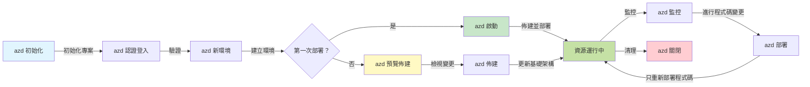
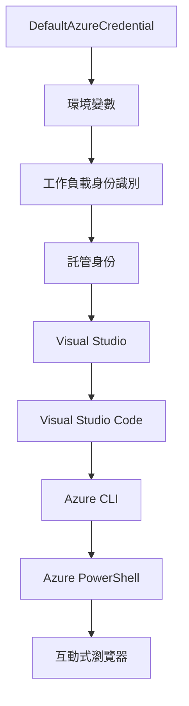

# AZD 基礎 - 了解 Azure Developer CLI

# AZD 基礎 - 核心概念與基本原理

**章節導航：**
- **📚 課程首頁**: [AZD 新手指南](../../README.md)
- **📖 當前章節**: 第1章 - 基礎與快速入門
- **⬅️ 上一頁**: [課程總覽](../../README.md#-chapter-1-foundation--quick-start)
- **➡️ 下一頁**: [安裝與設定](installation.md)
- **🚀 下一章**: [第2章：AI優先開發](../chapter-02-ai-development/microsoft-foundry-integration.md)

## 介紹

本課程向您介紹 Azure Developer CLI（azd），這是一款強大的命令列工具，加速您從本地開發到 Azure 部署的旅程。您將了解基本概念、核心功能，並理解 azd 如何簡化本地原生雲端應用程式的部署。

## 學習目標

完成本課程後，您將能夠：
- 了解 Azure Developer CLI 是什麼及其主要用途
- 掌握範本、環境與服務的核心概念
- 探索包含範本驅動開發和基礎設施即代碼等關鍵功能
- 理解 azd 專案結構與工作流程
- 準備安裝並配置 azd 以用於您的開發環境

## 學習成效

完成本課程後，您可以：
- 解釋 azd 在現代雲端開發工作流程中的角色
- 識別 azd 專案結構的組成元件
- 描述範本、環境與服務如何協同運作
- 了解 azd 使用基礎設施即代碼的優勢
- 辨識不同 azd 指令及其用途

## 什麼是 Azure Developer CLI（azd）？

Azure Developer CLI（azd）是一款命令列工具，旨在加速您從本地開發到 Azure 部署的流程。它簡化在 Azure 上建立、部署與管理本地原生雲端應用程式的過程。

### azd 可以部署什麼？

azd 支援多種工作負載，且清單持續擴增。如今，您可以使用 azd 部署：

| 工作負載類型 | 範例 | 同工作流程？ |
|---------------|----------|----------------|
| <strong>傳統應用程式</strong> | 網頁應用、REST API、靜態網站 | ✅ `azd up` |
| <strong>服務與微服務</strong> | 容器應用、函數應用、多服務後端 | ✅ `azd up` |
| **AI 驅動應用** | 使用 Microsoft Foundry 模型的聊天應用，以 AI 搜尋的 RAG 解決方案 | ✅ `azd up` |
| <strong>智慧代理</strong> | Foundry 託管代理、多代理協調 | ✅ `azd up` |

核心洞察是，**不論您部署的是什麼，azd 生命週期都保持不變**。您初始化專案、佈建基礎設施、部署程式碼、監控應用並清理資源：無論是簡單網站或複雜 AI 代理，都一樣。

此連續性是設計上的考量。azd 將 AI 能力視為應用程式可用的另一項服務，並非根本不同。從 azd 角度看，由 Microsoft Foundry 模型支援的聊天端點，只是另一項要配置與部署的服務。

### 🎯 為什麼使用 AZD？實際案例比較

比較部署簡單網頁應用與資料庫：

#### ❌ 未使用 AZD：手動 Azure 部署（30 分鐘以上）

```bash
# 步驟 1：建立資源群組
az group create --name myapp-rg --location eastus

# 步驟 2：建立應用服務方案
az appservice plan create --name myapp-plan \
  --resource-group myapp-rg \
  --sku B1 --is-linux

# 步驟 3：建立網頁應用程式
az webapp create --name myapp-web-unique123 \
  --resource-group myapp-rg \
  --plan myapp-plan \
  --runtime "NODE:18-lts"

# 步驟 4：建立 Cosmos DB 帳戶（10-15 分鐘）
az cosmosdb create --name myapp-cosmos-unique123 \
  --resource-group myapp-rg \
  --kind MongoDB

# 步驟 5：建立資料庫
az cosmosdb mongodb database create \
  --account-name myapp-cosmos-unique123 \
  --resource-group myapp-rg \
  --name tododb

# 步驟 6：建立集合
az cosmosdb mongodb collection create \
  --account-name myapp-cosmos-unique123 \
  --resource-group myapp-rg \
  --database-name tododb \
  --name todos

# 步驟 7：取得連接字串
CONN_STR=$(az cosmosdb keys list \
  --name myapp-cosmos-unique123 \
  --resource-group myapp-rg \
  --type connection-strings \
  --query "connectionStrings[0].connectionString" -o tsv)

# 步驟 8：設定應用程式設定
az webapp config appsettings set \
  --name myapp-web-unique123 \
  --resource-group myapp-rg \
  --settings MONGODB_URI="$CONN_STR"

# 步驟 9：啟用記錄功能
az webapp log config --name myapp-web-unique123 \
  --resource-group myapp-rg \
  --application-logging filesystem \
  --detailed-error-messages true

# 步驟 10：設定 Application Insights
az monitor app-insights component create \
  --app myapp-insights \
  --location eastus \
  --resource-group myapp-rg

# 步驟 11：將 App Insights 連結至網頁應用程式
INSTRUMENTATION_KEY=$(az monitor app-insights component show \
  --app myapp-insights \
  --resource-group myapp-rg \
  --query "instrumentationKey" -o tsv)

az webapp config appsettings set \
  --name myapp-web-unique123 \
  --resource-group myapp-rg \
  --settings APPINSIGHTS_INSTRUMENTATIONKEY="$INSTRUMENTATION_KEY"

# 步驟 12：本機建置應用程式
npm install
npm run build

# 步驟 13：建立部署套件
zip -r app.zip . -x "*.git*" "node_modules/*"

# 步驟 14：部署應用程式
az webapp deployment source config-zip \
  --resource-group myapp-rg \
  --name myapp-web-unique123 \
  --src app.zip

# 步驟 15：等待並祈禱它能運行 🙏
# （無自動驗證，需手動測試）
```

**問題：**
- ❌ 需記住並按順序執行 15 多個指令
- ❌ 30-45 分鐘人工作業
- ❌ 易出錯（打字錯誤、參數錯誤）
- ❌ 連線字串暴露於終端機歷史記錄
- ❌ 失敗無自動回滾
- ❌ 不易給團隊複製
- ❌ 每次都不同（無法重現）

#### ✅ 使用 AZD：自動化部署（5 個指令，10-15 分鐘）

```bash
# 步驟 1：從範本初始化
azd init --template todo-nodejs-mongo

# 步驟 2：驗證身份
azd auth login

# 步驟 3：建立環境
azd env new dev

# 步驟 4：預覽更改（可選但建議執行）
azd provision --preview

# 步驟 5：部署所有項目
azd up

# ✨ 完成！所有項目均已部署、配置並監控中
```

**優點：**
- ✅ **5 個指令** 對比 15 多個手動步驟
- ✅ **10-15 分鐘** 總時間 (主要等待 Azure)
- ✅ <strong>減少人為錯誤</strong> - 一致性、範本驅動工作流程
- ✅ <strong>安全的密碼處理</strong> - 許多範本使用 Azure 管理的密鑰存放
- ✅ <strong>重複可用的部署</strong> - 每次相同流程
- ✅ <strong>完全可重現</strong> - 每次結果一致
- ✅ <strong>團隊友好</strong> - 任何人都能用相同指令部署
- ✅ <strong>基礎設施即程式碼</strong> - 版本控制的 Bicep 範本
- ✅ <strong>內建監控</strong> - 自動配置 Application Insights

### 📊 時間與錯誤率降低

| 指標 | 手動部署 | AZD 部署 | 改善幅度 |
|:-------|:------------------|:---------------|:------------|
| <strong>指令數</strong> | 15+ | 5 | 減少 67% |
| <strong>時間</strong> | 30-45 分鐘 | 10-15 分鐘 | 快 60% |
| <strong>錯誤率</strong> | 約 40% | <5% | 降低 88% |
| <strong>一致性</strong> | 低（手動） | 100%（自動） | 完美 |
| <strong>團隊上手時間</strong> | 2-4 小時 | 30 分鐘 | 快 75% |
| <strong>回滾時間</strong> | 30+ 分鐘（手動） | 2 分鐘（自動） | 快 93% |

## 核心概念

### 範本
範本是 azd 的基礎。它們包含：
- <strong>應用程式程式碼</strong> - 您的原始程式碼及依賴項
- <strong>基礎設施定義</strong> - 以 Bicep 或 Terraform 定義的 Azure 資源
- <strong>設定檔</strong> - 設定與環境變數
- <strong>部署腳本</strong> - 自動化部署工作流程

### 環境
環境代表不同部署目標：
- <strong>開發</strong> - 用於測試與開發
- <strong>預備</strong> - 預生產環境
- <strong>正式</strong> - 實際生產環境

每個環境維護獨立的：
- Azure 資源群組
- 配置設定
- 部署狀態

### 服務
服務是應用程式的建構模組：
- <strong>前端</strong> - 網頁應用、單頁應用（SPA）
- <strong>後端</strong> - API、微服務
- <strong>資料庫</strong> - 資料儲存解決方案
- <strong>儲存</strong> - 檔案與 Blob 儲存

## 主要功能

### 1. 範本驅動開發
```bash
# 查看可用範本
azd template list

# 從範本初始化
azd init --template <template-name>
```

### 2. 基礎設施即程式碼
- **Bicep** - Azure 的領域專用語言
- **Terraform** - 多雲基礎設施工具
- **ARM 範本** - Azure 資源管理器範本

### 3. 整合式工作流程
```bash
# 完整部署工作流程
azd up            # 配置 + 部署，這是初次設置的全自動過程

# 🧪 新增：部署前預覽基礎架構變更（安全）
azd provision --preview    # 模擬基礎架構部署而不進行變更

azd provision     # 若有更新基礎架構，使用此建立 Azure 資源
azd deploy        # 部署應用程式碼或在更新後重新部署應用程式碼
azd down          # 清理資源
```

#### 🛡️ 使用 Preview 確保安全的基礎設施規劃
`azd provision --preview` 指令改變部署遊戲規則：
- <strong>模擬執行分析</strong> - 顯示將被建立、修改或刪除的內容
- <strong>零風險</strong> - 不會對 Azure 環境做任何實際更改
- <strong>團隊協作</strong> - 部署前分享預覽結果
- <strong>成本估算</strong> - 先理解資源成本再承諾

```bash
# 範例預覽工作流程
azd provision --preview           # 查看將會改變的內容
# 審查輸出，與團隊討論
azd provision                     # 充滿信心地應用更改
```

### 📊 圖示：AZD 開發工作流程


**工作流程說明：**
1. <strong>初始化</strong> - 使用範本或新專案開始
2. <strong>認證</strong> - 進行 Azure 身分認證
3. <strong>環境建立</strong> - 創建獨立部署環境
4. <strong>預覽</strong> - 🆕 永遠先預覽基礎設施變更（安全做法）
5. <strong>佈建</strong> - 創建或更新 Azure 資源
6. <strong>部署</strong> - 上傳應用程式程式碼
7. <strong>監控</strong> - 觀察應用表現
8. <strong>迭代</strong> - 變更並重新部署程式碼
9. <strong>清理</strong> - 使用完畢後移除資源

### 4. 環境管理
```bash
# 建立和管理環境
azd env new <environment-name>
azd env select <environment-name>
azd env list
```

### 5. 擴充與 AI 指令

azd 採用擴充系統，為核心 CLI 增加功能。此方式對 AI 工作負載特別有用：

```bash
# 列出可用的擴充功能
azd extension list

# 安裝 Foundry 代理擴充功能
azd extension install azure.ai.agents

# 從清單初始化 AI 代理專案
azd ai agent init -m agent-manifest.yaml

# 啟動 MCP 伺服器以支援 AI 輔助開發（Alpha 版本）
azd mcp start
```

> 擴充內容詳解見 [第2章：AI優先開發](../chapter-02-ai-development/agents.md) 與 [AZD AI CLI 指令](../chapter-08-production/production-ai-practices.md#azd-ai-cli-commands-and-extensions) 參考資料。

## 📁 專案結構

典型 azd 專案結構：
```
my-app/
├── .azd/                    # azd configuration
│   └── config.json
├── .azure/                  # Azure deployment artifacts
├── .devcontainer/          # Development container config
├── .github/workflows/      # GitHub Actions
├── .vscode/               # VS Code settings
├── infra/                 # Infrastructure code
│   ├── main.bicep        # Main infrastructure template
│   ├── main.parameters.json
│   └── modules/          # Reusable modules
├── src/                  # Application source code
│   ├── api/             # Backend services
│   └── web/             # Frontend application
├── azure.yaml           # azd project configuration
└── README.md
```

## 🔧 配置檔案

### azure.yaml
主要專案配置檔：
```yaml
name: my-awesome-app
metadata:
  template: my-template@1.0.0

services:
  web:
    project: ./src/web
    language: js
    host: appservice
  api:
    project: ./src/api
    language: js
    host: appservice

hooks:
  preprovision:
    shell: pwsh
    run: echo "Preparing to provision..."
```

### .azure/config.json
環境專用配置：
```json
{
  "version": 1,
  "defaultEnvironment": "dev",
  "environments": {
    "dev": {
      "subscriptionId": "your-subscription-id",
      "location": "eastus"
    }
  }
}
```

## 🎪 常見工作流程與實作練習

> **💡 學習提示：** 按順序完成這些練習，逐步提升您的 AZD 技能。

### 🎯 練習 1：初始化您的第一個專案

**目標：** 建立 AZD 專案並探索其結構

**步驟：**
```bash
# 使用已驗證的範本
azd init --template todo-nodejs-mongo

# 探索產生的檔案
ls -la  # 查看包含隱藏檔案的所有檔案

# 建立的主要檔案：
# - azure.yaml（主要設定）
# - infra/（基礎架構程式碼）
# - src/（應用程式程式碼）
```

**✅ 成功標誌：** 有 azure.yaml、infra/ 與 src/ 目錄

---

### 🎯 練習 2：部署到 Azure

**目標：** 完成端到端部署

**步驟：**
```bash
# 1. 身份驗證
az login && azd auth login

# 2. 建立環境
azd env new dev
azd env set AZURE_LOCATION eastus

# 3. 預覽變更（建議）
azd provision --preview

# 4. 部署所有內容
azd up

# 5. 驗證部署
azd show    # 查看您的應用程式 URL
```

**預期時間：** 10-15 分鐘  
**✅ 成功標誌：** 應用 URL 在瀏覽器開啟

---

### 🎯 練習 3：多環境部署

**目標：** 部署到 dev 與 staging 環境

**步驟：**
```bash
# 已經有開發環境，建立測試環境
azd env new staging
azd env set AZURE_LOCATION westus2
azd up

# 在它們之間切換
azd env list
azd env select dev
```

**✅ 成功標誌：** Azure 入口網站中有兩個獨立資源群組

---

### 🛡️ 清空環境：`azd down --force --purge`

需要完全重置時：

```bash
azd down --force --purge
```

**作用：**
- `--force`：不提示確認
- `--purge`：刪除所有本地狀態與 Azure 資源

**使用時機：**
- 部署中途失敗
- 更換專案
- 需要全新開始

---

## 🎪 原始工作流程參考

### 新專案啟動
```bash
# 方法一：使用現有模板
azd init --template todo-nodejs-mongo

# 方法二：從零開始
azd init

# 方法三：使用當前目錄
azd init .
```

### 開發週期
```bash
# 設定開發環境
azd auth login
azd env new dev
azd env select dev

# 部署所有項目
azd up

# 進行更改並重新部署
azd deploy

# 完成後清理
azd down --force --purge # Azure Developer CLI 中的命令是對您的環境進行**硬重置**——特別適用於當您在排解部署失敗、清理孤立資源或準備重新部署時。
```

## 了解 `azd down --force --purge`
`azd down --force --purge` 指令能徹底拆除您的 azd 環境與所有相關資源。以下是每個參數的說明：
```
--force
```
- 跳過確認提示。
- 適用於自動化或無法手動輸入的腳本。
- 即使 CLI 偵測到不一致也確保流程不中斷。

```
--purge
```
刪除 <strong>所有相關元資料</strong>，包括：
環境狀態
本地 `.azure` 資料夾
快取的部署資訊
防止 azd “記住” 先前部署，避免資源群組錯配或註冊機制失效。

### 為什麼要同時使用？
當 `azd up` 因殘留狀態或部分部署卡住時，此組合確保 <strong>完全清除</strong>。

特別適用於 Azure 入口網站手動刪除資源後，或切換範本、環境、資源群組命名慣例時。

### 管理多環境
```bash
# 建立暫存環境
azd env new staging
azd env select staging
azd up

# 切換回開發環境
azd env select dev

# 比較環境
azd env list
```

## 🔐 認證與憑證

了解認證對成功使用 azd 部署至關重要。Azure 採用多種認證方式，azd 利用與其他 Azure 工具相同的憑證鏈。

### Azure CLI 認證（`az login`）

使用 azd 前，您需先認證 Azure。最普遍方式是透過 Azure CLI：

```bash
# 互動式登入（開啟瀏覽器）
az login

# 使用特定租戶登入
az login --tenant <tenant-id>

# 使用服務主體登入
az login --service-principal -u <app-id> -p <password> --tenant <tenant-id>

# 檢查目前登入狀態
az account show

# 列出可用的訂閱
az account list --output table

# 設定預設訂閱
az account set --subscription <subscription-id>
```

### 認證流程
1. <strong>互動式登入</strong>：於預設瀏覽器中開啟認證頁面
2. <strong>裝置碼流程</strong>：適用無瀏覽器環境
3. <strong>服務主體</strong>：自動化與 CI/CD 場景
4. <strong>託管身分識別</strong>：Azure 託管應用使用

### DefaultAzureCredential 鏈條

`DefaultAzureCredential` 是一種簡化認證體驗的憑證類型，會依序嘗試多個憑證來源：

#### 憑證鏈順序

#### 1. 環境變數
```bash
# 設定服務主體的環境變數
export AZURE_CLIENT_ID="<app-id>"
export AZURE_CLIENT_SECRET="<password>"
export AZURE_TENANT_ID="<tenant-id>"
```

#### 2. 工作負載身份（Kubernetes/GitHub Actions）
自動用於：
- 具工作負載身份的 Azure Kubernetes Service (AKS)
- 使用 OIDC 聯邦的 GitHub Actions
- 其他聯邦身份場景

#### 3. 託管身分識別
用於 Azure 資源例如：
- 虛擬機器
- 應用服務
- Azure Functions
- 容器實例

```bash
# 檢查是否在具有管理識別的 Azure 資源上執行
az account show --query "user.type" --output tsv
# 返回: 若使用管理識別則回傳 "servicePrincipal"
```

#### 4. 開發工具整合
- **Visual Studio**：自動使用登入帳戶
- **VS Code**：使用 Azure Account 擴充程式憑證
- **Azure CLI**：使用 `az login` 憑證（本地開發最常用）

### AZD 認證設定

```bash
# 方法 1：使用 Azure CLI（建議用於開發）
az login
azd auth login  # 使用現有的 Azure CLI 憑證

# 方法 2：直接使用 azd 認證
azd auth login --use-device-code  # 適用於無頭環境

# 方法 3：檢查認證狀態
azd auth login --check-status

# 方法 4：登出並重新認證
azd auth logout
azd auth login
```

### 認證最佳做法

#### 本地開發
```bash
# 1. 使用 Azure CLI 登入
az login

# 2. 驗證正確的訂閱
az account show
az account set --subscription "Your Subscription Name"

# 3. 使用 azd 和現有的憑證
azd auth login
```

#### CI/CD 管線
```yaml
# GitHub Actions example
- name: Azure Login
  uses: azure/login@v1
  with:
    creds: ${{ secrets.AZURE_CREDENTIALS }}

- name: Deploy with azd
  run: |
    azd auth login --client-id ${{ secrets.AZURE_CLIENT_ID }} \
                    --client-secret ${{ secrets.AZURE_CLIENT_SECRET }} \
                    --tenant-id ${{ secrets.AZURE_TENANT_ID }}
    azd up --no-prompt
```

#### 正式環境
- Azure 資源上運行時，使用 <strong>託管身分識別</strong>
- 自動化場景使用 <strong>服務主體</strong>
- 避免將憑證存入程式碼或設定檔
- 重要設定採用 **Azure Key Vault**

### 常見認證問題與解決方案

#### 問題：「找不到訂閱」
```bash
# 解決方案：設定預設訂閱
az account list --output table
az account set --subscription "<subscription-id>"
azd env set AZURE_SUBSCRIPTION_ID "<subscription-id>"
```

#### 問題：「權限不足」
```bash
# 解決方案：檢查並分配所需的角色
az role assignment list --assignee $(az account show --query user.name --output tsv)

# 常見的必需角色：
# - 參與者（用於資源管理）
# - 使用者存取管理員（用於角色指派）
```

#### 問題：「權杖過期」
```bash
# 解決方案：重新驗證身份
az logout
az login
azd auth logout
azd auth login
```

### 不同場景下的認證

#### 本地開發
```bash
# 個人發展帳戶
az login
azd auth login
```

#### 團隊開發
```bash
# 對組織使用特定租戶
az login --tenant contoso.onmicrosoft.com
azd auth login
```

#### 多租戶場景
```bash
# 切換租戶
az login --tenant tenant1.onmicrosoft.com
# 部署到租戶 1
azd up

az login --tenant tenant2.onmicrosoft.com  
# 部署到租戶 2
azd up
```

### 安全性考量
1. <strong>憑證存儲</strong>：切勿將憑證存放於原始碼中  
2. <strong>範圍限制</strong>：對服務主體使用最小權限原則  
3. <strong>令牌輪替</strong>：定期輪替服務主體密鑰  
4. <strong>審計追蹤</strong>：監控身份驗證和部署活動  
5. <strong>網路安全</strong>：盡可能使用私人端點  

### 身份驗證疑難排解

```bash
# 偵錯身份驗證問題
azd auth login --check-status
az account show
az account get-access-token

# 常用診斷指令
whoami                          # 目前使用者上下文
az ad signed-in-user show      # Azure AD 使用者詳細資料
az group list                  # 測試資源存取
```
  
## 了解 `azd down --force --purge`

### 探索  
```bash
azd template list              # 瀏覽範本
azd template show <template>   # 範本詳細資料
azd init --help               # 初始化選項
```
  
### 專案管理  
```bash
azd show                     # 專案概覽
azd env list                # 可用環境及預設選擇
azd config show            # 配置設定
```
  
### 監控  
```bash
azd monitor                  # 開啟 Azure 入口網站監控
azd monitor --logs           # 檢視應用程式日誌
azd monitor --live           # 檢視即時指標
azd pipeline config          # 設定 CI/CD
```
  
## 最佳實踐

### 1. 使用有意義的名稱  
```bash
# 好的
azd env new production-east
azd init --template web-app-secure

# 避免
azd env new env1
azd init --template template1
```
  
### 2. 利用範本  
- 從現有範本開始  
- 根據需求進行客製化  
- 為組織建立可重用範本  

### 3. 環境隔離  
- 為開發、測試、正式環境使用不同環境  
- 絕不直接從本機部署到生產環境  
- 生產部署使用 CI/CD 管線  

### 4. 設定管理  
- 使用環境變數儲存敏感資料  
- 將配置保存在版本控制中  
- 記錄各環境特定設定  

## 學習進度

### 初學者 (第 1-2 週)  
1. 安裝 azd 並驗證身份  
2. 部署簡單範本  
3. 了解專案結構  
4. 學習基本指令（up、down、deploy）  

### 中階 (第 3-4 週)  
1. 客製化範本  
2. 管理多環境  
3. 理解基礎設施代碼  
4. 建置 CI/CD 管線  

### 進階 (第 5 週以上)  
1. 創建自訂範本  
2. 進階基礎架構模式  
3. 多區域部署  
4. 企業級配置  

## 下一步

**📖 繼續第 1 章學習：**  
- [安裝與設定](installation.md) - 安裝並設定 azd  
- [您的第一個專案](first-project.md) - 實作教學  
- [設定指南](configuration.md) - 進階設定選項  

**🎯 準備好下一章了嗎？**  
- [第 2 章：AI 為先的開發](../chapter-02-ai-development/microsoft-foundry-integration.md) - 開始打造 AI 應用  

## 額外資源

- [Azure Developer CLI 概覽](https://learn.microsoft.com/en-us/azure/developer/azure-developer-cli/)  
- [範本畫廊](https://azure.github.io/awesome-azd/)  
- [社群範例](https://github.com/Azure-Samples)  

---

## 🙋 常見問題

### 一般問題

**問：AZD 和 Azure CLI 有什麼差別？**

答：Azure CLI（`az`）是用於管理單一 Azure 資源。AZD（`azd`）是用於管理整個應用程式：  

```bash
# Azure CLI - 低階資源管理
az webapp create --name myapp --resource-group rg
az sql server create --name myserver --resource-group rg
# ...需要更多指令

# AZD - 應用程式層級管理
azd up  # 部署包含所有資源的整個應用程式
```
  
**這麼想：**  
- `az` = 操作單一積木  
- `azd` = 操控完整積木套組  

---

**問：我要會 Bicep 或 Terraform 才能用 AZD 嗎？**

答：不需要！先從範本開始：  
```bash
# 使用現有模板 - 無需基礎架構即程式碼知識
azd init --template todo-nodejs-mongo
azd up
```
  
你可以後續學習 Bicep 來客製化基礎架構。範本提供可操作範例學習。  

---

**問：執行 AZD 範本的費用是多少？**

答：費用依範本不同而異，大部分開發範本每月約 $50-150 美金：  

```bash
# 部署前預覽成本
azd provision --preview

# 不使用時務必清理
azd down --force --purge  # 移除所有資源
```
  
**小技巧：** 使用免費方案：  
- App Service：F1（免費）方案  
- Microsoft Foundry 模型：Azure OpenAI 每月 50,000 令牌免費  
- Cosmos DB：1000 RU/s 免費層  

---

**問：我可以用 AZD 管理現有 Azure 資源嗎？**

答：可以，但從新建專案開始較簡單。AZD 最適合管理完整生命週期。對現有資源：  

```bash
# 選項 1：匯入現有資源（進階）
azd init
# 接著修改 infra/ 以參考現有資源

# 選項 2：全新開始（推薦）
azd init --template matching-your-stack
azd up  # 建立新環境
```
  
---

**問：怎麼跟團隊分享我的專案？**

答：將 AZD 專案提交至 Git（但不要包含 .azure 資料夾）：  

```bash
# 預設已包含於 .gitignore 中
.azure/        # 包含機密和環境資料
*.env          # 環境變數

# 團隊成員如下：
git clone <your-repo>
azd auth login
azd env new <their-name>-dev
azd up
```
  
大家會從相同範本獲得一致基礎架構。  

---

### 疑難排解問題

**問：「azd up」半途失敗，該怎麼辦？**

答：查看錯誤並修正，再重試：  

```bash
# 查看詳細日誌
azd show

# 常見修復：

# 1. 如果配額超過：
azd env set AZURE_LOCATION "westus2"  # 嘗試不同地區

# 2. 如果資源名稱衝突：
azd down --force --purge  # 全新開始
azd up  # 重試

# 3. 如果認證過期：
az login
azd auth login
azd up
```
  
**最常見問題：** 選錯 Azure 訂閱  
```bash
az account list --output table
az account set --subscription "<correct-subscription>"
```
  
---

**問：如何只部署程式碼變更，不重新佈建？**

答：使用 `azd deploy` 取代 `azd up`：  

```bash
azd up          # 第一次：配置 + 部署（較慢）

# 進行程式碼更改...

azd deploy      # 之後：僅部署（較快）
```
  
速度比較：  
- `azd up`：10-15 分鐘（包含佈建基礎架構）  
- `azd deploy`：2-5 分鐘（僅程式碼）  

---

**問：可以客製化基礎架構範本嗎？**

答：可以！編輯 `infra/` 資料夾中的 Bicep 檔案：  

```bash
# 執行 azd init 後
cd infra/
code main.bicep  # 在 VS Code 中編輯

# 預覽變更
azd provision --preview

# 套用變更
azd provision
```
  
**建議:** 先從修改 SKU 開始：  
```bicep
// infra/main.bicep
sku: {
  name: 'B1'  // Change to 'P1V2' for production
}
```
  
---

**問：如何刪除 AZD 建立的所有資源？**

答：一行指令可刪除所有資源：  

```bash
azd down --force --purge

# 這將刪除：
# - 所有 Azure 資源
# - 資源群組
# - 本地環境狀態
# - 快取的部署資料
```
  
**使用時機：**  
- 完成測試範本後  
- 切換專案時  
- 想重新開始  

**省錢妙招：** 刪除未使用資源即省成本  

---

**問：不小心在 Azure 入口網站刪除資源怎麼辦？**

答：AZD 狀態會不同步，採取清空重來：  

```bash
# 1. 移除本地狀態
azd down --force --purge

# 2. 全新開始
azd up

# 替代方案：讓 AZD 偵測並修復
azd provision  # 將建立缺少的資源
```
  
---

### 進階問題

**問：AZD 可以用在 CI/CD 管線嗎？**

答：可以！以下是 GitHub Actions 範例：  

```yaml
# .github/workflows/deploy.yml
name: Deploy with AZD

on:
  push:
    branches: [main]

jobs:
  deploy:
    runs-on: ubuntu-latest
    steps:
      - uses: actions/checkout@v2
      
      - name: Install azd
        run: curl -fsSL https://aka.ms/install-azd.sh | bash
      
      - name: Azure Login
        run: |
          azd auth login \
            --client-id ${{ secrets.AZURE_CLIENT_ID }} \
            --client-secret ${{ secrets.AZURE_CLIENT_SECRET }} \
            --tenant-id ${{ secrets.AZURE_TENANT_ID }}
      
      - name: Deploy
        run: azd up --no-prompt
```
  
---

**問：如何處理密鑰及敏感資料？**

答：AZD 自動整合 Azure Key Vault：  

```bash
# 機密資訊儲存在 Key Vault 中，而非程式碼裡
azd env set DATABASE_PASSWORD "$(openssl rand -base64 32)"

# AZD 自動執行：
# 1. 建立 Key Vault
# 2. 儲存機密
# 3. 透過託管身份授予應用程式存取權限
# 4. 在執行時注入
```
  
**切勿提交：**  
- `.azure/` 資料夾（環境資料）  
- `.env` 檔案（本地密鑰）  
- 連線字串  

---

**問：可以部署到多區域嗎？**

答：可以，為每個區域建立環境：  

```bash
# 美國東部環境
azd env new prod-eastus
azd env set AZURE_LOCATION eastus
azd up

# 西歐環境
azd env new prod-westeurope
azd env set AZURE_LOCATION westeurope
azd up

# 每個環境是獨立的
azd env list
```
  
真正多區域應用需客製 Bicep 範本，同時部署多區域。  

---

**問：卡住時怎麼求助？**

1. **AZD 文件：** https://learn.microsoft.com/azure/developer/azure-developer-cli/  
2. **GitHub Issues：** https://github.com/Azure/azure-dev/issues  
3. **Discord：** [Azure Discord](https://discord.gg/microsoft-azure) - #azure-developer-cli 頻道  
4. **Stack Overflow：** 標籤 `azure-developer-cli`  
5. **本課程：** [疑難排解指南](../chapter-07-troubleshooting/common-issues.md)  

**小技巧：** 問問題前先執行：  
```bash
azd show       # 顯示當前狀態
azd version    # 顯示您的版本
```
  
將此資訊包含在提問中，加快獲得協助。  

---

## 🎓 接下來怎麼做？

你已理解 AZD 基礎，選擇你的進階路線：

### 🎯 初學者適用：  
1. **下一步：** [安裝與設定](installation.md) - 在機器上安裝 AZD  
2. **接著：** [您的第一個專案](first-project.md) - 部署第一個應用  
3. **練習：** 完成本課所有 3 個練習  

### 🚀 AI 開發者：  
1. **跳至：** [第 2 章：AI 為先的開發](../chapter-02-ai-development/microsoft-foundry-integration.md)  
2. **開始部署：** 使用 `azd init --template get-started-with-ai-chat`  
3. <strong>同時學習與部署</strong>  

### 🏗️ 資深開發者：  
1. **回顧：** [配置指南](configuration.md) - 進階設定  
2. **探索：** [基礎架構即代碼](../chapter-04-infrastructure/provisioning.md) - Bicep 深入解析  
3. **打造：** 為你的技術堆疊建立自訂範本  

---

**章節導航：**  
- **📚 課程首頁**：[AZD 初學者](../../README.md)  
- **📖 目前章節**：第 1 章 - 基礎與快速入門  
- **⬅️ 上一章**：[課程總覽](../../README.md#-chapter-1-foundation--quick-start)  
- **➡️ 下一章**：[安裝與設定](installation.md)  
- **🚀 下一章節**：[第 2 章：AI 為先的開發](../chapter-02-ai-development/microsoft-foundry-integration.md)

---

<!-- CO-OP TRANSLATOR DISCLAIMER START -->
**免責聲明**：  
本文件係使用 AI 翻譯服務 [Co-op Translator](https://github.com/Azure/co-op-translator) 翻譯而成。雖然我們努力追求準確性，但請注意，自動翻譯可能包含錯誤或不準確之處。原始文件的母語版本應視為權威來源。對於重要資訊，建議採用專業人工翻譯。我們不對因使用本翻譯而產生的任何誤解或誤釋負責。
<!-- CO-OP TRANSLATOR DISCLAIMER END -->