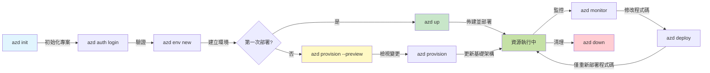
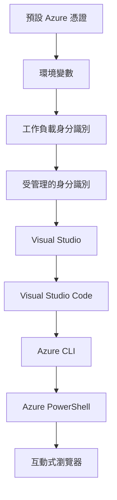

# AZD Basics - Understanding Azure Developer CLI

# AZD Basics - Core Concepts and Fundamentals

**Chapter Navigation:**
- **📚 Course Home**: [AZD For Beginners](../../README.md)
- **📖 Current Chapter**: Chapter 1 - Foundation & Quick Start
- **⬅️ Previous**: [Course Overview](../../README.md#-chapter-1-foundation--quick-start)
- **➡️ Next**: [Installation & Setup](installation.md)
- **🚀 Next Chapter**: [Chapter 2: AI-First Development](../chapter-02-ai-development/microsoft-foundry-integration.md)

## Introduction

This lesson introduces you to Azure Developer CLI (azd), a powerful command-line tool that accelerates your journey from local development to Azure deployment. You'll learn the fundamental concepts, core features, and understand how azd simplifies cloud-native application deployment.

## Learning Goals

By the end of this lesson, you will:
- Understand what Azure Developer CLI is and its primary purpose
- Learn the core concepts of templates, environments, and services
- Explore key features including template-driven development and Infrastructure as Code
- Understand the azd project structure and workflow
- Be prepared to install and configure azd for your development environment

## Learning Outcomes

After completing this lesson, you will be able to:
- Explain the role of azd in modern cloud development workflows
- Identify the components of an azd project structure
- Describe how templates, environments, and services work together
- Understand the benefits of Infrastructure as Code with azd
- Recognize different azd commands and their purposes

## What is Azure Developer CLI (azd)?

Azure Developer CLI (azd) is a command-line tool designed to accelerate your journey from local development to Azure deployment. It simplifies the process of building, deploying, and managing cloud-native applications on Azure.

### 🎯 Why Use AZD? A Real-World Comparison

Let's compare deploying a simple web app with database:

#### ❌ WITHOUT AZD: Manual Azure Deployment (30+ minutes)

```bash
# 步驟 1: 建立資源群組
az group create --name myapp-rg --location eastus

# 步驟 2: 建立 App Service 方案
az appservice plan create --name myapp-plan \
  --resource-group myapp-rg \
  --sku B1 --is-linux

# 步驟 3: 建立 Web 應用程式
az webapp create --name myapp-web-unique123 \
  --resource-group myapp-rg \
  --plan myapp-plan \
  --runtime "NODE:18-lts"

# 步驟 4: 建立 Cosmos DB 帳戶 (10-15 分鐘)
az cosmosdb create --name myapp-cosmos-unique123 \
  --resource-group myapp-rg \
  --kind MongoDB

# 步驟 5: 建立資料庫
az cosmosdb mongodb database create \
  --account-name myapp-cosmos-unique123 \
  --resource-group myapp-rg \
  --name tododb

# 步驟 6: 建立集合
az cosmosdb mongodb collection create \
  --account-name myapp-cosmos-unique123 \
  --resource-group myapp-rg \
  --database-name tododb \
  --name todos

# 步驟 7: 取得連接字串
CONN_STR=$(az cosmosdb keys list \
  --name myapp-cosmos-unique123 \
  --resource-group myapp-rg \
  --type connection-strings \
  --query "connectionStrings[0].connectionString" -o tsv)

# 步驟 8: 設定應用程式設定
az webapp config appsettings set \
  --name myapp-web-unique123 \
  --resource-group myapp-rg \
  --settings MONGODB_URI="$CONN_STR"

# 步驟 9: 啟用日誌記錄
az webapp log config --name myapp-web-unique123 \
  --resource-group myapp-rg \
  --application-logging filesystem \
  --detailed-error-messages true

# 步驟 10: 設定 Application Insights
az monitor app-insights component create \
  --app myapp-insights \
  --location eastus \
  --resource-group myapp-rg

# 步驟 11: 將 Application Insights 連結到 Web 應用程式
INSTRUMENTATION_KEY=$(az monitor app-insights component show \
  --app myapp-insights \
  --resource-group myapp-rg \
  --query "instrumentationKey" -o tsv)

az webapp config appsettings set \
  --name myapp-web-unique123 \
  --resource-group myapp-rg \
  --settings APPINSIGHTS_INSTRUMENTATIONKEY="$INSTRUMENTATION_KEY"

# 步驟 12: 在本機建置應用程式
npm install
npm run build

# 步驟 13: 建立部署封包
zip -r app.zip . -x "*.git*" "node_modules/*"

# 步驟 14: 部署應用程式
az webapp deployment source config-zip \
  --resource-group myapp-rg \
  --name myapp-web-unique123 \
  --src app.zip

# 步驟 15: 等待並祈禱它能運作 🙏
# (沒有自動驗證，需手動測試)
```

**Problems:**
- ❌ 15+ commands to remember and execute in order
- ❌ 30-45 minutes of manual work
- ❌ Easy to make mistakes (typos, wrong parameters)
- ❌ Connection strings exposed in terminal history
- ❌ No automated rollback if something fails
- ❌ Hard to replicate for team members
- ❌ Different every time (not reproducible)

#### ✅ WITH AZD: Automated Deployment (5 commands, 10-15 minutes)

```bash
# 第 1 步：從範本初始化
azd init --template todo-nodejs-mongo

# 第 2 步：進行驗證
azd auth login

# 第 3 步：建立環境
azd env new dev

# 第 4 步：預覽變更（可選但建議）
azd provision --preview

# 第 5 步：部署全部內容
azd up

# ✨ 完成！所有項目已部署、設定並受到監控
```

**Benefits:**
- ✅ **5 commands** vs. 15+ manual steps
- ✅ **10-15 minutes** total time (mostly waiting for Azure)
- ✅ **Zero errors** - automated and tested
- ✅ **Secrets managed securely** via Key Vault
- ✅ **Automatic rollback** on failures
- ✅ **Fully reproducible** - same result every time
- ✅ **Team-ready** - anyone can deploy with same commands
- ✅ **Infrastructure as Code** - version controlled Bicep templates
- ✅ **Built-in monitoring** - Application Insights configured automatically

### 📊 Time & Error Reduction

| Metric | Manual Deployment | AZD Deployment | Improvement |
|:-------|:------------------|:---------------|:------------|
| **Commands** | 15+ | 5 | 67% fewer |
| **Time** | 30-45 min | 10-15 min | 60% faster |
| **Error Rate** | ~40% | <5% | 88% reduction |
| **Consistency** | Low (manual) | 100% (automated) | Perfect |
| **Team Onboarding** | 2-4 hours | 30 minutes | 75% faster |
| **Rollback Time** | 30+ min (manual) | 2 min (automated) | 93% faster |

## Core Concepts

### Templates
Templates are the foundation of azd. They contain:
- **Application code** - Your source code and dependencies
- **Infrastructure definitions** - Azure resources defined in Bicep or Terraform
- **Configuration files** - Settings and environment variables
- **Deployment scripts** - Automated deployment workflows

### Environments
Environments represent different deployment targets:
- **Development** - For testing and development
- **Staging** - Pre-production environment
- **Production** - Live production environment

Each environment maintains its own:
- Azure resource group
- Configuration settings
- Deployment state

### Services
Services are the building blocks of your application:
- **Frontend** - Web applications, SPAs
- **Backend** - APIs, microservices
- **Database** - Data storage solutions
- **Storage** - File and blob storage

## Key Features

### 1. Template-Driven Development
```bash
# 瀏覽可用範本
azd template list

# 從範本初始化
azd init --template <template-name>
```

### 2. Infrastructure as Code
- **Bicep** - Azure's domain-specific language
- **Terraform** - Multi-cloud infrastructure tool
- **ARM Templates** - Azure Resource Manager templates

### 3. Integrated Workflows
```bash
# 完整的部署工作流程
azd up            # 建立資源與部署：這是首次設定的免操作流程

# 🧪 新增：在部署前預覽基礎設施變更（安全）
azd provision --preview    # 模擬基礎設施部署而不做任何變更

azd provision     # 若要更新基礎設施並建立 Azure 資源，請使用此項
azd deploy        # 部署或在更新後重新部署應用程式程式碼
azd down          # 清理資源
```

#### 🛡️ Safe Infrastructure Planning with Preview
The `azd provision --preview` command is a game-changer for safe deployments:
- **Dry-run analysis** - Shows what will be created, modified, or deleted
- **Zero risk** - No actual changes are made to your Azure environment
- **Team collaboration** - Share preview results before deployment
- **Cost estimation** - Understand resource costs before commitment

```bash
# 範例預覽工作流程
azd provision --preview           # 查看將會變更的內容
# 檢視輸出結果，與團隊討論
azd provision                     # 有信心地套用變更
```

### 📊 Visual: AZD Development Workflow


**Workflow Explanation:**
1. **Init** - Start with template or new project
2. **Auth** - Authenticate with Azure
3. **Environment** - Create isolated deployment environment
4. **Preview** - 🆕 Always preview infrastructure changes first (safe practice)
5. **Provision** - Create/update Azure resources
6. **Deploy** - Push your application code
7. **Monitor** - Observe application performance
8. **Iterate** - Make changes and redeploy code
9. **Cleanup** - Remove resources when done

### 4. Environment Management
```bash
# 建立並管理環境
azd env new <environment-name>
azd env select <environment-name>
azd env list
```

## 📁 Project Structure

A typical azd project structure:
```
my-app/
├── .azd/                    # azd configuration
│   └── config.json
├── .azure/                  # Azure deployment artifacts
├── .devcontainer/          # Development container config
├── .github/workflows/      # GitHub Actions
├── .vscode/               # VS Code settings
├── infra/                 # Infrastructure code
│   ├── main.bicep        # Main infrastructure template
│   ├── main.parameters.json
│   └── modules/          # Reusable modules
├── src/                  # Application source code
│   ├── api/             # Backend services
│   └── web/             # Frontend application
├── azure.yaml           # azd project configuration
└── README.md
```

## 🔧 Configuration Files

### azure.yaml
The main project configuration file:
```yaml
name: my-awesome-app
metadata:
  template: my-template@1.0.0

services:
  web:
    project: ./src/web
    language: js
    host: appservice
  api:
    project: ./src/api
    language: js
    host: appservice

hooks:
  preprovision:
    shell: pwsh
    run: echo "Preparing to provision..."
```

### .azure/config.json
Environment-specific configuration:
```json
{
  "version": 1,
  "defaultEnvironment": "dev",
  "environments": {
    "dev": {
      "subscriptionId": "your-subscription-id",
      "location": "eastus"
    }
  }
}
```

## 🎪 Common Workflows with Hands-On Exercises

> **💡 Learning Tip:** Follow these exercises in order to build your AZD skills progressively.

### 🎯 Exercise 1: Initialize Your First Project

**Goal:** Create an AZD project and explore its structure

**Steps:**
```bash
# 使用已驗證的範本
azd init --template todo-nodejs-mongo

# 檢視產生的檔案
ls -la  # 檢視所有檔案，包括隱藏檔案

# 已建立的主要檔案：
# - azure.yaml (主要設定檔)
# - infra/ (基礎架構程式碼)
# - src/ (應用程式原始碼)
```

**✅ Success:** You have azure.yaml, infra/, and src/ directories

---

### 🎯 Exercise 2: Deploy to Azure

**Goal:** Complete end-to-end deployment

**Steps:**
```bash
# 1. 驗證
az login && azd auth login

# 2. 建立環境
azd env new dev
azd env set AZURE_LOCATION eastus

# 3. 預覽變更 (建議)
azd provision --preview

# 4. 部署所有內容
azd up

# 5. 驗證部署
azd show    # 查看您的應用程式網址
```

**Expected Time:** 10-15 minutes  
**✅ Success:** Application URL opens in browser

---

### 🎯 Exercise 3: Multiple Environments

**Goal:** Deploy to dev and staging

**Steps:**
```bash
# 已經有 dev，建立 staging
azd env new staging
azd env set AZURE_LOCATION westus2
azd up

# 在它們之間切換
azd env list
azd env select dev
```

**✅ Success:** Two separate resource groups in Azure Portal

---

### 🛡️ Clean Slate: `azd down --force --purge`

When you need to completely reset:

```bash
azd down --force --purge
```

**What it does:**
- `--force`: No confirmation prompts
- `--purge`: Deletes all local state and Azure resources

**Use when:**
- Deployment failed mid-way
- Switching projects
- Need fresh start

---

## 🎪 Original Workflow Reference

### Starting a New Project
```bash
# 方法 1：使用現有範本
azd init --template todo-nodejs-mongo

# 方法 2：從頭開始
azd init

# 方法 3：使用目前目錄
azd init .
```

### Development Cycle
```bash
# 設定開發環境
azd auth login
azd env new dev
azd env select dev

# 部署所有內容
azd up

# 進行更改並重新部署
azd deploy

# 完成後清理
azd down --force --purge # Azure Developer CLI 中的此命令會對您的環境執行 **完全重置** — 在您排查部署失敗、清理遺留資源或準備重新部署時特別有用。
```

## Understanding `azd down --force --purge`
The `azd down --force --purge` command is a powerful way to completely tear down your azd environment and all associated resources. Here's a breakdown of what each flag does:
```
--force
```
- Skips confirmation prompts.
- Useful for automation or scripting where manual input isn’t feasible.
- Ensures the teardown proceeds without interruption, even if the CLI detects inconsistencies.

```
--purge
```
Deletes **all associated metadata**, including:
Environment state
Local `.azure` folder
Cached deployment info
Prevents azd from "remembering" previous deployments, which can cause issues like mismatched resource groups or stale registry references.


### Why use both?
When you've hit a wall with `azd up` due to lingering state or partial deployments, this combo ensures a **clean slate**.

It’s especially helpful after manual resource deletions in the Azure portal or when switching templates, environments, or resource group naming conventions.


### Managing Multiple Environments
```bash
# 建立預備環境
azd env new staging
azd env select staging
azd up

# 切換回開發環境
azd env select dev

# 比較環境
azd env list
```

## 🔐 Authentication and Credentials

Understanding authentication is crucial for successful azd deployments. Azure uses multiple authentication methods, and azd leverages the same credential chain used by other Azure tools.

### Azure CLI Authentication (`az login`)

Before using azd, you need to authenticate with Azure. The most common method is using Azure CLI:

```bash
# 互動式登入（會開啟瀏覽器）
az login

# 使用特定租戶登入
az login --tenant <tenant-id>

# 使用服務主體登入
az login --service-principal -u <app-id> -p <password> --tenant <tenant-id>

# 檢查目前的登入狀態
az account show

# 列出可用的訂閱
az account list --output table

# 設定預設訂閱
az account set --subscription <subscription-id>
```

### Authentication Flow
1. **Interactive Login**: Opens your default browser for authentication
2. **Device Code Flow**: For environments without browser access
3. **Service Principal**: For automation and CI/CD scenarios
4. **Managed Identity**: For Azure-hosted applications

### DefaultAzureCredential Chain

`DefaultAzureCredential` is a credential type that provides a simplified authentication experience by automatically trying multiple credential sources in a specific order:

#### Credential Chain Order

#### 1. Environment Variables
```bash
# 為服務主體設定環境變數
export AZURE_CLIENT_ID="<app-id>"
export AZURE_CLIENT_SECRET="<password>"
export AZURE_TENANT_ID="<tenant-id>"
```

#### 2. Workload Identity (Kubernetes/GitHub Actions)
Used automatically in:
- Azure Kubernetes Service (AKS) with Workload Identity
- GitHub Actions with OIDC federation
- Other federated identity scenarios

#### 3. Managed Identity
For Azure resources like:
- Virtual Machines
- App Service
- Azure Functions
- Container Instances

```bash
# 檢查是否在具有受管身分的 Azure 資源上執行
az account show --query "user.type" --output tsv
# 回傳："servicePrincipal"，如果使用受管身分
```

#### 4. Developer Tools Integration
- **Visual Studio**: Automatically uses signed-in account
- **VS Code**: Uses Azure Account extension credentials
- **Azure CLI**: Uses `az login` credentials (most common for local development)

### AZD Authentication Setup

```bash
# 方法 1：使用 Azure CLI（建議用於開發）
az login
azd auth login  # 使用現有的 Azure CLI 認證

# 方法 2：直接使用 azd 進行認證
azd auth login --use-device-code  # 適用於無頭環境

# 方法 3：檢查認證狀態
azd auth login --check-status

# 方法 4：登出並重新認證
azd auth logout
azd auth login
```

### Authentication Best Practices

#### For Local Development
```bash
# 1. 使用 Azure CLI 登入
az login

# 2. 驗證訂閱是否正確
az account show
az account set --subscription "Your Subscription Name"

# 3. 使用現有認證搭配 azd
azd auth login
```

#### For CI/CD Pipelines
```yaml
# GitHub Actions example
- name: Azure Login
  uses: azure/login@v1
  with:
    creds: ${{ secrets.AZURE_CREDENTIALS }}

- name: Deploy with azd
  run: |
    azd auth login --client-id ${{ secrets.AZURE_CLIENT_ID }} \
                    --client-secret ${{ secrets.AZURE_CLIENT_SECRET }} \
                    --tenant-id ${{ secrets.AZURE_TENANT_ID }}
    azd up --no-prompt
```

#### For Production Environments
- Use **Managed Identity** when running on Azure resources
- Use **Service Principal** for automation scenarios
- Avoid storing credentials in code or configuration files
- Use **Azure Key Vault** for sensitive configuration

### Common Authentication Issues and Solutions

#### Issue: "No subscription found"
```bash
# 解決方案：設定預設訂閱
az account list --output table
az account set --subscription "<subscription-id>"
azd env set AZURE_SUBSCRIPTION_ID "<subscription-id>"
```

#### Issue: "Insufficient permissions"
```bash
# 解決方案：檢查並指派所需角色
az role assignment list --assignee $(az account show --query user.name --output tsv)

# 常見所需角色：
# - 參與者（用於資源管理）
# - 使用者存取管理員（用於指派角色）
```

#### Issue: "Token expired"
```bash
# 解決方案：重新驗證身分
az logout
az login
azd auth logout
azd auth login
```

### Authentication in Different Scenarios

#### Local Development
```bash
# 個人發展帳戶
az login
azd auth login
```

#### Team Development
```bash
# 為組織使用特定租戶
az login --tenant contoso.onmicrosoft.com
azd auth login
```

#### Multi-tenant Scenarios
```bash
# 在租戶之間切換
az login --tenant tenant1.onmicrosoft.com
# 部署到租戶 1
azd up

az login --tenant tenant2.onmicrosoft.com  
# 部署到租戶 2
azd up
```

### Security Considerations

1. **Credential Storage**: Never store credentials in source code
2. **Scope Limitation**: Use least-privilege principle for service principals
3. **Token Rotation**: Regularly rotate service principal secrets
4. **Audit Trail**: Monitor authentication and deployment activities
5. **Network Security**: Use private endpoints when possible

### Troubleshooting Authentication

```bash
# 除錯驗證問題
azd auth login --check-status
az account show
az account get-access-token

# 常用診斷命令
whoami                          # 目前使用者上下文
az ad signed-in-user show      # Azure AD 使用者詳細資料
az group list                  # 測試資源存取
```

## Understanding `azd down --force --purge`

### Discovery
```bash
azd template list              # 瀏覽範本
azd template show <template>   # 範本詳細資訊
azd init --help               # 初始化選項
```

### Project Management
```bash
azd show                     # 專案概覽
azd env show                 # 目前環境
azd config list             # 組態設定
```

### Monitoring
```bash
azd monitor                  # 開啟 Azure 入口網站的監控
azd monitor --logs           # 檢視應用程式日誌
azd monitor --live           # 檢視即時指標
azd pipeline config          # 設定 CI/CD
```

## Best Practices

### 1. Use Meaningful Names
```bash
# 好
azd env new production-east
azd init --template web-app-secure

# 避免
azd env new env1
azd init --template template1
```

### 2. Leverage Templates
- Start with existing templates
- Customize for your needs
- Create reusable templates for your organization

### 3. Environment Isolation
- Use separate environments for dev/staging/prod
- Never deploy directly to production from local machine
- Use CI/CD pipelines for production deployments

### 4. Configuration Management
- Use environment variables for sensitive data
- Keep configuration in version control
- Document environment-specific settings

## Learning Progression

### Beginner (Week 1-2)
1. Install azd and authenticate
2. Deploy a simple template
3. Understand project structure
4. Learn basic commands (up, down, deploy)

### Intermediate (Week 3-4)
1. Customize templates
2. Manage multiple environments
3. Understand infrastructure code
4. Set up CI/CD pipelines

### Advanced (Week 5+)
1. Create custom templates
2. Advanced infrastructure patterns
3. Multi-region deployments
4. Enterprise-grade configurations

## Next Steps

**📖 Continue Chapter 1 Learning:**
- [安裝與設定](installation.md) - 取得並設定 azd
- [你的第一個專案](first-project.md) - 完整的實作教學
- [設定指南](configuration.md) - 進階設定選項

**🎯 準備好進入下一章了嗎？**
- [第 2 章：以 AI 為先的開發](../chapter-02-ai-development/microsoft-foundry-integration.md) - 開始建立 AI 應用程式

## 其他資源

- [Azure Developer CLI 概覽](https://learn.microsoft.com/en-us/azure/developer/azure-developer-cli/)
- [範本集](https://azure.github.io/awesome-azd/)
- [社群範例](https://github.com/Azure-Samples)

---

## 🙋 常見問題

### 一般問題

**問：AZD 與 Azure CLI 有什麼不同？**

答：Azure CLI (`az`) 用於管理單一的 Azure 資源。AZD (`azd`) 用於管理整個應用程式：

```bash
# Azure CLI - 低階資源管理
az webapp create --name myapp --resource-group rg
az sql server create --name myserver --resource-group rg
# ...還需要更多指令

# AZD - 應用程式層級管理
azd up  # 部署整個應用程式與其所有資源
```

**可以這麼想：**
- `az` = 操作單個樂高積木
- `azd` = 操作完整的樂高套組

---

**問：使用 AZD 是否需要會 Bicep 或 Terraform？**

答：不需要！從範本開始：
```bash
# 使用現有範本 - 不需要 IaC 知識
azd init --template todo-nodejs-mongo
azd up
```

你之後可以學習 Bicep 來自訂基礎架構。範本提供可運作的範例供學習。

---

**問：執行 AZD 範本需要多少費用？**

答：費用依範本而異。大多數開發範本的費用為每月 $50-150：

```bash
# 在部署前預覽費用
azd provision --preview

# 不使用時務必進行清理
azd down --force --purge  # 移除所有資源
```

**小技巧：** 在可用時使用免費階層：
- App Service：F1（免費）階層
- Azure OpenAI：每月 50,000 代幣免費
- Cosmos DB：1000 RU/s 免費階層

---

**問：我可以將 AZD 與現有的 Azure 資源一起使用嗎？**

答：可以，但從頭開始會比較容易。當 AZD 管理完整生命週期時效果最好。針對現有資源：

```bash
# 選項 1：匯入既有資源（進階）
azd init
# 然後修改 infra/ 以參考既有資源

# 選項 2：從頭開始（建議）
azd init --template matching-your-stack
azd up  # 建立新的環境
```

---

**問：我如何與團隊成員分享我的專案？**

答：將 AZD 專案提交到 Git（但不要提交 .azure 資料夾）：

```bash
# 已預設列在 .gitignore 中
.azure/        # 包含機密與環境資料
*.env          # 環境變數

# 接著是團隊成員:
git clone <your-repo>
azd auth login
azd env new <their-name>-dev
azd up
```

每個人都會從相同的範本取得相同的基礎架構。

---

### 疑難排解問題

**問： "azd up" 在執行到一半失敗。我該怎麼辦？**

答：檢查錯誤、修正後再重試：

```bash
# 檢視詳細日誌
azd show

# 常見修復:

# 1. 若超出配額:
azd env set AZURE_LOCATION "westus2"  # 嘗試使用不同地區

# 2. 若資源名稱衝突:
azd down --force --purge  # 清空
azd up  # 重試

# 3. 若認證過期:
az login
azd auth login
azd up
```

**最常見的問題：** 選擇了錯誤的 Azure 訂閱
```bash
az account list --output table
az account set --subscription "<correct-subscription>"
```

---

**問：如何只部署程式碼變更而不重新佈建？**

答：使用 `azd deploy` 代替 `azd up`：

```bash
azd up          # 第一次：佈建 + 部署（較慢）

# 修改程式碼...

azd deploy      # 之後：僅部署（較快）
```

速度比較：
- `azd up`: 10-15 分鐘（佈建基礎架構）
- `azd deploy`: 2-5 分鐘（僅程式碼）

---

**問：我可以自訂基礎架構範本嗎？**

答：可以！編輯 `infra/` 中的 Bicep 檔案：

```bash
# 執行 azd init 之後
cd infra/
code main.bicep  # 在 VS Code 中編輯

# 預覽變更
azd provision --preview

# 套用變更
azd provision
```

**提示：** 從小處開始 - 先變更 SKU：
```bicep
// infra/main.bicep
sku: {
  name: 'B1'  // Change to 'P1V2' for production
}
```

---

**問：如何刪除 AZD 所建立的所有資源？**

答：一個指令即可移除所有資源：

```bash
azd down --force --purge

# 這會刪除：
# - 所有 Azure 資源
# - 資源群組
# - 本機環境狀態
# - 快取的部署資料
```

**在以下情況務必執行：**
- 完成範本測試
- 轉換至不同專案
- 想要重新開始

**節省費用：** 刪除未使用的資源 = $0 費用

---

**問：如果我不小心在 Azure 入口網站刪除了資源，該怎麼辦？**

答：AZD 的狀態可能會不同步。採取清空重置的做法：

```bash
# 1. 移除本機狀態
azd down --force --purge

# 2. 從頭開始
azd up

# 替代方案：讓 AZD 偵測並修復
azd provision  # 會建立缺少的資源
```

---

### 進階問題

**問：我可以在 CI/CD 管線中使用 AZD 嗎？**

答：可以！GitHub Actions 範例：

```yaml
# .github/workflows/deploy.yml
name: Deploy with AZD

on:
  push:
    branches: [main]

jobs:
  deploy:
    runs-on: ubuntu-latest
    steps:
      - uses: actions/checkout@v2
      
      - name: Install azd
        run: curl -fsSL https://aka.ms/install-azd.sh | bash
      
      - name: Azure Login
        run: |
          azd auth login \
            --client-id ${{ secrets.AZURE_CLIENT_ID }} \
            --client-secret ${{ secrets.AZURE_CLIENT_SECRET }} \
            --tenant-id ${{ secrets.AZURE_TENANT_ID }}
      
      - name: Deploy
        run: azd up --no-prompt
```

---

**問：我該如何處理機密與敏感資料？**

答：AZD 會自動整合 Azure Key Vault：

```bash
# 機密儲存在 Key Vault，而不是程式碼中
azd env set DATABASE_PASSWORD "$(openssl rand -base64 32)"

# AZD 會自動：
# 1. 建立 Key Vault
# 2. 儲存機密
# 3. 透過 Managed Identity 授予應用程式存取權限
# 4. 在執行時注入
```

**切勿提交：**
- `.azure/` 資料夾（包含環境資料）
- `.env` 檔案（本機機密）
- 連線字串

---

**問：我可以部署到多個區域嗎？**

答：可以，為每個區域建立環境：

```bash
# 美國東部環境
azd env new prod-eastus
azd env set AZURE_LOCATION eastus
azd up

# 歐洲西部環境
azd env new prod-westeurope
azd env set AZURE_LOCATION westeurope
azd up

# 每個環境彼此獨立
azd env list
```

對於真正的多區域應用，請自訂 Bicep 範本以同時部署到多個區域。

---

**問：如果卡住了，我可以到哪裡尋求協助？**

1. **AZD 文件：** https://learn.microsoft.com/azure/developer/azure-developer-cli/
2. **GitHub 問題回報：** https://github.com/Azure/azure-dev/issues
3. **Discord：** [Azure Discord](https://discord.gg/microsoft-azure) - #azure-developer-cli 頻道
4. **Stack Overflow：** 標籤 `azure-developer-cli`
5. **本課程：** [疑難排解指南](../chapter-07-troubleshooting/common-issues.md)

**小技巧：** 在提問之前，請執行：
```bash
azd show       # 顯示目前狀態
azd version    # 顯示你的版本
```
將這些資訊包含在你的問題中以便更快獲得協助。

---

## 🎓 下一步？

你現在了解 AZD 的基本概念。選擇你的路線：

### 🎯 初學者：
1. **下一步：** [安裝與設定](installation.md) - 在你的電腦上安裝 AZD
2. **接著：** [你的第一個專案](first-project.md) - 部署你的第一個應用程式
3. **練習：** 完成本課的所有 3 個練習

### 🚀 AI 開發人員：
1. **直接跳到：** [第 2 章：以 AI 為先的開發](../chapter-02-ai-development/microsoft-foundry-integration.md)
2. **部署：** 從 `azd init --template get-started-with-ai-chat` 開始
3. **學習：** 在部署的同時開始建置

### 🏗️ 進階開發人員：
1. **檢閱：** [設定指南](configuration.md) - 進階設定
2. **探索：** [基礎架構即程式碼](../chapter-04-infrastructure/provisioning.md) - 深入探討 Bicep
3. **建置：** 為你的技術棧建立自訂範本

---

**章節導覽：**
- **📚 課程首頁**: [AZD 初學者](../../README.md)
- **📖 目前章節**: 第 1 章 - 基礎與快速入門  
- **⬅️ 上一章**: [課程總覽](../../README.md#-chapter-1-foundation--quick-start)
- **➡️ 下一步**: [安裝與設定](installation.md)
- **🚀 下一章**: [第 2 章：以 AI 為先的開發](../chapter-02-ai-development/microsoft-foundry-integration.md)

---

<!-- CO-OP TRANSLATOR DISCLAIMER START -->
**免責聲明**：
本文件由 AI 翻譯服務 [Co-op Translator](https://github.com/Azure/co-op-translator) 進行翻譯。雖然我們力求準確，但請注意自動翻譯可能包含錯誤或不精確之處。原始語言的文件應視為具權威性的版本。若涉及關鍵資訊，建議採用專業人工翻譯。我們對因使用此翻譯而產生的任何誤解或錯誤詮釋不負任何責任。
<!-- CO-OP TRANSLATOR DISCLAIMER END -->