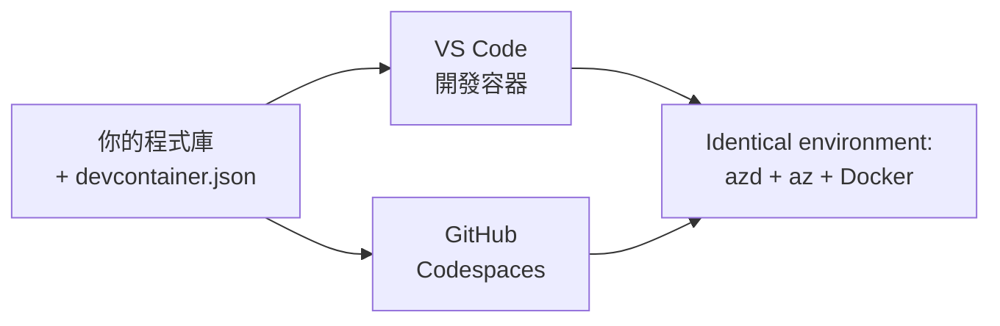

# azd 的開發容器與 GitHub Codespaces

**章節導覽：**
- **📚 課程首頁**：[AZD 初學者指南](../../README.md)
- **📖 本章節**：第 1 章 - 基礎與快速入門
- **⬅️ 上一章**：[Bring Your Own App](bring-your-own-app.md)
- **🚀 下一章**：[第 2 章：AI 為先的開發](../chapter-02-ai-development/README.md)

> 於 2026 年 7 月以 `azd 1.27.1` 版驗證。

## 簡介

在每台機器上安裝 azd、正確的語言執行環境、Docker 和 Azure CLI 非常麻煩，而這也是為什麼有些人碰到「在我電腦上能運行」的教學卻無法用的首要原因。**開發容器（dev container）** 透過描述整個工具鏈的設定檔解決了這個問題。任何在 VS Code 或 GitHub Codespaces 開啟專案的人，都獲得完全相同的環境，且已預先安裝 azd。本課程將示範如何新增開發容器。

## 學習目標

完成本課程後，你將能：
- 了解什麼是開發容器及其如何協助 azd
- 將最小化的 `.devcontainer/devcontainer.json` 新增至專案
- 透過開發容器 *features* 包含 azd、Azure CLI 及 Docker
- 在 GitHub Codespaces 或 VS Code 中開啟專案

## 學習成果

完成本課程後，你將能：
- 為 azd 專案撰寫 `devcontainer.json`
- 無須手動安裝即可新增 azd 及 Azure 工具
- 從容器或 Codespace 裡執行 `azd up`

---

## 什麼是開發容器？

開發容器是一個基於 Docker 的開發環境，透過 `.devcontainer/devcontainer.json` 檔案定義於你的版本庫中。開啟專案時：

- **VS Code**（需安裝開發容器擴充功能）會建立容器並附加。
- **GitHub Codespaces** 則在雲端建立相同容器，並提供瀏覽器編輯器。

兩者皆能確保每位貢獻者都使用相同的工具，免去「你有沒有安裝 azd？」的疑惑與排錯。



---

## 第一步：建立 devcontainer 檔案

在專案根目錄下建立 `.devcontainer/devcontainer.json`：

```json
{
  "name": "azd-project",
  "image": "mcr.microsoft.com/devcontainers/base:bookworm",
  "features": {
    "ghcr.io/devcontainers/features/azure-cli:1": {},
    "ghcr.io/azure/azure-dev/azd:latest": {},
    "ghcr.io/devcontainers/features/docker-in-docker:2": {},
    "ghcr.io/devcontainers/features/node:1": {}
  },
  "customizations": {
    "vscode": {
      "extensions": [
        "ms-azuretools.azure-dev",
        "ms-azuretools.vscode-bicep"
      ]
    }
  },
  "forwardPorts": [3000],
  "postCreateCommand": "azd version"
}
```

每個部分的功能：

| 鍵名 | 目的 |
|-----|-------|
| `image` | 容器的基本作業系統 |
| `features` | 預先建置的安裝方案 — 這裡包含 Azure CLI、**azd**、Docker 與 Node.js |
| `customizations.vscode.extensions` | 自動安裝 azd 與 Bicep 的 VS Code 擴充功能 |
| `forwardPorts` | 將你的應用埠端口對外暴露，供瀏覽器使用 |
| `postCreateCommand` | 容器建立後執行一次（此例為健康檢查） |

> `ghcr.io/azure/azure-dev/azd:latest` feature 是官方在容器中取得 azd 的方式。如需確保可重現性請指定特定版本（例如 `azd:1.27.1`）。

---

## 第二步：依應用語言選擇 feature

將 `node` feature 換成你的應用所用語言：

```jsonc
// Python project
"ghcr.io/devcontainers/features/python:1": {},

// .NET project
"ghcr.io/devcontainers/features/dotnet:2": {},

// Java project
"ghcr.io/devcontainers/features/java:1": {},

// Go project
"ghcr.io/devcontainers/features/go:1": {}
```

如果你的 `host` 是 `containerapp`、`aks` 或任何需要建立容器映像的，請保留 `docker-in-docker`，因為 azd 需要 Docker 來建立與推送映像。

---

## 第三步：開啟開發容器

**在 VS Code 裡：**
1. 安裝 **Dev Containers** 擴充功能。
2. 開啟專案資料夾。
3. 被提示時點選 **Reopen in Container**（或執行 *Dev Containers: Reopen in Container*）。

**在 GitHub Codespaces 裡：**
1. 將版本庫推送至 GitHub。
2. 點選 **Code → Codespaces → Create codespace on main**。
3. 等待容器建立完成 — 終端機中會有已準備好的 azd。

---

## 第四步：從容器內部部署

容器已預裝 azd，故可正常使用既有流程：

```bash
azd auth login --use-device-code   # 裝置代碼在 Codespaces 中非常方便
azd up
```

> **為何要用 `--use-device-code`？** 在遠端容器或 Codespace 裡沒有本機瀏覽器可導向，因此利用裝置代碼登入是最可靠的方法。你會將代碼貼到瀏覽器頁籤完成登入。

---

## 常見問題與解決

| 問題 | 解決方法 |
|---------|----------|
| `azd up` 無法建立映像 | 新增 `docker-in-docker` feature |
| Codespaces 中瀏覽器登入卡住 | 使用 `azd auth login --use-device-code` |
| 工具在團隊不同成員間不一致 | 指定 feature 版本（例如 `azd:1.27.1`） |
| 瀏覽器無法連線到應用 | 新增埠口於 `forwardPorts` |

---

## 總結

- 開發容器讓你的 azd 工具鏈能在團隊中一致且可重現。
- 透過開發容器 *features* 新增 azd、Azure CLI 及 Docker。
- 配合你的應用語言調整相對應 feature，且為容器主機保留 `docker-in-docker`。
- 在 Codespaces 裡使用裝置代碼登入。

---

## 🔗 導覽

| 方向 | 資源 |
|-----------|----------|
| <strong>上一章</strong> | [Bring Your Own App](bring-your-own-app.md) |
| <strong>本章首頁</strong> | [第 1 章：基礎與快速入門](README.md) |
| <strong>下一章</strong> | [第 2 章：AI 為先的開發](../chapter-02-ai-development/README.md) |

## 📖 相關資源

- [安裝與設定](installation.md)
- [指令速查表](../../resources/cheat-sheet.md)
- [官方開發容器規範](https://containers.dev/)
- [azd 開發容器功能](https://github.com/Azure/azure-dev/tree/main/ext/devcontainer)

---

<!-- CO-OP TRANSLATOR DISCLAIMER START -->
**免責聲明**：
此文件已使用 AI 翻譯服務 [Co-op Translator](https://github.com/Azure/co-op-translator) 進行翻譯。雖然我們努力追求準確性，但請注意自動翻譯可能包含錯誤或不準確之處。原始文件的母語版本應視為權威來源。對於關鍵資訊，建議採用專業人工翻譯。我們不對因使用此翻譯所產生的任何誤解或誤譯承擔責任。
<!-- CO-OP TRANSLATOR DISCLAIMER END -->