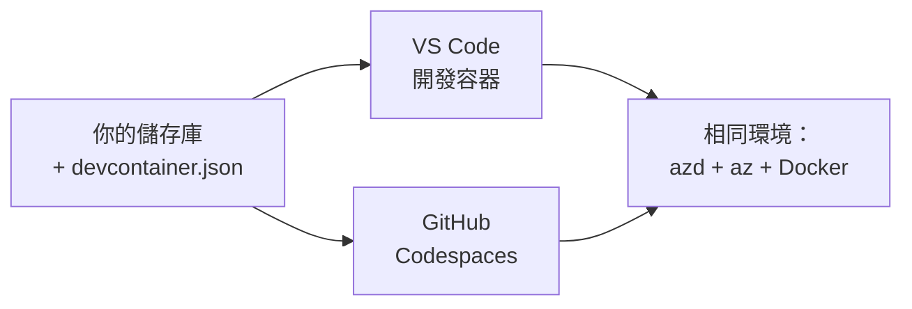

# 適用於 azd 的 Dev Containers 與 GitHub Codespaces

**Chapter Navigation:**
- **📚 課程首頁**: [AZD 初學者指南](../../README.md)
- **📖 目前章節**: 第 1 章 - 基礎與快速開始
- **⬅️ 上一章**: [使用您自己的應用程式](bring-your-own-app.md)
- **🚀 下一章**: [第 2 章：以 AI 為先的開發](../chapter-02-ai-development/README.md)

> 已於 2026 年 6 月使用 `azd 1.25.6` 驗證。

## 介紹

在每台機器上安裝 azd、適當的語言執行環境、Docker 和 Azure CLI 是一項繁瑣的工作——而且這也是造成「在我的機器上可行」的教學在別人那裡失敗的首要原因。<strong>dev container（開發容器）</strong>可以透過在一個檔案中描述整個工具鏈來解決這個問題。任何在 VS Code 或 GitHub Codespaces 中開啟此專案的人，都會得到完全相同的環境，而且 azd 已經安裝好。本課程示範如何新增一個。

## 學習目標

到本課程結束時，您將能夠：
- 了解什麼是開發容器以及它為何能協助 azd
- 為專案新增最小化的 `.devcontainer/devcontainer.json`
- 透過 Dev Container 的 *features* 新增 azd、Azure CLI 與 Docker
- 在 GitHub Codespaces 或 VS Code 中開啟專案

## 學習成果

完成本課程後，您將能夠：
- 為 azd 專案撰寫 `devcontainer.json`
- 在不手動安裝的情況下新增 azd 與 Azure 工具
- 在容器或 Codespace 內執行 `azd up`

---

## 什麼是開發容器？

開發容器是以 Docker 為基礎的開發環境，由您在版本庫中的 `.devcontainer/devcontainer.json` 檔案所定義。當您開啟專案時：

- **VS Code**（搭配 Dev Containers 擴充功能）會建立容器並附加到容器。
- **GitHub Codespaces** 會在雲端建立相同的容器，並提供基於瀏覽器的編輯器。

無論哪種方式，每位貢獻者都會得到相同的工具—不再出現「你有安裝 azd 嗎？」這類的除錯問題。



---

## 步驟 1：建立 devcontainer 檔案

在專案根目錄建立 `.devcontainer/devcontainer.json`：

```json
{
  "name": "azd-project",
  "image": "mcr.microsoft.com/devcontainers/base:bookworm",
  "features": {
    "ghcr.io/devcontainers/features/azure-cli:1": {},
    "ghcr.io/azure/azure-dev/azd:latest": {},
    "ghcr.io/devcontainers/features/docker-in-docker:2": {},
    "ghcr.io/devcontainers/features/node:1": {}
  },
  "customizations": {
    "vscode": {
      "extensions": [
        "ms-azuretools.azure-dev",
        "ms-azuretools.vscode-bicep"
      ]
    }
  },
  "forwardPorts": [3000],
  "postCreateCommand": "azd version"
}
```

What each part does:

| 鍵 | 用途 |
|-----|---------|
| `image` | 容器的基礎作業系統 |
| `features` | 預先建好的安裝項目—此處包括：Azure CLI、**azd**、Docker 與 Node.js |
| `customizations.vscode.extensions` | 自動安裝 azd 與 Bicep 的 VS Code 擴充套件 |
| `forwardPorts` | 將應用程式的連接埠暴露給瀏覽器 |
| `postCreateCommand` | 容器建立後執行一次（此處為檢查） |

> `ghcr.io/azure/azure-dev/azd:latest` 這個 feature 是在容器中取得 azd 的官方方式。如需可重現性，請鎖定特定版本（例如 `azd:1.25.6`）。

---

## 步驟 2：將 feature 與應用程式所使用的語言相符

將 `node` feature 換成您的應用程式所使用的任何項目：

```jsonc
// Python project
"ghcr.io/devcontainers/features/python:1": {},

// .NET project
"ghcr.io/devcontainers/features/dotnet:2": {},

// Java project
"ghcr.io/devcontainers/features/java:1": {},

// Go project
"ghcr.io/devcontainers/features/go:1": {}
```

如果您的 `host` 是 `containerapp`、`aks` 或任何會建立容器映像檔的主機，就保留 `docker-in-docker`—azd 需要 Docker 來建立與推送映像檔。

---

## 步驟 3：開啟它

**在 VS Code 中：**
1. 安裝 **Dev Containers** 擴充功能。
2. 開啟專案資料夾。
3. 於提示時點選 **Reopen in Container**（或執行 *Dev Containers: Reopen in Container*）。

**在 GitHub Codespaces 中：**
1. 將 repo 推到 GitHub。
2. 點選 **Code → Codespaces → Create codespace on main**。
3. 等待容器建置完成—azd 會在終端機中可用。

---

## 步驟 4：從容器內部署

容器內已預先安裝 azd，所以正常的工作流程即可運作：

```bash
azd auth login --use-device-code   # 在 Codespaces 中使用裝置代碼很方便
azd up
```

> **為什麼使用 `--use-device-code`？** 在遠端容器或 Codespace 中沒有本機瀏覽器可導向，因此裝置代碼登入（device-code）是可靠的做法。您將在瀏覽器分頁貼上代碼以完成登入。

---

## 常見陷阱

| 常見問題 | 解決方法 |
|---------|-----|
| `azd up` can't build an image | 新增 `docker-in-docker` feature |
| Browser login hangs in Codespaces | 使用 `azd auth login --use-device-code` |
| Tools differ between teammates | 鎖定 feature 版本（例如 `azd:1.25.6`） |
| App not reachable in browser | 將連接埠新增到 `forwardPorts` |

---

## 摘要

- 開發容器可讓每個人的 azd 工具鏈可重現。
- 透過 Dev Container 的 *features* 新增 azd、Azure CLI 與 Docker。
- 將語言相關的 feature 與您的應用程式對應，且對於容器主機保留 `docker-in-docker`。
- 在 Codespaces 內執行時使用裝置代碼登入（device-code 登入）。

---

## 🔗 導覽

| 方向 | 資源 |
|-----------|----------|
| <strong>上一章</strong> | [使用您自己的應用程式](bring-your-own-app.md) |
| <strong>章節首頁</strong> | [第 1 章：基礎與快速開始](README.md) |
| <strong>下一章</strong> | [第 2 章：以 AI 為先的開發](../chapter-02-ai-development/README.md) |

## 📖 相關資源

- [安裝與設定](installation.md)
- [指令速查表](../../resources/cheat-sheet.md)
- [官方 Dev Containers 規範](https://containers.dev/)
- [azd Dev Container feature](https://github.com/Azure/azure-dev/tree/main/ext/devcontainer)

---

<!-- CO-OP TRANSLATOR DISCLAIMER START -->
**免責聲明**：
此文件已使用 AI 翻譯服務 [Co-op Translator](https://github.com/Azure/co-op-translator) 進行翻譯。雖然我們努力追求準確性，但請注意自動翻譯可能包含錯誤或不準確之處。原始文件的母語版本應視為權威來源。對於關鍵資訊，建議採用專業人工翻譯。我們不對因使用此翻譯所產生的任何誤解或誤譯承擔責任。
<!-- CO-OP TRANSLATOR DISCLAIMER END -->