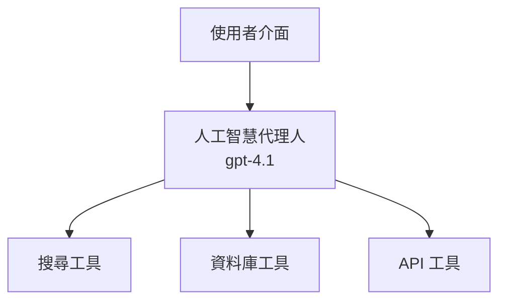
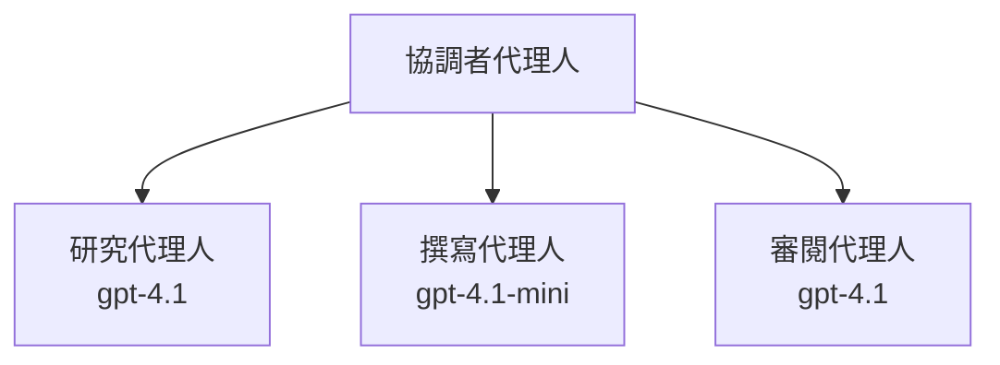

# AI 代理與 Azure Developer CLI

**章節導覽：**
- **📚 課程首頁**: [AZD For Beginners](../../README.md)
- **📖 目前章節**: 第 2 章 - AI 優先開發
- **⬅️ 上一節**: [Microsoft Foundry 整合](microsoft-foundry-integration.md)
- **➡️ 下一節**: [AI 模型部署](ai-model-deployment.md)
- **🚀 進階**: [多代理解決方案](../../examples/retail-scenario.md)

---

## 介紹

AI 代理是能感知其環境、做出決策並採取行動以達成特定目標的自主程式。與僅回應提示的簡單聊天機器人不同，代理可以：

- <strong>使用工具</strong> - 呼叫 API、搜尋資料庫、執行程式碼
- <strong>計畫與推理</strong> - 將複雜任務拆解為步驟
- <strong>從情境中學習</strong> - 保持記憶並調整行為
- <strong>協作</strong> - 與其他代理一起工作（多代理系統）

本指南示範如何使用 Azure Developer CLI (azd) 將 AI 代理部署到 Azure。

> **驗證備註 (2026-03-25):** 本指南針對 `azd` `1.23.12` 與 `azure.ai.agents` `0.1.18-preview` 進行檢閱。`azd ai` 體驗仍以預覽為主，如果您安裝的擴充功能旗標不同，請查看擴充功能說明。

## 學習目標

完成本指南後，您將：
- 了解 AI 代理是什麼以及它們與聊天機器人的差異
- 使用 AZD 部署預先建置的 AI 代理範本
- 為自訂代理設定 Foundry 代理
- 實作基本代理模式（工具使用、RAG、多代理）
- 監控並偵錯已部署的代理

## 學習成果

完成後，您將能：
- 使用單一指令將 AI 代理應用部署到 Azure
- 設定代理工具與能力
- 與代理實作檢索增強生成（RAG）
- 設計複雜工作流程的多代理架構
- 排解常見代理部署問題

---

## 🤖 代理與聊天機器人的不同之處？

| 特徵 | 聊天機器人 | AI 代理 |
|---------|---------|----------|
| <strong>行為</strong> | 回應提示 | 採取自主行動 |
| <strong>工具</strong> | 無 | 可呼叫 API、搜尋、執行程式碼 |
| <strong>記憶</strong> | 僅限於會話 | 跨會話的持久記憶 |
| <strong>規劃</strong> | 單一回應 | 多步推理 |
| <strong>協作</strong> | 單一個體 | 可與其他代理協作 |

### 簡單類比

- <strong>聊天機器人</strong> = 在資訊櫃檯回答問題的熱心人員
- **AI 代理** = 可以打電話、預約、為您完成任務的個人助理

---

## 🚀 快速上手：部署您的第一個代理

### 選項 1：Foundry 代理範本（建議）

```bash
# 初始化 AI 代理範本
azd init --template get-started-with-ai-agents

# 部署到 Azure
azd up
```

**部署內容：**
- ✅ Foundry 代理
- ✅ Microsoft Foundry 模型 (gpt-4.1)
- ✅ Azure AI Search（用於 RAG）
- ✅ Azure Container Apps（網頁介面）
- ✅ Application Insights（監控）

**時間：** 約 15-20 分鐘
**成本：** 約 $100-150/月（開發）

### 選項 2：使用 Prompty 的 OpenAI 代理

```bash
# 初始化基於 Prompty 的代理範本
azd init --template agent-openai-python-prompty

# 部署到 Azure
azd up
```

**部署內容：**
- ✅ Azure Functions（無伺服器代理執行）
- ✅ Microsoft Foundry 模型
- ✅ Prompty 設定檔
- ✅ 範例代理實作

**時間：** 約 10-15 分鐘
**成本：** 約 $50-100/月（開發）

### 選項 3：RAG 聊天代理

```bash
# 初始化 RAG 聊天範本
azd init --template azure-search-openai-demo

# 部署到 Azure
azd up
```

**部署內容：**
- ✅ Microsoft Foundry 模型
- ✅ 含範例資料的 Azure AI Search
- ✅ 文件處理管線
- ✅ 含引用來源的聊天介面

**時間：** 約 15-25 分鐘
**成本：** 約 $80-150/月（開發）

### 選項 4：AZD AI 代理初始化（基於清單或範本的預覽）

如果您有代理清單（agent manifest）檔案，您可以使用 `azd ai` 指令直接產生 Foundry Agent Service 專案。近期的預覽版本也新增了基於範本的初始化支援，因此實際的提示流程可能會依您安裝的擴充版本略有差異。

```bash
# 安裝 AI 代理程式擴充功能
azd extension install azure.ai.agents

# 可選：驗證已安裝的預覽版本
azd extension show azure.ai.agents

# 從代理程式描述檔初始化
azd ai agent init -m agent-manifest.yaml

# 部署到 Azure
azd up

# 測試已部署的代理（顯示延遲與到第一個位元組的時間）
azd ai agent invoke
```

**何時使用 `azd ai agent init` vs `azd init --template`：**

| 方法 | 適用於 | 運作方式 |
|----------|----------|------|
| `azd init --template` | 從可運行的範例應用開始 | 複製包含程式碼與基礎設施的完整範本倉庫 |
| `azd ai agent init -m` | 從您自己的代理清單建立 | 從您的代理定義腳手架專案結構 |

> **提示：** 學習時使用 `azd init --template`（上述選項 1-3）。在以自有清單建立生產代理時使用 `azd ai agent init`。

在執行 `azd up` 之後，相同的擴充會引導您完成代理生命週期的其餘部分：使用 `azd ai agent invoke` 進行測試，`azd ai agent eval generate` 與 `azd ai agent optimize` 來衡量與提升品質，並使用 `azd ai agent delete` 清除。完整參考請參閱 [AZD AI CLI 指令](../chapter-08-production/production-ai-practices.md#azd-ai-cli-commands-and-extensions)。

---

## 🏗️ 代理架構模式

### 模式 1：具工具的單一代理

最簡單的代理模式 — 一個代理可以使用多種工具。



**適用於：**
- 客戶支援機器人
- 研究助理
- 資料分析代理

**AZD 範本：** `azure-search-openai-demo`

### 模式 2：RAG 代理（檢索增強生成）

在生成回應前檢索相關文件的代理。


**適用於：**
- 企業知識庫
- 文件問答系統
- 合規與法律研究

**AZD 範本：** `azure-search-openai-demo`

### 模式 3：多代理系統

多個專精代理協同處理複雜任務。



**適用於：**
- 複雜內容生成
- 多步工作流程
- 需要不同專業知識的任務

**進一步了解：** [多代理協調模式](../chapter-06-pre-deployment/coordination-patterns.md)

---

## ⚙️ 設定代理工具

代理在能使用工具時會變得強大。以下說明如何設定常見工具：

### 在 Foundry 代理中的工具設定

```python
# agent_config.py
from azure.ai.projects import AIProjectClient
from azure.ai.projects.models import FunctionTool, CodeInterpreterTool

# 定義自訂工具
search_tool = FunctionTool(
    name="search_knowledge_base",
    description="Search the company knowledge base for relevant documents",
    parameters={
        "type": "object",
        "properties": {
            "query": {
                "type": "string",
                "description": "The search query"
            }
        },
        "required": ["query"]
    }
)

# 使用工具建立代理
agent = project_client.agents.create_agent(
    model="gpt-4.1",
    name="Support Agent",
    instructions="You are a helpful support agent. Use the search tool to find relevant information.",
    tools=[search_tool, CodeInterpreterTool()]
)
```

### 環境設定

```bash
# 設定代理專屬的環境變數
azd env set AZURE_OPENAI_MODEL "gpt-4.1"
azd env set AGENT_INSTRUCTIONS "You are a helpful assistant..."
azd env set ENABLE_CODE_INTERPRETER "true"
azd env set ENABLE_FILE_SEARCH "true"

# 使用更新的設定部署
azd deploy
```

---

## 📊 監控代理

### Application Insights 整合

所有 AZD 代理範本皆包含 Application Insights 以做監控：

```bash
# 開啟監控儀表板
azd monitor --overview

# 檢視即時日誌
azd monitor --logs

# 檢視即時指標
azd monitor --live
```

### 追蹤的關鍵指標

| 指標 | 說明 | 目標 |
|--------|-------------|--------|
| 回應延遲 | 產生回應所需時間 | < 5 秒 |
| 令牌使用量 | 每次請求的令牌數 | 監控以控制成本 |
| 工具呼叫成功率 | 成功執行工具的百分比 | > 95% |
| 錯誤率 | 失敗的代理請求 | < 1% |
| 使用者滿意度 | 反饋分數 | > 4.0/5.0 |

### 代理的自訂記錄

```python
import os
from azure.monitor.opentelemetry import configure_azure_monitor
from opentelemetry import trace

# 使用 OpenTelemetry 設定 Azure Monitor
configure_azure_monitor(
    connection_string=os.environ["APPLICATIONINSIGHTS_CONNECTION_STRING"]
)

tracer = trace.get_tracer(__name__)

def log_agent_interaction(user_query, agent_response, tools_used, latency_ms):
    with tracer.start_as_current_span("agent_interaction") as span:
        span.set_attributes({
            "user_query": user_query,
            "response_length": len(agent_response),
            "tools_used": tools_used,
            "latency_ms": latency_ms
        })
```

> **注意：** 安裝必要套件：`pip install azure-monitor-opentelemetry opentelemetry`

---

## 💰 成本考量

### 各模式估計每月成本

| 模式 | 開發環境 | 產品環境 |
|---------|-----------------|------------|
| 單一代理 | $50-100 | $200-500 |
| RAG 代理 | $80-150 | $300-800 |
| 多代理（2-3 個代理） | $150-300 | $500-1,500 |
| 企業級多代理 | $300-500 | $1,500-5,000+ |

### 成本優化建議

1. **對於簡單任務使用 gpt-4.1-mini**
   ```bash
   azd env set AZURE_OPENAI_MODEL "gpt-4.1-mini"
   ```

2. <strong>為重複查詢實作快取</strong>
   ```python
   from functools import lru_cache
   
   @lru_cache(maxsize=1000)
   def get_cached_response(query_hash):
       return agent.run(query_hash)
   ```

3. <strong>為每次執行設定令牌限制</strong>
   ```python
   # 在執行代理時設定 max_completion_tokens，而不是在建立時設定
   run = project_client.agents.create_run(
       thread_id=thread.id,
       agent_id=agent.id,
       max_completion_tokens=1000  # 限制回應長度
   )
   ```

4. <strong>閒置時縮減到零</strong>
   ```bash
   # Container Apps 會自動縮減為零
   azd env set MIN_REPLICAS "0"
   ```

---

## 🔧 疑難排解代理

### 常見問題與解決方法

<details>
<summary><strong>❌ 代理未回應工具呼叫</strong></summary>

```bash
# 檢查工具是否已正確註冊
azd show

# 驗證 OpenAI 部署
az cognitiveservices account deployment list \
  --name $AZURE_OPENAI_NAME \
  --resource-group $RG_NAME

# 檢查代理程式日誌
azd monitor --logs
```

**常見原因：**
- 工具函式簽名不匹配
- 缺少必要權限
- API 端點無法存取
</details>

<details>
<summary><strong>❌ 代理回應延遲過高</strong></summary>

```bash
# 檢查 Application Insights 以找出效能瓶頸
azd monitor --live

# 考慮改用更快的模型
azd env set AZURE_OPENAI_MODEL "gpt-4.1-mini"
azd deploy
```

**優化建議：**
- 使用串流回應
- 實作回應快取
- 減少上下文視窗大小
</details>

<details>
<summary><strong>❌ 代理回傳不正確或幻覺資訊</strong></summary>

```python
# 透過更好的系統提示改進
instructions = """
You are a helpful assistant. IMPORTANT:
- Only answer based on provided context
- If you don't know, say "I don't know"
- Always cite your sources
- Never make up information
"""

# 新增檢索以作為依據
agent = project_client.agents.create_agent(
    model="gpt-4.1",
    instructions=instructions,
    tools=[FileSearchTool()]  # 將回應以文件為依據
)
```
</details>

<details>
<summary><strong>❌ 超出令牌限制錯誤</strong></summary>

```python
# 實作上下文視窗管理
def truncate_context(messages, max_tokens=8000, model="gpt-4.1"):
    """Keep only recent messages within token limit."""
    import tiktoken
    encoding = tiktoken.encoding_for_model(model)
    total_tokens = 0
    truncated = []
    
    for msg in reversed(messages):
        msg_tokens = len(encoding.encode(msg.content))
        if total_tokens + msg_tokens > max_tokens:
            break
        truncated.insert(0, msg)
        total_tokens += msg_tokens
    
    return truncated
```
</details>

---

## 🎓 實作練習

### 練習 1：部署基本代理（20 分鐘）

**目標：** 使用 AZD 部署您的第一個 AI 代理

```bash
# 步驟 1：初始化範本
azd init --template get-started-with-ai-agents

# 步驟 2：登入 Azure
azd auth login
# 如果您跨租戶作業，請加上 --tenant-id <tenant-id>

# 步驟 3：部署
azd up

# 步驟 4：測試代理程式
# 部署後預期輸出：
#   部署完成！
#   端點：https://<app-name>.<region>.azurecontainerapps.io
# 開啟輸出中顯示的網址，並嘗試提出問題

# 步驟 5：檢視監控
azd monitor --overview

# 步驟 6：清理
azd down --force --purge
```

**成功標準：**
- [ ] 代理能回應問題
- [ ] 可透過 `azd monitor` 存取監控儀表板
- [ ] 資源已成功清除

### 練習 2：新增自訂工具（30 分鐘）

**目標：** 為代理新增自訂工具

1. 部署代理範本：
   ```bash
   azd init --template get-started-with-ai-agents
   azd up
   ```
2. 在您的代理程式碼中建立一個新的工具函式：
   ```python
   def get_weather(location: str) -> str:
       """Get current weather for a location."""
       # 向天氣服務發出 API 呼叫
       return f"Weather in {location}: Sunny, 72°F"
   ```
3. 向代理註冊該工具：
   ```python
   from azure.ai.projects.models import FunctionTool

   weather_tool = FunctionTool(
       name="get_weather",
       description="Get current weather for a location",
       parameters={
           "type": "object",
           "properties": {
               "location": {"type": "string", "description": "City name"}
           },
           "required": ["location"]
       }
   )

   agent = project_client.agents.create_agent(
       model="gpt-4.1",
       name="Weather Agent",
       tools=[weather_tool]
   )
   ```
4. 重新部署並測試：
   ```bash
   azd deploy
   # 詢問：「西雅圖的天氣如何？」
   # 預期：代理會呼叫 get_weather("Seattle") 並回傳天氣資訊
   ```

**成功標準：**
- [ ] 代理能識別與天氣相關的查詢
- [ ] 工具被正確呼叫
- [ ] 回應包含天氣資訊

### 練習 3：建立 RAG 代理（45 分鐘）

**目標：** 建立一個能從您的文件回答問題的代理

```bash
# 步驟 1：部署 RAG 範本
azd init --template azure-search-openai-demo
azd up

# 步驟 2：上傳您的文件
# 將 PDF/TXT 檔案放到 data/ 目錄，然後執行：
python scripts/prepdocs.py

# 步驟 3：使用領域特定的問題進行測試
# 從 azd up 的輸出中開啟網頁應用程式的 URL
# 詢問有關您上傳的文件的問題
# 回應應包含類似 [doc.pdf] 的引用參考
```

**成功標準：**
- [ ] 代理能從上傳的文件中回答
- [ ] 回應包含引用來源
- [ ] 對範圍外問題不產生幻覺

---

## 📚 下一步

既然您已了解 AI 代理，請探索以下進階主題：

| 主題 | 說明 | 連結 |
|-------|-------------|------|
| <strong>多代理系統</strong> | 建置具有多個協作代理的系統 | [零售多代理範例](../../examples/retail-scenario.md) |
| <strong>協調模式</strong> | 了解編排與通訊模式 | [協調模式](../chapter-06-pre-deployment/coordination-patterns.md) |
| <strong>生產部署</strong> | 企業級代理部署 | [生產 AI 實務](../chapter-08-production/production-ai-practices.md) |
| <strong>代理評估</strong> | 測試並評估代理效能 | [AI 疑難排解](../chapter-07-troubleshooting/ai-troubleshooting.md) |
| **AI 工作坊實驗室** | 實作：讓您的 AI 解決方案準備好 AZD | [AI 工作坊實驗室](ai-workshop-lab.md) |

---

## 📖 額外資源

### 官方文件
- [Microsoft Foundry 代理服務](https://learn.microsoft.com/azure/ai-services/agents/)
- [Microsoft Foundry 代理服務快速開始](https://learn.microsoft.com/azure/ai-services/agents/quickstart)
- [Semantic Kernel 代理框架](https://learn.microsoft.com/semantic-kernel/)

### AZD 代理範本
- [開始使用 AI 代理](https://github.com/Azure-Samples/get-started-with-ai-agents)
- [Agent OpenAI Python Prompty](https://github.com/Azure-Samples/agent-openai-python-prompty)
- [Azure Search OpenAI 範例](https://github.com/Azure-Samples/azure-search-openai-demo)

### 社群資源
- [Awesome AZD - 代理範本](https://azure.github.io/awesome-azd/?tags=ai-agents)
- [Azure AI Discord](https://discord.gg/microsoft-azure)
- [Microsoft Foundry Discord](https://discord.gg/nTYy5BXMWG)

### 編輯器的代理技能
- [**Microsoft Azure Agent Skills**](https://skills.sh/microsoft/github-copilot-for-azure) - 安裝可重複使用的 AI 代理技能以用於 Azure 開發，支援 GitHub Copilot、Cursor 或任何受支援的代理。包含以下技能： [Azure AI](https://skills.sh/microsoft/github-copilot-for-azure/azure-ai), [Microsoft Foundry](https://skills.sh/microsoft/github-copilot-for-azure/microsoft-foundry), [部署](https://skills.sh/microsoft/github-copilot-for-azure/azure-deploy), 和 [診斷](https://skills.sh/microsoft/github-copilot-for-azure/azure-diagnostics):
  ```bash
  npx skills add microsoft/github-copilot-for-azure
  ```

---

<strong>導覽</strong>
- <strong>上一課</strong>: [Microsoft Foundry 整合](microsoft-foundry-integration.md)
- <strong>下一課</strong>: [AI 模型部署](ai-model-deployment.md)

---

<!-- CO-OP TRANSLATOR DISCLAIMER START -->
**免責聲明**：
此文件已使用 AI 翻譯服務 [Co-op Translator](https://github.com/Azure/co-op-translator) 進行翻譯。雖然我們努力追求準確性，但請注意自動翻譯可能包含錯誤或不準確之處。原始文件的母語版本應視為權威來源。對於關鍵資訊，建議採用專業人工翻譯。我們不對因使用此翻譯所產生的任何誤解或誤譯承擔責任。
<!-- CO-OP TRANSLATOR DISCLAIMER END -->