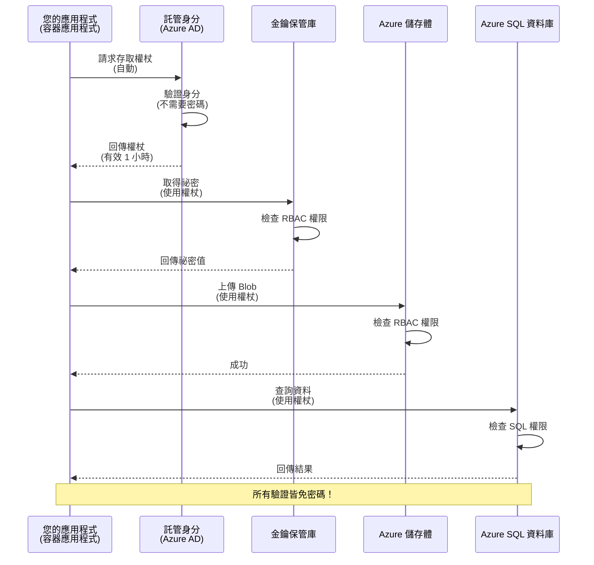
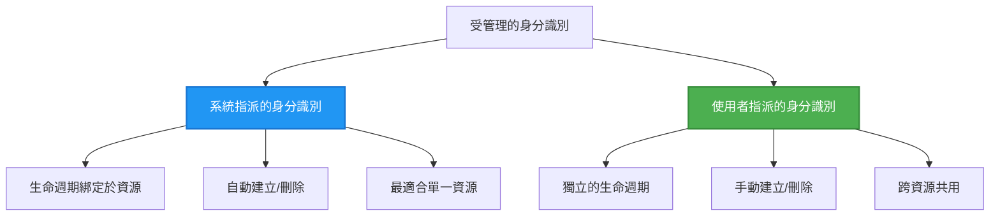

# 認證模式與 Managed Identity

⏱️ **預估時間**: 45-60 分鐘 | 💰 **成本影響**: 免費（無額外費用） | ⭐ **複雜度**: 中等

**📚 學習路徑:**
- ← 上一節: [設定管理](configuration.md) - 管理環境變數與祕密
- 🎯 **你在這裡**: 驗證與安全性 (Managed Identity, Key Vault, 安全模式)
- → 下一節: [第一個專案](first-project.md) - 建立你的第一個 AZD 應用程式
- 🏠 [課程首頁](../../README.md)

---

## 你將學到的內容

完成本課後，你將會：
- 了解 Azure 的驗證模式（金鑰、連接字串、Managed Identity）
- 實作 **Managed Identity** 以達成無密碼驗證
- 透過整合 **Azure Key Vault** 保護祕密
- 為 AZD 部署設定 **基於角色的存取控制 (RBAC)**
- 在 Container Apps 與 Azure 服務套用安全最佳實務
- 從基於金鑰遷移到基於身分的驗證

## 為什麼 Managed Identity 很重要

### 問題：傳統驗證方式

**在 Managed Identity 之前：**
```javascript
// ❌ 安全風險：程式碼中有硬編碼的機密
const connectionString = "Server=mydb.database.windows.net;User=admin;Password=P@ssw0rd123";
const storageKey = "xK7mN9pQ2wR5tY8uI0oP3aS6dF1gH4jK...";
const cosmosKey = "C2x7B9n4M1p8Q5w3E6r0T2y5U8i1O4p7...";
```

**問題：**
- 🔴 **暴露的祕密** 出現在程式碼、設定檔、環境變數中
- 🔴 **憑證輪換** 需要修改程式碼並重新部署
- 🔴 **稽核惡夢** — 誰在何時存取了什麼？
- 🔴 **蔓延** — 祕密分散在多個系統中
- 🔴 **合規風險** — 可能不通過安全稽核

### 解決方案：Managed Identity

**採用 Managed Identity 後：**
```javascript
// ✅ 安全：程式碼中沒有任何祕密
const credential = new DefaultAzureCredential();
const client = new BlobServiceClient(
  "https://mystorageaccount.blob.core.windows.net",
  credential  // Azure 會自動處理身分驗證
);
```

**好處：**
- ✅ **程式碼或設定檔中無祕密**
- ✅ **自動輪換** — 由 Azure 處理
- ✅ **完整稽核紀錄** 在 Azure AD 日誌中
- ✅ **集中式安全管理** — 在 Azure 入口網站管理
- ✅ **符合合規要求** — 符合安全標準

**類比**：傳統驗證就像為不同門攜帶多把實體鑰匙。Managed Identity 就像持有一張安全證件，會根據你的身分自動授權 —— 不用擔心鑰匙遺失、複製或輪換。

---

## 架構概覽

### 使用 Managed Identity 的驗證流程


### Managed Identities 的類型


| 功能 | 系統指派 | 使用者指派 |
|---------|----------------|---------------|
| **生命週期** | 綁定到資源 | 獨立 |
| **建立** | 與資源自動建立 | 手動建立 |
| **刪除** | 隨資源刪除 | 資源刪除後仍存續 |
| **共用** | 僅限單一資源 | 多個資源 |
| **使用情境** | 簡單情境 | 複雜多資源情境 |
| **AZD 預設** | ✅ 推薦 | 選用 |

---

## 先決條件

### 必要工具

你應該已在之前的課程中安裝了以下工具：

```bash
# 驗證 Azure 開發人員 CLI
azd version
# ✅ 預期：azd 版本 1.0.0 或更高

# 驗證 Azure CLI
az --version
# ✅ 預期：azure-cli 2.50.0 或更高
```

### Azure 要求

- 有效的 Azure 訂閱
- 需要以下權限：
  - 建立受管身分
  - 指派 RBAC 角色
  - 建立 Key Vault 資源
  - 部署 Container Apps

### 知識先備

你應該已完成：
- [安裝指南](installation.md) - AZD 設定
- [AZD 基礎](azd-basics.md) - 核心概念
- [設定管理](configuration.md) - 環境變數

---

## 課程 1：了解驗證模式

### 模式 1：連接字串（傳統 - 建議避免）

**運作方式：**
```bash
# 連線字串包含認證資訊
STORAGE_CONNECTION_STRING="DefaultEndpointsProtocol=https;AccountName=myaccount;AccountKey=xK7mN9pQ2wR5..."
COSMOS_CONNECTION_STRING="AccountEndpoint=https://myaccount.documents.azure.com:443/;AccountKey=C2x7..."
SQL_CONNECTION_STRING="Server=myserver.database.windows.net;User=admin;Password=P@ssw0rd..."
```

**問題：**
- ❌ 祕密會出現在環境變數中
- ❌ 會被部署系統記錄
- ❌ 不易輪換
- ❌ 沒有存取稽核紀錄

**何時使用：** 只用於本機開發，絕不可用於生產環境。

---

### 模式 2：Key Vault 參照（較佳）

**運作方式：**
```bicep
// Store secret in Key Vault
resource keyVault 'Microsoft.KeyVault/vaults@2023-02-01' = {
  name: 'mykv'
  properties: {
    enableRbacAuthorization: true
  }
}

// Reference in Container App
env: [
  {
    name: 'STORAGE_KEY'
    secretRef: 'storage-key'  // References Key Vault
  }
]
```

**好處：**
- ✅ 將祕密安全儲存在 Key Vault
- ✅ 集中式祕密管理
- ✅ 輪換無需修改程式碼

**限制：**
- ⚠️ 仍在使用金鑰/密碼
- ⚠️ 需要管理 Key Vault 的存取權

**何時使用：** 從連接字串過渡到 Managed Identity 的階段性做法。

---

### 模式 3：Managed Identity（最佳實務）

**運作方式：**
```bicep
// Enable managed identity
resource containerApp 'Microsoft.App/containerApps@2023-05-01' = {
  name: 'myapp'
  identity: {
    type: 'SystemAssigned'  // Automatically creates identity
  }
}

// Grant permissions
resource roleAssignment 'Microsoft.Authorization/roleAssignments@2022-04-01' = {
  scope: storageAccount
  properties: {
    roleDefinitionId: storageBlobDataContributorRole
    principalId: containerApp.identity.principalId
  }
}
```

**應用程式程式碼：**
```javascript
// 不需要機密！
const { DefaultAzureCredential } = require('@azure/identity');
const { BlobServiceClient } = require('@azure/storage-blob');

const credential = new DefaultAzureCredential();
const blobServiceClient = new BlobServiceClient(
  'https://mystorageaccount.blob.core.windows.net',
  credential
);
```

**好處：**
- ✅ 程式碼/設定檔中無祕密
- ✅ 憑證自動輪換
- ✅ 完整稽核紀錄
- ✅ 基於 RBAC 的權限控管
- ✅ 符合合規要求

**何時使用：** 生產應用請始終使用。

---

## 課程 2：在 AZD 中實作 Managed Identity

### 逐步實作

我們來建立一個安全的 Container App，使用 Managed Identity 存取 Azure Storage 與 Key Vault。

### 專案結構

```
secure-app/
├── azure.yaml                 # AZD configuration
├── infra/
│   ├── main.bicep            # Main infrastructure
│   ├── core/
│   │   ├── identity.bicep    # Managed identity setup
│   │   ├── keyvault.bicep    # Key Vault configuration
│   │   └── storage.bicep     # Storage with RBAC
│   └── app/
│       └── container-app.bicep
└── src/
    ├── app.js                # Application code
    ├── package.json
    └── Dockerfile
```

### 1. 設定 AZD (azure.yaml)

```yaml
name: secure-app
metadata:
  template: secure-app@1.0.0

services:
  api:
    project: ./src
    language: js
    host: containerapp

# Enable managed identity (AZD handles this automatically)
```

### 2. 基礎架構：啟用 Managed Identity

**檔案：`infra/main.bicep`**

```bicep
targetScope = 'subscription'

param environmentName string
param location string = 'eastus'

var tags = { 'azd-env-name': environmentName }

// Resource group
resource rg 'Microsoft.Resources/resourceGroups@2021-04-01' = {
  name: 'rg-${environmentName}'
  location: location
  tags: tags
}

// Storage Account
module storage './core/storage.bicep' = {
  name: 'storage'
  scope: rg
  params: {
    name: 'st${uniqueString(rg.id)}'
    location: location
    tags: tags
  }
}

// Key Vault
module keyVault './core/keyvault.bicep' = {
  name: 'keyvault'
  scope: rg
  params: {
    name: 'kv-${uniqueString(rg.id)}'
    location: location
    tags: tags
  }
}

// Container App with Managed Identity
module containerApp './app/container-app.bicep' = {
  name: 'container-app'
  scope: rg
  params: {
    name: 'ca-${environmentName}'
    location: location
    tags: tags
    storageAccountName: storage.outputs.name
    keyVaultName: keyVault.outputs.name
  }
}

// Grant Container App access to Storage
module storageRoleAssignment './core/role-assignment.bicep' = {
  name: 'storage-role'
  scope: rg
  params: {
    principalId: containerApp.outputs.identityPrincipalId
    roleDefinitionId: 'ba92f5b4-2d11-453d-a403-e96b0029c9fe'  // Storage Blob Data Contributor
    targetResourceId: storage.outputs.id
  }
}

// Grant Container App access to Key Vault
module kvRoleAssignment './core/role-assignment.bicep' = {
  name: 'kv-role'
  scope: rg
  params: {
    principalId: containerApp.outputs.identityPrincipalId
    roleDefinitionId: '4633458b-17de-408a-b874-0445c86b69e6'  // Key Vault Secrets User
    targetResourceId: keyVault.outputs.id
  }
}

// Outputs
output AZURE_STORAGE_ACCOUNT_NAME string = storage.outputs.name
output AZURE_KEY_VAULT_NAME string = keyVault.outputs.name
output APP_URL string = containerApp.outputs.url
```

### 3. Container App 使用系統指派身分

**檔案：`infra/app/container-app.bicep`**

```bicep
param name string
param location string
param tags object = {}
param storageAccountName string
param keyVaultName string

resource containerApp 'Microsoft.App/containerApps@2023-05-01' = {
  name: name
  location: location
  tags: tags
  identity: {
    type: 'SystemAssigned'  // 🔑 Enable managed identity
  }
  properties: {
    configuration: {
      ingress: {
        external: true
        targetPort: 3000
      }
    }
    template: {
      containers: [
        {
          name: 'api'
          image: 'myregistry.azurecr.io/api:latest'
          resources: {
            cpu: json('0.5')
            memory: '1Gi'
          }
          env: [
            {
              name: 'AZURE_STORAGE_ACCOUNT_NAME'
              value: storageAccountName
            }
            {
              name: 'AZURE_KEY_VAULT_NAME'
              value: keyVaultName
            }
            // 🔑 No secrets - managed identity handles authentication!
          ]
        }
      ]
    }
  }
}

// Output the identity for RBAC assignments
output identityPrincipalId string = containerApp.identity.principalId
output id string = containerApp.id
output url string = 'https://${containerApp.properties.configuration.ingress.fqdn}'
```

### 4. RBAC 角色指派模組

**檔案：`infra/core/role-assignment.bicep`**

```bicep
param principalId string
param roleDefinitionId string  // Azure built-in role ID
param targetResourceId string

resource roleAssignment 'Microsoft.Authorization/roleAssignments@2022-04-01' = {
  name: guid(principalId, roleDefinitionId, targetResourceId)
  scope: resourceId('Microsoft.Resources/resourceGroups', resourceGroup().name)
  properties: {
    roleDefinitionId: subscriptionResourceId('Microsoft.Authorization/roleDefinitions', roleDefinitionId)
    principalId: principalId
    principalType: 'ServicePrincipal'
  }
}

output id string = roleAssignment.id
```

### 5. 使用 Managed Identity 的應用程式程式碼

**檔案：`src/app.js`**

```javascript
const express = require('express');
const { DefaultAzureCredential } = require('@azure/identity');
const { BlobServiceClient } = require('@azure/storage-blob');
const { SecretClient } = require('@azure/keyvault-secrets');

const app = express();
const PORT = process.env.PORT || 3000;

// 🔑 初始化認證（可與託管身分自動運作）
const credential = new DefaultAzureCredential();

// Azure 儲存體設定
const storageAccountName = process.env.AZURE_STORAGE_ACCOUNT_NAME;
const blobServiceClient = new BlobServiceClient(
  `https://${storageAccountName}.blob.core.windows.net`,
  credential  // 不需要金鑰！
);

// Key Vault 設定
const keyVaultName = process.env.AZURE_KEY_VAULT_NAME;
const secretClient = new SecretClient(
  `https://${keyVaultName}.vault.azure.net`,
  credential  // 不需要金鑰！
);

// 健康檢查
app.get('/health', (req, res) => {
  res.json({ status: 'healthy', authentication: 'managed-identity' });
});

// 將檔案上傳到 Blob 儲存體
app.post('/upload', async (req, res) => {
  try {
    const containerClient = blobServiceClient.getContainerClient('uploads');
    await containerClient.createIfNotExists();
    
    const blobName = `file-${Date.now()}.txt`;
    const blockBlobClient = containerClient.getBlockBlobClient(blobName);
    
    await blockBlobClient.upload('Hello from managed identity!', 30);
    
    res.json({
      success: true,
      blobName: blobName,
      message: 'File uploaded using managed identity!'
    });
  } catch (error) {
    console.error('Upload error:', error);
    res.status(500).json({ error: error.message });
  }
});

// 從 Key Vault 取得機密
app.get('/secret/:name', async (req, res) => {
  try {
    const secretName = req.params.name;
    const secret = await secretClient.getSecret(secretName);
    
    res.json({
      name: secretName,
      value: secret.value,
      message: 'Secret retrieved using managed identity!'
    });
  } catch (error) {
    console.error('Secret error:', error);
    res.status(500).json({ error: error.message });
  }
});

// 列出 Blob 容器（示範讀取存取權限）
app.get('/containers', async (req, res) => {
  try {
    const containers = [];
    for await (const container of blobServiceClient.listContainers()) {
      containers.push(container.name);
    }
    
    res.json({
      containers: containers,
      count: containers.length,
      message: 'Containers listed using managed identity!'
    });
  } catch (error) {
    console.error('List error:', error);
    res.status(500).json({ error: error.message });
  }
});

app.listen(PORT, () => {
  console.log(`Secure API listening on port ${PORT}`);
  console.log('Authentication: Managed Identity (passwordless)');
});
```

**檔案：`src/package.json`**

```json
{
  "name": "secure-app",
  "version": "1.0.0",
  "dependencies": {
    "express": "^4.18.2",
    "@azure/identity": "^4.0.0",
    "@azure/storage-blob": "^12.17.0",
    "@azure/keyvault-secrets": "^4.7.0"
  },
  "scripts": {
    "start": "node app.js"
  }
}
```

### 6. 部署與測試

```bash
# 初始化 AZD 環境
azd init

# 部署基礎架構和應用程式
azd up

# 取得應用程式 URL
APP_URL=$(azd env get-values | grep APP_URL | cut -d '=' -f2 | tr -d '"')

# 測試健康檢查
curl $APP_URL/health
```

**✅ 預期輸出：**
```json
{
  "status": "healthy",
  "authentication": "managed-identity"
}
```

**測試 blob 上傳：**
```bash
curl -X POST $APP_URL/upload
```

**✅ 預期輸出：**
```json
{
  "success": true,
  "blobName": "file-1700404800000.txt",
  "message": "File uploaded using managed identity!"
}
```

**測試容器列舉：**
```bash
curl $APP_URL/containers
```

**✅ 預期輸出：**
```json
{
  "containers": ["uploads"],
  "count": 1,
  "message": "Containers listed using managed identity!"
}
```

---

## 常用 Azure RBAC 角色

### Managed Identity 的內建角色 ID

| 服務 | 角色名稱 | 角色 ID | 權限 |
|---------|-----------|---------|-------------|
| **Storage** | Storage Blob Data Reader | `2a2b9908-6b94-4a3d-8e5a-a7d8f8cc8a12` | 讀取 blobs 與容器 |
| **Storage** | Storage Blob Data Contributor | `ba92f5b4-2d11-453d-a403-e96b0029c9fe` | 讀取、寫入、刪除 blobs |
| **Storage** | Storage Queue Data Contributor | `974c5e8b-45b9-4653-ba55-5f855dd0fb88` | 讀取、寫入、刪除佇列訊息 |
| **Key Vault** | Key Vault Secrets User | `4633458b-17de-408a-b874-0445c86b69e6` | 讀取祕密 |
| **Key Vault** | Key Vault Secrets Officer | `b86a8fe4-44ce-4948-aee5-eccb2c155cd7` | 讀取、寫入、刪除祕密 |
| **Cosmos DB** | Cosmos DB Built-in Data Reader | `00000000-0000-0000-0000-000000000001` | 讀取 Cosmos DB 資料 |
| **Cosmos DB** | Cosmos DB Built-in Data Contributor | `00000000-0000-0000-0000-000000000002` | 讀取、寫入 Cosmos DB 資料 |
| **SQL Database** | SQL DB Contributor | `9b7fa17d-e63e-47b0-bb0a-15c516ac86ec` | 管理 SQL 資料庫 |
| **Service Bus** | Azure Service Bus Data Owner | `090c5cfd-751d-490a-894a-3ce6f1109419` | 傳送、接收與管理訊息 |

### 如何找到角色 ID

```bash
# 列出所有內建角色
az role definition list --query "[].{Name:roleName, ID:name}" --output table

# 搜尋特定角色
az role definition list --query "[?contains(roleName, 'Storage Blob')].{Name:roleName, ID:name}" --output table

# 取得角色詳細資訊
az role definition list --name "Storage Blob Data Contributor"
```

---

## 實作練習

### 練習 1：為既有應用啟用 Managed Identity ⭐⭐（中等）

**目標**：為現有的 Container App 部署新增 managed identity

**情境**：你有一個使用連接字串的 Container App。將其轉換為使用 managed identity。

**起始條件**：具有下列設定的 Container App：

```bicep
// ❌ Current: Using connection string
env: [
  {
    name: 'STORAGE_CONNECTION_STRING'
    secretRef: 'storage-connection'
  }
]
```

**步驟：**

1. **在 Bicep 中啟用 managed identity：**

```bicep
resource containerApp 'Microsoft.App/containerApps@2023-05-01' = {
  name: 'myapp'
  identity: {
    type: 'SystemAssigned'  // Add this
  }
  // ... rest of configuration
}
```

2. **授予 Storage 存取權：**

```bicep
// Get storage account reference
resource storageAccount 'Microsoft.Storage/storageAccounts@2023-01-01' existing = {
  name: storageAccountName
}

// Assign role
resource roleAssignment 'Microsoft.Authorization/roleAssignments@2022-04-01' = {
  name: guid(containerApp.id, 'ba92f5b4-2d11-453d-a403-e96b0029c9fe', storageAccount.id)
  scope: storageAccount
  properties: {
    roleDefinitionId: subscriptionResourceId('Microsoft.Authorization/roleDefinitions', 'ba92f5b4-2d11-453d-a403-e96b0029c9fe')
    principalId: containerApp.identity.principalId
    principalType: 'ServicePrincipal'
  }
}
```

3. **更新應用程式程式碼：**

**更新前（連接字串）：**
```javascript
const { BlobServiceClient } = require('@azure/storage-blob');

const blobServiceClient = BlobServiceClient.fromConnectionString(
  process.env.STORAGE_CONNECTION_STRING
);
```

**更新後（managed identity）：**
```javascript
const { DefaultAzureCredential } = require('@azure/identity');
const { BlobServiceClient } = require('@azure/storage-blob');

const credential = new DefaultAzureCredential();
const blobServiceClient = new BlobServiceClient(
  `https://${process.env.STORAGE_ACCOUNT_NAME}.blob.core.windows.net`,
  credential
);
```

4. **更新環境變數：**

```bicep
env: [
  {
    name: 'STORAGE_ACCOUNT_NAME'
    value: storageAccountName  // Just the name, no secrets!
  }
  // Remove STORAGE_CONNECTION_STRING
]
```

5. **部署與測試：**

```bash
# 重新部署
azd up

# 測試它是否仍能正常運作
curl https://myapp.azurecontainerapps.io/upload
```

**✅ 成功準則：**
- ✅ 應用部署成功且無錯誤
- ✅ Storage 操作可用（上傳、列舉、下載）
- ✅ 環境變數中沒有連接字串
- ✅ 在 Azure 入口網站的「Identity」頁面可以看到身分

**驗證：**

```bash
# 檢查是否已啟用受管理身分識別
az containerapp show \
  --name myapp \
  --resource-group rg-myapp \
  --query "identity.type"
# ✅ 預期: "SystemAssigned"

# 檢查角色指派
az role assignment list \
  --assignee $(az containerapp show --name myapp --resource-group rg-myapp --query "identity.principalId" -o tsv) \
  --scope /subscriptions/{sub-id}/resourceGroups/rg-myapp/providers/Microsoft.Storage/storageAccounts/mystorageaccount
# ✅ 預期: 顯示 "Storage Blob Data Contributor" 角色
```

**時間**：20-30 分鐘

---

### 練習 2：使用使用者指派身分的多服務存取 ⭐⭐⭐（進階）

**目標**：建立一個可由多個 Container Apps 共用的使用者指派身分

**情境**：你有 3 個微服務都需要存取相同的 Storage 帳戶與 Key Vault。

**步驟**：

1. **建立使用者指派身分：**

**檔案：`infra/core/identity.bicep`**

```bicep
param name string
param location string
param tags object = {}

resource userAssignedIdentity 'Microsoft.ManagedIdentity/userAssignedIdentities@2023-01-31' = {
  name: name
  location: location
  tags: tags
}

output id string = userAssignedIdentity.id
output principalId string = userAssignedIdentity.properties.principalId
output clientId string = userAssignedIdentity.properties.clientId
```

2. **將角色指派給使用者指派身分：**

```bicep
// In main.bicep
module userIdentity './core/identity.bicep' = {
  name: 'user-identity'
  scope: rg
  params: {
    name: 'id-${environmentName}'
    location: location
    tags: tags
  }
}

// Grant Storage access
resource storageRoleAssignment 'Microsoft.Authorization/roleAssignments@2022-04-01' = {
  name: guid(userIdentity.outputs.principalId, 'storage-contributor')
  scope: storageAccount
  properties: {
    roleDefinitionId: subscriptionResourceId('Microsoft.Authorization/roleDefinitions', 'ba92f5b4-2d11-453d-a403-e96b0029c9fe')
    principalId: userIdentity.outputs.principalId
    principalType: 'ServicePrincipal'
  }
}

// Grant Key Vault access
resource kvRoleAssignment 'Microsoft.Authorization/roleAssignments@2022-04-01' = {
  name: guid(userIdentity.outputs.principalId, 'kv-secrets-user')
  scope: keyVault
  properties: {
    roleDefinitionId: subscriptionResourceId('Microsoft.Authorization/roleDefinitions', '4633458b-17de-408a-b874-0445c86b69e6')
    principalId: userIdentity.outputs.principalId
    principalType: 'ServicePrincipal'
  }
}
```

3. **將身分指派給多個 Container Apps：**

```bicep
resource apiGateway 'Microsoft.App/containerApps@2023-05-01' = {
  name: 'api-gateway'
  identity: {
    type: 'UserAssigned'
    userAssignedIdentities: {
      '${userIdentity.outputs.id}': {}
    }
  }
  // ... rest of config
}

resource productService 'Microsoft.App/containerApps@2023-05-01' = {
  name: 'product-service'
  identity: {
    type: 'UserAssigned'
    userAssignedIdentities: {
      '${userIdentity.outputs.id}': {}
    }
  }
  // ... rest of config
}

resource orderService 'Microsoft.App/containerApps@2023-05-01' = {
  name: 'order-service'
  identity: {
    type: 'UserAssigned'
    userAssignedIdentities: {
      '${userIdentity.outputs.id}': {}
    }
  }
  // ... rest of config
}
```

4. **應用程式程式碼（所有服務使用相同模式）：**

```javascript
const { DefaultAzureCredential, ManagedIdentityCredential } = require('@azure/identity');

// 對於使用者指派的身分，請指定用戶端識別碼
const credential = new ManagedIdentityCredential(
  process.env.AZURE_CLIENT_ID  // 使用者指派身分的用戶端識別碼
);

// 或使用 DefaultAzureCredential（自動偵測）
const credential = new DefaultAzureCredential();

const blobServiceClient = new BlobServiceClient(
  `https://${process.env.STORAGE_ACCOUNT_NAME}.blob.core.windows.net`,
  credential
);
```

5. **部署並驗證：**

```bash
azd up

# 測試所有服務是否可以存取儲存空間
curl https://api-gateway.azurecontainerapps.io/upload
curl https://product-service.azurecontainerapps.io/upload
curl https://order-service.azurecontainerapps.io/upload
```

**✅ 成功準則：**
- ✅ 單一身分可由 3 個服務共用
- ✅ 所有服務都能存取 Storage 與 Key Vault
- ✅ 刪除某個服務後身分仍然保留
- ✅ 權限集中管理

**使用者指派身分的好處：**
- 可管理單一身分
- 各服務之間的權限一致
- 刪除服務時身分不會消失
- 較適合複雜架構

**時間**：30-40 分鐘

---

### 練習 3：實作 Key Vault 祕密輪換 ⭐⭐⭐（進階）

**目標**：將第三方 API 金鑰儲存在 Key Vault，並使用 managed identity 存取

**情境**：你的應用需要呼叫需要 API 金鑰的外部 API（OpenAI、Stripe、SendGrid）。

**步驟**：

1. **建立使用 RBAC 的 Key Vault：**

**檔案：`infra/core/keyvault.bicep`**

```bicep
param name string
param location string
param tags object = {}

resource keyVault 'Microsoft.KeyVault/vaults@2023-02-01' = {
  name: name
  location: location
  tags: tags
  properties: {
    enableRbacAuthorization: true  // Use RBAC instead of access policies
    sku: {
      family: 'A'
      name: 'standard'
    }
    tenantId: subscription().tenantId
    enableSoftDelete: true
    softDeleteRetentionInDays: 90
  }
}

// Allow Container App to read secrets
output id string = keyVault.id
output name string = keyVault.name
output uri string = keyVault.properties.vaultUri
```

2. **在 Key Vault 儲存祕密：**

```bash
# 取得金鑰保管庫名稱
KV_NAME=$(azd env get-values | grep AZURE_KEY_VAULT_NAME | cut -d '=' -f2 | tr -d '"')

# 儲存第三方 API 金鑰
az keyvault secret set \
  --vault-name $KV_NAME \
  --name "OpenAI-ApiKey" \
  --value "sk-proj-xxxxxxxxxxxxx"

az keyvault secret set \
  --vault-name $KV_NAME \
  --name "Stripe-ApiKey" \
  --value "sk_live_xxxxxxxxxxxxx"

az keyvault secret set \
  --vault-name $KV_NAME \
  --name "SendGrid-ApiKey" \
  --value "SG.xxxxxxxxxxxxx"
```

3. **用於擷取祕密的應用程式程式碼：**

**檔案：`src/config.js`**

```javascript
const { DefaultAzureCredential } = require('@azure/identity');
const { SecretClient } = require('@azure/keyvault-secrets');

class Config {
  constructor() {
    this.credential = new DefaultAzureCredential();
    this.secretClient = new SecretClient(
      `https://${process.env.AZURE_KEY_VAULT_NAME}.vault.azure.net`,
      this.credential
    );
    this.cache = {};
  }

  async getSecret(secretName) {
    // 先檢查快取
    if (this.cache[secretName]) {
      return this.cache[secretName];
    }

    try {
      const secret = await this.secretClient.getSecret(secretName);
      this.cache[secretName] = secret.value;
      console.log(`✅ Retrieved secret: ${secretName}`);
      return secret.value;
    } catch (error) {
      console.error(`❌ Failed to get secret ${secretName}:`, error.message);
      throw error;
    }
  }

  async getOpenAIKey() {
    return this.getSecret('OpenAI-ApiKey');
  }

  async getStripeKey() {
    return this.getSecret('Stripe-ApiKey');
  }

  async getSendGridKey() {
    return this.getSecret('SendGrid-ApiKey');
  }
}

module.exports = new Config();
```

4. **在應用程式中使用祕密：**

**檔案：`src/app.js`**

```javascript
const express = require('express');
const config = require('./config');
const { OpenAI } = require('openai');

const app = express();

// 使用來自 Key Vault 的金鑰初始化 OpenAI
let openaiClient;

async function initializeServices() {
  const openaiKey = await config.getOpenAIKey();
  openaiClient = new OpenAI({ apiKey: openaiKey });
  console.log('✅ Services initialized with secrets from Key Vault');
}

// 在啟動時呼叫
initializeServices().catch(console.error);

app.post('/chat', async (req, res) => {
  try {
    const completion = await openaiClient.chat.completions.create({
      model: 'gpt-4',
      messages: [{ role: 'user', content: 'Hello!' }]
    });
    
    res.json({
      response: completion.choices[0].message.content,
      authentication: 'Key from Key Vault via Managed Identity'
    });
  } catch (error) {
    res.status(500).json({ error: error.message });
  }
});

app.listen(3000, () => {
  console.log('Secure API with Key Vault integration running');
});
```

5. **部署與測試：**

```bash
azd up

# 測試 API 金鑰是否能正常運作
curl -X POST https://myapp.azurecontainerapps.io/chat \
  -H "Content-Type: application/json" \
  -d '{"message":"Hello AI"}'
```

**✅ 成功準則：**
- ✅ 程式碼或環境變數中沒有 API 金鑰
- ✅ 應用程式能從 Key Vault 擷取金鑰
- ✅ 第三方 API 正常運作
- ✅ 可在不修改程式碼的情況下輪換金鑰

**輪換祕密：**

```bash
# 在金鑰保管庫更新機密
az keyvault secret set \
  --vault-name $KV_NAME \
  --name "OpenAI-ApiKey" \
  --value "sk-proj-NEW_KEY_HERE"

# 重新啟動應用程式以套用新的金鑰
az containerapp revision restart \
  --name myapp \
  --resource-group rg-myapp
```

**時間**：25-35 分鐘

---

## 知識檢核點

### 1. 驗證模式 ✓

測試你的理解：

- [ ] **Q1**：三種主要的驗證模式是什麼？ 
  - **A**：連接字串（傳統）、Key Vault 參照（過渡）、Managed Identity（最佳）

- [ ] **Q2**：為何 Managed Identity 比連接字串好？
  - **A**：程式碼中無祕密、自動輪換、完整稽核紀錄、RBAC 權限

- [ ] **Q3**：何時會使用使用者指派身分而非系統指派？
  - **A**：當要在多個資源間共用身分，或身分的生命週期需獨立於資源時

**實作驗證：**
```bash
# 檢查您的應用程式使用哪種類型的身分識別
az containerapp show \
  --name myapp \
  --resource-group rg-myapp \
  --query "identity.type"

# 列出該身分識別的所有角色指派
az role assignment list \
  --assignee $(az containerapp show --name myapp --resource-group rg-myapp --query "identity.principalId" -o tsv)
```

---

### 2. RBAC 與權限 ✓

測試你的理解：

- [ ] **Q1**：`Storage Blob Data Contributor` 的角色 ID 為何？
  - **A**：`ba92f5b4-2d11-453d-a403-e96b0029c9fe`

- [ ] **Q2**：`Key Vault Secrets User` 提供什麼權限？
  - **A**：對祕密的唯讀存取（無法建立、更新或刪除）

- [ ] **Q3**：如何授予 Container App 存取 Azure SQL？
  - **A**：指派「SQL DB Contributor」角色或為 SQL 設定 Azure AD 驗證

**實作驗證：**
```bash
# 尋找特定角色
az role definition list --name "Storage Blob Data Contributor"

# 檢查指派給你的身分有哪些角色
PRINCIPAL_ID=$(az containerapp show --name myapp --resource-group rg-myapp --query "identity.principalId" -o tsv)
az role assignment list --assignee $PRINCIPAL_ID --output table
```

---

### 3. Key Vault 整合 ✓

測試你的理解：
- [ ] **Q1**: 如何為 Key Vault 啟用 RBAC，而不是使用存取原則？
  - **A**: 在 Bicep 中設定 `enableRbacAuthorization: true`

- [ ] **Q2**: 哪個 Azure SDK 函式庫處理託管身分驗證？
  - **A**: `@azure/identity` 與 `DefaultAzureCredential` 類別

- [ ] **Q3**: Key Vault 機密在快取中會保留多久？
  - **A**: 視應用程式而定；請實作您自己的快取策略

**Hands-On Verification:**
```bash
# 測試 Key Vault 存取權限
az keyvault secret show \
  --vault-name $KV_NAME \
  --name "OpenAI-ApiKey" \
  --query "value"

# 檢查是否已啟用 RBAC
az keyvault show \
  --name $KV_NAME \
  --query "properties.enableRbacAuthorization"
# ✅ 預期：true
```

---

## 安全最佳實務

### ✅ 建議執行：

1. **在生產環境中務必使用託管身分**
   ```bicep
   identity: {
     type: 'SystemAssigned'
   }
   ```

2. **使用最小權限的 RBAC 角色**
   - 儘可能使用「Reader」角色
   - 避免使用「Owner」或「Contributor」，除非必要

3. **將第三方金鑰儲存在 Key Vault 中**
   ```javascript
   const apiKey = await secretClient.getSecret('ThirdPartyApiKey');
   ```

4. **啟用稽核記錄**
   ```bicep
   diagnosticSettings: {
     logs: [{ category: 'AuditEvent', enabled: true }]
   }
   ```

5. **為 dev/staging/prod 使用不同的身分**
   ```bash
   azd env new dev
   azd env new staging
   azd env new prod
   ```

6. **定期輪換機密**
   - 為 Key Vault 機密設定到期日
   - 使用 Azure Functions 自動化輪換

### ❌ 不要：

1. **切勿將機密硬編碼**
   ```javascript
   // ❌ 不好
   const apiKey = "sk-proj-xxxxxxxxxxxxx";
   ```

2. **生產環境不要使用連線字串**
   ```javascript
   // ❌ 不好
   BlobServiceClient.fromConnectionString(process.env.STORAGE_CONNECTION_STRING)
   ```

3. **不要授予過度權限**
   ```bicep
   // ❌ BAD - too much access
   roleDefinitionId: 'Owner'
   
   // ✅ GOOD - least privilege
   roleDefinitionId: 'Storage Blob Data Reader'
   ```

4. **不要將機密寫入日誌**
   ```javascript
   // ❌ 不好
   console.log('API Key:', apiKey);
   
   // ✅ 好
   console.log('API Key retrieved successfully');
   ```

5. **不要在不同環境間共用生產身分**
   ```bicep
   // ❌ BAD - same identity for dev and prod
   // ✅ GOOD - separate identities per environment
   ```

---

## 疑難排解指南

### 問題：存取 Azure Storage 時出現「Unauthorized」

**症狀：**
```
Error: Unauthorized (403)
AuthorizationPermissionMismatch: This request is not authorized to perform this operation
```

**診斷：**

```bash
# 檢查是否已啟用託管身分識別
az containerapp show \
  --name myapp \
  --resource-group rg-myapp \
  --query "identity.type"
# ✅ 預期：「SystemAssigned」或「UserAssigned」

# 檢查角色指派
PRINCIPAL_ID=$(az containerapp show --name myapp --resource-group rg-myapp --query "identity.principalId" -o tsv)
az role assignment list --assignee $PRINCIPAL_ID

# 預期：應該會看到「Storage Blob Data Contributor」或類似的角色
```

**解決方案：**

1. **授予正確的 RBAC 角色：**
```bash
STORAGE_ID=$(az storage account show --name mystorageaccount --resource-group rg-myapp --query "id" -o tsv)
az role assignment create \
  --assignee $PRINCIPAL_ID \
  --role "Storage Blob Data Contributor" \
  --scope $STORAGE_ID
```

2. **等待變更傳播（可能需要 5-10 分鐘）：**
```bash
# 檢查角色指派狀態
az role assignment list --assignee $PRINCIPAL_ID --scope $STORAGE_ID
```

3. **確認應用程式程式碼使用正確的認證：**
```javascript
// 請確認您正在使用 DefaultAzureCredential
const credential = new DefaultAzureCredential();
```

---

### 問題：Key Vault 存取被拒

**症狀：**
```
Error: Forbidden (403)
The user, group or application does not have secrets get permission
```

**診斷：**

```bash
# 檢查 Key Vault 的 RBAC 是否已啟用
az keyvault show \
  --name $KV_NAME \
  --query "properties.enableRbacAuthorization"
# ✅ 預期：true

# 檢查角色指派
az role assignment list \
  --assignee $PRINCIPAL_ID \
  --scope /subscriptions/{sub-id}/resourceGroups/rg-myapp/providers/Microsoft.KeyVault/vaults/$KV_NAME
```

**解決方案：**

1. **在 Key Vault 上啟用 RBAC：**
```bash
az keyvault update \
  --name $KV_NAME \
  --enable-rbac-authorization true
```

2. **授予 Key Vault Secrets User 角色：**
```bash
KV_ID=$(az keyvault show --name $KV_NAME --query "id" -o tsv)
az role assignment create \
  --assignee $PRINCIPAL_ID \
  --role "Key Vault Secrets User" \
  --scope $KV_ID
```

---

### 問題：DefaultAzureCredential 在本機失敗

**症狀：**
```
Error: DefaultAzureCredential failed to retrieve a token
CredentialUnavailableError: No credential available
```

**診斷：**

```bash
# 檢查您是否已登入
az account show

# 檢查 Azure CLI 是否已驗證
az ad signed-in-user show
```

**解決方案：**

1. **登入 Azure CLI：**
```bash
az login
```

2. **設定 Azure 訂用帳戶：**
```bash
az account set --subscription "Your Subscription Name"
```

3. **在本機開發時，使用環境變數：**
```bash
export AZURE_TENANT_ID="your-tenant-id"
export AZURE_CLIENT_ID="your-client-id"
export AZURE_CLIENT_SECRET="your-client-secret"
```

4. **或在本機使用其他認證：**
```javascript
const { DefaultAzureCredential, AzureCliCredential } = require('@azure/identity');

// 在本機開發時使用 AzureCliCredential
const credential = process.env.NODE_ENV === 'production' 
  ? new DefaultAzureCredential()
  : new AzureCliCredential();
```

---

### 問題：角色指派傳播花太久

**症狀：**
- 角色已成功指派
- 仍然收到 403 錯誤
- 存取間歇性（有時可用，有時不可）

**說明：**
Azure RBAC 的變更可能需要 5-10 分鐘才能全球性傳播。

**解決方法：**

```bash
# 等待並重試
echo "Waiting for RBAC propagation..."
sleep 300  # 等待 5 分鐘

# 測試存取
curl https://myapp.azurecontainerapps.io/upload

# 如果仍然失敗，請重新啟動應用程式
az containerapp revision restart \
  --name myapp \
  --resource-group rg-myapp
```

---

## 成本考量

### 託管身分成本

| 資源 | 成本 |
|----------|------|
| **託管身分** | 🆓 **免費** - 不收費 |
| **RBAC 角色指派** | 🆓 **免費** - 不收費 |
| **Azure AD 令牌請求** | 🆓 **免費** - 包含在內 |
| **Key Vault 操作** | $0.03 每 10,000 次操作 |
| **Key Vault 儲存** | $0.024 每個機密每月 |

**託管身分可以節省成本：**
- ✅ 消除服務間驗證所需的 Key Vault 操作
- ✅ 減少資安事件（沒有洩露的憑證）
- ✅ 降低營運負擔（不需手動輪換）

**範例成本比較（每月）：**

| 情境 | 連線字串 | 託管身分 | 節省 |
|----------|-------------------|-----------------|---------|
| 小型應用程式（1M 請求） | ~$50（Key Vault + 操作） | ~$0 | $50/月 |
| 中型應用程式（10M 請求） | ~$200 | ~$0 | $200/月 |
| 大型應用程式（100M 請求） | ~$1,500 | ~$0 | $1,500/月 |

---

## 延伸閱讀

### 官方文件
- [Azure Managed Identity](https://learn.microsoft.com/entra/identity/managed-identities-azure-resources/overview)
- [Azure RBAC](https://learn.microsoft.com/azure/role-based-access-control/overview)
- [Azure Key Vault](https://learn.microsoft.com/azure/key-vault/general/overview)
- [DefaultAzureCredential](https://learn.microsoft.com/dotnet/api/azure.identity.defaultazurecredential)

### SDK 文件
- [@azure/identity (Node.js)](https://www.npmjs.com/package/@azure/identity)
- [Azure.Identity (C#)](https://www.nuget.org/packages/Azure.Identity/)
- [azure-identity (Python)](https://pypi.org/project/azure-identity/)

### 本課程的下一步
- ← 上一節： [Configuration Management](configuration.md)
- → 下一節： [First Project](first-project.md)
- 🏠 [Course Home](../../README.md)

### 相關範例
- [Azure OpenAI Chat Example](../../../../examples/azure-openai-chat) - 使用託管身分來存取 Azure OpenAI
- [Microservices Example](../../../../examples/microservices) - 多服務驗證模式

---

## 小結

**您已學到：**
- ✅ 三種驗證模式（連線字串、Key Vault、託管身分）
- ✅ 如何在 AZD 中啟用與設定託管身分
- ✅ Azure 服務的 RBAC 角色指派
- ✅ Key Vault 與第三方機密的整合
- ✅ 使用者指派與系統指派身分
- ✅ 安全最佳實務與疑難排解

**重點摘要：**
1. **在生產環境中務必使用託管身分** - 無需秘鑰、自動輪換
2. **使用最小權限的 RBAC 角色** - 只授予必要權限
3. **將第三方金鑰儲存在 Key Vault** - 集中管理機密
4. **為每個環境分離身分** - 開發、測試、生產隔離
5. **啟用稽核日誌** - 追蹤誰存取了什麼

**下一步：**
1. 完成上述實作練習
2. 將現有應用從連線字串遷移到託管身分
3. 建立您的第一個 AZD 專案，從一開始就把安全性放在首位： [First Project](first-project.md)

---

<!-- CO-OP TRANSLATOR DISCLAIMER START -->
**免責聲明**：
本文件已使用 AI 翻譯服務 Co‑op Translator（https://github.com/Azure/co-op-translator）進行翻譯。雖然我們盡力確保準確性，但請注意自動翻譯可能包含錯誤或不精確之處。原始語言的文件應被視為具權威性的來源。若涉及重要資訊，建議採用專業人工翻譯。對於因使用本翻譯而產生的任何誤解或誤釋，我們不負任何責任。
<!-- CO-OP TRANSLATOR DISCLAIMER END -->