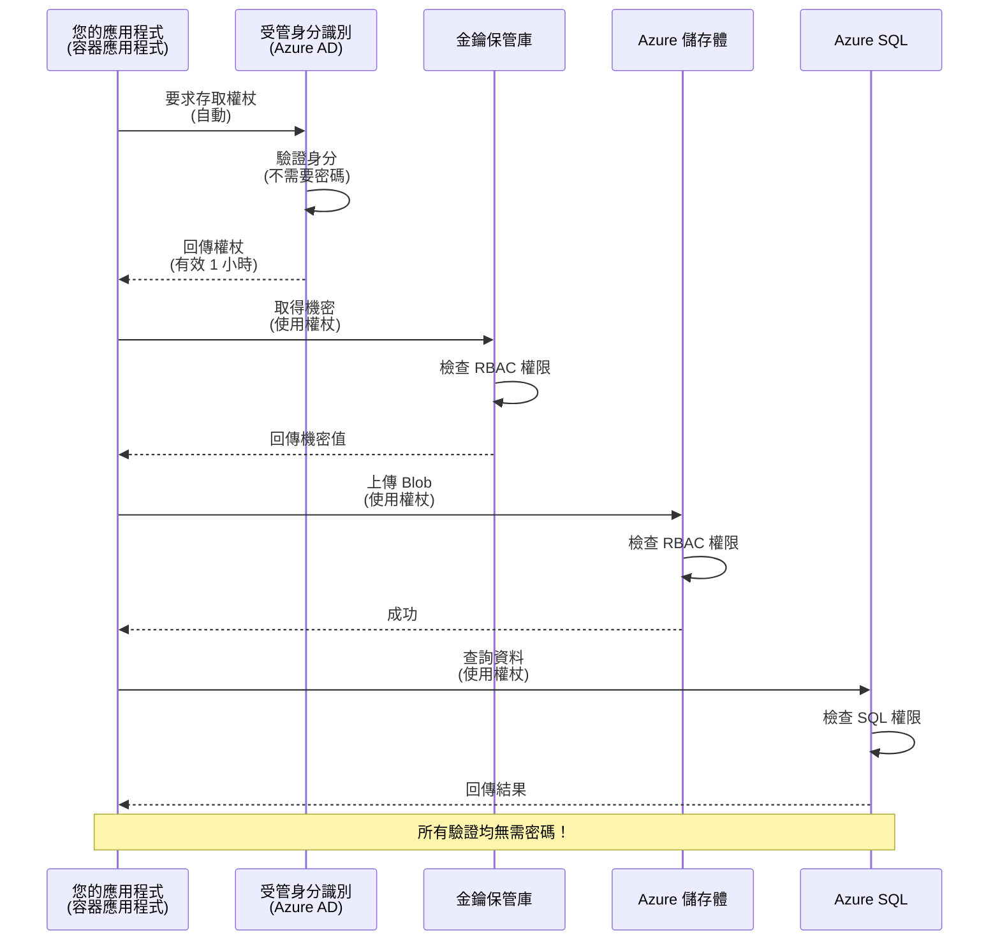
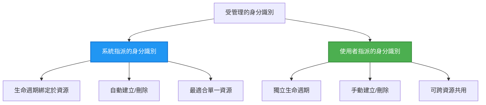

# 驗證模式與受管身分

⏱️ <strong>預估時間</strong>: 45-60 分鐘 | 💰 <strong>費用影響</strong>: 免費 (無額外費用) | ⭐ <strong>複雜度</strong>: 中等

**📚 學習路徑:**
- ← Previous: [設定管理](configuration.md) - 管理環境變數與秘密
- 🎯 <strong>您現在的位置</strong>: 驗證與安全（受管身分、Key Vault、資安模式）
- → Next: [第一個專案](first-project.md) - 建立你的第一個 AZD 應用程式
- 🏠 [課程首頁](../../README.md)

---

## 你將學到

完成本課程後，你將會：
- 瞭解 Azure 驗證模式（金鑰、連線字串、受管身分）
- 實作 <strong>受管身分</strong> 以達成無密碼認證
- 透過 **Azure Key Vault** 整合保護機密
- 為 AZD 部署設定 **角色型存取控制 (RBAC)**
- 在 Container Apps 與 Azure 服務中套用資安最佳實務
- 從金鑰型認證遷移到身分型認證

## 為何受管身分很重要

### 問題：傳統驗證方式

**在使用受管身分之前：**
```javascript
// ❌ 安全風險：程式碼中硬編碼的祕密
const connectionString = "Server=mydb.database.windows.net;User=admin;Password=P@ssw0rd123";
const storageKey = "xK7mN9pQ2wR5tY8uI0oP3aS6dF1gH4jK...";
const cosmosKey = "C2x7B9n4M1p8Q5w3E6r0T2y5U8i1O4p7...";
```

**問題：**
- 🔴 **在程式碼、設定檔、環境變數中暴露機密**
- 🔴 <strong>憑證輪替</strong> 需要修改程式碼並重新部署
- 🔴 <strong>稽核惡夢</strong> - 誰在何時存取了什麼？
- 🔴 <strong>散落問題</strong> - 機密分散在多個系統
- 🔴 <strong>合規風險</strong> - 無法通過安全稽核

### 解決方案：受管身分

**在使用受管身分之後：**
```javascript
// ✅ 安全：程式碼中沒有機密
const credential = new DefaultAzureCredential();
const client = new BlobServiceClient(
  "https://mystorageaccount.blob.core.windows.net",
  credential  // Azure 會自動處理身分驗證
);
```

**好處：**
- ✅ <strong>程式碼或設定中零機密</strong>
- ✅ <strong>自動輪替</strong> - Azure 處理
- ✅ **在 Azure AD 日誌中具有完整稽核紀錄**
- ✅ <strong>集中式安全管理</strong> - 在 Azure 入口網站管理
- ✅ <strong>合規就緒</strong> - 符合安全標準

<strong>類比</strong>：傳統驗證就像為不同門攜帶多把實體鑰匙。受管身分就像一張安全識別證，會根據你的身分自動授權—不用擔心鑰匙遺失、被複製或輪替。

---

## 架構概覽

### 使用受管身分的驗證流程


### 受管身分的類型


| 功能 | 系統指派 | 使用者指派 |
|---------|----------------|---------------|
| <strong>生命週期</strong> | 與資源綁定 | 獨立 |
| <strong>建立</strong> | 隨資源自動建立 | 手動建立 |
| <strong>刪除</strong> | 隨資源刪除 | 資源刪除後仍保留 |
| <strong>共用</strong> | 僅限單一資源 | 多個資源 |
| <strong>使用情境</strong> | 簡單情境 | 複雜的多資源情境 |
| **AZD 預設** | ✅ 建議 | 選用 |

---

## 前置需求

### 必要工具

你應該已從先前課程安裝以下項目：

```bash
# 驗證 Azure 開發人員 CLI
azd version
# ✅ 預期：azd 版本 1.0.0 或更高

# 驗證 Azure CLI
az --version
# ✅ 預期：azure-cli 版本 2.50.0 或更高
```

### Azure 要求

- 有效的 Azure 訂閱
- 擁有以下權限：
  - 建立受管身分
  - 指派 RBAC 角色
  - 建立 Key Vault 資源
  - 部署 Container Apps

### 知識前提

你應該已完成：
- [安裝指南](installation.md) - AZD 設定
- [AZD 基礎](azd-basics.md) - 核心概念
- [設定管理](configuration.md) - 環境變數

---

## 課程 1：理解驗證模式

### 模式 1：連線字串（舊式 - 避免）

**運作方式：**
```bash
# 連線字串包含認證資訊
STORAGE_CONNECTION_STRING="DefaultEndpointsProtocol=https;AccountName=myaccount;AccountKey=xK7mN9pQ2wR5..."
COSMOS_CONNECTION_STRING="AccountEndpoint=https://myaccount.documents.azure.com:443/;AccountKey=C2x7..."
SQL_CONNECTION_STRING="Server=myserver.database.windows.net;User=admin;Password=P@ssw0rd..."
```

**問題：**
- ❌ 機密會在環境變數中顯示
- ❌ 在部署系統中被記錄
- ❌ 難以輪替
- ❌ 沒有存取稽核紀錄

**何時使用：** 僅用於本機開發，絕不可用於生產環境。

---

### 模式 2：Key Vault 參考（較好）

**運作方式：**
```bicep
// Store secret in Key Vault
resource keyVault 'Microsoft.KeyVault/vaults@2023-02-01' = {
  name: 'mykv'
  properties: {
    enableRbacAuthorization: true
  }
}

// Reference in Container App
env: [
  {
    name: 'STORAGE_KEY'
    secretRef: 'storage-key'  // References Key Vault
  }
]
```

**好處：**
- ✅ 機密安全地儲存在 Key Vault
- ✅ 機密集中管理
- ✅ 輪替無需修改程式碼

**限制：**
- ⚠️ 仍在使用金鑰/密碼
- ⚠️ 需要管理 Key Vault 存取權限

**何時使用：** 從連線字串過渡到受管身分的中繼步驟。

---

### 模式 3：受管身分（最佳實務）

**運作方式：**
```bicep
// Enable managed identity
resource containerApp 'Microsoft.App/containerApps@2023-05-01' = {
  name: 'myapp'
  identity: {
    type: 'SystemAssigned'  // Automatically creates identity
  }
}

// Grant permissions
resource roleAssignment 'Microsoft.Authorization/roleAssignments@2022-04-01' = {
  scope: storageAccount
  properties: {
    roleDefinitionId: storageBlobDataContributorRole
    principalId: containerApp.identity.principalId
  }
}
```

**應用程式程式碼：**
```javascript
// 不需要任何秘密！
const { DefaultAzureCredential } = require('@azure/identity');
const { BlobServiceClient } = require('@azure/storage-blob');

const credential = new DefaultAzureCredential();
const blobServiceClient = new BlobServiceClient(
  'https://mystorageaccount.blob.core.windows.net',
  credential
);
```

**好處：**
- ✅ 程式碼/設定中零機密
- ✅ 憑證自動輪替
- ✅ 完整稽核紀錄
- ✅ 基於 RBAC 的權限管理
- ✅ 合規就緒

**何時使用：** 在生產應用中始終使用。

---

## 課程 2：使用 AZD 實作受管身分

### 逐步實作

讓我們建立一個安全的 Container App，使用受管身分存取 Azure Storage 與 Key Vault。

### 專案結構

```
secure-app/
├── azure.yaml                 # AZD configuration
├── infra/
│   ├── main.bicep            # Main infrastructure
│   ├── core/
│   │   ├── identity.bicep    # Managed identity setup
│   │   ├── keyvault.bicep    # Key Vault configuration
│   │   └── storage.bicep     # Storage with RBAC
│   └── app/
│       └── container-app.bicep
└── src/
    ├── app.js                # Application code
    ├── package.json
    └── Dockerfile
```

### 1. 設定 AZD (azure.yaml)

```yaml
name: secure-app
metadata:
  template: secure-app@1.0.0

services:
  api:
    project: ./src
    language: js
    host: containerapp

# Enable managed identity (AZD handles this automatically)
```

### 2. 基礎架構：啟用受管身分

**檔案：`infra/main.bicep`**

```bicep
targetScope = 'subscription'

param environmentName string
param location string = 'eastus'

var tags = { 'azd-env-name': environmentName }

// Resource group
resource rg 'Microsoft.Resources/resourceGroups@2021-04-01' = {
  name: 'rg-${environmentName}'
  location: location
  tags: tags
}

// Storage Account
module storage './core/storage.bicep' = {
  name: 'storage'
  scope: rg
  params: {
    name: 'st${uniqueString(rg.id)}'
    location: location
    tags: tags
  }
}

// Key Vault
module keyVault './core/keyvault.bicep' = {
  name: 'keyvault'
  scope: rg
  params: {
    name: 'kv-${uniqueString(rg.id)}'
    location: location
    tags: tags
  }
}

// Container App with Managed Identity
module containerApp './app/container-app.bicep' = {
  name: 'container-app'
  scope: rg
  params: {
    name: 'ca-${environmentName}'
    location: location
    tags: tags
    storageAccountName: storage.outputs.name
    keyVaultName: keyVault.outputs.name
  }
}

// Grant Container App access to Storage
module storageRoleAssignment './core/role-assignment.bicep' = {
  name: 'storage-role'
  scope: rg
  params: {
    principalId: containerApp.outputs.identityPrincipalId
    roleDefinitionId: 'ba92f5b4-2d11-453d-a403-e96b0029c9fe'  // Storage Blob Data Contributor
    targetResourceId: storage.outputs.id
  }
}

// Grant Container App access to Key Vault
module kvRoleAssignment './core/role-assignment.bicep' = {
  name: 'kv-role'
  scope: rg
  params: {
    principalId: containerApp.outputs.identityPrincipalId
    roleDefinitionId: '4633458b-17de-408a-b874-0445c86b69e6'  // Key Vault Secrets User
    targetResourceId: keyVault.outputs.id
  }
}

// Outputs
output AZURE_STORAGE_ACCOUNT_NAME string = storage.outputs.name
output AZURE_KEY_VAULT_NAME string = keyVault.outputs.name
output APP_URL string = containerApp.outputs.url
```

### 3. 使用系統指派身分的 Container App

**檔案：`infra/app/container-app.bicep`**

```bicep
param name string
param location string
param tags object = {}
param storageAccountName string
param keyVaultName string

resource containerApp 'Microsoft.App/containerApps@2023-05-01' = {
  name: name
  location: location
  tags: tags
  identity: {
    type: 'SystemAssigned'  // 🔑 Enable managed identity
  }
  properties: {
    configuration: {
      ingress: {
        external: true
        targetPort: 3000
      }
    }
    template: {
      containers: [
        {
          name: 'api'
          image: 'myregistry.azurecr.io/api:latest'
          resources: {
            cpu: json('0.5')
            memory: '1Gi'
          }
          env: [
            {
              name: 'AZURE_STORAGE_ACCOUNT_NAME'
              value: storageAccountName
            }
            {
              name: 'AZURE_KEY_VAULT_NAME'
              value: keyVaultName
            }
            // 🔑 No secrets - managed identity handles authentication!
          ]
        }
      ]
    }
  }
}

// Output the identity for RBAC assignments
output identityPrincipalId string = containerApp.identity.principalId
output id string = containerApp.id
output url string = 'https://${containerApp.properties.configuration.ingress.fqdn}'
```

### 4. RBAC 角色指派模組

**檔案：`infra/core/role-assignment.bicep`**

```bicep
param principalId string
param roleDefinitionId string  // Azure built-in role ID
param targetResourceId string

resource roleAssignment 'Microsoft.Authorization/roleAssignments@2022-04-01' = {
  name: guid(principalId, roleDefinitionId, targetResourceId)
  scope: resourceId('Microsoft.Resources/resourceGroups', resourceGroup().name)
  properties: {
    roleDefinitionId: subscriptionResourceId('Microsoft.Authorization/roleDefinitions', roleDefinitionId)
    principalId: principalId
    principalType: 'ServicePrincipal'
  }
}

output id string = roleAssignment.id
```

### 5. 使用受管身分的應用程式程式碼

**檔案：`src/app.js`**

```javascript
const express = require('express');
const { DefaultAzureCredential } = require('@azure/identity');
const { BlobServiceClient } = require('@azure/storage-blob');
const { SecretClient } = require('@azure/keyvault-secrets');

const app = express();
const PORT = process.env.PORT || 3000;

// 🔑 初始化憑證（使用受管識別時會自動生效）
const credential = new DefaultAzureCredential();

// 設定 Azure 儲存體
const storageAccountName = process.env.AZURE_STORAGE_ACCOUNT_NAME;
const blobServiceClient = new BlobServiceClient(
  `https://${storageAccountName}.blob.core.windows.net`,
  credential  // 不需要金鑰！
);

// 設定 Key Vault
const keyVaultName = process.env.AZURE_KEY_VAULT_NAME;
const secretClient = new SecretClient(
  `https://${keyVaultName}.vault.azure.net`,
  credential  // 不需要金鑰！
);

// 健康檢查
app.get('/health', (req, res) => {
  res.json({ status: 'healthy', authentication: 'managed-identity' });
});

// 上傳檔案到 Blob 儲存體
app.post('/upload', async (req, res) => {
  try {
    const containerClient = blobServiceClient.getContainerClient('uploads');
    await containerClient.createIfNotExists();
    
    const blobName = `file-${Date.now()}.txt`;
    const blockBlobClient = containerClient.getBlockBlobClient(blobName);
    
    await blockBlobClient.upload('Hello from managed identity!', 30);
    
    res.json({
      success: true,
      blobName: blobName,
      message: 'File uploaded using managed identity!'
    });
  } catch (error) {
    console.error('Upload error:', error);
    res.status(500).json({ error: error.message });
  }
});

// 從 Key Vault 取得祕密
app.get('/secret/:name', async (req, res) => {
  try {
    const secretName = req.params.name;
    const secret = await secretClient.getSecret(secretName);
    
    res.json({
      name: secretName,
      value: secret.value,
      message: 'Secret retrieved using managed identity!'
    });
  } catch (error) {
    console.error('Secret error:', error);
    res.status(500).json({ error: error.message });
  }
});

// 列出 Blob 容器（示範讀取權限）
app.get('/containers', async (req, res) => {
  try {
    const containers = [];
    for await (const container of blobServiceClient.listContainers()) {
      containers.push(container.name);
    }
    
    res.json({
      containers: containers,
      count: containers.length,
      message: 'Containers listed using managed identity!'
    });
  } catch (error) {
    console.error('List error:', error);
    res.status(500).json({ error: error.message });
  }
});

app.listen(PORT, () => {
  console.log(`Secure API listening on port ${PORT}`);
  console.log('Authentication: Managed Identity (passwordless)');
});
```

**檔案：`src/package.json`**

```json
{
  "name": "secure-app",
  "version": "1.0.0",
  "dependencies": {
    "express": "^4.18.2",
    "@azure/identity": "^4.0.0",
    "@azure/storage-blob": "^12.17.0",
    "@azure/keyvault-secrets": "^4.7.0"
  },
  "scripts": {
    "start": "node app.js"
  }
}
```

### 6. 部署與測試

```bash
# 初始化 AZD 環境
azd init

# 部署基礎架構與應用程式
azd up

# 取得應用程式的網址
APP_URL=$(azd env get-values | grep APP_URL | cut -d '=' -f2 | tr -d '"')

# 測試健康檢查
curl $APP_URL/health
```

**✅ 預期輸出：**
```json
{
  "status": "healthy",
  "authentication": "managed-identity"
}
```

**測試 blob 上傳：**
```bash
curl -X POST $APP_URL/upload
```

**✅ 預期輸出：**
```json
{
  "success": true,
  "blobName": "file-1700404800000.txt",
  "message": "File uploaded using managed identity!"
}
```

**測試容器列表：**
```bash
curl $APP_URL/containers
```

**✅ 預期輸出：**
```json
{
  "containers": ["uploads"],
  "count": 1,
  "message": "Containers listed using managed identity!"
}
```

---

## 常見的 Azure RBAC 角色

### 受管身分的內建角色 ID

| 服務 | 角色名稱 | 角色 ID | 權限 |
|---------|-----------|---------|-------------|
| **Storage** | Storage Blob Data Reader | `2a2b9908-6b94-4a3d-8e5a-a7d8f8cc8a12` | 讀取 blob 與容器 |
| **Storage** | Storage Blob Data Contributor | `ba92f5b4-2d11-453d-a403-e96b0029c9fe` | 讀取、寫入、刪除 blob |
| **Storage** | Storage Queue Data Contributor | `974c5e8b-45b9-4653-ba55-5f855dd0fb88` | 讀取、寫入、刪除佇列訊息 |
| **Key Vault** | Key Vault Secrets User | `4633458b-17de-408a-b874-0445c86b69e6` | 讀取秘密 |
| **Key Vault** | Key Vault Secrets Officer | `b86a8fe4-44ce-4948-aee5-eccb2c155cd7` | 讀取、寫入、刪除秘密 |
| **Cosmos DB** | Cosmos DB Built-in Data Reader | `00000000-0000-0000-0000-000000000001` | 讀取 Cosmos DB 資料 |
| **Cosmos DB** | Cosmos DB Built-in Data Contributor | `00000000-0000-0000-0000-000000000002` | 讀取、寫入 Cosmos DB 資料 |
| **SQL Database** | SQL DB Contributor | `9b7fa17d-e63e-47b0-bb0a-15c516ac86ec` | 管理 SQL 資料庫 |
| **Service Bus** | Azure Service Bus Data Owner | `090c5cfd-751d-490a-894a-3ce6f1109419` | 傳送、接收、管理訊息 |

### 如何查找角色 ID

```bash
# 列出所有內建角色
az role definition list --query "[].{Name:roleName, ID:name}" --output table

# 搜尋特定角色
az role definition list --query "[?contains(roleName, 'Storage Blob')].{Name:roleName, ID:name}" --output table

# 取得角色詳細資訊
az role definition list --name "Storage Blob Data Contributor"
```

---

## 實作練習

### 練習 1：為現有應用啟用受管身分 ⭐⭐（中等）

<strong>目標</strong>：為現有的 Container App 部署新增受管身分

<strong>情境</strong>：你有一個使用連線字串的 Container App。將其轉換為受管身分。

<strong>起始點</strong>：具有此設定的 Container App：

```bicep
// ❌ Current: Using connection string
env: [
  {
    name: 'STORAGE_CONNECTION_STRING'
    secretRef: 'storage-connection'
  }
]
```

<strong>步驟</strong>：

1. **在 Bicep 中啟用受管身分：**

```bicep
resource containerApp 'Microsoft.App/containerApps@2023-05-01' = {
  name: 'myapp'
  identity: {
    type: 'SystemAssigned'  // Add this
  }
  // ... rest of configuration
}
```

2. **授予 Storage 存取權：**

```bicep
// Get storage account reference
resource storageAccount 'Microsoft.Storage/storageAccounts@2023-01-01' existing = {
  name: storageAccountName
}

// Assign role
resource roleAssignment 'Microsoft.Authorization/roleAssignments@2022-04-01' = {
  name: guid(containerApp.id, 'ba92f5b4-2d11-453d-a403-e96b0029c9fe', storageAccount.id)
  scope: storageAccount
  properties: {
    roleDefinitionId: subscriptionResourceId('Microsoft.Authorization/roleDefinitions', 'ba92f5b4-2d11-453d-a403-e96b0029c9fe')
    principalId: containerApp.identity.principalId
    principalType: 'ServicePrincipal'
  }
}
```

3. **更新應用程式程式碼：**

**之前（連線字串）：**
```javascript
const { BlobServiceClient } = require('@azure/storage-blob');

const blobServiceClient = BlobServiceClient.fromConnectionString(
  process.env.STORAGE_CONNECTION_STRING
);
```

**之後（受管身分）：**
```javascript
const { DefaultAzureCredential } = require('@azure/identity');
const { BlobServiceClient } = require('@azure/storage-blob');

const credential = new DefaultAzureCredential();
const blobServiceClient = new BlobServiceClient(
  `https://${process.env.STORAGE_ACCOUNT_NAME}.blob.core.windows.net`,
  credential
);
```

4. **更新環境變數：**

```bicep
env: [
  {
    name: 'STORAGE_ACCOUNT_NAME'
    value: storageAccountName  // Just the name, no secrets!
  }
  // Remove STORAGE_CONNECTION_STRING
]
```

5. **部署與測試：**

```bash
# 重新部署
azd up

# 測試它是否仍可運作
curl https://myapp.azurecontainerapps.io/upload
```

**✅ 成功準則：**
- ✅ 應用部署無錯誤
- ✅ Storage 操作正常（上傳、列出、下載）
- ✅ 環境變數中沒有連線字串
- ✅ 在 Azure 入口網站的「Identity」頁籤可見該身分

**驗證：**

```bash
# 檢查是否已啟用受管理的身分識別
az containerapp show \
  --name myapp \
  --resource-group rg-myapp \
  --query "identity.type"
# ✅ 預期："SystemAssigned"

# 檢查角色指派
az role assignment list \
  --assignee $(az containerapp show --name myapp --resource-group rg-myapp --query "identity.principalId" -o tsv) \
  --scope /subscriptions/{sub-id}/resourceGroups/rg-myapp/providers/Microsoft.Storage/storageAccounts/mystorageaccount
# ✅ 預期：顯示 "Storage Blob Data Contributor" 角色
```

<strong>時間</strong>：20-30 分鐘

---

### 練習 2：使用使用者指派身分的多服務存取 ⭐⭐⭐（進階）

<strong>目標</strong>：建立一個可在多個 Container Apps 共享的使用者指派身分

<strong>情境</strong>：你有 3 個微服務都需要存取相同的 Storage 帳戶與 Key Vault。

<strong>步驟</strong>：

1. **建立使用者指派身分：**

**檔案：`infra/core/identity.bicep`**

```bicep
param name string
param location string
param tags object = {}

resource userAssignedIdentity 'Microsoft.ManagedIdentity/userAssignedIdentities@2023-01-31' = {
  name: name
  location: location
  tags: tags
}

output id string = userAssignedIdentity.id
output principalId string = userAssignedIdentity.properties.principalId
output clientId string = userAssignedIdentity.properties.clientId
```

2. **為使用者指派身分指派角色：**

```bicep
// In main.bicep
module userIdentity './core/identity.bicep' = {
  name: 'user-identity'
  scope: rg
  params: {
    name: 'id-${environmentName}'
    location: location
    tags: tags
  }
}

// Grant Storage access
resource storageRoleAssignment 'Microsoft.Authorization/roleAssignments@2022-04-01' = {
  name: guid(userIdentity.outputs.principalId, 'storage-contributor')
  scope: storageAccount
  properties: {
    roleDefinitionId: subscriptionResourceId('Microsoft.Authorization/roleDefinitions', 'ba92f5b4-2d11-453d-a403-e96b0029c9fe')
    principalId: userIdentity.outputs.principalId
    principalType: 'ServicePrincipal'
  }
}

// Grant Key Vault access
resource kvRoleAssignment 'Microsoft.Authorization/roleAssignments@2022-04-01' = {
  name: guid(userIdentity.outputs.principalId, 'kv-secrets-user')
  scope: keyVault
  properties: {
    roleDefinitionId: subscriptionResourceId('Microsoft.Authorization/roleDefinitions', '4633458b-17de-408a-b874-0445c86b69e6')
    principalId: userIdentity.outputs.principalId
    principalType: 'ServicePrincipal'
  }
}
```

3. **將身分指派給多個 Container Apps：**

```bicep
resource apiGateway 'Microsoft.App/containerApps@2023-05-01' = {
  name: 'api-gateway'
  identity: {
    type: 'UserAssigned'
    userAssignedIdentities: {
      '${userIdentity.outputs.id}': {}
    }
  }
  // ... rest of config
}

resource productService 'Microsoft.App/containerApps@2023-05-01' = {
  name: 'product-service'
  identity: {
    type: 'UserAssigned'
    userAssignedIdentities: {
      '${userIdentity.outputs.id}': {}
    }
  }
  // ... rest of config
}

resource orderService 'Microsoft.App/containerApps@2023-05-01' = {
  name: 'order-service'
  identity: {
    type: 'UserAssigned'
    userAssignedIdentities: {
      '${userIdentity.outputs.id}': {}
    }
  }
  // ... rest of config
}
```

4. **應用程式程式碼（所有服務使用相同模式）：**

```javascript
const { DefaultAzureCredential, ManagedIdentityCredential } = require('@azure/identity');

// 針對使用者指派的身分，請指定用戶端識別碼
const credential = new ManagedIdentityCredential(
  process.env.AZURE_CLIENT_ID  // 使用者指派身分的用戶端識別碼
);

// 或使用 DefaultAzureCredential（自動偵測）
const credential = new DefaultAzureCredential();

const blobServiceClient = new BlobServiceClient(
  `https://${process.env.STORAGE_ACCOUNT_NAME}.blob.core.windows.net`,
  credential
);
```

5. **部署並驗證：**

```bash
azd up

# 測試所有服務是否能存取儲存空間
curl https://api-gateway.azurecontainerapps.io/upload
curl https://product-service.azurecontainerapps.io/upload
curl https://order-service.azurecontainerapps.io/upload
```

**✅ 成功準則：**
- ✅ 一個身分可跨 3 個服務共享
- ✅ 所有服務皆可存取 Storage 與 Key Vault
- ✅ 若刪除其中一個服務，身分仍然保留
- ✅ 集中式權限管理

**使用者指派身分的好處：**
- 單一身分可管理
- 在服務間保持一致的權限
- 可在服務刪除後保留
- 適用於複雜架構

<strong>時間</strong>：30-40 分鐘

---

### 練習 3：實作 Key Vault 機密輪替 ⭐⭐⭐（進階）

<strong>目標</strong>：將第三方 API 金鑰儲存在 Key Vault，並使用受管身分存取它們

<strong>情境</strong>：你的應用需要呼叫需要 API 金鑰的外部 API（如 OpenAI、Stripe、SendGrid）。

<strong>步驟</strong>：

1. **建立使用 RBAC 的 Key Vault：**

**檔案：`infra/core/keyvault.bicep`**

```bicep
param name string
param location string
param tags object = {}

resource keyVault 'Microsoft.KeyVault/vaults@2023-02-01' = {
  name: name
  location: location
  tags: tags
  properties: {
    enableRbacAuthorization: true  // Use RBAC instead of access policies
    sku: {
      family: 'A'
      name: 'standard'
    }
    tenantId: subscription().tenantId
    enableSoftDelete: true
    softDeleteRetentionInDays: 90
  }
}

// Allow Container App to read secrets
output id string = keyVault.id
output name string = keyVault.name
output uri string = keyVault.properties.vaultUri
```

2. **在 Key Vault 中儲存機密：**

```bash
# 取得 Key Vault 名稱
KV_NAME=$(azd env get-values | grep AZURE_KEY_VAULT_NAME | cut -d '=' -f2 | tr -d '"')

# 儲存第三方 API 金鑰
az keyvault secret set \
  --vault-name $KV_NAME \
  --name "OpenAI-ApiKey" \
  --value "sk-proj-xxxxxxxxxxxxx"

az keyvault secret set \
  --vault-name $KV_NAME \
  --name "Stripe-ApiKey" \
  --value "sk_live_xxxxxxxxxxxxx"

az keyvault secret set \
  --vault-name $KV_NAME \
  --name "SendGrid-ApiKey" \
  --value "SG.xxxxxxxxxxxxx"
```

3. **用於檢索機密的應用程式程式碼：**

**檔案：`src/config.js`**

```javascript
const { DefaultAzureCredential } = require('@azure/identity');
const { SecretClient } = require('@azure/keyvault-secrets');

class Config {
  constructor() {
    this.credential = new DefaultAzureCredential();
    this.secretClient = new SecretClient(
      `https://${process.env.AZURE_KEY_VAULT_NAME}.vault.azure.net`,
      this.credential
    );
    this.cache = {};
  }

  async getSecret(secretName) {
    // 先檢查快取
    if (this.cache[secretName]) {
      return this.cache[secretName];
    }

    try {
      const secret = await this.secretClient.getSecret(secretName);
      this.cache[secretName] = secret.value;
      console.log(`✅ Retrieved secret: ${secretName}`);
      return secret.value;
    } catch (error) {
      console.error(`❌ Failed to get secret ${secretName}:`, error.message);
      throw error;
    }
  }

  async getOpenAIKey() {
    return this.getSecret('OpenAI-ApiKey');
  }

  async getStripeKey() {
    return this.getSecret('Stripe-ApiKey');
  }

  async getSendGridKey() {
    return this.getSecret('SendGrid-ApiKey');
  }
}

module.exports = new Config();
```

4. **在應用中使用機密：**

**檔案：`src/app.js`**

```javascript
const express = require('express');
const config = require('./config');
const { OpenAI } = require('openai');

const app = express();

// 使用來自 Key Vault 的金鑰初始化 OpenAI
let openaiClient;

async function initializeServices() {
  const openaiKey = await config.getOpenAIKey();
  openaiClient = new OpenAI({ apiKey: openaiKey });
  console.log('✅ Services initialized with secrets from Key Vault');
}

// 在啟動時呼叫
initializeServices().catch(console.error);

app.post('/chat', async (req, res) => {
  try {
    const completion = await openaiClient.chat.completions.create({
      model: 'gpt-4.1',
      messages: [{ role: 'user', content: 'Hello!' }]
    });
    
    res.json({
      response: completion.choices[0].message.content,
      authentication: 'Key from Key Vault via Managed Identity'
    });
  } catch (error) {
    res.status(500).json({ error: error.message });
  }
});

app.listen(3000, () => {
  console.log('Secure API with Key Vault integration running');
});
```

5. **部署與測試：**

```bash
azd up

# 測試 API 金鑰是否有效
curl -X POST https://myapp.azurecontainerapps.io/chat \
  -H "Content-Type: application/json" \
  -d '{"message":"Hello AI"}'
```

**✅ 成功準則：**
- ✅ 程式碼或環境變數中沒有 API 金鑰
- ✅ 應用能從 Key Vault 取得金鑰
- ✅ 第三方 API 正常運作
- ✅ 無需修改程式碼即可輪替金鑰

**輪替機密：**

```bash
# 在 Key Vault 中更新祕密
az keyvault secret set \
  --vault-name $KV_NAME \
  --name "OpenAI-ApiKey" \
  --value "sk-proj-NEW_KEY_HERE"

# 重新啟動應用程式以套用新金鑰
az containerapp revision restart \
  --name myapp \
  --resource-group rg-myapp
```

<strong>時間</strong>：25-35 分鐘

---

## 知識檢核點

### 1. 驗證模式 ✓

測試你的理解：

- [ ] **Q1**：三種主要的驗證模式是什麼？ 
  - **A**：連線字串（舊式）、Key Vault 參考（過渡）、受管身分（最佳）

- [ ] **Q2**：為什麼受管身分比連線字串更好？
  - **A**：程式碼中沒有機密、自動輪替、完整稽核紀錄、RBAC 權限

- [ ] **Q3**：何時會使用使用者指派身分而非系統指派？
  - **A**：當要在多個資源間共享身分，或身分生命週期獨立於資源生命週期時

**實作驗證：**
```bash
# 檢查您的應用程式使用的是哪種類型的身分
az containerapp show \
  --name myapp \
  --resource-group rg-myapp \
  --query "identity.type"

# 列出該身分的所有角色指派
az role assignment list \
  --assignee $(az containerapp show --name myapp --resource-group rg-myapp --query "identity.principalId" -o tsv)
```

---

### 2. RBAC 與權限 ✓

測試你的理解：

- [ ] **Q1**：'Storage Blob Data Contributor' 的角色 ID 是多少？
  - **A**：`ba92f5b4-2d11-453d-a403-e96b0029c9fe`

- [ ] **Q2**：'Key Vault Secrets User' 提供哪些權限？
  - **A**：對機密的唯讀存取（無法建立、更新或刪除）

- [ ] **Q3**：如何授予 Container App 存取 Azure SQL？
  - **A**：指派「SQL DB Contributor」角色，或為 SQL 設定 Azure AD 認證

**實作驗證：**
```bash
# 尋找特定角色
az role definition list --name "Storage Blob Data Contributor"

# 檢查指派給您的身分有哪些角色
PRINCIPAL_ID=$(az containerapp show --name myapp --resource-group rg-myapp --query "identity.principalId" -o tsv)
az role assignment list --assignee $PRINCIPAL_ID --output table
```

---

### 3. Key Vault 整合 ✓
- [ ] **Q1**: 如何為 Key Vault 啟用 RBAC（而不是使用存取政策）？
  - **A**: 在 Bicep 中設定 `enableRbacAuthorization: true`

- [ ] **Q2**: 哪個 Azure SDK 函式庫處理受管身分驗證？
  - **A**: `@azure/identity` 與 `DefaultAzureCredential` 類別

- [ ] **Q3**: Key Vault 的祕密在快取中會停留多久？
  - **A**: 取決於應用程式；請實作您自己的快取策略

**Hands-On Verification:**
```bash
# 測試 Key Vault 存取
az keyvault secret show \
  --vault-name $KV_NAME \
  --name "OpenAI-ApiKey" \
  --query "value"

# 檢查 RBAC 是否已啟用
az keyvault show \
  --name $KV_NAME \
  --query "properties.enableRbacAuthorization"
# ✅ 預期：true
```

---

## 安全最佳做法

### ✅ 建議：

1. <strong>在生產環境中務必使用受管身分</strong>
   ```bicep
   identity: {
     type: 'SystemAssigned'
   }
   ```

2. **使用最小權限的 RBAC 角色**
   - 盡可能使用「Reader」角色
   - 除非必要，避免使用「Owner」或「Contributor」

3. **將第三方金鑰存放在 Key Vault**
   ```javascript
   const apiKey = await secretClient.getSecret('ThirdPartyApiKey');
   ```

4. <strong>啟用稽核日誌</strong>
   ```bicep
   diagnosticSettings: {
     logs: [{ category: 'AuditEvent', enabled: true }]
   }
   ```

5. **為 dev/staging/prod 使用不同的身分識別**
   ```bash
   azd env new dev
   azd env new staging
   azd env new prod
   ```

6. <strong>定期輪換祕密</strong>
   - 在 Key Vault 祕密上設定到期日
   - 使用 Azure Functions 自動化輪換

### ❌ 不要：

1. <strong>切勿在程式中硬編祕密</strong>
   ```javascript
   // ❌ 糟糕
   const apiKey = "sk-proj-xxxxxxxxxxxxx";
   ```

2. <strong>不要在生產環境使用連線字串</strong>
   ```javascript
   // ❌ 糟糕
   BlobServiceClient.fromConnectionString(process.env.STORAGE_CONNECTION_STRING)
   ```

3. <strong>不要授予過度權限</strong>
   ```bicep
   // ❌ BAD - too much access
   roleDefinitionId: 'Owner'
   
   // ✅ GOOD - least privilege
   roleDefinitionId: 'Storage Blob Data Reader'
   ```

4. **不要記錄祕密（在日誌中）**
   ```javascript
   // ❌ 不好
   console.log('API Key:', apiKey);
   
   // ✅ 好
   console.log('API Key retrieved successfully');
   ```

5. <strong>不要在環境間共用生產身分識別</strong>
   ```bicep
   // ❌ BAD - same identity for dev and prod
   // ✅ GOOD - separate identities per environment
   ```

---

## 疑難排解指南

### 問題：存取 Azure Storage 時出現「Unauthorized」

**症狀:**
```
Error: Unauthorized (403)
AuthorizationPermissionMismatch: This request is not authorized to perform this operation
```

**診斷:**

```bash
# 檢查是否啟用託管識別
az containerapp show \
  --name myapp \
  --resource-group rg-myapp \
  --query "identity.type"
# ✅ 預期: "SystemAssigned" 或 "UserAssigned"

# 檢查角色指派
PRINCIPAL_ID=$(az containerapp show --name myapp --resource-group rg-myapp --query "identity.principalId" -o tsv)
az role assignment list --assignee $PRINCIPAL_ID

# 預期: 應該會看到 "Storage Blob Data Contributor" 或類似的角色
```

**解決方法:**

1. **授予正確的 RBAC 角色：**
```bash
STORAGE_ID=$(az storage account show --name mystorageaccount --resource-group rg-myapp --query "id" -o tsv)
az role assignment create \
  --assignee $PRINCIPAL_ID \
  --role "Storage Blob Data Contributor" \
  --scope $STORAGE_ID
```

2. **等待權限散佈（可能需 5-10 分鐘）：**
```bash
# 檢查角色指派狀態
az role assignment list --assignee $PRINCIPAL_ID --scope $STORAGE_ID
```

3. **驗證應用程式程式碼使用正確的憑證：**
```javascript
// 請確認您正在使用 DefaultAzureCredential
const credential = new DefaultAzureCredential();
```

---

### 問題：Key Vault 存取被拒

**症狀:**
```
Error: Forbidden (403)
The user, group or application does not have secrets get permission
```

**診斷:**

```bash
# 檢查 Key Vault 的 RBAC 是否已啟用
az keyvault show \
  --name $KV_NAME \
  --query "properties.enableRbacAuthorization"
# ✅ 預期：true

# 檢查角色指派
az role assignment list \
  --assignee $PRINCIPAL_ID \
  --scope /subscriptions/{sub-id}/resourceGroups/rg-myapp/providers/Microsoft.KeyVault/vaults/$KV_NAME
```

**解決方法:**

1. **在 Key Vault 上啟用 RBAC：**
```bash
az keyvault update \
  --name $KV_NAME \
  --enable-rbac-authorization true
```

2. **授予 Key Vault Secrets User 角色：**
```bash
KV_ID=$(az keyvault show --name $KV_NAME --query "id" -o tsv)
az role assignment create \
  --assignee $PRINCIPAL_ID \
  --role "Key Vault Secrets User" \
  --scope $KV_ID
```

---

### 問題：DefaultAzureCredential 在本機失敗

**症狀:**
```
Error: DefaultAzureCredential failed to retrieve a token
CredentialUnavailableError: No credential available
```

**診斷:**

```bash
# 檢查您是否已登入
az account show

# 檢查 Azure CLI 是否已驗證
az ad signed-in-user show
```

**解決方法:**

1. **登入 Azure CLI：**
```bash
az login
```

2. **設定 Azure 訂閱：**
```bash
az account set --subscription "Your Subscription Name"
```

3. **在本機開發時，使用環境變數：**
```bash
export AZURE_TENANT_ID="your-tenant-id"
export AZURE_CLIENT_ID="your-client-id"
export AZURE_CLIENT_SECRET="your-client-secret"
```

4. **或在本機使用不同的憑證：**
```javascript
const { DefaultAzureCredential, AzureCliCredential } = require('@azure/identity');

// 在本地開發時使用 AzureCliCredential
const credential = process.env.NODE_ENV === 'production' 
  ? new DefaultAzureCredential()
  : new AzureCliCredential();
```

---

### 問題：角色指派傳播時間過長

**症狀:**
- 角色已成功指派
- 仍然收到 403 錯誤
- 存取間歇性（有時可用，有時不可用）

**說明:**
Azure RBAC 更動可能需要 5-10 分鐘才能全域傳播。

**解決方案：**

```bash
# 稍候再試
echo "Waiting for RBAC propagation..."
sleep 300  # 等候5分鐘

# 測試存取
curl https://myapp.azurecontainerapps.io/upload

# 如果仍然失敗，重新啟動應用程式
az containerapp revision restart \
  --name myapp \
  --resource-group rg-myapp
```

---

## 成本考量

### 受管身分成本

| 資源 | 成本 |
|----------|------|
| **Managed Identity** | 🆓 <strong>免費</strong> - 不收費 |
| **RBAC Role Assignments** | 🆓 <strong>免費</strong> - 不收費 |
| **Azure AD Token Requests** | 🆓 <strong>免費</strong> - 已包含 |
| **Key Vault Operations** | $0.03 per 10,000 operations |
| **Key Vault Storage** | $0.024 per secret per month |

**使用受管身分可以省錢的原因：**
- ✅ 消除用於服務對服務驗證的 Key Vault 操作
- ✅ 降低安全事件（無憑證外洩）
- ✅ 減少營運負擔（無需手動輪換）

**成本範例比較（每月）：**

| 場景 | 連線字串 | Managed Identity | 節省 |
|----------|-------------------|-----------------|---------|
| 小型應用程式（1M 請求） | ~$50 (Key Vault + ops) | ~$0 | $50/月 |
| 中型應用程式（10M 請求） | ~$200 | ~$0 | $200/月 |
| 大型應用程式（100M 請求） | ~$1,500 | ~$0 | $1,500/月 |

---

## 進一步學習

### 官方文件
- [Azure Managed Identity](https://learn.microsoft.com/entra/identity/managed-identities-azure-resources/overview)
- [Azure RBAC](https://learn.microsoft.com/azure/role-based-access-control/overview)
- [Azure Key Vault](https://learn.microsoft.com/azure/key-vault/general/overview)
- [DefaultAzureCredential](https://learn.microsoft.com/dotnet/api/azure.identity.defaultazurecredential)

### SDK 文件
- [@azure/identity (Node.js)](https://www.npmjs.com/package/@azure/identity)
- [Azure.Identity (C#)](https://www.nuget.org/packages/Azure.Identity/)
- [azure-identity (Python)](https://pypi.org/project/azure-identity/)

### 本課程的下一步
- ← 上一步： [設定管理](configuration.md)
- → 下一步： [第一個專案](first-project.md)
- 🏠 [課程首頁](../../README.md)

### 相關範例
- [Microsoft Foundry Models Chat Example](../../../../examples/azure-openai-chat) - 使用受管身分來存取 Microsoft Foundry Models
- [Microservices Example](../../../../examples/microservices) - 多服務驗證模式

---

## 摘要

**您已學到：**
- ✅ 三種驗證模式（連線字串、Key Vault、受管身分）
- ✅ 如何在 AZD 中啟用與設定受管身分
- ✅ Azure 服務的 RBAC 角色指派
- ✅ 將第三方祕密整合到 Key Vault
- ✅ 使用者指派與系統指派身分識別的比較
- ✅ 安全最佳實務與疑難排解

**關鍵重點：**
1. <strong>在生產環境中務必使用受管身分</strong> - 無祕密、自動輪換
2. **使用最小權限的 RBAC 角色** - 只授予必要的權限
3. **將第三方金鑰存放在 Key Vault** - 集中式祕密管理
4. <strong>針對不同環境分離身分識別</strong> - dev、staging、prod 隔離
5. <strong>啟用稽核日誌</strong> - 追蹤誰存取了什麼

**後續步驟：**
1. 完成上述實作練習
2. 將現有應用程式從連線字串移轉到受管身分
3. 建立您的第一個 AZD 專案，從一開始就納入安全性： [第一個專案](first-project.md)

---

<!-- CO-OP TRANSLATOR DISCLAIMER START -->
**免責聲明**:
本文件係使用 AI 翻譯服務 [Co-op Translator](https://github.com/Azure/co-op-translator) 進行翻譯。雖然我們力求準確，但請注意自動翻譯可能含有錯誤或不準確之處。原始文件之母語版本應視為具權威性的來源。對於關鍵資訊，建議採用專業人工翻譯。我們不對因使用本翻譯而產生的任何誤解或誤譯負責。
<!-- CO-OP TRANSLATOR DISCLAIMER END -->