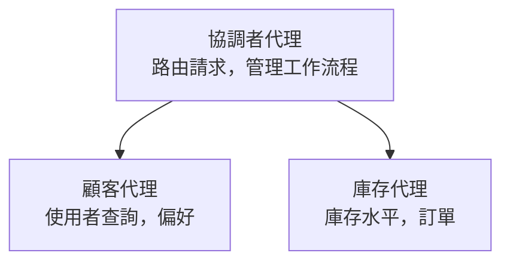

# 第5章：多代理人AI解決方案

**📚 課程**: [AZD初學者指南](../../README.md) | **⏱️ 時長**: 2-3小時 | **⭐ 難度**: 進階

---

## 概述

本章涵蓋進階多代理人架構模式、代理人協調，以及用於複雜場景的生產就緒AI部署。

> 於2026年3月，通過 `azd 1.23.12` 驗證。

## 學習目標

完成本章後，您將能夠：
- 理解多代理人架構模式
- 部署協同合作的AI代理人系統
- 實現代理人間通信
- 建構生產就緒的多代理人解決方案

---

## 📚 課程內容

| # | 課程 | 說明 | 時間 |
|---|--------|-------------|------|
| 1 | [零售多代理人解決方案](../../examples/retail-scenario.md) | 完整實作導覽 | 90 分 |
| 2 | [協調模式](../chapter-06-pre-deployment/coordination-patterns.md) | 代理人協調策略 | 30 分 |
| 3 | [ARM 範本部署](../../examples/retail-multiagent-arm-template/README.md) | 一鍵部署 | 30 分 |

---

## 🚀 快速開始

```bash
# 選項 1：從範本部署
azd init --template agent-openai-python-prompty
azd up

# 選項 2：從代理人清單部署（需要 azure.ai.agents 擴充功能）
azd extension install azure.ai.agents
azd ai agent init -m agent-manifest.yaml
azd up
```

> **該選擇哪個方法？** 使用 `azd init --template` 從可用範例開始。當您已有自己的代理人清單時，可使用 `azd ai agent init`。完整資訊請參閱[AZD AI CLI 參考](../chapter-08-production/production-ai-practices.md#azd-ai-cli-commands-and-extensions)。

---

## 🤖 多代理人架構


---

## 🎯 精選解決方案：零售多代理人

[零售多代理人解決方案](../../examples/retail-scenario.md) 展示了：

- <strong>客戶代理人</strong>：處理使用者互動與偏好
- <strong>庫存代理人</strong>：管理庫存與訂單處理
- <strong>協調者</strong>：負責代理人間協調
- <strong>共用記憶體</strong>：跨代理人上下文管理

### 所使用的服務

| 服務 | 目的 |
|---------|---------|
| Microsoft Foundry Models | 語言理解 |
| Azure AI Search | 產品目錄 |
| Cosmos DB | 代理人狀態與記憶 |
| Container Apps | 代理人主機 |
| Application Insights | 監控 |

---

## 🔗 導覽

| 方向 | 章節 |
|-----------|---------|
| <strong>前一章</strong> | [第4章：基礎架構](../chapter-04-infrastructure/README.md) |
| <strong>下一章</strong> | [第6章：部署前準備](../chapter-06-pre-deployment/README.md) |

---

## 📖 相關資源

- [AI代理人指南](../chapter-02-ai-development/agents.md)
- [生產AI實務](../chapter-08-production/production-ai-practices.md)
- [AI 故障排除](../chapter-07-troubleshooting/ai-troubleshooting.md)

---

<!-- CO-OP TRANSLATOR DISCLAIMER START -->
**免責聲明**：  
本文件是使用 AI 翻譯服務 [Co-op Translator](https://github.com/Azure/co-op-translator) 進行翻譯。雖然我們力求準確，但請注意，自動翻譯可能包含錯誤或不準確之處。原始文件的母語版本應視為權威來源。對於重要資訊，建議尋求專業人工翻譯。我們不對因使用此翻譯所產生的任何誤解或誤釋承擔責任。
<!-- CO-OP TRANSLATOR DISCLAIMER END -->