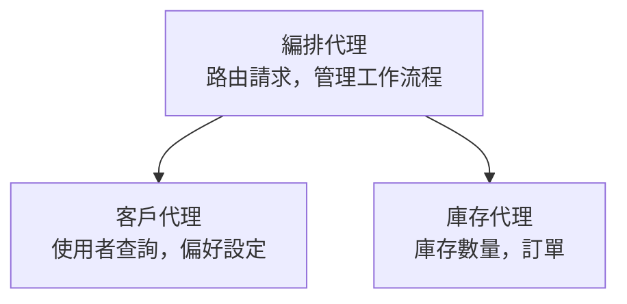

# 第5章：多代理 AI 解決方案

**📚 課程**: [AZD 入門](../../README.md) | **⏱️ 時長**: 2-3 hours | **⭐ 複雜度**: 進階

---

## 概覽

本章涵蓋進階的多代理架構模式、代理編排，以及針對複雜場景的生產就緒 AI 部署。

## 學習目標

完成本章後，您將能夠：
- 了解多代理架構模式
- 部署協同運作的 AI 代理系統
- 實作代理之間的通訊
- 建構可投入生產的多代理解決方案

---

## 📚 課程

| # | 課程 | 說明 | 時間 |
|---|--------|-------------|------|
| 1 | [零售多代理解決方案](../../examples/retail-scenario.md) | 完整實作導覽 | 90 分鐘 |
| 2 | [協調模式](../chapter-06-pre-deployment/coordination-patterns.md) | 代理協調策略 | 30 分鐘 |
| 3 | [ARM 範本部署](../../examples/retail-multiagent-arm-template/README.md) | 一鍵部署 | 30 分鐘 |

---

## 🚀 快速開始

```bash
# 選項 1：從範本部署
azd init --template agent-openai-python-prompty
azd up

# 選項 2：從代理程式清單部署（需要 azure.ai.agents 擴充套件）
azd extension install azure.ai.agents
azd ai agent init -m agent-manifest.yaml
azd up
```

> **選擇哪種方法？** Use `azd init --template` to start from a working sample. Use `azd ai agent init` when you have your own agent manifest. See the [AZD AI CLI 參考](../chapter-08-production/production-ai-practices.md#azd-ai-cli-commands-and-extensions) for full details.

---

## 🤖 多代理架構


---

## 🎯 精選方案：零售多代理

The [零售多代理解決方案](../../examples/retail-scenario.md) demonstrates:

- <strong>客戶代理</strong>: 處理使用者互動與偏好
- <strong>庫存代理</strong>: 管理庫存與訂單處理
- <strong>編排者</strong>: 在代理之間進行協調
- <strong>共用記憶體</strong>: 跨代理的情境管理

### 使用的服務

| Service | Purpose |
|---------|---------|
| Microsoft Foundry Models | 語言理解 |
| Azure AI Search | 產品目錄 |
| Cosmos DB | 代理狀態與記憶 |
| Container Apps | 代理託管 |
| Application Insights | 監控 |

---

## 🔗 導覽

| Direction | Chapter |
|-----------|---------|
| <strong>上一章</strong> | [第4章：基礎架構](../chapter-04-infrastructure/README.md) |
| <strong>下一章</strong> | [第6章：預部署](../chapter-06-pre-deployment/README.md) |

---

## 📖 相關資源

- [AI 代理指南](../chapter-02-ai-development/agents.md)
- [生產 AI 實務](../chapter-08-production/production-ai-practices.md)
- [AI 疑難排解](../chapter-07-troubleshooting/ai-troubleshooting.md)

---

<!-- CO-OP TRANSLATOR DISCLAIMER START -->
**免責聲明**:
本文件已使用 AI 翻譯服務 [Co-op Translator](https://github.com/Azure/co-op-translator) 進行翻譯。儘管我們力求準確，但請注意自動翻譯可能包含錯誤或不準確之處。原始語言的文件應被視為具權威性的來源。對於重要資訊，建議委託專業人工翻譯。我們不對因使用本翻譯而產生的任何誤解或誤釋負責。
<!-- CO-OP TRANSLATOR DISCLAIMER END -->