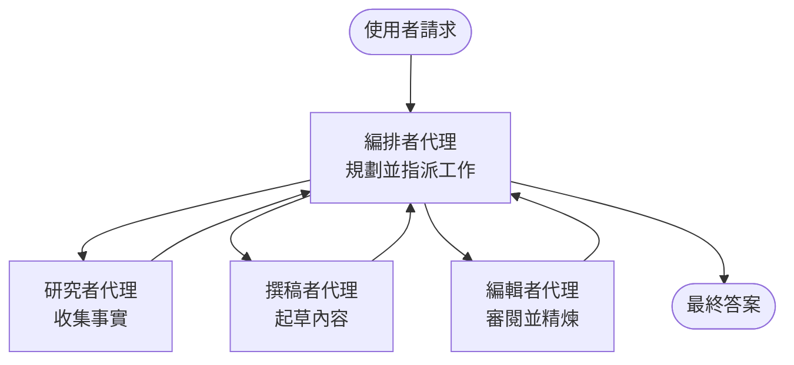

# 多工智能基礎 - 部署您的第一個協調 AI 系統

**章節導覽：**
- **📚 課程主頁**: [AZD 初學者指南](../../README.md)
- **📖 當前章節**: 第 5 章 - 多工智能解決方案
- **⬅️ 前一章節**: [第 4 章：基礎設施](../chapter-04-infrastructure/README.md)
- **➡️ 下一章節**: [協調模式](../chapter-06-pre-deployment/coordination-patterns.md)

> 經過 `azd 1.27.1` 於 2026 年 7 月驗證。

## 介紹

在前幾章您部署了單一應用程式——在第 2 章您部署了單一 AI 代理。本課將邁出下一步：部署一個<strong>多工系統</strong>，由多個專門代理協同工作，解決單一代理無法有效處理的問題。

對於初學者來說的好消息是：**不需要新的命令。** 多工解決方案仍然是 azd 專案。您會使用 `azd init`、`azd up`、測試，以及 `azd down`——正是您已熟悉的工作流程。改變的是應用程式內部的<em>結構</em>。

## 學習目標

完成本課後，您將能：
- 了解「多工代理」的含義以及何時值得承擔額外的複雜性
- 識別多工系統中的常見角色（協調者 + 專家代理）
- 使用 `azd up` 部署一個真正可用的多工範本
- 了解支援多工應用的 Azure 資源
- 知道如何安全驗證、自訂並拆除解決方案

## 學習成果

完成本課後，您將能：
- 解釋單一代理與多工系統的差異
- 在單一代理附帶工具與真正多工設計之間做出選擇
- 端對端部署和測試多工範本，使用 azd
- 識別每個代理運行的位置及其通訊方式
- 清理所有資源以避免持續費用

---

## 什麼是多工系統？

單一 AI 代理是一個模型搭配一組指令和（可選）一些工具。這對於聚焦的任務效果很好。但當任務擴大——研究、寫作、編輯，然後審核——將所有內容塞進一個提示會使代理變慢、不穩定且難以除錯。

一個<strong>多工系統</strong>將工作拆分給各個專家，由一個協調者協調：



### 兩個您永遠會看到的角色

| 角色 | 職責 | 範例 |
|------|------|------|
| <strong>協調者</strong> | 決定<em>下一步做什麼</em>並在代理間分派工作 | 「先研究，再寫作，最後編輯」 |
| <strong>專家代理</strong> | 專注於一項任務並返回結果 | 只從事事實蒐集的「研究者」 |

### 您真的需要多個代理嗎？

從簡單開始。<strong>只有在</strong>以下情況之一時，才使用多工代理：

- ✅ 任務有<strong>明確階段</strong>，且各階段指令不同（研究 vs. 撰寫 vs. 審閱）
- ✅ 您希望專家能<strong>並行運作</strong>節省時間
- ✅ 不同步驟需要<strong>不同工具或資料來源</strong>
- ✅ 您需要每個步驟<strong>可獨立測試和除錯</strong>

若任務只是單問單答或簡單的工具調用，則<strong>附帶工具的單一代理</strong>（第 2 章）較為簡單、便宜且易於操作。

> **初學者提示：** 「代理越多」不等於「越好」。每個代理都增加延遲、成本和監控負擔。僅當問題明確拆分成多部份才新增代理。

---

## 在 Azure 上建立多工系統的兩種方式

| 方法 | 說明 | 適用場合 |
|-----|------|-------|
| **單一代理 + 工具** | 一個 Foundry 代理調用函數或工具 | 簡單工作流程、初學者入門 |
| <strong>多個協調代理</strong> | 多個代理搭配協調者 | 明確階段、平行工作、專業分工 |

本課專注第二種方法，使用<strong>現成範本</strong>，讓您先看到真正多工系統運作，再自行建置。

---

## 實作：部署可運作的多工應用程式

我們將部署 **Contoso Creative Writer**，官方 Azure 範例，使用多個代理（研究者、寫手、編輯）協調產出文章。角色簡單易懂，是初學多工的好範例。

### 步驟 1：初始化範本

```bash
# 建立一個工作資料夾
mkdir creative-writer && cd creative-writer

# 從官方多代理範本初始化
azd init --template contoso-creative-writer
```

> 隨時在 [Awesome AZD AI gallery](https://azure.github.io/awesome-azd/?tags=ai) 瀏覽更多多工範本。其他友善初學者的範本有 `get-started-with-ai-agents` 和 `azure-ai-travel-agents`。

### 步驟 2：驗證身份

```bash
# azd 工作流程所需
azd auth login
```

### 步驟 3：建立環境

```bash
azd env new dev
```

### 步驟 4：預覽並部署

```bash
# 在花費任何費用之前查看將會被建立的內容（建議）
azd provision --preview

# 以一步驟提供基礎設施並部署所有代理程式
azd up
```

執行 `azd up` 會提示選擇訂閱和地區，然後配置 Azure 資源並部署應用。AI 部署可能比簡單網頁應用更耗時——若您部署大型模型，可延長部署逾時時間：

```bash
azd deploy --timeout 1800
```

> **成本與容量提醒：** 多工應用部署會使用 AI 模型配額並產生費用。若 `azd up` 因模型配額失敗，請參考 [AI 疑難排解](../chapter-07-troubleshooting/ai-troubleshooting.md) 了解區域與配額調整，及第 6 章 [容量規劃](../chapter-06-pre-deployment/capacity-planning.md)。

---

## 了解您部署了什麼

典型的此類多工應用會部署一組 Azure 資源，直接對應上面圖示的職責：

| 資源 | 角色說明 |
|-----|----------|
| **Microsoft Foundry / Models** | 托管每個代理使用的語言模型 |
| **Azure AI Search** | 為研究者代理提供可搜尋的基礎資料 |
| **Container Apps**（或 App Service） | 托管協調者和代理程式碼 |
| **Cosmos DB**（某些範本） | 存取傳遞給代理的共享狀態/記憶 |
| **Application Insights** | 追蹤跨代理的請求，方便除錯流程 |

### 代理間如何彼此溝通

在大多數 azd 多工範本中，<strong>協調者運行於您的應用程式碼中</strong>（例如使用 Semantic Kernel 框架或 Microsoft Agent Framework）。協調者依序呼叫每個專家代理，傳遞結果，組合最終答案。代理透過如下方法共享狀態：

- **函數/工具呼叫** — 協調者調用專家代理並獲得結果回傳
- <strong>共享記憶</strong> — 資料庫（通常是 Cosmos DB）保存雙方可讀狀態
- **訊息/事件** — 較鬆散耦合時，透過佇列或服務匯流排傳訊

> **除錯上的重要性：** 因為每個步驟分離，Application Insights 可顯示<em>哪個</em>代理較慢或失敗。這也是多工工作拆分的主要原因之一。

---

## 驗證部署結果

在繼續前確認系統運作正常：

```bash
# 顯示已部署的端點
azd show

# 開啟應用程式的監控儀表板
azd monitor

# 如果有異常，追蹤日誌
azd monitor --logs
```

接著從 `azd show` 開啟應用程式 URL，嘗試觸發所有代理的請求（例如，對 Creative Writer 請它寫一篇短文）。在 Application Insights 的<strong>交易搜尋</strong>中，您應看到請求在研究者、寫手與編輯步驟中擴散。

**成功準則：**
- ✅ `azd show` 列出可連線端點
- ✅ 一次請求產生結果，能清楚經過多個階段
- ✅ Application Insights 顯示多個代理步驟的追蹤資料

---

## 自訂：新增或調整代理

因為每個代理就是一組指令加工具，自訂相當容易：

1. <strong>找到範本中的代理定義</strong>（通常在 `prompts/`、`agents/` 或 `*.prompty` 檔案中）。
2. <strong>調整代理指令</strong> — 例如告訴編輯代理必須維持特定語氣或字數。
3. <strong>僅重新部署程式碼</strong>（基礎設施不變）：

   ```bash
   azd deploy
   ```

若要更進階，從<em>自有</em> manifest 建立代理，請使用 agent 擴充功能及其完整生命週期：

```bash
azd extension install azure.ai.agents
azd ai agent init -m agent-manifest.yaml
azd up
azd ai agent invoke      # 測試，包含回應時間
```

請參閱 [第 2 章：代理](../chapter-02-ai-development/agents.md) 及 [AZD AI CLI 參考](../chapter-08-production/production-ai-practices.md#azd-ai-cli-commands-and-extensions) 了解完整代理生命週期指令（`invoke`、`eval generate`、`optimize`、`delete`）。

---

## 清理

多工應用運行多個計費服務。完成後請拆除所有資源：

```bash
azd down --force --purge
```

`--purge` 參數同時移除軟刪除的 AI 資源（如 Foundry/Azure AI 服務帳戶），避免未來部署受阻或持續產生費用。

---

## 關於生產多工系統的說明

此儲存庫中的 [零售多工解決方案](../../examples/retail-scenario.md) 是一份<strong>架構藍圖</strong>，非一鍵範本——它記錄了一個生產零售系統<em>將如何</em>建置（明確說明完整構建為重大工程）。在此部署成功範例後，才可作為設計參考。生產階段的議題（韌性、成本、監控、治理），請繼續參閱[第 8 章：生產 AI 實務](../chapter-08-production/production-ai-practices.md)。

---

## 總結

- 多工系統透過協調者將工作分派給專家代理。
- 僅在任務有明確階段、平行性或各步驟需不同工具時使用，否則建議使用單一代理。
- azd 工作流程不變：`azd init` → `azd up` → 測試 → `azd down`。
- 用類似 `contoso-creative-writer` 的真實範本，讓您今天即可看到並自訂運作中的多工應用。
- 代理間的 Application Insights 追蹤是多工設計最實際的好處之一。

---

## 🔗 導覽

| 方向 | 課程 |
|----|----|
| <strong>前一章</strong> | [第 4 章：基礎設施](../chapter-04-infrastructure/README.md) |
| <strong>下一章</strong> | [協調模式](../chapter-06-pre-deployment/coordination-patterns.md) |

## 📖 相關資源

- [AI 代理指南](../chapter-02-ai-development/agents.md)
- [協調模式](../chapter-06-pre-deployment/coordination-patterns.md)
- [生產 AI 實務](../chapter-08-production/production-ai-practices.md)
- [AI 疑難排解](../chapter-07-troubleshooting/ai-troubleshooting.md)

---

<!-- CO-OP TRANSLATOR DISCLAIMER START -->
**免責聲明**：
此文件已使用 AI 翻譯服務 [Co-op Translator](https://github.com/Azure/co-op-translator) 進行翻譯。雖然我們努力追求準確性，但請注意自動翻譯可能包含錯誤或不準確之處。原始文件的母語版本應視為權威來源。對於關鍵資訊，建議採用專業人工翻譯。我們不對因使用此翻譯所產生的任何誤解或誤譯承擔責任。
<!-- CO-OP TRANSLATOR DISCLAIMER END -->