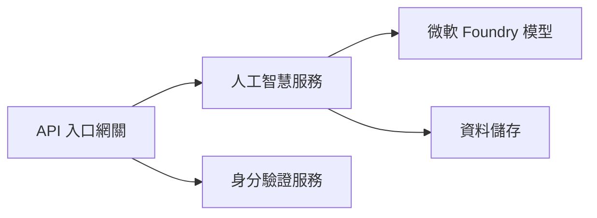
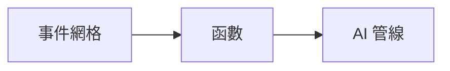

# 第8章：生產與企業模式

**📚 課程**：[AZD 初學者指南](../../README.md) | **⏱️ 時長**：2-3 小時 | **⭐ 難度**：進階

---

## 概覽

本章涵蓋企業級部署模式、安全強化、監控以及生產 AI 工作負載的成本優化。

> 已於2026年3月透過 `azd 1.23.12` 驗證。

## 學習目標

完成本章後，您將能：
- 部署多區域高復原應用
- 實作企業安全模式
- 配置全面性監控
- 大規模優化成本
- 使用 AZD 設置 CI/CD 管線

---

## 📚 課程內容

| # | 課程 | 說明 | 時間 |
|---|--------|-------------|------|
| 1 | [生產 AI 實務](production-ai-practices.md) | 企業部署模式 | 90 分鐘 |

---

## 🚀 生產檢查清單

- [ ] 多區域部署以提升復原力
- [ ] 使用受管身分驗證（無需密鑰）
- [ ] 採用 Application Insights 進行監控
- [ ] 設定成本預算及警示
- [ ] 啟用安全掃描
- [ ] 整合 CI/CD 管線
- [ ] 災難復原計畫

---

## 🏗️ 架構模式

### 模式 1：微服務 AI


### 模式 2：事件驅動 AI


---

## 🔐 安全最佳實務

```bicep
// Use managed identity
identity: {
  type: 'SystemAssigned'
}

// Private endpoints for AI services
properties: {
  publicNetworkAccess: 'Disabled'
  networkAcls: {
    defaultAction: 'Deny'
  }
}
```

---

## 💰 成本優化

| 策略 | 節省幅度 |
|----------|---------|
| 零負載自動縮減（容器應用） | 60-80% |
| 開發環境使用消耗層級 | 50-70% |
| 排程擴縮容 | 30-50% |
| 預留容量 | 20-40% |

```bash
# 設定預算提醒
az consumption budget create \
  --budget-name "AI-Budget" \
  --amount 500 \
  --category Cost \
  --time-grain Monthly
```

---

## 📊 監控設置

```bash
# 串流日誌
azd monitor --logs

# 檢查應用程式分析
azd monitor --overview

# 查看指標
az monitor metrics list --resource <resource-id>
```

---

## 🔗 導覽

| 方向 | 章節 |
|-----------|---------|
| <strong>上一章</strong> | [第7章：故障排除](../chapter-07-troubleshooting/README.md) |
| <strong>完成課程</strong> | [課程首頁](../../README.md) |

---

## 📖 相關資源

- [AI 代理指南](../chapter-02-ai-development/agents.md)
- [Application Insights](../chapter-06-pre-deployment/application-insights.md)
- [多代理解決方案](../chapter-05-multi-agent/README.md)
- [微服務範例](../../examples/microservices/README.md)

---

<!-- CO-OP TRANSLATOR DISCLAIMER START -->
**免責聲明**：  
本文件使用 AI 翻譯服務 [Co-op Translator](https://github.com/Azure/co-op-translator) 進行翻譯。雖然我們努力確保準確性，但請注意自動翻譯可能包含錯誤或不準確之處。原始文件的母語版本應視為權威來源。對於重要資訊，建議採用專業人工翻譯。我們不對因使用本翻譯而產生的任何誤解或誤釋負責。
<!-- CO-OP TRANSLATOR DISCLAIMER END -->