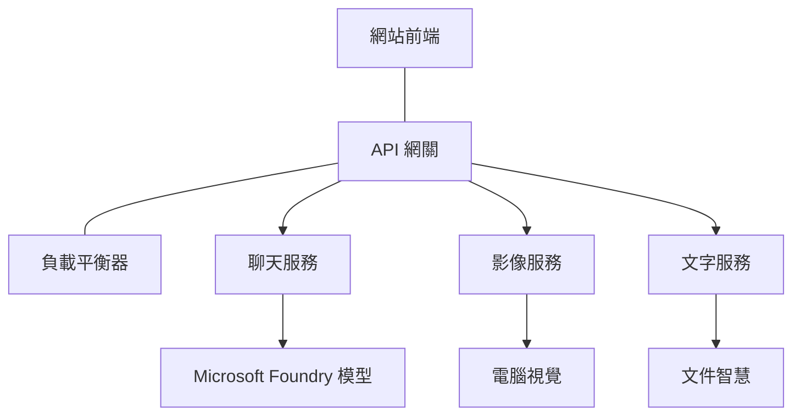

# 使用 AZD 部署生產級 AI 工作負載的最佳實務

**章節導覽：**
- **📚 課程首頁**: [AZD 初學者指南](../../README.md)
- **📖 目前章節**: 第 8 章 - 生產與企業模式
- **⬅️ 前一章**: [第 7 章：疑難排解](../chapter-07-troubleshooting/debugging.md)
- **⬅️ 另有相關**: [AI 工作坊實驗室](ai-workshop-lab.md)
- **🎯 完成課程**: [AZD 初學者指南](../../README.md)

## 概覽

本指南提供使用 Azure Developer CLI (AZD) 部署生產就緒 AI 工作負載的完整最佳實務。根據 Microsoft Foundry Discord 社群的回饋與實際客戶部署經驗，這些做法針對生產 AI 系統中最常見的挑戰提出解決方案。

## 處理的主要挑戰

根據我們的社群投票結果，開發者面臨的主要挑戰如下：

- **45%** 在多服務 AI 部署上遇到困難
- **38%** 在憑證與密鑰管理方面有問題  
- **35%** 覺得生產可用性與擴充困難
- **32%** 需要更好的成本優化策略
- **29%** 需要改進監控與除錯

## 生產級 AI 的架構模式

### 模式 1：微服務 AI 架構

<strong>使用時機</strong>：具有多種能力的複雜 AI 應用


**AZD 實作**：

```yaml
# azure.yaml
name: enterprise-ai-platform
services:
  web:
    project: ./web
    host: staticwebapp
  api-gateway:
    project: ./api-gateway
    host: containerapp
  chat-service:
    project: ./services/chat
    host: containerapp
  vision-service:
    project: ./services/vision
    host: containerapp
  text-service:
    project: ./services/text
    host: containerapp
```

### 模式 2：事件驅動 AI 處理

<strong>使用時機</strong>：批次處理、文件分析、非同步工作流程

```bicep
// Event Hub for AI processing pipeline
resource eventHub 'Microsoft.EventHub/namespaces@2023-01-01-preview' = {
  name: eventHubNamespaceName
  location: location
  sku: {
    name: 'Standard'
    tier: 'Standard'
    capacity: 1
  }
}

// Service Bus for reliable message processing
resource serviceBus 'Microsoft.ServiceBus/namespaces@2022-10-01-preview' = {
  name: serviceBusNamespaceName
  location: location
  sku: {
    name: 'Premium'
    tier: 'Premium'
    capacity: 1
  }
}

// Function App for processing
resource functionApp 'Microsoft.Web/sites@2023-01-01' = {
  name: functionAppName
  location: location
  kind: 'functionapp,linux'
  properties: {
    siteConfig: {
      appSettings: [
        {
          name: 'FUNCTIONS_EXTENSION_VERSION'
          value: '~4'
        }
        {
          name: 'AZURE_OPENAI_ENDPOINT'
          value: '@Microsoft.KeyVault(VaultName=${keyVault.name};SecretName=openai-endpoint)'
        }
      ]
    }
  }
}
```

## 關於 AI 代理健康狀態的思考

當傳統的網站應用程式出現故障時，症狀通常很明顯：頁面無法載入、API 回傳錯誤或部署失敗。AI 驅動的應用程式可能也會以相同方式故障——但它們也可能以更細微、不會產生明顯錯誤訊息的方式表現異常。

本節幫助你建立監控 AI 工作負載的心智模型，讓你在情況不對時知道該往哪裡查看。

### 代理健康與傳統應用健康的差異

傳統應用要麼能運作，要麼不能。AI 代理看起來可能能運作，但會產生差的結果。把代理健康想成兩層：

| 層級 | 觀察重點 | 檢查位置 |
|-------|--------------|---------------|
| <strong>基礎設施健康</strong> | 服務是否在執行？資源是否已佈建？端點是否可達？ | `azd monitor`、Azure Portal 資源健康、容器/應用程式日誌 |
| <strong>行為健康</strong> | 代理回應是否準確？回應是否及時？模型呼叫是否正確？ | Application Insights 追蹤、模型呼叫延遲指標、回應品質日誌 |

基礎設施健康是熟悉的面向——對任何 azd 應用都一樣。行為健康是 AI 工作負載所新增的層面。

### 當 AI 應用表現異常時該查看的地方

如果你的 AI 應用未產生預期結果，以下是概念性的檢查清單：

1. **從基本檢查開始。** 應用程式是否在執行？能否連到其相依服務？像任何應用程式一樣檢查 `azd monitor` 和資源健康。
2. **檢查模型連線。** 應用程式是否成功呼叫 AI 模型？模型呼叫失敗或逾時是 AI 應用問題最常見的原因，通常會顯示在應用程式日誌中。
3. **查看模型收到的內容。** AI 的回應取決於輸入（提示與任何擷取到的上下文）。如果輸出錯誤，通常是輸入有問題。檢查你的應用程式是否傳送了正確的資料給模型。
4. **檢閱回應延遲。** AI 模型呼叫比一般 API 呼叫更慢。如果應用程式感覺遲緩，檢查模型回應時間是否增加——這可能表示節流、容量限制或區域層級的擁塞。
5. **注意成本訊號。** 代幣使用量或 API 呼叫的意外激增可能表示迴圈、錯誤設定的提示或過度重試。

你不需要一開始就精通可觀察性工具。關鍵是：AI 應用多了一層需監控的行為面向，而 azd 內建的監控（`azd monitor`）提供一個調查兩個層面的起點。

---

## 安全最佳實務

### 1. 零信任安全模型

<strong>實作策略</strong>：
- 未經驗證不得進行服務間通訊
- 所有 API 呼叫使用 Managed Identities
- 使用 private endpoints 進行網路隔離
- 最小權限存取控制

```bicep
// Managed Identity for each service
resource chatServiceIdentity 'Microsoft.ManagedIdentity/userAssignedIdentities@2023-01-31' = {
  name: 'chat-service-identity'
  location: location
}

// Role assignments with minimal permissions
resource openAIUserRole 'Microsoft.Authorization/roleAssignments@2022-04-01' = {
  scope: openAIAccount
  name: guid(openAIAccount.id, chatServiceIdentity.id, openAIUserRoleDefinitionId)
  properties: {
    roleDefinitionId: subscriptionResourceId('Microsoft.Authorization/roleDefinitions', '5e0bd9bd-7b93-4f28-af87-19fc36ad61bd')
    principalId: chatServiceIdentity.properties.principalId
    principalType: 'ServicePrincipal'
  }
}
```

### 2. 安全的機密管理

**Key Vault 整合範式**：

```bicep
// Key Vault with proper access policies
resource keyVault 'Microsoft.KeyVault/vaults@2023-02-01' = {
  name: keyVaultName
  location: location
  properties: {
    tenantId: tenant().tenantId
    sku: {
      family: 'A'
      name: 'premium'  // Use premium for production
    }
    enableRbacAuthorization: true  // Use RBAC instead of access policies
    enablePurgeProtection: true    // Prevent accidental deletion
    enableSoftDelete: true
    softDeleteRetentionInDays: 90
  }
}

// Store all AI service credentials
resource openAIKeySecret 'Microsoft.KeyVault/vaults/secrets@2023-02-01' = {
  parent: keyVault
  name: 'openai-api-key'
  properties: {
    value: openAIAccount.listKeys().key1
    attributes: {
      enabled: true
    }
  }
}
```

### 3. 網路安全

**Private Endpoint 設定**：

```bicep
// Virtual Network for AI services
resource virtualNetwork 'Microsoft.Network/virtualNetworks@2023-04-01' = {
  name: vnetName
  location: location
  properties: {
    addressSpace: {
      addressPrefixes: ['10.0.0.0/16']
    }
    subnets: [
      {
        name: 'ai-services-subnet'
        properties: {
          addressPrefix: '10.0.1.0/24'
          privateEndpointNetworkPolicies: 'Disabled'
        }
      }
      {
        name: 'app-services-subnet'
        properties: {
          addressPrefix: '10.0.2.0/24'
          delegations: [
            {
              name: 'Microsoft.Web/serverFarms'
              properties: {
                serviceName: 'Microsoft.Web/serverFarms'
              }
            }
          ]
        }
      }
    ]
  }
}

// Private endpoints for all AI services
resource openAIPrivateEndpoint 'Microsoft.Network/privateEndpoints@2023-04-01' = {
  name: '${openAIAccountName}-pe'
  location: location
  properties: {
    subnet: {
      id: virtualNetwork.properties.subnets[0].id
    }
    privateLinkServiceConnections: [
      {
        name: 'openai-connection'
        properties: {
          privateLinkServiceId: openAIAccount.id
          groupIds: ['account']
        }
      }
    ]
  }
}
```

## 效能與擴充

### 1. 自動調整策略

**Container Apps 自動擴充**：

```bicep
resource containerApp 'Microsoft.App/containerApps@2023-05-01' = {
  name: containerAppName
  location: location
  properties: {
    configuration: {
      ingress: {
        external: true
        targetPort: 8000
        transport: 'http'
      }
    }
    template: {
      scale: {
        minReplicas: 2  // Always have 2 instances minimum
        maxReplicas: 50 // Scale up to 50 for high load
        rules: [
          {
            name: 'http-scaling'
            http: {
              metadata: {
                concurrentRequests: '20'  // Scale when >20 concurrent requests
              }
            }
          }
          {
            name: 'cpu-scaling'
            custom: {
              type: 'cpu'
              metadata: {
                type: 'Utilization'
                value: '70'  // Scale when CPU >70%
              }
            }
          }
        ]
      }
    }
  }
}
```

### 2. 快取策略

**針對 AI 回應的 Redis 快取**：

```bicep
// Redis Premium for production workloads
resource redisCache 'Microsoft.Cache/redis@2023-04-01' = {
  name: redisCacheName
  location: location
  properties: {
    sku: {
      name: 'Premium'
      family: 'P'
      capacity: 1
    }
    enableNonSslPort: false
    minimumTlsVersion: '1.2'
    redisConfiguration: {
      'maxmemory-policy': 'allkeys-lru'
    }
    // Enable clustering for high availability
    redisVersion: '6.0'
    shardCount: 2
  }
}

// Cache configuration in application
var cacheConnectionString = '${redisCache.properties.hostName}:6380,password=${redisCache.listKeys().primaryKey},ssl=True,abortConnect=False'
```

### 3. 負載平衡與流量管理

**搭配 WAF 的 Application Gateway**：

```bicep
// Application Gateway with Web Application Firewall
resource applicationGateway 'Microsoft.Network/applicationGateways@2023-04-01' = {
  name: appGatewayName
  location: location
  properties: {
    sku: {
      name: 'WAF_v2'
      tier: 'WAF_v2'
      capacity: 2
    }
    webApplicationFirewallConfiguration: {
      enabled: true
      firewallMode: 'Prevention'
      ruleSetType: 'OWASP'
      ruleSetVersion: '3.2'
    }
    // Backend pools for AI services
    backendAddressPools: [
      {
        name: 'ai-services-pool'
        properties: {
          backendAddresses: [
            {
              fqdn: '${containerApp.properties.configuration.ingress.fqdn}'
            }
          ]
        }
      }
    ]
  }
}
```

## 💰 成本優化

### 1. 資源適當調整

<strong>環境專屬設定</strong>：

```bash
# 開發環境
azd env new development
azd env set AZURE_OPENAI_SKU "S0"
azd env set AZURE_OPENAI_CAPACITY 10
azd env set AZURE_SEARCH_SKU "basic"
azd env set CONTAINER_CPU 0.5
azd env set CONTAINER_MEMORY 1.0

# 生產環境
azd env new production
azd env set AZURE_OPENAI_SKU "S0"
azd env set AZURE_OPENAI_CAPACITY 100
azd env set AZURE_SEARCH_SKU "standard"
azd env set CONTAINER_CPU 2.0
azd env set CONTAINER_MEMORY 4.0
```

### 2. 成本監控與預算

```bicep
// Cost management and budgets
resource budget 'Microsoft.Consumption/budgets@2023-05-01' = {
  name: 'ai-workload-budget'
  properties: {
    timePeriod: {
      startDate: '2024-01-01'
      endDate: '2024-12-31'
    }
    timeGrain: 'Monthly'
    amount: 2000  // $2000 monthly budget
    category: 'Cost'
    notifications: {
      warning: {
        enabled: true
        operator: 'GreaterThan'
        threshold: 80
        contactEmails: [
          'finance@company.com'
          'engineering@company.com'
        ]
        contactRoles: [
          'Owner'
          'Contributor'
        ]
      }
      critical: {
        enabled: true
        operator: 'GreaterThan'
        threshold: 95
        contactEmails: [
          'cto@company.com'
        ]
      }
    }
  }
}
```

### 3. 代幣使用優化

**OpenAI 成本管理**：

```typescript
// 應用程式層級的 token 最佳化
class TokenOptimizer {
  private readonly maxTokens = 4000;
  private readonly reserveTokens = 500;
  
  optimizePrompt(userInput: string, context: string): string {
    const availableTokens = this.maxTokens - this.reserveTokens;
    const estimatedTokens = this.estimateTokens(userInput + context);
    
    if (estimatedTokens > availableTokens) {
      // 截斷上下文，而不是使用者輸入
      context = this.truncateContext(context, availableTokens - this.estimateTokens(userInput));
    }
    
    return `${context}\n\nUser: ${userInput}`;
  }
  
  private estimateTokens(text: string): number {
    // 粗略估計：1 個 token ≈ 4 個字元
    return Math.ceil(text.length / 4);
  }
}
```

## 監控與可觀察性

### 1. 全方位 Application Insights

```bicep
// Application Insights with advanced features
resource applicationInsights 'Microsoft.Insights/components@2020-02-02' = {
  name: applicationInsightsName
  location: location
  kind: 'web'
  properties: {
    Application_Type: 'web'
    WorkspaceResourceId: logAnalyticsWorkspace.id
    SamplingPercentage: 100  // Full sampling for AI apps
    DisableIpMasking: false  // Enable for security
  }
}

// Custom metrics for AI operations
resource aiMetricAlerts 'Microsoft.Insights/metricAlerts@2018-03-01' = {
  name: 'ai-high-error-rate'
  location: 'global'
  properties: {
    description: 'Alert when AI service error rate is high'
    severity: 2
    enabled: true
    scopes: [
      applicationInsights.id
    ]
    evaluationFrequency: 'PT1M'
    windowSize: 'PT5M'
    criteria: {
      'odata.type': 'Microsoft.Azure.Monitor.SingleResourceMultipleMetricCriteria'
      allOf: [
        {
          name: 'high-error-rate'
          metricName: 'requests/failed'
          operator: 'GreaterThan'
          threshold: 10
          timeAggregation: 'Count'
        }
      ]
    }
  }
}
```

### 2. AI 專屬監控

**AI 指標的自訂儀表板**：

```json
// Dashboard configuration for AI workloads
{
  "dashboard": {
    "name": "AI Application Monitoring",
    "tiles": [
      {
        "name": "OpenAI Request Volume",
        "query": "requests | where name contains 'openai' | summarize count() by bin(timestamp, 5m)"
      },
      {
        "name": "AI Response Latency",
        "query": "requests | where name contains 'openai' | summarize avg(duration) by bin(timestamp, 5m)"
      },
      {
        "name": "Token Usage",
        "query": "customMetrics | where name == 'openai_tokens_used' | summarize sum(value) by bin(timestamp, 1h)"
      },
      {
        "name": "Cost per Hour",
        "query": "customMetrics | where name == 'openai_cost' | summarize sum(value) by bin(timestamp, 1h)"
      }
    ]
  }
}
```

### 3. 健檢與可用性監控

```bicep
// Application Insights availability tests
resource availabilityTest 'Microsoft.Insights/webtests@2022-06-15' = {
  name: 'ai-app-availability-test'
  location: location
  tags: {
    'hidden-link:${applicationInsights.id}': 'Resource'
  }
  properties: {
    SyntheticMonitorId: 'ai-app-availability-test'
    Name: 'AI Application Availability Test'
    Description: 'Tests AI application endpoints'
    Enabled: true
    Frequency: 300  // 5 minutes
    Timeout: 120    // 2 minutes
    Kind: 'ping'
    Locations: [
      {
        Id: 'us-east-2-azr'
      }
      {
        Id: 'us-west-2-azr'
      }
    ]
    Configuration: {
      WebTest: '''
        <WebTest Name="AI Health Check" 
                 Id="8d2de8d2-a2b0-4c2e-9a0d-8f9c9a0b8c8d" 
                 Enabled="True" 
                 CssProjectStructure="" 
                 CssIteration="" 
                 Timeout="120" 
                 WorkItemIds="" 
                 xmlns="http://microsoft.com/schemas/VisualStudio/TeamTest/2010" 
                 Description="" 
                 CredentialUserName="" 
                 CredentialPassword="" 
                 PreAuthenticate="True" 
                 Proxy="default" 
                 StopOnError="False" 
                 RecordedResultFile="" 
                 ResultsLocale="">
          <Items>
            <Request Method="GET" 
                     Guid="a5f10126-e4cd-570d-961c-cea43999a200" 
                     Version="1.1" 
                     Url="${webApp.properties.defaultHostName}/health" 
                     ThinkTime="0" 
                     Timeout="120" 
                     ParseDependentRequests="True" 
                     FollowRedirects="True" 
                     RecordResult="True" 
                     Cache="False" 
                     ResponseTimeGoal="0" 
                     Encoding="utf-8" 
                     ExpectedHttpStatusCode="200" 
                     ExpectedResponseUrl="" 
                     ReportingName="" 
                     IgnoreHttpStatusCode="False" />
          </Items>
        </WebTest>
      '''
    }
  }
}
```

## 災難復原與高可用性

### 1. 多區域部署

```yaml
# azure.yaml - Multi-region configuration
name: ai-app-multiregion
services:
  api-primary:
    project: ./api
    host: containerapp
    env:
      - AZURE_REGION=eastus
  api-secondary:
    project: ./api
    host: containerapp
    env:
      - AZURE_REGION=westus2
```

```bicep
// Traffic Manager for global load balancing
resource trafficManager 'Microsoft.Network/trafficManagerProfiles@2022-04-01' = {
  name: trafficManagerProfileName
  location: 'global'
  properties: {
    profileStatus: 'Enabled'
    trafficRoutingMethod: 'Priority'
    dnsConfig: {
      relativeName: trafficManagerProfileName
      ttl: 30
    }
    monitorConfig: {
      protocol: 'HTTPS'
      port: 443
      path: '/health'
      intervalInSeconds: 30
      toleratedNumberOfFailures: 3
      timeoutInSeconds: 10
    }
    endpoints: [
      {
        name: 'primary-endpoint'
        type: 'Microsoft.Network/trafficManagerProfiles/azureEndpoints'
        properties: {
          targetResourceId: primaryAppService.id
          endpointStatus: 'Enabled'
          priority: 1
        }
      }
      {
        name: 'secondary-endpoint'
        type: 'Microsoft.Network/trafficManagerProfiles/azureEndpoints'
        properties: {
          targetResourceId: secondaryAppService.id
          endpointStatus: 'Enabled'
          priority: 2
        }
      }
    ]
  }
}
```

### 2. 數據備份與復原

```bicep
// Backup configuration for critical data
resource backupVault 'Microsoft.DataProtection/backupVaults@2023-05-01' = {
  name: backupVaultName
  location: location
  identity: {
    type: 'SystemAssigned'
  }
  properties: {
    storageSettings: [
      {
        datastoreType: 'VaultStore'
        type: 'LocallyRedundant'
      }
    ]
  }
}

// Backup policy for AI models and data
resource backupPolicy 'Microsoft.DataProtection/backupVaults/backupPolicies@2023-05-01' = {
  parent: backupVault
  name: 'ai-data-backup-policy'
  properties: {
    policyRules: [
      {
        backupParameters: {
          backupType: 'Full'
          objectType: 'AzureBackupParams'
        }
        trigger: {
          schedule: {
            repeatingTimeIntervals: [
              'R/2024-01-01T02:00:00+00:00/P1D'  // Daily at 2 AM
            ]
          }
          objectType: 'ScheduleBasedTriggerContext'
        }
        dataStore: {
          datastoreType: 'VaultStore'
          objectType: 'DataStoreInfoBase'
        }
        name: 'BackupDaily'
        objectType: 'AzureBackupRule'
      }
    ]
  }
}
```

## DevOps 與 CI/CD 整合

### 1. GitHub Actions 工作流程

```yaml
# .github/workflows/deploy-ai-app.yml
name: Deploy AI Application

on:
  push:
    branches: [main]
  pull_request:
    branches: [main]

jobs:
  test:
    runs-on: ubuntu-latest
    steps:
      - uses: actions/checkout@v4
      
      - name: Setup Python
        uses: actions/setup-python@v4
        with:
          python-version: '3.11'
          
      - name: Install dependencies
        run: |
          pip install -r requirements.txt
          pip install pytest
          
      - name: Run tests
        run: pytest tests/
        
      - name: AI Safety Tests
        run: |
          python scripts/test_ai_safety.py
          python scripts/validate_prompts.py

  deploy-staging:
    needs: test
    if: github.event_name == 'pull_request'
    runs-on: ubuntu-latest
    steps:
      - uses: actions/checkout@v4
      
      - name: Setup AZD
        uses: Azure/setup-azd@v1.0.0
        
      - name: Login to Azure
        uses: azure/login@v1
        with:
          creds: ${{ secrets.AZURE_CREDENTIALS }}
          
      - name: Deploy to Staging
        run: |
          azd env select staging
          azd deploy

  deploy-production:
    needs: test
    if: github.ref == 'refs/heads/main'
    runs-on: ubuntu-latest
    steps:
      - uses: actions/checkout@v4
      
      - name: Setup AZD
        uses: Azure/setup-azd@v1.0.0
        
      - name: Login to Azure
        uses: azure/login@v1
        with:
          creds: ${{ secrets.AZURE_CREDENTIALS }}
          
      - name: Deploy to Production
        run: |
          azd env select production
          azd deploy
          
      - name: Run Production Health Checks
        run: |
          python scripts/health_check.py --env production
```

### 2. 基礎設施驗證

```bash
# scripts/validate_infrastructure.sh
#!/bin/bash

echo "Validating AI infrastructure deployment..."

# 檢查所有必要的服務是否正在執行
services=("openai" "search" "storage" "keyvault")
for service in "${services[@]}"; do
    echo "Checking $service..."
    if ! az resource list --resource-type "Microsoft.CognitiveServices/accounts" --query "[?contains(name, '$service')]" -o tsv; then
        echo "ERROR: $service not found"
        exit 1
    fi
done

# 驗證 OpenAI 模型部署
echo "Validating OpenAI model deployments..."
models=$(az cognitiveservices account deployment list --name $AZURE_OPENAI_NAME --resource-group $AZURE_RESOURCE_GROUP --query "[].name" -o tsv)
if [[ ! $models == *"gpt-35-turbo"* ]]; then
    echo "ERROR: Required model gpt-35-turbo not deployed"
    exit 1
fi

# 測試 AI 服務連線
echo "Testing AI service connectivity..."
python scripts/test_connectivity.py

echo "Infrastructure validation completed successfully!"
```

## 生產就緒檢查清單

### 安全 ✅
- [ ] 所有服務使用 Managed Identities
- [ ] 機密儲存在 Key Vault
- [ ] 已設定 private endpoints
- [ ] 已實作網路安全群組
- [ ] 以最小權限實作 RBAC
- [ ] 在公開端點啟用 WAF

### 效能 ✅
- [ ] 已設定自動調整
- [ ] 已實作快取
- [ ] 已設定負載平衡
- [ ] 靜態內容使用 CDN
- [ ] 資料庫連線池
- [ ] Token 使用優化

### 監控 ✅
- [ ] 已設定 Application Insights
- [ ] 已定義自訂指標
- [ ] 已設定警示規則
- [ ] 已建立儀表板
- [ ] 已實作健康檢查
- [ ] 已設定日誌保留政策

### 可靠性 ✅
- [ ] 多區域部署
- [ ] 備份與復原計畫
- [ ] 已實作斷路器
- [ ] 已設定重試策略
- [ ] 優雅降級
- [ ] 健康檢查端點

### 成本管理 ✅
- [ ] 已設定預算警示
- [ ] 資源適當調整
- [ ] 已套用開發/測試折扣
- [ ] 已購買預留實例
- [ ] 成本監控儀表板
- [ ] 定期成本檢討

### 合規性 ✅
- [ ] 已符合資料區域性要求
- [ ] 已啟用稽核日誌
- [ ] 已套用合規性政策
- [ ] 已實作安全基準
- [ ] 定期安全評估
- [ ] 事件回應計畫

## 效能基準

### 典型生產指標

| 指標 | 目標 | 監控方式 |
|--------|--------|------------|
| <strong>回應時間</strong> | < 2 秒 | Application Insights |
| <strong>可用性</strong> | 99.9% | 可用性監控 |
| <strong>錯誤率</strong> | < 0.1% | 應用程式日誌 |
| <strong>代幣使用</strong> | < $500/month | 成本管理 |
| <strong>同時使用者</strong> | 1000+ | 壓力測試 |
| <strong>復原時間</strong> | < 1 hour | 災難復原測試 |

### 壓力測試

```bash
# 用於 AI 應用的負載測試腳本
python scripts/load_test.py \
  --endpoint https://your-ai-app.azurewebsites.net \
  --concurrent-users 100 \
  --duration 300 \
  --ramp-up 60
```

## 🤝 社群最佳實務

根據 Microsoft Foundry Discord 社群回饋：

### 社群的首要建議：

1. **從小開始，逐步擴展**：以基本的 SKU 起步，並根據實際使用情況再擴充
2. <strong>全面監控</strong>：從第一天起就建立完整的監控
3. <strong>自動化安全</strong>：使用基礎設施即程式碼以維持一致的安全性
4. <strong>充分測試</strong>：在你的管線中納入 AI 專屬測試
5. <strong>成本規劃</strong>：及早監控代幣使用並設定預算警示

### 常見陷阱避免：

- ❌ 在程式碼中硬編 API 金鑰
- ❌ 未建立適當的監控
- ❌ 忽略成本優化
- ❌ 未測試故障情境
- ❌ 未部署健康檢查就上線

## AZD AI CLI 指令與擴充套件

AZD 包含一組不斷擴充的 AI 專屬指令與擴充套件，可簡化生產級 AI 工作流程。這些工具縮短了本地開發與 AI 工作負載生產部署之間的差距。

### AZD 的 AI 擴充套件

AZD 使用擴充系統來新增 AI 專屬功能。安裝與管理擴充套件：

```bash
# 列出所有可用的擴充功能（包括 AI）
azd extension list

# 安裝 Foundry agents 擴充功能
azd extension install azure.ai.agents

# 安裝微調擴充功能
azd extension install azure.ai.finetune

# 安裝自訂模型擴充功能
azd extension install azure.ai.models

# 升級所有已安裝的擴充功能
azd extension upgrade --all
```

**可用的 AI 擴充套件：**

| Extension | Purpose | Status |
|-----------|---------|--------|
| `azure.ai.agents` | Foundry Agent Service 管理 | 預覽 |
| `azure.ai.finetune` | Foundry 模型微調 | 預覽 |
| `azure.ai.models` | Foundry 自訂模型 | 預覽 |
| `azure.coding-agent` | 程式碼代理設定 | 可用 |

### 使用 `azd ai agent init` 初始化代理專案

`azd ai agent init` 指令會搭建與 Microsoft Foundry Agent Service 整合的生產就緒 AI 代理專案：

```bash
# 從代理清單初始化一個新的代理專案
azd ai agent init -m <manifest-path-or-uri>

# 初始化並指定特定的 Foundry 專案為目標
azd ai agent init -m agent-manifest.yaml --project-id <foundry-project-id>

# 使用自訂來源目錄初始化
azd ai agent init -m agent-manifest.yaml --src ./agents/my-agent

# 以 Container Apps 作為主機
azd ai agent init -m agent-manifest.yaml --host containerapp
```

**主要參數：**

| Flag | Description |
|------|-------------|
| `-m, --manifest` | 要加入專案的 agent manifest 的路徑或 URI |
| `-p, --project-id` | 用於你的 azd 環境的既有 Microsoft Foundry 專案 ID |
| `-s, --src` | 下載代理定義的目錄（預設為 `src/<agent-id>`） |
| `--host` | 覆寫預設主機（例如：`containerapp`） |
| `-e, --environment` | 要使用的 azd 環境 |

<strong>生產提示</strong>：使用 `--project-id` 直接連接到既有的 Foundry 專案，從一開始就將你的代理程式碼與雲端資源連結。

### 使用 `azd mcp` 的模型上下文協定 (MCP)

AZD 包含內建的 MCP 伺服器支援（Alpha），使 AI 代理與工具可以透過標準化協定與你的 Azure 資源互動：

```bash
# 為您的專案啟動 MCP 伺服器
azd mcp start

# 管理 MCP 操作的工具授權
azd mcp consent
```

MCP 伺服器會將你的 azd 專案內容（環境、服務與 Azure 資源）暴露給 AI 驅動的開發工具。這可支援：

- **AI 協助的部署**：讓程式碼代理查詢你的專案狀態並觸發部署
- <strong>資源探索</strong>：AI 工具能發現你的專案使用了哪些 Azure 資源
- <strong>環境管理</strong>：代理可在開發/測試/生產環境間切換

### 使用 `azd infra generate` 產生基礎設施

針對生產級 AI 工作負載，你可以產生並自訂基礎設施即程式碼，而不是依賴自動佈建：

```bash
# 從您的專案定義產生 Bicep/Terraform 檔案
azd infra generate
```

此操作會將 IaC 寫入磁碟，讓你可以：
- 在部署前審查並稽核基礎設施
- 新增自訂安全政策（網路規則、private endpoints）
- 與既有的 IaC 審查流程整合
- 將基礎設施變更與應用程式程式碼分開版本控制

### 生產生命週期掛鉤

AZD 的掛鉤讓你在部署生命週期的每個階段注入自訂邏輯——這對生產級 AI 工作流程至關重要：

```yaml
# azure.yaml - Production hooks example
name: ai-production-app
hooks:
  preprovision:
    shell: sh
    run: scripts/validate-quotas.sh    # Check AI model quota before provisioning
  postprovision:
    shell: sh
    run: scripts/configure-networking.sh  # Set up private endpoints
  predeploy:
    shell: sh
    run: scripts/run-ai-safety-tests.sh  # Run prompt safety checks
  postdeploy:
    shell: sh
    run: scripts/smoke-test.sh           # Verify agent responses post-deploy
services:
  agent-api:
    project: ./src/agent
    host: containerapp
    hooks:
      predeploy:
        shell: sh
        run: scripts/validate-model-access.sh  # Per-service hook
```

```bash
# 在開發期間手動執行特定的掛勾
azd hooks run predeploy
```

**建議的 AI 工作負載生產掛鉤：**

| Hook | Use Case |
|------|----------|
| `preprovision` | 驗證訂閱配額以確保 AI 模型容量 |
| `postprovision` | 設定 private endpoints，部署模型權重 |
| `predeploy` | 執行 AI 安全測試，驗證提示範本 |
| `postdeploy` | 簡易測試代理回應，驗證模型連線 |

### CI/CD 管線設定

使用 `azd pipeline config` 將你的專案連接到 GitHub Actions 或 Azure Pipelines，並使用安全的 Azure 認證：

```bash
# 設定 CI/CD 管線（互動式）
azd pipeline config

# 使用特定提供者進行設定
azd pipeline config --provider github
```

此指令會：
- 建立具最小權限存取的服務主體
- 設定聯合憑證（不儲存的祕密）
- 生成或更新你的管線定義檔
- 在你的 CI/CD 系統中設定所需的環境變數

**使用 pipeline config 的生產工作流程：**

```bash
# 1. 設定生產環境
azd env new production
azd env set AZURE_OPENAI_CAPACITY 100

# 2. 設定管線
azd pipeline config --provider github

# 3. 管線會在每次推送到 main 分支時執行 azd deploy
```

### 使用 `azd add` 新增元件

逐步向既有專案新增 Azure 服務：

```bash
# 以互動方式新增一個服務元件
azd add
```

這對擴展生產 AI 應用特別有用——例如向既有部署新增向量搜尋服務、新的代理端點或監控元件。

## 其他資源
- **Azure Well-Architected Framework**: [AI 工作負載指引](https://learn.microsoft.com/azure/well-architected/ai/)
- **Microsoft Foundry Documentation**: [官方文件](https://learn.microsoft.com/azure/ai-studio/)
- <strong>社群範本</strong>: [Azure Samples](https://github.com/Azure-Samples)
- **Discord 社群**: [#Azure channel](https://discord.gg/microsoft-azure)
- **Agent Skills for Azure**: [microsoft/github-copilot-for-azure on skills.sh](https://skills.sh/microsoft/github-copilot-for-azure) - 37 個針對 Azure AI、Foundry、部署、成本最佳化與診斷的開放代理技能。安裝到你的編輯器：
  ```bash
  npx skills add microsoft/github-copilot-for-azure
  ```

---

**章節導覽：**
- **📚 課程首頁**: [AZD For Beginners](../../README.md)
- **📖 目前章節**: 第 8 章 - 生產與企業模式
- **⬅️ 上一章**: [第 7 章：疑難排解](../chapter-07-troubleshooting/debugging.md)
- **⬅️ 相關連結**: [AI Workshop Lab](ai-workshop-lab.md)
- **� 課程完成**: [AZD For Beginners](../../README.md)

<strong>記得</strong>：生產環境的 AI 工作負載需要謹慎規劃、監控，並持續優化。從這些模式開始，並依據你的特定需求進行調整。

---

<!-- CO-OP TRANSLATOR DISCLAIMER START -->
**Disclaimer**: 本文件已使用 AI 翻譯服務 [Co-op Translator](https://github.com/Azure/co-op-translator) 進行翻譯。雖然我們致力於維持準確性，但請注意，自動翻譯可能包含錯誤或不精確之處。原始文件的母語版本應被視為具權威性的來源。對於重要資訊，建議採用專業人工翻譯。我們不對因使用本翻譯而產生的任何誤解或誤釋負責。
<!-- CO-OP TRANSLATOR DISCLAIMER END -->