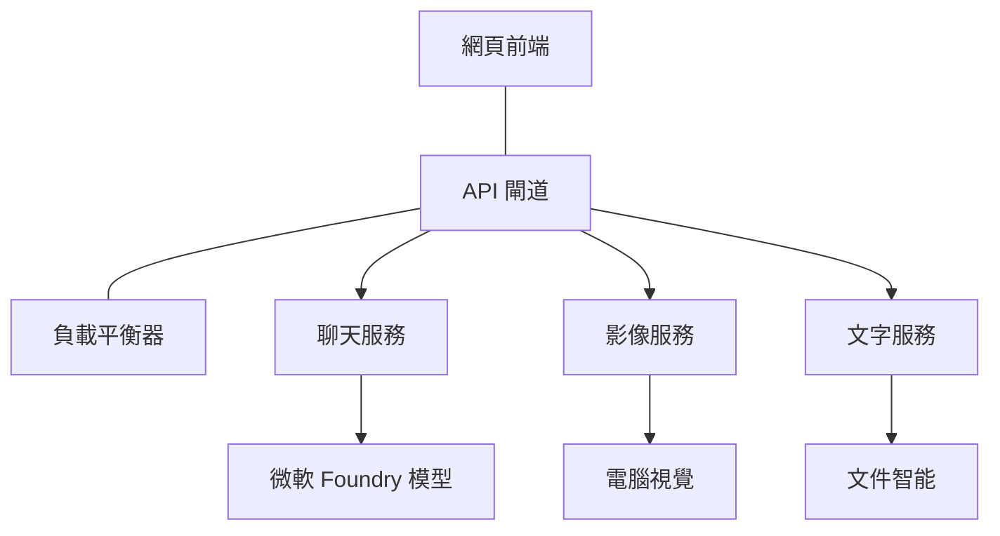

# 使用 AZD 的生產 AI 工作負載最佳實踐

**章節導覽：**
- **📚 課程首頁**: [AZD 新手入門](../../README.md)
- **📖 目前章節**: 第 8 章 - 生產與企業模式
- **⬅️ 上一章節**: [第 7 章：故障排除](../chapter-07-troubleshooting/debugging.md)
- **⬅️ 相關章節**: [AI 工作坊實驗室](ai-workshop-lab.md)
- **🎯 課程結束**: [AZD 新手入門](../../README.md)

## 概覽

本指南提供使用 Azure Developer CLI（AZD）部署生產就緒 AI 工作負載的全面最佳實踐。這些實踐基於 Microsoft Foundry Discord 社群的回饋及真實客戶部署案例，針對生產 AI 系統中最常見的挑戰提出解決方案。

## 主要挑戰

根據社群投票結果，開發者面臨的主要挑戰如下：

- **45%** 為多服務 AI 部署感到困難
- **38%** 在憑證與密鑰管理上遇到問題  
- **35%** 覺得生產就緒與擴展困難
- **32%** 需要更好的成本優化策略
- **29%** 需要改進監控與故障排除

## 生產 AI 的架構模式

### 模式 1：微服務 AI 架構

<strong>使用時機</strong>：具有多種功能的複雜 AI 應用


**AZD 實作**：

```yaml
# azure.yaml
name: enterprise-ai-platform
services:
  web:
    project: ./web
    host: staticwebapp
  api-gateway:
    project: ./api-gateway
    host: containerapp
  chat-service:
    project: ./services/chat
    host: containerapp
  vision-service:
    project: ./services/vision
    host: containerapp
  text-service:
    project: ./services/text
    host: containerapp
```

### 模式 2：事件驅動 AI 處理

<strong>使用時機</strong>：批次處理、文件分析、非同步工作流程

```bicep
// Event Hub for AI processing pipeline
resource eventHub 'Microsoft.EventHub/namespaces@2023-01-01-preview' = {
  name: eventHubNamespaceName
  location: location
  sku: {
    name: 'Standard'
    tier: 'Standard'
    capacity: 1
  }
}

// Service Bus for reliable message processing
resource serviceBus 'Microsoft.ServiceBus/namespaces@2022-10-01-preview' = {
  name: serviceBusNamespaceName
  location: location
  sku: {
    name: 'Premium'
    tier: 'Premium'
    capacity: 1
  }
}

// Function App for processing
resource functionApp 'Microsoft.Web/sites@2023-01-01' = {
  name: functionAppName
  location: location
  kind: 'functionapp,linux'
  properties: {
    siteConfig: {
      appSettings: [
        {
          name: 'FUNCTIONS_EXTENSION_VERSION'
          value: '~4'
        }
        {
          name: 'AZURE_OPENAI_ENDPOINT'
          value: '@Microsoft.KeyVault(VaultName=${keyVault.name};SecretName=openai-endpoint)'
        }
      ]
    }
  }
}
```

## 考慮 AI 代理健康狀態

傳統網頁應用故障時，常見症狀包括：頁面無法載入、API 回傳錯誤或部署失敗。AI 驅動的應用可能同樣會遇到這些問題，但也可能以更細微且沒有明顯錯誤訊息的方式異常。

本節協助你構建監控 AI 工作負載的心智模型，讓你知道在異常情況下應該從何處著手。

### 代理健康與傳統應用健康的不同

傳統應用是「正常工作」或「不工作」；AI 代理則可能表面正常，但生成結果很差。可將代理健康視為兩層：

| 層級 | 監控重點 | 觀察位置 |
|-------|----------|----------|
| <strong>基礎設施健康</strong> | 服務是否運行？資源是否已佈建？端點是否可達？ | `azd monitor`、Azure 入口網站資源健康、容器/應用日誌 |
| <strong>行為健康</strong> | 代理是否正確回應？回應是否及時？模型是否被正確調用？ | Application Insights 追蹤、模型調用延遲指標、回應品質日誌 |

基礎設施健康是所有 azd 應用共有的監控層；行為健康是 AI 工作負載特有的新層。

### 當 AI 應用異常時應檢查的位置

若 AI 應用未達預期結果，以下是一份概念性檢查清單：

1. <strong>先檢查基本狀態</strong>。應用是否運行？是否可連接依賴？使用 `azd monitor` 和資源健康檢查，跟其他應用相同方式。
2. <strong>檢查模型連接</strong>。應用是否成功呼叫 AI 模型？模型調用失敗或逾時是 AI 應用問題最常見的原因，會顯示在應用日誌中。
3. <strong>查看模型接收到的資料</strong>。AI 回應依賴輸入（prompt 與任何擷取到的上下文）。輸出錯誤大多因輸入錯誤。確認應用是否送出正確資料給模型。
4. <strong>檢查回應延遲</strong>。AI 模型調用比一般 API 較慢。若應用感覺遲緩，檢查是否模型回應時間變長，這可能表示被限流、容量不足或區域堵塞。
5. <strong>關注成本訊號</strong>。意外的 token 用量或 API 調用激增可能是迴圈、prompt 設定錯誤或重試過多的徵兆。

你不需要立刻精通觀察工具。關鍵是 AI 應用有額外的行為監控層，azd 內建監控 (`azd monitor`) 是調查兩層問題的起點。

---

## 安全最佳實踐

### 1. 零信任安全模型

<strong>實作策略</strong>：
- 未授權不得進行服務間通訊
- 所有 API 調用使用受管身份
- 網路隔離，採用私用端點
- 最小權限存取控管

```bicep
// Managed Identity for each service
resource chatServiceIdentity 'Microsoft.ManagedIdentity/userAssignedIdentities@2023-01-31' = {
  name: 'chat-service-identity'
  location: location
}

// Role assignments with minimal permissions
resource openAIUserRole 'Microsoft.Authorization/roleAssignments@2022-04-01' = {
  scope: openAIAccount
  name: guid(openAIAccount.id, chatServiceIdentity.id, openAIUserRoleDefinitionId)
  properties: {
    roleDefinitionId: subscriptionResourceId('Microsoft.Authorization/roleDefinitions', '5e0bd9bd-7b93-4f28-af87-19fc36ad61bd')
    principalId: chatServiceIdentity.properties.principalId
    principalType: 'ServicePrincipal'
  }
}
```

### 2. 安全密鑰管理

**Key Vault 整合模式**：

```bicep
// Key Vault with proper access policies
resource keyVault 'Microsoft.KeyVault/vaults@2023-02-01' = {
  name: keyVaultName
  location: location
  properties: {
    tenantId: tenant().tenantId
    sku: {
      family: 'A'
      name: 'premium'  // Use premium for production
    }
    enableRbacAuthorization: true  // Use RBAC instead of access policies
    enablePurgeProtection: true    // Prevent accidental deletion
    enableSoftDelete: true
    softDeleteRetentionInDays: 90
  }
}

// Store all AI service credentials
resource openAIKeySecret 'Microsoft.KeyVault/vaults/secrets@2023-02-01' = {
  parent: keyVault
  name: 'openai-api-key'
  properties: {
    value: openAIAccount.listKeys().key1
    attributes: {
      enabled: true
    }
  }
}
```

### 3. 網路安全

<strong>私用端點設定</strong>：

```bicep
// Virtual Network for AI services
resource virtualNetwork 'Microsoft.Network/virtualNetworks@2023-04-01' = {
  name: vnetName
  location: location
  properties: {
    addressSpace: {
      addressPrefixes: ['10.0.0.0/16']
    }
    subnets: [
      {
        name: 'ai-services-subnet'
        properties: {
          addressPrefix: '10.0.1.0/24'
          privateEndpointNetworkPolicies: 'Disabled'
        }
      }
      {
        name: 'app-services-subnet'
        properties: {
          addressPrefix: '10.0.2.0/24'
          delegations: [
            {
              name: 'Microsoft.Web/serverFarms'
              properties: {
                serviceName: 'Microsoft.Web/serverFarms'
              }
            }
          ]
        }
      }
    ]
  }
}

// Private endpoints for all AI services
resource openAIPrivateEndpoint 'Microsoft.Network/privateEndpoints@2023-04-01' = {
  name: '${openAIAccountName}-pe'
  location: location
  properties: {
    subnet: {
      id: virtualNetwork.properties.subnets[0].id
    }
    privateLinkServiceConnections: [
      {
        name: 'openai-connection'
        properties: {
          privateLinkServiceId: openAIAccount.id
          groupIds: ['account']
        }
      }
    ]
  }
}
```

## 性能與擴展

### 1. 自動擴展策略

**Container Apps 自動擴展**：

```bicep
resource containerApp 'Microsoft.App/containerApps@2023-05-01' = {
  name: containerAppName
  location: location
  properties: {
    configuration: {
      ingress: {
        external: true
        targetPort: 8000
        transport: 'http'
      }
    }
    template: {
      scale: {
        minReplicas: 2  // Always have 2 instances minimum
        maxReplicas: 50 // Scale up to 50 for high load
        rules: [
          {
            name: 'http-scaling'
            http: {
              metadata: {
                concurrentRequests: '20'  // Scale when >20 concurrent requests
              }
            }
          }
          {
            name: 'cpu-scaling'
            custom: {
              type: 'cpu'
              metadata: {
                type: 'Utilization'
                value: '70'  // Scale when CPU >70%
              }
            }
          }
        ]
      }
    }
  }
}
```

### 2. 快取策略

**Redis 快取 AI 回應**：

```bicep
// Redis Premium for production workloads
resource redisCache 'Microsoft.Cache/redis@2023-04-01' = {
  name: redisCacheName
  location: location
  properties: {
    sku: {
      name: 'Premium'
      family: 'P'
      capacity: 1
    }
    enableNonSslPort: false
    minimumTlsVersion: '1.2'
    redisConfiguration: {
      'maxmemory-policy': 'allkeys-lru'
    }
    // Enable clustering for high availability
    redisVersion: '6.0'
    shardCount: 2
  }
}

// Cache configuration in application
var cacheConnectionString = '${redisCache.properties.hostName}:6380,password=${redisCache.listKeys().primaryKey},ssl=True,abortConnect=False'
```

### 3. 負載平衡與流量管理

**搭配 WAF 的應用閘道**：

```bicep
// Application Gateway with Web Application Firewall
resource applicationGateway 'Microsoft.Network/applicationGateways@2023-04-01' = {
  name: appGatewayName
  location: location
  properties: {
    sku: {
      name: 'WAF_v2'
      tier: 'WAF_v2'
      capacity: 2
    }
    webApplicationFirewallConfiguration: {
      enabled: true
      firewallMode: 'Prevention'
      ruleSetType: 'OWASP'
      ruleSetVersion: '3.2'
    }
    // Backend pools for AI services
    backendAddressPools: [
      {
        name: 'ai-services-pool'
        properties: {
          backendAddresses: [
            {
              fqdn: '${containerApp.properties.configuration.ingress.fqdn}'
            }
          ]
        }
      }
    ]
  }
}
```

## 💰 成本優化

### 1. 資源尺寸調整

<strong>環境特定配置</strong>：

```bash
# 開發環境
azd env new development
azd env set AZURE_OPENAI_SKU "S0"
azd env set AZURE_OPENAI_CAPACITY 10
azd env set AZURE_SEARCH_SKU "basic"
azd env set CONTAINER_CPU 0.5
azd env set CONTAINER_MEMORY 1.0

# 生產環境
azd env new production
azd env set AZURE_OPENAI_SKU "S0"
azd env set AZURE_OPENAI_CAPACITY 100
azd env set AZURE_SEARCH_SKU "standard"
azd env set CONTAINER_CPU 2.0
azd env set CONTAINER_MEMORY 4.0
```

### 2. 成本監控與預算

```bicep
// Cost management and budgets
resource budget 'Microsoft.Consumption/budgets@2023-05-01' = {
  name: 'ai-workload-budget'
  properties: {
    timePeriod: {
      startDate: '2024-01-01'
      endDate: '2024-12-31'
    }
    timeGrain: 'Monthly'
    amount: 2000  // $2000 monthly budget
    category: 'Cost'
    notifications: {
      warning: {
        enabled: true
        operator: 'GreaterThan'
        threshold: 80
        contactEmails: [
          'finance@company.com'
          'engineering@company.com'
        ]
        contactRoles: [
          'Owner'
          'Contributor'
        ]
      }
      critical: {
        enabled: true
        operator: 'GreaterThan'
        threshold: 95
        contactEmails: [
          'cto@company.com'
        ]
      }
    }
  }
}
```

### 3. Token 使用優化

**OpenAI 成本管理**：

```typescript
// 應用層級的代幣優化
class TokenOptimizer {
  private readonly maxTokens = 4000;
  private readonly reserveTokens = 500;
  
  optimizePrompt(userInput: string, context: string): string {
    const availableTokens = this.maxTokens - this.reserveTokens;
    const estimatedTokens = this.estimateTokens(userInput + context);
    
    if (estimatedTokens > availableTokens) {
      // 截斷上下文，不截斷使用者輸入
      context = this.truncateContext(context, availableTokens - this.estimateTokens(userInput));
    }
    
    return `${context}\n\nUser: ${userInput}`;
  }
  
  private estimateTokens(text: string): number {
    // 粗略估計：1 個代幣 ≈ 4 個字元
    return Math.ceil(text.length / 4);
  }
}
```

## 監控與可觀察性

### 1. 全面 Application Insights

```bicep
// Application Insights with advanced features
resource applicationInsights 'Microsoft.Insights/components@2020-02-02' = {
  name: applicationInsightsName
  location: location
  kind: 'web'
  properties: {
    Application_Type: 'web'
    WorkspaceResourceId: logAnalyticsWorkspace.id
    SamplingPercentage: 100  // Full sampling for AI apps
    DisableIpMasking: false  // Enable for security
  }
}

// Custom metrics for AI operations
resource aiMetricAlerts 'Microsoft.Insights/metricAlerts@2018-03-01' = {
  name: 'ai-high-error-rate'
  location: 'global'
  properties: {
    description: 'Alert when AI service error rate is high'
    severity: 2
    enabled: true
    scopes: [
      applicationInsights.id
    ]
    evaluationFrequency: 'PT1M'
    windowSize: 'PT5M'
    criteria: {
      'odata.type': 'Microsoft.Azure.Monitor.SingleResourceMultipleMetricCriteria'
      allOf: [
        {
          name: 'high-error-rate'
          metricName: 'requests/failed'
          operator: 'GreaterThan'
          threshold: 10
          timeAggregation: 'Count'
        }
      ]
    }
  }
}
```

### 2. AI 特定監控

**AI 指標自訂儀表板**：

```json
// Dashboard configuration for AI workloads
{
  "dashboard": {
    "name": "AI Application Monitoring",
    "tiles": [
      {
        "name": "OpenAI Request Volume",
        "query": "requests | where name contains 'openai' | summarize count() by bin(timestamp, 5m)"
      },
      {
        "name": "AI Response Latency",
        "query": "requests | where name contains 'openai' | summarize avg(duration) by bin(timestamp, 5m)"
      },
      {
        "name": "Token Usage",
        "query": "customMetrics | where name == 'openai_tokens_used' | summarize sum(value) by bin(timestamp, 1h)"
      },
      {
        "name": "Cost per Hour",
        "query": "customMetrics | where name == 'openai_cost' | summarize sum(value) by bin(timestamp, 1h)"
      }
    ]
  }
}
```

### 3. 健康檢查與正常運作監控

```bicep
// Application Insights availability tests
resource availabilityTest 'Microsoft.Insights/webtests@2022-06-15' = {
  name: 'ai-app-availability-test'
  location: location
  tags: {
    'hidden-link:${applicationInsights.id}': 'Resource'
  }
  properties: {
    SyntheticMonitorId: 'ai-app-availability-test'
    Name: 'AI Application Availability Test'
    Description: 'Tests AI application endpoints'
    Enabled: true
    Frequency: 300  // 5 minutes
    Timeout: 120    // 2 minutes
    Kind: 'ping'
    Locations: [
      {
        Id: 'us-east-2-azr'
      }
      {
        Id: 'us-west-2-azr'
      }
    ]
    Configuration: {
      WebTest: '''
        <WebTest Name="AI Health Check" 
                 Id="8d2de8d2-a2b0-4c2e-9a0d-8f9c9a0b8c8d" 
                 Enabled="True" 
                 CssProjectStructure="" 
                 CssIteration="" 
                 Timeout="120" 
                 WorkItemIds="" 
                 xmlns="http://microsoft.com/schemas/VisualStudio/TeamTest/2010" 
                 Description="" 
                 CredentialUserName="" 
                 CredentialPassword="" 
                 PreAuthenticate="True" 
                 Proxy="default" 
                 StopOnError="False" 
                 RecordedResultFile="" 
                 ResultsLocale="">
          <Items>
            <Request Method="GET" 
                     Guid="a5f10126-e4cd-570d-961c-cea43999a200" 
                     Version="1.1" 
                     Url="${webApp.properties.defaultHostName}/health" 
                     ThinkTime="0" 
                     Timeout="120" 
                     ParseDependentRequests="True" 
                     FollowRedirects="True" 
                     RecordResult="True" 
                     Cache="False" 
                     ResponseTimeGoal="0" 
                     Encoding="utf-8" 
                     ExpectedHttpStatusCode="200" 
                     ExpectedResponseUrl="" 
                     ReportingName="" 
                     IgnoreHttpStatusCode="False" />
          </Items>
        </WebTest>
      '''
    }
  }
}
```

## 災難復原與高可用性

### 1. 跨區域部署

```yaml
# azure.yaml - Multi-region configuration
name: ai-app-multiregion
services:
  api-primary:
    project: ./api
    host: containerapp
    env:
      - AZURE_REGION=eastus
  api-secondary:
    project: ./api
    host: containerapp
    env:
      - AZURE_REGION=westus2
```

```bicep
// Traffic Manager for global load balancing
resource trafficManager 'Microsoft.Network/trafficManagerProfiles@2022-04-01' = {
  name: trafficManagerProfileName
  location: 'global'
  properties: {
    profileStatus: 'Enabled'
    trafficRoutingMethod: 'Priority'
    dnsConfig: {
      relativeName: trafficManagerProfileName
      ttl: 30
    }
    monitorConfig: {
      protocol: 'HTTPS'
      port: 443
      path: '/health'
      intervalInSeconds: 30
      toleratedNumberOfFailures: 3
      timeoutInSeconds: 10
    }
    endpoints: [
      {
        name: 'primary-endpoint'
        type: 'Microsoft.Network/trafficManagerProfiles/azureEndpoints'
        properties: {
          targetResourceId: primaryAppService.id
          endpointStatus: 'Enabled'
          priority: 1
        }
      }
      {
        name: 'secondary-endpoint'
        type: 'Microsoft.Network/trafficManagerProfiles/azureEndpoints'
        properties: {
          targetResourceId: secondaryAppService.id
          endpointStatus: 'Enabled'
          priority: 2
        }
      }
    ]
  }
}
```

### 2. 資料備份與復原

```bicep
// Backup configuration for critical data
resource backupVault 'Microsoft.DataProtection/backupVaults@2023-05-01' = {
  name: backupVaultName
  location: location
  identity: {
    type: 'SystemAssigned'
  }
  properties: {
    storageSettings: [
      {
        datastoreType: 'VaultStore'
        type: 'LocallyRedundant'
      }
    ]
  }
}

// Backup policy for AI models and data
resource backupPolicy 'Microsoft.DataProtection/backupVaults/backupPolicies@2023-05-01' = {
  parent: backupVault
  name: 'ai-data-backup-policy'
  properties: {
    policyRules: [
      {
        backupParameters: {
          backupType: 'Full'
          objectType: 'AzureBackupParams'
        }
        trigger: {
          schedule: {
            repeatingTimeIntervals: [
              'R/2024-01-01T02:00:00+00:00/P1D'  // Daily at 2 AM
            ]
          }
          objectType: 'ScheduleBasedTriggerContext'
        }
        dataStore: {
          datastoreType: 'VaultStore'
          objectType: 'DataStoreInfoBase'
        }
        name: 'BackupDaily'
        objectType: 'AzureBackupRule'
      }
    ]
  }
}
```

## DevOps 與 CI/CD 整合

### 1. GitHub Actions 工作流程

```yaml
# .github/workflows/deploy-ai-app.yml
name: Deploy AI Application

on:
  push:
    branches: [main]
  pull_request:
    branches: [main]

jobs:
  test:
    runs-on: ubuntu-latest
    steps:
      - uses: actions/checkout@v4
      
      - name: Setup Python
        uses: actions/setup-python@v4
        with:
          python-version: '3.11'
          
      - name: Install dependencies
        run: |
          pip install -r requirements.txt
          pip install pytest
          
      - name: Run tests
        run: pytest tests/
        
      - name: AI Safety Tests
        run: |
          python scripts/test_ai_safety.py
          python scripts/validate_prompts.py

  deploy-staging:
    needs: test
    if: github.event_name == 'pull_request'
    runs-on: ubuntu-latest
    steps:
      - uses: actions/checkout@v4
      
      - name: Setup AZD
        uses: Azure/setup-azd@v2
        
      - name: Login to Azure
        uses: azure/login@v1
        with:
          creds: ${{ secrets.AZURE_CREDENTIALS }}
          
      - name: Deploy to Staging
        run: |
          azd env select staging
          azd deploy

  deploy-production:
    needs: test
    if: github.ref == 'refs/heads/main'
    runs-on: ubuntu-latest
    steps:
      - uses: actions/checkout@v4
      
      - name: Setup AZD
        uses: Azure/setup-azd@v2
        
      - name: Login to Azure
        uses: azure/login@v1
        with:
          creds: ${{ secrets.AZURE_CREDENTIALS }}
          
      - name: Deploy to Production
        run: |
          azd env select production
          azd deploy
          
      - name: Run Production Health Checks
        run: |
          python scripts/health_check.py --env production
```

### 2. 基礎建設驗證

```bash
# scripts/validate_infrastructure.sh
#!/bin/bash

echo "Validating AI infrastructure deployment..."

# 檢查所有必要的服務是否正在運行
services=("openai" "search" "storage" "keyvault")
for service in "${services[@]}"; do
    echo "Checking $service..."
    if ! az resource list --resource-type "Microsoft.CognitiveServices/accounts" --query "[?contains(name, '$service')]" -o tsv; then
        echo "ERROR: $service not found"
        exit 1
    fi
done

# 驗證 OpenAI 模型部署
echo "Validating OpenAI model deployments..."
models=$(az cognitiveservices account deployment list --name $AZURE_OPENAI_NAME --resource-group $AZURE_RESOURCE_GROUP --query "[].name" -o tsv)
if [[ ! $models == *"gpt-4.1-mini"* ]]; then
  echo "ERROR: Required model gpt-4.1-mini not deployed"
    exit 1
fi

# 測試 AI 服務連線性
echo "Testing AI service connectivity..."
python scripts/test_connectivity.py

echo "Infrastructure validation completed successfully!"
```

## 生產就緒檢查表

### 安全 ✅
- [ ] 所有服務皆使用受管身份
- [ ] 密鑰存於 Key Vault
- [ ] 私用端點已配置
- [ ] 網路安全群組已實施
- [ ] RBAC 採用最小權限
- [ ] WAF 已啟用於公開端點

### 性能 ✅
- [ ] 配置自動擴展
- [ ] 實施快取
- [ ] 設定負載平衡
- [ ] 靜態內容使用 CDN
- [ ] 資料庫連線池
- [ ] 優化 Token 使用

### 監控 ✅
- [ ] 設定 Application Insights
- [ ] 定義自訂指標
- [ ] 設定警示規則
- [ ] 建立儀表板
- [ ] 實施健康檢查
- [ ] 日誌保留政策

### 可靠性 ✅
- [ ] 跨區域部署
- [ ] 備份與復原計畫
- [ ] 實施熔斷器
- [ ] 配置重試策略
- [ ] 優雅降級
- [ ] 健康檢查端點

### 成本管理 ✅
- [ ] 設定預算警示
- [ ] 資源尺寸調整
- [ ] 套用測試/開發折扣
- [ ] 購買預留實例
- [ ] 成本監控儀表板
- [ ] 定期成本檢視

### 合規 ✅
- [ ] 符合資料駐留需求
- [ ] 啟用稽核記錄
- [ ] 套用合規策略
- [ ] 實施安全基準
- [ ] 定期安全評估
- [ ] 事件應變計畫

## 性能基準

### 典型生產指標

| 指標 | 目標 | 監控方式 |
|--------|--------|------------|
| <strong>回應時間</strong> | < 2 秒 | Application Insights |
| <strong>可用性</strong> | 99.9% | 正常運作監控 |
| <strong>錯誤率</strong> | < 0.1% | 應用日誌 |
| **Token 使用量** | < $500/月 | 成本管理 |
| <strong>同時使用者數</strong> | 1000+ | 負載測試 |
| <strong>復原時間</strong> | < 1 小時 | 災難復原測試 |

### 負載測試

```bash
# AI 應用程式的負載測試腳本
python scripts/load_test.py \
  --endpoint https://your-ai-app.azurewebsites.net \
  --concurrent-users 100 \
  --duration 300 \
  --ramp-up 60
```

## 🤝 社群最佳實踐

根據 Microsoft Foundry Discord 社群反饋：

### 社群頂尖建議：

1. **小規模起步，逐步擴展**：先使用基礎 SKU，根據實際使用量擴展
2. <strong>全面監控</strong>：從第一天開始就建立完整監控制度
3. <strong>自動化安全</strong>：採用基礎建設即代碼確保安全一致性
4. <strong>徹底測試</strong>：在管線中加入 AI 特定測試
5. <strong>成本規劃</strong>：早期監控 Token 使用率並設定預算警示

### 常見錯誤避免：

- ❌ 將 API 金鑰硬編碼於程式碼
- ❌ 未建立妥善監控
- ❌ 忽略成本優化
- ❌ 未測試失效情境
- ❌ 部署未包含健康檢查

## AZD AI CLI 命令與擴充

AZD 提供不斷增加的 AI 特定命令與擴充套件，使生產 AI 工作流程更順暢。這些工具橋接本地開發與生產部署的差距。

### AZD AI 擴充

AZD 使用擴充系統加入 AI 特有功能。可透過以下指令安裝與管理擴充：

```bash
# 列出所有可用的擴充功能（包含 AI）
azd extension list

# 檢查已安裝擴充功能的詳細資訊
azd extension show azure.ai.agents

# 安裝 Foundry agents 擴充功能
azd extension install azure.ai.agents

# 安裝微調擴充功能
azd extension install azure.ai.finetune

# 安裝自訂模型擴充功能
azd extension install azure.ai.models

# 升級所有已安裝的擴充功能
azd extension upgrade --all
```

**可用的 AI 擴充：**

| 擴充 | 用途 | 狀態 |
|-----------|---------|--------|
| `azure.ai.agents` | Foundry 代理服務管理 | 預覽版 |
| `azure.ai.finetune` | Foundry 模型微調 | 預覽版 |
| `azure.ai.models` | Foundry 自訂模型 | 預覽版 |
| `azure.coding-agent` | 程式碼代理設定 | 可用 |

### 使用 `azd ai agent init` 初始化代理專案

`azd ai agent init` 命令可建立已整合 Microsoft Foundry 代理服務的生產就緒 AI 代理專案：

```bash
# 從代理清單初始化一個新的代理專案
azd ai agent init -m <manifest-path-or-uri>

# 初始化並指定特定的 Foundry 專案
azd ai agent init -m agent-manifest.yaml --project-id <foundry-project-id>

# 使用自訂來源目錄初始化
azd ai agent init -m agent-manifest.yaml --src ./agents/my-agent

# 選擇容器應用程式作為主機
azd ai agent init -m agent-manifest.yaml --host containerapp
```

**主要參數：**

| 參數 | 說明 |
|------|-------|
| `-m, --manifest` | 要加入專案的代理描述檔路徑或 URI |
| `-p, --project-id` | 現有 Microsoft Foundry 專案 ID，對應你的 azd 環境 |
| `-s, --src` | 下載代理定義的資料夾（預設為 `src/<agent-id>`） |
| `--host` | 覆寫預設主機（例如 `containerapp`） |
| `-e, --environment` | 使用的 azd 環境 |

<strong>生產建議</strong>：使用 `--project-id` 直接連接現有 Foundry 專案，從一開始就將代理程式碼與雲端資源綁定。

### 使用 `azd mcp` 的模型上下文協定（MCP）

AZD 內建 MCP 伺服器支援（Alpha），讓 AI 代理與工具可透過標準協定存取 Azure 資源：

```bash
# 啟動專案的 MCP 伺服器
azd mcp start

# 檢視目前 Copilot 工具執行的同意規則
azd copilot consent list
```

MCP 伺服器讓你的 azd 專案內容（環境、服務和 Azure 資源）對 AI 開發工具公開。這實現以下功能：

- **AI 輔助部署**：讓程式碼代理查詢專案狀態並觸發部署
- <strong>資源探索</strong>：AI 工具可發現專案使用的 Azure 資源
- <strong>環境管理</strong>：代理可切換開發/測試/生產環境

### 使用 `azd infra generate` 產生基礎建設

對生產 AI 工作負載，你可以產生並自訂基礎建設即代碼，而非仰賴自動佈建：

```bash
# 從您的專案定義產生 Bicep/Terraform 檔案
azd infra generate
```

這會將 IaC 寫入硬碟，讓你能：
- 部署前審核及稽核基礎建設
- 加入自訂安全政策（網路規則、私用端點）
- 整合現有 IaC 審查流程
- 將基礎建設變更與應用程式代碼分開版本控制

### 生產生命週期掛勾

AZD 掛勾允許你在部署生命週期每個階段注入自訂邏輯，對生產 AI 工作流程至關重要：

```yaml
# azure.yaml - Production hooks example
name: ai-production-app
hooks:
  preprovision:
    shell: sh
    run: scripts/validate-quotas.sh    # Check AI model quota before provisioning
  postprovision:
    shell: sh
    run: scripts/configure-networking.sh  # Set up private endpoints
  predeploy:
    shell: sh
    run: scripts/run-ai-safety-tests.sh  # Run prompt safety checks
  postdeploy:
    shell: sh
    run: scripts/smoke-test.sh           # Verify agent responses post-deploy
services:
  agent-api:
    project: ./src/agent
    host: containerapp
    hooks:
      predeploy:
        shell: sh
        run: scripts/validate-model-access.sh  # Per-service hook
```

```bash
# 在開發過程中手動運行特定的掛鉤
azd hooks run predeploy
```

**AI 工作負載推薦的生產掛勾：**

| 掛勾 | 適用案例 |
|------|----------|
| `preprovision` | 驗證 AI 模型容量訂閱限制 |
| `postprovision` | 配置私用端點，部署模型權重 |
| `predeploy` | 執行 AI 安全測試，驗證提示模板 |
| `postdeploy` | 煙霧測試代理回應，確認模型連通性 |

### CI/CD 管線配置

使用 `azd pipeline config` 連結專案至 GitHub Actions 或 Azure Pipelines，附帶安全 Azure 認證：

```bash
# 配置 CI/CD 管道（互動式）
azd pipeline config

# 使用特定提供者配置
azd pipeline config --provider github
```

此命令會：
- 建立最小權限的服務主體
- 配置聯邦認證（無需存儲密鑰）
- 建立或更新你的管線定義檔
- 在 CI/CD 系統中設定必要環境變數

**生產流程搭配管線配置：**

```bash
# 1. 設定生產環境
azd env new production
azd env set AZURE_OPENAI_CAPACITY 100

# 2. 配置管線
azd pipeline config --provider github

# 3. 每次推送到主分支時，管線執行 azd 部署
```

### 使用 `azd add` 新增元件

逐步新增 Azure 服務至既有專案：

```bash
# 以互動方式新增一個服務元件
azd add
```

這對擴展現有生產 AI 應用非常有用，例如新增向量搜尋服務、新代理端點或監控元件等。

## 附加資源
- **Azure 架構良善框架**: [AI 工作負載指導](https://learn.microsoft.com/azure/well-architected/ai/)
- **Microsoft Foundry 文件**: [官方文件](https://learn.microsoft.com/azure/ai-studio/)
- <strong>社群範本</strong>: [Azure Samples](https://github.com/Azure-Samples)
- **Discord 社群**: [#Azure 頻道](https://discord.gg/microsoft-azure)
- **Azure 代理技能**: [microsoft/github-copilot-for-azure on skills.sh](https://skills.sh/microsoft/github-copilot-for-azure) - 37 個適用於 Azure AI、Foundry、部署、成本優化及診斷的開放代理技能。在您的編輯器中安裝：
  ```bash
  npx skills add microsoft/github-copilot-for-azure
  ```

---

**章節導航：**
- **📚 課程首頁**: [AZD 新手入門](../../README.md)
- **📖 本章節**: 第 8 章 - 生產與企業模式
- **⬅️ 上一章**: [第 7 章：除錯](../chapter-07-troubleshooting/debugging.md)
- **⬅️ 相關章節**: [AI 工作坊實作](ai-workshop-lab.md)
- **� 課程結束**: [AZD 新手入門](../../README.md)

<strong>提醒</strong>：生產環境的 AI 工作負載需要細心規劃、監控與持續優化。請先從這些模式開始，並依您的具體需求進行調整。

---

<!-- CO-OP TRANSLATOR DISCLAIMER START -->
**免責聲明**：  
本文件是使用 AI 翻譯服務 [Co-op Translator](https://github.com/Azure/co-op-translator) 進行翻譯的。雖然我們努力確保翻譯的準確性，但請注意，自動翻譯可能包含錯誤或不準確之處。原始文件的原文版本應視為權威來源。對於重要資訊，建議採用專業人工翻譯。我們不對因使用此翻譯所產生的任何誤解或誤釋承擔責任。
<!-- CO-OP TRANSLATOR DISCLAIMER END -->