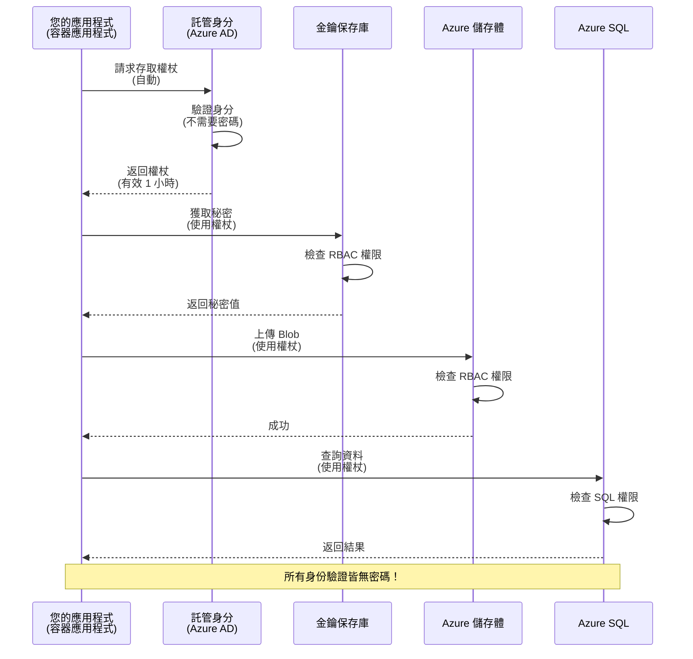
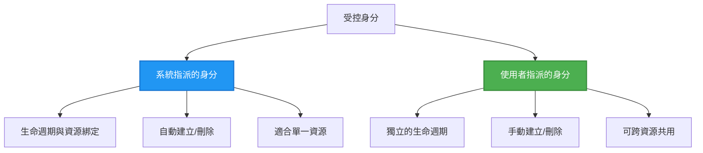

# 驗證模式與受控身分識別

⏱️ **預估時間**：45-60 分鐘 | 💰 **成本影響**：免費（無額外費用） | ⭐ **複雜度**：中級

**📚 學習路徑：**
- ← 上一課：[設定管理](configuration.md) - 管理環境變數與機密
- 🎯 **目前位置**：驗證與安全性（受控身分識別、Key Vault、安全模式）
- → 下一課：[第一個專案](first-project.md) - 建立您的第一個 AZD 應用程式
- 🏠 [課程首頁](../../README.md)

---

## 您將學到什麼

完成本課程後，您將能夠：
- 瞭解 Azure 驗證模式（密鑰、連接字串、受控身分識別）
- 實作 **受控身分識別** 以實現無密碼驗證
- 與 **Azure Key Vault** 整合以保護機密
- 為 AZD 部署設定 **基於角色的存取控制 (RBAC)**
- 在容器應用程式和 Azure 服務中應用安全性最佳實踐
- 從基於密鑰的驗證遷移到基於身分的驗證

## 為什麼受控身分識別很重要

### 問題：傳統驗證

**在受控身分識別之前：**
```javascript
// ❌ 安全風險：程式碼中硬編碼的秘密
const connectionString = "Server=mydb.database.windows.net;User=admin;Password=P@ssw0rd123";
const storageKey = "xK7mN9pQ2wR5tY8uI0oP3aS6dF1gH4jK...";
const cosmosKey = "C2x7B9n4M1p8Q5w3E6r0T2y5U8i1O4p7...";
```

**問題：**
- 🔴 **機密暴露** 在程式碼、設定檔、環境變數中
- 🔴 **憑證輪替** 需要修改程式碼並重新部署
- 🔴 **審計困難** - 誰在什麼時候存取了什麼？
- 🔴 **分散** - 機密分散在多個系統中
- 🔴 **合規風險** - 無法通過安全審核

### 解決方案：受控身分識別

**使用受控身分識別後：**
```javascript
// ✅ 安全：程式碼中沒有秘密
const credential = new DefaultAzureCredential();
const client = new BlobServiceClient(
  "https://mystorageaccount.blob.core.windows.net",
  credential  // Azure 自動處理身份驗證
);
```

**優勢：**
- ✅ **程式碼或設定中無機密**
- ✅ **自動輪替** - 由 Azure 處理
- ✅ **完整的審計記錄** 在 Azure AD 日誌中
- ✅ **集中化安全性** - 在 Azure 入口網站中管理
- ✅ **符合合規性** - 符合安全標準

**比喻**：傳統驗證就像攜帶多把實體鑰匙來開不同的門。受控身分識別則像是擁有一張安全識別卡，根據您的身分自動授予存取權限——無需擔心鑰匙遺失、複製或輪替。

---

## 架構概覽

### 使用受控身分識別的驗證流程


### 受控身分識別的類型


| 功能 | 系統指派 | 使用者指派 |
|------|----------|------------|
| **生命週期** | 與資源綁定 | 獨立 |
| **建立方式** | 隨資源自動建立 | 手動建立 |
| **刪除方式** | 資源刪除時一併刪除 | 資源刪除後仍存在 |
| **共享性** | 僅限一個資源 | 多個資源共享 |
| **使用案例** | 簡單場景 | 複雜的多資源場景 |
| **AZD 預設** | ✅ 推薦 | 可選 |

---

## 先決條件

### 必要工具

您應該已經從前面的課程中安裝了以下工具：

```bash
# 驗證 Azure Developer CLI
azd version
# ✅ 預期：azd 版本 1.0.0 或更高

# 驗證 Azure CLI
az --version
# ✅ 預期：azure-cli 2.50.0 或更高
```

### Azure 要求

- 有效的 Azure 訂閱
- 權限：
  - 建立受控身分識別
  - 指派 RBAC 角色
  - 建立 Key Vault 資源
  - 部署容器應用程式

### 知識先備條件

您應該已完成：
- [安裝指南](installation.md) - AZD 設定
- [AZD 基礎](azd-basics.md) - 核心概念
- [設定管理](configuration.md) - 環境變數

---

## 課程 1：瞭解驗證模式

### 模式 1：連接字串（舊版 - 避免使用）

**運作方式：**
```bash
# 連接字串包含憑證
STORAGE_CONNECTION_STRING="DefaultEndpointsProtocol=https;AccountName=myaccount;AccountKey=xK7mN9pQ2wR5..."
COSMOS_CONNECTION_STRING="AccountEndpoint=https://myaccount.documents.azure.com:443/;AccountKey=C2x7..."
SQL_CONNECTION_STRING="Server=myserver.database.windows.net;User=admin;Password=P@ssw0rd..."
```

**問題：**
- ❌ 機密暴露在環境變數中
- ❌ 部署系統中可能被記錄
- ❌ 難以輪替
- ❌ 無法追蹤存取記錄

**使用時機：** 僅限於本地開發，絕不適用於生產環境。

---

### 模式 2：Key Vault 參考（較佳）

**運作方式：**
```bicep
// Store secret in Key Vault
resource keyVault 'Microsoft.KeyVault/vaults@2023-02-01' = {
  name: 'mykv'
  properties: {
    enableRbacAuthorization: true
  }
}

// Reference in Container App
env: [
  {
    name: 'STORAGE_KEY'
    secretRef: 'storage-key'  // References Key Vault
  }
]
```

**優勢：**
- ✅ 機密安全存儲於 Key Vault
- ✅ 集中化的機密管理
- ✅ 無需修改程式碼即可輪替

**限制：**
- ⚠️ 仍然使用密鑰/密碼
- ⚠️ 需要管理 Key Vault 存取權限

**使用時機：** 從連接字串過渡到受控身分識別的中間步驟。

---

### 模式 3：受控身分識別（最佳實踐）

**運作方式：**
```bicep
// Enable managed identity
resource containerApp 'Microsoft.App/containerApps@2023-05-01' = {
  name: 'myapp'
  identity: {
    type: 'SystemAssigned'  // Automatically creates identity
  }
}

// Grant permissions
resource roleAssignment 'Microsoft.Authorization/roleAssignments@2022-04-01' = {
  scope: storageAccount
  properties: {
    roleDefinitionId: storageBlobDataContributorRole
    principalId: containerApp.identity.principalId
  }
}
```

**應用程式程式碼：**
```javascript
// 不需要秘密！
const { DefaultAzureCredential } = require('@azure/identity');
const { BlobServiceClient } = require('@azure/storage-blob');

const credential = new DefaultAzureCredential();
const blobServiceClient = new BlobServiceClient(
  'https://mystorageaccount.blob.core.windows.net',
  credential
);
```

**優勢：**
- ✅ 程式碼/設定中無機密
- ✅ 自動憑證輪替
- ✅ 完整的審計記錄
- ✅ 基於 RBAC 的權限
- ✅ 符合合規性

**使用時機：** 生產應用程式中應始終使用。

---

## 課程 2：使用 AZD 實作受控身分識別

### 分步實作

讓我們建立一個安全的容器應用程式，使用受控身分識別來存取 Azure 儲存體和 Key Vault。

### 專案結構

```
secure-app/
├── azure.yaml                 # AZD configuration
├── infra/
│   ├── main.bicep            # Main infrastructure
│   ├── core/
│   │   ├── identity.bicep    # Managed identity setup
│   │   ├── keyvault.bicep    # Key Vault configuration
│   │   └── storage.bicep     # Storage with RBAC
│   └── app/
│       └── container-app.bicep
└── src/
    ├── app.js                # Application code
    ├── package.json
    └── Dockerfile
```

### 1. 設定 AZD（azure.yaml）

```yaml
name: secure-app
metadata:
  template: secure-app@1.0.0

services:
  api:
    project: ./src
    language: js
    host: containerapp

# Enable managed identity (AZD handles this automatically)
```

### 2. 基礎架構：啟用受控身分識別

**檔案：`infra/main.bicep`**

```bicep
targetScope = 'subscription'

param environmentName string
param location string = 'eastus'

var tags = { 'azd-env-name': environmentName }

// Resource group
resource rg 'Microsoft.Resources/resourceGroups@2021-04-01' = {
  name: 'rg-${environmentName}'
  location: location
  tags: tags
}

// Storage Account
module storage './core/storage.bicep' = {
  name: 'storage'
  scope: rg
  params: {
    name: 'st${uniqueString(rg.id)}'
    location: location
    tags: tags
  }
}

// Key Vault
module keyVault './core/keyvault.bicep' = {
  name: 'keyvault'
  scope: rg
  params: {
    name: 'kv-${uniqueString(rg.id)}'
    location: location
    tags: tags
  }
}

// Container App with Managed Identity
module containerApp './app/container-app.bicep' = {
  name: 'container-app'
  scope: rg
  params: {
    name: 'ca-${environmentName}'
    location: location
    tags: tags
    storageAccountName: storage.outputs.name
    keyVaultName: keyVault.outputs.name
  }
}

// Grant Container App access to Storage
module storageRoleAssignment './core/role-assignment.bicep' = {
  name: 'storage-role'
  scope: rg
  params: {
    principalId: containerApp.outputs.identityPrincipalId
    roleDefinitionId: 'ba92f5b4-2d11-453d-a403-e96b0029c9fe'  // Storage Blob Data Contributor
    targetResourceId: storage.outputs.id
  }
}

// Grant Container App access to Key Vault
module kvRoleAssignment './core/role-assignment.bicep' = {
  name: 'kv-role'
  scope: rg
  params: {
    principalId: containerApp.outputs.identityPrincipalId
    roleDefinitionId: '4633458b-17de-408a-b874-0445c86b69e6'  // Key Vault Secrets User
    targetResourceId: keyVault.outputs.id
  }
}

// Outputs
output AZURE_STORAGE_ACCOUNT_NAME string = storage.outputs.name
output AZURE_KEY_VAULT_NAME string = keyVault.outputs.name
output APP_URL string = containerApp.outputs.url
```

### 3. 使用系統指派身分識別的容器應用程式

**檔案：`infra/app/container-app.bicep`**

```bicep
param name string
param location string
param tags object = {}
param storageAccountName string
param keyVaultName string

resource containerApp 'Microsoft.App/containerApps@2023-05-01' = {
  name: name
  location: location
  tags: tags
  identity: {
    type: 'SystemAssigned'  // 🔑 Enable managed identity
  }
  properties: {
    configuration: {
      ingress: {
        external: true
        targetPort: 3000
      }
    }
    template: {
      containers: [
        {
          name: 'api'
          image: 'myregistry.azurecr.io/api:latest'
          resources: {
            cpu: json('0.5')
            memory: '1Gi'
          }
          env: [
            {
              name: 'AZURE_STORAGE_ACCOUNT_NAME'
              value: storageAccountName
            }
            {
              name: 'AZURE_KEY_VAULT_NAME'
              value: keyVaultName
            }
            // 🔑 No secrets - managed identity handles authentication!
          ]
        }
      ]
    }
  }
}

// Output the identity for RBAC assignments
output identityPrincipalId string = containerApp.identity.principalId
output id string = containerApp.id
output url string = 'https://${containerApp.properties.configuration.ingress.fqdn}'
```

### 4. RBAC 角色指派模組

**檔案：`infra/core/role-assignment.bicep`**

```bicep
param principalId string
param roleDefinitionId string  // Azure built-in role ID
param targetResourceId string

resource roleAssignment 'Microsoft.Authorization/roleAssignments@2022-04-01' = {
  name: guid(principalId, roleDefinitionId, targetResourceId)
  scope: resourceId('Microsoft.Resources/resourceGroups', resourceGroup().name)
  properties: {
    roleDefinitionId: subscriptionResourceId('Microsoft.Authorization/roleDefinitions', roleDefinitionId)
    principalId: principalId
    principalType: 'ServicePrincipal'
  }
}

output id string = roleAssignment.id
```

### 5. 使用受控身分識別的應用程式程式碼

**檔案：`src/app.js`**

```javascript
const express = require('express');
const { DefaultAzureCredential } = require('@azure/identity');
const { BlobServiceClient } = require('@azure/storage-blob');
const { SecretClient } = require('@azure/keyvault-secrets');

const app = express();
const PORT = process.env.PORT || 3000;

// 🔑 初始化憑證（自動與受管理的身份一起運作）
const credential = new DefaultAzureCredential();

// Azure Storage 設定
const storageAccountName = process.env.AZURE_STORAGE_ACCOUNT_NAME;
const blobServiceClient = new BlobServiceClient(
  `https://${storageAccountName}.blob.core.windows.net`,
  credential  // 不需要金鑰！
);

// Key Vault 設定
const keyVaultName = process.env.AZURE_KEY_VAULT_NAME;
const secretClient = new SecretClient(
  `https://${keyVaultName}.vault.azure.net`,
  credential  // 不需要金鑰！
);

// 健康檢查
app.get('/health', (req, res) => {
  res.json({ status: 'healthy', authentication: 'managed-identity' });
});

// 上傳檔案到 Blob Storage
app.post('/upload', async (req, res) => {
  try {
    const containerClient = blobServiceClient.getContainerClient('uploads');
    await containerClient.createIfNotExists();
    
    const blobName = `file-${Date.now()}.txt`;
    const blockBlobClient = containerClient.getBlockBlobClient(blobName);
    
    await blockBlobClient.upload('Hello from managed identity!', 30);
    
    res.json({
      success: true,
      blobName: blobName,
      message: 'File uploaded using managed identity!'
    });
  } catch (error) {
    console.error('Upload error:', error);
    res.status(500).json({ error: error.message });
  }
});

// 從 Key Vault 獲取秘密
app.get('/secret/:name', async (req, res) => {
  try {
    const secretName = req.params.name;
    const secret = await secretClient.getSecret(secretName);
    
    res.json({
      name: secretName,
      value: secret.value,
      message: 'Secret retrieved using managed identity!'
    });
  } catch (error) {
    console.error('Secret error:', error);
    res.status(500).json({ error: error.message });
  }
});

// 列出 Blob 容器（展示讀取權限）
app.get('/containers', async (req, res) => {
  try {
    const containers = [];
    for await (const container of blobServiceClient.listContainers()) {
      containers.push(container.name);
    }
    
    res.json({
      containers: containers,
      count: containers.length,
      message: 'Containers listed using managed identity!'
    });
  } catch (error) {
    console.error('List error:', error);
    res.status(500).json({ error: error.message });
  }
});

app.listen(PORT, () => {
  console.log(`Secure API listening on port ${PORT}`);
  console.log('Authentication: Managed Identity (passwordless)');
});
```

**檔案：`src/package.json`**

```json
{
  "name": "secure-app",
  "version": "1.0.0",
  "dependencies": {
    "express": "^4.18.2",
    "@azure/identity": "^4.0.0",
    "@azure/storage-blob": "^12.17.0",
    "@azure/keyvault-secrets": "^4.7.0"
  },
  "scripts": {
    "start": "node app.js"
  }
}
```

### 6. 部署與測試

```bash
# 初始化 AZD 環境
azd init

# 部署基礎設施和應用程式
azd up

# 獲取應用程式 URL
APP_URL=$(azd env get-values | grep APP_URL | cut -d '=' -f2 | tr -d '"')

# 測試健康檢查
curl $APP_URL/health
```

**✅ 預期輸出：**
```json
{
  "status": "healthy",
  "authentication": "managed-identity"
}
```

**測試 Blob 上傳：**
```bash
curl -X POST $APP_URL/upload
```

**✅ 預期輸出：**
```json
{
  "success": true,
  "blobName": "file-1700404800000.txt",
  "message": "File uploaded using managed identity!"
}
```

**測試容器列出：**
```bash
curl $APP_URL/containers
```

**✅ 預期輸出：**
```json
{
  "containers": ["uploads"],
  "count": 1,
  "message": "Containers listed using managed identity!"
}
```

---

## 常見的 Azure RBAC 角色

### 受控身分識別的內建角色 ID

| 服務 | 角色名稱 | 角色 ID | 權限 |
|------|----------|---------|------|
| **儲存體** | 儲存體 Blob 資料讀取者 | `2a2b9908-6b94-4a3d-8e5a-a7d8f8cc8a12` | 讀取 Blob 和容器 |
| **儲存體** | 儲存體 Blob 資料貢獻者 | `ba92f5b4-2d11-453d-a403-e96b0029c9fe` | 讀取、寫入、刪除 Blob |
| **儲存體** | 儲存體佇列資料貢獻者 | `974c5e8b-45b9-4653-ba55-5f855dd0fb88` | 讀取、寫入、刪除佇列訊息 |
| **Key Vault** | Key Vault 機密使用者 | `4633458b-17de-408a-b874-0445c86b69e6` | 讀取機密 |
| **Key Vault** | Key Vault 機密管理員 | `b86a8fe4-44ce-4948-aee5-eccb2c155cd7` | 讀取、寫入、刪除機密 |
| **Cosmos DB** | Cosmos DB 內建資料讀取者 | `00000000-0000-0000-0000-000000000001` | 讀取 Cosmos DB 資料 |
| **Cosmos DB** | Cosmos DB 內建資料貢獻者 | `00000000-0000-0000-0000-000000000002` | 讀取、寫入 Cosmos DB 資料 |
| **SQL 資料庫** | SQL DB 貢獻者 | `9b7fa17d-e63e-47b0-bb0a-15c516ac86ec` | 管理 SQL 資料庫 |
| **Service Bus** | Azure Service Bus 資料擁有者 | `090c5cfd-751d-490a-894a-3ce6f1109419` | 傳送、接收、管理訊息 |

### 如何查找角色 ID

```bash
# 列出所有內建角色
az role definition list --query "[].{Name:roleName, ID:name}" --output table

# 搜尋特定角色
az role definition list --query "[?contains(roleName, 'Storage Blob')].{Name:roleName, ID:name}" --output table

# 獲取角色詳細資訊
az role definition list --name "Storage Blob Data Contributor"
```

---

## 實作練習

### 練習 1：為現有應用程式啟用受控身分識別 ⭐⭐（中等）

**目標**：為現有的容器應用程式部署新增受控身分識別

**情境**：您有一個使用連接字串的容器應用程式。將其轉換為受控身分識別。

**起始點**：具有以下配置的容器應用程式：

```bicep
// ❌ Current: Using connection string
env: [
  {
    name: 'STORAGE_CONNECTION_STRING'
    secretRef: 'storage-connection'
  }
]
```

**步驟**：

1. **在 Bicep 中啟用受控身分識別：**

```bicep
resource containerApp 'Microsoft.App/containerApps@2023-05-01' = {
  name: 'myapp'
  identity: {
    type: 'SystemAssigned'  // Add this
  }
  // ... rest of configuration
}
```

2. **授予儲存體存取權限：**

```bicep
// Get storage account reference
resource storageAccount 'Microsoft.Storage/storageAccounts@2023-01-01' existing = {
  name: storageAccountName
}

// Assign role
resource roleAssignment 'Microsoft.Authorization/roleAssignments@2022-04-01' = {
  name: guid(containerApp.id, 'ba92f5b4-2d11-453d-a403-e96b0029c9fe', storageAccount.id)
  scope: storageAccount
  properties: {
    roleDefinitionId: subscriptionResourceId('Microsoft.Authorization/roleDefinitions', 'ba92f5b4-2d11-453d-a403-e96b0029c9fe')
    principalId: containerApp.identity.principalId
    principalType: 'ServicePrincipal'
  }
}
```

3. **更新應用程式程式碼：**

**之前（連接字串）：**
```javascript
const { BlobServiceClient } = require('@azure/storage-blob');

const blobServiceClient = BlobServiceClient.fromConnectionString(
  process.env.STORAGE_CONNECTION_STRING
);
```

**之後（受控身分識別）：**
```javascript
const { DefaultAzureCredential } = require('@azure/identity');
const { BlobServiceClient } = require('@azure/storage-blob');

const credential = new DefaultAzureCredential();
const blobServiceClient = new BlobServiceClient(
  `https://${process.env.STORAGE_ACCOUNT_NAME}.blob.core.windows.net`,
  credential
);
```

4. **更新環境變數：**

```bicep
env: [
  {
    name: 'STORAGE_ACCOUNT_NAME'
    value: storageAccountName  // Just the name, no secrets!
  }
  // Remove STORAGE_CONNECTION_STRING
]
```

5. **部署與測試：**

```bash
# 重新部署
azd up

# 測試它是否仍然有效
curl https://myapp.azurecontainerapps.io/upload
```

**✅ 成功標準：**
- ✅ 應用程式部署無錯誤
- ✅ 儲存體操作正常（上傳、列出、下載）
- ✅ 環境變數中無連接字串
- ✅ 身分識別可在 Azure 入口網站的「身分識別」頁面中看到

**驗證：**

```bash
# 檢查是否啟用了受管理的身分識別
az containerapp show \
  --name myapp \
  --resource-group rg-myapp \
  --query "identity.type"
# ✅ 預期結果: "SystemAssigned"

# 檢查角色指派
az role assignment list \
  --assignee $(az containerapp show --name myapp --resource-group rg-myapp --query "identity.principalId" -o tsv) \
  --scope /subscriptions/{sub-id}/resourceGroups/rg-myapp/providers/Microsoft.Storage/storageAccounts/mystorageaccount
# ✅ 預期結果: 顯示 "Storage Blob Data Contributor" 角色
```

**時間**：20-30 分鐘

---

### 練習 2：使用者指派身分識別的多服務存取 ⭐⭐⭐（進階）

**目標**：建立一個可供多個容器應用程式共享的使用者指派身分識別

**情境**：您有 3 個微服務，都需要存取相同的儲存體帳戶和 Key Vault。

**步驟**：

1. **建立使用者指派身分識別：**

**檔案：`infra/core/identity.bicep`**

```bicep
param name string
param location string
param tags object = {}

resource userAssignedIdentity 'Microsoft.ManagedIdentity/userAssignedIdentities@2023-01-31' = {
  name: name
  location: location
  tags: tags
}

output id string = userAssignedIdentity.id
output principalId string = userAssignedIdentity.properties.principalId
output clientId string = userAssignedIdentity.properties.clientId
```

2. **為使用者指派身分識別指派角色：**

```bicep
// In main.bicep
module userIdentity './core/identity.bicep' = {
  name: 'user-identity'
  scope: rg
  params: {
    name: 'id-${environmentName}'
    location: location
    tags: tags
  }
}

// Grant Storage access
resource storageRoleAssignment 'Microsoft.Authorization/roleAssignments@2022-04-01' = {
  name: guid(userIdentity.outputs.principalId, 'storage-contributor')
  scope: storageAccount
  properties: {
    roleDefinitionId: subscriptionResourceId('Microsoft.Authorization/roleDefinitions', 'ba92f5b4-2d11-453d-a403-e96b0029c9fe')
    principalId: userIdentity.outputs.principalId
    principalType: 'ServicePrincipal'
  }
}

// Grant Key Vault access
resource kvRoleAssignment 'Microsoft.Authorization/roleAssignments@2022-04-01' = {
  name: guid(userIdentity.outputs.principalId, 'kv-secrets-user')
  scope: keyVault
  properties: {
    roleDefinitionId: subscriptionResourceId('Microsoft.Authorization/roleDefinitions', '4633458b-17de-408a-b874-0445c86b69e6')
    principalId: userIdentity.outputs.principalId
    principalType: 'ServicePrincipal'
  }
}
```

3. **將身分識別指派給多個容器應用程式：**

```bicep
resource apiGateway 'Microsoft.App/containerApps@2023-05-01' = {
  name: 'api-gateway'
  identity: {
    type: 'UserAssigned'
    userAssignedIdentities: {
      '${userIdentity.outputs.id}': {}
    }
  }
  // ... rest of config
}

resource productService 'Microsoft.App/containerApps@2023-05-01' = {
  name: 'product-service'
  identity: {
    type: 'UserAssigned'
    userAssignedIdentities: {
      '${userIdentity.outputs.id}': {}
    }
  }
  // ... rest of config
}

resource orderService 'Microsoft.App/containerApps@2023-05-01' = {
  name: 'order-service'
  identity: {
    type: 'UserAssigned'
    userAssignedIdentities: {
      '${userIdentity.outputs.id}': {}
    }
  }
  // ... rest of config
}
```

4. **應用程式程式碼（所有服務使用相同模式）：**

```javascript
const { DefaultAzureCredential, ManagedIdentityCredential } = require('@azure/identity');

// 對於使用者分配的身分識別，指定客戶端 ID
const credential = new ManagedIdentityCredential(
  process.env.AZURE_CLIENT_ID  // 使用者分配的身分識別客戶端 ID
);

// 或使用 DefaultAzureCredential（自動檢測）
const credential = new DefaultAzureCredential();

const blobServiceClient = new BlobServiceClient(
  `https://${process.env.STORAGE_ACCOUNT_NAME}.blob.core.windows.net`,
  credential
);
```

5. **部署與驗證：**

```bash
azd up

# 測試所有服務是否能存取儲存空間
curl https://api-gateway.azurecontainerapps.io/upload
curl https://product-service.azurecontainerapps.io/upload
curl https://order-service.azurecontainerapps.io/upload
```

**✅ 成功標準：**
- ✅ 一個身分識別被 3 個服務共享
- ✅ 所有服務都能存取儲存體和 Key Vault
- ✅ 如果刪除一個服務，身分識別仍然存在
- ✅ 集中化的權限管理

**使用者指派身分識別的優勢：**
- 單一身分識別管理
- 各服務權限一致
- 即使刪除服務，身分識別仍然存在
- 適用於複雜架構

**時間**：30-40 分鐘

---

### 練習 3：實作 Key Vault 機密輪替 ⭐⭐⭐（進階）

**目標**：將第三方 API 密鑰存儲於 Key Vault，並使用受控身分識別存取

**情境**：您的應用程式需要調用需要 API 密鑰的外部 API（如 OpenAI、Stripe、SendGrid）。

**步驟**：

1. **建立具有 RBAC 的 Key Vault：**

**檔案：`infra/core/keyvault.bicep`**

```bicep
param name string
param location string
param tags object = {}

resource keyVault 'Microsoft.KeyVault/vaults@2023-02-01' = {
  name: name
  location: location
  tags: tags
  properties: {
    enableRbacAuthorization: true  // Use RBAC instead of access policies
    sku: {
      family: 'A'
      name: 'standard'
    }
    tenantId: subscription().tenantId
    enableSoftDelete: true
    softDeleteRetentionInDays: 90
  }
}

// Allow Container App to read secrets
output id string = keyVault.id
output name string = keyVault.name
output uri string = keyVault.properties.vaultUri
```

2. **將機密存儲於 Key Vault：**

```bash
# 獲取金鑰保管庫名稱
KV_NAME=$(azd env get-values | grep AZURE_KEY_VAULT_NAME | cut -d '=' -f2 | tr -d '"')

# 儲存第三方 API 金鑰
az keyvault secret set \
  --vault-name $KV_NAME \
  --name "OpenAI-ApiKey" \
  --value "sk-proj-xxxxxxxxxxxxx"

az keyvault secret set \
  --vault-name $KV_NAME \
  --name "Stripe-ApiKey" \
  --value "sk_live_xxxxxxxxxxxxx"

az keyvault secret set \
  --vault-name $KV_NAME \
  --name "SendGrid-ApiKey" \
  --value "SG.xxxxxxxxxxxxx"
```

3. **應用程式程式碼以檢索機密：**

**檔案：`src/config.js`**

```javascript
const { DefaultAzureCredential } = require('@azure/identity');
const { SecretClient } = require('@azure/keyvault-secrets');

class Config {
  constructor() {
    this.credential = new DefaultAzureCredential();
    this.secretClient = new SecretClient(
      `https://${process.env.AZURE_KEY_VAULT_NAME}.vault.azure.net`,
      this.credential
    );
    this.cache = {};
  }

  async getSecret(secretName) {
    // 先檢查快取
    if (this.cache[secretName]) {
      return this.cache[secretName];
    }

    try {
      const secret = await this.secretClient.getSecret(secretName);
      this.cache[secretName] = secret.value;
      console.log(`✅ Retrieved secret: ${secretName}`);
      return secret.value;
    } catch (error) {
      console.error(`❌ Failed to get secret ${secretName}:`, error.message);
      throw error;
    }
  }

  async getOpenAIKey() {
    return this.getSecret('OpenAI-ApiKey');
  }

  async getStripeKey() {
    return this.getSecret('Stripe-ApiKey');
  }

  async getSendGridKey() {
    return this.getSecret('SendGrid-ApiKey');
  }
}

module.exports = new Config();
```

4. **在應用程式中使用機密：**

**檔案：`src/app.js`**

```javascript
const express = require('express');
const config = require('./config');
const { OpenAI } = require('openai');

const app = express();

// 使用來自金鑰庫的金鑰初始化 OpenAI
let openaiClient;

async function initializeServices() {
  const openaiKey = await config.getOpenAIKey();
  openaiClient = new OpenAI({ apiKey: openaiKey });
  console.log('✅ Services initialized with secrets from Key Vault');
}

// 啟動時呼叫
initializeServices().catch(console.error);

app.post('/chat', async (req, res) => {
  try {
    const completion = await openaiClient.chat.completions.create({
      model: 'gpt-4',
      messages: [{ role: 'user', content: 'Hello!' }]
    });
    
    res.json({
      response: completion.choices[0].message.content,
      authentication: 'Key from Key Vault via Managed Identity'
    });
  } catch (error) {
    res.status(500).json({ error: error.message });
  }
});

app.listen(3000, () => {
  console.log('Secure API with Key Vault integration running');
});
```

5. **部署與測試：**

```bash
azd up

# 測試 API 金鑰是否正常運作
curl -X POST https://myapp.azurecontainerapps.io/chat \
  -H "Content-Type: application/json" \
  -d '{"message":"Hello AI"}'
```

**✅ 成功標準：**
- ✅ 程式碼或環境變數中無 API 密鑰
- ✅ 應用程式從 Key Vault 檢索密鑰
- ✅ 第三方 API 正常運作
- ✅ 可在不修改程式碼的情況下輪替密鑰

**輪替機密：**

```bash
# 更新密鑰保管庫中的秘密
az keyvault secret set \
  --vault-name $KV_NAME \
  --name "OpenAI-ApiKey" \
  --value "sk-proj-NEW_KEY_HERE"

# 重啟應用程式以載入新密鑰
az containerapp revision restart \
  --name myapp \
  --resource-group rg-myapp
```

**時間**：25-35 分鐘

---

## 知識檢查

### 1. 驗證模式 ✓

測試您的理解：

- [ ] **Q1**：三種主要的驗證模式是什麼？ 
  - **A**：連接字串（舊版）、Key Vault 參考（過渡）、受控身分識別（最佳）

- [ ] **Q2**：為什麼受控身分識別比連接字串更好？
  - **A**：程式碼中無機密、自動輪替、完整審計記錄、RBAC 權限

- [ ] **Q3**：什麼時候應使用使用者指派身分識別而非系統指派？
  - **A**：當需要在多個資源間共享身分識別或身分識別生命週期獨立於資源時

**實作驗證：**
```bash
# 檢查您的應用程式使用哪種類型的身份
az containerapp show \
  --name myapp \
  --resource-group rg-myapp \
  --query "identity.type"

# 列出該身份的所有角色指派
az role assignment list \
  --assignee $(az containerapp show --name myapp --resource-group rg-myapp --query "identity.principalId" -o tsv)
```

---

### 2. RBAC 與權限 ✓

測試您的理解：

- [ ] **Q1**："儲存體 Blob 資料貢獻者" 的角色 ID 是什麼？
  - **A**：`ba92f5b4-2d11-453d-a403-e96b0029c9fe`

- [ ] **Q2**："Key Vault 機密使用者" 提供什麼權限？
  - **A**：僅讀取機密（無法建立、更新或刪除）

- [ ] **Q3**：如何授予容器應用程式存取 Azure SQL 的權限？
  - **A**：指派 "SQL DB 貢獻者" 角色或為 SQL 配置 Azure AD 驗證

**實作驗證：**
```bash
# 尋找特定角色
az role definition list --name "Storage Blob Data Contributor"

# 檢查分配給您身份的角色
PRINCIPAL_ID=$(az containerapp show --name myapp --resource-group rg-myapp --query "identity.principalId" -o tsv)
az role assignment list --assignee $PRINCIPAL_ID --output table
```

---

### 3. Key Vault 整合 ✓

測試您的理解：
- [ ] **Q1**: 如何啟用 Key Vault 的 RBAC，而非使用存取政策？
  - **A**: 在 Bicep 中設定 `enableRbacAuthorization: true`

- [ ] **Q2**: 哪個 Azure SDK 庫負責管理身份驗證？
  - **A**: 使用 `@azure/identity` 和 `DefaultAzureCredential` 類別

- [ ] **Q3**: Key Vault 的秘密在快取中保存多久？
  - **A**: 取決於應用程式；需自行實作快取策略

**實作驗證：**
```bash
# 測試金鑰保管庫存取
az keyvault secret show \
  --vault-name $KV_NAME \
  --name "OpenAI-ApiKey" \
  --query "value"

# 檢查是否啟用 RBAC
az keyvault show \
  --name $KV_NAME \
  --query "properties.enableRbacAuthorization"
# ✅ 預期結果：true
```

---

## 安全性最佳實踐

### ✅ 建議：

1. **在生產環境中始終使用管理身份**
   ```bicep
   identity: {
     type: 'SystemAssigned'
   }
   ```

2. **使用最低權限的 RBAC 角色**
   - 儘量使用 "Reader" 角色
   - 除非必要，避免使用 "Owner" 或 "Contributor"

3. **將第三方密鑰存放在 Key Vault 中**
   ```javascript
   const apiKey = await secretClient.getSecret('ThirdPartyApiKey');
   ```

4. **啟用審核日誌**
   ```bicep
   diagnosticSettings: {
     logs: [{ category: 'AuditEvent', enabled: true }]
   }
   ```

5. **為開發/測試/生產環境使用不同的身份**
   ```bash
   azd env new dev
   azd env new staging
   azd env new prod
   ```

6. **定期輪替秘密**
   - 為 Key Vault 的秘密設定到期日期
   - 使用 Azure Functions 自動化輪替

### ❌ 禁止：

1. **絕對不要硬編碼秘密**
   ```javascript
   // ❌ 不好
   const apiKey = "sk-proj-xxxxxxxxxxxxx";
   ```

2. **不要在生產環境中使用連接字串**
   ```javascript
   // ❌ 不好
   BlobServiceClient.fromConnectionString(process.env.STORAGE_CONNECTION_STRING)
   ```

3. **不要授予過多的權限**
   ```bicep
   // ❌ BAD - too much access
   roleDefinitionId: 'Owner'
   
   // ✅ GOOD - least privilege
   roleDefinitionId: 'Storage Blob Data Reader'
   ```

4. **不要記錄秘密**
   ```javascript
   // ❌ 不好
   console.log('API Key:', apiKey);
   
   // ✅ 好
   console.log('API Key retrieved successfully');
   ```

5. **不要在不同環境間共用生產身份**
   ```bicep
   // ❌ BAD - same identity for dev and prod
   // ✅ GOOD - separate identities per environment
   ```

---

## 疑難排解指南

### 問題：存取 Azure Storage 時顯示 "Unauthorized"

**症狀：**
```
Error: Unauthorized (403)
AuthorizationPermissionMismatch: This request is not authorized to perform this operation
```

**診斷：**

```bash
# 檢查是否啟用了受管理的身分識別
az containerapp show \
  --name myapp \
  --resource-group rg-myapp \
  --query "identity.type"
# ✅ 預期: "SystemAssigned" 或 "UserAssigned"

# 檢查角色指派
PRINCIPAL_ID=$(az containerapp show --name myapp --resource-group rg-myapp --query "identity.principalId" -o tsv)
az role assignment list --assignee $PRINCIPAL_ID

# 預期: 應看到 "Storage Blob Data Contributor" 或類似角色
```

**解決方案：**

1. **授予正確的 RBAC 角色：**
```bash
STORAGE_ID=$(az storage account show --name mystorageaccount --resource-group rg-myapp --query "id" -o tsv)
az role assignment create \
  --assignee $PRINCIPAL_ID \
  --role "Storage Blob Data Contributor" \
  --scope $STORAGE_ID
```

2. **等待權限傳播（可能需要 5-10 分鐘）：**
```bash
# 檢查角色分配狀態
az role assignment list --assignee $PRINCIPAL_ID --scope $STORAGE_ID
```

3. **確認應用程式代碼使用正確的憑證：**
```javascript
// 確保您正在使用 DefaultAzureCredential
const credential = new DefaultAzureCredential();
```

---

### 問題：Key Vault 存取被拒

**症狀：**
```
Error: Forbidden (403)
The user, group or application does not have secrets get permission
```

**診斷：**

```bash
# 檢查是否啟用了 Key Vault RBAC
az keyvault show \
  --name $KV_NAME \
  --query "properties.enableRbacAuthorization"
# ✅ 預期值：true

# 檢查角色指派
az role assignment list \
  --assignee $PRINCIPAL_ID \
  --scope /subscriptions/{sub-id}/resourceGroups/rg-myapp/providers/Microsoft.KeyVault/vaults/$KV_NAME
```

**解決方案：**

1. **啟用 Key Vault 的 RBAC：**
```bash
az keyvault update \
  --name $KV_NAME \
  --enable-rbac-authorization true
```

2. **授予 Key Vault Secrets User 角色：**
```bash
KV_ID=$(az keyvault show --name $KV_NAME --query "id" -o tsv)
az role assignment create \
  --assignee $PRINCIPAL_ID \
  --role "Key Vault Secrets User" \
  --scope $KV_ID
```

---

### 問題：DefaultAzureCredential 在本地失敗

**症狀：**
```
Error: DefaultAzureCredential failed to retrieve a token
CredentialUnavailableError: No credential available
```

**診斷：**

```bash
# 檢查是否已登入
az account show

# 檢查 Azure CLI 驗證
az ad signed-in-user show
```

**解決方案：**

1. **登入 Azure CLI：**
```bash
az login
```

2. **設定 Azure 訂閱：**
```bash
az account set --subscription "Your Subscription Name"
```

3. **對於本地開發，使用環境變數：**
```bash
export AZURE_TENANT_ID="your-tenant-id"
export AZURE_CLIENT_ID="your-client-id"
export AZURE_CLIENT_SECRET="your-client-secret"
```

4. **或在本地使用不同的憑證：**
```javascript
const { DefaultAzureCredential, AzureCliCredential } = require('@azure/identity');

// 使用 AzureCliCredential 進行本地開發
const credential = process.env.NODE_ENV === 'production' 
  ? new DefaultAzureCredential()
  : new AzureCliCredential();
```

---

### 問題：角色指派傳播時間過長

**症狀：**
- 角色指派成功
- 仍然出現 403 錯誤
- 存取間歇性（有時有效，有時無效）

**解釋：**
Azure RBAC 的變更可能需要 5-10 分鐘才能在全球範圍內傳播。

**解決方案：**

```bash
# 等待並重試
echo "Waiting for RBAC propagation..."
sleep 300  # 等待5分鐘

# 測試存取
curl https://myapp.azurecontainerapps.io/upload

# 如果仍然失敗，重新啟動應用程式
az containerapp revision restart \
  --name myapp \
  --resource-group rg-myapp
```

---

## 成本考量

### 管理身份成本

| 資源 | 成本 |
|------|------|
| **管理身份** | 🆓 **免費** - 無需付費 |
| **RBAC 角色指派** | 🆓 **免費** - 無需付費 |
| **Azure AD Token 請求** | 🆓 **免費** - 包含在內 |
| **Key Vault 操作** | 每 10,000 次操作 $0.03 |
| **Key Vault 存儲** | 每月每個秘密 $0.024 |

**管理身份節省成本的方式：**
- ✅ 消除服務間身份驗證的 Key Vault 操作
- ✅ 減少安全事件（無洩漏憑證）
- ✅ 降低運營負擔（無需手動輪替）

**成本比較範例（每月）：**

| 情境 | 連接字串 | 管理身份 | 節省 |
|------|----------|----------|------|
| 小型應用（1M 請求） | ~$50 (Key Vault + 操作) | ~$0 | $50/月 |
| 中型應用（10M 請求） | ~$200 | ~$0 | $200/月 |
| 大型應用（100M 請求） | ~$1,500 | ~$0 | $1,500/月 |

---

## 了解更多

### 官方文件
- [Azure 管理身份](https://learn.microsoft.com/entra/identity/managed-identities-azure-resources/overview)
- [Azure RBAC](https://learn.microsoft.com/azure/role-based-access-control/overview)
- [Azure Key Vault](https://learn.microsoft.com/azure/key-vault/general/overview)
- [DefaultAzureCredential](https://learn.microsoft.com/dotnet/api/azure.identity.defaultazurecredential)

### SDK 文件
- [@azure/identity (Node.js)](https://www.npmjs.com/package/@azure/identity)
- [Azure.Identity (C#)](https://www.nuget.org/packages/Azure.Identity/)
- [azure-identity (Python)](https://pypi.org/project/azure-identity/)

### 本課程的下一步
- ← 上一章：[配置管理](configuration.md)
- → 下一章：[第一個專案](first-project.md)
- 🏠 [課程首頁](../../README.md)

### 相關範例
- [Azure OpenAI 聊天範例](../../../../examples/azure-openai-chat) - 使用管理身份進行 Azure OpenAI
- [微服務範例](../../../../examples/microservices) - 多服務身份驗證模式

---

## 總結

**你已學到：**
- ✅ 三種身份驗證模式（連接字串、Key Vault、管理身份）
- ✅ 如何在 AZD 中啟用和配置管理身份
- ✅ Azure 服務的 RBAC 角色指派
- ✅ Key Vault 與第三方秘密的整合
- ✅ 使用者指派與系統指派身份的差異
- ✅ 安全性最佳實踐與疑難排解

**重點回顧：**
1. **在生產環境中始終使用管理身份** - 無秘密，自動輪替
2. **使用最低權限的 RBAC 角色** - 僅授予必要的權限
3. **將第三方密鑰存放在 Key Vault 中** - 集中化的秘密管理
4. **為每個環境分配不同的身份** - 開發、測試、生產環境隔離
5. **啟用審核日誌** - 追蹤誰存取了什麼

**下一步：**
1. 完成上述的實作練習
2. 將現有應用程式從連接字串遷移到管理身份
3. 從第一天開始，使用安全性建置你的第一個 AZD 專案：[第一個專案](first-project.md)

---

<!-- CO-OP TRANSLATOR DISCLAIMER START -->
**免責聲明**：  
本文件已使用 AI 翻譯服務 [Co-op Translator](https://github.com/Azure/co-op-translator) 進行翻譯。雖然我們致力於提供準確的翻譯，但請注意，機器翻譯可能包含錯誤或不準確之處。原始文件的母語版本應被視為權威來源。對於關鍵資訊，建議使用專業人工翻譯。我們對因使用此翻譯而引起的任何誤解或誤釋不承擔責任。
<!-- CO-OP TRANSLATOR DISCLAIMER END -->