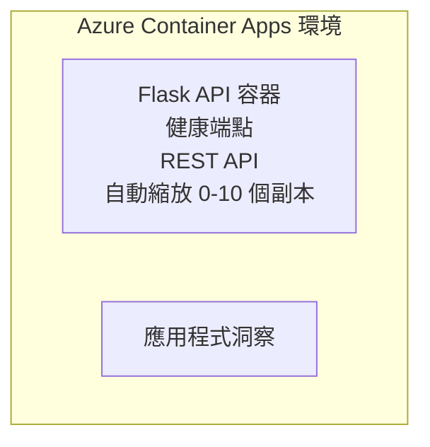

# Simple Flask API - Container App Example

**Learning Path:** Beginner ⭐ | **Time:** 25-35 minutes | **Cost:** $0-15/month

一個完整可運作的 Python Flask REST API，使用 Azure Developer CLI (azd) 部署到 Azure Container Apps。本範例展示容器部署、自動縮放與監控的基本概念。

## 🎯 What You'll Learn

- 將容器化的 Python 應用部署到 Azure
- 設定包含 scale-to-zero 的自動縮放
- 實作健康檢查與 readiness 檢測
- 監控應用程式日誌與指標
- 使用 Azure Developer CLI 進行快速部署

## 📦 What's Included

✅ **Flask Application** - 完整的 REST API 與 CRUD 操作 (`src/app.py`)  
✅ **Dockerfile** - 生產環境準備的容器設定  
✅ **Bicep Infrastructure** - Container Apps 環境與 API 部署  
✅ **AZD Configuration** - 一指令部署設定  
✅ **Health Probes** - 已設定的存活與就緒檢查  
✅ **Auto-scaling** - 根據 HTTP 流量 0-10 個副本  

## Architecture


## Prerequisites

### Required
- **Azure Developer CLI (azd)** - [安裝指南](https://learn.microsoft.com/azure/developer/azure-developer-cli/install-azd)
- **Azure subscription** - [免費帳戶](https://azure.microsoft.com/free/)
- **Docker Desktop** - [Install Docker](https://www.docker.com/products/docker-desktop/) (用於本機測試)

### Verify Prerequisites

```bash
# 檢查 azd 版本（需要 1.5.0 或更高）
azd version

# 驗證 Azure 登入
azd auth login

# 檢查 Docker（可選，用於本機測試）
docker --version
```

## ⏱️ Deployment Timeline

| Phase | Duration | What Happens |
|-------|----------|--------------||
| Environment setup | 30 seconds | 建立 azd 環境 |
| Build container | 2-3 minutes | 使用 Docker 建置 Flask 應用 |
| Provision infrastructure | 3-5 minutes | 建立 Container Apps、registry、監控 |
| Deploy application | 2-3 minutes | 推送映像並部署到 Container Apps |
| **Total** | **8-12 minutes** | 完成部署並可使用 |

## Quick Start

```bash
# 前往範例
cd examples/container-app/simple-flask-api

# 初始化環境（選擇唯一名稱）
azd env new myflaskapi

# 部署所有項目（基礎設施 + 應用程式）
azd up
# 系統會提示您：
# 1. 選擇 Azure 訂閱
# 2. 選擇地區（例如：eastus2）
# 3. 等候 8-12 分鐘以完成部署

# 取得您的 API 端點
azd env get-values

# 測試 API
curl $(azd env get-value API_ENDPOINT)/health
```

**Expected Output:**
```json
{
  "status": "healthy",
  "timestamp": "2025-11-19T10:30:00Z",
  "service": "simple-flask-api",
  "version": "1.0.0"
}
```

## ✅ Verify Deployment

### Step 1: Check Deployment Status

```bash
# 檢視已部署的服務
azd show

# 預期輸出顯示：
# - 服務：api
# - 端點：https://ca-api-[env].xxx.azurecontainerapps.io
# - 狀態：運行中
```

### Step 2: Test API Endpoints

```bash
# 取得 API 端點
API_URL=$(azd env get-value API_ENDPOINT)

# 測試健康狀態
curl $API_URL/health

# 測試根端點
curl $API_URL/

# 建立一個項目
curl -X POST $API_URL/api/items \
  -H "Content-Type: application/json" \
  -d '{"name": "Test Item", "description": "My first item"}'

# 取得所有項目
curl $API_URL/api/items
```

**Success Criteria:**
- ✅ 健康端點回傳 HTTP 200
- ✅ 根目錄端點顯示 API 資訊
- ✅ POST 建立項目並回傳 HTTP 201
- ✅ GET 回傳已建立的項目

### Step 3: View Logs

```bash
# 使用 azd monitor 串流即時日誌
azd monitor --logs

# 或使用 Azure CLI：
az containerapp logs show --name api --resource-group $RG_NAME --follow

# 您應該會看到：
# - Gunicorn 啟動訊息
# - HTTP 請求日誌
# - 應用程式資訊日誌
```

## Project Structure

```
simple-flask-api/
├── azure.yaml              # AZD configuration
├── infra/
│   ├── main.bicep         # Main infrastructure
│   ├── main.parameters.json
│   └── app/
│       ├── container-env.bicep
│       └── api.bicep
└── src/
    ├── app.py             # Flask application
    ├── requirements.txt
    └── Dockerfile
```

## API Endpoints

| Endpoint | Method | Description |
|----------|--------|-------------|
| `/health` | GET | 健康檢查 |
| `/api/items` | GET | 列出所有項目 |
| `/api/items` | POST | 建立新項目 |
| `/api/items/{id}` | GET | 取得特定項目 |
| `/api/items/{id}` | PUT | 更新項目 |
| `/api/items/{id}` | DELETE | 刪除項目 |

## Configuration

### Environment Variables

```bash
# 設定自訂組態
azd env set PORT 8000
azd env set LOG_LEVEL info
azd env set MAX_REPLICAS 20
```

### Scaling Configuration

API 會根據 HTTP 流量自動縮放：
- **Min Replicas**: 0（閒置時縮到零）
- **Max Replicas**: 10
- **Concurrent Requests per Replica**: 50

## Development

### Run Locally

```bash
# 安裝相依套件
cd src
pip install -r requirements.txt

# 執行應用程式
python app.py

# 在本機測試
curl http://localhost:8000/health
```

### Build and Test Container

```bash
# 建置 Docker 映像檔
docker build -t flask-api:local ./src

# 在本機執行容器
docker run -p 8000:8000 flask-api:local

# 測試容器
curl http://localhost:8000/health
```

## Deployment

### Full Deployment

```bash
# 部署基礎設施與應用程式
azd up
```

### Code-Only Deployment

```bash
# 只部署應用程式程式碼（基礎設施保持不變）
azd deploy api
```

### Update Configuration

```bash
# 更新環境變數
azd env set API_KEY "new-api-key"

# 使用新設定重新部署
azd deploy api
```

## Monitoring

### View Logs

```bash
# 使用 azd monitor 串流即時日誌
azd monitor --logs

# 或者使用針對 Container Apps 的 Azure CLI：
az containerapp logs show --name api --resource-group $RG_NAME --follow

# 檢視最後 100 行
az containerapp logs show --name api --resource-group $RG_NAME --tail 100
```

### Monitor Metrics

```bash
# 開啟 Azure Monitor 儀表板
azd monitor --overview

# 檢視特定指標
az monitor metrics list \
  --resource $(azd show --output json | jq -r '.services.api.resourceId') \
  --metric "Requests,ResponseTime"
```

## Testing

### Health Check

```bash
curl $(azd show --output json | jq -r '.services.api.endpoint')/health
```

Expected response:
```json
{
  "status": "healthy",
  "timestamp": "2025-11-19T10:30:00Z"
}
```

### Create Item

```bash
curl -X POST $(azd show --output json | jq -r '.services.api.endpoint')/api/items \
  -H "Content-Type: application/json" \
  -d '{"name": "Test Item", "description": "A test item"}'
```

### Get All Items

```bash
curl $(azd show --output json | jq -r '.services.api.endpoint')/api/items
```

## Cost Optimization

此部署使用 scale-to-zero，因此只有在 API 處理請求時才會產生費用：

- <strong>閒置成本</strong>：~$0/月（縮到零）
- <strong>啟動中成本</strong>：~$0.000024/秒 每個副本
- <strong>預期每月成本</strong>（輕量使用）：$5-15

### Reduce Costs Further

```bash
# 為開發環境縮減最大副本數
azd env set MAX_REPLICAS 3

# 使用較短的閒置逾時
azd env set SCALE_TO_ZERO_TIMEOUT 300  # 5 分鐘
```

## Troubleshooting

### Container Won't Start

```bash
# 使用 Azure CLI 檢查容器日誌
az containerapp logs show --name api --resource-group $RG_NAME --tail 100

# 在本機驗證 Docker 映像能否成功建置
docker build -t test ./src
```

### API Not Accessible

```bash
# 驗證 ingress 是否為外部的
az containerapp show --name api --resource-group rg-simple-flask-api \
  --query properties.configuration.ingress.external
```

### High Response Times

```bash
# 檢查 CPU/記憶體 使用情況
az monitor metrics list \
  --resource $(azd show --output json | jq -r '.services.api.resourceId') \
  --metric "CPUPercentage,MemoryPercentage"

# 如有需要，擴充資源
az containerapp update --name api --resource-group rg-simple-flask-api \
  --cpu 1.0 --memory 2Gi
```

## Clean Up

```bash
# 刪除所有資源
azd down --force --purge
```

## Next Steps

### Expand This Example

1. **Add Database** - 整合 Azure Cosmos DB 或 SQL Database
   ```bash
   # 在 infra/main.bicep 中加入 Cosmos DB 模組
   # 更新 app.py 以加入資料庫連線
   ```

2. **Add Authentication** - 實作 Azure AD 或 API 金鑰
   ```python
   # 在 app.py 中加入身分驗證中介軟體
   from functools import wraps
   ```

3. **Set Up CI/CD** - GitHub Actions 工作流程
   ```yaml
   # Create .github/workflows/deploy.yml
   name: Deploy to Azure
   on: [push]
   ```

4. **Add Managed Identity** - 保護對 Azure 服務的存取
   ```bicep
   # Update infra/app/api.bicep
   identity: { type: 'SystemAssigned' }
   ```

### Related Examples

- **[Database App](../../../../../examples/database-app)** - 含 SQL Database 的完整範例
- **[Microservices](../../../../../examples/container-app/microservices)** - 多服務架構
- **[Container Apps Master Guide](../README.md)** - 所有容器模式彙整

### Learning Resources

- 📚 [AZD For Beginners Course](../../../README.md) - 主要課程首頁
- 📚 [Container Apps Patterns](../README.md) - 更多部署模式
- 📚 [AZD Templates Gallery](https://azure.github.io/awesome-azd/) - 社群範本集錦

## Additional Resources

### Documentation
- **[Flask Documentation](https://flask.palletsprojects.com/)** - Flask 框架指南
- **[Azure Container Apps](https://learn.microsoft.com/azure/container-apps/)** - 官方 Azure 文件
- **[Azure Developer CLI](https://learn.microsoft.com/azure/developer/azure-developer-cli/)** - azd 指令參考

### Tutorials
- **[Container Apps Quickstart](https://learn.microsoft.com/azure/container-apps/quickstart-portal)** - 部署你的第一個應用
- **[Python on Azure](https://learn.microsoft.com/azure/developer/python/)** - Python 開發指南
- **[Bicep Language](https://learn.microsoft.com/azure/azure-resource-manager/bicep/)** - 基礎建設即程式碼

### Tools
- **[Azure Portal](https://portal.azure.com)** - 視覺化管理資源
- **[VS Code Azure Extension](https://marketplace.visualstudio.com/items?itemName=ms-azuretools.vscode-azurecontainerapps)** - IDE 整合

---

**🎉 Congratulations!** 你已將生產就緒的 Flask API 部署到 Azure Container Apps，並支援自動縮放與監控。

**Questions?** [Open an issue](https://github.com/microsoft/AZD-for-beginners/issues) or check the [FAQ](../../../resources/faq.md)

---

<!-- CO-OP TRANSLATOR DISCLAIMER START -->
**Disclaimer**:
本文件係使用人工智慧翻譯服務 [Co-op Translator](https://github.com/Azure/co-op-translator) 翻譯而成。雖然我們力求準確，但請注意自動翻譯可能包含錯誤或不準確之處。原始文件之母語版本應視為具權威性的來源。對於關鍵資訊，建議採用專業人工翻譯。對於因使用本翻譯而產生的任何誤解或誤譯，我們概不負責。
<!-- CO-OP TRANSLATOR DISCLAIMER END -->