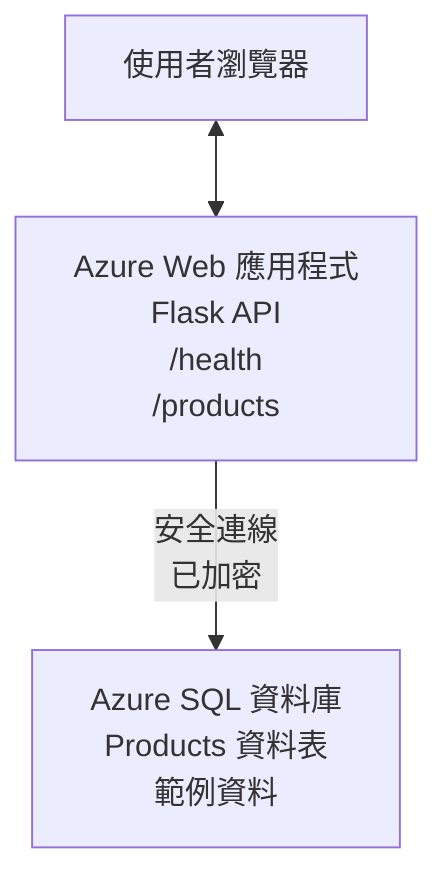

# Deploying a Microsoft SQL Database and Web App with AZD

⏱️ **Estimated Time**: 20-30 minutes | 💰 **Estimated Cost**: ~$15-25/month | ⭐ **Complexity**: Intermediate

This **complete, working example** demonstrates how to use the [Azure Developer CLI (azd)](https://learn.microsoft.com/azure/developer/azure-developer-cli/) to deploy a Python Flask web application with a Microsoft SQL Database to Azure. All code is included and tested—no external dependencies required.

## What You'll Learn

By completing this example, you will:
- Deploy a multi-tier application (web app + database) using infrastructure-as-code
- Configure secure database connections without hardcoding secrets
- Monitor application health with Application Insights
- Manage Azure resources efficiently with AZD CLI
- Follow Azure best practices for security, cost optimization, and observability

## Scenario Overview
- **Web App**: Python Flask REST API with database connectivity
- **Database**: Azure SQL Database with sample data
- **Infrastructure**: Provisioned using Bicep (modular, reusable templates)
- **Deployment**: Fully automated with `azd` commands
- **Monitoring**: Application Insights for logs and telemetry

## Prerequisites

### Required Tools

Before starting, verify you have these tools installed:

1. **[Azure CLI](https://learn.microsoft.com/cli/azure/install-azure-cli)** (version 2.50.0 or higher)
   ```sh
   az --version
   # 預期輸出：azure-cli 2.50.0 或更新版本
   ```

2. **[Azure Developer CLI (azd)](https://learn.microsoft.com/azure/developer/azure-developer-cli/install-azd)** (version 1.0.0 or higher)
   ```sh
   azd version
   # 預期輸出：azd 版本 1.0.0 或更高
   ```

3. **[Python 3.8+](https://www.python.org/downloads/)** (for local development)
   ```sh
   python --version
   # 預期輸出：Python 3.8 或更新版本
   ```

4. **[Docker](https://www.docker.com/get-started)** (optional, for local containerized development)
   ```sh
   docker --version
   # 預期輸出：Docker 版本 20.10 或更高
   ```

### Azure Requirements

- An active **Azure subscription** ([create a free account](https://azure.microsoft.com/free/))
- Permissions to create resources in your subscription
- **Owner** or **Contributor** role on the subscription or resource group

### Knowledge Prerequisites

This is an **intermediate-level** example. You should be familiar with:
- Basic command-line operations
- Fundamental cloud concepts (resources, resource groups)
- Basic understanding of web applications and databases

**New to AZD?** Start with the [Getting Started guide](../../docs/chapter-01-foundation/azd-basics.md) first.

## Architecture

This example deploys a two-tier architecture with a web application and SQL database:



**Resource Deployment:**
- **Resource Group**: Container for all resources
- **App Service Plan**: Linux-based hosting (B1 tier for cost efficiency)
- **Web App**: Python 3.11 runtime with Flask application
- **SQL Server**: Managed database server with TLS 1.2 minimum
- **SQL Database**: Basic tier (2GB, suitable for development/testing)
- **Application Insights**: Monitoring and logging
- **Log Analytics Workspace**: Centralized log storage

**Analogy**: Think of this like a restaurant (web app) with a walk-in freezer (database). Customers order from the menu (API endpoints), and the kitchen (Flask app) retrieves ingredients (data) from the freezer. The restaurant manager (Application Insights) tracks everything that happens.

## Folder Structure

All files are included in this example—no external dependencies required:

```
examples/database-app/
│
├── README.md                    # This file
├── azure.yaml                   # AZD configuration file
├── .env.sample                  # Sample environment variables
├── .gitignore                   # Git ignore patterns
│
├── infra/                       # Infrastructure as Code (Bicep)
│   ├── main.bicep              # Main orchestration template
│   ├── abbreviations.json      # Azure naming conventions
│   └── resources/              # Modular resource templates
│       ├── sql-server.bicep    # SQL Server configuration
│       ├── sql-database.bicep  # Database configuration
│       ├── app-service-plan.bicep  # Hosting plan
│       ├── app-insights.bicep  # Monitoring setup
│       └── web-app.bicep       # Web application
│
└── src/
    └── web/                    # Application source code
        ├── app.py              # Flask REST API
        ├── requirements.txt    # Python dependencies
        └── Dockerfile          # Container definition
```

**What Each File Does:**
- **azure.yaml**: Tells AZD what to deploy and where
- **infra/main.bicep**: Orchestrates all Azure resources
- **infra/resources/*.bicep**: Individual resource definitions (modular for reuse)
- **src/web/app.py**: Flask application with database logic
- **requirements.txt**: Python package dependencies
- **Dockerfile**: Containerization instructions for deployment

## Quickstart (Step-by-Step)

### Step 1: Clone and Navigate

```sh
git clone https://github.com/microsoft/AZD-for-beginners.git
cd AZD-for-beginners/examples/database-app
```

**✓ Success Check**: Verify you see `azure.yaml` and `infra/` folder:
```sh
ls
# 預期：README.md、azure.yaml、infra/、src/
```

### Step 2: Authenticate with Azure

```sh
azd auth login
```

This opens your browser for Azure authentication. Sign in with your Azure credentials.

**✓ Success Check**: You should see:
```
Logged in to Azure.
```

### Step 3: Initialize the Environment

```sh
azd init
```

**What happens**: AZD creates a local configuration for your deployment.

**Prompts you'll see**:
- **Environment name**: Enter a short name (e.g., `dev`, `myapp`)
- **Azure subscription**: Select your subscription from the list
- **Azure location**: Choose a region (e.g., `eastus`, `westeurope`)

**✓ Success Check**: You should see:
```
SUCCESS: New project initialized!
```

### Step 4: Provision Azure Resources

```sh
azd provision
```

**What happens**: AZD deploys all infrastructure (takes 5-8 minutes):
1. Creates resource group
2. Creates SQL Server and Database
3. Creates App Service Plan
4. Creates Web App
5. Creates Application Insights
6. Configures networking and security

**You'll be prompted for**:
- **SQL admin username**: Enter a username (e.g., `sqladmin`)
- **SQL admin password**: Enter a strong password (save this!)

**✓ Success Check**: You should see:
```
SUCCESS: Your application was provisioned in Azure in X minutes Y seconds.
You can view the resources created under the resource group rg-<env-name> in Azure Portal:
https://portal.azure.com/#@/resource/subscriptions/.../resourceGroups/rg-<env-name>
```

**⏱️ Time**: 5-8 minutes

### Step 5: Deploy the Application

```sh
azd deploy
```

**What happens**: AZD builds and deploys your Flask application:
1. Packages the Python application
2. Builds the Docker container
3. Pushes to Azure Web App
4. Initializes the database with sample data
5. Starts the application

**✓ Success Check**: You should see:
```
SUCCESS: Your application was deployed to Azure in X minutes Y seconds.
You can view the resources created under the resource group rg-<env-name> in Azure Portal:
https://portal.azure.com/#@/resource/subscriptions/.../resourceGroups/rg-<env-name>
```

**⏱️ Time**: 3-5 minutes

### Step 6: Browse the Application

```sh
azd browse
```

This opens your deployed web app in the browser at `https://app-<unique-id>.azurewebsites.net`

**✓ Success Check**: You should see JSON output:
```json
{
  "message": "Welcome to the Database App API",
  "endpoints": {
    "/": "This help message",
    "/health": "Health check endpoint",
    "/products": "List all products",
    "/products/<id>": "Get product by ID"
  }
}
```

### Step 7: Test the API Endpoints

**Health Check** (verify database connection):
```sh
curl https://app-<your-id>.azurewebsites.net/health
```

**Expected Response**:
```json
{
  "status": "healthy",
  "database": "connected"
}
```

**List Products** (sample data):
```sh
curl https://app-<your-id>.azurewebsites.net/products
```

**Expected Response**:
```json
[
  {
    "id": 1,
    "name": "Laptop",
    "description": "High-performance laptop",
    "price": 1299.99,
    "created_at": "2025-11-19T10:30:00"
  },
  ...
]
```

**Get Single Product**:
```sh
curl https://app-<your-id>.azurewebsites.net/products/1
```

**✓ Success Check**: All endpoints return JSON data without errors.

---

**🎉 Congratulations!** You've successfully deployed a web application with a database to Azure using AZD.

## Configuration Deep-Dive

### Environment Variables

Secrets are managed securely via Azure App Service configuration—**never hardcoded in source code**.

**Configured Automatically by AZD**:
- `SQL_CONNECTION_STRING`: Database connection with encrypted credentials
- `APPLICATIONINSIGHTS_CONNECTION_STRING`: Monitoring telemetry endpoint
- `SCM_DO_BUILD_DURING_DEPLOYMENT`: Enables automatic dependency installation

**Where Secrets Are Stored**:
1. During `azd provision`, you provide SQL credentials via secure prompts
2. AZD stores these in your local `.azure/<env-name>/.env` file (git-ignored)
3. AZD injects them into Azure App Service configuration (encrypted at rest)
4. Application reads them via `os.getenv()` at runtime

### Local Development

For local testing, create a `.env` file from the sample:

```sh
cp .env.sample .env
# 編輯 .env，並填入本機的資料庫連線設定
```

**Local Development Workflow**:
```sh
# 安裝相依套件
cd src/web
pip install -r requirements.txt

# 設定環境變數
export SQL_CONNECTION_STRING="your-local-connection-string"

# 執行應用程式
python app.py
```

**Test locally**:
```sh
curl http://localhost:8000/health
# 預期：{"status": "healthy", "database": "connected"}
```

### Infrastructure as Code

All Azure resources are defined in **Bicep templates** (`infra/` folder):

- **Modular Design**: Each resource type has its own file for reusability
- **Parameterized**: Customize SKUs, regions, naming conventions
- **Best Practices**: Follows Azure naming standards and security defaults
- **Version Controlled**: Infrastructure changes are tracked in Git

**Customization Example**:
To change the database tier, edit `infra/resources/sql-database.bicep`:
```bicep
sku: {
  name: 'Standard'  // Changed from 'Basic'
  tier: 'Standard'
  capacity: 10
}
```

## Security Best Practices

This example follows Azure security best practices:

### 1. **No Secrets in Source Code**
- ✅ Credentials stored in Azure App Service configuration (encrypted)
- ✅ `.env` files excluded from Git via `.gitignore`
- ✅ Secrets passed via secure parameters during provisioning

### 2. **Encrypted Connections**
- ✅ TLS 1.2 minimum for SQL Server
- ✅ HTTPS-only enforced for Web App
- ✅ Database connections use encrypted channels

### 3. **Network Security**
- ✅ SQL Server firewall configured to allow Azure services only
- ✅ Public network access restricted (can be further locked down with Private Endpoints)
- ✅ FTPS disabled on Web App

### 4. **Authentication & Authorization**
- ⚠️ **Current**: SQL authentication (username/password)
- ✅ **Production Recommendation**: Use Azure Managed Identity for passwordless authentication

**To Upgrade to Managed Identity** (for production):
1. Enable managed identity on Web App
2. Grant identity SQL permissions
3. Update connection string to use managed identity
4. Remove password-based authentication

### 5. **Auditing & Compliance**
- ✅ Application Insights logs all requests and errors
- ✅ SQL Database auditing enabled (can be configured for compliance)
- ✅ All resources tagged for governance

**Security Checklist Before Production**:
- [ ] Enable Azure Defender for SQL
- [ ] Configure Private Endpoints for SQL Database
- [ ] Enable Web Application Firewall (WAF)
- [ ] Implement Azure Key Vault for secret rotation
- [ ] Configure Microsoft Entra ID authentication
- [ ] Enable diagnostic logging for all resources

## Cost Optimization

**Estimated Monthly Costs** (as of November 2025):

| Resource | SKU/Tier | Estimated Cost |
|----------|----------|----------------|
| App Service Plan | B1 (Basic) | ~$13/month |
| SQL Database | Basic (2GB) | ~$5/month |
| Application Insights | Pay-as-you-go | ~$2/month (low traffic) |
| **Total** | | **~$20/month** |

**💡 Cost-Saving Tips**:

1. **Use Free Tier for Learning**:
   - App Service: F1 tier (free, limited hours)
   - SQL Database: Use Azure SQL Database serverless
   - Application Insights: 5GB/month free ingestion

2. **Stop Resources When Not in Use**:
   ```sh
   # 停止 Web 應用程式（資料庫仍會收費）
   az webapp stop --name <app-name> --resource-group <rg-name>
   
   # 需要時再重新啟動
   az webapp start --name <app-name> --resource-group <rg-name>
   ```

3. **Delete Everything After Testing**:
   ```sh
   azd down
   ```
   This removes ALL resources and stops charges.

4. **Development vs. Production SKUs**:
   - **Development**: Basic tier (used in this example)
   - **Production**: Standard/Premium tier with redundancy

**Cost Monitoring**:
- View costs in [Azure Cost Management](https://portal.azure.com/#view/Microsoft_Azure_CostManagement)
- Set up cost alerts to avoid surprises
- Tag all resources with `azd-env-name` for tracking

**Free Tier Alternative**:
For learning purposes, you can modify `infra/resources/app-service-plan.bicep`:
```bicep
sku: {
  name: 'F1'  // Free tier
  tier: 'Free'
}
```
**Note**: Free tier has limitations (60 min/day CPU, no always-on).

## Monitoring & Observability

### Application Insights Integration

This example includes **Application Insights** for comprehensive monitoring:

**What's Monitored**:
- ✅ HTTP requests (latency, status codes, endpoints)
- ✅ Application errors and exceptions
- ✅ Custom logging from Flask app
- ✅ Database connection health
- ✅ Performance metrics (CPU, memory)

**Access Application Insights**:
1. Open [Azure Portal](https://portal.azure.com)
2. Navigate to your resource group (`rg-<env-name>`)
3. Click on Application Insights resource (`appi-<unique-id>`)

**Useful Queries** (Application Insights → Logs):

**View All Requests**:
```kusto
requests
| where timestamp > ago(1h)
| order by timestamp desc
| project timestamp, name, url, resultCode, duration
```

**Find Errors**:
```kusto
exceptions
| where timestamp > ago(24h)
| order by timestamp desc
| project timestamp, type, outerMessage, operation_Name
```

**Check Health Endpoint**:
```kusto
requests
| where name contains "health"
| summarize count() by resultCode, bin(timestamp, 1h)
```

### SQL Database Auditing

**SQL Database auditing is enabled** to track:
- Database access patterns
- Failed login attempts
- Schema changes
- Data access (for compliance)

**Access Audit Logs**:
1. Azure Portal → SQL Database → Auditing
2. View logs in Log Analytics workspace

### Real-Time Monitoring

**View Live Metrics**:
1. Application Insights → Live Metrics
2. See requests, failures, and performance in real-time

**Set Up Alerts**:
Create alerts for critical events:
- HTTP 500 errors > 5 in 5 minutes
- Database connection failures
- High response times (>2 seconds)

**Example Alert Creation**:
```sh
az monitor metrics alert create \
  --name "High-Response-Time" \
  --resource-group <rg-name> \
  --scopes <app-insights-resource-id> \
  --condition "avg requests/duration > 2000" \
  --description "Alert when response time exceeds 2 seconds"
```

## Troubleshooting
### 常見問題與解決方案

#### 1. `azd provision` fails with "Location not available"

<strong>症狀</strong>:
```
Error: The subscription is not registered for the resource type 'components' in the location 'centralus'.
```

<strong>解決方案</strong>:
選擇不同的 Azure 區域或註冊資源提供者：
```sh
az provider register --namespace Microsoft.Insights
```

#### 2. SQL Connection Fails During Deployment

<strong>症狀</strong>:
```
pyodbc.OperationalError: ('08001', '[08001] [Microsoft][ODBC Driver 18 for SQL Server]TCP Provider...')
```

<strong>解決方案</strong>:
- 驗證 SQL Server 防火牆是否允許 Azure 服務（會自動設定）
- 檢查在 `azd provision` 時是否正確輸入 SQL 管理密碼
- 確認 SQL Server 已完全佈建（可能需要 2-3 分鐘）

<strong>驗證連線</strong>:
```sh
# 在 Azure 入口網站中，前往 SQL Database → 查詢編輯器
# 嘗試使用您的認證連線
```

#### 3. Web App Shows "Application Error"

<strong>症狀</strong>:
瀏覽器顯示一般錯誤頁面。

<strong>解決方案</strong>:
檢查應用程式日誌：
```sh
# 檢視近期日誌
az webapp log tail --name <app-name> --resource-group <rg-name>
```

<strong>常見原因</strong>:
- 缺少環境變數（檢查 App Service → 設定）
- Python 套件安裝失敗（檢查部署日誌）
- 資料庫初始化錯誤（檢查 SQL 連線）

#### 4. `azd deploy` Fails with "Build Error"

<strong>症狀</strong>:
```
Error: Failed to build project
```

<strong>解決方案</strong>:
- 確保 `requirements.txt` 沒有語法錯誤
- 檢查在 `infra/resources/web-app.bicep` 中是否指定了 Python 3.11
- 確認 Dockerfile 的基底映像正確

<strong>在本機偵錯</strong>:
```sh
cd src/web
docker build -t test-app .
docker run -p 8000:8000 test-app
```

#### 5. "Unauthorized" When Running AZD Commands

<strong>症狀</strong>:
```
ERROR: (Unauthorized) The client '<id>' with object id '<id>' does not have authorization
```

<strong>解決方案</strong>:
重新登入 Azure：
```sh
# AZD 工作流程所需
azd auth login

# 如果您也直接使用 Azure CLI 命令，則可選
az login
```

確認您在訂閱上擁有正確權限（Contributor 角色）。

#### 6. High Database Costs

<strong>症狀</strong>:
意外的 Azure 帳單。

<strong>解決方案</strong>:
- 檢查是否在測試後忘記執行 `azd down`
- 確認 SQL Database 使用的是 Basic 層級（非 Premium）
- 在 Azure Cost Management 檢視費用
- 設置費用警示

### 取得協助

**查看所有 AZD 環境變數**:
```sh
azd env get-values
```

<strong>檢查部署狀態</strong>:
```sh
az webapp show --name <app-name> --resource-group <rg-name> --query state
```

<strong>存取應用程式日誌</strong>:
```sh
az webapp log download --name <app-name> --resource-group <rg-name> --log-file app-logs.zip
```

**需要更多協助？**
- [AZD 疑難排解指南](../../docs/chapter-07-troubleshooting/common-issues.md)
- [Azure App Service 疑難排解](https://learn.microsoft.com/azure/app-service/troubleshoot-diagnostic-logs)
- [Azure SQL 疑難排解](https://learn.microsoft.com/azure/azure-sql/database/troubleshoot-common-errors-issues)

## 實作練習

### 練習 1：驗證您的部署（初學者）

<strong>目標</strong>: 確認所有資源已部署且應用程式運作正常。

<strong>步驟</strong>:
1. 列出資源群組中的所有資源：
   ```sh
   az resource list --resource-group rg-<env-name> --output table
   ```
   <strong>預期</strong>: 6-7 個資源 (Web App, SQL Server, SQL Database, App Service Plan, Application Insights, Log Analytics)

2. 測試所有 API 端點：
   ```sh
   curl https://app-<your-id>.azurewebsites.net/
   curl https://app-<your-id>.azurewebsites.net/health
   curl https://app-<your-id>.azurewebsites.net/products
   curl https://app-<your-id>.azurewebsites.net/products/1
   ```
   <strong>預期</strong>: 全部回傳有效 JSON 且無錯誤

3. 檢查 Application Insights:
   - 在 Azure 入口網站中前往 Application Insights
   - 前往 "Live Metrics"
   - 在 web 應用上重新整理瀏覽器
   <strong>預期</strong>: 可即時看到請求出現

<strong>成功條件</strong>: 所有 6-7 個資源存在，所有端點回傳資料，Live Metrics 顯示活動。

---

### 練習 2：新增 API 端點（中階）

<strong>目標</strong>: 將 Flask 應用擴充為新增端點。

<strong>起始程式碼</strong>: 目前的端點在 `src/web/app.py`

<strong>步驟</strong>:
1. 編輯 `src/web/app.py` 並在 `get_product()` 函式之後新增端點：
   ```python
   @app.route('/products/search/<keyword>')
   def search_products(keyword):
       """Search products by name or description."""
       try:
           conn = get_db_connection()
           cursor = conn.cursor()
           cursor.execute(
               "SELECT id, name, description, price, created_at FROM products WHERE name LIKE ? OR description LIKE ?",
               (f'%{keyword}%', f'%{keyword}%')
           )
           
           products = []
           for row in cursor.fetchall():
               products.append({
                   'id': row[0],
                   'name': row[1],
                   'description': row[2],
                   'price': float(row[3]) if row[3] else None,
                   'created_at': row[4].isoformat() if row[4] else None
               })
           
           cursor.close()
           conn.close()
           
           logger.info(f"Search for '{keyword}' returned {len(products)} results")
           return jsonify(products), 200
           
       except Exception as e:
           logger.error(f"Error searching products: {str(e)}")
           return jsonify({'error': str(e)}), 500
   ```

2. 部署更新後的應用程式：
   ```sh
   azd deploy
   ```

3. 測試新端點：
   ```sh
   curl https://app-<your-id>.azurewebsites.net/products/search/laptop
   ```
   <strong>預期</strong>: 回傳符合 "laptop" 的產品

<strong>成功條件</strong>: 新端點運作正常，回傳過濾後結果，並出現在 Application Insights 日誌中。

---

### 練習 3：新增監控與警示（進階）

<strong>目標</strong>: 設定主動監控與警示。

<strong>步驟</strong>:
1. 建立針對 HTTP 500 錯誤的警示：
   ```sh
   # 取得 Application Insights 資源 ID
   AI_ID=$(az monitor app-insights component show \
     --app appi-<your-id> \
     --resource-group rg-<env-name> \
     --query id -o tsv)
   
   # 建立警示
   az monitor metrics alert create \
     --name "High-Error-Rate" \
     --resource-group rg-<env-name> \
     --scopes $AI_ID \
     --condition "count requests/failed > 5" \
     --window-size 5m \
     --evaluation-frequency 1m \
     --description "Alert when >5 failed requests in 5 minutes"
   ```

2. 透過製造錯誤觸發警示：
   ```sh
   # 請求不存在的產品
   for i in {1..10}; do curl https://app-<your-id>.azurewebsites.net/products/999; done
   ```

3. 檢查警示是否觸發：
   - Azure Portal → Alerts → Alert Rules
   - 檢查您的電子郵件（如已設定）

<strong>成功條件</strong>: 已建立警示規則、於錯誤時觸發，且已收到通知。

---

### 練習 4：資料庫結構變更（進階）

<strong>目標</strong>: 新增一個資料表並修改應用程式以使用它。

<strong>步驟</strong>:
1. 透過 Azure 入口網站的 Query Editor 連線到 SQL Database

2. 建立新的 `categories` 資料表：
   ```sql
   CREATE TABLE categories (
       id INT PRIMARY KEY IDENTITY(1,1),
       name NVARCHAR(50) NOT NULL,
       description NVARCHAR(200)
   );
   
   INSERT INTO categories (name, description) VALUES
   ('Electronics', 'Electronic devices and accessories'),
   ('Office Supplies', 'Office equipment and supplies');
   
   -- Add category to products table
   ALTER TABLE products ADD category_id INT;
   UPDATE products SET category_id = 1; -- Set all to Electronics
   ```

3. 更新 `src/web/app.py`，在回應中加入分類資訊

4. 部署並測試

<strong>成功條件</strong>: 新資料表存在，產品顯示分類資訊，應用程式仍正常運作。

---

### 練習 5：實作快取（專家）

<strong>目標</strong>: 新增 Azure Redis Cache 以提升效能。

<strong>步驟</strong>:
1. 在 `infra/main.bicep` 中新增 Redis Cache
2. 更新 `src/web/app.py` 以快取產品查詢
3. 使用 Application Insights 測量效能提升
4. 比較快取前後的回應時間

<strong>成功條件</strong>: Redis 已部署、快取功能正常，回應時間提升超過 50%。

<strong>提示</strong>: 從 [Azure Cache for Redis 文件](https://learn.microsoft.com/azure/azure-cache-for-redis/) 開始。

---

## 清理

為避免持續產生費用，完成後請刪除所有資源：

```sh
azd down
```

<strong>確認提示</strong>:
```
? Total resources to delete: 7, are you sure you want to continue? (y/N)
```

輸入 `y` 以確認。

**✓ 成功檢查**: 
- 所有資源已從 Azure 入口網站刪除
- 不再有持續費用
- 本機的 `.azure/<env-name>` 資料夾可以刪除

<strong>替代方案</strong>（保留基礎結構，刪除資料）:
```sh
# 只刪除資源群組（保留 AZD 設定）
az group delete --name rg-<env-name> --yes
```
## 進一步了解

### 相關文件
- [Azure Developer CLI 文件](https://learn.microsoft.com/azure/developer/azure-developer-cli/)
- [Azure SQL Database 文件](https://learn.microsoft.com/azure/azure-sql/database/)
- [Azure App Service 文件](https://learn.microsoft.com/azure/app-service/)
- [Application Insights 文件](https://learn.microsoft.com/azure/azure-monitor/app/app-insights-overview)
- [Bicep 語言參考](https://learn.microsoft.com/azure/azure-resource-manager/bicep/)

### 這堂課的下一步
- **[Container Apps 範例](../../../../examples/container-app)**：使用 Azure Container Apps 部署微服務
- **[AI 整合指南](../../../../docs/ai-foundry)**：為您的應用加入 AI 能力
- **[部署最佳實務](../../docs/chapter-04-infrastructure/deployment-guide.md)**：生產環境部署模式

### 進階主題
- **Managed Identity**: 移除密碼並使用 Microsoft Entra ID 驗證
- **Private Endpoints**: 在虛擬網路內保護資料庫連線
- **CI/CD Integration**: 使用 GitHub Actions 或 Azure DevOps 自動化部署
- **Multi-Environment**: 設定開發、預備與生產環境
- **Database Migrations**: 使用 Alembic 或 Entity Framework 進行結構版本管理

### 與其他方法的比較

**AZD vs. ARM Templates**:
- ✅ AZD：較高階的抽象、指令更簡單
- ⚠️ ARM：較冗長，但能更細緻控制

**AZD vs. Terraform**:
- ✅ AZD：Azure 原生，與 Azure 服務整合
- ⚠️ Terraform：支援多雲端、擁有較大生態系

**AZD vs. Azure Portal**:
- ✅ AZD：可重複執行、受版本控制、易自動化
- ⚠️ Portal：手動點擊，難以複製

可將 AZD 想像為：Azure 的 Docker Compose—為複雜部署簡化設定。

---

## 常見問題

**Q: 我可以使用其他程式語言嗎？**  
A: 可以！將 `src/web/` 換成 Node.js、C#、Go 或其他語言。並相應地更新 `azure.yaml` 與 Bicep。

**Q: 如何新增更多資料庫？**  
A: 在 `infra/main.bicep` 新增另一個 SQL Database 模組，或使用 Azure Database 的 PostgreSQL/MySQL。

**Q: 我可以用於生產環境嗎？**  
A: 這是一個起點。要用於生產，請加入：managed identity、private endpoints、冗餘、備份策略、WAF，以及強化監控。

**Q: 如果我想用容器而不是代碼部署呢？**  
A: 請參閱 **[Container Apps 範例](../../../../examples/container-app)**，該範例全程使用 Docker 容器。

**Q: 如何從本機連接到資料庫？**  
A: 將您的 IP 新增至 SQL Server 防火牆：
```sh
az sql server firewall-rule create \
  --resource-group rg-<env-name> \
  --server sql-<unique-id> \
  --name AllowMyIP \
  --start-ip-address <your-ip> \
  --end-ip-address <your-ip>
```

**Q: 我可以使用現有的資料庫而不是建立新的嗎？**  
A: 可以，修改 `infra/main.bicep` 以參照現有的 SQL Server 並更新連線字串參數。

---

> **注意：** 此範例示範使用 AZD 部署含資料庫的 Web 應用之最佳實務。內容包含可執行程式碼、完整文件與實作練習以加深學習。對於生產部署，請根據您組織的需求，檢視安全性、擴充性、合規性與成本等相關項目。

**📚 課程導覽：**
- ← 上一章： [Container Apps 範例](../../../../examples/container-app)
- → 下一章： [AI 整合指南](../../../../docs/ai-foundry)
- 🏠 [課程首頁](../../README.md)

---

<!-- CO-OP TRANSLATOR DISCLAIMER START -->
**免責聲明**：
此文件已使用 AI 翻譯服務 [Co-op Translator](https://github.com/Azure/co-op-translator) 進行翻譯。雖然我們努力追求準確性，但請注意自動翻譯可能包含錯誤或不準確之處。原始文件的母語版本應視為權威來源。對於關鍵資訊，建議採用專業人工翻譯。我們不對因使用此翻譯所產生的任何誤解或誤譯承擔責任。
<!-- CO-OP TRANSLATOR DISCLAIMER END -->