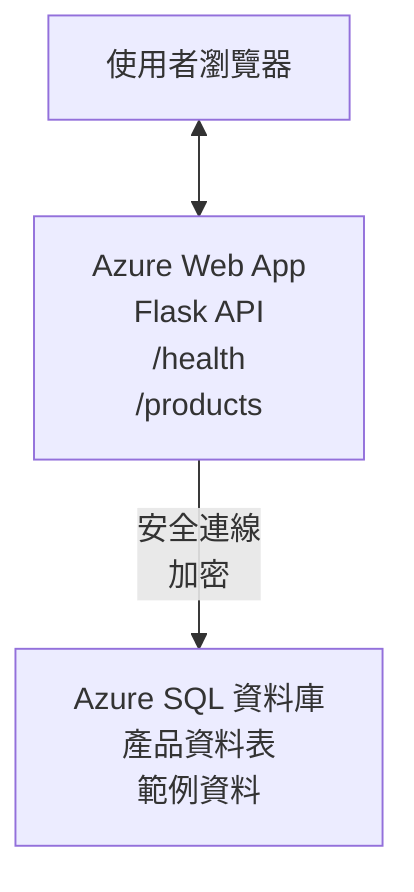

# 使用 AZD 部署 Microsoft SQL 資料庫與 Web 應用程式

⏱️ <strong>預計時間</strong>：20-30 分鐘 | 💰 <strong>預估費用</strong>：約 $15-25/月 | ⭐ <strong>難度</strong>：中階

此<strong>完整且可運作的範例</strong>示範如何使用 [Azure Developer CLI (azd)](https://learn.microsoft.com/azure/developer/azure-developer-cli/) 將 Python Flask Web 應用程式與 Microsoft SQL 資料庫部署至 Azure。所有程式碼皆包含且已測試完成—無需外部相依性。

## 您將學習

完成本範例後，您將會：
- 使用基礎設施即程式碼部署多層應用程式（Web 應用 + 資料庫）
- 配置安全的資料庫連線且不需將機密寫死在程式碼中
- 利用 Application Insights 監控應用程式健康狀況
- 使用 AZD CLI 高效管理 Azure 資源
- 遵循 Azure 的安全、成本優化與可觀察性最佳實踐

## 情境概述
- **Web 應用程式**：Python Flask REST API，具備資料庫連線
- <strong>資料庫</strong>：Azure SQL 資料庫，含範例資料
- <strong>基礎架構</strong>：使用 Bicep（模組化、可重用範本）建置
- <strong>部署方式</strong>：透過 `azd` 命令全自動部署
- <strong>監控</strong>：使用 Application Insights 進行日誌與遙測

## 前置需求

### 需要工具

開始前請確認您已安裝以下工具：

1. **[Azure CLI](https://learn.microsoft.com/cli/azure/install-azure-cli)** （2.50.0 版或以上）
   ```sh
   az --version
   # 預期輸出：azure-cli 2.50.0 或更高版本
   ```

2. **[Azure Developer CLI (azd)](https://learn.microsoft.com/azure/developer/azure-developer-cli/install-azd)** （1.0.0 版或以上）
   ```sh
   azd version
   # 預期輸出：azd 版本 1.0.0 或更高
   ```

3. **[Python 3.8+](https://www.python.org/downloads/)** （用於本機開發）
   ```sh
   python --version
   # 預期輸出：Python 3.8 或更新版本
   ```

4. **[Docker](https://www.docker.com/get-started)** （選用，適合本機容器化開發）
   ```sh
   docker --version
   # 預期輸出：Docker 版本 20.10 或更高
   ```

### Azure 要求

- 擁有有效的 **Azure 訂閱** ([免費帳戶建立](https://azure.microsoft.com/free/))
- 具備在訂閱中建立資源的權限
- 訂閱或資源群組的 <strong>擁有者</strong> 或 <strong>參與者</strong> 角色

### 知識需求

此範例屬於<strong>中階</strong>範例，您應該熟悉：
- 基本命令列操作
- 雲端基礎概念（資源、資源群組）
- 基本 Web 應用與資料庫概念

**初學 AZD？** 請先從 [快速入門指南](../../docs/chapter-01-foundation/azd-basics.md) 開始。

## 架構

本範例部署兩層架構，包括 Web 應用與 SQL 資料庫：


**資源部署說明：**
- <strong>資源群組</strong>：所有資源的容器
- **App Service 計畫**：Linux 主機（B1 層，成本效益佳）
- **Web 應用程式**：Python 3.11 執行環境搭配 Flask 應用
- **SQL 伺服器**：受管資料庫伺服器，最低 TLS 1.2
- **SQL 資料庫**：基本層（2GB，適合開發與測試）
- **Application Insights**：監控與日誌
- **Log Analytics 工作區**：集中化日誌儲存

<strong>比喻說明</strong>：就像餐廳（Web 應用）有一個冷藏庫（資料庫）。顧客從菜單（API 端點）點餐，廚房（Flask 應用）從冷藏庫取食材（資料）。餐廳經理（Application Insights）紀錄所有發生的事。

## 資料夾結構

本範例內含所有檔案，無需外部相依：

```
examples/database-app/
│
├── README.md                    # This file
├── azure.yaml                   # AZD configuration file
├── .env.sample                  # Sample environment variables
├── .gitignore                   # Git ignore patterns
│
├── infra/                       # Infrastructure as Code (Bicep)
│   ├── main.bicep              # Main orchestration template
│   ├── abbreviations.json      # Azure naming conventions
│   └── resources/              # Modular resource templates
│       ├── sql-server.bicep    # SQL Server configuration
│       ├── sql-database.bicep  # Database configuration
│       ├── app-service-plan.bicep  # Hosting plan
│       ├── app-insights.bicep  # Monitoring setup
│       └── web-app.bicep       # Web application
│
└── src/
    └── web/                    # Application source code
        ├── app.py              # Flask REST API
        ├── requirements.txt    # Python dependencies
        └── Dockerfile          # Container definition
```

**各檔案說明：**
- **azure.yaml**：告訴 AZD 要部署什麼以及位置
- **infra/main.bicep**：編排全部 Azure 資源
- **infra/resources/*.bicep**：個別資源定義（模組化方便重用）
- **src/web/app.py**：Flask 應用程式及資料庫邏輯
- **requirements.txt**：Python 套件依賴
- **Dockerfile**：容器化部署指令

## 快速開始（逐步說明）

### 步驟 1：複製並切換目錄

```sh
git clone https://github.com/microsoft/AZD-for-beginners.git
cd AZD-for-beginners/examples/database-app
```

**✓ 成功確認**：確定看到 `azure.yaml` 和 `infra/` 資料夾：
```sh
ls
# 預期：README.md、azure.yaml、infra/、src/
```

### 步驟 2：Azure 身份驗證

```sh
azd auth login
```

此操作會開啟瀏覽器讓您登入 Azure。

**✓ 成功確認**：您應該看到：
```
Logged in to Azure.
```

### 步驟 3：初始化環境

```sh
azd init
```

<strong>發生什麼事</strong>：AZD 建立您的部署本機設定。

<strong>系統提示</strong>：
- <strong>環境名稱</strong>：輸入短名稱（例如 `dev`、`myapp`）
- **Azure 訂閱**：從清單中選擇訂閱
- **Azure 區域**：選擇區域（例如 `eastus`、`westeurope`）

**✓ 成功確認**：您應該看到：
```
SUCCESS: New project initialized!
```

### 步驟 4：建立 Azure 資源

```sh
azd provision
```

<strong>發生什麼事</strong>：AZD 部署全部基礎設施（約 5-8 分鐘）：
1. 建立資源群組
2. 建立 SQL 伺服器與資料庫
3. 建立 App Service 計畫
4. 建立 Web 應用
5. 建立 Application Insights
6. 配置網路與安全設定

<strong>系統會提示您輸入</strong>：
- **SQL 管理員帳號**：輸入使用者名稱（例如 `sqladmin`）
- **SQL 管理員密碼**：輸入強密碼（請妥善保存！）

**✓ 成功確認**：您應該看到：
```
SUCCESS: Your application was provisioned in Azure in X minutes Y seconds.
You can view the resources created under the resource group rg-<env-name> in Azure Portal:
https://portal.azure.com/#@/resource/subscriptions/.../resourceGroups/rg-<env-name>
```

**⏱️ 時間**：5-8 分鐘

### 步驟 5：部署應用程式

```sh
azd deploy
```

<strong>發生什麼事</strong>：AZD 建置並部署您的 Flask 應用：
1. 打包 Python 應用程式
2. 建置 Docker 容器映像
3. 推送至 Azure Web 應用
4. 初始化資料庫範例資料
5. 啟動應用程式

**✓ 成功確認**：您應該看到：
```
SUCCESS: Your application was deployed to Azure in X minutes Y seconds.
You can view the resources created under the resource group rg-<env-name> in Azure Portal:
https://portal.azure.com/#@/resource/subscriptions/.../resourceGroups/rg-<env-name>
```

**⏱️ 時間**：3-5 分鐘

### 步驟 6：瀏覽已部署的應用程式

```sh
azd browse
```

這會在瀏覽器開啟您已部署的 Web 應用，網址為 `https://app-<unique-id>.azurewebsites.net`

**✓ 成功確認**：您應該看到 JSON 輸出：
```json
{
  "message": "Welcome to the Database App API",
  "endpoints": {
    "/": "This help message",
    "/health": "Health check endpoint",
    "/products": "List all products",
    "/products/<id>": "Get product by ID"
  }
}
```

### 步驟 7：測試 API 端點

<strong>健康檢查</strong>（驗證資料庫連線）：
```sh
curl https://app-<your-id>.azurewebsites.net/health
```

<strong>預期回應</strong>：
```json
{
  "status": "healthy",
  "database": "connected"
}
```

<strong>列出產品</strong>（範例資料）：
```sh
curl https://app-<your-id>.azurewebsites.net/products
```

<strong>預期回應</strong>：
```json
[
  {
    "id": 1,
    "name": "Laptop",
    "description": "High-performance laptop",
    "price": 1299.99,
    "created_at": "2025-11-19T10:30:00"
  },
  ...
]
```

<strong>取得單一產品</strong>：
```sh
curl https://app-<your-id>.azurewebsites.net/products/1
```

**✓ 成功確認**：所有端點皆回傳 JSON 且無錯誤。

---

**🎉 恭喜！** 您已成功使用 AZD 部署含資料庫的 Web 應用程式至 Azure。

## 設定深度解析

### 環境變數

機密透過 Azure App Service 設定安全管理—<strong>絕不寫死在程式碼中</strong>。

**由 AZD 自動配置**：
- `SQL_CONNECTION_STRING`：資料庫連線字串（含加密憑證）
- `APPLICATIONINSIGHTS_CONNECTION_STRING`：監控遙測連線字串
- `SCM_DO_BUILD_DURING_DEPLOYMENT`：啟用自動安裝相依套件

<strong>機密儲存位置</strong>：
1. `azd provision` 時由您透過安全提示輸入 SQL 憑證
2. AZD 儲存在本機 `.azure/<env-name>/.env` 檔案（Git 忽略）
3. AZD 注入並加密儲存在 Azure App Service 設定
4. 應用程式執行時透過 `os.getenv()` 讀取

### 本機開發

本機測試時，可以從範例 `.env` 建立設定：

```sh
cp .env.sample .env
# 編輯 .env 以設定您的本地資料庫連接
```

<strong>本機開發流程</strong>：
```sh
# 安裝相依套件
cd src/web
pip install -r requirements.txt

# 設定環境變數
export SQL_CONNECTION_STRING="your-local-connection-string"

# 執行應用程式
python app.py
```

<strong>本機測試</strong>：
```sh
curl http://localhost:8000/health
# 預期結果: {"status": "healthy", "database": "connected"}
```

### 基礎設施即程式碼

所有 Azure 資源皆定義於 **Bicep 範本**（位於 `infra/` 資料夾）：

- <strong>模組化設計</strong>：各資源類型有獨立檔案，方便重複使用
- <strong>參數化</strong>：可自訂 SKU、區域、命名規範
- <strong>最佳實踐</strong>：遵循 Azure 命名標準與安全預設
- <strong>版本控管</strong>：基礎架構程式碼受 Git 管理

<strong>自訂範例</strong>：
若要變更資料庫層級，請編輯 `infra/resources/sql-database.bicep`：
```bicep
sku: {
  name: 'Standard'  // Changed from 'Basic'
  tier: 'Standard'
  capacity: 10
}
```

## 安全最佳實踐

本範例遵循 Azure 的安全最佳實踐：

### 1. <strong>程式碼內無機密</strong>
- ✅ 憑證存放於 Azure App Service 設定（加密）
- ✅ `.env` 檔透過 `.gitignore` 排除於 Git 外
- ✅ 透過部署時的安全參數傳遞機密

### 2. <strong>加密連線</strong>
- ✅ SQL 伺服器強制 TLS 1.2 以上
- ✅ Web 應用強制 HTTPS
- ✅ 資料庫連線使用加密頻道

### 3. <strong>網路安全</strong>
- ✅ SQL 防火牆設定僅允許 Azure 服務存取
- ✅ 公網存取限制（可進一步用私用端點鎖定）
- ✅ Web 應用停用 FTPS

### 4. <strong>認證與授權</strong>
- ⚠️ <strong>目前</strong>：SQL 認證（用戶名/密碼）
- ✅ <strong>生產建議</strong>：使用 Azure 受管身分進行無密碼驗證

<strong>升級受管身分方法</strong>（針對生產）：
1. 啟用 Web 應用的受管身分
2. 授權身分 SQL 權限
3. 更新連線字串使用受管身分
4. 移除密碼認證

### 5. <strong>稽核與合規</strong>
- ✅ Application Insights 記錄所有請求與錯誤
- ✅ SQL 資料庫啟用稽核（可配置合規需求）
- ✅ 所有資源標註標籤以便治理

<strong>生產前安全清單</strong>：
- [ ] 啟用 Azure Defender for SQL
- [ ] 配置 SQL 資料庫私用端點
- [ ] 啟用 Web 應用防火牆（WAF）
- [ ] 實作 Azure Key Vault 進行機密輪替
- [ ] 配置 Azure AD 認證
- [ ] 啟用全部資源的診斷日誌

## 成本優化

<strong>每月預估成本</strong>（截至 2025 年 11 月）：

| 資源 | SKU/層級 | 預估費用 |
|----------|----------|----------------|
| App Service 計畫 | B1（基本層） | 約 $13/月 |
| SQL 資料庫 | 基本層（2GB） | 約 $5/月 |
| Application Insights | 依量計費 | 約 $2/月（低流量） |
| <strong>總計</strong> | | **約 $20/月** |

**💡 節省成本小撇步**：

1. <strong>使用免費層學習</strong>：
   - App Service：F1 層（免費，有限時數）
   - SQL 資料庫：使用 Azure SQL Database serverless
   - Application Insights：每月有 5GB 免費進量

2. <strong>不使用時停止資源</strong>：
   ```sh
   # 停止網頁應用程式（資料庫仍會收費）
   az webapp stop --name <app-name> --resource-group <rg-name>
   
   # 需要時重啟
   az webapp start --name <app-name> --resource-group <rg-name>
   ```

3. <strong>測試結束後刪除所有資源</strong>：
   ```sh
   azd down
   ```
   這樣可移除所有資源並停止計費。

4. **開發與生產 SKU 差異**：
   - <strong>開發</strong>：使用基本層（本範例適用）
   - <strong>生產</strong>：使用標準或高階層級具備冗餘能力

<strong>成本監控</strong>：
- 在 [Azure Cost Management](https://portal.azure.com/#view/Microsoft_Azure_CostManagement) 檢視費用
- 設定費用警示避免意外支出
- 給所有資源加上 `azd-env-name` 標籤便於追蹤

<strong>免費層替代方案</strong>：
為學習目的，您可修改 `infra/resources/app-service-plan.bicep`：
```bicep
sku: {
  name: 'F1'  // Free tier
  tier: 'Free'
}
```
<strong>注意</strong>：免費層有限制（每天 CPU 限 60 分鐘，無 Always On 功能）。

## 監控與可觀察性

### Application Insights 整合

本範例包含 **Application Insights**，提供完整監控功能：

<strong>監控項目</strong>：
- ✅ HTTP 請求（延遲、狀態碼、端點）
- ✅ 應用程式錯誤與異常
- ✅ Flask 應用自訂日誌
- ✅ 資料庫連線健康狀態
- ✅ 性能指標（CPU、記憶體）

**存取 Application Insights**：
1. 開啟 [Azure 入口網站](https://portal.azure.com)
2. 導覽到您的資源群組（`rg-<env-name>`）
3. 點選 Application Insights 資源（`appi-<unique-id>`）

<strong>有用查詢</strong>（Application Insights → 日誌）：

<strong>查看所有請求</strong>：
```kusto
requests
| where timestamp > ago(1h)
| order by timestamp desc
| project timestamp, name, url, resultCode, duration
```

<strong>尋找錯誤</strong>：
```kusto
exceptions
| where timestamp > ago(24h)
| order by timestamp desc
| project timestamp, type, outerMessage, operation_Name
```

<strong>檢查健康端點</strong>：
```kusto
requests
| where name contains "health"
| summarize count() by resultCode, bin(timestamp, 1h)
```

### SQL 資料庫稽核

<strong>啟用 SQL 資料庫稽核</strong>以追踪：
- 資料庫訪問行為
- 登入失敗嘗試
- 架構變更
- 資料存取（合規用）

<strong>存取稽核日誌</strong>：
1. Azure 入口網站 → SQL 資料庫 → 稽核
2. 在 Log Analytics 工作區查看日誌

### 即時監控

<strong>查看即時指標</strong>：
1. Application Insights → 即時指標
2. 即時查看請求、錯誤與效能

<strong>設定警示</strong>：
建立重要事件警示：
- HTTP 500 錯誤超過 5 次（五分鐘內）
- 資料庫連線失敗
- 響應時間過長（>2 秒）

<strong>警示建立範例</strong>：
```sh
az monitor metrics alert create \
  --name "High-Response-Time" \
  --resource-group <rg-name> \
  --scopes <app-insights-resource-id> \
  --condition "avg requests/duration > 2000" \
  --description "Alert when response time exceeds 2 seconds"
```

## 疑難排解
### 常見問題與解決方案

#### 1. `azd provision` 顯示「Location not available」錯誤

<strong>症狀</strong>：
```
Error: The subscription is not registered for the resource type 'components' in the location 'centralus'.
```

<strong>解決方案</strong>：
選擇不同的 Azure 區域或註冊資源提供者：
```sh
az provider register --namespace Microsoft.Insights
```

#### 2. 部署期間 SQL 連線失敗

<strong>症狀</strong>：
```
pyodbc.OperationalError: ('08001', '[08001] [Microsoft][ODBC Driver 18 for SQL Server]TCP Provider...')
```

<strong>解決方案</strong>：
- 確認 SQL Server 防火牆允許 Azure 服務（會自動設定）
- 檢查 `azd provision` 時輸入的 SQL 管理密碼是否正確
- 確認 SQL Server 已完全佈建（可能需要 2-3 分鐘）

<strong>驗證連線</strong>：
```sh
# 從 Azure 入口網站，前往 SQL 資料庫 → 查詢編輯器
# 嘗試用您的帳號資料連線
```

#### 3. Web 應用顯示「Application Error」

<strong>症狀</strong>：
瀏覽器顯示通用錯誤頁面。

<strong>解決方案</strong>：
檢查應用程式日誌：
```sh
# 查看近期日誌
az webapp log tail --name <app-name> --resource-group <rg-name>
```

<strong>常見原因</strong>：
- 缺少環境變數（檢查 App Service → Configuration）
- Python 套件安裝失敗（檢查部署日誌）
- 資料庫初始化錯誤（檢查 SQL 連線狀態）

#### 4. `azd deploy` 出現「Build Error」

<strong>症狀</strong>：
```
Error: Failed to build project
```

<strong>解決方案</strong>：
- 確認 `requirements.txt` 無語法錯誤
- 確保 `infra/resources/web-app.bicep` 中指定 Python 3.11
- 驗證 Dockerfile 使用正確的基底映像

<strong>本地端除錯</strong>：
```sh
cd src/web
docker build -t test-app .
docker run -p 8000:8000 test-app
```

#### 5. 執行 AZD 指令出現「Unauthorized」

<strong>症狀</strong>：
```
ERROR: (Unauthorized) The client '<id>' with object id '<id>' does not have authorization
```

<strong>解決方案</strong>：
重新登入 Azure：
```sh
# AZD 工作流程所需
azd auth login

# 如果您也直接使用 Azure CLI 命令，則為可選項
az login
```

確認您在訂閱中擁有正確的權限（貢獻者角色）。

#### 6. 資料庫費用過高

<strong>症狀</strong>：
Azure 帳單異常。

<strong>解決方案</strong>：
- 檢查是否忘記測試後執行 `azd down`
- 確認 SQL 資料庫使用 Basic 等級（非 Premium）
- 檢視 Azure 費用管理中的費用明細
- 設定費用警示

### 尋求協助

**查看所有 AZD 環境變數**：
```sh
azd env get-values
```

<strong>檢查部署狀態</strong>：
```sh
az webapp show --name <app-name> --resource-group <rg-name> --query state
```

<strong>存取應用程式日誌</strong>：
```sh
az webapp log download --name <app-name> --resource-group <rg-name> --log-file app-logs.zip
```

**需要更多幫助？**
- [AZD 疑難排解指南](../../docs/chapter-07-troubleshooting/common-issues.md)
- [Azure App Service 疑難排解](https://learn.microsoft.com/azure/app-service/troubleshoot-diagnostic-logs)
- [Azure SQL 疑難排解](https://learn.microsoft.com/azure/azure-sql/database/troubleshoot-common-errors-issues)

## 實作練習

### 練習 1：驗證您的部署（初學者）

<strong>目標</strong>：確認所有資源已部署並且應用程式正在運作。

<strong>步驟</strong>：
1. 列出資源群組中所有資源：
   ```sh
   az resource list --resource-group rg-<env-name> --output table
   ```
   <strong>預期</strong>：6-7 個資源（Web App、SQL Server、SQL 資料庫、App Service 計畫、Application Insights、Log Analytics）

2. 測試所有 API 端點：
   ```sh
   curl https://app-<your-id>.azurewebsites.net/
   curl https://app-<your-id>.azurewebsites.net/health
   curl https://app-<your-id>.azurewebsites.net/products
   curl https://app-<your-id>.azurewebsites.net/products/1
   ```
   <strong>預期</strong>：全部回傳有效 JSON 且無錯誤

3. 檢查 Application Insights：
   - 進入 Azure 入口網站的 Application Insights
   - 前往「即時度量」
   - 在 Web 應用中重新整理瀏覽器
   <strong>預期</strong>：看到請求即時出現

<strong>成功判準</strong>：所有 6-7 個資源存在、所有端點回應資料、即時度量顯示活動。

---

### 練習 2：新增 API 端點（中階）

<strong>目標</strong>：擴充 Flask 應用程式，加入新端點。

<strong>起始程式碼</strong>：目前位於 `src/web/app.py` 的端點

<strong>步驟</strong>：
1. 編輯 `src/web/app.py`，在 `get_product()` 函式後新增端點：
   ```python
   @app.route('/products/search/<keyword>')
   def search_products(keyword):
       """Search products by name or description."""
       try:
           conn = get_db_connection()
           cursor = conn.cursor()
           cursor.execute(
               "SELECT id, name, description, price, created_at FROM products WHERE name LIKE ? OR description LIKE ?",
               (f'%{keyword}%', f'%{keyword}%')
           )
           
           products = []
           for row in cursor.fetchall():
               products.append({
                   'id': row[0],
                   'name': row[1],
                   'description': row[2],
                   'price': float(row[3]) if row[3] else None,
                   'created_at': row[4].isoformat() if row[4] else None
               })
           
           cursor.close()
           conn.close()
           
           logger.info(f"Search for '{keyword}' returned {len(products)} results")
           return jsonify(products), 200
           
       except Exception as e:
           logger.error(f"Error searching products: {str(e)}")
           return jsonify({'error': str(e)}), 500
   ```

2. 部署更新後的應用程式：
   ```sh
   azd deploy
   ```

3. 測試新端點：
   ```sh
   curl https://app-<your-id>.azurewebsites.net/products/search/laptop
   ```
   <strong>預期</strong>：回傳符合 "laptop" 的產品

<strong>成功判準</strong>：新端點運作正常，回傳篩選結果，且能在 Application Insights 日誌中看到。

---

### 練習 3：新增監控與警示（進階）

<strong>目標</strong>：設置主動監控，包含警示功能。

<strong>步驟</strong>：
1. 建立 HTTP 500 錯誤警示：
   ```sh
   # 取得 Application Insights 資源 ID
   AI_ID=$(az monitor app-insights component show \
     --app appi-<your-id> \
     --resource-group rg-<env-name> \
     --query id -o tsv)
   
   # 建立警示
   az monitor metrics alert create \
     --name "High-Error-Rate" \
     --resource-group rg-<env-name> \
     --scopes $AI_ID \
     --condition "count requests/failed > 5" \
     --window-size 5m \
     --evaluation-frequency 1m \
     --description "Alert when >5 failed requests in 5 minutes"
   ```

2. 製造錯誤以觸發警示：
   ```sh
   # 請求一個不存在的產品
   for i in {1..10}; do curl https://app-<your-id>.azurewebsites.net/products/999; done
   ```

3. 檢查警示是否觸發：
   - 進入 Azure 入口網站 → 警示 → 警示規則
   - 查看電子郵件（若有設定）

<strong>成功判準</strong>：成功建立警示規則，能在錯誤時觸發，並收到通知。

---

### 練習 4：資料庫結構變更（進階）

<strong>目標</strong>：新增資料表，並修改應用以使用新表。

<strong>步驟</strong>：
1. 透過 Azure 入口網站查詢編輯器連線至 SQL 資料庫

2. 建立新的 `categories` 資料表：
   ```sql
   CREATE TABLE categories (
       id INT PRIMARY KEY IDENTITY(1,1),
       name NVARCHAR(50) NOT NULL,
       description NVARCHAR(200)
   );
   
   INSERT INTO categories (name, description) VALUES
   ('Electronics', 'Electronic devices and accessories'),
   ('Office Supplies', 'Office equipment and supplies');
   
   -- Add category to products table
   ALTER TABLE products ADD category_id INT;
   UPDATE products SET category_id = 1; -- Set all to Electronics
   ```

3. 更新 `src/web/app.py`，在回應中加入分類資訊

4. 部署並測試

<strong>成功判準</strong>：新資料表存在，產品顯示分類資訊，應用繼續正常運作。

---

### 練習 5：實作快取（專家）

<strong>目標</strong>：新增 Azure Redis Cache 提升效能。

<strong>步驟</strong>：
1. 在 `infra/main.bicep` 加入 Redis Cache
2. 修改 `src/web/app.py`，將產品查詢結果快取
3. 使用 Application Insights 測量效能提升
4. 比較快取前後的回應時間

<strong>成功判準</strong>：Redis 順利部署，快取功能生效，回應時間提升超過 50%。

<strong>提示</strong>：參考 [Azure Cache for Redis 文件](https://learn.microsoft.com/azure/azure-cache-for-redis/)。

---

## 清理

避免持續收費，完成後刪除所有資源：

```sh
azd down
```

<strong>確認提示</strong>：
```
? Total resources to delete: 7, are you sure you want to continue? (y/N)
```

輸入 `y` 以確認。

**✓ 成功檢查**： 
- Azure 入口網站中所有資源皆已刪除
- 無持續費用
- 可刪除本機 `.azure/<env-name>` 資料夾

<strong>替代方案</strong>（保留基礎架構，只刪除資料）：
```sh
# 僅刪除資源群組（保留 AZD 設定）
az group delete --name rg-<env-name> --yes
```
## 深入了解

### 相關文件
- [Azure Developer CLI 文件](https://learn.microsoft.com/azure/developer/azure-developer-cli/)
- [Azure SQL 資料庫文件](https://learn.microsoft.com/azure/azure-sql/database/)
- [Azure App Service 文件](https://learn.microsoft.com/azure/app-service/)
- [Application Insights 文件](https://learn.microsoft.com/azure/azure-monitor/app/app-insights-overview)
- [Bicep 語言參考](https://learn.microsoft.com/azure/azure-resource-manager/bicep/)

### 課程後續步驟
- **[Container Apps 範例](../../../../examples/container-app)**：部署使用 Azure Container Apps 的微服務
- **[AI 整合指南](../../../../docs/ai-foundry)**：加入 AI 功能到您的應用
- **[部署最佳實踐](../../docs/chapter-04-infrastructure/deployment-guide.md)**：生產環境部署模式

### 進階主題
- **Managed Identity**：移除密碼，改用 Azure AD 認證
- **Private Endpoints**：在虛擬網路內保護資料庫連線
- **CI/CD 整合**：使用 GitHub Actions 或 Azure DevOps 自動化部署
- <strong>多環境</strong>：設置開發、測試及生產環境
- <strong>資料庫遷移</strong>：使用 Alembic 或 Entity Framework 管理結構版本

### 與其他方案比較

**AZD vs. ARM 範本**：
- ✅ AZD：較高層抽象，指令更簡潔
- ⚠️ ARM：語法冗長，能細膩控制

**AZD vs. Terraform**：
- ✅ AZD：原生 Azure 整合，結合 Azure 服務
- ⚠️ Terraform：多雲支援，生態系較大

**AZD vs. Azure 入口網站**：
- ✅ AZD：可重複、版本控制、自動化
- ⚠️ 入口網站：手動點擊，較難重現

**可視 AZD 為**：Azure 的 Docker Compose — 簡化複雜部署設定。

---

## 常見問答

**問：可以使用其他程式語言嗎？**  
答：可以！將 `src/web/` 替換成 Node.js、C#、Go 或其他語言，並更新 `azure.yaml` 與 Bicep 配置。

**問：如何新增更多資料庫？**  
答：在 `infra/main.bicep` 新增 SQL 資料庫模組，或使用 Azure Database 服務提供的 PostgreSQL、MySQL。

**問：能用於生產環境嗎？**  
答：此為起點。生產環境請加入：Managed Identity、Private Endpoints、冗餘備援、備份策略、WAF 及強化監控。

**問：想改用容器部署怎麼辦？**  
答：請參考 [Container Apps 範例](../../../../examples/container-app)，全程使用 Docker 容器。

**問：如何從本機連接資料庫？**  
答：將您的 IP 加入 SQL Server 防火牆例外：
```sh
az sql server firewall-rule create \
  --resource-group rg-<env-name> \
  --server sql-<unique-id> \
  --name AllowMyIP \
  --start-ip-address <your-ip> \
  --end-ip-address <your-ip>
```

**問：可使用既有資料庫，而非新建嗎？**  
答：可以，修改 `infra/main.bicep` 指向現有 SQL Server，並更新連線字串參數。

---

> **注意：** 本範例示範使用 AZD 部署含資料庫的 Web 應用最佳實務。提供完整程式碼、詳細文件與實作練習。生產部署時，請針對安全性、擴展性、合規以及費用需求進行評估。

**📚 課程導航：**
- ← 上一節：[Container Apps 範例](../../../../examples/container-app)
- → 下一節：[AI 整合指南](../../../../docs/ai-foundry)
- 🏠 [課程首頁](../../README.md)

---

<!-- CO-OP TRANSLATOR DISCLAIMER START -->
**免責聲明**：  
本文件是使用 AI 翻譯服務 [Co-op Translator](https://github.com/Azure/co-op-translator) 進行翻譯的。雖然我們力求準確，但請注意，自動翻譯可能包含錯誤或不準確之處。原始文件的母語版本應視為權威來源。對於重要資訊，建議採用專業人工翻譯。我們不對因使用本翻譯而產生的任何誤解或誤釋負責。
<!-- CO-OP TRANSLATOR DISCLAIMER END -->