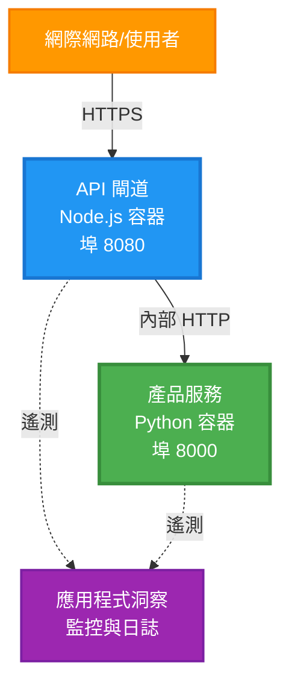
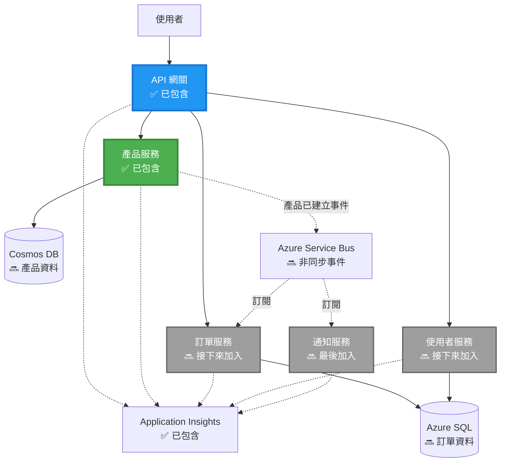
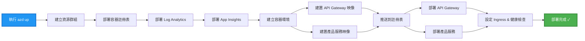
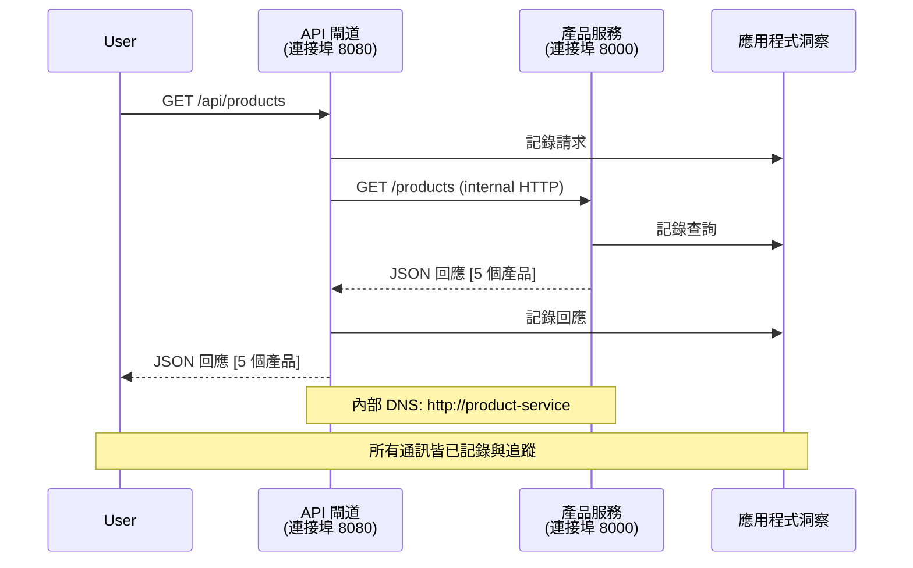

# 微服務架構 - Container App 範例

⏱️ **預估時間**: 25-35 分鐘 | 💰 **預估費用**: ~$50-100/月 | ⭐ **複雜度**: 進階

**📚 學習路徑:**
- ← 上一個: [簡單的 Flask API](../../../../examples/container-app/simple-flask-api) - 單一容器基礎
- 🎯 **你在這裡**: 微服務架構（2 服務基礎）
- → 下一個: [AI 整合](../../../../docs/ai-foundry) - 為你的服務加入智慧
- 🏠 [課程首頁](../../README.md)

---

一個 **簡化但可運作** 的微服務架構，使用 AZD CLI 部署到 Azure Container Apps。此範例示範服務間通訊、容器編排與監控，採用實務性的 2 服務設定。

> **📚 學習方式**：此範例從最小的 2 服務架構（API Gateway + 後端服務）開始，你可以實際部署並學習。掌握此基礎後，我們會提供擴展至完整微服務生態系的指引。

## 你將學到的內容

完成此範例後，你將會：
- 將多個容器部署到 Azure Container Apps
- 實作具有內部網路的服務間通訊
- 設定依環境的擴展與健康檢查
- 使用 Application Insights 監控分散式應用
- 了解微服務部署模式與最佳實務
- 學習從簡單到複雜架構的漸進擴展

## 架構

### 階段 1：我們要建立的內容（包含於此範例）


**元件詳細資訊：**

| 元件 | 目的 | 存取 | 資源 |
|-----------|---------|--------|-----------|
| **API Gateway** | 將外部請求路由到後端服務 | 公開（HTTPS） | 1 vCPU, 2GB RAM, 2-20 個副本 |
| **Product Service** | 以記憶體管理產品目錄 | 僅內部 | 0.5 vCPU, 1GB RAM, 1-10 個副本 |
| **Application Insights** | 集中式日誌與分散式追蹤 | Azure 入口網站 | 每月 1-2 GB 資料攝取 |

**為什麼從簡單開始？**
- ✅ 快速部署與理解（25-35 分鐘）
- ✅ 在不增加複雜度下學習核心微服務模式
- ✅ 可修改與實驗的可運作程式碼
- ✅ 學習成本較低（約 $50-100/月，而非 $300-1400/月）
- ✅ 在加入資料庫和佇列前建立信心

**類比**：把這想像成學開車。你先從空的停車場（2 個服務）開始，掌握基礎，然後再進階到市區交通（5+ 個服務含資料庫）。

### 階段 2：未來擴展（參考架構）

一旦你掌握了 2 服務架構，就可以擴展至：


請參閱文件末尾的「擴展指南」章節取得逐步指示。

## 包含的功能

✅ **服務發現**：容器間自動基於 DNS 的發現  
✅ **負載平衡**：跨副本的內建負載平衡  
✅ **自動擴展**：基於 HTTP 請求，每個服務可獨立擴展  
✅ **健康監控**：兩個服務的 liveness 與 readiness 探針  
✅ **分散式日誌**：使用 Application Insights 的集中式日誌  
✅ **內部網路**：安全的服務對服務通訊  
✅ **容器編排**：自動部署與擴展  
✅ **零停機更新**：支援修訂管理的滾動更新  

## 前置需求

### 需要的工具

在開始前，請確認你已安裝下列工具：

1. **[Azure Developer CLI (azd)](https://learn.microsoft.com/azure/developer/azure-developer-cli/install-azd)**（版本 1.0.0 或更高）
   ```bash
   azd version
   # 預期輸出：azd 版本 1.0.0 或更高
   ```

2. **[Azure CLI](https://learn.microsoft.com/cli/azure/install-azure-cli)**（版本 2.50.0 或更高）
   ```bash
   az --version
   # 預期輸出：azure-cli 2.50.0 或更高版本
   ```

3. **[Docker](https://www.docker.com/get-started)**（用於本地開發/測試 - 選用）
   ```bash
   docker --version
   # 預期輸出：Docker 版本 20.10 或更高版本
   ```

### 驗證你的環境

執行這些命令以確認你已準備好：

```bash
# 檢查 Azure Developer CLI
azd version
# ✅ 預期：azd 版本 1.0.0 或更高

# 檢查 Azure CLI
az --version
# ✅ 預期：azure-cli 2.50.0 或更高

# 檢查 Docker（可選）
docker --version
# ✅ 預期：Docker 版本 20.10 或更高
```

**成功標準**：所有命令回傳的版本號須符合或高於最低需求。

### Azure 要求

- 一個有效的 **Azure 訂閱**（[建立免費帳戶](https://azure.microsoft.com/free/)）
- 在你的訂閱中建立資源的權限
- 在訂閱或資源群組上具有 **Contributor** 角色

### 知識前提

這是一個 **進階級** 的範例。你應該具備：
- 已完成 [Simple Flask API 範例](../../../../examples/container-app/simple-flask-api) 
- 對微服務架構有基本理解
- 熟悉 REST API 與 HTTP
- 了解容器概念

**對 Container Apps 不熟嗎？** 請先從 [Simple Flask API 範例](../../../../examples/container-app/simple-flask-api) 開始，學習基礎。

## 快速開始（逐步）

### 步驟 1：複製與進入資料夾

```bash
git clone https://github.com/microsoft/AZD-for-beginners.git
cd AZD-for-beginners/examples/microservices
```

**✓ 成功檢查**：確認你看到 `azure.yaml`：
```bash
ls
# 預期：README.md、azure.yaml、infra/、src/
```

### 步驟 2：使用 Azure 驗證

```bash
azd auth login
```

這會開啟瀏覽器進行 Azure 驗證。使用你的 Azure 帳戶登入。

**✓ 成功檢查**：你應該會看到：
```
Logged in to Azure.
```

### 步驟 3：初始化環境

```bash
azd init
```

**你會看到的提示**：
- **Environment name**: 輸入一個短名稱（例如 `microservices-dev`）
- **Azure subscription**: 選擇你的訂閱
- **Azure location**: 選擇區域（例如 `eastus`, `westeurope`）

**✓ 成功檢查**：你應該會看到：
```
SUCCESS: New project initialized!
```

### 步驟 4：部署基礎架構與服務

```bash
azd up
```

**發生什麼事**（約需 8-12 分鐘）：


**✓ 成功檢查**：你應該會看到：
```
SUCCESS: Your application was deployed to Azure in X minutes Y seconds.
Endpoint: https://api-gateway-<unique-id>.azurecontainerapps.io
```

**⏱️ 時間**：8-12 分鐘

### 步驟 5：測試部署

```bash
# 取得網關端點
GATEWAY_URL=$(azd env get-values | grep API_GATEWAY_URL | cut -d '=' -f2 | tr -d '"')

# 測試 API 網關的健康狀態
curl $GATEWAY_URL/health
```

**✅ 預期輸出：**
```json
{
  "status": "healthy",
  "service": "api-gateway",
  "timestamp": "2025-11-19T10:30:00Z"
}
```

**透過閘道測試產品服務**：
```bash
# 列出產品
curl $GATEWAY_URL/api/products
```

**✅ 預期輸出：**
```json
[
  {"id":1,"name":"Laptop","price":999.99,"stock":50},
  {"id":2,"name":"Mouse","price":29.99,"stock":200},
  {"id":3,"name":"Keyboard","price":79.99,"stock":150}
]
```

**✓ 成功檢查**：兩個端點都會回傳 JSON 資料且無錯誤。

---

**🎉 恭喜！** 你已將微服務架構部署到 Azure！

## 專案結構

所有實作檔案皆已包含 — 這是一個完整、可運作的範例：

```
microservices/
│
├── README.md                         # This file
├── azure.yaml                        # AZD configuration
├── .gitignore                        # Git ignore patterns
│
├── infra/                           # Infrastructure as Code (Bicep)
│   ├── main.bicep                   # Main orchestration
│   ├── abbreviations.json           # Naming conventions
│   ├── core/                        # Shared infrastructure
│   │   ├── container-apps-environment.bicep  # Container environment + registry
│   │   └── monitor.bicep            # Application Insights + Log Analytics
│   └── app/                         # Service definitions
│       ├── api-gateway.bicep        # API Gateway container app
│       └── product-service.bicep    # Product Service container app
│
└── src/                             # Application source code
    ├── api-gateway/                 # Node.js API Gateway
    │   ├── app.js                   # Express server with routing
    │   ├── package.json             # Node dependencies
    │   └── Dockerfile               # Container definition
    └── product-service/             # Python Product Service
        ├── main.py                  # Flask API with product data
        ├── requirements.txt         # Python dependencies
        └── Dockerfile               # Container definition
```

**各元件功能說明：**

**基礎架構 (infra/)**:
- `main.bicep`: 協調所有 Azure 資源及其相依性
- `core/container-apps-environment.bicep`: 建立 Container Apps 環境與 Azure Container Registry
- `core/monitor.bicep`: 設定 Application Insights 以進行分散式日誌
- `app/*.bicep`: 各個 container app 定義，含擴展與健康檢查

**API Gateway (src/api-gateway/)**:
- 對外的服務，將請求路由到後端服務
- 實作日誌、錯誤處理與請求轉發
- 示範服務對服務的 HTTP 通訊

**Product Service (src/product-service/)**:
- 內部服務，管理產品目錄（為簡化採用記憶體儲存）
- 提供 REST API 與健康檢查
- 後端微服務模式示例

## 服務總覽

### API Gateway（Node.js/Express）

**埠**: 8080  
**存取**: 公開（外部入口）  
**目的**: 將傳入請求路由到適當的後端服務  

**端點**:
- `GET /` - 服務資訊
- `GET /health` - 健康檢查端點
- `GET /api/products` - 轉發到 product service（列出所有）
- `GET /api/products/:id` - 轉發到 product service（依 ID 取得）

**主要功能**:
- 使用 axios 的請求路由
- 集中式日誌
- 錯誤處理與逾時管理
- 透過環境變數做服務發現
- 與 Application Insights 整合

**程式碼精華**（`src/api-gateway/app.js`）：
```javascript
// 內部服務通訊
app.get('/api/products', async (req, res) => {
  const response = await axios.get(`${PRODUCT_SERVICE_URL}/products`, {
    timeout: 5000
  });
  res.json(response.data);
});
```

### Product Service（Python/Flask）

**埠**: 8000  
**存取**: 僅內部（無外部入口）  
**目的**: 使用記憶體管理產品目錄  

**端點**:
- `GET /` - 服務資訊
- `GET /health` - 健康檢查端點
- `GET /products` - 列出所有產品
- `GET /products/<id>` - 依 ID 取得產品

**主要功能**:
- 使用 Flask 的 RESTful API
- 記憶體中的產品儲存（簡單，無需資料庫）
- 使用探針進行健康監控
- 結構化日誌
- 與 Application Insights 整合

**資料模型**:
```python
{
  "id": 1,
  "name": "Laptop",
  "description": "High-performance laptop",
  "price": 999.99,
  "stock": 50
}
```

**為什麼僅限內部？**
Product Service 不對外公開。所有請求必須經由 API Gateway，API Gateway 提供：
- 安全性：受控的存取點
- 彈性：可以在不影響客戶端的情況下變更後端
- 監控：集中式請求紀錄

## 了解服務間通訊

### 服務如何互相溝通


在此範例中，API Gateway 使用 **內部 HTTP 呼叫** 與 Product Service 溝通：

```javascript
// API 閘道 (src/api-gateway/app.js)
const PRODUCT_SERVICE_URL = process.env.PRODUCT_SERVICE_URL;

// 發送內部 HTTP 請求
const response = await axios.get(`${PRODUCT_SERVICE_URL}/products`);
```

**要點**：

1. **基於 DNS 的發現**：Container Apps 會自動為內部服務提供 DNS
   - Product Service 的 FQDN： `product-service.internal.<environment>.azurecontainerapps.io`
   - 簡化為： `http://product-service`（Container Apps 會解析它）

2. **不對外公開**：Product Service 在 Bicep 中設定 `external: false`
   - 僅能在 Container Apps 環境內存取
   - 無法從網際網路直接連到該服務

3. **環境變數**：服務 URL 在部署時注入
   - Bicep 將內部 FQDN 傳給 gateway
   - 應用程式程式碼中沒有硬編碼的 URL

**類比**：把它想像成辦公室房間。API Gateway 就像接待處（對外），Product Service 則是辦公室（內部）。訪客必須先經由接待處才能進入辦公室。

## 部署選項

### 完整部署（建議）

```bash
# 部署基礎設施與兩個服務
azd up
```

此部署會建立：
1. Container Apps 環境
2. Application Insights
3. Container Registry
4. API Gateway 容器
5. Product Service 容器

**時間**：8-12 分鐘

### 部署單一服務

```bash
# 只部署一個服務（在初始執行 azd up 之後）
azd deploy api-gateway

# 或部署 product 服務
azd deploy product-service
```

**使用情境**：當你更新了某個服務的程式碼，只想重新部署該服務時。

### 更新設定

```bash
# 變更縮放參數
azd env set GATEWAY_MAX_REPLICAS 30

# 使用新設定重新部署
azd up
```

## 設定

### 自動擴展設定

兩個服務在其 Bicep 檔案中皆設定為基於 HTTP 的自動擴展：

**API Gateway**:
- 最小副本數：2（為了可用性，至少維持 2）
- 最大副本數：20
- 擴展觸發條件：每個副本 50 個併發請求

**Product Service**:
- 最小副本數：1（如有需要可擴展到 0）
- 最大副本數：10
- 擴展觸發條件：每個副本 100 個併發請求

**自訂擴展**（在 `infra/app/*.bicep`）：
```bicep
scale: {
  minReplicas: 1
  maxReplicas: 10
  rules: [
    {
      name: 'http-scale-rule'
      http: {
        metadata: {
          concurrentRequests: '100'  // Adjust this
        }
      }
    }
  ]
}
```

### 資源配置

**API Gateway**:
- CPU：1.0 vCPU
- 記憶體：2 GiB
- 原因：處理所有外部流量

**Product Service**:
- CPU：0.5 vCPU
- 記憶體：1 GiB
- 原因：輕量的記憶體內操作

### 健康檢查

兩個服務都包含 liveness 與 readiness 探針：

```bicep
probes: [
  {
    type: 'Liveness'
    httpGet: {
      path: '/health'
      port: 8080
    }
    initialDelaySeconds: 10
    periodSeconds: 30
  }
  {
    type: 'Readiness'
    httpGet: {
      path: '/health'
      port: 8080
    }
    initialDelaySeconds: 5
    periodSeconds: 10
  }
]
```

**這代表什麼**：
- **Liveness**：若健康檢查失敗，Container Apps 會重新啟動容器
- **Readiness**：若尚未就緒，Container Apps 將不會將流量路由到該副本

## 監控與可觀察性

### 檢視服務日誌

```bash
# 使用 azd monitor 檢視日誌
azd monitor --logs

# 或使用 Azure CLI 針對特定的 Container Apps:
# 從 API Gateway 串流日誌
az containerapp logs show --name api-gateway --resource-group $RG_NAME --follow

# 檢視近期產品服務的日誌
az containerapp logs show --name product-service --resource-group $RG_NAME --tail 100
```

**預期輸出**：
```
[api-gateway] API Gateway listening on port 8080
[api-gateway] Product Service URL: http://product-service
[api-gateway] GET /api/products 200 - 45ms
[product-service] Retrieved 5 products
```

### Application Insights 查詢

在 Azure 入口網站中開啟 Application Insights，然後執行下列查詢：

**找出慢速請求**：
```kusto
requests
| where timestamp > ago(1h)
| where duration > 1000  // Requests taking >1 second
| summarize count() by name, cloud_RoleName
| order by count_ desc
```

**追蹤服務對服務呼叫**：
```kusto
dependencies
| where timestamp > ago(1h)
| where type == "Http"
| project timestamp, name, target, duration, success
| order by timestamp desc
```

**依服務的錯誤率**：
```kusto
exceptions
| where timestamp > ago(24h)
| summarize errorCount = count() by cloud_RoleName, type
| order by errorCount desc
```

**請求量隨時間變化**：
```kusto
requests
| where timestamp > ago(1h)
| summarize requestCount = count() by bin(timestamp, 5m), cloud_RoleName
| render timechart
```

### 存取監控儀表板

```bash
# 取得 Application Insights 的詳細資訊
azd env get-values | grep APPLICATIONINSIGHTS

# 開啟 Azure 入口網站的監控
az monitor app-insights component show \
  --app $(azd env get-values | grep APPLICATIONINSIGHTS_CONNECTION_STRING | cut -d '=' -f2) \
  --resource-group $(azd env get-values | grep AZURE_RESOURCE_GROUP | cut -d '=' -f2) \
  --query "appId" -o tsv
```

### 即時指標

1. 前往 Azure 入口網站中的 Application Insights
2. 點選「Live Metrics」
3. 查看即時的請求、失敗與效能
4. 測試方式：執行： `curl $(azd env get-values | grep API_GATEWAY_URL | cut -d '=' -f2 | tr -d '"')/api/products`

## 實作練習

### 練習 1：新增產品端點 ⭐（簡單）

**目標**：新增一個 POST 端點以建立新產品

**起始點**：`src/product-service/main.py`

**步驟**：

1. 在 `main.py` 的 `get_product` 函式之後新增此端點：

```python
@app.route('/products', methods=['POST'])
def create_product():
    """Create a new product"""
    data = request.get_json()
    
    # 驗證必填欄位
    if not data or 'name' not in data or 'price' not in data:
        return jsonify({'error': 'Missing required fields: name, price'}), 400
    
    new_id = max(p['id'] for p in products) + 1
    new_product = {
        'id': new_id,
        'name': data['name'],
        'description': data.get('description', ''),
        'price': float(data['price']),
        'stock': int(data.get('stock', 0))
    }
    products.append(new_product)
    logger.info(f"Created product {new_id}")
    return jsonify(new_product), 201
```

2. 在 API Gateway (`src/api-gateway/app.js`) 中新增 POST 路由：

```javascript
// 將此加入到 GET /api/products 路由之後
app.post('/api/products', async (req, res) => {
  try {
    console.log(`Forwarding POST request to ${PRODUCT_SERVICE_URL}/products`);
    const response = await axios.post(`${PRODUCT_SERVICE_URL}/products`, req.body, {
      timeout: 5000
    });
    res.status(201).json(response.data);
  } catch (error) {
    console.error('Error calling product service:', error.message);
    res.status(503).json({
      error: 'Product service unavailable',
      message: error.message
    });
  }
});
```

3. 重新部署兩個服務：

```bash
azd deploy product-service
azd deploy api-gateway
```

4. 測試新的端點：

```bash
GATEWAY_URL=$(azd env get-values | grep API_GATEWAY_URL | cut -d '=' -f2 | tr -d '"')

# 建立新產品
curl -X POST $GATEWAY_URL/api/products \
  -H "Content-Type: application/json" \
  -d '{"name":"USB Cable","price":9.99,"stock":500}'
```

**✅ 預期輸出：**
```json
{"id":6,"name":"USB Cable","description":"","price":9.99,"stock":500}
```

5. 驗證它出現在清單中：

```bash
curl $GATEWAY_URL/api/products
# 現在應該會顯示 6 件商品，包括新的 USB 連接線
```

**成功準則**：
- ✅ POST 請求回傳 HTTP 201
- ✅ 新產品出現在 GET /api/products 清單中
- ✅ 產品具有自動遞增的 ID

**時間**：10-15 分鐘

---

### 練習 2：修改自動調整規則 ⭐⭐（中等）

**目標**：將產品服務設定為更積極擴展

**起始點**： `infra/app/product-service.bicep`

**步驟**：

1. 打開 `infra/app/product-service.bicep` 並找到 `scale` 區塊（大約在第 95 行）

2. 從：
```bicep
scale: {
  minReplicas: 1
  maxReplicas: 10
  rules: [
    {
      name: 'http-scale-rule'
      http: {
        metadata: {
          concurrentRequests: '100'  // OLD
        }
      }
    }
  ]
}
```

改為：
```bicep
scale: {
  minReplicas: 2  // Always have 2 running
  maxReplicas: 20  // Allow more scaling
  rules: [
    {
      name: 'http-scale-rule'
      http: {
        metadata: {
          concurrentRequests: '20'  // Scale at lower threshold
        }
      }
    }
  ]
}
```

3. 重新部署基礎設施：

```bash
azd up
```

4. 驗證新的擴展設定：

```bash
az containerapp show \
  --name $(azd env get-values | grep PRODUCT_SERVICE | head -1 | cut -d '/' -f5) \
  --resource-group $(azd env get-values | grep AZURE_RESOURCE_GROUP | cut -d '=' -f2 | tr -d '"') \
  --query "properties.template.scale" -o json
```

**✅ 預期輸出：**
```json
{
  "minReplicas": 2,
  "maxReplicas": 20,
  "rules": [...]
}
```

5. 使用負載測試自動擴展：

```bash
# 產生併發請求
for i in {1..500}; do curl $GATEWAY_URL/api/products & done

# 使用 Azure CLI 觀察縮放情況
az containerapp logs show --name product-service --resource-group $RG_NAME --follow
# 尋找：Container Apps 的縮放事件
```

**成功準則**：
- ✅ 產品服務至少維持 2 個副本
- ✅ 在負載下，會擴展到超過 2 個副本
- ✅ Azure 入口網站顯示新的擴展規則

**時間**：15-20 分鐘

---

### 練習 3：新增自訂監控查詢 ⭐⭐（中等）

**目標**：建立自訂 Application Insights 查詢，以追蹤產品 API 的效能

**步驟**：

1. 在 Azure 入口網站中前往 Application Insights：
   - 前往 Azure 入口網站
   - 找到你的資源群組 (rg-microservices-*)
   - 點選 Application Insights 資源

2. 在左側選單中點選「Logs」

3. 建立此查詢：

```kusto
requests
| where timestamp > ago(1h)
| where name contains "products"
| summarize 
    RequestCount = count(),
    AvgDuration = avg(duration),
    P95Duration = percentile(duration, 95),
    SuccessRate = 100.0 * countif(success == true) / count()
  by bin(timestamp, 5m)
| render timechart
```

4. 點選「Run」以執行查詢

5. 儲存查詢：
   - 點選「Save」
   - 名稱： "Product API Performance"
   - 分類： "Performance"

6. 產生測試流量：

```bash
for i in {1..100}; do curl $GATEWAY_URL/api/products; sleep 1; done
```

7. 重新整理查詢以查看資料

**✅ 預期輸出：**
- 圖表顯示隨時間的請求數量
- 平均時間 < 500ms
- 成功率 = 100%
- 時間區間為 5 分鐘

**成功準則**：
- ✅ 查詢顯示 100+ 次請求
- ✅ 成功率為 100%
- ✅ 平均時間 < 500ms
- ✅ 圖表顯示 5 分鐘時間區間

**學習成果**：了解如何使用自訂查詢監控服務效能

**時間**：10-15 分鐘

---

### 練習 4：實作重試邏輯 ⭐⭐⭐（進階）

**目標**：在 Product Service 暫時不可用時，為 API Gateway 新增重試邏輯

**起始點**： `src/api-gateway/app.js`

**步驟**：

1. 安裝重試函式庫：

```bash
cd src/api-gateway
npm install axios-retry --save
cd ../..
```

2. 更新 `src/api-gateway/app.js`（在 axios 匯入後新增）：

```javascript
const axiosRetry = require('axios-retry');

// 設定重試邏輯
axiosRetry(axios, {
  retries: 3,
  retryDelay: (retryCount) => {
    return retryCount * 1000; // 1 秒、2 秒、3 秒
  },
  retryCondition: (error) => {
    // 在網路錯誤或 5xx 回應時重試
    return axiosRetry.isNetworkOrIdempotentRequestError(error) ||
           (error.response && error.response.status >= 500);
  }
});

console.log('Retry logic configured: 3 retries with exponential backoff');
```

3. 重新部署 API Gateway：

```bash
azd deploy api-gateway
```

4. 模擬服務故障以測試重試行為：

```bash
# 將產品服務縮減至 0（模擬故障）
az containerapp update \
  --name $(azd env get-values | grep PRODUCT_SERVICE | head -1 | cut -d '/' -f5) \
  --resource-group $(azd env get-values | grep AZURE_RESOURCE_GROUP | cut -d '=' -f2 | tr -d '"') \
  --min-replicas 0 \
  --max-replicas 0

# 嘗試存取產品（會重試 3 次）
time curl -v $GATEWAY_URL/api/products
# 觀察：回應約需 6 秒（1 秒 + 2 秒 + 3 秒重試）

# 恢復產品服務
az containerapp update \
  --name $(azd env get-values | grep PRODUCT_SERVICE | head -1 | cut -d '/' -f5) \
  --resource-group $(azd env get-values | grep AZURE_RESOURCE_GROUP | cut -d '=' -f2 | tr -d '"') \
  --min-replicas 1 \
  --max-replicas 10
```

5. 檢視重試日誌：

```bash
az containerapp logs show --name api-gateway --resource-group $RG_NAME --tail 50
# 尋找：重試嘗試的訊息
```

**✅ 預期行為：**
- 請求在失敗前重試 3 次
- 每次重試等待時間逐漸增加（1s、2s、3s）
- 服務重啟後請求能成功
- 日誌顯示重試嘗試

**成功準則**：
- ✅ 請求在失敗前重試 3 次
- ✅ 每次重試等待時間增加（指數回退）
- ✅ 服務重啟後請求成功
- ✅ 日誌顯示重試嘗試

**學習成果**：了解微服務中的韌性模式（熔斷器、重試、逾時）

**時間**：20-25 分鐘

---

## 知識檢核點

完成此範例後，驗證你的理解：

### 1. 服務通訊 ✓

測試你的知識：
- [ ] 你能說明 API Gateway 如何發現 Product Service 嗎？（基於 DNS 的服務發現）
- [ ] 如果 Product Service 宕機會發生什麼事？（Gateway 回傳 503 錯誤）
- [ ] 你會如何新增第三個服務？（建立新的 Bicep 檔案，加入 main.bicep，建立 src 資料夾）

**實作驗證：**
```bash
# 模擬服務故障
az containerapp update --name <product-service-name> --min-replicas 0 --max-replicas 0
curl $GATEWAY_URL/api/products
# ✅ 預期：503 服務不可用

# 恢復服務
az containerapp update --name <product-service-name> --min-replicas 1 --max-replicas 10
```

### 2. 監控與可觀察性 ✓

測試你的知識：
- [ ] 在哪裡可以看到分散式日誌？（Azure 入口網站的 Application Insights）
- [ ] 如何追蹤慢速請求？（Kusto 查詢：`requests | where duration > 1000`）
- [ ] 你能識別是哪個服務造成錯誤嗎？（檢查日誌中的 `cloud_RoleName` 欄位）

**實作驗證：**
```bash
# 產生慢速請求模擬
curl "$GATEWAY_URL/api/products?delay=2000"

# 查詢 Application Insights 中的慢速請求
# 前往 Azure 入口網站 → Application Insights → 日誌
# 執行: requests | where duration > 1000 | project timestamp, name, duration, cloud_RoleName
```

### 3. 擴展與效能 ✓

測試你的知識：
- [ ] 什麼會觸發自動擴展？（HTTP 同時請求規則：gateway 為 50，product 為 100）
- [ ] 目前運行多少個副本？（使用 `az containerapp revision list` 檢查）
- [ ] 你會如何將 Product Service 擴展到 5 個副本？（更新 Bicep 中的 minReplicas）

**實作驗證：**
```bash
# 產生負載以測試自動調整
for i in {1..1000}; do curl $GATEWAY_URL/api/products & done

# 使用 Azure CLI 觀察副本數量增加
az containerapp logs show --name api-gateway --resource-group $RG_NAME --follow
# ✅ 預期：在日誌中看到縮放事件
```

**成功準則**：你能回答所有問題並以實作命令驗證。

---

## 成本分析

### 預估每月成本（此 2 服務範例）

| 資源 | 設定 | 預估成本 |
|----------|--------------|----------------|
| API Gateway | 2-20 個副本, 1 vCPU, 2GB RAM | $30-150 |
| Product Service | 1-10 個副本, 0.5 vCPU, 1GB RAM | $15-75 |
| Container Registry | Basic 等級 | $5 |
| Application Insights | 1-2 GB/月 | $5-10 |
| Log Analytics | 1 GB/月 | $3 |
| **總計** | | **$58-243/月** |

### 依使用量的成本細分

**輕量流量**（測試/學習）：約 $60/月
- API Gateway：2 個副本 × 24/7 = $30
- Product Service：1 個副本 × 24/7 = $15
- 監控 + Registry = $13

**中度流量**（小型生產）：約 $120/月
- API Gateway：平均 5 個副本 = $75
- Product Service：平均 3 個副本 = $45
- 監控 + Registry = $13

**高流量**（繁忙時段）：約 $240/月
- API Gateway：平均 15 個副本 = $225
- Product Service：平均 8 個副本 = $120
- 監控 + Registry = $13

### 成本最佳化建議

1. **開發環境設為 Scale to Zero（縮減為零）**：
   ```bicep
   scale: {
     minReplicas: 0  // Save $30-40/month when not in use
     maxReplicas: 10
   }
   ```

2. **對於 Cosmos DB 使用 Consumption Plan**（當你加入時）：
   - 只為你使用的部分付費
   - 無最低費用

3. **設定 Application Insights 取樣**：
   ```javascript
   appInsights.defaultClient.config.samplingPercentage = 50; // 對 50% 的請求進行抽樣
   ```

4. **不使用時請清除資源**：
   ```bash
   azd down --force --purge
   ```

### 免費方案選項

對於學習/測試，建議：
- ✅ 使用 Azure 免費額度（新帳號前 30 天 $200）
- ✅ 保持最低副本數（可節省約 50% 成本）
- ✅ 測試後刪除（無持續費用）
- ✅ 在學習期間之間將規模縮減為零

**範例**：每天運行此範例 2 小時 × 30 天 = 約 $5/月，而不是 $60/月

---

## 疑難排解快速參考

### 問題：`azd up` 失敗並顯示「Subscription not found」

**解決方法**：
```bash
# 再次登入並明確指定訂閱
az account set --subscription <your-subscription-id>
azd env set AZURE_SUBSCRIPTION_ID <your-subscription-id>
azd up
```

### 問題：API Gateway 回傳 503「Product service unavailable」

**診斷**：
```bash
# 使用 Azure CLI 檢查產品服務日誌
az containerapp logs show --name product-service --resource-group $RG_NAME --tail 50

# 檢查產品服務健康狀態
az containerapp show \
  --name $(azd env get-values | grep PRODUCT_SERVICE | head -1 | cut -d '/' -f5) \
  --resource-group $(azd env get-values | grep AZURE_RESOURCE_GROUP | cut -d '=' -f2 | tr -d '"') \
  --query "properties.runningStatus"
```

**常見原因**：
1. Product service 未啟動（檢查日誌是否有 Python 錯誤）
2. 健康檢查失敗（確認 `/health` 端點是否可用）
3. Container 映像建立失敗（檢查 Registry 是否有映像）

### 問題：自動擴展無法運作

**診斷**：
```bash
# 檢查目前的副本數量
az containerapp revision list \
  --name $(azd env get-values | grep API_GATEWAY | head -1 | cut -d '/' -f5) \
  --resource-group $(azd env get-values | grep AZURE_RESOURCE_GROUP | cut -d '=' -f2 | tr -d '"') \
  --query "[].properties.replicas"

# 產生負載以進行測試
for i in {1..1000}; do curl $GATEWAY_URL/api/products & done

# 使用 Azure CLI 監看縮放事件
az containerapp logs show --name api-gateway --resource-group $RG_NAME --follow | grep -i scale
```

**常見原因**：
1. 負載不足以觸發擴展規則（需要 >50 同時請求）
2. 已達最大副本數（檢查 Bicep 設定）
3. Bicep 中的擴展規則設定錯誤（確認 concurrentRequests 值）

### 問題：Application Insights 未顯示日誌

**診斷**：
```bash
# 確認已設定連線字串
azd env get-values | grep APPLICATIONINSIGHTS

# 檢查服務是否正在傳送遙測資料
az monitor app-insights component show \
  --app $(azd env get-values | grep APPLICATIONINSIGHTS_NAME | cut -d '=' -f2 | tr -d '"') \
  --resource-group $(azd env get-values | grep AZURE_RESOURCE_GROUP | cut -d '=' -f2 | tr -d '"') \
  --query "properties.InstrumentationKey"
```

**常見原因**：
1. 連線字串未傳入容器（檢查環境變數）
2. Application Insights SDK 未設定（檢查程式碼中的匯入）
3. 防火牆阻擋遙測（少見，檢查網路規則）

### 問題：Docker 在本機建置失敗

**診斷**：
```bash
# 測試 API Gateway 的建置
cd src/api-gateway
docker build -t test-gateway .

# 測試產品服務的建置
cd ../product-service
docker build -t test-product .
```

**常見原因**：
1. package.json/requirements.txt 中缺少相依套件
2. Dockerfile 語法錯誤
3. 下載相依套件時的網路問題

**還卡住嗎？** 請參考 [常見問題指南](../../docs/chapter-07-troubleshooting/common-issues.md) 或 [Azure Container Apps 疑難排解](https://learn.microsoft.com/azure/container-apps/troubleshooting)

---

## 清理

為避免持續產生費用，請刪除所有資源：

```bash
azd down --force --purge
```

**確認提示**：
```
? Total resources to delete: 6, are you sure you want to continue? (y/N)
```

輸入 `y` 以確認。

**將被刪除的項目**：
- Container Apps 環境
- 兩個 Container Apps（gateway 與 product service）
- Container Registry
- Application Insights
- Log Analytics 工作區
- 資源群組

**✓ 驗證清理**：
```bash
az group list --query "[?starts_with(name,'rg-microservices')]" --output table
```

應該會回傳空結果。

---

## 擴充指南：從 2 個服務到 5 個以上

當你掌握這個 2 服務架構後，以下是擴充的方法：

### 階段 1：新增資料庫持久性（下一步）

**為 Product Service 新增 Cosmos DB**：

1. 建立 `infra/core/cosmos.bicep`：
   ```bicep
   resource cosmosAccount 'Microsoft.DocumentDB/databaseAccounts@2023-04-15' = {
     name: name
     location: location
     kind: 'GlobalDocumentDB'
     properties: {
       databaseAccountOfferType: 'Standard'
       consistencyPolicy: { defaultConsistencyLevel: 'Session' }
       locations: [{ locationName: location, failoverPriority: 0 }]
     }
   }
   ```

2. 更新 product service，改用 Azure Cosmos DB Python SDK 取代記憶體資料

3. 預估額外成本：約 $25/月（serverless）

### 階段 2：新增第三個服務（訂單管理）

**建立 Order Service**：

1. 新資料夾：`src/order-service/`（Python/Node.js/C#）
2. 新的 Bicep：`infra/app/order-service.bicep`
3. 更新 API Gateway 以路由 `/api/orders`
4. 新增 Azure SQL Database 作為訂單持久化

**架構變為**：
```
API Gateway → Product Service (Cosmos DB)
           → Order Service (Azure SQL)
```

### 階段 3：新增非同步通訊（Service Bus）

**實作事件驅動架構**：

1. 新增 Azure Service Bus：`infra/core/servicebus.bicep`
2. Product Service 發佈「ProductCreated」事件
3. Order Service 訂閱產品事件
4. 新增 Notification Service 以處理事件

**模式**：Request/Response（HTTP） + 事件驅動（Service Bus）

### 階段 4：加入使用者認證

**實作使用者服務**：

1. 建立 `src/user-service/`（Go/Node.js）
2. 新增 Azure AD B2C 或自訂 JWT 認證
3. API Gateway 在路由前驗證 token
4. 各服務檢查使用者權限

### 階段 5：上線準備

**加入這些元件**：
- ✅ Azure Front Door（全域負載平衡）
- ✅ Azure Key Vault（機密管理）
- ✅ Azure Monitor Workbooks（自訂儀表板）
- ✅ CI/CD 管線（GitHub Actions）
- ✅ 藍綠部署
- ✅ 為所有服務使用 Managed Identity

**完整生產環境架構成本**：約 $300-1,400/月

---

## 延伸閱讀

### 相關文件
- [Azure Container Apps 文件](https://learn.microsoft.com/azure/container-apps/)
- [微服務架構指南](https://learn.microsoft.com/azure/architecture/guide/architecture-styles/microservices)
- [Application Insights 分散式追蹤](https://learn.microsoft.com/azure/azure-monitor/app/distributed-tracing)
- [Azure Developer CLI 文件](https://learn.microsoft.com/azure/developer/azure-developer-cli/)

### 本課程的下一步
- ← 上一節： [Simple Flask API](../../../../examples/container-app/simple-flask-api) - 初階單容器範例
- → 下一節：[AI 整合指南](../../../../docs/ai-foundry) - 新增 AI 功能
- 🏠 [課程首頁](../../README.md)

### 比較：何時使用何種方案

| 功能 | 單一容器 | 微服務（本範例） | Kubernetes (AKS) |
|---------|-----------------|---------------------|------------------|
| **使用情境** | 簡單應用 | 複雜應用 | 企業級應用 |
| **可擴展性** | 單一服務 | 每個服務可獨立擴展 | 最大彈性 |
| **複雜度** | 低 | 中 | 高 |
| **團隊規模** | 1-3 位開發者 | 3-10 位開發者 | 10+ 位開發者 |
| **成本** | 約 $15-50/月 | 約 $60-250/月 | 約 $150-500/月 |
| **部署時間** | 5-10 分鐘 | 8-12 分鐘 | 15-30 分鐘 |
| **最適用於** | MVP、原型 | 生產環境應用程式 | 多雲、進階網路 |

**建議**：從 Container Apps（此範例）開始，只有在需要 Kubernetes 特定功能時再移轉至 AKS。

---

## 常見問題

**問：為什麼只有 2 個服務，而不是 5 個以上？**  
答：為了教學進程。先用簡單範例掌握基本概念（服務通訊、監控、擴充），再增加複雜度。在這裡學到的模式同樣適用於 100 個服務的架構。

**問：我可以自己新增更多服務嗎？**  
答：當然可以！遵循上方的擴充指南。每個新服務遵循相同模式：建立 src 資料夾、建立 Bicep 檔案、更新 azure.yaml，然後部署。

**問：這可以直接用於生產環境嗎？**  
答：這是紮實的基礎。若要投入生產，請加入：Managed Identity、Key Vault、持久化資料庫、CI/CD 管線、監控警示，以及備份策略。

**問：為什麼不使用 Dapr 或其他 service mesh？**  
答：為了學習保持簡單。一旦你了解原生 Container Apps 的網路，就可以在進階情境中加入 Dapr（狀態管理、pub/sub、bindings）。

**問：如何在本機除錯？**  
答：使用 Docker 在本機執行服務：  
```bash
cd src/api-gateway
docker build -t local-gateway .
docker run -p 8080:8080 -e PRODUCT_SERVICE_URL=http://localhost:8000 local-gateway
```

**問：我可以使用不同的程式語言嗎？**  
答：可以！此範例示範 Node.js（gateway）+ Python（product service）。你可以混用任何能在容器中執行的語言：C#、Go、Java、Ruby、PHP 等等。

**問：如果我沒有 Azure 點數怎麼辦？**  
答：使用 Azure 免費方案（新帳戶首 30 天可得到 $200 點數）或只針對短期測試部署後立即刪除。本範例約花費 ~$2/天。

**問：這與 Azure Kubernetes Service (AKS) 有何不同？**  
答：Container Apps 較簡單（不需要 Kubernetes 知識），但彈性較低。AKS 提供完整 Kubernetes 控制，但需要更多專業知識。從 Container Apps 開始，如有需要再升級到 AKS。

**問：我可以將此與現有的 Azure 服務結合使用嗎？**  
答：可以！你可以連接到現有的資料庫、儲存帳戶、Service Bus 等。更新 Bicep 檔案以參考現有資源，而不是建立新的。

---

> **🎓 學習路徑總結**：你已學會部署具自動縮放、內部網路、集中式監控與生產級模式的多服務架構。這個基礎將幫助你面對複雜的分散式系統與企業微服務架構。

**📚 課程導覽：**
- ← 上一節：[Simple Flask API](../../../../examples/container-app/simple-flask-api)
- → 下一節：[Database Integration Example](../../../../database-app)
- 🏠 [課程首頁](../../README.md)
- 📖 [Container Apps 最佳實踐](../../docs/chapter-04-infrastructure/deployment-guide.md)

---

**✨ 恭喜！** 你已完成微服務範例。你現在了解如何在 Azure Container Apps 上構建、部署及監控分散式應用程式。準備加入 AI 能力了嗎？參考 [AI Integration Guide](../../../../docs/ai-foundry)!

---

<!-- CO-OP TRANSLATOR DISCLAIMER START -->
免責聲明：
本文件係使用 AI 翻譯服務 [Co-op Translator](https://github.com/Azure/co-op-translator) 翻譯而成。雖然我們力求準確，但請注意，自動翻譯可能包含錯誤或不精確之處。原始語言版本的文件應視為具有權威性的來源。對於關鍵資訊，建議採用專業人工翻譯。我們不對因使用本翻譯所導致之任何誤解或錯誤詮釋負責。
<!-- CO-OP TRANSLATOR DISCLAIMER END -->