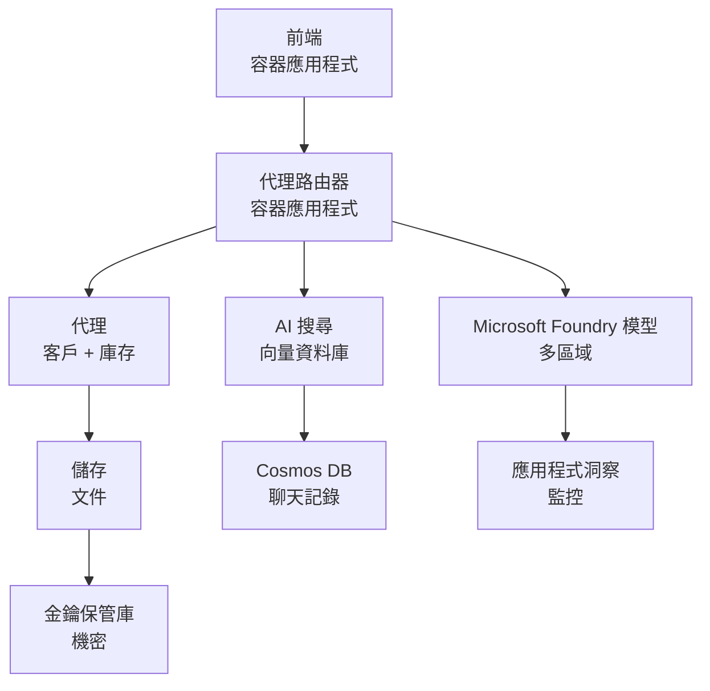

# 零售多代理解決方案 - 基礎架構範本

**第 5 章：生產部署封包**
- **📚 課程首頁**: [AZD For Beginners](../../README.md)
- **📖 相關章節**: [第 5 章：多代理 AI 解決方案](../../README.md#-chapter-5-multi-agent-ai-solutions-advanced)
- **📝 情境指南**: [完整架構](../retail-scenario.md)
- **🎯 快速部署**: [一鍵部署](#-quick-deployment)

> **⚠️ 僅為基礎架構範本**  
> 此 ARM 範本會部署 **Azure 資源** 以支援多代理系統。  
>  
> **會部署的項目（15-25 分鐘）：**
> - ✅ Microsoft Foundry 模型（gpt-4.1、gpt-4.1-mini、跨三地區的 embeddings）
> - ✅ AI Search 服務（空的，已可建立索引）
> - ✅ Container Apps（占位映像，準備好放入您的程式碼）
> - ✅ 儲存體、Cosmos DB、Key Vault、Application Insights
>  
> **未包含（需要開發）：**
> - ❌ 代理人實作程式碼（Customer Agent、Inventory Agent）
> - ❌ 路由邏輯與 API 端點
> - ❌ 前端聊天 UI
> - ❌ 搜尋索引結構與資料管線
> - ❌ **估計開發工作量：80-120 小時**
>  
> **適合使用此範本的情況：**
> - ✅ 想為多代理專案佈署 Azure 基礎架構
> - ✅ 計畫另行開發代理人實作
> - ✅ 需要一個可投入生產的基礎架構基線
>  
> **不適合使用情況：**
> - ❌ 期待立即看到可運作的多代理示範
> - ❌ 尋找完整應用程式程式碼範例

## 總覽

此目錄包含一個完整的 Azure Resource Manager (ARM) 範本，用於部署多代理客服系統的基礎架構。該範本會配置所有必要的 Azure 服務，並妥善相互連接，準備讓您進行應用開發。

**部署後，您將擁有：** 可投入生產的 Azure 基礎架構  
**要完成系統，您需要：** 代理人程式碼、前端 UI 以及資料設定（參見 [完整架構](../retail-scenario.md)）

## 🎯 會部署什麼

### 核心基礎架構（部署後狀態）

✅ **Microsoft Foundry 模型服務**（已可呼叫 API）
  - 主要地區：gpt-4.1 部署（20K TPM 容量）
  - 次要地區：gpt-4.1-mini 部署（10K TPM 容量）
  - 第三地區：文字向量模型（30K TPM 容量）
  - 評估地區：gpt-4.1 評分器模型（15K TPM 容量）
  - **狀態：** 完全正常運作 - 可立即呼叫 API

✅ **Azure AI Search**（空的 - 準備好配置）
  - 已啟用向量搜尋功能
  - Standard 層，1 個 partition，1 個 replica
  - **狀態：** 服務運行中，但需要建立索引
  - **需要的動作：** 使用您的結構建立搜尋索引

✅ **Azure 儲存體帳戶**（空的 - 準備好上傳）
  - Blob containers: `documents`, `uploads`
  - 安全設定（僅限 HTTPS，無公開存取）
  - **狀態：** 準備好接收檔案
  - **需要的動作：** 上傳您的產品資料和文件

⚠️ **Container Apps 環境**（已部署占位映像）
  - Agent router 應用程式（nginx 預設映像）
  - 前端應用程式（nginx 預設映像）
  - 已配置自動縮放（0-10 個實例）
  - **狀態：** 占位容器執行中
  - **需要的動作：** 建置並部署您的代理人應用程式

✅ **Azure Cosmos DB**（空的 - 準備好存放資料）
  - 已預先配置資料庫和容器
  - 為低延遲操作最佳化
  - 啟用 TTL 以自動清理
  - **狀態：** 準備好儲存聊天記錄

✅ **Azure Key Vault**（選用 - 準備好存放機密）
  - 啟用軟刪除
  - 已為託管身分配置 RBAC
  - **狀態：** 準備好儲存 API 金鑰與連線字串

✅ **Application Insights**（選用 - 監控已啟用）
  - 已連接至 Log Analytics 工作區
  - 已配置自訂指標與警示
  - **狀態：** 準備好接收應用程式遙測

✅ **Document Intelligence**（已可呼叫 API）
  - S0 層級，適用於生產工作負載
  - **狀態：** 準備好處理上傳的文件

✅ **Bing Search API**（已可呼叫 API）
  - S1 層級，適用於即時搜尋
  - **狀態：** 準備好進行網路搜尋查詢

### 部署模式

| 模式 | OpenAI 容量 | Container 實例 | 搜尋層級 | 儲存冗餘 | 適合用途 |
|------|-----------------|---------------------|-------------|-------------------|----------|
| **Minimal** | 10K-20K TPM | 0-2 replicas | Basic | LRS (Local) | 開發/測試、學習、概念驗證 |
| **Standard** | 30K-60K TPM | 2-5 replicas | Standard | ZRS (Zone) | 生產、中等流量（<10K 使用者） |
| **Premium** | 80K-150K TPM | 5-10 replicas, zone-redundant | Premium | GRS (Geo) | 企業、高流量（>10K 使用者）、99.99% SLA |

**成本影響：**
- **Minimal → Standard：** 約 4 倍成本增加（$100-370/mo → $420-1,450/mo）
- **Standard → Premium：** 約 3 倍成本增加（$420-1,450/mo → $1,150-3,500/mo）
- **選擇依據：** 預期負載、SLA 要求、預算限制

**容量規劃：**
- **TPM（每分鐘代幣數）：** 跨所有模型部署的總和
- **Container 實例：** 自動縮放範圍（最小-最大 副本數）
- **搜尋層級：** 影響查詢效能與索引大小限制

## 📋 先決條件

### 必要工具
1. **Azure CLI**（版本 2.50.0 或更高）
   ```bash
   az --version  # 檢查版本
   az login      # 驗證
   ```

2. **具有 Owner 或 Contributor 權限的有效 Azure 訂閱**
   ```bash
   az account show  # 驗證訂閱
   ```

### 必要的 Azure 配額

在部署前，請確認目標地區有足夠的配額：

```bash
# 檢查 Microsoft Foundry 模型在您所在區域的可用性
az cognitiveservices account list-skus \
  --kind OpenAI \
  --location eastus2

# 驗證 OpenAI 配額（例如 gpt-4.1）
az cognitiveservices usage list \
  --location eastus2 \
  --query "[?name.value=='OpenAI.Standard.gpt-4.1']"

# 檢查 Container Apps 配額
az provider show \
  --namespace Microsoft.App \
  --query "resourceTypes[?resourceType=='managedEnvironments'].locations"
```

**最低所需配額：**
- **Microsoft Foundry 模型：** 跨區域 3-4 個模型部署
  - gpt-4.1：20K TPM（每分鐘代幣數）
  - gpt-4.1-mini：10K TPM
  - text-embedding-ada-002：30K TPM
  - **註：** gpt-4.1 在某些地區可能有候補名單 - 請查看 [模型可用性](https://learn.microsoft.com/azure/ai-services/openai/concepts/models)
- **Container Apps：** 託管環境 + 2-10 個容器實例
- **AI Search：** Standard 層（Basic 層不足以支援向量搜尋）
- **Cosmos DB：** 標準預配吞吐量

**如果配額不足：**
1. 前往 Azure 入口網站 → Quotas → 申請增加配額
2. 或使用 Azure CLI：
   ```bash
   az support tickets create \
     --ticket-name "OpenAI-Quota-Increase" \
     --severity "minimal" \
     --description "Request quota increase for Microsoft Foundry Models gpt-4.1 in eastus2"
   ```
3. 考慮有可用性的替代區域

## 🚀 快速部署

### 選項 1：使用 Azure CLI

```bash
# 複製或下載範本檔案
git clone <repository-url>
cd examples/retail-multiagent-arm-template

# 使部署腳本可執行
chmod +x deploy.sh

# 使用預設設定部署
./deploy.sh -g myResourceGroup

# 為生產環境部署並啟用進階功能
./deploy.sh -g myProdRG -e prod -m premium -l eastus2
```

### 選項 2：使用 Azure 入口網站

[](https://portal.azure.com/#create/Microsoft.Template/uri/https%3A%2F%2Fraw.githubusercontent.com%2Fmicrosoft%2Fazd-for-beginners%2Fmain%2Fexamples%2Fretail-multiagent-arm-template%2Fazuredeploy.json)

### 選項 3：直接使用 Azure CLI

```bash
# 建立資源群組
az group create --name myResourceGroup --location eastus2

# 部署範本
az deployment group create \
  --resource-group myResourceGroup \
  --template-file azuredeploy.json \
  --parameters azuredeploy.parameters.json
```

## ⏱️ 部署時間表

### 預期情況

| Phase | Duration | What Happens |
|-------|----------|--------------||
| **Template Validation** | 30-60 seconds | Azure validates ARM template syntax and parameters |
| **Resource Group Setup** | 10-20 seconds | Creates resource group (if needed) |
| **OpenAI Provisioning** | 5-8 minutes | Creates 3-4 OpenAI accounts and deploys models |
| **Container Apps** | 3-5 minutes | Creates environment and deploys placeholder containers |
| **Search & Storage** | 2-4 minutes | Provisions AI Search service and storage accounts |
| **Cosmos DB** | 2-3 minutes | Creates database and configures containers |
| **Monitoring Setup** | 2-3 minutes | Sets up Application Insights and Log Analytics |
| **RBAC Configuration** | 1-2 minutes | Configures managed identities and permissions |
| **Total Deployment** | **15-25 minutes** | Complete infrastructure ready |

**部署後：**
- ✅ **基礎架構已就緒：** 所有 Azure 服務已部署並運行
- ⏱️ **應用程式開發：** 80-120 小時（您的責任）
- ⏱️ **索引設定：** 15-30 分鐘（需要您提供結構）
- ⏱️ **資料上傳：** 視資料集大小而異
- ⏱️ **測試與驗證：** 2-4 小時

---

## ✅ 驗證部署成功

### 步驟 1：檢查資源設定（2 分鐘）

```bash
# 驗證所有資源已成功部署
az resource list \
  --resource-group myResourceGroup \
  --query "[?provisioningState!='Succeeded'].{Name:name, Status:provisioningState, Type:type}" \
  --output table
```

**預期：** 空表格（所有資源顯示 "Succeeded" 狀態）

### 步驟 2：驗證 Microsoft Foundry 模型部署（3 分鐘）

```bash
# 列出所有 OpenAI 帳戶
az cognitiveservices account list \
  --resource-group myResourceGroup \
  --query "[?kind=='OpenAI'].{Name:name, Location:location, Status:properties.provisioningState}" \
  --output table

# 檢查主要區域的模型部署
OPENAI_NAME=$(az cognitiveservices account list \
  --resource-group myResourceGroup \
  --query "[?kind=='OpenAI'] | [0].name" -o tsv)

az cognitiveservices account deployment list \
  --name $OPENAI_NAME \
  --resource-group myResourceGroup \
  --output table
```

**預期：** 
- 3-4 個 OpenAI 帳戶（主要、次要、第三、評估地區）
- 每個帳戶 1-2 個模型部署（gpt-4.1、gpt-4.1-mini、text-embedding-ada-002）

### 步驟 3：測試基礎架構端點（5 分鐘）

```bash
# 取得 Container App 的 URL
az containerapp list \
  --resource-group myResourceGroup \
  --query "[].{Name:name, URL:properties.configuration.ingress.fqdn, Status:properties.runningStatus}" \
  --output table

# 測試路由端點 (佔位圖片會回應)
ROUTER_URL=$(az containerapp show \
  --name retail-router \
  --resource-group myResourceGroup \
  --query "properties.configuration.ingress.fqdn" -o tsv)

echo "Testing: https://$ROUTER_URL"
curl -I https://$ROUTER_URL || echo "Container running (placeholder image - expected)"
```

**預期：** 
- Container Apps 顯示 "Running" 狀態
- 占位 nginx 回應 HTTP 200 或 404（尚未有應用程式程式碼）

### 步驟 4：驗證 Microsoft Foundry 模型 API 存取（3 分鐘）

```bash
# 取得 OpenAI 端點與金鑰
OPENAI_ENDPOINT=$(az cognitiveservices account show \
  --name $OPENAI_NAME \
  --resource-group myResourceGroup \
  --query "properties.endpoint" -o tsv)

OPENAI_KEY=$(az cognitiveservices account keys list \
  --name $OPENAI_NAME \
  --resource-group myResourceGroup \
  --query "key1" -o tsv)

# 測試 gpt-4.1 部署
curl "${OPENAI_ENDPOINT}openai/deployments/gpt-4.1/chat/completions?api-version=2024-08-01-preview" \
  -H "Content-Type: application/json" \
  -H "api-key: $OPENAI_KEY" \
  -d '{
    "messages": [{"role": "user", "content": "Say hello"}],
    "max_tokens": 10
  }'
```

**預期：** 回傳包含聊天完成的 JSON（確認 OpenAI 可用）

### 運作中 vs. 尚未運作

**✅ 部署後已運作：**
- Microsoft Foundry 模型已部署並接受 API 呼叫
- AI Search 服務運行（空的，尚未建立索引）
- Container Apps 運行（占位 nginx 映像）
- 儲存體帳戶可存取並準備上傳
- Cosmos DB 準備好資料操作
- Application Insights 收集基礎架構遙測
- Key Vault 準備好儲存機密

**❌ 尚未運作（需要開發）：**
- 代理人端點（尚未部署應用程式程式碼）
- 聊天功能（需要前端 + 後端實作）
- 搜尋查詢（尚未建立搜尋索引）
- 文件處理管線（尚未上傳資料）
- 自訂遙測（需要應用程式儀表化）

**後續步驟：** 請參閱 [部署後設定](#-post-deployment-next-steps) 以開發並部署您的應用程式

---

## ⚙️ 設定選項

### 範本參數

| 參數 | 類型 | 預設 | 說明 |
|-----------|------|---------|-------------|
| `projectName` | string | "retail" | 所有資源名稱的前綴 |
| `location` | string | Resource group location | 資源群組位置 |
| `secondaryLocation` | string | "westus2" | 作為多地區部署的次要地區 |
| `tertiaryLocation` | string | "francecentral" | 用於 embeddings 模型的地區 |
| `environmentName` | string | "dev" | 環境設定（dev/staging/prod） |
| `deploymentMode` | string | "standard" | 部署配置（minimal/standard/premium） |
| `enableMultiRegion` | bool | true | 啟用多地區部署 |
| `enableMonitoring` | bool | true | 啟用 Application Insights 與日誌記錄 |
| `enableSecurity` | bool | true | 啟用 Key Vault 與強化安全性 |

### 自訂參數

編輯 `azuredeploy.parameters.json`：

```json
{
  "$schema": "https://schema.management.azure.com/schemas/2019-04-01/deploymentParameters.json#",
  "contentVersion": "1.0.0.0",
  "parameters": {
    "projectName": {
      "value": "mycompany"
    },
    "environmentName": {
      "value": "prod"
    },
    "deploymentMode": {
      "value": "premium"
    },
    "location": {
      "value": "eastus2"
    }
  }
}
```

## 🏗️ 架構概述


## 📖 部署腳本使用方式

`deploy.sh` 腳本提供互動式部署體驗：

```bash
# 顯示說明
./deploy.sh --help

# 基本部署
./deploy.sh -g myResourceGroup

# 使用自訂設定的進階部署
./deploy.sh \
  -g myProductionRG \
  -p companyname \
  -e prod \
  -m premium \
  -l eastus2

# 開發部署，不使用多區域
./deploy.sh \
  -g myDevRG \
  -e dev \
  -m minimal \
  --no-multi-region \
  --no-security
```

### 腳本功能

- ✅ <strong>先決條件驗證</strong>（Azure CLI、登入狀態、範本檔案）
- ✅ <strong>資源群組管理</strong>（若不存在則建立）
- ✅ <strong>部署前的範本驗證</strong>
- ✅ <strong>以彩色輸出顯示進度監控</strong>
- ✅ <strong>顯示部署輸出</strong>
- ✅ <strong>部署後指引</strong>

## 📊 監控部署

### 檢查部署狀態

```bash
# 列出部署
az deployment group list --resource-group myResourceGroup --output table

# 取得部署詳情
az deployment group show \
  --resource-group myResourceGroup \
  --name retail-deployment-YYYYMMDD-HHMMSS

# 監看部署進度
az deployment group create \
  --resource-group myResourceGroup \
  --template-file azuredeploy.json \
  --parameters azuredeploy.parameters.json \
  --verbose
```

### 部署輸出

成功部署後，可取得下列輸出：

- **前端 URL**：網站介面的公開端點
- **Router URL**：代理人路由器的 API 端點
- **OpenAI 端點**：主要與次要 OpenAI 服務端點
- **Search 服務**：Azure AI Search 服務端點
- <strong>儲存體帳戶</strong>：用於文件的儲存體帳戶名稱
- **Key Vault**：Key Vault 的名稱（如果已啟用）
- **Application Insights**：監控服務的名稱（如果已啟用）

## 🔧 部署後：後續步驟
> **📝 重要：** 基礎設施已部署，但您需要開發並部署應用程式程式碼。

### Phase 1: 開發代理應用程式（您的責任）

ARM 範本會建立含有佔位 nginx 映像的 **空 Container Apps**。您必須：

**必要的開發：**
1. <strong>代理實作</strong> (30-40 小時)
   - 客服代理，整合 gpt-4.1
   - 庫存代理，整合 gpt-4.1-mini
   - 代理路由邏輯

2. <strong>前端開發</strong> (20-30 小時)
   - 聊天介面 UI (React/Vue/Angular)
   - 檔案上傳功能
   - 回應呈現與格式化

3. <strong>後端服務</strong> (12-16 小時)
   - FastAPI 或 Express 路由
   - 驗證中介軟體
   - 遙測整合

**參見：** [架構指南](../retail-scenario.md) 以取得詳細的實作模式和程式範例

### Phase 2: 設定 AI 搜尋索引 (15-30 分鐘)

建立與您的資料模型相符的搜尋索引：

```bash
# 取得搜尋服務詳細資訊
SEARCH_NAME=$(az search service list \
  --resource-group myResourceGroup \
  --query "[0].name" -o tsv)

SEARCH_KEY=$(az search admin-key show \
  --service-name $SEARCH_NAME \
  --resource-group myResourceGroup \
  --query "primaryKey" -o tsv)

# 使用您的資料結構建立索引（範例）
curl -X POST "https://${SEARCH_NAME}.search.windows.net/indexes?api-version=2023-11-01" \
  -H "Content-Type: application/json" \
  -H "api-key: ${SEARCH_KEY}" \
  -d '{
    "name": "products",
    "fields": [
      {"name": "id", "type": "Edm.String", "key": true},
      {"name": "title", "type": "Edm.String", "searchable": true},
      {"name": "content", "type": "Edm.String", "searchable": true},
      {"name": "category", "type": "Edm.String", "filterable": true},
      {"name": "content_vector", "type": "Collection(Edm.Single)", 
       "searchable": true, "dimensions": 1536, "vectorSearchProfile": "default"}
    ],
    "vectorSearch": {
      "algorithms": [{"name": "default", "kind": "hnsw"}],
      "profiles": [{"name": "default", "algorithm": "default"}]
    }
  }'
```

**資源：**
- [AI 搜尋索引結構設計](https://learn.microsoft.com/azure/search/search-what-is-an-index)
- [向量搜尋設定](https://learn.microsoft.com/azure/search/vector-search-how-to-create-index)

### Phase 3: 上傳您的資料（時間依情況而異）

一旦您有產品資料和文件：

```bash
# 取得儲存帳戶詳細資訊
STORAGE_NAME=$(az storage account list \
  --resource-group myResourceGroup \
  --query "[0].name" -o tsv)

STORAGE_KEY=$(az storage account keys list \
  --account-name $STORAGE_NAME \
  --resource-group myResourceGroup \
  --query "[0].value" -o tsv)

# 上傳您的文件
az storage blob upload-batch \
  --destination documents \
  --source /path/to/your/product/docs \
  --account-name $STORAGE_NAME \
  --account-key $STORAGE_KEY

# 範例：上傳單一檔案
az storage blob upload \
  --container-name documents \
  --name "product-manual.pdf" \
  --file /path/to/product-manual.pdf \
  --account-name $STORAGE_NAME \
  --account-key $STORAGE_KEY
```

### Phase 4: 建立並部署您的應用程式（8-12 小時）

一旦您已開發您的代理程式碼：

```bash
# 1. 建立 Azure Container Registry（如有需要）
az acr create \
  --name myregistry \
  --resource-group myResourceGroup \
  --sku Basic

# 2. 建置並推送 agent router 映像
docker build -t myregistry.azurecr.io/agent-router:v1 /path/to/your/router/code
az acr login --name myregistry
docker push myregistry.azurecr.io/agent-router:v1

# 3. 建置並推送前端映像
docker build -t myregistry.azurecr.io/frontend:v1 /path/to/your/frontend/code
docker push myregistry.azurecr.io/frontend:v1

# 4. 使用你的映像更新 Container Apps
az containerapp update \
  --name retail-router \
  --resource-group myResourceGroup \
  --image myregistry.azurecr.io/agent-router:v1

az containerapp update \
  --name retail-frontend \
  --resource-group myResourceGroup \
  --image myregistry.azurecr.io/frontend:v1

# 5. 設定環境變數
az containerapp update \
  --name retail-router \
  --resource-group myResourceGroup \
  --set-env-vars \
    OPENAI_ENDPOINT=secretref:openai-endpoint \
    OPENAI_KEY=secretref:openai-key \
    SEARCH_ENDPOINT=secretref:search-endpoint \
    SEARCH_KEY=secretref:search-key
```

### Phase 5: 測試您的應用程式（2-4 小時）

```bash
# 取得您的應用程式網址
ROUTER_URL=$(az containerapp show \
  --name retail-router \
  --resource-group myResourceGroup \
  --query "properties.configuration.ingress.fqdn" -o tsv)

# 測試代理端點（在您的程式部署後）
curl -X POST "https://${ROUTER_URL}/chat" \
  -H "Content-Type: application/json" \
  -d '{
    "message": "Hello, I need help with my order",
    "agent": "customer"
  }'

# 檢查應用程式日誌
az containerapp logs show \
  --name retail-router \
  --resource-group myResourceGroup \
  --follow
```

### 實作資源

**架構與設計：**
- 📖 [完整架構指南](../retail-scenario.md) - 詳細實作模式
- 📖 [多代理設計範式](https://learn.microsoft.com/azure/architecture/ai-ml/guide/multi-agent-systems)

**程式範例：**
- 🔗 [Microsoft Foundry Models 聊天範例](https://github.com/Azure-Samples/azure-search-openai-demo) - RAG 模式
- 🔗 [Semantic Kernel](https://github.com/microsoft/semantic-kernel) - 代理框架（C#）
- 🔗 [LangChain Azure](https://github.com/langchain-ai/langchain) - 代理編排（Python）
- 🔗 [AutoGen](https://github.com/microsoft/autogen) - 多代理對話

**估計總工作量：**
- 基礎設施部署：15-25 分鐘（✅ 已完成）
- 應用程式開發：80-120 小時（🔨 您的工作）
- 測試與優化：15-25 小時（🔨 您的工作）

## 🛠️ 故障排除

### 常見問題

#### 1. Microsoft Foundry Models 配額已超過

```bash
# 檢查目前配額使用情況
az cognitiveservices usage list --location eastus2

# 申請提高配額
az support tickets create \
  --ticket-name "OpenAI-Quota-Increase" \
  --severity "minimal" \
  --description "Request quota increase for Microsoft Foundry Models in region X"
```

#### 2. Container Apps 部署失敗

```bash
# 檢查容器應用程式日誌
az containerapp logs show \
  --name retail-router \
  --resource-group myResourceGroup \
  --follow

# 重新啟動容器應用程式
az containerapp revision restart \
  --name retail-router \
  --resource-group myResourceGroup
```

#### 3. Search 服務初始化

```bash
# 驗證搜尋服務狀態
az search service show \
  --name <search-service-name> \
  --resource-group myResourceGroup

# 測試搜尋服務連線
curl -X GET "https://<search-service-name>.search.windows.net/indexes?api-version=2023-11-01" \
  -H "api-key: <search-admin-key>"
```

### 部署驗證

```bash
# 驗證所有資源是否已建立
az resource list \
  --resource-group myResourceGroup \
  --output table

# 檢查資源健康狀態
az resource list \
  --resource-group myResourceGroup \
  --query "[?provisioningState!='Succeeded'].{Name:name, Status:provisioningState, Type:type}" \
  --output table
```

## 🔐 安全注意事項

### 金鑰管理
- 所有機密（在啟用時）儲存在 Azure Key Vault
- Container apps 使用受控識別進行驗證
- 儲存帳戶具有安全預設（僅 HTTPS，無公開 blob 存取）

### 網路安全
- Container apps 盡可能使用內部網路
- Search 服務已配置私有端點選項
- Cosmos DB 設定為最少必要權限

### RBAC 設定
```bash
# 為託管識別（managed identity）指派必要的角色
az role assignment create \
  --assignee <container-app-managed-identity> \
  --role "Cognitive Services OpenAI User" \
  --scope <openai-resource-id>
```

## 💰 成本優化

### 成本估計（每月，美元）

| 模式 | OpenAI | Container Apps | 搜尋 | 儲存 | 總估計 |
|------|--------|----------------|--------|---------|------------|
| 基本 | $50-200 | $20-50 | $25-100 | $5-20 | $100-370 |
| 標準 | $200-800 | $100-300 | $100-300 | $20-50 | $420-1450 |
| 高級 | $500-2000 | $300-800 | $300-600 | $50-100 | $1150-3500 |

### 成本監控

```bash
# 設定預算警示
az consumption budget create \
  --account-name <subscription-id> \
  --budget-name "retail-budget" \
  --amount 500 \
  --time-grain Monthly \
  --start-date 2024-01-01 \
  --end-date 2024-12-31
```

## 🔄 更新與維護

### 範本更新
- 對 ARM 範本檔案進行版本控制
- 先在開發環境測試變更
- 對於更新使用增量部署模式

### 資源更新
```bash
# 使用新參數更新
az deployment group create \
  --resource-group myResourceGroup \
  --template-file azuredeploy.json \
  --parameters azuredeploy.parameters.json \
  --mode Incremental
```

### 備份與還原
- 已啟用 Cosmos DB 自動備份
- 已啟用 Key Vault 的軟刪除
- 保留 Container app 的修訂版本以便回滾

## 📞 支援

- <strong>範本問題</strong>： [GitHub 問題回報](https://github.com/microsoft/azd-for-beginners/issues)
- **Azure 支援**： [Azure 支援入口網站](https://portal.azure.com/#blade/Microsoft_Azure_Support/HelpAndSupportBlade)
- <strong>社群</strong>： [Azure AI Discord](https://discord.gg/microsoft-azure)

---

**⚡ 準備好部署您的多代理解決方案了嗎？**

Start with: `./deploy.sh -g myResourceGroup`

---

<!-- CO-OP TRANSLATOR DISCLAIMER START -->
**Disclaimer**:
本文件使用 AI 翻譯服務 [Co-op Translator](https://github.com/Azure/co-op-translator) 進行翻譯。雖然我們力求準確，但請注意，自動翻譯可能包含錯誤或不準確之處。原始語言版本應視為具權威性的來源。對於重要資訊，建議採用專業人工翻譯。我們對於因使用本翻譯而產生的任何誤解或誤譯不負任何責任。
<!-- CO-OP TRANSLATOR DISCLAIMER END -->