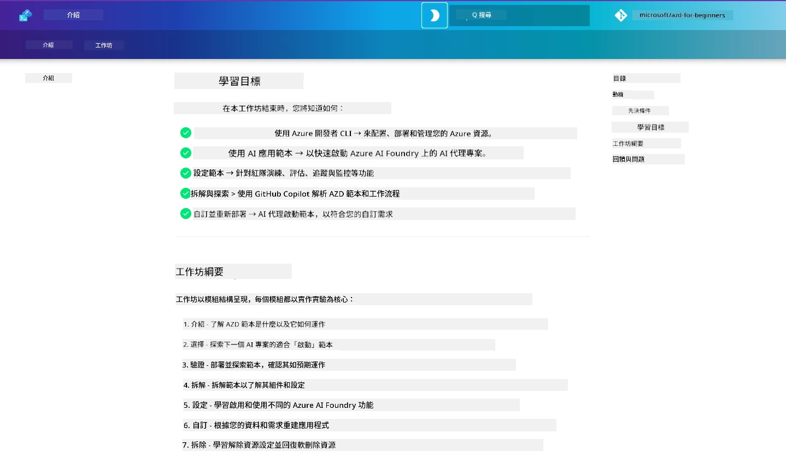

<div align="center">
  <div style="background: linear-gradient(135deg, #0078d4, #106ebe); border-radius: 10px; padding: 20px; margin: 20px 0; box-shadow: 0 4px 15px rgba(0, 120, 212, 0.3); border: 2px solid #005a9e;">
    <h2 style="color: white; margin: 0; font-size: 24px; text-shadow: 1px 1px 2px rgba(0,0,0,0.3);">
      🎯 AZD for AI 開發者工作坊
    </h2>
    <p style="color: white; margin: 10px 0 0 0; font-size: 16px; text-shadow: 1px 1px 2px rgba(0,0,0,0.3);">
      <strong>使用 Azure Developer CLI 建置 AI 應用程式的實作工作坊。</strong><br>
      完成 7 個模組以精通 AZD 範本與 AI 部署工作流程。
    </p>
    <div style="margin-top: 15px;">
      <span style="background: rgba(255,255,255,0.2); padding: 5px 10px; border-radius: 15px; color: white; font-size: 14px;">
        📅 最後更新：2026年2月
      </span>
    </div>
  </div>
</div>

# AZD for AI 開發者工作坊

歡迎參加專注於 AI 應用部署的 Azure Developer CLI (AZD) 實作工作坊。本工作坊以 3 個步驟幫助你獲得對 AZD 範本的實務理解：

1. **探索** - 找到適合你的範本。
1. **部署** - 部署並驗證其運作
1. **自訂** - 修改並迭代以符合你的需求！

在本工作坊中，你也將接觸到核心開發工具與工作流程，以協助你精簡端對端的開發旅程。

<br/>

## 瀏覽器版指南

工作坊課程以 Markdown 撰寫。你可以直接在 GitHub 上瀏覽它們 - 或如下圖示啟動瀏覽器預覽。



要使用此選項 - 將此儲存庫 fork 到你的個人帳號，然後啟動 GitHub Codespaces。當 VS Code 終端機啟動後，輸入此指令：

```bash title="" linenums="0"
mkdocs serve > /dev/null 2>&1 &
```

幾秒鐘後，你會看到一個快顯對話方塊。選擇 `在瀏覽器中開啟` 的選項。基於網頁的指南將會在新的瀏覽器分頁中開啟。此預覽的一些優點：

1. **內建搜尋** - 快速找到關鍵字或課程。
1. **複製圖示** - 將滑鼠移到程式碼區塊可看到此選項
1. **主題切換** - 在深色與淺色主題間切換
1. **取得協助** - 點擊頁腳的 Discord 圖示加入！

<br/>

## 工作坊概覽

**Duration:** 3-4 小時  
**Level:** 初學者到中階  
**Prerequisites:** 熟悉 Azure、AI 概念、VS Code 與命令列工具。

這是一個透過實作學習的工作坊。完成練習後，我們建議你檢視 AZD For Beginners 課程以延續你的學習，深入安全性與生產力的最佳實務。

| Time| Module  | Objective |
|:---|:---|:---|
| 15 mins | [介紹](docs/instructions/0-Introduction.md) | 設定場景並理解目標 |
| 30 mins | [選擇 AI 範本](docs/instructions/1-Select-AI-Template.md) | 探索選項並選擇入門範本 | 
| 30 mins | [驗證 AI 範本](docs/instructions/2-Validate-AI-Template.md) | 將預設解決方案部署到 Azure |
| 30 mins | [拆解 AI 範本](docs/instructions/3-Deconstruct-AI-Template.md) | 探索結構與設定 |
| 30 mins | [設定 AI 範本](docs/instructions/4-Configure-AI-Template.md) | 啟用並嘗試可用功能 |
| 30 mins | [自訂 AI 範本](docs/instructions/5-Customize-AI-Template.md) | 根據需求調整範本 |
| 30 mins | [拆除基礎設施](docs/instructions/6-Teardown-Infrastructure.md) | 清理並釋放資源 |
| 15 mins | [總結與後續步驟](docs/instructions/7-Wrap-up.md) | 學習資源，工作坊挑戰 |

<br/>

## 你將學到什麼

將 AZD 範本視為一個學習沙盒，以探索在 Microsoft Foundry 上進行端對端開發的各種功能與工具。完成本工作坊後，你應該對此情境中的各種工具與概念有直覺性的理解。

| Concept  | Objective |
|:---|:---|
| **Azure Developer CLI** | 瞭解工具命令與工作流程|
| **AZD Templates**| 瞭解專案結構與設定|
| **Azure AI Agent**| 佈署 Microsoft Foundry 專案與資源  |
| **Azure AI Search**| 啟用以 Agent 進行的情境工程 |
| **Observability**| 探索追蹤、監控與評估 |
| **Red Teaming**| 探索對抗性測試與緩解措施 |

<br/>

## 工作坊架構

本工作坊的架構引導你從範本探索、部署、拆解到自訂 - 使用官方 [Getting Started with AI Agents](https://github.com/Azure-Samples/get-started-with-ai-agents) starter template 作為基礎。

### [模組 1：選擇 AI 範本](docs/instructions/1-Select-AI-Template.md) (30 分鐘)

- AI 範本是什麼？
- 在哪裡可以找到 AI 範本？
- 如何開始建立 AI Agents？
- **實作**: Quickstart with GitHub Codespaces

### [模組 2：驗證 AI 範本](docs/instructions/2-Validate-AI-Template.md) (30 分鐘)

- AI 範本的架構是什麼？
- AZD 的開發工作流程是什麼？
- 如何取得 AZD 開發的協助？
- **實作**: Deploy & Validate AI Agents template

### [模組 3：拆解 AI 範本](docs/instructions/3-Deconstruct-AI-Template.md) (30 分鐘)

- Explore your environment in `.azure/` 
- Explore your resource setup in `infra/` 
- Explore your AZD configuration in `azure.yaml`s
- **實作**: Modify Environment Variables & Redeploy

### [模組 4：設定 AI 範本](docs/instructions/4-Configure-AI-Template.md) (30 分鐘)
- 探索：檢索增強生成 (Retrieval Augmented Generation)
- 探索：Agent 評估與紅隊測試
- 探索：追蹤與監控
- **實作**: Explore AI Agent + Observability 

### [模組 5：自訂 AI 範本](docs/instructions/5-Customize-AI-Template.md) (30 分鐘)
- 定義：包含情境需求的 PRD
- 設定：AZD 的環境變數
- 實作：為新增工作加入生命週期掛鉤
- **實作**: Customize template for my scenario

### [模組 6：拆除基礎設施](docs/instructions/6-Teardown-Infrastructure.md) (30 分鐘)
- 回顧：什麼是 AZD 範本？
- 回顧：為何使用 Azure Developer CLI？
- 後續步驟：嘗試不同的範本！
- **實作**: Deprovision infrastructure & cleanup

<br/>

## 工作坊挑戰

想挑戰更多自己嗎？以下是一些專案建議 - 或者與我們分享你的想法！！

| Project | Description |
|:---|:---|
|1. **拆解一個複雜的 AI 範本** | 使用我們說明的工作流程與工具，嘗試部署、驗證並自訂不同的 AI 解決方案範本。 _你學到了什麼?_|
|2. **以你的情境進行自訂**  | 嘗試為不同情境撰寫 PRD（產品需求文件）。然後在你的範本 repo 的 Agent Model 中使用 GitHub Copilot，要求它為你產生一個自訂化工作流程。 _你學到了什麼？你如何改進這些建議？_|
| | |

## 有回饋嗎？

1. 在此 repo 發表 issue - 標記它為 `Workshop` 以便分類。
1. 加入 Microsoft Foundry 的 Discord - 與你的同儕交流！


| | | 
|:---|:---|
| **📚 課程首頁**| [AZD For Beginners](../README.md)|
| **📖 文件** | [Get started with AI templates](https://learn.microsoft.com/en-us/azure/ai-foundry/how-to/develop/ai-template-get-started)|
| **🛠️ AI 範本** | [Microsoft Foundry Templates](https://ai.azure.com/templates) |
|**🚀 後續步驟** | [開始工作坊](../../../workshop) |
| | |

<br/>

---

**Navigation:** [主要課程](../README.md) | [介紹](docs/instructions/0-Introduction.md) | [模組 1：選擇範本](docs/instructions/1-Select-AI-Template.md)

**準備好開始使用 AZD 建置 AI 應用程式了嗎？**

[開始工作坊：介紹 →](docs/instructions/0-Introduction.md)

---

<!-- CO-OP TRANSLATOR DISCLAIMER START -->
免責聲明：
本文件已使用 AI 翻譯服務 Co-op Translator (https://github.com/Azure/co-op-translator) 進行翻譯。雖然我們力求準確，但自動翻譯可能仍含有錯誤或不準確之處。原始語言版本之文件應視為權威來源。對於關鍵資訊，建議採用專業人工翻譯。我們不對因使用本翻譯而產生的任何誤解或誤譯負責。
<!-- CO-OP TRANSLATOR DISCLAIMER END -->