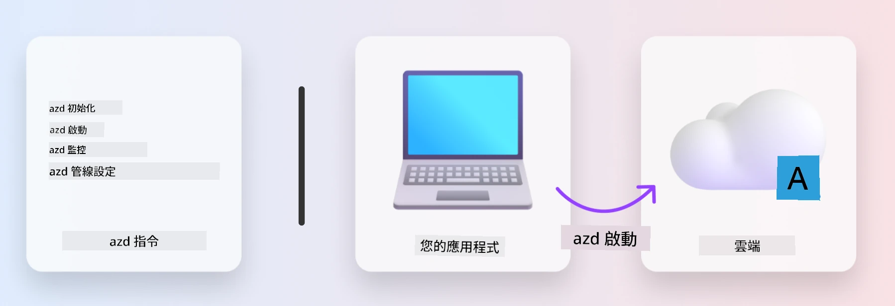
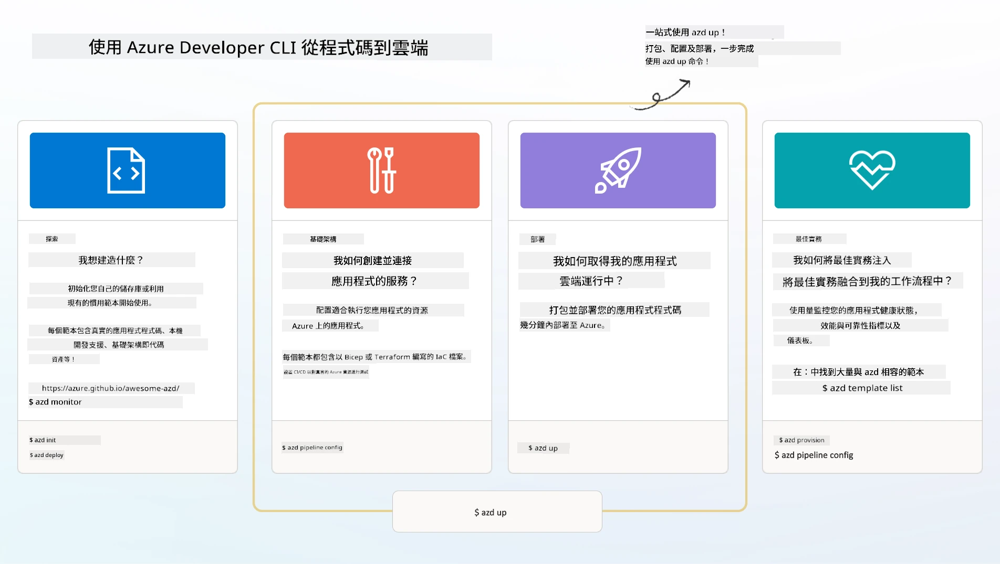

# 1. 選擇範本

!!! tip "在本模組結束時您將能夠"

    - [ ] 描述什麼是 AZD 範本
    - [ ] 發掘並使用 AI 專用的 AZD 範本
    - [ ] 開始使用 AI Agents 範本
    - [ ] **實驗室 1：** 在 Codespaces 或開發容器中快速啟動 AZD

---

## 1. 建造者的比喻

從零開始建造一個現代企業級的 AI 應用程式可能令人望之生畏。這有點像一磚一瓦自己蓋新家。是的，這可以做到！但這不是獲得理想最終結果的最有效方法！

相反，我們通常會先從現有的 _設計藍圖_ 開始，並與建築師合作，依照個人需求進行客製化。建造智能應用程式時，正是採用這種方式。首先，找到適合您問題領域的良好設計架構。接著與解決方案架構師合作，為您的特定場景客製化並開發方案。

但我們在哪裡可以找到這些設計藍圖？又如何找到願意教我們如何自行客製化與部署這些藍圖的建築師？在此工作坊中，我們透過介紹三種技術回答這些問題：

1. [Azure Developer CLI](https://aka.ms/azd) — 一個開源工具，加速開發者從本地開發（建置）到雲端部署（發佈）的過程。
1. [Microsoft Foundry Templates](https://ai.azure.com/templates) — 標準化的開源資源庫，包含範例程式碼、基礎架構與配置檔，供部署 AI 解決方案架構使用。
1. [GitHub Copilot Agent Mode](https://code.visualstudio.com/docs/copilot/chat/chat-agent-mode) — 以 Azure 知識為基礎的程式碼代理人，能夠引導我們瀏覽程式碼庫並進行修改，使用自然語言即可。

有了這些工具，我們現在可以 _發現_ 適合的範本，_部署_ 以驗證其可行性，並 _客製化_ 以符合特定需求。讓我們深入了解這些工具的運作方式。

---

## 2. Azure Developer CLI

[Azure Developer CLI](https://learn.microsoft.com/en-us/azure/developer/azure-developer-cli/)（或 `azd`）是一款開源指令列工具，利用一組對開發者友善的命令，能統一在您的 IDE（開發）與 CI/CD（運維）環境中加速程式碼走向雲端的流程。

使用 `azd`，您的部署流程可以簡化為：

- `azd init` — 從現有 AZD 範本初始化一個新的 AI 專案。
- `azd up` — 一步驟佈建基礎結構並部署應用程式。
- `azd monitor` — 獲取已部署應用程式的即時監控與診斷。
- `azd pipeline config` — 設定 CI/CD 管線，自動化部署至 Azure。

**🎯 | 練習**：<br/> 立即在您目前的工作坊環境中探索 `azd` 指令列工具。這可以是在 GitHub Codespaces、開發容器或已安裝先決條件的本地複製倉庫。先輸入此指令看看工具能做什麼：

```bash title="" linenums="0"
azd help
```



---

## 3. AZD 範本

為了讓 `azd` 達成上述功能，它需要知道要佈建的基礎設施、要強制的配置設定，以及要部署的應用程式。這就是 [AZD 範本](https://learn.microsoft.com/en-us/azure/developer/azure-developer-cli/azd-templates?tabs=csharp) 的作用。

AZD 範本是一種開源資源庫，結合範例程式碼與部署解決方案架構所需的基礎設施與配置檔。
透過採用「基礎架構即程式碼」(Infrastructure-as-Code, IaC) 的方法，範本中的資源定義與配置設定能像應用源碼一樣受到版本控制，讓專案使用者能建立可重用且一致的流程。

在建立或重用 AZD 範本以符合 _您的_ 場景時，請考慮以下問題：

1. 您在建造什麼？→ 是否有包含該場景起始程式碼的範本？
1. 您的方案如何架構？→ 是否有包含必要資源的範本？
1. 您的方案如何部署？→ 想想 `azd deploy`，搭配前後置處理鉤子！
1. 如何進一步優化？→ 考慮內建監控及自動化管線！

**🎯 | 練習**：<br/> 
造訪 [Awesome AZD](https://azure.github.io/awesome-azd/) 畫廊，使用篩選器探索目前 250+ 個可用範本。看看是否能找到符合 _您的_ 場景需求的範本。



---

## 4. AI 應用範本

針對 AI 驅動的應用程式，Microsoft 提供獨特範本，使用特色為 **Microsoft Foundry** 與 **Foundry Agents**。這些範本能加速您構建智慧型、具生產力的應用程式的步伐。

### Microsoft Foundry 與 Foundry Agents 範本

請選擇下方範本進行部署。每個範本皆可在 [Awesome AZD](https://azure.github.io/awesome-azd/) 找到，並僅需一行命令即可初始化。

| 範本 | 說明 | 部署指令 |
|----------|-------------|----------------|
| **[AI Chat with RAG](https://azure.github.io/awesome-azd/?tags=ai&tags=rag)** | 使用 Microsoft Foundry 進行檢索增強生成的聊天應用程式 | `azd init -t azure-samples/azure-search-openai-demo` |
| **[Foundry Agent Service Starter](https://azure.github.io/awesome-azd/?tags=ai&tags=agents)** | 使用 Foundry Agents 構建自主任務執行的 AI agents | `azd init -t azure-samples/foundry-agent-service-starter` |
| **[Multi-Agent Orchestration](https://azure.github.io/awesome-azd/?tags=ai&tags=agents)** | 協調多個 Foundry Agents 完成複雜工作流程 | `azd init -t azure-samples/multi-agent-orchestration` |
| **[AI Document Intelligence](https://azure.github.io/awesome-azd/?tags=ai&tags=document)** | 使用 Microsoft Foundry 模型提取及分析文件 | `azd init -t azure-samples/ai-document-processing` |
| **[Conversational AI Bot](https://azure.github.io/awesome-azd/?tags=ai&tags=bot)** | 構建與 Microsoft Foundry 整合的智慧聊天機器人 | `azd init -t azure-samples/ai-chat-protocol` |
| **[AI Image Generation](https://azure.github.io/awesome-azd/?tags=ai&tags=dalle)** | 使用 Microsoft Foundry 的 DALL-E 生成影像 | `azd init -t azure-samples/ai-image-generation` |
| **[Semantic Kernel Agent](https://azure.github.io/awesome-azd/?tags=ai&tags=semantic-kernel)** | 使用 Semantic Kernel 與 Foundry Agents 的 AI agents | `azd init -t azure-samples/semantic-kernel-agent` |
| **[AutoGen Multi-Agent](https://azure.github.io/awesome-azd/?tags=ai&tags=autogen)** | 使用 AutoGen 框架的多代理系統 | `azd init -t azure-samples/autogen-multi-agent` |

### 快速開始

1. <strong>瀏覽範本</strong>：拜訪 [https://azure.github.io/awesome-azd/](https://azure.github.io/awesome-azd/)，並以 `AI`、`Agents` 或 `Microsoft Foundry` 篩選
2. <strong>選擇範本</strong>：挑選符合您使用情境的範本
3. <strong>初始化</strong>：執行 `azd init` 命令，選擇對應範本初始化
4. <strong>部署</strong>：執行 `azd up` 佈建並部署

**🎯 | 練習**：<br/>
依據您的場景，從上述範本中選一個：

- **建置聊天機器人？** → 從 **AI Chat with RAG** 或 **Conversational AI Bot** 開始
- **需要自主代理？** → 試試 **Foundry Agent Service Starter** 或 **Multi-Agent Orchestration**
- **處理文件？** → 使用 **AI Document Intelligence**
- **想要 AI 輔助程式碼寫作？** → 探索 **Semantic Kernel Agent** 或 **AutoGen Multi-Agent**

```bash title="Example: Deploy the AI Chat with RAG template" linenums="0"
azd init -t azure-samples/azure-search-openai-demo
azd up
```

!!! info "探索更多範本"
    [Awesome AZD 畫廊](https://azure.github.io/awesome-azd/) 含有超過 250 個範本。利用篩選器尋找符合您特定語言、框架和 Azure 服務需求的範本。

---

<!-- CO-OP TRANSLATOR DISCLAIMER START -->
**免責聲明**：  
本文件係使用 AI 翻譯服務 [Co-op Translator](https://github.com/Azure/co-op-translator) 進行翻譯。雖然我們致力於準確性，但請注意自動翻譯可能包含錯誤或不準確之處。原始文件的母語版本應視為權威來源。對於重要資訊，建議尋求專業人工翻譯。我們不對因使用本翻譯而產生的任何誤解或誤譯負責。
<!-- CO-OP TRANSLATOR DISCLAIMER END -->