# 2. 驗證範本

> 於 2026 年 3 月以 `azd 1.23.12` 版本驗證。

!!! tip "完成此模組後，您將能夠"

    - [ ] 分析 AI 解決方案架構
    - [ ] 了解 AZD 部署工作流程
    - [ ] 使用 GitHub Copilot 協助使用 AZD
    - [ ] **實驗 2：** 部署並驗證 AI 代理範本

---


## 1. 介紹

[Azure Developer CLI](https://learn.microsoft.com/en-us/azure/developer/azure-developer-cli/) 或 `azd` 是一個開源命令列工具，可簡化開發者在 Azure 上構建和部署應用程式的工作流程。

[AZD 範本](https://learn.microsoft.com/azure/developer/azure-developer-cli/azd-templates) 是標準化的儲存庫，包含範例應用程式程式碼、_基礎設施即程式碼_ 資產，以及用於整合解決方案架構的 `azd` 配置檔。基礎設施的配置只需執行一次 `azd provision` 指令 — 使用 `azd up` 則可同時建置基礎設施 <strong>並</strong> 部署您的應用程式！

因此，快速啟動您的應用程式開發流程可以是如此簡單：找到最接近您應用程式與基礎設施需求的 _AZD Starter 範本_，然後根據您的情境需求自訂該儲存庫。

開始之前，讓我們先確定您已安裝 Azure Developer CLI。

1. 開啟 VS Code 終端機，輸入以下指令：

      ```bash title="" linenums="0"
      azd version
      ```

1. 您應看到類似以下的畫面！

      ```bash title="" linenums="0"
      azd version 1.23.12 (commit <current-build>)
      ```

**您現在已準備好選擇並使用 azd 部署範本**

---

## 2. 範本選擇

Microsoft Foundry 平台提供了一組 [推薦的 AZD 範本](https://learn.microsoft.com/en-us/azure/ai-foundry/how-to/develop/ai-template-get-started)，涵蓋熱門解決方案情境，例如 _多代理工作流程自動化_ 與 _多模態內容處理_。您也可以透過 Microsoft Foundry 入口網站探索這些範本。

1. 訪問 [https://ai.azure.com/templates](https://ai.azure.com/templates)
1. 在提示時登入 Microsoft Foundry 入口網站 — 您會看到類似下列畫面。

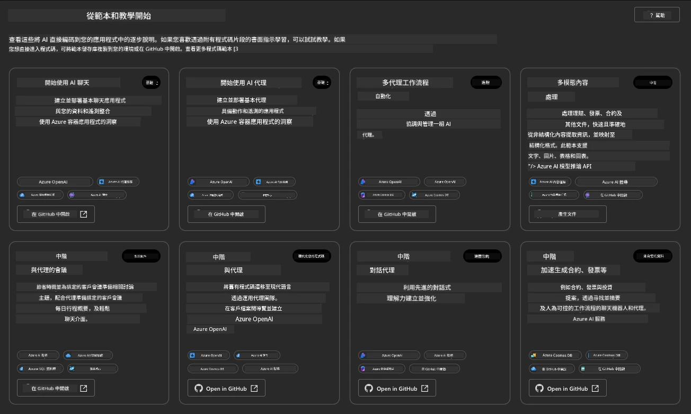


**Basic** 選項是您的入門範本：

1. [ ] [使用 AI 聊天開始](https://github.com/Azure-Samples/get-started-with-ai-chat) ，部署一個基本聊天應用程式，將 _您的數據_ 部署至 Azure Container Apps。使用此範本探索基本 AI 聊天機器人情境。
1. [X] [使用 AI 代理開始](https://github.com/Azure-Samples/get-started-with-ai-agents) ，同樣部署標準 AI 代理（搭配 Foundry Agents）。使用此範本熟悉包含工具與模型的代理式 AI 解決方案。

在新的瀏覽器分頁中造訪第二個連結（或點擊相關卡片中的 `Open in GitHub`）。您應該會看到此 AZD 範本的儲存庫。花點時間瀏覽 README。應用程式架構如下圖所示：

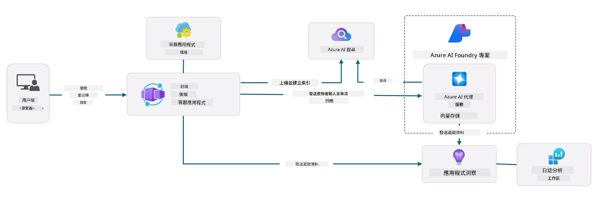

---

## 3. 範本啟動

讓我們嘗試部署此範本並確保其有效。我們將依照 [快速開始](https://github.com/Azure-Samples/get-started-with-ai-agents?tab=readme-ov-file#getting-started) 區段的指引進行。

1. 選擇範本儲存庫的工作環境：

      - **GitHub Codespaces**：點擊[此連結](https://github.com/codespaces/new/Azure-Samples/get-started-with-ai-agents)並確認 `Create codespace`
      - <strong>本機複製或開發容器</strong>：複製 `Azure-Samples/get-started-with-ai-agents` 並在 VS Code 中開啟

1. 等 VS Code 終端機就緒後，輸入以下指令：

   ```bash title="" linenums="0"
   azd up
   ```

完成此指令觸發的工作流程步驟：

1. 系統會提示您登入 Azure — 依指示完成驗證。
1. 輸入您的唯一環境名稱 — 例如，我使用 `nitya-mshack-azd`。
1. 這會建立一個 `.azure/` 資料夾，並在內部看到以環境名稱命名的子資料夾。
1. 系統會提示您選擇訂閱名稱 — 選擇預設。
1. 系統會提示您選擇地區 — 選用 `East US 2`。

接著，您等待佈建完成。**這大約會花費 10-15 分鐘**

1. 完成後，您會在主控台看到成功訊息，如下：
      ```bash title="" linenums="0"
      SUCCESS: Your up workflow to provision and deploy to Azure completed in 10 minutes 17 seconds.
      ```
1. 您的 Azure 入口網站將會有一個以該環境名稱命名的已佈建資源群組：

      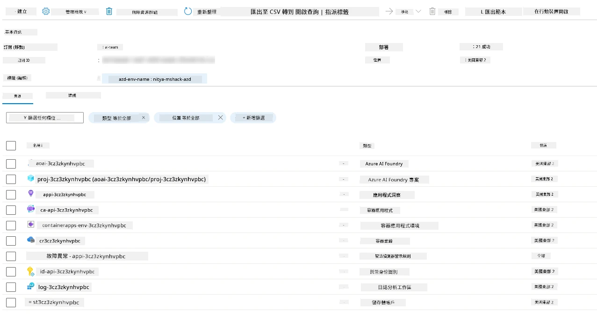

1. <strong>您現在已準備好驗證已部署的基礎設施和應用程式</strong>。

---

## 4. 範本驗證

1. 訪問 Azure 入口網站 [資源群組](https://portal.azure.com/#browse/resourcegroups) 頁面 — 出現提示時登入。
1. 點開您的環境名稱資源群組 — 即看到上述頁面。

      - 點選 Azure Container Apps 資源
      - 點選 _精要資訊（Essentials）_ 區塊右上方的應用程式網址

1. 您應該會看到類似此由主機提供的前端 UI：

   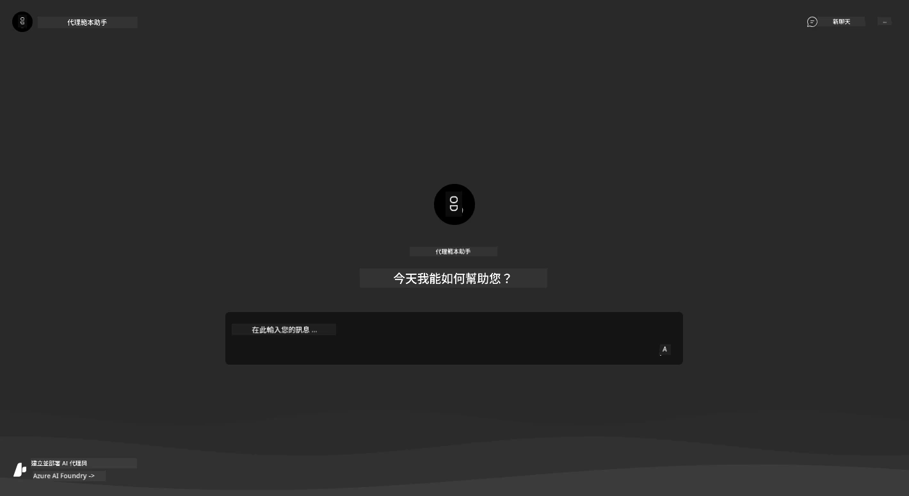

1. 嘗試提出幾個 [範例問題](https://github.com/Azure-Samples/get-started-with-ai-agents/blob/main/docs/sample_questions.md)

      1. 詢問：```法國的首都是什麼？```
      1. 詢問：```兩人使用、價格低於 200 美元的最佳帳篷是什麼？它包含哪些功能？```

1. 您應該會得到類似下方的回答。_但這是怎麼運作的呢？_

      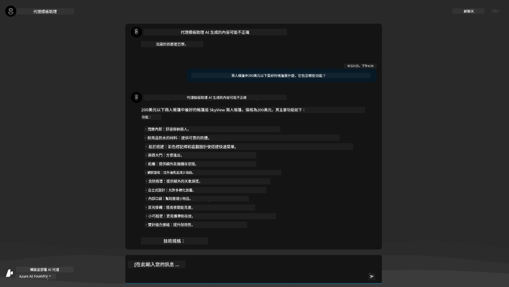

---

## 5. 代理驗證

Azure Container App 部署一個端點，連接到 Microsoft Foundry 專案中為此範本配置的 AI 代理。讓我們看看這代表什麼。

1. 回到 Azure 入口網站該資源群組的 _概覽_ 頁面

1. 點選列表中的 `Microsoft Foundry` 資源

1. 您會看到此頁面。點擊 `Go to Microsoft Foundry Portal` 按鈕。
   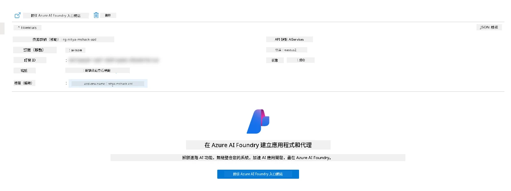

1. 您將看到 AI 應用程式的 Foundry 專案頁面
   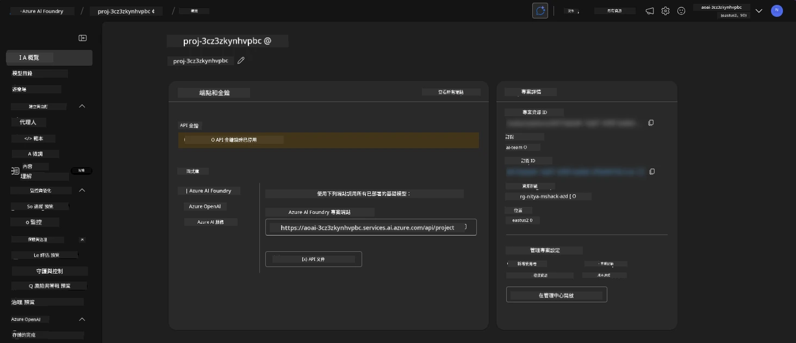

1. 點選 `Agents` — 您會看到專案中預設配置的代理
   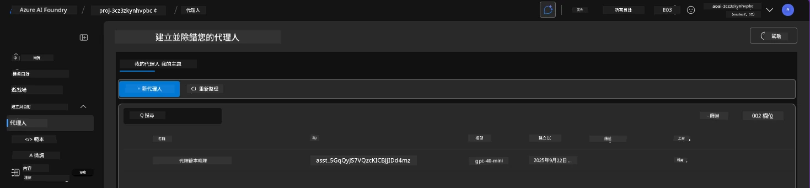

1. 選取該代理 — 您會看到代理詳細資料。請注意：

      - 該代理預設使用檔案搜尋 (永遠如此)
      - 代理的 `Knowledge` 顯示已有 32 個檔案被上傳（用於檔案搜尋）
      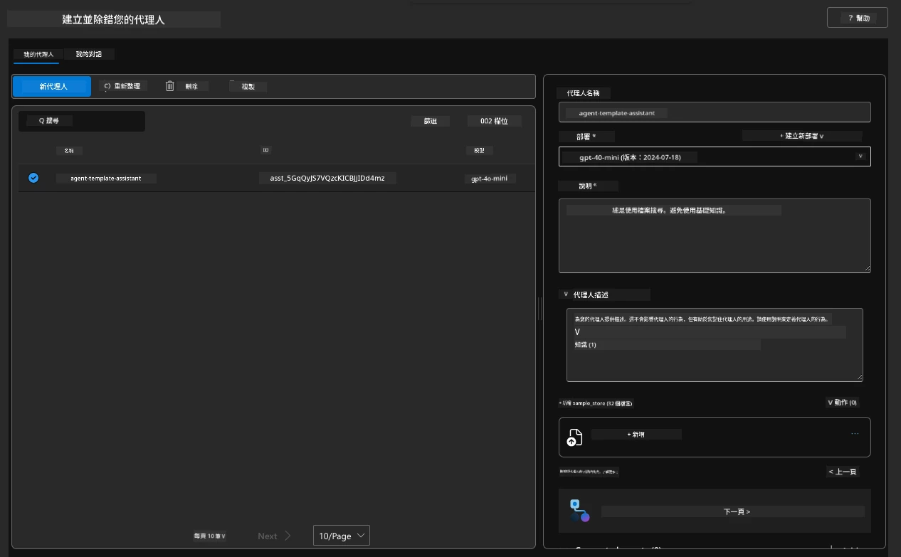

1. 在左側選單找尋並點擊 `Data+indexes` 選項查看詳情。

      - 您會看到用於知識的 32 個上傳檔案
      - 這對應到 `src/files` 底下的 12 個客戶檔與 20 個產品檔
      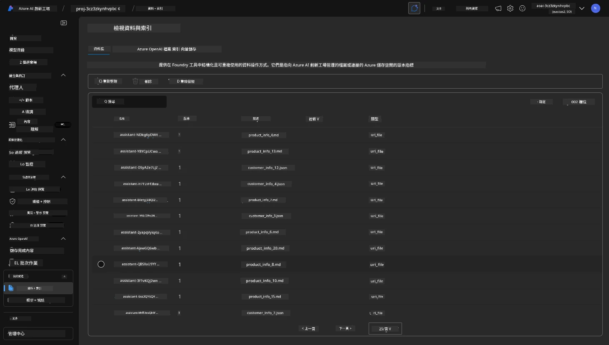

**您已驗證代理運作正常！**

1. 代理的回應是以這些檔案中所載知識為基礎。
1. 您現在可以針對這些資料提問，並獲得有根據的答案。
1. 範例：`customer_info_10.json` 描述了 Amanda Perez 的 3 筆購買紀錄。

回到瀏覽器分頁中的 Container App 端點，問：「Amanda Perez 擁有哪些產品？」您應該會看到如下結果：

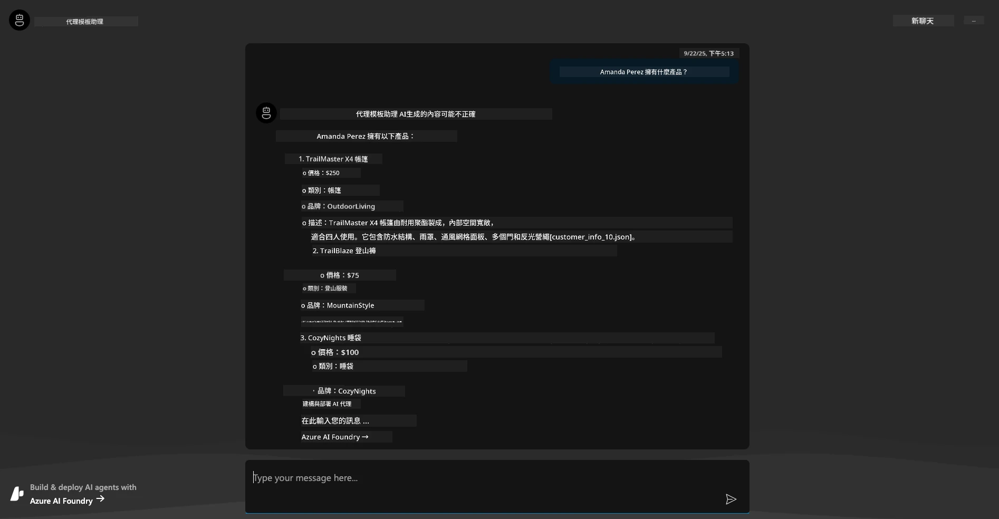

---

## 6. 代理遊樂場

讓我們透過在代理遊樂場中測試代理，加深對 Microsoft Foundry 能力的直覺理解。

1. 回到 Microsoft Foundry 的 `Agents` 頁面 — 選擇預設代理
1. 點擊 `Try in Playground` 選項 — 您會看到如下的遊樂場 UI
1. 提出同樣問題：`Amanda Perez 擁有哪些產品？`

    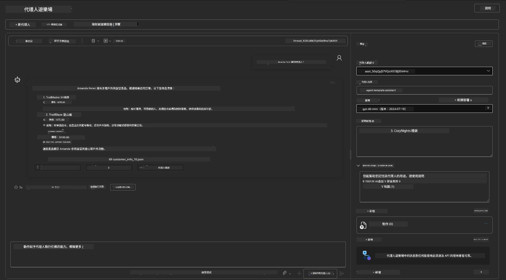

您會得到相同（或類似）回答 — 並且還有額外資訊，幫助您理解代理應用的品質、成本與效能。例如：

1. 注意回應中引用了用來「依據」回覆的資料檔
1. 將滑鼠懸停在任一檔案標籤上 — 該資料是否與您的查詢及顯示回應相符？

您也會在回應下方看到一列 _統計_ 。

1. 將滑鼠懸停在任一指標上 — 例如 安全性 (Safety)。您會看到如下說明
1. 評估評分是否符合您對回應安全水準的直覺？

      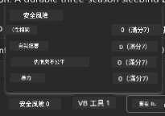

---

## 7. 內建可觀察性

可觀察性是指為您的應用程式加裝儀表，使其產生可用於了解、偵錯與優化運作的資料。以下讓您了解此特性的感受：

1. 點擊 `View Run Info` 按鈕 — 您將看到此視圖。這是 [代理追蹤](https://learn.microsoft.com/en-us/azure/ai-foundry/how-to/develop/trace-agents-sdk#view-trace-results-in-the-azure-ai-foundry-agents-playground) 的實例。_您也可以透過點選頂層選單中的 Thread Logs 取得此視圖_。

   - 了解代理執行的步驟與所使用的工具
   - 理解當前回應的總 Token 數（含輸出 Token 使用量）
   - 瞭解延遲時間與執行時花費在哪些部分

      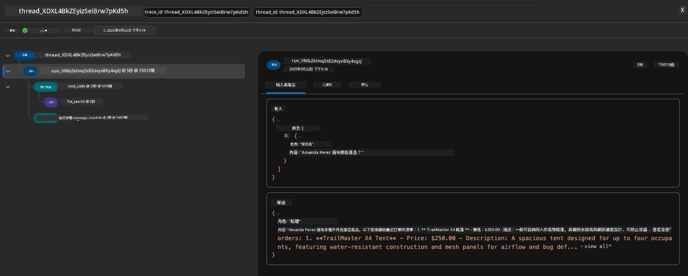

1. 點擊 `Metadata` 分頁查看執行的其他屬性，這些可能提供日後偵錯時有用的背景資訊。

      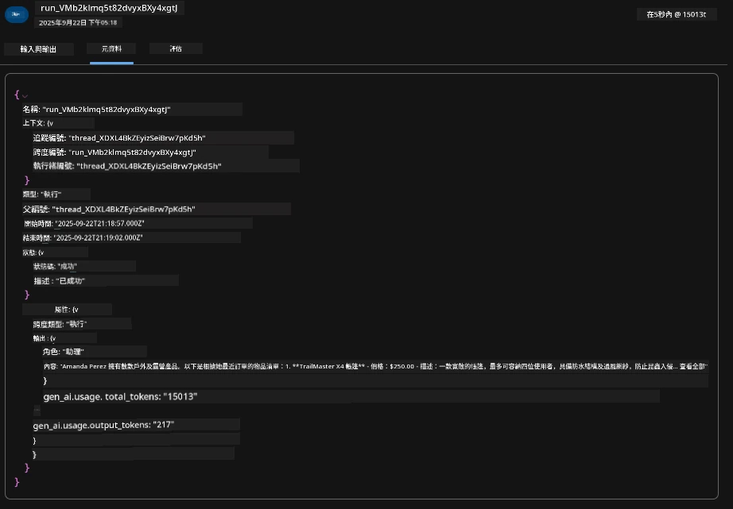


1. 點擊 `Evaluations` 分頁檢視對代理回應進行的自動評估。評估內容涵蓋安全性評估（例如，自我傷害）及代理專屬評估（例如，意圖解析、任務遵循程度）。

      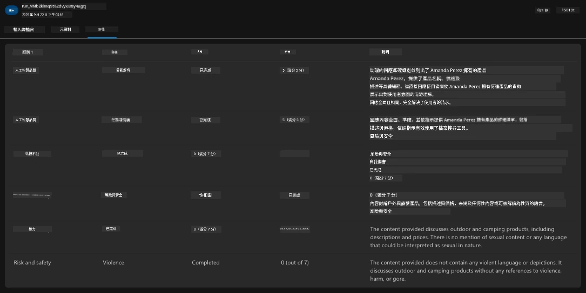

1. 最後，點擊側邊選單中的 `Monitoring` 分頁。

      - 選擇顯示頁面的 `Resource usage` 分頁 — 查看度量指標。
      - 追蹤應用程式使用情況，包含成本（token 計數）和負載（請求數）。
      - 追蹤應用程式的首次字節延遲（輸入處理）及最後字節延遲（輸出）。

      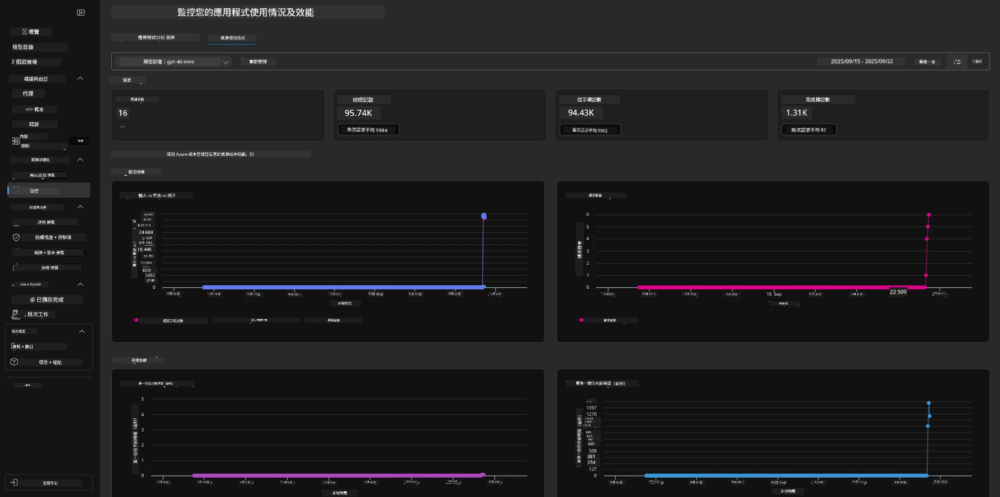

---

## 8. 環境變數

至此，我們已在瀏覽器中完成部署，並確認基礎設施已佈建且應用程式運作正常。但若要以 _程式碼優先_ 方式操作應用程式，我們需要配置本機開發環境，設定相關變數以使用這些資源。使用 `azd` 可以讓這件事變得簡單。

1. Azure Developer CLI [使用環境變數](https://learn.microsoft.com/en-us/azure/developer/azure-developer-cli/manage-environment-variables?tabs=bash) 來存取與管理應用程式部署的設定值。

1. 環境變數會儲存在 `.azure/<env-name>/.env` 檔案中 — 這個作用範圍限定在部署時使用的該 `env-name` 環境，有助於您在同一儲存庫內針對不同部署目標隔離環境設定。

1. 當執行指定指令（例如 `azd up`）時，`azd` 指令會自動載入這些環境變數。請注意，`azd` 並不會自動讀取 _作業系統層級_ 的環境變數（例如於 shell 設定者）— 請改用 `azd set env` 及 `azd get env` 在腳本中轉移資訊。


讓我們嘗試幾個指令：

1. 取得此環境中已為 `azd` 設定的所有環境變數：

      ```bash title="" linenums="0"
      azd env get-values
      ```
      
      您會看到如下訊息：

      ```bash title="" linenums="0"
      AZURE_AI_AGENT_DEPLOYMENT_NAME="gpt-4.1-mini"
      AZURE_AI_AGENT_NAME="agent-template-assistant"
      AZURE_AI_EMBED_DEPLOYMENT_NAME="text-embedding-3-small"
      AZURE_AI_EMBED_DIMENSIONS=100
      ...
      ```

1. 取得特定值 — 例如，我想知道是否有設定 `AZURE_AI_AGENT_MODEL_NAME`

      ```bash title="" linenums="0"
      azd env get-value AZURE_AI_AGENT_MODEL_NAME 
      ```
      
      您會看到類似畫面 — 預設並未設定該值！

      ```bash title="" linenums="0"
      ERROR: key 'AZURE_AI_AGENT_MODEL_NAME' not found in the environment values
      ```

1. 為 `azd` 設定新的環境變數。此處更新代理模型名稱。_注意：任何更動將會立即反映在 `.azure/<env-name>/.env` 檔案中。_

      ```bash title="" linenums="0"
      azd env set AZURE_AI_AGENT_MODEL_NAME gpt-4.1
      azd env set AZURE_AI_AGENT_MODEL_VERSION 2025-04-14
      azd env set AZURE_AI_AGENT_DEPLOYMENT_CAPACITY 150
      ```

      現在，我們應該可以看到該值已被設定：

      ```bash title="" linenums="0"
      azd env get-value AZURE_AI_AGENT_MODEL_NAME 
      ```

1. 請注意，有些資源是持久性的（例如模型部署），需要比單純執行 `azd up` 更多的動作才能強制重新部署。讓我們嘗試拆除原先部署，並帶著變更後的環境變數重新部署。

1. <strong>更新</strong> 如果您之前已經使用 azd 範本部署基礎設施，可以使用此指令根據您 Azure 部署的當前狀態 _更新（refresh）_ 本地環境變數狀態：

      ```bash title="" linenums="0"
      azd env refresh
      ```

      這是一種強大的方式，可以在兩個或更多本地開發環境之間_同步_環境變數（例如，多位開發人員的團隊）——允許已部署的基礎架構作為環境變數狀態的真實依據。團隊成員只需_刷新_變數即可重新同步。

---

## 9. 恭喜你 🏆

你剛剛完成了一個端到端的工作流程，你：

- [X] 選擇了你想使用的 AZD 範本
- [X] 在受支援的開發環境中開啟了該範本
- [X] 部署了範本並驗證其可運作

---

<!-- CO-OP TRANSLATOR DISCLAIMER START -->
**免責聲明**：  
本文件是使用 AI 翻譯服務 [Co-op Translator](https://github.com/Azure/co-op-translator) 進行翻譯。雖然我們努力確保翻譯的準確性，但請注意自動翻譯可能包含錯誤或不準確之處。原始文件的母語版本應被視為權威來源。針對關鍵資訊，建議尋求專業人工翻譯。我們對因使用此翻譯所引起的任何誤解或誤譯不承擔任何責任。
<!-- CO-OP TRANSLATOR DISCLAIMER END -->