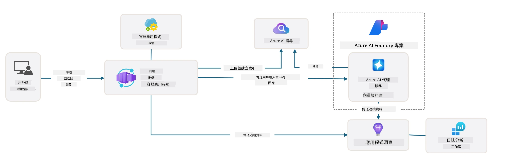

# 3. 拆解範本

!!! tip "在本模組結束時，您將能夠"

    - [ ] 使用 MCP 伺服器為 Azure 提供協助啟用 GitHub Copilot
    - [ ] 了解 AZD 範本資料夾結構與元件
    - [ ] 探索基礎建設即程式碼（Bicep）的組織模式
    - [ ] **實驗 3：** 使用 GitHub Copilot 探索並理解儲存庫架構 

---


透過 AZD 範本與 Azure Developer CLI (`azd`)，我們可以快速啟動我們的 AI 開發旅程，使用標準化的儲存庫提供範例程式碼、基礎架構和設定檔──以可立即部署的 _starter_ 專案形式。

**但現在，我們需要了解專案結構與程式碼庫，並能在沒有任何 AZD 先前經驗或理解的情況下自訂 AZD 範本！**

---

## 1. 啟用 GitHub Copilot

### 1.1 安裝 GitHub Copilot Chat

現在是時候探索 [GitHub Copilot 的 Agent 模式](https://code.visualstudio.com/docs/copilot/chat/chat-agent-mode)。透過此模式，我們可以使用自然語言來高層描述我們的任務，並獲得執行方面的協助。對於本實驗，我們會使用 [Copilot 免費方案](https://github.com/github-copilot/signup)，該方案對完成與聊天互動有月度限制。

擴充套件可以從市集中安裝，但在您的 Codespaces 環境中應已可用。_從 Copilot 圖示的下拉選單點選 `Open Chat`，然後輸入像 `What can you do?` 這樣的提示詞_ —— 您可能會被要求登入。**GitHub Copilot Chat 已準備就緒**。

### 1.2. 安裝 MCP 伺服器

為了讓 Agent 模式有效，它需要能存取合適的工具以協助擷取知識或採取動作。這就是 MCP 伺服器可以發揮作用的地方。我們將設定以下伺服器：

1. [Azure MCP Server](../../../../../workshop/docs/instructions)
1. [Microsoft Docs MCP Server](../../../../../workshop/docs/instructions)

要啟動這些：

1. 如果不存在，建立一個名為 `.vscode/mcp.json` 的檔案
1. 將以下內容複製到該檔案中──然後啟動伺服器！
   ```json title=".vscode/mcp.json"
   {
      "servers": {
         "Azure MCP Server": {
            "command": "npx",
            "args": [
            "-y",
            "@azure/mcp@latest",
            "server",
            "start"
            ]
         },
         "microsoft.docs.mcp": {
            "type": "http",
            "url": "https://learn.microsoft.com/api/mcp"
         }
      }
   }
   ```

??? warning "您可能會遇到 `npx` 未安裝的錯誤（點選以展開修正方式）"

      若要修正，請開啟 `.devcontainer/devcontainer.json` 檔案，並在 features 區段加入此行。然後重新建置容器。您應該會有 `npx` 可用。

      ```title="" linenums="0"
         "features": {
            "ghcr.io/devcontainers/features/node:1": {},
            ...
         },
      ```

---

### 1.3. 測試 GitHub Copilot Chat

**首先使用 `az login` 從 VS Code 命令列進行 Azure 驗證。**

您現在應該能查詢您的 Azure 訂閱狀態，並詢問已部署資源或設定的問題。嘗試這些提示詞：

1. `List my Azure resource groups`
1. `#foundry list my current deployments`

您也可以針對 Azure 文件提出問題，並從 Microsoft Docs MCP 伺服器取得有根據的回應。嘗試這些提示詞：

1. `#microsoft_docs_search What is Azure Developer CLI?`
1. `#microsoft_docs_search Show me a Python tutorial to chat with deployed model`

或者您也可以要求程式碼片段來完成任務。試試這個提示：

1. `Give me a Python code example that uses AAD for an interactive chat client`

在 `Ask` 模式中，這會提供可供複製貼上並嘗試的程式碼。在 `Agent` 模式中，它可能會更進一步，為您建立相關資源──包含設定腳本與文件──以協助您執行該任務。

<strong>您現在已具備開始探索範本儲存庫的能力</strong>

---

## 2. 拆解架構

??? prompt "請求：以一段落說明 docs/images/architecture.png 中的應用程式架構"

      這個應用程式是一個建立於 Azure 上的 AI 聊天應用程式，展示了現代的代理（agent）為中心的架構。解決方案以一個 Azure Container App 為核心，該應用程式主程式處理使用者輸入並透過 AI 代理產生智慧回應。
      
      架構以 Microsoft Foundry Project 為 AI 能力的基礎，連接到提供底層語言模型（例如 gpt-4.1-mini）與代理功能的 Azure AI 服務。使用者互動從基於 React 的前端流向 FastAPI 後端，後端與 AI 代理服務通訊以產生具情境性的回應。
      
      系統透過檔案搜尋或 Azure AI Search 服務來實作知識擷取功能，使代理能從上傳的文件中擷取並引用資訊。為了營運卓越，架構包含了完整的監控，透過 Application Insights 與 Log Analytics Workspace 進行追蹤、日誌與效能最佳化。
      
      Azure Storage 提供應用程式資料與檔案上傳的 Blob 儲存，而 Managed Identity 則確保 Azure 資源之間的安全存取，而不需儲存認證。整個解決方案以可擴展性與可維護性為設計目標，容器化應用程式會根據需求自動擴展，同時透過 Azure 的託管服務生態系提供內建的安全性、監控與 CI/CD 能力。



---

## 3. 儲存庫結構

!!! prompt "請求：解釋範本資料夾結構。從視覺層級圖開始。"

??? info "回答：視覺化層級圖"

      ```bash title="" 
      get-started-with-ai-agents/
      ├── 📋 Configuration & Setup
      │   ├── azure.yaml                    # Azure Developer CLI configuration
      │   ├── docker-compose.yaml           # Local development containers
      │   ├── pyproject.toml                # Python project configuration
      │   ├── requirements-dev.txt          # Development dependencies
      │   └── .devcontainer/                # VS Code dev container setup
      │
      ├── 🏗️ Infrastructure (infra/)
      │   ├── main.bicep                    # Main infrastructure template
      │   ├── api.bicep                     # API-specific resources
      │   ├── main.parameters.json          # Infrastructure parameters
      │   └── core/                         # Modular infrastructure components
      │       ├── ai/                       # AI service configurations
      │       ├── host/                     # Hosting infrastructure
      │       ├── monitor/                  # Monitoring and logging
      │       ├── search/                   # Azure AI Search setup
      │       ├── security/                 # Security and identity
      │       └── storage/                  # Storage account configs
      │
      ├── 💻 Application Source (src/)
      │   ├── api/                          # Backend API
      │   │   ├── main.py                   # FastAPI application entry
      │   │   ├── routes.py                 # API route definitions
      │   │   ├── search_index_manager.py   # Search functionality
      │   │   ├── data/                     # API data handling
      │   │   ├── static/                   # Static web assets
      │   │   └── templates/                # HTML templates
      │   ├── frontend/                     # React/TypeScript frontend
      │   │   ├── package.json              # Node.js dependencies
      │   │   ├── vite.config.ts            # Vite build configuration
      │   │   └── src/                      # Frontend source code
      │   ├── data/                         # Sample data files
      │   │   └── embeddings.csv            # Pre-computed embeddings
      │   ├── files/                        # Knowledge base files
      │   │   ├── customer_info_*.json      # Customer data samples
      │   │   └── product_info_*.md         # Product documentation
      │   ├── Dockerfile                    # Container configuration
      │   └── requirements.txt              # Python dependencies
      │
      ├── 🔧 Automation & Scripts (scripts/)
      │   ├── postdeploy.sh/.ps1           # Post-deployment setup
      │   ├── setup_credential.sh/.ps1     # Credential configuration
      │   ├── validate_env_vars.sh/.ps1    # Environment validation
      │   └── resolve_model_quota.sh/.ps1  # Model quota management
      │
      ├── 🧪 Testing & Evaluation
      │   ├── tests/                        # Unit and integration tests
      │   │   └── test_search_index_manager.py
      │   ├── evals/                        # Agent evaluation framework
      │   │   ├── evaluate.py               # Evaluation runner
      │   │   ├── eval-queries.json         # Test queries
      │   │   └── eval-action-data-path.json
      │   ├── sandbox/                      # Development playground
      │   │   ├── 1-quickstart.py           # Getting started examples
      │   │   └── aad-interactive-chat.py   # Authentication examples
      │   └── airedteaming/                 # AI safety evaluation
      │       └── ai_redteaming.py          # Red team testing
      │
      ├── 📚 Documentation (docs/)
      │   ├── deployment.md                 # Deployment guide
      │   ├── local_development.md          # Local setup instructions
      │   ├── troubleshooting.md            # Common issues & fixes
      │   ├── azure_account_setup.md        # Azure prerequisites
      │   └── images/                       # Documentation assets
      │
      └── 📄 Project Metadata
         ├── README.md                     # Project overview
         ├── CODE_OF_CONDUCT.md           # Community guidelines
         ├── CONTRIBUTING.md              # Contribution guide
         ├── LICENSE                      # License terms
         └── next-steps.md                # Post-deployment guidance
      ```

### 3.1. 核心應用架構

此範本遵循 <strong>全端網頁應用程式</strong> 的模式，包含：

- <strong>後端</strong>: 使用 Python FastAPI 並整合 Azure AI
- <strong>前端</strong>: TypeScript/React 與 Vite 建構系統
- <strong>基礎建設</strong>: 使用 Azure Bicep 範本來部署雲端資源
- <strong>容器化</strong>: 使用 Docker 以確保部署一致性

### 3.2 基礎建設即程式碼（Bicep）

基礎建設層使用模組化組織的 **Azure Bicep** 範本：

   - **`main.bicep`**: 協調所有 Azure 資源
   - **`core/` 模組**: 不同服務的可重複使用元件
      - AI 服務（Microsoft Foundry Models、AI Search）
      - 容器主機（Azure Container Apps）
      - 監控（Application Insights、Log Analytics）
      - 安全性（Key Vault、Managed Identity）

### 3.3 應用程式原始碼（`src/`）

**後端 API（`src/api/`）**：

- 基於 FastAPI 的 REST API
- Foundry 代理整合
- 用於知識檢索的搜尋索引管理
- 檔案上傳與處理功能

**前端（`src/frontend/`）**：

- 現代的 React/TypeScript 單頁應用
- 使用 Vite 進行快速開發與最佳化建置
- 用於代理互動的聊天介面

**知識庫（`src/files/`）**：

- 範例客戶與產品資料
- 示範基於檔案的知識檢索
- JSON 與 Markdown 格式範例


### 3.4 開發運維與自動化

**腳本（`scripts/`）**：

- 跨平台的 PowerShell 與 Bash 腳本
- 環境驗證與設定
- 部署後配置
- 模型額度管理

**Azure Developer CLI 整合**：

- `azure.yaml` 用於 `azd` 工作流程的設定
- 自動化的佈署與部署程序
- 環境變數管理

### 3.5 測試與品質保證

**評估框架（`evals/`）**：

- 代理效能評估
- 查詢-回應品質測試
- 自動化評估流程

**AI 安全（`airedteaming/`）**：

- 針對 AI 安全性的紅隊測試
- 安全弱點掃描
- 負責任的 AI 實務

---

## 4. 恭喜 🏆

您已成功使用 GitHub Copilot Chat 並結合 MCP 伺服器來探索該儲存庫。

- [X] 已為 Azure 啟用 GitHub Copilot
- [X] 已了解應用程式架構
- [X] 已探索 AZD 範本結構

這讓您對此範本的 _infrastructure as code_ 資產有初步了解。接下來，我們將查看 AZD 的設定檔。

---

<!-- CO-OP TRANSLATOR DISCLAIMER START -->
**免責聲明**:
本文件已使用 AI 翻譯服務 [Co-op Translator](https://github.com/Azure/co-op-translator) 進行翻譯。雖然我們力求準確，但請注意，機器翻譯可能包含錯誤或不準確之處。原文應視為具權威性的來源。對於重要資訊，建議採用專業人工翻譯。我們不對因使用本翻譯而產生的任何誤解或誤釋負責。
<!-- CO-OP TRANSLATOR DISCLAIMER END -->