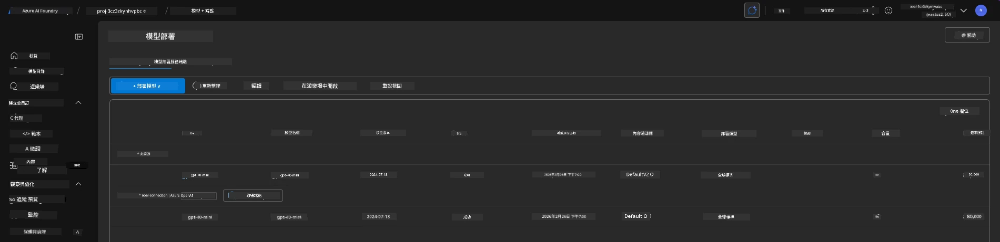
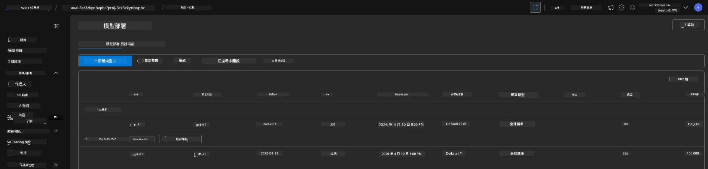

# 6. 清除基礎設施

!!! tip "在本模組結束時您將能夠"

    - [ ] 了解資源清理和成本管理的重要性
    - [ ] 使用 `azd down` 安全地撤除基礎設施
    - [ ] 在需要時還原已軟刪除的認知服務
    - [ ] **Lab 6:** 清理 Azure 資源並確認已移除

---

## 額外練習

在我們拆除專案之前，花幾分鐘進行一些開放式探索。

!!! info "嘗試這些探索提示"

    **使用 GitHub Copilot 進行實驗：**
    
    1. 詢問：`還有哪些 AZD 範本我可以嘗試用於多代理情境？`
    2. 詢問：`如何客製化代理人的指示以用於醫療保健情境？`
    3. 詢問：`哪些環境變數會控制成本優化？`
    
    **探索 Azure 入口網站：**
    
    1. 檢視部署的 Application Insights 指標
    2. 檢查已佈建資源的成本分析
    3. 再次探索 Microsoft Foundry 入口網站的代理人遊樂場

---

## 解除佈建基礎設施

1. 拆除基礎設施就是這麼簡單：
      
      ```bash title="" linenums="0"
      azd down --purge
      ```
1. The `--purge` flag ensures that it also purges soft-deleted Cognitive Service resources, thereby releasing quota held by these resources. Once complete you will see something like this:
      
      ```bash title="" linenums="0"
      ? Total resources to delete: 11, are you sure you want to continue? Yes
      Deleting your resources can take some time.
      (✓) Done: Deleted resource group rg-nitya-mshack-azd
      (✓) Done: Purging Cognitive Account: aoai-3cz3zkynhvpbc

      SUCCESS: Your application was removed from Azure in 11 minutes 4 seconds.
      ```

1. (可選) 如果您現在再次執行 `azd up`，您會注意到 gpt-4.1 模型會被部署，因為環境變數已在本機的 `.azure` 資料夾中變更（並已儲存）。 

      以下是模型部署的 **之前**：

      

      而這是 **之後**：
      

---

<!-- CO-OP TRANSLATOR DISCLAIMER START -->
免責聲明：
本文件係使用 AI 翻譯服務 [Co-op Translator]（https://github.com/Azure/co-op-translator）進行翻譯。雖然我們力求準確，但請注意自動翻譯可能包含錯誤或不精確之處。以原始語言撰寫的原文件應視為權威來源。對於關鍵資訊，建議由專業人工翻譯處理。我們不對因使用本翻譯而導致的任何誤解或誤譯負責。
<!-- CO-OP TRANSLATOR DISCLAIMER END -->