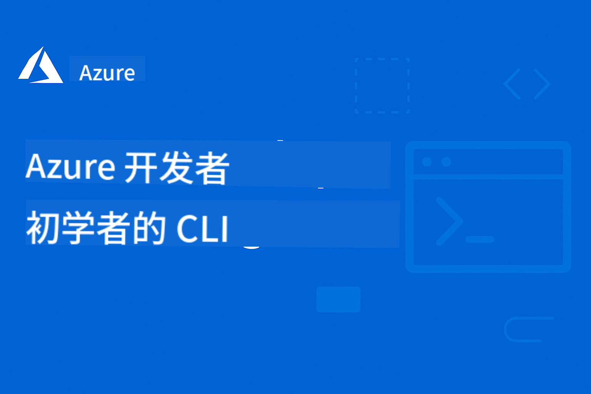

<!--
CO_OP_TRANSLATOR_METADATA:
{
  "original_hash": "b79ef24ce895f99bbed93b5de39ede9f",
  "translation_date": "2025-11-19T11:57:10+00:00",
  "source_file": "README.md",
  "language_code": "zh"
}
-->
# AZD 初学者指南：系统化学习之旅

 

[](https://GitHub.com/microsoft/azd-for-beginners/watchers/)
[](https://GitHub.com/microsoft/azd-for-beginners/network/)
[](https://GitHub.com/microsoft/azd-for-beginners/stargazers/)

[](https://discord.gg/microsoft-azure)
[](https://discord.gg/nTYy5BXMWG)

## 开始学习本课程

按照以下步骤开启您的 AZD 学习之旅：

1. **Fork 仓库**：点击 [](https://GitHub.com/microsoft/azd-for-beginners/fork)
2. **克隆仓库**：`git clone https://github.com/microsoft/azd-for-beginners.git`
3. **加入社区**：[Azure Discord 社区](https://discord.com/invite/ByRwuEEgH4) 获取专家支持
4. **选择学习路径**：根据您的经验水平选择以下章节

### 多语言支持

#### 自动翻译（始终保持最新）

<!-- CO-OP TRANSLATOR LANGUAGES TABLE START -->
[阿拉伯语](../ar/README.md) | [孟加拉语](../bn/README.md) | [保加利亚语](../bg/README.md) | [缅甸语](../my/README.md) | [中文（简体）](./README.md) | [中文（繁体，香港）](../hk/README.md) | [中文（繁体，澳门）](../mo/README.md) | [中文（繁体，台湾）](../tw/README.md) | [克罗地亚语](../hr/README.md) | [捷克语](../cs/README.md) | [丹麦语](../da/README.md) | [荷兰语](../nl/README.md) | [爱沙尼亚语](../et/README.md) | [芬兰语](../fi/README.md) | [法语](../fr/README.md) | [德语](../de/README.md) | [希腊语](../el/README.md) | [希伯来语](../he/README.md) | [印地语](../hi/README.md) | [匈牙利语](../hu/README.md) | [印尼语](../id/README.md) | [意大利语](../it/README.md) | [日语](../ja/README.md) | [韩语](../ko/README.md) | [立陶宛语](../lt/README.md) | [马来语](../ms/README.md) | [马拉地语](../mr/README.md) | [尼泊尔语](../ne/README.md) | [挪威语](../no/README.md) | [波斯语](../fa/README.md) | [波兰语](../pl/README.md) | [葡萄牙语（巴西）](../br/README.md) | [葡萄牙语（葡萄牙）](../pt/README.md) | [旁遮普语](../pa/README.md) | [罗马尼亚语](../ro/README.md) | [俄语](../ru/README.md) | [塞尔维亚语（西里尔文）](../sr/README.md) | [斯洛伐克语](../sk/README.md) | [斯洛文尼亚语](../sl/README.md) | [西班牙语](../es/README.md) | [斯瓦希里语](../sw/README.md) | [瑞典语](../sv/README.md) | [他加禄语](../tl/README.md) | [泰米尔语](../ta/README.md) | [泰语](../th/README.md) | [土耳其语](../tr/README.md) | [乌克兰语](../uk/README.md) | [乌尔都语](../ur/README.md) | [越南语](../vi/README.md)
<!-- CO-OP TRANSLATOR LANGUAGES TABLE END -->

## 课程概览

通过系统化章节学习掌握 Azure Developer CLI (azd)。**特别关注与 Microsoft Foundry 集成的 AI 应用部署。**

### 为什么现代开发者需要这门课程

根据 Microsoft Foundry Discord 社区的反馈，**45% 的开发者希望使用 AZD 处理 AI 工作负载**，但面临以下挑战：
- 复杂的多服务 AI 架构
- 生产环境 AI 部署的最佳实践  
- Azure AI 服务的集成与配置
- AI 工作负载的成本优化
- AI 部署特定问题的排查

### 学习目标

完成本课程后，您将能够：
- **掌握 AZD 基础知识**：核心概念、安装与配置
- **部署 AI 应用**：结合 Microsoft Foundry 服务使用 AZD
- **实现基础设施即代码**：使用 Bicep 模板管理 Azure 资源
- **排查部署问题**：解决常见问题并调试
- **优化生产环境**：安全性、扩展性、监控与成本管理
- **构建多代理解决方案**：部署复杂的 AI 架构

## 📚 学习章节

*根据经验水平和目标选择您的学习路径*

### 🚀 第 1 章：基础与快速入门
**前置条件**：Azure 订阅，基本命令行知识  
**时长**：30-45 分钟  
**难度**：⭐

#### 学习内容
- 了解 Azure Developer CLI 基础知识
- 在您的平台上安装 AZD
- 完成首次成功部署

#### 学习资源
- **🎯 从这里开始**：[什么是 Azure Developer CLI？](../..)
- **📖 理论**：[AZD 基础](docs/getting-started/azd-basics.md) - 核心概念与术语
- **⚙️ 设置**：[安装与设置](docs/getting-started/installation.md) - 平台特定指南
- **🛠️ 实践**：[您的第一个项目](docs/getting-started/first-project.md) - 分步教程
- **📋 快速参考**：[命令速查表](resources/cheat-sheet.md)

#### 实践练习
```bash
# Quick installation check
azd version

# Deploy your first application
azd init --template todo-nodejs-mongo
azd up
```

**💡 本章成果**：使用 AZD 成功将一个简单的 Web 应用部署到 Azure

**✅ 成功验证：**
```bash
# After completing Chapter 1, you should be able to:
azd version              # Shows installed version
azd init --template todo-nodejs-mongo  # Initializes project
azd up                  # Deploys to Azure
azd show                # Displays running app URL
# Application opens in browser and works
azd down --force --purge  # Cleans up resources
```

**📊 时间投入**：30-45 分钟  
**📈 技能水平提升**：能够独立部署基础应用

**✅ 成功验证：**
```bash
# After completing Chapter 1, you should be able to:
azd version              # Shows installed version
azd init --template todo-nodejs-mongo  # Initializes project
azd up                  # Deploys to Azure
azd show                # Displays running app URL
# Application opens in browser and works
azd down --force --purge  # Cleans up resources
```

**📊 时间投入**：30-45 分钟  
**📈 技能水平提升**：能够独立部署基础应用

---

### 🤖 第 2 章：AI 优先开发（推荐 AI 开发者学习）
**前置条件**：完成第 1 章  
**时长**：1-2 小时  
**难度**：⭐⭐

#### 学习内容
- Microsoft Foundry 与 AZD 的集成
- 部署 AI 驱动的应用
- 理解 AI 服务配置

#### 学习资源
- **🎯 从这里开始**：[Microsoft Foundry 集成](docs/microsoft-foundry/microsoft-foundry-integration.md)
- **📖 模式**：[AI 模型部署](docs/microsoft-foundry/ai-model-deployment.md) - 部署与管理 AI 模型
- **🛠️ 工作坊**：[AI 工作坊实验](docs/microsoft-foundry/ai-workshop-lab.md) - 让您的 AI 解决方案支持 AZD
- **🎥 互动指南**：[工作坊材料](workshop/README.md) - 基于浏览器的学习，支持 MkDocs * DevContainer 环境
- **📋 模板**：[Microsoft Foundry 模板](../..)

#### 实践练习
```bash
# Deploy your first AI application
azd init --template azure-search-openai-demo
azd up

# Try additional AI templates
azd init --template openai-chat-app-quickstart
azd init --template agent-openai-python-prompty
```

**💡 本章成果**：部署并配置一个具备 RAG 功能的 AI 驱动聊天应用

**✅ 成功验证：**
```bash
# After Chapter 2, you should be able to:
azd init --template azure-search-openai-demo
azd up
# Test the AI chat interface
# Ask questions and get AI-powered responses with sources
# Verify search integration works
azd monitor  # Check Application Insights shows telemetry
azd down --force --purge
```

**📊 时间投入**：1-2 小时  
**📈 技能水平提升**：能够部署和配置生产级 AI 应用  
**💰 成本意识**：了解 $80-150/月开发成本，$300-3500/月生产成本

#### 💰 AI 部署成本考量

**开发环境（预计 $80-150/月）：**
- Azure OpenAI（按需付费）：$0-50/月（基于 token 使用量）
- AI 搜索（基础层）：$75/月
- 容器应用（按需）：$0-20/月
- 存储（标准）：$1-5/月

**生产环境（预计 $300-3,500+/月）：**
- Azure OpenAI（PTU 保证性能）：$3,000+/月 或 按需付费高使用量
- AI 搜索（标准层）：$250/月
- 容器应用（专用）：$50-100/月
- 应用洞察：$5-50/月
- 存储（高级）：$10-50/月

**💡 成本优化建议：**
- 使用 **免费层** Azure OpenAI 学习（每月包含 50,000 tokens）
- 运行 `azd down` 释放未使用的资源
- 开始时选择按需计费，仅在生产环境升级到 PTU
- 使用 `azd provision --preview` 预估部署成本
- 启用自动扩展：仅为实际使用付费

**成本监控：**
```bash
# Check estimated monthly costs
azd provision --preview

# Monitor actual costs in Azure Portal
az consumption budget list --resource-group <your-rg>
```

---

### ⚙️ 第 3 章：配置与认证
**前置条件**：完成第 1 章  
**时长**：45-60 分钟  
**难度**：⭐⭐

#### 学习内容
- 环境配置与管理
- 认证与安全最佳实践
- 资源命名与组织

#### 学习资源
- **📖 配置**：[配置指南](docs/getting-started/configuration.md) - 环境设置
- **🔐 安全**：认证模式与托管身份
- **📝 示例**：[数据库应用示例](../../examples/database-app) - 配置模式

#### 实践练习
- 配置多个环境（开发、测试、生产）
- 设置托管身份认证
- 实现环境特定配置

**💡 本章成果**：管理多个环境并确保认证与安全

---

### 🏗️ 第 4 章：基础设施即代码与部署
**前置条件**：完成第 1-3 章  
**时长**：1-1.5 小时  
**难度**：⭐⭐⭐

#### 学习内容
- 高级部署模式
- 使用 Bicep 实现基础设施即代码
- 资源配置策略

#### 学习资源
- **📖 部署**：[部署指南](docs/deployment/deployment-guide.md) - 完整工作流
- **🏗️ 配置**：[资源配置](docs/deployment/provisioning.md) - Azure 资源管理
- **📝 示例**：[容器应用示例](../../examples/container-app) - 容器化部署

#### 实践练习
- 创建自定义 Bicep 模板
- 部署多服务应用
- 实现蓝绿部署策略

**💡 本章成果**：使用自定义基础设施模板部署复杂的多服务应用

---

### 🎯 第 5 章：多代理 AI 解决方案（高级）
**前置条件**：完成第 1-2 章  
**时长**：2-3 小时  
**难度**：⭐⭐⭐⭐

#### 学习内容
- 多代理架构模式
- 代理编排与协调
- 生产级 AI 部署

#### 学习资源
- **🤖 特色项目**：[零售多代理解决方案](examples/retail-scenario.md) - 完整实现
- **🛠️ ARM 模板**：[ARM 模板包](../../examples/retail-multiagent-arm-template) - 一键部署
- **📖 架构**：多代理协调模式

#### 实践练习
```bash
# Deploy the complete retail multi-agent solution
cd examples/retail-multiagent-arm-template
./deploy.sh

# Explore agent configurations
az deployment group show --resource-group <rg-name> --name <deployment-name>
```

**💡 本章成果**：部署并管理一个生产级多代理 AI 解决方案，包括客户与库存代理

---

### 🔍 第 6 章：部署前验证与规划
**前置条件**：完成第 4 章  
**时长**：1 小时  
**复杂性**: ⭐⭐

#### 你将学到的内容
- 容量规划和资源验证
- SKU选择策略
- 预部署检查和自动化

#### 学习资源
- **📊 规划**: [容量规划](docs/pre-deployment/capacity-planning.md) - 资源验证
- **💰 选择**: [SKU选择](docs/pre-deployment/sku-selection.md) - 成本优化选择
- **✅ 验证**: [预部署检查](docs/pre-deployment/preflight-checks.md) - 自动化脚本

#### 实践练习
- 运行容量验证脚本
- 优化SKU选择以降低成本
- 实现自动化预部署检查

**💡 章节成果**: 在执行前验证并优化部署

---

### 🚨 第7章：故障排除与调试
**前置条件**: 完成任意部署章节  
**时长**: 1-1.5小时  
**复杂性**: ⭐⭐

#### 你将学到的内容
- 系统化的调试方法
- 常见问题及解决方案
- AI相关故障排除

#### 学习资源
- **🔧 常见问题**: [常见问题](docs/troubleshooting/common-issues.md) - FAQ及解决方案
- **🕵️ 调试指南**: [调试指南](docs/troubleshooting/debugging.md) - 分步策略
- **🤖 AI问题**: [AI相关故障排除](docs/troubleshooting/ai-troubleshooting.md) - AI服务问题

#### 实践练习
- 诊断部署失败原因
- 解决身份验证问题
- 调试AI服务连接问题

**💡 章节成果**: 独立诊断并解决常见部署问题

---

### 🏢 第8章：生产与企业模式
**前置条件**: 完成第1-4章  
**时长**: 2-3小时  
**复杂性**: ⭐⭐⭐⭐

#### 你将学到的内容
- 生产部署策略
- 企业安全模式
- 监控与成本优化

#### 学习资源
- **🏭 生产**: [生产AI最佳实践](docs/microsoft-foundry/production-ai-practices.md) - 企业模式
- **📝 示例**: [微服务示例](../../examples/microservices) - 复杂架构
- **📊 监控**: 应用洞察集成

#### 实践练习
- 实现企业安全模式
- 设置全面监控
- 在生产环境中部署并确保治理

**💡 章节成果**: 部署具备完整生产能力的企业级应用

---

## 🎓 工作坊概览：实践学习体验

> **⚠️ 工作坊状态：正在开发中**  
> 工作坊材料目前正在开发和完善。核心模块已可使用，但部分高级章节尚未完成。我们正在积极完善所有内容。[跟踪进度 →](workshop/README.md)

### 互动式工作坊材料
**通过浏览器工具和指导性练习提供全面的实践学习体验**

我们的工作坊材料提供结构化的互动学习体验，补充了上述基于章节的课程。工作坊适用于自学和讲师指导的课程。

#### 🛠️ 工作坊特色
- **基于浏览器的界面**: 完整的MkDocs驱动工作坊，支持搜索、复制和主题功能
- **GitHub Codespaces集成**: 一键设置开发环境
- **结构化学习路径**: 7步指导性练习（总计3.5小时）
- **探索 → 部署 → 定制**: 渐进式方法论
- **互动式DevContainer环境**: 预配置工具和依赖项

#### 📚 工作坊结构
工作坊遵循**探索 → 部署 → 定制**的方法论：

1. **探索阶段**（45分钟）
   - 探索Microsoft Foundry模板和服务
   - 理解多代理架构模式
   - 审查部署需求和前置条件

2. **部署阶段**（2小时）
   - 实践部署AI应用程序，使用AZD
   - 配置Azure AI服务和端点
   - 实现安全和身份验证模式

3. **定制阶段**（45分钟）
   - 修改应用以适应特定用例
   - 优化生产部署
   - 实现监控和成本管理

#### 🚀 开始工作坊
```bash
# Option 1: GitHub Codespaces (Recommended)
# Click "Code" → "Create codespace on main" in the repository

# Option 2: Local Development
git clone https://github.com/microsoft/azd-for-beginners.git
cd azd-for-beginners/workshop
# Follow the setup instructions in workshop/README.md
```

#### 🎯 工作坊学习成果
完成工作坊后，参与者将能够：
- **部署生产AI应用**: 使用AZD和Microsoft Foundry服务
- **掌握多代理架构**: 实现协调的AI代理解决方案
- **实施安全最佳实践**: 配置身份验证和访问控制
- **优化扩展性**: 设计成本优化且高效的部署
- **故障排除部署问题**: 独立解决常见问题

#### 📖 工作坊资源
- **🎥 互动指南**: [工作坊材料](workshop/README.md) - 基于浏览器的学习环境
- **📋 分步说明**: [指导性练习](../../workshop/docs/instructions) - 详细的操作步骤
- **🛠️ AI工作坊实验室**: [AI工作坊实验室](docs/microsoft-foundry/ai-workshop-lab.md) - 专注于AI的练习
- **💡 快速开始**: [工作坊设置指南](workshop/README.md#quick-start) - 环境配置

**适合**: 企业培训、大学课程、自学和开发者训练营。

---

## 📖 什么是Azure Developer CLI？

Azure Developer CLI (azd) 是一个以开发者为中心的命令行工具，旨在加速构建和部署应用到Azure的过程。它提供：

- **基于模板的部署** - 使用预构建模板实现常见应用模式
- **基础设施即代码** - 使用Bicep或Terraform管理Azure资源  
- **集成工作流** - 无缝实现资源配置、部署和监控
- **开发者友好** - 优化开发者的生产力和体验

### **AZD + Microsoft Foundry: AI部署的完美组合**

**为什么选择AZD用于AI解决方案？** AZD解决了AI开发者面临的主要挑战：

- **AI就绪模板** - 为Azure OpenAI、认知服务和机器学习工作负载预配置模板
- **安全的AI部署** - 内置AI服务的安全模式、API密钥和模型端点  
- **生产AI模式** - 可扩展、成本优化的AI应用部署最佳实践
- **端到端AI工作流** - 从模型开发到生产部署，配备完善的监控
- **成本优化** - 智能资源分配和扩展策略，适用于AI工作负载
- **Microsoft Foundry集成** - 无缝连接到Microsoft Foundry模型目录和端点

---

## 🎯 模板与示例库

### 推荐: Microsoft Foundry模板
**如果你正在部署AI应用，请从这里开始！**

> **注意:** 这些模板展示了各种AI模式。有些是外部Azure示例，有些是本地实现。

| 模板 | 章节 | 复杂性 | 服务 | 类型 |
|------|------|--------|------|------|
| [**AI聊天入门**](https://github.com/Azure-Samples/get-started-with-ai-chat) | 第2章 | ⭐⭐ | AzureOpenAI + Azure AI模型推理API + Azure AI搜索 + Azure容器应用 + 应用洞察 | 外部 |
| [**AI代理入门**](https://github.com/Azure-Samples/get-started-with-ai-agents) | 第2章 | ⭐⭐ | Azure AI代理服务 + AzureOpenAI + Azure AI搜索 + Azure容器应用 + 应用洞察 | 外部 |
| [**Azure搜索+OpenAI演示**](https://github.com/Azure-Samples/azure-search-openai-demo) | 第2章 | ⭐⭐ | AzureOpenAI + Azure AI搜索 + 应用服务 + 存储 | 外部 |
| [**OpenAI聊天应用快速入门**](https://github.com/Azure-Samples/openai-chat-app-quickstart) | 第2章 | ⭐ | AzureOpenAI + 容器应用 + 应用洞察 | 外部 |
| [**Agent OpenAI Python Prompty**](https://github.com/Azure-Samples/agent-openai-python-prompty) | 第5章 | ⭐⭐⭐ | AzureOpenAI + Azure函数 + Prompty | 外部 |
| [**Contoso聊天RAG**](https://github.com/Azure-Samples/contoso-chat) | 第8章 | ⭐⭐⭐⭐ | AzureOpenAI + AI搜索 + Cosmos DB + 容器应用 | 外部 |
| [**零售多代理解决方案**](examples/retail-scenario.md) | 第5章 | ⭐⭐⭐⭐ | AzureOpenAI + AI搜索 + 存储 + 容器应用 + Cosmos DB | **本地** |

### 推荐: 完整学习场景
**生产就绪的应用模板与学习章节对应**

| 模板 | 学习章节 | 复杂性 | 关键学习点 |
|------|----------|--------|------------|
| [**openai-chat-app-quickstart**](https://github.com/Azure-Samples/openai-chat-app-quickstart) | 第2章 | ⭐ | 基本AI部署模式 |
| [**azure-search-openai-demo**](https://github.com/Azure-Samples/azure-search-openai-demo) | 第2章 | ⭐⭐ | 使用Azure AI搜索实现RAG |
| [**ai-document-processing**](https://github.com/Azure-Samples/ai-document-processing) | 第4章 | ⭐⭐ | 文档智能集成 |
| [**agent-openai-python-prompty**](https://github.com/Azure-Samples/agent-openai-python-prompty) | 第5章 | ⭐⭐⭐ | 代理框架与函数调用 |
| [**contoso-chat**](https://github.com/Azure-Samples/contoso-chat) | 第8章 | ⭐⭐⭐ | 企业AI编排 |
| [**零售多代理解决方案**](examples/retail-scenario.md) | 第5章 | ⭐⭐⭐⭐ | 客户与库存代理的多代理架构 |

### 按示例类型学习

> **📌 本地与外部示例:**  
> **本地示例**（在此仓库中）= 可立即使用  
> **外部示例**（Azure示例）= 从链接的仓库克隆

#### 本地示例（可立即使用）
- [**零售多代理解决方案**](examples/retail-scenario.md) - 使用ARM模板的完整生产就绪实现
  - 多代理架构（客户+库存代理）
  - 全面的监控与评估
  - 一键部署通过ARM模板

#### 本地示例 - 容器应用（第2-5章）
**此仓库中的全面容器部署示例:**
- [**容器应用示例**](examples/container-app/README.md) - 容器化部署的完整指南
  - [简单Flask API](../../examples/container-app/simple-flask-api) - 基本REST API，支持零扩展
  - [微服务架构](../../examples/container-app/microservices) - 生产就绪的多服务部署
  - 快速入门、生产和高级部署模式
  - 监控、安全和成本优化指导

#### 外部示例 - 简单应用（第1-2章）
**克隆这些Azure示例仓库以开始:**
- [简单Web应用 - Node.js + MongoDB](https://github.com/Azure-Samples/todo-nodejs-mongo) - 基本部署模式
- [静态网站 - React SPA](https://github.com/Azure-Samples/todo-csharp-sql-swa-func) - 静态内容部署
- [容器应用 - Python Flask](https://github.com/Azure-Samples/container-apps-store-api-microservice) - REST API部署

#### 外部示例 - 数据库集成（第3-4章）  
- [数据库应用 - C# + SQL](https://github.com/Azure-Samples/todo-csharp-sql) - 数据库连接模式
- [函数 + Cosmos DB](https://github.com/Azure-Samples/todo-python-mongo-swa-func) - 无服务器数据工作流

#### 外部示例 - 高级模式（第4-8章）
- [Java微服务](https://github.com/Azure-Samples/java-microservices-aca-lab) - 多服务架构
- [容器应用作业](https://github.com/Azure-Samples/container-apps-jobs) - 后台处理  
- [企业ML管道](https://github.com/Azure-Samples/mlops-v2) - 生产就绪的ML模式

### 外部模板集合
- [**官方AZD模板库**](https://azure.github.io/awesome-azd/) - 官方和社区模板的精选集合
- [**Azure Developer CLI模板**](https://learn.microsoft.com/en-us/azure/developer/azure-developer-cli/azd-templates) - Microsoft Learn模板文档
- [**示例目录**](examples/README.md) - 本地学习示例及详细说明

---

## 📚 学习资源与参考

### 快速参考
- [**命令速查表**](resources/cheat-sheet.md) - 按章节组织的azd核心命令
- [**术语表**](resources/glossary.md) - Azure和azd术语  
- [**FAQ**](resources/faq.md) - 按学习章节组织的常见问题
- [**学习指南**](resources/study-guide.md) - 全面的实践练习

### 实践工作坊
- [**AI工作坊实验室**](docs/microsoft-foundry/ai-workshop-lab.md) - 让你的AI解决方案支持AZD部署（2-3小时）
- [**互动式工作坊指南**](workshop/README.md) - 基于浏览器的工作坊，支持MkDocs和DevContainer环境
- [**结构化学习路径**](../../workshop/docs/instructions) - 7步引导练习（探索 → 部署 → 定制化）
- [**AZD初学者工作坊**](workshop/README.md) - 完整的动手实践工作坊材料，集成GitHub Codespaces

### 外部学习资源
- [Azure开发者CLI文档](https://learn.microsoft.com/en-us/azure/developer/azure-developer-cli/)
- [Azure架构中心](https://learn.microsoft.com/en-us/azure/architecture/)
- [Azure定价计算器](https://azure.microsoft.com/pricing/calculator/)
- [Azure状态](https://status.azure.com/)

---

## 🔧 快速故障排除指南

**初学者常见问题及即时解决方案：**

### ❌ "azd: command not found"

```bash
# Install AZD first
# Windows (PowerShell):
winget install microsoft.azd

# macOS:
brew tap azure/azd && brew install azd

# Linux:
curl -fsSL https://aka.ms/install-azd.sh | bash

# Verify installation
azd version
```

### ❌ "No subscription found" 或 "Subscription not set"

```bash
# List available subscriptions
az account list --output table

# Set default subscription
az account set --subscription "<subscription-id-or-name>"

# Set for AZD environment
azd env set AZURE_SUBSCRIPTION_ID "<subscription-id>"

# Verify
az account show
```

### ❌ "InsufficientQuota" 或 "Quota exceeded"

```bash
# Try different Azure region
azd env set AZURE_LOCATION "westus2"
azd up

# Or use smaller SKUs in development
# Edit infra/main.parameters.json:
{
  "sku": "B1"  // Instead of "P1V2"
}
```

### ❌ "azd up" 中途失败

```bash
# Option 1: Clean and retry
azd down --force --purge
azd up

# Option 2: Just fix infrastructure
azd provision

# Option 3: Check detailed logs
azd show
azd logs
```

### ❌ "Authentication failed" 或 "Token expired"

```bash
# Re-authenticate
az logout
az login

azd auth logout
azd auth login

# Verify authentication
az account show
```

### ❌ "Resource already exists" 或命名冲突

```bash
# AZD generates unique names, but if conflict:
azd down --force --purge

# Then retry with fresh environment
azd env new dev-v2
azd up
```

### ❌ 模板部署耗时过长

**正常等待时间：**
- 简单的Web应用：5-10分钟
- 带数据库的应用：10-15分钟
- AI应用：15-25分钟（OpenAI资源配置较慢）

```bash
# Check progress
azd show

# If stuck >30 minutes, check Azure Portal:
azd monitor
# Look for failed deployments
```

### ❌ "Permission denied" 或 "Forbidden"

```bash
# Check your Azure role
az role assignment list --assignee $(az account show --query user.name -o tsv)

# You need at least "Contributor" role
# Ask your Azure admin to grant:
# - Contributor (for resources)
# - User Access Administrator (for role assignments)
```

### ❌ 找不到已部署应用的URL

```bash
# Show all service endpoints
azd show

# Or open Azure Portal
azd monitor

# Check specific service
azd env get-values
# Look for *_URL variables
```

### 📚 完整故障排除资源

- **常见问题指南：** [详细解决方案](docs/troubleshooting/common-issues.md)
- **AI相关问题：** [AI故障排除](docs/troubleshooting/ai-troubleshooting.md)
- **调试指南：** [逐步调试](docs/troubleshooting/debugging.md)
- **获取帮助：** [Azure Discord](https://discord.gg/microsoft-azure) #azure-developer-cli

---

## 🔧 快速故障排除指南

**初学者常见问题及即时解决方案：**

<details>
<summary><strong>❌ "azd: command not found"</strong></summary>

```bash
# Install AZD first
# Windows (PowerShell):
winget install microsoft.azd

# macOS:
brew tap azure/azd && brew install azd

# Linux:
curl -fsSL https://aka.ms/install-azd.sh | bash

# Verify installation
azd version
```
</details>

<details>
<summary><strong>❌ "No subscription found" 或 "Subscription not set"</strong></summary>

```bash
# List available subscriptions
az account list --output table

# Set default subscription
az account set --subscription "<subscription-id-or-name>"

# Set for AZD environment
azd env set AZURE_SUBSCRIPTION_ID "<subscription-id>"

# Verify
az account show
```
</details>

<details>
<summary><strong>❌ "InsufficientQuota" 或 "Quota exceeded"</strong></summary>

```bash
# Try different Azure region
azd env set AZURE_LOCATION "westus2"
azd up

# Or use smaller SKUs in development
# Edit infra/main.parameters.json:
{
  "sku": "B1"  // Instead of "P1V2"
}
```
</details>

<details>
<summary><strong>❌ "azd up" 中途失败</strong></summary>

```bash
# Option 1: Clean and retry
azd down --force --purge
azd up

# Option 2: Just fix infrastructure
azd provision

# Option 3: Check detailed logs
azd show
azd logs
```
</details>

<details>
<summary><strong>❌ "Authentication failed" 或 "Token expired"</strong></summary>

```bash
# Re-authenticate
az logout
az login

azd auth logout
azd auth login

# Verify authentication
az account show
```
</details>

<details>
<summary><strong>❌ "Resource already exists" 或命名冲突</strong></summary>

```bash
# AZD generates unique names, but if conflict:
azd down --force --purge

# Then retry with fresh environment
azd env new dev-v2
azd up
```
</details>

<details>
<summary><strong>❌ 模板部署耗时过长</strong></summary>

**正常等待时间：**
- 简单的Web应用：5-10分钟
- 带数据库的应用：10-15分钟
- AI应用：15-25分钟（OpenAI资源配置较慢）

```bash
# Check progress
azd show

# If stuck >30 minutes, check Azure Portal:
azd monitor
# Look for failed deployments
```
</details>

<details>
<summary><strong>❌ "Permission denied" 或 "Forbidden"</strong></summary>

```bash
# Check your Azure role
az role assignment list --assignee $(az account show --query user.name -o tsv)

# You need at least "Contributor" role
# Ask your Azure admin to grant:
# - Contributor (for resources)
# - User Access Administrator (for role assignments)
```
</details>

<details>
<summary><strong>❌ 找不到已部署应用的URL</strong></summary>

```bash
# Show all service endpoints
azd show

# Or open Azure Portal
azd monitor

# Check specific service
azd env get-values
# Look for *_URL variables
```
</details>

### 📚 完整故障排除资源

- **常见问题指南：** [详细解决方案](docs/troubleshooting/common-issues.md)
- **AI相关问题：** [AI故障排除](docs/troubleshooting/ai-troubleshooting.md)
- **调试指南：** [逐步调试](docs/troubleshooting/debugging.md)
- **获取帮助：** [Azure Discord](https://discord.gg/microsoft-azure) #azure-developer-cli

---

## 🎓 课程完成与认证

### 学习进度追踪
通过每一章节追踪您的学习进度：

- [ ] **第1章**：基础与快速入门 ✅
- [ ] **第2章**：AI优先开发 ✅  
- [ ] **第3章**：配置与认证 ✅
- [ ] **第4章**：基础设施代码与部署 ✅
- [ ] **第5章**：多代理AI解决方案 ✅
- [ ] **第6章**：预部署验证与规划 ✅
- [ ] **第7章**：故障排除与调试 ✅
- [ ] **第8章**：生产与企业模式 ✅

### 学习验证
完成每一章节后，通过以下方式验证您的知识：
1. **实践练习**：完成章节的动手部署
2. **知识检查**：查看章节的FAQ部分
3. **社区讨论**：在Azure Discord分享您的经验
4. **下一章节**：进入下一个复杂性级别

### 课程完成的好处
完成所有章节后，您将获得：
- **生产经验**：在Azure上部署真实的AI应用
- **专业技能**：企业级部署能力  
- **社区认可**：成为Azure开发者社区的活跃成员
- **职业发展**：掌握热门的AZD和AI部署技能

---

## 🤝 社区与支持

### 获取帮助与支持
- **技术问题**： [报告问题与请求功能](https://github.com/microsoft/azd-for-beginners/issues)
- **学习问题**： [Microsoft Azure Discord社区](https://discord.gg/microsoft-azure) 和 [](https://discord.gg/nTYy5BXMWG)
- **AI相关帮助**：加入 [](https://discord.gg/nTYy5BXMWG)
- **文档**： [官方Azure开发者CLI文档](https://learn.microsoft.com/en-us/azure/developer/azure-developer-cli/)

### 来自Microsoft Foundry Discord的社区洞察

**#Azure频道的最新投票结果：**
- **45%** 的开发者希望使用AZD进行AI工作负载
- **主要挑战**：多服务部署、凭证管理、生产准备  
- **最受欢迎**：AI专属模板、故障排除指南、最佳实践

**加入我们的社区以：**
- 分享您的AZD + AI经验并获得帮助
- 获取新AI模板的早期预览
- 贡献AI部署最佳实践
- 影响未来AI + AZD功能开发

### 为课程做贡献
我们欢迎您的贡献！请阅读我们的 [贡献指南](CONTRIBUTING.md) 了解详情：
- **内容改进**：优化现有章节和示例
- **新增示例**：添加真实场景和模板  
- **翻译**：帮助维护多语言支持
- **问题报告**：提高准确性和清晰度
- **社区标准**：遵守我们的包容性社区准则

---

## 📄 课程信息

### 许可证
本项目基于MIT许可证 - 详情请参阅 [LICENSE](../../LICENSE) 文件。

### 相关Microsoft学习资源

我们的团队还制作了其他全面的学习课程：

### Azure / Edge / MCP / Agents
[](https://github.com/microsoft/AZD-for-beginners?WT.mc_id=academic-105485-koreyst)
[](https://github.com/microsoft/edgeai-for-beginners?WT.mc_id=academic-105485-koreyst)
[](https://github.com/microsoft/mcp-for-beginners?WT.mc_id=academic-105485-koreyst)
[](https://github.com/microsoft/ai-agents-for-beginners?WT.mc_id=academic-105485-koreyst)

---

### 生成式AI系列
[](https://github.com/microsoft/generative-ai-for-beginners?WT.mc_id=academic-105485-koreyst)
[-9333EA?style=for-the-badge&labelColor=E5E7EB&color=9333EA)](https://github.com/microsoft/Generative-AI-for-beginners-dotnet?WT.mc_id=academic-105485-koreyst)
[-C084FC?style=for-the-badge&labelColor=E5E7EB&color=C084FC)](https://github.com/microsoft/generative-ai-for-beginners-java?WT.mc_id=academic-105485-koreyst)
[-E879F9?style=for-the-badge&labelColor=E5E7EB&color=E879F9)](https://github.com/microsoft/generative-ai-with-javascript?WT.mc_id=academic-105485-koreyst)

---

### 核心学习
[](https://aka.ms/ml-beginners?WT.mc_id=academic-105485-koreyst)
[](https://aka.ms/datascience-beginners?WT.mc_id=academic-105485-koreyst)
[](https://aka.ms/ai-beginners?WT.mc_id=academic-105485-koreyst)
[](https://github.com/microsoft/Security-101?WT.mc_id=academic-96948-sayoung)
[](https://aka.ms/webdev-beginners?WT.mc_id=academic-105485-koreyst)
[](https://aka.ms/iot-beginners?WT.mc_id=academic-105485-koreyst)
[](https://github.com/microsoft/xr-development-for-beginners?WT.mc_id=academic-105485-koreyst)

---

### Copilot 系列
[](https://aka.ms/GitHubCopilotAI?WT.mc_id=academic-105485-koreyst)  
[](https://github.com/microsoft/mastering-github-copilot-for-dotnet-csharp-developers?WT.mc_id=academic-105485-koreyst)  
[](https://github.com/microsoft/CopilotAdventures?WT.mc_id=academic-105485-koreyst)  
<!-- CO-OP TRANSLATOR OTHER COURSES END -->

---

## 🗺️ 课程导航

**🚀 准备好开始学习了吗？**

**初学者**：从 [第 1 章：基础与快速入门](../..) 开始  
**AI 开发者**：跳转到 [第 2 章：AI 优先开发](../..)  
**有经验的开发者**：从 [第 3 章：配置与认证](../..) 开始

**下一步**：[开始第 1 章 - AZD 基础](docs/getting-started/azd-basics.md) →

---

<!-- CO-OP TRANSLATOR DISCLAIMER START -->
**免责声明**：  
本文档使用AI翻译服务[Co-op Translator](https://github.com/Azure/co-op-translator)进行翻译。尽管我们努力确保翻译的准确性，但请注意，自动翻译可能包含错误或不准确之处。原始语言的文档应被视为权威来源。对于关键信息，建议使用专业人工翻译。我们对因使用此翻译而产生的任何误解或误读不承担责任。
<!-- CO-OP TRANSLATOR DISCLAIMER END -->