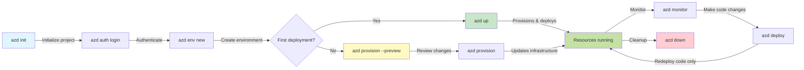
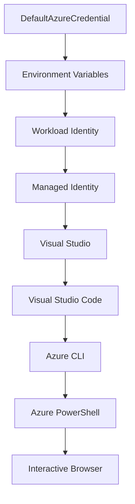

<!--
CO_OP_TRANSLATOR_METADATA:
{
  "original_hash": "e855e899d2705754fe85b04190edd0f0",
  "translation_date": "2025-11-19T09:49:43+00:00",
  "source_file": "docs/getting-started/azd-basics.md",
  "language_code": "zh"
}
-->
# AZD 基础知识 - 了解 Azure Developer CLI

# AZD 基础知识 - 核心概念与基础

**章节导航：**
- **📚 课程主页**：[AZD 初学者指南](../../README.md)
- **📖 当前章节**：第1章 - 基础与快速入门
- **⬅️ 上一章**：[课程概览](../../README.md#-chapter-1-foundation--quick-start)
- **➡️ 下一章**：[安装与设置](installation.md)
- **🚀 下一章节**：[第2章：以 AI 为核心的开发](../microsoft-foundry/microsoft-foundry-integration.md)

## 简介

本课程将向您介绍 Azure Developer CLI (azd)，这是一款强大的命令行工具，可加速从本地开发到 Azure 部署的过程。您将学习 azd 的基本概念、核心功能，并了解它如何简化云原生应用的部署。

## 学习目标

完成本课程后，您将能够：
- 了解 Azure Developer CLI 的定义及其主要用途
- 学习模板、环境和服务的核心概念
- 探索模板驱动开发和基础设施即代码的关键功能
- 理解 azd 项目结构和工作流程
- 为您的开发环境安装和配置 azd 做好准备

## 学习成果

完成本课程后，您将能够：
- 解释 azd 在现代云开发工作流程中的作用
- 识别 azd 项目结构的组成部分
- 描述模板、环境和服务如何协同工作
- 理解使用 azd 的基础设施即代码的优势
- 识别不同的 azd 命令及其用途

## 什么是 Azure Developer CLI (azd)？

Azure Developer CLI (azd) 是一个命令行工具，旨在加速从本地开发到 Azure 部署的过程。它简化了在 Azure 上构建、部署和管理云原生应用的流程。

### 🎯 为什么使用 AZD？现实场景对比

让我们比较一下部署一个简单的带数据库的 Web 应用：

#### ❌ 没有 AZD：手动 Azure 部署（30+ 分钟）

```bash
# Step 1: Create resource group
az group create --name myapp-rg --location eastus

# Step 2: Create App Service Plan
az appservice plan create --name myapp-plan \
  --resource-group myapp-rg \
  --sku B1 --is-linux

# Step 3: Create Web App
az webapp create --name myapp-web-unique123 \
  --resource-group myapp-rg \
  --plan myapp-plan \
  --runtime "NODE:18-lts"

# Step 4: Create Cosmos DB account (10-15 minutes)
az cosmosdb create --name myapp-cosmos-unique123 \
  --resource-group myapp-rg \
  --kind MongoDB

# Step 5: Create database
az cosmosdb mongodb database create \
  --account-name myapp-cosmos-unique123 \
  --resource-group myapp-rg \
  --name tododb

# Step 6: Create collection
az cosmosdb mongodb collection create \
  --account-name myapp-cosmos-unique123 \
  --resource-group myapp-rg \
  --database-name tododb \
  --name todos

# Step 7: Get connection string
CONN_STR=$(az cosmosdb keys list \
  --name myapp-cosmos-unique123 \
  --resource-group myapp-rg \
  --type connection-strings \
  --query "connectionStrings[0].connectionString" -o tsv)

# Step 8: Configure app settings
az webapp config appsettings set \
  --name myapp-web-unique123 \
  --resource-group myapp-rg \
  --settings MONGODB_URI="$CONN_STR"

# Step 9: Enable logging
az webapp log config --name myapp-web-unique123 \
  --resource-group myapp-rg \
  --application-logging filesystem \
  --detailed-error-messages true

# Step 10: Set up Application Insights
az monitor app-insights component create \
  --app myapp-insights \
  --location eastus \
  --resource-group myapp-rg

# Step 11: Link App Insights to Web App
INSTRUMENTATION_KEY=$(az monitor app-insights component show \
  --app myapp-insights \
  --resource-group myapp-rg \
  --query "instrumentationKey" -o tsv)

az webapp config appsettings set \
  --name myapp-web-unique123 \
  --resource-group myapp-rg \
  --settings APPINSIGHTS_INSTRUMENTATIONKEY="$INSTRUMENTATION_KEY"

# Step 12: Build application locally
npm install
npm run build

# Step 13: Create deployment package
zip -r app.zip . -x "*.git*" "node_modules/*"

# Step 14: Deploy application
az webapp deployment source config-zip \
  --resource-group myapp-rg \
  --name myapp-web-unique123 \
  --src app.zip

# Step 15: Wait and pray it works 🙏
# (No automated validation, manual testing required)
```

**问题：**
- ❌ 需要记住并按顺序执行 15+ 个命令
- ❌ 30-45 分钟的手动操作
- ❌ 容易出错（输入错误、参数错误）
- ❌ 连接字符串暴露在终端历史记录中
- ❌ 如果失败，没有自动回滚
- ❌ 团队成员难以复制
- ❌ 每次都不同（不可重复）

#### ✅ 使用 AZD：自动化部署（5 个命令，10-15 分钟）

```bash
# Step 1: Initialize from template
azd init --template todo-nodejs-mongo

# Step 2: Authenticate
azd auth login

# Step 3: Create environment
azd env new dev

# Step 4: Preview changes (optional but recommended)
azd provision --preview

# Step 5: Deploy everything
azd up

# ✨ Done! Everything is deployed, configured, and monitored
```

**优势：**
- ✅ **5 个命令** vs. 15+ 手动步骤
- ✅ **10-15 分钟** 总时间（主要是等待 Azure）
- ✅ **零错误** - 自动化且经过测试
- ✅ **安全管理机密** - 通过 Key Vault
- ✅ **自动回滚** - 失败时自动回滚
- ✅ **完全可重复** - 每次结果一致
- ✅ **团队友好** - 任何人都可以使用相同命令部署
- ✅ **基础设施即代码** - 版本控制的 Bicep 模板
- ✅ **内置监控** - 自动配置 Application Insights

### 📊 时间与错误减少

| 指标 | 手动部署 | AZD 部署 | 改善 |
|:-------|:------------------|:---------------|:------------|
| **命令数** | 15+ | 5 | 减少 67% |
| **时间** | 30-45 分钟 | 10-15 分钟 | 快 60% |
| **错误率** | ~40% | <5% | 减少 88% |
| **一致性** | 低（手动） | 100%（自动化） | 完美 |
| **团队入门时间** | 2-4 小时 | 30 分钟 | 快 75% |
| **回滚时间** | 30+ 分钟（手动） | 2 分钟（自动化） | 快 93% |

## 核心概念

### 模板
模板是 azd 的基础。它包含：
- **应用代码** - 您的源代码和依赖项
- **基础设施定义** - 使用 Bicep 或 Terraform 定义的 Azure 资源
- **配置文件** - 设置和环境变量
- **部署脚本** - 自动化部署工作流

### 环境
环境代表不同的部署目标：
- **开发** - 用于测试和开发
- **预生产** - 生产前环境
- **生产** - 实时生产环境

每个环境都有自己的：
- Azure 资源组
- 配置设置
- 部署状态

### 服务
服务是您应用的构建模块：
- **前端** - Web 应用、单页应用
- **后端** - API、微服务
- **数据库** - 数据存储解决方案
- **存储** - 文件和 Blob 存储

## 关键功能

### 1. 模板驱动开发
```bash
# Browse available templates
azd template list

# Initialize from a template
azd init --template <template-name>
```

### 2. 基础设施即代码
- **Bicep** - Azure 的领域专用语言
- **Terraform** - 多云基础设施工具
- **ARM 模板** - Azure Resource Manager 模板

### 3. 集成工作流
```bash
# Complete deployment workflow
azd up            # Provision + Deploy this is hands off for first time setup

# 🧪 NEW: Preview infrastructure changes before deployment (SAFE)
azd provision --preview    # Simulate infrastructure deployment without making changes

azd provision     # Create Azure resources if you update the infrastructure use this
azd deploy        # Deploy application code or redeploy application code once update
azd down          # Clean up resources
```

#### 🛡️ 安全的基础设施规划与预览
`azd provision --preview` 命令是安全部署的变革者：
- **干运行分析** - 显示将创建、修改或删除的内容
- **零风险** - 不会对 Azure 环境进行实际更改
- **团队协作** - 在部署前共享预览结果
- **成本估算** - 在承诺前了解资源成本

```bash
# Example preview workflow
azd provision --preview           # See what will change
# Review the output, discuss with team
azd provision                     # Apply changes with confidence
```

### 📊 可视化：AZD 开发工作流



**工作流说明：**
1. **初始化** - 从模板或新项目开始
2. **认证** - 与 Azure 进行身份验证
3. **环境** - 创建独立的部署环境
4. **预览** - 🆕 始终先预览基础设施更改（安全实践）
5. **配置** - 创建/更新 Azure 资源
6. **部署** - 推送您的应用代码
7. **监控** - 观察应用性能
8. **迭代** - 进行更改并重新部署代码
9. **清理** - 完成后删除资源

### 4. 环境管理
```bash
# Create and manage environments
azd env new <environment-name>
azd env select <environment-name>
azd env list
```

## 📁 项目结构

一个典型的 azd 项目结构：
```
my-app/
├── .azd/                    # azd configuration
│   └── config.json
├── .azure/                  # Azure deployment artifacts
├── .devcontainer/          # Development container config
├── .github/workflows/      # GitHub Actions
├── .vscode/               # VS Code settings
├── infra/                 # Infrastructure code
│   ├── main.bicep        # Main infrastructure template
│   ├── main.parameters.json
│   └── modules/          # Reusable modules
├── src/                  # Application source code
│   ├── api/             # Backend services
│   └── web/             # Frontend application
├── azure.yaml           # azd project configuration
└── README.md
```

## 🔧 配置文件

### azure.yaml
主要项目配置文件：
```yaml
name: my-awesome-app
metadata:
  template: my-template@1.0.0

services:
  web:
    project: ./src/web
    language: js
    host: appservice
  api:
    project: ./src/api
    language: js
    host: appservice

hooks:
  preprovision:
    shell: pwsh
    run: echo "Preparing to provision..."
```

### .azure/config.json
特定环境的配置：
```json
{
  "version": 1,
  "defaultEnvironment": "dev",
  "environments": {
    "dev": {
      "subscriptionId": "your-subscription-id",
      "location": "eastus"
    }
  }
}
```

## 🎪 常见工作流与实践练习

> **💡 学习提示：** 按顺序完成这些练习，以逐步提升您的 AZD 技能。

### 🎯 练习 1：初始化您的第一个项目

**目标：** 创建一个 AZD 项目并探索其结构

**步骤：**
```bash
# Use a proven template
azd init --template todo-nodejs-mongo

# Explore the generated files
ls -la  # View all files including hidden ones

# Key files created:
# - azure.yaml (main config)
# - infra/ (infrastructure code)
# - src/ (application code)
```

**✅ 成功：** 您拥有 azure.yaml、infra/ 和 src/ 目录

---

### 🎯 练习 2：部署到 Azure

**目标：** 完成端到端部署

**步骤：**
```bash
# 1. Authenticate
az login && azd auth login

# 2. Create environment
azd env new dev
azd env set AZURE_LOCATION eastus

# 3. Preview changes (RECOMMENDED)
azd provision --preview

# 4. Deploy everything
azd up

# 5. Verify deployment
azd show    # View your app URL
```

**预计时间：** 10-15 分钟  
**✅ 成功：** 应用 URL 在浏览器中打开

---

### 🎯 练习 3：多个环境

**目标：** 部署到开发和预生产环境

**步骤：**
```bash
# Already have dev, create staging
azd env new staging
azd env set AZURE_LOCATION westus2
azd up

# Switch between them
azd env list
azd env select dev
```

**✅ 成功：** Azure Portal 中有两个独立的资源组

---

### 🛡️ 清理：`azd down --force --purge`

当您需要完全重置时：

```bash
azd down --force --purge
```

**它的作用：**
- `--force`：无确认提示
- `--purge`：删除所有本地状态和 Azure 资源

**使用场景：**
- 部署中途失败
- 切换项目
- 需要全新开始

---

## 🎪 原始工作流参考

### 开始一个新项目
```bash
# Method 1: Use existing template
azd init --template todo-nodejs-mongo

# Method 2: Start from scratch
azd init

# Method 3: Use current directory
azd init .
```

### 开发周期
```bash
# Set up development environment
azd auth login
azd env new dev
azd env select dev

# Deploy everything
azd up

# Make changes and redeploy
azd deploy

# Clean up when done
azd down --force --purge # command in the Azure Developer CLI is a **hard reset** for your environment—especially useful when you're troubleshooting failed deployments, cleaning up orphaned resources, or prepping for a fresh redeploy.
```

## 了解 `azd down --force --purge`
`azd down --force --purge` 命令是完全拆除 azd 环境及所有相关资源的强大方式。以下是每个标志的作用：
```
--force
```
- 跳过确认提示。
- 适用于自动化或脚本化场景，无需手动输入。
- 确保拆除过程不受干扰，即使 CLI 检测到不一致。

```
--purge
```
删除 **所有相关元数据**，包括：
环境状态  
本地 `.azure` 文件夹  
缓存的部署信息  
防止 azd "记住" 之前的部署，这可能导致资源组不匹配或过时的注册表引用问题。

### 为什么同时使用？
当您因遗留状态或部分部署问题而在 `azd up` 上遇到障碍时，这个组合可以确保 **干净的开始**。

它在手动删除 Azure Portal 中的资源后，或切换模板、环境或资源组命名约定时特别有用。

### 管理多个环境
```bash
# Create staging environment
azd env new staging
azd env select staging
azd up

# Switch back to dev
azd env select dev

# Compare environments
azd env list
```

## 🔐 身份验证与凭据

理解身份验证对于成功的 azd 部署至关重要。Azure 使用多种身份验证方法，而 azd 利用与其他 Azure 工具相同的凭据链。

### Azure CLI 身份验证 (`az login`)

在使用 azd 之前，您需要通过 Azure 进行身份验证。最常见的方法是使用 Azure CLI：

```bash
# Interactive login (opens browser)
az login

# Login with specific tenant
az login --tenant <tenant-id>

# Login with service principal
az login --service-principal -u <app-id> -p <password> --tenant <tenant-id>

# Check current login status
az account show

# List available subscriptions
az account list --output table

# Set default subscription
az account set --subscription <subscription-id>
```

### 身份验证流程
1. **交互式登录**：打开默认浏览器进行身份验证
2. **设备代码流程**：适用于没有浏览器访问的环境
3. **服务主体**：适用于自动化和 CI/CD 场景
4. **托管身份**：适用于 Azure 托管的应用

### DefaultAzureCredential 链

`DefaultAzureCredential` 是一种凭据类型，通过自动尝试特定顺序的多个凭据源提供简化的身份验证体验：

#### 凭据链顺序


#### 1. 环境变量
```bash
# Set environment variables for service principal
export AZURE_CLIENT_ID="<app-id>"
export AZURE_CLIENT_SECRET="<password>"
export AZURE_TENANT_ID="<tenant-id>"
```

#### 2. 工作负载身份（Kubernetes/GitHub Actions）
自动用于：
- Azure Kubernetes Service (AKS) 的工作负载身份
- GitHub Actions 的 OIDC 联邦
- 其他联邦身份场景

#### 3. 托管身份
适用于 Azure 资源，例如：
- 虚拟机
- 应用服务
- Azure Functions
- 容器实例

```bash
# Check if running on Azure resource with managed identity
az account show --query "user.type" --output tsv
# Returns: "servicePrincipal" if using managed identity
```

#### 4. 开发工具集成
- **Visual Studio**：自动使用登录账户
- **VS Code**：使用 Azure Account 扩展凭据
- **Azure CLI**：使用 `az login` 凭据（本地开发最常用）

### AZD 身份验证设置

```bash
# Method 1: Use Azure CLI (Recommended for development)
az login
azd auth login  # Uses existing Azure CLI credentials

# Method 2: Direct azd authentication
azd auth login --use-device-code  # For headless environments

# Method 3: Check authentication status
azd auth login --check-status

# Method 4: Logout and re-authenticate
azd auth logout
azd auth login
```

### 身份验证最佳实践

#### 对于本地开发
```bash
# 1. Login with Azure CLI
az login

# 2. Verify correct subscription
az account show
az account set --subscription "Your Subscription Name"

# 3. Use azd with existing credentials
azd auth login
```

#### 对于 CI/CD 管道
```yaml
# GitHub Actions example
- name: Azure Login
  uses: azure/login@v1
  with:
    creds: ${{ secrets.AZURE_CREDENTIALS }}

- name: Deploy with azd
  run: |
    azd auth login --client-id ${{ secrets.AZURE_CLIENT_ID }} \
                    --client-secret ${{ secrets.AZURE_CLIENT_SECRET }} \
                    --tenant-id ${{ secrets.AZURE_TENANT_ID }}
    azd up --no-prompt
```

#### 对于生产环境
- 在 Azure 资源上运行时使用 **托管身份**
- 对于自动化场景使用 **服务主体**
- 避免在代码或配置文件中存储凭据
- 使用 **Azure Key Vault** 存储敏感配置

### 常见身份验证问题及解决方案

#### 问题："未找到订阅"
```bash
# Solution: Set default subscription
az account list --output table
az account set --subscription "<subscription-id>"
azd env set AZURE_SUBSCRIPTION_ID "<subscription-id>"
```

#### 问题："权限不足"
```bash
# Solution: Check and assign required roles
az role assignment list --assignee $(az account show --query user.name --output tsv)

# Common required roles:
# - Contributor (for resource management)
# - User Access Administrator (for role assignments)
```

#### 问题："令牌过期"
```bash
# Solution: Re-authenticate
az logout
az login
azd auth logout
azd auth login
```

### 不同场景下的身份验证

#### 本地开发
```bash
# Personal development account
az login
azd auth login
```

#### 团队开发
```bash
# Use specific tenant for organization
az login --tenant contoso.onmicrosoft.com
azd auth login
```

#### 多租户场景
```bash
# Switch between tenants
az login --tenant tenant1.onmicrosoft.com
# Deploy to tenant 1
azd up

az login --tenant tenant2.onmicrosoft.com  
# Deploy to tenant 2
azd up
```

### 安全注意事项

1. **凭据存储**：切勿在源代码中存储凭据
2. **范围限制**：对服务主体使用最小权限原则
3. **令牌轮换**：定期轮换服务主体密钥
4. **审计跟踪**：监控身份验证和部署活动
5. **网络安全**：尽可能使用私有端点

### 身份验证故障排除

```bash
# Debug authentication issues
azd auth login --check-status
az account show
az account get-access-token

# Common diagnostic commands
whoami                          # Current user context
az ad signed-in-user show      # Azure AD user details
az group list                  # Test resource access
```

## 了解 `azd down --force --purge`

### 发现
```bash
azd template list              # Browse templates
azd template show <template>   # Template details
azd init --help               # Initialization options
```

### 项目管理
```bash
azd show                     # Project overview
azd env show                 # Current environment
azd config list             # Configuration settings
```

### 监控
```bash
azd monitor                  # Open Azure portal
azd pipeline config          # Set up CI/CD
azd logs                     # View application logs
```

## 最佳实践

### 1. 使用有意义的名称
```bash
# Good
azd env new production-east
azd init --template web-app-secure

# Avoid
azd env new env1
azd init --template template1
```

### 2. 利用模板
- 从现有模板开始
- 根据需求进行定制
- 为您的组织创建可重复使用的模板

### 3. 环境隔离
- 为开发/预生产/生产使用独立环境
- 切勿直接从本地机器部署到生产环境
- 使用 CI/CD 管道进行生产部署

### 4. 配置管理
- 对敏感数据使用环境变量
- 将配置保存在版本控制中
- 记录环境特定设置

## 学习进度

### 初学者（第1-2周）
1. 安装 azd 并进行身份验证
2. 部署一个简单的模板
3. 理解项目结构
4. 学习基本命令（up, down, deploy）

### 中级（第3-4周）
1. 定制模板
2. 管理多个环境
3. 理解基础设施代码
4. 设置 CI/CD 管道

### 高级（第5周及以后）
1. 创建自定义模板
2. 高级基础设施模式
3. 多区域部署
4. 企业级配置

## 下一步

**📖 继续学习第1章：**
- [安装与设置](installation.md) - 安装并配置 azd
- [你的第一个项目](first-project.md) - 完整的实践教程
- [配置指南](configuration.md) - 高级配置选项

**🎯 准备好进入下一章了吗？**
- [第2章：AI优先开发](../microsoft-foundry/microsoft-foundry-integration.md) - 开始构建AI应用

## 其他资源

- [Azure Developer CLI 概述](https://learn.microsoft.com/en-us/azure/developer/azure-developer-cli/)
- [模板库](https://azure.github.io/awesome-azd/)
- [社区示例](https://github.com/Azure-Samples)

---

## 🙋 常见问题解答

### 常规问题

**问：AZD 和 Azure CLI 有什么区别？**

答：Azure CLI (`az`) 用于管理单个 Azure 资源，而 AZD (`azd`) 用于管理整个应用程序：

```bash
# Azure CLI - Low-level resource management
az webapp create --name myapp --resource-group rg
az sql server create --name myserver --resource-group rg
# ...many more commands needed

# AZD - Application-level management
azd up  # Deploys entire app with all resources
```

**可以这样理解：**
- `az` = 操作单个乐高积木
- `azd` = 操作完整的乐高套装

---

**问：使用 AZD 需要了解 Bicep 或 Terraform 吗？**

答：不需要！可以从模板开始：
```bash
# Use existing template - no IaC knowledge needed
azd init --template todo-nodejs-mongo
azd up
```

之后可以学习 Bicep 来定制基础设施。模板提供了可学习的工作示例。

---

**问：运行 AZD 模板需要多少钱？**

答：费用因模板而异。大多数开发模板每月费用在 $50-150 之间：

```bash
# Preview costs before deploying
azd provision --preview

# Always cleanup when not using
azd down --force --purge  # Removes all resources
```

**小贴士：** 使用免费层（如果有）：
- 应用服务：F1（免费）层
- Azure OpenAI：每月 50,000 个免费令牌
- Cosmos DB：每月 1000 RU/s 免费层

---

**问：我可以将 AZD 与现有的 Azure 资源一起使用吗？**

答：可以，但从头开始会更容易。AZD 在管理完整生命周期时效果最佳。对于现有资源：

```bash
# Option 1: Import existing resources (advanced)
azd init
# Then modify infra/ to reference existing resources

# Option 2: Start fresh (recommended)
azd init --template matching-your-stack
azd up  # Creates new environment
```

---

**问：如何与团队成员共享我的项目？**

答：将 AZD 项目提交到 Git（但不要提交 .azure 文件夹）：

```bash
# Already in .gitignore by default
.azure/        # Contains secrets and environment data
*.env          # Environment variables

# Team members then:
git clone <your-repo>
azd auth login
azd env new <their-name>-dev
azd up
```

每个人都可以从相同的模板中获得相同的基础设施。

---

### 故障排除问题

**问：“azd up” 中途失败了。我该怎么办？**

答：检查错误，修复后重试：

```bash
# View detailed logs
azd show

# Common fixes:

# 1. If quota exceeded:
azd env set AZURE_LOCATION "westus2"  # Try different region

# 2. If resource name conflict:
azd down --force --purge  # Clean slate
azd up  # Retry

# 3. If auth expired:
az login
azd auth login
azd up
```

**最常见的问题：** 选择了错误的 Azure 订阅
```bash
az account list --output table
az account set --subscription "<correct-subscription>"
```

---

**问：如何仅部署代码更改而不重新配置？**

答：使用 `azd deploy` 而不是 `azd up`：

```bash
azd up          # First time: provision + deploy (slow)

# Make code changes...

azd deploy      # Subsequent times: deploy only (fast)
```

速度对比：
- `azd up`：10-15 分钟（配置基础设施）
- `azd deploy`：2-5 分钟（仅代码）

---

**问：我可以自定义基础设施模板吗？**

答：可以！编辑 `infra/` 中的 Bicep 文件：

```bash
# After azd init
cd infra/
code main.bicep  # Edit in VS Code

# Preview changes
azd provision --preview

# Apply changes
azd provision
```

**提示：** 从小处开始 - 先更改 SKU：
```bicep
// infra/main.bicep
sku: {
  name: 'B1'  // Change to 'P1V2' for production
}
```

---

**问：如何删除 AZD 创建的所有内容？**

答：一个命令即可删除所有资源：

```bash
azd down --force --purge

# This deletes:
# - All Azure resources
# - Resource group
# - Local environment state
# - Cached deployment data
```

**务必在以下情况下运行此命令：**
- 测试模板完成后
- 切换到不同项目时
- 想要重新开始时

**节省成本：** 删除未使用的资源 = $0 费用

---

**问：如果我在 Azure 门户中意外删除了资源怎么办？**

答：AZD 状态可能会不同步。建议采用清理重置的方法：

```bash
# 1. Remove local state
azd down --force --purge

# 2. Start fresh
azd up

# Alternative: Let AZD detect and fix
azd provision  # Will create missing resources
```

---

### 高级问题

**问：我可以在 CI/CD 流水线中使用 AZD 吗？**

答：可以！GitHub Actions 示例：

```yaml
# .github/workflows/deploy.yml
name: Deploy with AZD

on:
  push:
    branches: [main]

jobs:
  deploy:
    runs-on: ubuntu-latest
    steps:
      - uses: actions/checkout@v2
      
      - name: Install azd
        run: curl -fsSL https://aka.ms/install-azd.sh | bash
      
      - name: Azure Login
        run: |
          azd auth login \
            --client-id ${{ secrets.AZURE_CLIENT_ID }} \
            --client-secret ${{ secrets.AZURE_CLIENT_SECRET }} \
            --tenant-id ${{ secrets.AZURE_TENANT_ID }}
      
      - name: Deploy
        run: azd up --no-prompt
```

---

**问：如何处理机密和敏感数据？**

答：AZD 自动集成 Azure Key Vault：

```bash
# Secrets are stored in Key Vault, not in code
azd env set DATABASE_PASSWORD "$(openssl rand -base64 32)"

# AZD automatically:
# 1. Creates Key Vault
# 2. Stores secret
# 3. Grants app access via Managed Identity
# 4. Injects at runtime
```

**切勿提交：**
- `.azure/` 文件夹（包含环境数据）
- `.env` 文件（本地机密）
- 连接字符串

---

**问：我可以部署到多个区域吗？**

答：可以，为每个区域创建一个环境：

```bash
# East US environment
azd env new prod-eastus
azd env set AZURE_LOCATION eastus
azd up

# West Europe environment
azd env new prod-westeurope
azd env set AZURE_LOCATION westeurope
azd up

# Each environment is independent
azd env list
```

对于真正的多区域应用，定制 Bicep 模板以同时部署到多个区域。

---

**问：如果遇到问题，我可以在哪里寻求帮助？**

1. **AZD 文档：** https://learn.microsoft.com/azure/developer/azure-developer-cli/
2. **GitHub 问题：** https://github.com/Azure/azure-dev/issues
3. **Discord：** [Azure Discord](https://discord.gg/microsoft-azure) - #azure-developer-cli 频道
4. **Stack Overflow：** 标签 `azure-developer-cli`
5. **本课程：** [故障排除指南](../troubleshooting/common-issues.md)

**小贴士：** 在提问前运行：
```bash
azd show       # Shows current state
azd version    # Shows your version
```
在问题中包含这些信息以加快帮助速度。

---

## 🎓 接下来做什么？

你现在已经了解了 AZD 的基础知识。选择你的路径：

### 🎯 对于初学者：
1. **下一步：** [安装与设置](installation.md) - 在你的设备上安装 AZD
2. **然后：** [你的第一个项目](first-project.md) - 部署你的第一个应用
3. **练习：** 完成本课中的所有 3 个练习

### 🚀 对于 AI 开发者：
1. **跳到：** [第2章：AI优先开发](../microsoft-foundry/microsoft-foundry-integration.md)
2. **部署：** 从 `azd init --template get-started-with-ai-chat` 开始
3. **学习：** 在部署中学习构建

### 🏗️ 对于有经验的开发者：
1. **回顾：** [配置指南](configuration.md) - 高级设置
2. **探索：** [基础设施即代码](../deployment/provisioning.md) - 深入了解 Bicep
3. **构建：** 为你的技术栈创建自定义模板

---

**章节导航：**
- **📚 课程主页：** [AZD 初学者指南](../../README.md)
- **📖 当前章节：** 第1章 - 基础与快速入门  
- **⬅️ 上一节：** [课程概览](../../README.md#-chapter-1-foundation--quick-start)
- **➡️ 下一节：** [安装与设置](installation.md)
- **🚀 下一章：** [第2章：AI优先开发](../microsoft-foundry/microsoft-foundry-integration.md)

---

<!-- CO-OP TRANSLATOR DISCLAIMER START -->
**免责声明**：  
本文档使用AI翻译服务[Co-op Translator](https://github.com/Azure/co-op-translator)进行翻译。尽管我们努力确保翻译的准确性，但请注意，自动翻译可能包含错误或不准确之处。原始语言的文档应被视为权威来源。对于关键信息，建议使用专业人工翻译。我们对因使用此翻译而产生的任何误解或误读不承担责任。
<!-- CO-OP TRANSLATOR DISCLAIMER END -->