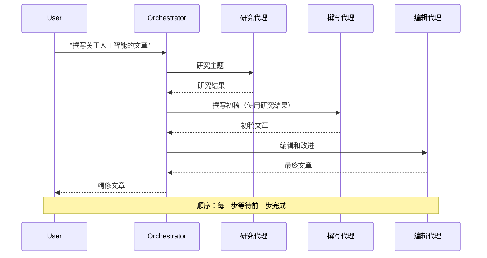
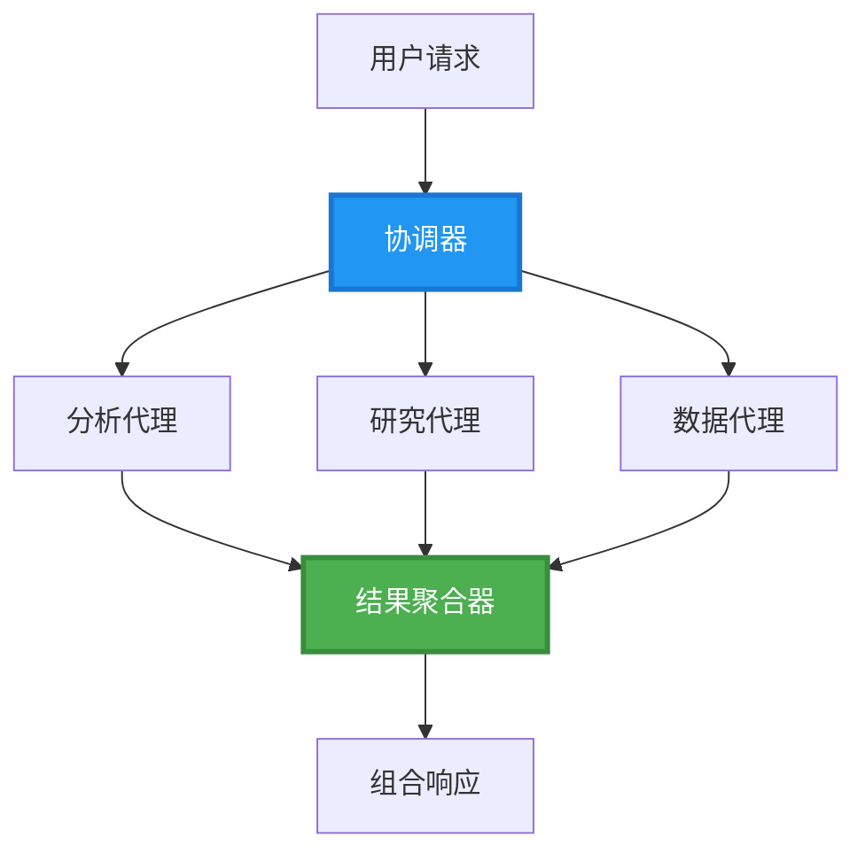
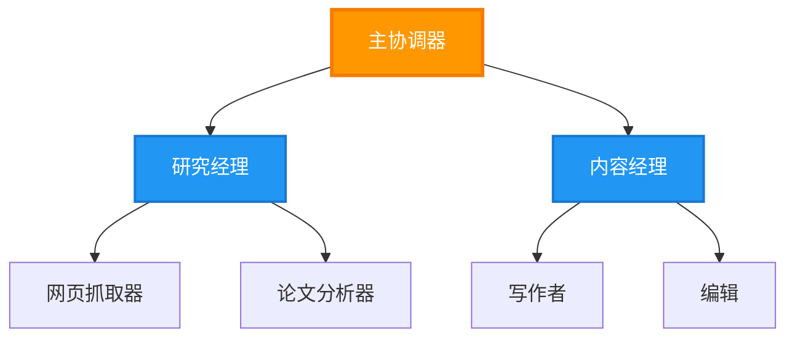
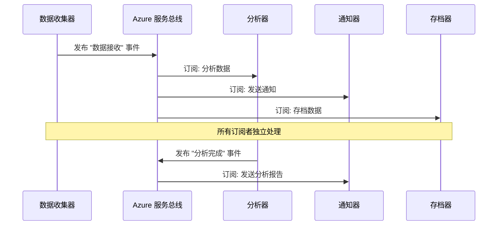
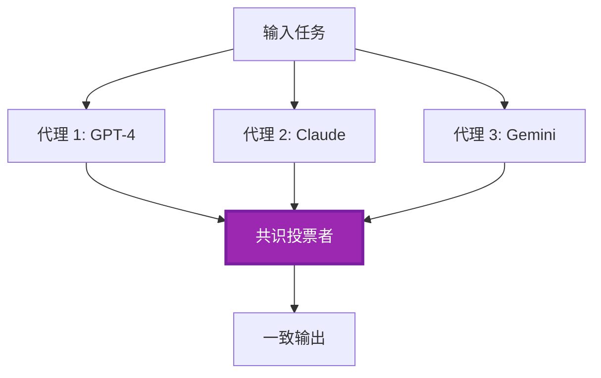
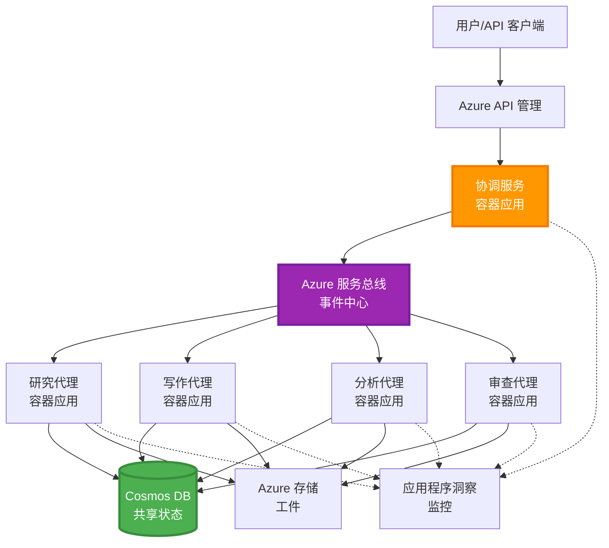

<!--
CO_OP_TRANSLATOR_METADATA:
{
  "original_hash": "bcefbd5d0107691ef3e6e33ba694d6f4",
  "translation_date": "2025-11-19T16:29:35+00:00",
  "source_file": "docs/pre-deployment/coordination-patterns.md",
  "language_code": "zh"
}
-->
# 多代理协调模式

⏱️ **预计时间**：60-75 分钟 | 💰 **预计成本**：~$100-300/月 | ⭐ **复杂度**：高级

**📚 学习路径：**
- ← 上一节：[容量规划](capacity-planning.md) - 资源大小和扩展策略
- 🎯 **当前位置**：多代理协调模式（编排、通信、状态管理）
- → 下一节：[SKU 选择](sku-selection.md) - 选择合适的 Azure 服务
- 🏠 [课程主页](../../README.md)

---

## 你将学到什么

完成本课程后，你将能够：
- 理解**多代理架构**模式及其适用场景
- 实现**编排模式**（集中式、分布式、分层式）
- 设计**代理通信**策略（同步、异步、事件驱动）
- 管理分布式代理的**共享状态**
- 在 Azure 上使用 AZD 部署**多代理系统**
- 将**协调模式**应用于实际 AI 场景
- 监控和调试分布式代理系统

## 为什么多代理协调很重要

### 演变：从单代理到多代理

**单代理（简单）：**
```
User → Agent → Response
```

- ✅ 易于理解和实现
- ✅ 简单任务执行快速
- ❌ 受限于单一模型的能力
- ❌ 无法并行处理复杂任务
- ❌ 无专业化

**多代理系统（高级）：**
```
           ┌─────────────┐
           │ Orchestrator│
           └──────┬──────┘
        ┌─────────┼─────────┐
        │         │         │
    ┌───▼──┐  ┌──▼───┐  ┌──▼────┐
    │Agent1│  │Agent2│  │Agent3 │
    │(Plan)│  │(Code)│  │(Review)│
    └──────┘  └──────┘  └───────┘
```

- ✅ 专业化代理处理特定任务
- ✅ 并行执行提高速度
- ✅ 模块化且易于维护
- ✅ 更适合复杂工作流
- ⚠️ 需要协调逻辑

**类比**：单代理就像一个人完成所有任务；多代理就像一个团队，每个成员都有专长（研究员、程序员、审稿人、作者），共同协作完成任务。

---

## 核心协调模式

### 模式 1：顺序协调（责任链）

**适用场景**：任务必须按特定顺序完成，每个代理基于前一个的输出。


**优点：**
- ✅ 数据流清晰
- ✅ 易于调试
- ✅ 执行顺序可预测

**局限性：**
- ❌ 较慢（无并行性）
- ❌ 一个失败会阻塞整个链条
- ❌ 无法处理相互依赖的任务

**示例用例：**
- 内容创建流水线（研究 → 写作 → 编辑 → 发布）
- 代码生成（规划 → 实现 → 测试 → 部署）
- 报告生成（数据收集 → 分析 → 可视化 → 总结）

---

### 模式 2：并行协调（扇出/扇入）

**适用场景**：独立任务可同时运行，结果在最后合并。


**优点：**
- ✅ 快速（并行执行）
- ✅ 容错性强（可接受部分结果）
- ✅ 水平扩展性好

**局限性：**
- ⚠️ 结果可能无序到达
- ⚠️ 需要聚合逻辑
- ⚠️ 状态管理复杂

**示例用例：**
- 多源数据收集（API + 数据库 + 网页抓取）
- 竞争性分析（多个模型生成解决方案，选择最佳）
- 翻译服务（同时翻译成多种语言）

---

### 模式 3：分层协调（管理者-工作者）

**适用场景**：复杂工作流包含子任务，需要委派。


**优点：**
- ✅ 处理复杂工作流
- ✅ 模块化且易于维护
- ✅ 职责边界清晰

**局限性：**
- ⚠️ 架构更复杂
- ⚠️ 延迟更高（多层协调）
- ⚠️ 需要复杂的编排

**示例用例：**
- 企业文档处理（分类 → 路由 → 处理 → 存档）
- 多阶段数据管道（摄取 → 清洗 → 转换 → 分析 → 报告）
- 复杂自动化工作流（规划 → 资源分配 → 执行 → 监控）

---

### 模式 4：事件驱动协调（发布-订阅）

**适用场景**：代理需要对事件作出反应，且需要松耦合。


**优点：**
- ✅ 代理之间松耦合
- ✅ 易于添加新代理（只需订阅）
- ✅ 异步处理
- ✅ 高弹性（消息持久化）

**局限性：**
- ⚠️ 最终一致性
- ⚠️ 调试复杂
- ⚠️ 消息排序问题

**示例用例：**
- 实时监控系统（警报、仪表盘、日志）
- 多渠道通知（电子邮件、短信、推送、Slack）
- 数据处理管道（同一数据的多个消费者）

---

### 模式 5：基于共识的协调（投票/法定人数）

**适用场景**：需要多个代理达成一致后才能继续。


**优点：**
- ✅ 更高的准确性（多方意见）
- ✅ 容错性强（少数失败可接受）
- ✅ 内置质量保证

**局限性：**
- ❌ 成本高（多次模型调用）
- ❌ 较慢（需等待所有代理）
- ⚠️ 需要冲突解决机制

**示例用例：**
- 内容审核（多个模型审查内容）
- 代码审查（多个静态分析工具）
- 医学诊断（多个 AI 模型，专家验证）

---

## 架构概览

### Azure 上完整的多代理系统


**关键组件：**

| 组件 | 目的 | Azure 服务 |
|------|------|------------|
| **API 网关** | 入口点、速率限制、认证 | API Management |
| **编排器** | 协调代理工作流 | Container Apps |
| **消息队列** | 异步通信 | Service Bus / Event Hubs |
| **代理** | 专业化 AI 工作者 | Container Apps / Functions |
| **状态存储** | 共享状态、任务跟踪 | Cosmos DB |
| **工件存储** | 文档、结果、日志 | Blob Storage |
| **监控** | 分布式跟踪、日志 | Application Insights |

---

## 前置条件

### 所需工具

```bash
# 验证 Azure 开发者 CLI
azd version
# ✅ 预期：azd 版本 1.0.0 或更高

# 验证 Azure CLI
az --version
# ✅ 预期：azure-cli 2.50.0 或更高

# 验证 Docker（用于本地测试）
docker --version
# ✅ 预期：Docker 版本 20.10 或更高
```

### Azure 要求

- 活跃的 Azure 订阅
- 创建以下资源的权限：
  - Container Apps
  - Service Bus 命名空间
  - Cosmos DB 账户
  - 存储账户
  - Application Insights

### 知识前提

你应该已完成：
- [配置管理](../getting-started/configuration.md)
- [认证与安全](../getting-started/authsecurity.md)
- [微服务示例](../../../../examples/microservices)

---

## 实现指南

### 项目结构

```
multi-agent-system/
├── azure.yaml                    # AZD configuration
├── infra/
│   ├── main.bicep               # Main infrastructure
│   ├── core/
│   │   ├── servicebus.bicep     # Message queue
│   │   ├── cosmos.bicep         # State store
│   │   ├── storage.bicep        # Artifact storage
│   │   └── monitoring.bicep     # Application Insights
│   └── app/
│       ├── orchestrator.bicep   # Orchestrator service
│       └── agent.bicep          # Agent template
└── src/
    ├── orchestrator/            # Orchestration logic
    │   ├── app.py
    │   ├── workflows.py
    │   └── Dockerfile
    ├── agents/
    │   ├── research/            # Research agent
    │   ├── writer/              # Writer agent
    │   ├── analyst/             # Analyst agent
    │   └── reviewer/            # Reviewer agent
    └── shared/
        ├── state_manager.py     # Shared state logic
        └── message_handler.py   # Message handling
```

---

## 课程 1：顺序协调模式

### 实现：内容创建流水线

我们将构建一个顺序流水线：研究 → 写作 → 编辑 → 发布

### 1. AZD 配置

**文件：`azure.yaml`**

```yaml
name: content-pipeline
metadata:
  template: multi-agent-sequential@1.0.0

services:
  orchestrator:
    project: ./src/orchestrator
    language: python
    host: containerapp
  
  research-agent:
    project: ./src/agents/research
    language: python
    host: containerapp
  
  writer-agent:
    project: ./src/agents/writer
    language: python
    host: containerapp
  
  editor-agent:
    project: ./src/agents/editor
    language: python
    host: containerapp
```

### 2. 基础设施：用于协调的 Service Bus

**文件：`infra/core/servicebus.bicep`**

```bicep
param name string
param location string
param tags object = {}

resource serviceBusNamespace 'Microsoft.ServiceBus/namespaces@2022-10-01-preview' = {
  name: name
  location: location
  tags: tags
  sku: {
    name: 'Standard'
    tier: 'Standard'
  }
  properties: {
    minimumTlsVersion: '1.2'
  }
}

// Queue for orchestrator → research agent
resource researchQueue 'Microsoft.ServiceBus/namespaces/queues@2022-10-01-preview' = {
  parent: serviceBusNamespace
  name: 'research-tasks'
  properties: {
    maxDeliveryCount: 3
    lockDuration: 'PT5M'
    deadLetteringOnMessageExpiration: true
  }
}

// Queue for research agent → writer agent
resource writerQueue 'Microsoft.ServiceBus/namespaces/queues@2022-10-01-preview' = {
  parent: serviceBusNamespace
  name: 'writer-tasks'
  properties: {
    maxDeliveryCount: 3
    lockDuration: 'PT5M'
  }
}

// Queue for writer agent → editor agent
resource editorQueue 'Microsoft.ServiceBus/namespaces/queues@2022-10-01-preview' = {
  parent: serviceBusNamespace
  name: 'editor-tasks'
  properties: {
    maxDeliveryCount: 3
    lockDuration: 'PT5M'
  }
}

output namespace string = serviceBusNamespace.name
output connectionString string = listKeys('${serviceBusNamespace.id}/AuthorizationRules/RootManageSharedAccessKey', serviceBusNamespace.apiVersion).primaryConnectionString
```

### 3. 共享状态管理器

**文件：`src/shared/state_manager.py`**

```python
from azure.cosmos import CosmosClient, PartitionKey
from datetime import datetime
import os

class StateManager:
    """Manages shared state across agents using Cosmos DB"""
    
    def __init__(self):
        endpoint = os.environ['COSMOS_ENDPOINT']
        key = os.environ['COSMOS_KEY']
        
        self.client = CosmosClient(endpoint, key)
        self.database = self.client.get_database_client('agent-state')
        self.container = self.database.get_container_client('tasks')
    
    def create_task(self, task_id: str, task_type: str, input_data: dict):
        """Create a new task"""
        task = {
            'id': task_id,
            'type': task_type,
            'status': 'pending',
            'input': input_data,
            'created_at': datetime.utcnow().isoformat(),
            'steps': []
        }
        self.container.create_item(task)
        return task
    
    def update_task_step(self, task_id: str, step_name: str, result: dict):
        """Update task with completed step"""
        task = self.container.read_item(task_id, partition_key=task_id)
        
        task['steps'].append({
            'name': step_name,
            'completed_at': datetime.utcnow().isoformat(),
            'result': result
        })
        
        self.container.replace_item(task_id, task)
        return task
    
    def complete_task(self, task_id: str, final_result: dict):
        """Mark task as complete"""
        task = self.container.read_item(task_id, partition_key=task_id)
        task['status'] = 'completed'
        task['result'] = final_result
        task['completed_at'] = datetime.utcnow().isoformat()
        self.container.replace_item(task_id, task)
        return task
    
    def get_task(self, task_id: str):
        """Retrieve task state"""
        return self.container.read_item(task_id, partition_key=task_id)
```

### 4. 编排服务

**文件：`src/orchestrator/app.py`**

```python
from flask import Flask, request, jsonify
from azure.servicebus import ServiceBusClient, ServiceBusMessage
import json
import uuid
import os
from shared.state_manager import StateManager

app = Flask(__name__)
state_manager = StateManager()

# 服务总线连接
servicebus_connection_str = os.environ['SERVICEBUS_CONNECTION_STRING']
servicebus_client = ServiceBusClient.from_connection_string(servicebus_connection_str)

@app.route('/health', methods=['GET'])
def health():
    return jsonify({'status': 'healthy', 'service': 'orchestrator'})

@app.route('/create-content', methods=['POST'])
def create_content():
    """
    Sequential workflow: Research → Write → Edit → Publish
    """
    data = request.json
    topic = data.get('topic')
    
    if not topic:
        return jsonify({'error': 'Topic required'}), 400
    
    # 在状态存储中创建任务
    task_id = str(uuid.uuid4())
    task = state_manager.create_task(
        task_id=task_id,
        task_type='content_creation',
        input_data={'topic': topic}
    )
    
    # 发送消息给研究代理（第一步）
    sender = servicebus_client.get_queue_sender('research-tasks')
    message = ServiceBusMessage(
        body=json.dumps({
            'task_id': task_id,
            'topic': topic,
            'next_queue': 'writer-tasks'  # 发送结果的地方
        }),
        content_type='application/json'
    )
    
    with sender:
        sender.send_messages(message)
    
    return jsonify({
        'task_id': task_id,
        'status': 'started',
        'workflow': 'sequential',
        'steps': ['research', 'write', 'edit', 'publish'],
        'message': 'Content creation pipeline initiated'
    }), 202

@app.route('/task/<task_id>', methods=['GET'])
def get_task_status(task_id):
    """Check task status"""
    try:
        task = state_manager.get_task(task_id)
        return jsonify(task)
    except Exception as e:
        return jsonify({'error': str(e)}), 404

if __name__ == '__main__':
    app.run(host='0.0.0.0', port=8080)
```

### 5. 研究代理

**文件：`src/agents/research/app.py`**

```python
from azure.servicebus import ServiceBusClient, ServiceBusMessage
from openai import AzureOpenAI
import json
import os
import time
from shared.state_manager import StateManager

# 初始化客户端
state_manager = StateManager()
servicebus_client = ServiceBusClient.from_connection_string(
    os.environ['SERVICEBUS_CONNECTION_STRING']
)

openai_client = AzureOpenAI(
    api_key=os.environ['AZURE_OPENAI_API_KEY'],
    api_version="2024-02-01",
    azure_endpoint=os.environ['AZURE_OPENAI_ENDPOINT']
)

def process_research_task(message_data):
    """Process research request and pass to writer"""
    task_id = message_data['task_id']
    topic = message_data['topic']
    next_queue = message_data['next_queue']
    
    print(f"🔬 Researching: {topic}")
    
    # 调用 Azure OpenAI 进行研究
    response = openai_client.chat.completions.create(
        model="gpt-4",
        messages=[
            {"role": "system", "content": "You are a research assistant. Provide comprehensive research on the given topic."},
            {"role": "user", "content": f"Research this topic thoroughly: {topic}"}
        ],
        max_tokens=1500
    )
    
    research_results = response.choices[0].message.content
    
    # 更新状态
    state_manager.update_task_step(
        task_id=task_id,
        step_name='research',
        result={'research': research_results}
    )
    
    # 发送到下一个代理（写入者）
    sender = servicebus_client.get_queue_sender(next_queue)
    message = ServiceBusMessage(
        body=json.dumps({
            'task_id': task_id,
            'topic': topic,
            'research': research_results,
            'next_queue': 'editor-tasks'
        }),
        content_type='application/json'
    )
    
    with sender:
        sender.send_messages(message)
    
    print(f"✅ Research complete for task {task_id}")

def main():
    """Listen to research queue"""
    receiver = servicebus_client.get_queue_receiver('research-tasks')
    
    print("🔬 Research Agent started, listening for tasks...")
    
    with receiver:
        while True:
            messages = receiver.receive_messages(max_wait_time=5)
            for message in messages:
                try:
                    message_data = json.loads(str(message))
                    process_research_task(message_data)
                    receiver.complete_message(message)
                except Exception as e:
                    print(f"❌ Error processing message: {e}")
                    receiver.abandon_message(message)

if __name__ == '__main__':
    main()
```

### 6. 写作代理

**文件：`src/agents/writer/app.py`**

```python
from azure.servicebus import ServiceBusClient, ServiceBusMessage
from openai import AzureOpenAI
import json
import os
from shared.state_manager import StateManager

state_manager = StateManager()
servicebus_client = ServiceBusClient.from_connection_string(
    os.environ['SERVICEBUS_CONNECTION_STRING']
)

openai_client = AzureOpenAI(
    api_key=os.environ['AZURE_OPENAI_API_KEY'],
    api_version="2024-02-01",
    azure_endpoint=os.environ['AZURE_OPENAI_ENDPOINT']
)

def process_writing_task(message_data):
    """Write article based on research"""
    task_id = message_data['task_id']
    topic = message_data['topic']
    research = message_data['research']
    next_queue = message_data['next_queue']
    
    print(f"✍️ Writing article: {topic}")
    
    # 调用 Azure OpenAI 撰写文章
    response = openai_client.chat.completions.create(
        model="gpt-4",
        messages=[
            {"role": "system", "content": "You are a professional writer. Write engaging, well-structured articles."},
            {"role": "user", "content": f"Based on this research:\n\n{research}\n\nWrite a comprehensive article about: {topic}"}
        ],
        max_tokens=2000
    )
    
    article_draft = response.choices[0].message.content
    
    # 更新状态
    state_manager.update_task_step(
        task_id=task_id,
        step_name='writing',
        result={'draft': article_draft}
    )
    
    # 发送给编辑
    sender = servicebus_client.get_queue_sender(next_queue)
    message = ServiceBusMessage(
        body=json.dumps({
            'task_id': task_id,
            'topic': topic,
            'draft': article_draft
        }),
        content_type='application/json'
    )
    
    with sender:
        sender.send_messages(message)
    
    print(f"✅ Article draft complete for task {task_id}")

def main():
    """Listen to writer queue"""
    receiver = servicebus_client.get_queue_receiver('writer-tasks')
    
    print("✍️ Writer Agent started, listening for tasks...")
    
    with receiver:
        while True:
            messages = receiver.receive_messages(max_wait_time=5)
            for message in messages:
                try:
                    message_data = json.loads(str(message))
                    process_writing_task(message_data)
                    receiver.complete_message(message)
                except Exception as e:
                    print(f"❌ Error: {e}")
                    receiver.abandon_message(message)

if __name__ == '__main__':
    main()
```

### 7. 编辑代理

**文件：`src/agents/editor/app.py`**

```python
from azure.servicebus import ServiceBusClient
from openai import AzureOpenAI
import json
import os
from shared.state_manager import StateManager

state_manager = StateManager()
servicebus_client = ServiceBusClient.from_connection_string(
    os.environ['SERVICEBUS_CONNECTION_STRING']
)

openai_client = AzureOpenAI(
    api_key=os.environ['AZURE_OPENAI_API_KEY'],
    api_version="2024-02-01",
    azure_endpoint=os.environ['AZURE_OPENAI_ENDPOINT']
)

def process_editing_task(message_data):
    """Edit and finalize article"""
    task_id = message_data['task_id']
    topic = message_data['topic']
    draft = message_data['draft']
    
    print(f"📝 Editing article: {topic}")
    
    # 调用 Azure OpenAI 进行编辑
    response = openai_client.chat.completions.create(
        model="gpt-4",
        messages=[
            {"role": "system", "content": "You are an expert editor. Improve grammar, clarity, and structure."},
            {"role": "user", "content": f"Edit and improve this article:\n\n{draft}"}
        ],
        max_tokens=2000
    )
    
    final_article = response.choices[0].message.content
    
    # 标记任务为完成
    state_manager.complete_task(
        task_id=task_id,
        final_result={
            'topic': topic,
            'final_article': final_article,
            'word_count': len(final_article.split())
        }
    )
    
    print(f"✅ Article finalized for task {task_id}")

def main():
    """Listen to editor queue"""
    receiver = servicebus_client.get_queue_receiver('editor-tasks')
    
    print("📝 Editor Agent started, listening for tasks...")
    
    with receiver:
        while True:
            messages = receiver.receive_messages(max_wait_time=5)
            for message in messages:
                try:
                    message_data = json.loads(str(message))
                    process_editing_task(message_data)
                    receiver.complete_message(message)
                except Exception as e:
                    print(f"❌ Error: {e}")
                    receiver.abandon_message(message)

if __name__ == '__main__':
    main()
```

### 8. 部署和测试

```bash
# 初始化并部署
azd init
azd up

# 获取编排器URL
ORCHESTRATOR_URL=$(azd env get-values | grep ORCHESTRATOR_URL | cut -d '=' -f2 | tr -d '"')

# 创建内容
curl -X POST $ORCHESTRATOR_URL/create-content \
  -H "Content-Type: application/json" \
  -d '{"topic": "The Future of AI in Healthcare"}'
```

**✅ 预期输出：**
```json
{
  "task_id": "a1b2c3d4-e5f6-7890-abcd-ef1234567890",
  "status": "started",
  "workflow": "sequential",
  "steps": ["research", "write", "edit", "publish"],
  "message": "Content creation pipeline initiated"
}
```

**检查任务进度：**
```bash
TASK_ID="a1b2c3d4-e5f6-7890-abcd-ef1234567890"
curl $ORCHESTRATOR_URL/task/$TASK_ID
```

**✅ 预期输出（完成）：**
```json
{
  "id": "a1b2c3d4-e5f6-7890-abcd-ef1234567890",
  "type": "content_creation",
  "status": "completed",
  "steps": [
    {
      "name": "research",
      "completed_at": "2025-11-19T10:30:00Z",
      "result": {"research": "..."}
    },
    {
      "name": "writing",
      "completed_at": "2025-11-19T10:32:00Z",
      "result": {"draft": "..."}
    }
  ],
  "result": {
    "topic": "The Future of AI in Healthcare",
    "final_article": "...",
    "word_count": 1500
  }
}
```

---

## 课程 2：并行协调模式

### 实现：多源研究聚合器

我们将构建一个并行系统，同时从多个来源收集信息。

### 并行编排器

**文件：`src/orchestrator/parallel_workflow.py`**

```python
from flask import Flask, request, jsonify
from azure.servicebus import ServiceBusClient, ServiceBusMessage
import json
import uuid
import os
from shared.state_manager import StateManager

app = Flask(__name__)
state_manager = StateManager()

servicebus_client = ServiceBusClient.from_connection_string(
    os.environ['SERVICEBUS_CONNECTION_STRING']
)

@app.route('/research-parallel', methods=['POST'])
def research_parallel():
    """
    Parallel workflow: Multiple agents work simultaneously
    """
    data = request.json
    query = data.get('query')
    
    task_id = str(uuid.uuid4())
    task = state_manager.create_task(
        task_id=task_id,
        task_type='parallel_research',
        input_data={
            'query': query,
            'agents': ['web', 'academic', 'news', 'social']
        }
    )
    
    # 扇出：同时发送给所有代理
    agents = [
        ('web-research-queue', 'web'),
        ('academic-research-queue', 'academic'),
        ('news-research-queue', 'news'),
        ('social-research-queue', 'social')
    ]
    
    for queue_name, agent_type in agents:
        sender = servicebus_client.get_queue_sender(queue_name)
        message = ServiceBusMessage(
            body=json.dumps({
                'task_id': task_id,
                'query': query,
                'agent_type': agent_type,
                'result_queue': 'aggregation-queue'
            }),
            content_type='application/json'
        )
        
        with sender:
            sender.send_messages(message)
    
    return jsonify({
        'task_id': task_id,
        'status': 'started',
        'workflow': 'parallel',
        'agents_dispatched': 4,
        'message': 'Parallel research initiated'
    }), 202

if __name__ == '__main__':
    app.run(host='0.0.0.0', port=8080)
```

### 聚合逻辑

**文件：`src/agents/aggregator/app.py`**

```python
from azure.servicebus import ServiceBusClient
import json
import os
from collections import defaultdict
from shared.state_manager import StateManager

state_manager = StateManager()
servicebus_client = ServiceBusClient.from_connection_string(
    os.environ['SERVICEBUS_CONNECTION_STRING']
)

# 跟踪每个任务的结果
task_results = defaultdict(list)
expected_agents = 4  # 网络、学术、新闻、社交

def process_result(message_data):
    """Aggregate results from parallel agents"""
    task_id = message_data['task_id']
    agent_type = message_data['agent_type']
    result = message_data['result']
    
    # 存储结果
    task_results[task_id].append({
        'agent': agent_type,
        'data': result
    })
    
    print(f"📊 Received result from {agent_type} agent ({len(task_results[task_id])}/{expected_agents})")
    
    # 检查是否所有代理已完成（汇聚）
    if len(task_results[task_id]) == expected_agents:
        print(f"✅ All agents completed for task {task_id}. Aggregating...")
        
        # 合并结果
        aggregated = {
            'query': message_data['query'],
            'sources': task_results[task_id],
            'summary': generate_summary(task_results[task_id])
        }
        
        # 标记完成
        state_manager.complete_task(task_id, aggregated)
        
        # 清理
        del task_results[task_id]
        
        print(f"✅ Aggregation complete for task {task_id}")

def generate_summary(results):
    """Generate summary from all sources"""
    summaries = [r['data'].get('summary', '') for r in results]
    return '\n\n'.join(summaries)

def main():
    """Listen to aggregation queue"""
    receiver = servicebus_client.get_queue_receiver('aggregation-queue')
    
    print("📊 Aggregator started, listening for results...")
    
    with receiver:
        while True:
            messages = receiver.receive_messages(max_wait_time=5)
            for message in messages:
                try:
                    message_data = json.loads(str(message))
                    process_result(message_data)
                    receiver.complete_message(message)
                except Exception as e:
                    print(f"❌ Error: {e}")
                    receiver.abandon_message(message)

if __name__ == '__main__':
    main()
```

**并行模式的优点：**
- ⚡ **速度提升 4 倍**（代理同时运行）
- 🔄 **容错性强**（可接受部分结果）
- 📈 **可扩展性强**（轻松添加更多代理）

---

## 实践练习

### 练习 1：添加超时处理 ⭐⭐（中等）

**目标**：实现超时逻辑，确保聚合器不会无限等待慢速代理。

**步骤**：

1. **在聚合器中添加超时跟踪：**

```python
from datetime import datetime, timedelta

task_timeouts = {}  # 任务ID -> 到期时间

def process_result(message_data):
    task_id = message_data['task_id']
    
    # 设置第一个结果的超时时间
    if task_id not in task_timeouts:
        task_timeouts[task_id] = datetime.utcnow() + timedelta(seconds=30)
    
    task_results[task_id].append({
        'agent': message_data['agent_type'],
        'data': message_data['result']
    })
    
    # 检查是否完成或超时
    if len(task_results[task_id]) == expected_agents or \
       datetime.utcnow() > task_timeouts[task_id]:
        
        print(f"📊 Aggregating with {len(task_results[task_id])}/{expected_agents} results")
        
        aggregated = {
            'query': message_data['query'],
            'sources': task_results[task_id],
            'completed_agents': len(task_results[task_id]),
            'timed_out': len(task_results[task_id]) < expected_agents
        }
        
        state_manager.complete_task(task_id, aggregated)
        
        # 清理
        del task_results[task_id]
        del task_timeouts[task_id]
```

2. **使用人工延迟进行测试：**

```python
# 在一个代理中添加延迟以模拟缓慢处理
import time
time.sleep(35)  # 超过30秒超时
```

3. **部署并验证：**

```bash
azd deploy aggregator

# 提交任务
curl -X POST $ORCHESTRATOR_URL/research-parallel \
  -H "Content-Type: application/json" \
  -d '{"query": "AI safety research"}'

# 30秒后检查结果
curl $ORCHESTRATOR_URL/task/$TASK_ID
```

**✅ 成功标准：**
- ✅ 即使代理未完成，任务也在 30 秒后完成
- ✅ 响应指示部分结果（`"timed_out": true`）
- ✅ 返回可用结果（4 个代理中 3 个完成）

**时间**：20-25 分钟

---

### 练习 2：实现重试逻辑 ⭐⭐⭐（高级）

**目标**：在放弃之前自动重试失败的代理任务。

**步骤**：

1. **在编排器中添加重试跟踪：**

```python
from dataclasses import dataclass
from typing import Dict

@dataclass
class RetryConfig:
    max_retries: int = 3
    backoff_seconds: int = 5

retry_counts: Dict[str, int] = {}  # 消息ID -> 重试计数

def send_with_retry(queue_name: str, message_data: dict, retry_config: RetryConfig):
    """Send message with retry metadata"""
    message_id = message_data.get('message_id', str(uuid.uuid4()))
    message_data['message_id'] = message_id
    message_data['retry_count'] = retry_counts.get(message_id, 0)
    message_data['max_retries'] = retry_config.max_retries
    
    sender = servicebus_client.get_queue_sender(queue_name)
    message = ServiceBusMessage(
        body=json.dumps(message_data),
        content_type='application/json',
        message_id=message_id
    )
    
    with sender:
        sender.send_messages(message)
```

2. **在代理中添加重试处理程序：**

```python
def process_with_retry(message, receiver, process_func):
    """Process message with automatic retry on failure"""
    try:
        message_data = json.loads(str(message))
        
        # 处理消息
        process_func(message_data)
        
        # 成功 - 完成
        receiver.complete_message(message)
        
    except Exception as e:
        message_id = message.message_id
        retry_count = message_data.get('retry_count', 0)
        max_retries = message_data.get('max_retries', 3)
        
        if retry_count < max_retries:
            # 重试：放弃并重新排队，计数加一
            print(f"⚠️ Retry {retry_count + 1}/{max_retries} for message {message_id}")
            
            message_data['retry_count'] = retry_count + 1
            
            # 发送回同一队列并延迟
            time.sleep(5 * (retry_count + 1))  # 指数退避
            send_with_retry(queue_name, message_data, RetryConfig())
            
            receiver.complete_message(message)  # 移除原始内容
        else:
            # 超过最大重试次数 - 移至死信队列
            print(f"❌ Max retries exceeded for message {message_id}")
            receiver.dead_letter_message(
                message,
                reason="MaxRetriesExceeded",
                error_description=str(e)
            )
```

3. **监控死信队列：**

```python
def monitor_dead_letters():
    """Check dead letter queue for failed messages"""
    receiver = servicebus_client.get_queue_receiver(
        'research-queue',
        sub_queue='deadletter'
    )
    
    with receiver:
        messages = receiver.receive_messages(max_wait_time=5)
        for message in messages:
            print(f"☠️ Dead letter: {message.message_id}")
            print(f"Reason: {message.dead_letter_reason}")
            print(f"Description: {message.dead_letter_error_description}")
```

**✅ 成功标准：**
- ✅ 失败任务自动重试（最多 3 次）
- ✅ 重试间隔指数递增（5 秒、10 秒、15 秒）
- ✅ 达到最大重试次数后，消息进入死信队列
- ✅ 可监控并重放死信队列中的消息

**时间**：30-40 分钟

---

### 练习 3：实现断路器 ⭐⭐⭐（高级）

**目标**：通过停止向失败的代理发送请求，防止级联故障。

**步骤**：

1. **创建断路器类：**

```python
from enum import Enum
from datetime import datetime, timedelta

class CircuitState(Enum):
    CLOSED = "closed"      # 正常运行
    OPEN = "open"          # 失败，拒绝请求
    HALF_OPEN = "half_open"  # 测试是否已恢复

class CircuitBreaker:
    def __init__(self, failure_threshold=5, timeout_seconds=60):
        self.failure_threshold = failure_threshold
        self.timeout_seconds = timeout_seconds
        self.failure_count = 0
        self.last_failure_time = None
        self.state = CircuitState.CLOSED
    
    def call(self, func):
        """Execute function with circuit breaker protection"""
        if self.state == CircuitState.OPEN:
            # 检查是否超时
            if datetime.utcnow() - self.last_failure_time > timedelta(seconds=self.timeout_seconds):
                self.state = CircuitState.HALF_OPEN
                print("🔄 Circuit breaker: HALF_OPEN (testing)")
            else:
                raise Exception(f"Circuit breaker OPEN for agent. Try again in {self.timeout_seconds}s")
        
        try:
            result = func()
            
            # 成功
            if self.state == CircuitState.HALF_OPEN:
                self.state = CircuitState.CLOSED
                self.failure_count = 0
                print("✅ Circuit breaker: CLOSED (recovered)")
            
            return result
            
        except Exception as e:
            self.failure_count += 1
            self.last_failure_time = datetime.utcnow()
            
            if self.failure_count >= self.failure_threshold:
                self.state = CircuitState.OPEN
                print(f"🔴 Circuit breaker: OPEN (too many failures)")
            
            raise e
```

2. **应用于代理调用：**

```python
# 在协调器中
agent_circuits = {
    'web': CircuitBreaker(failure_threshold=5, timeout_seconds=60),
    'academic': CircuitBreaker(failure_threshold=5, timeout_seconds=60),
    'news': CircuitBreaker(failure_threshold=5, timeout_seconds=60),
    'social': CircuitBreaker(failure_threshold=5, timeout_seconds=60)
}

def send_to_agent(agent_type, message_data):
    """Send with circuit breaker protection"""
    circuit = agent_circuits[agent_type]
    
    try:
        circuit.call(lambda: send_message(agent_type, message_data))
    except Exception as e:
        print(f"⚠️ Skipping {agent_type} agent: {e}")
        # 继续与其他代理
```

3. **测试断路器：**

```bash
# 模拟重复失败（停止一个代理）
az containerapp stop --name web-research-agent --resource-group rg-agents

# 发送多个请求
for i in {1..10}; do
  curl -X POST $ORCHESTRATOR_URL/research-parallel \
    -H "Content-Type: application/json" \
    -d '{"query": "test query '$i'"}'
  sleep 2
done

# 检查日志 - 应该在5次失败后看到断路打开
azd logs orchestrator --tail 50
```

**✅ 成功标准：**
- ✅ 发生 5 次失败后，断路器打开（拒绝请求）
- ✅ 60 秒后，断路器进入半开状态（测试恢复情况）
- ✅ 其他代理正常工作
- ✅ 代理恢复后，断路器自动关闭

**时间**：40-50 分钟

---

## 监控和调试

### 使用 Application Insights 进行分布式跟踪

**文件：`src/shared/tracing.py`**

```python
from opencensus.ext.azure.log_exporter import AzureLogHandler
from opencensus.ext.azure.trace_exporter import AzureExporter
from opencensus.trace import config_integration
from opencensus.trace.tracer import Tracer
from opencensus.trace.samplers import AlwaysOnSampler
import logging
import os

# 配置追踪
config_integration.trace_integrations(['requests', 'logging'])

connection_string = os.environ.get('APPLICATIONINSIGHTS_CONNECTION_STRING')

# 创建追踪器
tracer = Tracer(
    exporter=AzureExporter(connection_string=connection_string),
    sampler=AlwaysOnSampler()
)

# 配置日志记录
logger = logging.getLogger(__name__)
logger.addHandler(AzureLogHandler(connection_string=connection_string))
logger.setLevel(logging.INFO)

def trace_agent_call(agent_name, task_id, operation):
    """Trace agent operations"""
    with tracer.span(name=f'{agent_name}.{operation}') as span:
        span.add_attribute('agent', agent_name)
        span.add_attribute('task_id', task_id)
        span.add_attribute('operation', operation)
        
        try:
            result = operation()
            span.add_attribute('status', 'success')
            return result
        except Exception as e:
            span.add_attribute('status', 'error')
            span.add_attribute('error', str(e))
            raise
```

### Application Insights 查询

**跟踪多代理工作流：**

```kusto
// Trace complete workflow for a task
traces
| where customDimensions.task_id == "a1b2c3d4-..."
| project timestamp, message, customDimensions.agent, customDimensions.operation
| order by timestamp asc
```

**代理性能比较：**

```kusto
// Compare agent execution times
dependencies
| where name contains "agent"
| summarize 
    avg_duration = avg(duration),
    p95_duration = percentile(duration, 95),
    count = count()
  by agent = tostring(customDimensions.agent)
| order by avg_duration desc
```

**故障分析：**

```kusto
// Find which agents fail most
exceptions
| where customDimensions.agent != ""
| summarize 
    failure_count = count(),
    unique_errors = dcount(outerMessage)
  by agent = tostring(customDimensions.agent)
| order by failure_count desc
```

---

## 成本分析

### 多代理系统成本（每月估算）

| 组件 | 配置 | 成本 |
|------|------|------|
| **编排器** | 1 个 Container App（1 vCPU，2GB） | $30-50 |
| **4 个代理** | 4 个 Container Apps（每个 0.5 vCPU，1GB） | $60-120 |
| **Service Bus** | 标准层，1000 万条消息 | $10-20 |
| **Cosmos DB** | 无服务器，5GB 存储，100 万 RUs | $25-50 |
| **Blob 存储** | 10GB 存储，10 万次操作 | $5-10 |
| **Application Insights** | 5GB 数据摄取 | $10-15 |
| **Azure OpenAI** | GPT-4，1000 万 tokens | $100-300 |
| **总计** | | **$240-565/月** |

### 成本优化策略

1. **尽可能使用无服务器：**
   ```bicep
   // Cosmos DB serverless (no minimum cost)
   properties: {
     databaseAccountOfferType: 'Standard'
     capabilities: [{ name: 'EnableServerless' }]
   }
   ```

2. **在空闲时将代理缩减为零：**
   ```bicep
   scale: {
     minReplicas: 0  // Scale to zero when no messages
     maxReplicas: 10
   }
   ```

3. **为 Service Bus 使用批处理：**
   ```python
   # 批量发送消息（更便宜）
   sender.send_messages([message1, message2, message3])
   ```

4. **缓存常用结果：**
   ```python
   # 使用 Azure Cache for Redis
   if cache.exists(query_hash):
       return cache.get(query_hash)
   ```

---

## 最佳实践

### ✅ 应该做：

1. **使用幂等操作**
   ```python
   # 代理可以安全地多次处理相同的消息
   def process_task(task_id):
       if state_manager.task_exists(task_id):
           print(f"Task {task_id} already processed, skipping")
           return
       # 处理任务...
   ```

2. **实现全面的日志记录**
   ```python
   logger.info(f"Agent: {agent_name}, Task: {task_id}, Action: {action}")
   ```

3. **使用关联 ID**
   ```python
   # 在整个工作流程中传递 task_id
   message_data = {
       'task_id': task_id,  # 关联 ID
       'timestamp': datetime.utcnow().isoformat()
   }
   ```

4. **设置消息 TTL（生存时间）**
   ```bicep
   properties: {
     defaultMessageTimeToLive: 'PT1H'  // 1 hour max
   }
   ```

5. **监控死信队列**
   ```python
   # 定期监控失败的消息
   monitor_dead_letters()
   ```

### ❌ 不应该做：

1. **不要创建循环依赖**
   ```python
   # ❌ 错误: 代理 A → 代理 B → 代理 A（无限循环）
   # ✅ 好: 定义清晰的有向无环图 (DAG)
   ```

2. **不要阻塞代理线程**
   ```python
   # ❌ 不好：同步等待
   while not task_complete:
       time.sleep(1)
   
   # ✅ 好：使用消息队列回调
   ```

3. **不要忽略部分失败**
   ```python
   # ❌ 错误：如果一个代理失败，则整个工作流程失败
   # ✅ 好：返回带有错误指示的部分结果
   ```

4. **不要使用无限重试**
   ```python
   # ❌ 错误：无限重试
   # ✅ 好：最大重试次数 = 3，然后发送到死信队列
   ```

---
## 故障排查指南

### 问题：消息卡在队列中

**症状：**
- 消息在队列中积累
- 代理未处理
- 任务状态停留在“待处理”

**诊断：**
```bash
# 检查队列深度
az servicebus queue show \
  --namespace-name mybus \
  --name research-tasks \
  --query "countDetails"

# 检查代理健康状况
azd logs research-agent --tail 50
```

**解决方案：**

1. **增加代理副本：**
   ```bash
   az containerapp update \
     --name research-agent \
     --min-replicas 3 \
     --max-replicas 10
   ```

2. **检查死信队列：**
   ```bash
   az servicebus queue show \
     --namespace-name mybus \
     --name research-tasks \
     --query "countDetails.deadLetterMessageCount"
   ```

---

### 问题：任务超时/无法完成

**症状：**
- 任务状态保持为“进行中”
- 部分代理完成，部分未完成
- 无错误消息

**诊断：**
```bash
# 检查任务状态
curl $ORCHESTRATOR_URL/task/$TASK_ID

# 检查应用程序洞察
# 运行查询：traces | where customDimensions.task_id == "..."
```

**解决方案：**

1. **在聚合器中实现超时机制（练习 1）**

2. **检查代理故障：**
   ```bash
   azd logs --follow | grep "ERROR\|FAIL"
   ```

3. **验证所有代理是否正在运行：**
   ```bash
   az containerapp list \
     --resource-group rg-agents \
     --query "[].{name:name, status:properties.runningStatus}"
   ```

---

## 了解更多

### 官方文档
- [Azure Service Bus](https://learn.microsoft.com/azure/service-bus-messaging/service-bus-messaging-overview)
- [Cosmos DB](https://learn.microsoft.com/azure/cosmos-db/introduction)
- [Container Apps DAPR](https://learn.microsoft.com/azure/container-apps/dapr-overview)
- [多代理设计模式](https://learn.microsoft.com/azure/architecture/guide/ai/multi-agent-systems)

### 本课程的下一步
- ← 上一节：[容量规划](capacity-planning.md)
- → 下一节：[SKU 选择](sku-selection.md)
- 🏠 [课程主页](../../README.md)

### 相关示例
- [微服务示例](../../../../examples/microservices) - 服务通信模式
- [Azure OpenAI 示例](../../../../examples/azure-openai-chat) - AI 集成

---

## 总结

**您已学习：**
- ✅ 五种协调模式（顺序、并行、层次化、事件驱动、共识）
- ✅ Azure 上的多代理架构（Service Bus、Cosmos DB、Container Apps）
- ✅ 分布式代理的状态管理
- ✅ 超时处理、重试和断路器
- ✅ 分布式系统的监控和调试
- ✅ 成本优化策略

**关键要点：**
1. **选择合适的模式** - 顺序模式适用于有序工作流，并行模式适用于速度，事件驱动模式适用于灵活性
2. **谨慎管理状态** - 使用 Cosmos DB 或类似工具进行共享状态管理
3. **优雅处理故障** - 超时、重试、断路器、死信队列
4. **监控一切** - 分布式追踪是调试的关键
5. **优化成本** - 零扩展、使用无服务器架构、实施缓存

**下一步：**
1. 完成实践练习
2. 为您的使用场景构建一个多代理系统
3. 学习 [SKU 选择](sku-selection.md) 以优化性能和成本

---

<!-- CO-OP TRANSLATOR DISCLAIMER START -->
**免责声明**：  
本文档使用AI翻译服务[Co-op Translator](https://github.com/Azure/co-op-translator)进行翻译。尽管我们努力确保翻译的准确性，但请注意，自动翻译可能包含错误或不准确之处。原始语言的文档应被视为权威来源。对于重要信息，建议使用专业人工翻译。我们对因使用此翻译而产生的任何误解或误读不承担责任。
<!-- CO-OP TRANSLATOR DISCLAIMER END -->