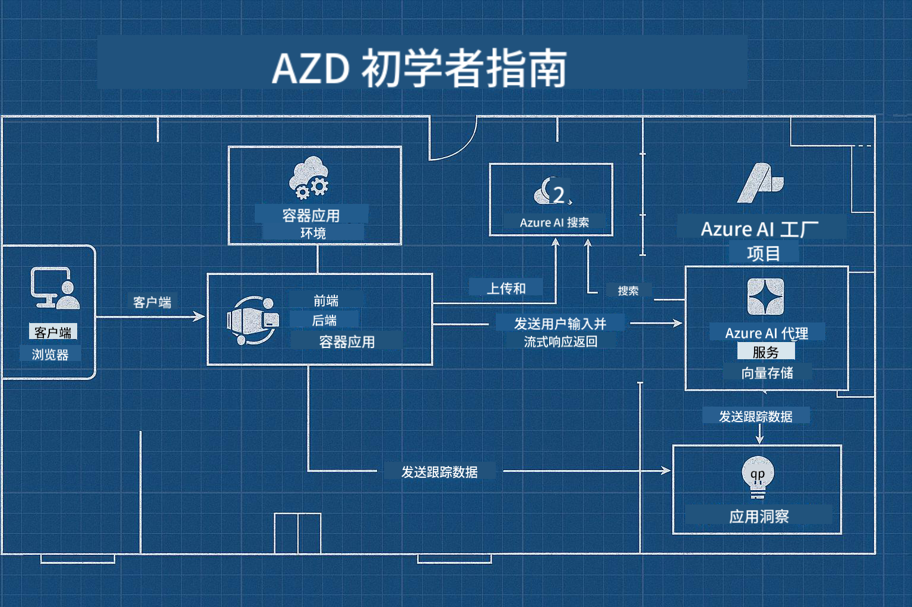

<!--
CO_OP_TRANSLATOR_METADATA:
{
  "original_hash": "245d24997bbcf2bae93bb2a503845d37",
  "translation_date": "2025-09-23T11:44:04+00:00",
  "source_file": "workshop/README.md",
  "language_code": "zh"
}
-->
# AZD 面向 AI 开发者的工作坊

## AZD 模板

为您的特定场景构建企业级 AI 应用解决方案，就像建造自己的房子一样。您可以自己设计，逐块构建，并负责确保它符合所有治理和开发指南。

**或者....**

您可以与建筑师合作，他们可以为您提供一个 _蓝图_ 作为起点，然后与您一起 _定制_ 以满足您的需求。这使您能够专注于让**您的房子**变得特别，而底层的电线、管道和其他依赖项则由专家为您处理。

**这就是 [AI 应用模板](https://ai.azure.com/templates) 的理念**——一系列蓝图，用于根据您的核心需求和依赖项构建不同类型的 AI 应用“房子”。

## 模板定制

这些模板设计用于与 [Azure AI Foundry](https://ai.azure.com) 一起使用。将这个平台视为您的“建筑承包商”，它拥有完成工作所需的所有资源、工具和专业知识！

您只需选择 [您的起始模板](https://learn.microsoft.com/en-us/azure/ai-foundry/how-to/develop/ai-template-get-started)。例如，我们将专注于 _Get Started with AI Agents_ 模板，为您构建一个“智能 AI 家园”，它配备了 AI 搜索、红队测试、评估、追踪、监控等功能！



您只需预约时间与建筑师一起，指导您完成定制过程。[GitHub Copilot for Azure](https://learn.microsoft.com/en-us/azure/developer/github-copilot-azure/get-started) 可以成为您的向导。只需与它“聊天”即可：

- 了解模板中的 Azure 功能
- 部署 Azure 资源
- 获取有关部署的信息
- 诊断和解决问题！

在本次工作坊中，我们将学习如何逐步 _拆解_ 现有模板（了解它提供的内容），然后 _定制_ 它（满足我们的需求）。

AI 模板**让它运行**——通过完成工作坊，您将学会**让它属于您**

----

**工作坊导航**
- **📚 课程主页**：[AZD 初学者指南](../README.md)
- **📖 相关章节**：涵盖 [第 1 章](../README.md#-chapter-1-foundation--quick-start)、[第 2 章](../README.md#-chapter-2-ai-first-development-recommended-for-ai-developers) 和 [第 5 章](../README.md#-chapter-5-multi-agent-ai-solutions-advanced)
- **🛠️ 实践实验**：[AI 工作坊实验](../docs/ai-foundry/ai-workshop-lab.md)
- **🚀 下一步**：[工作坊实验模块](../../../workshop)

欢迎参加专注于 AI 应用部署的 Azure Developer CLI (AZD) 学习工作坊。本次工作坊旨在从 AZD 基础知识开始，帮助您部署生产级 AI 解决方案。

## 工作坊概览

**时长：** 2-3 小时  
**级别：** 初学者到中级  
**前提条件：** 基本的 Azure、命令行工具和 AI 概念知识

### 您将学到什么

- **AZD 基础知识**：理解基础设施即代码 (IaC) 与 AZD 的关系
- 🤖 **AI 服务集成**：部署 Azure OpenAI、AI 搜索和其他 AI 服务
- **容器部署**：使用 Azure 容器应用部署 AI 应用
- **安全最佳实践**：实施托管身份和安全配置
- **监控与可观测性**：为 AI 工作负载设置 Application Insights
- **生产模式**：企业级部署策略

## 工作坊结构

### 模块 1：AZD 基础知识（30 分钟）
- 安装和配置 AZD
- 理解 AZD 项目结构
- 第一次 AZD 部署
- **实验**：部署一个简单的 Web 应用

### 模块 2：Azure OpenAI 集成（45 分钟）
- 设置 Azure OpenAI 资源
- 模型部署策略
- 配置 API 访问和身份验证
- **实验**：使用 GPT-4 部署聊天应用

### 模块 3：RAG 应用（45 分钟）
- Azure AI 搜索集成
- 使用 Azure 文档智能进行文档处理
- 向量嵌入和语义搜索
- **实验**：构建文档问答系统

### 模块 4：生产部署（30 分钟）
- 容器应用配置
- 扩展和性能优化
- 监控和日志记录
- **实验**：部署到生产环境并实现可观测性

### 模块 5：高级模式（15 分钟）
- 多环境部署
- CI/CD 集成
- 成本优化策略
- **总结**：生产就绪检查表

## 前提条件

### 必需工具

请在工作坊开始前安装以下工具：

```bash
# Azure Developer CLI
curl -fsSL https://aka.ms/install-azd.sh | bash

# Azure CLI
curl -sL https://aka.ms/InstallAzureCLIDeb | sudo bash

# Git
sudo apt-get install git

# Docker
curl -fsSL https://get.docker.com -o get-docker.sh
sudo sh get-docker.sh

# Python 3.10+
sudo apt-get install python3.10 python3.10-venv python3-pip
```

### Azure 账户设置

1. **Azure 订阅**：[免费注册](https://azure.microsoft.com/free/)
2. **Azure OpenAI 访问权限**：[申请访问](https://aka.ms/oai/access)
3. **所需权限**：
   - 订阅或资源组的贡献者角色
   - 用户访问管理员（用于 RBAC 分配）

### 验证前提条件

运行以下脚本以验证您的设置：

```bash
#!/bin/bash
echo "Verifying workshop prerequisites..."

# Check AZD installation
if command -v azd &> /dev/null; then
    echo "✅ Azure Developer CLI: $(azd --version)"
else
    echo "❌ Azure Developer CLI not found"
fi

# Check Azure CLI
if command -v az &> /dev/null; then
    echo "✅ Azure CLI: $(az --version | head -n1)"
else
    echo "❌ Azure CLI not found"
fi

# Check Docker
if command -v docker &> /dev/null; then
    echo "✅ Docker: $(docker --version)"
else
    echo "❌ Docker not found"
fi

# Check Python
if command -v python3 &> /dev/null; then
    echo "✅ Python: $(python3 --version)"
else
    echo "❌ Python 3 not found"
fi

# Check Azure login
if az account show &> /dev/null; then
    echo "✅ Azure: Logged in as $(az account show --query user.name -o tsv)"
else
    echo "❌ Azure: Not logged in (run 'az login')"
fi

echo "Setup verification complete!"
```

## 工作坊材料

### 实验练习

每个模块都包含动手实验，提供起始代码和分步说明：

- **[lab-1-azd-basics/](../../../workshop/lab-1-azd-basics)** - 第一次 AZD 部署
- **[lab-2-openai-chat/](../../../workshop/lab-2-openai-chat)** - 使用 Azure OpenAI 的聊天应用
- **[lab-3-rag-search/](../../../workshop/lab-3-rag-search)** - 使用 AI 搜索的 RAG 应用
- **[lab-4-production/](../../../workshop/lab-4-production)** - 生产部署模式
- **[lab-5-advanced/](../../../workshop/lab-5-advanced)** - 高级部署场景

### 参考材料

- **[AI Foundry 集成指南](../docs/ai-foundry/azure-ai-foundry-integration.md)** - 综合集成模式
- **[AI 模型部署指南](../docs/ai-foundry/ai-model-deployment.md)** - 模型部署最佳实践
- **[生产 AI 实践](../docs/ai-foundry/production-ai-practices.md)** - 企业级部署模式
- **[AI 故障排除指南](../docs/troubleshooting/ai-troubleshooting.md)** - 常见问题及解决方案

### 示例模板

常见 AI 场景的快速启动模板：

```
workshop/templates/
├── minimal-chat/          # Basic OpenAI chat app
├── rag-application/       # RAG with AI Search
├── multi-model/          # Multiple AI services
└── production-ready/     # Enterprise template
```

## 开始

### 选项 1：GitHub Codespaces（推荐）

最快的工作坊启动方式：

[](https://github.com/codespaces/new?hide_repo_select=true&ref=main&repo=YOUR_REPO_ID)

### 选项 2：本地开发

1. **克隆工作坊仓库：**
```bash
git clone https://github.com/YOUR_ORG/AZD-for-beginners.git
cd AZD-for-beginners/workshop
```

2. **登录 Azure：**
```bash
az login
azd auth login
```

3. **从实验 1 开始：**
```bash
cd lab-1-azd-basics
cat README.md  # Follow the instructions
```

### 选项 3：讲师指导的工作坊

如果您参加讲师指导的课程：

- 🎥 **工作坊录制**：[按需提供](https://aka.ms/azd-ai-workshop)
- 💬 **Discord 社区**：[加入以获得实时支持](https://aka.ms/foundry/discord)
- **工作坊反馈**：[分享您的体验](https://aka.ms/azd-workshop-feedback)

## 工作坊时间表

### 自学（3 小时）

```
⏰ 00:00 - 00:30  Module 1: AZD Foundations
⏰ 00:30 - 01:15  Module 2: Azure OpenAI Integration
⏰ 01:15 - 02:00  Module 3: RAG Applications
⏰ 02:00 - 02:30  Module 4: Production Deployment
⏰ 02:30 - 02:45  Module 5: Advanced Patterns
⏰ 02:45 - 03:00  Q&A and Next Steps
```

### 讲师指导课程（2.5 小时）

```
⏰ 00:00 - 00:15  Welcome & Prerequisites Check
⏰ 00:15 - 00:40  Module 1: Live Demo + Lab
⏰ 00:40 - 01:20  Module 2: OpenAI Integration
⏰ 01:20 - 01:30  Break
⏰ 01:30 - 02:10  Module 3: RAG Applications
⏰ 02:10 - 02:30  Module 4: Production Patterns
⏰ 02:30 - 02:45  Module 5: Advanced Topics
⏰ 02:45 - 03:00  Q&A and Resources
```

## 成功标准

在工作坊结束时，您将能够：

✅ 使用 AZD 模板**部署 AI 应用**  
✅ 配置 Azure OpenAI 服务并确保安全性  
✅ 构建与 Azure AI 搜索集成的**RAG 应用**  
✅ 为企业 AI 工作负载实施**生产模式**  
✅ **监控和排查** AI 应用部署问题  
✅ 为 AI 工作负载应用**成本优化策略**  

## 社区与支持

### 工作坊期间

- 🙋 **提问**：使用工作坊聊天或举手
- 🐛 **问题**：查看 [故障排除指南](../docs/troubleshooting/ai-troubleshooting.md)
- **提示**：与其他参与者分享发现

### 工作坊之后

- 💬 **Discord**：[Azure AI Foundry 社区](https://aka.ms/foundry/discord)
- **GitHub 问题**：[报告模板问题](https://github.com/YOUR_ORG/AZD-for-beginners/issues)
- 📧 **反馈**：[工作坊评估表](https://aka.ms/azd-workshop-feedback)

## 下一步

### 继续学习

1. **高级场景**：探索 [多区域部署](../docs/ai-foundry/production-ai-practices.md#multi-region-deployment)
2. **CI/CD 集成**：设置 [GitHub Actions 工作流](../docs/deployment/github-actions.md)
3. **自定义模板**：创建您自己的 [AZD 模板](../docs/getting-started/custom-templates.md)

### 应用到您的项目

1. **评估**：使用我们的 [就绪检查表](./production-readiness-checklist.md)
2. **模板**：从我们的 [AI 专用模板](../../../workshop/templates) 开始
3. **支持**：加入 [Azure AI Foundry Discord](https://aka.ms/foundry/discord)

### 分享您的成功

- ⭐ **为仓库加星**，如果本次工作坊对您有所帮助
- 🐦 **在社交媒体上分享**，使用 #AzureDeveloperCLI #AzureAI
- 📝 **写博客文章**，分享您的 AI 部署旅程

---

## 工作坊反馈

您的反馈有助于我们改进工作坊体验：

| 方面 | 评分 (1-5) | 评论 |
|------|------------|------|
| 内容质量 | ⭐⭐⭐⭐⭐ | |
| 实践实验 | ⭐⭐⭐⭐⭐ | |
| 文档 | ⭐⭐⭐⭐⭐ | |
| 难度级别 | ⭐⭐⭐⭐⭐ | |
| 整体体验 | ⭐⭐⭐⭐⭐ | |

**提交反馈**：[工作坊评估表](https://aka.ms/azd-workshop-feedback)

---

**上一页：** [AI 故障排除指南](../docs/troubleshooting/ai-troubleshooting.md) | **下一页：** 开始 [实验 1：AZD 基础知识](../../../workshop/lab-1-azd-basics)

**准备好开始使用 AZD 构建 AI 应用了吗？**

[开始实验 1：AZD 基础知识 →](./lab-1-azd-basics/README.md)

---

