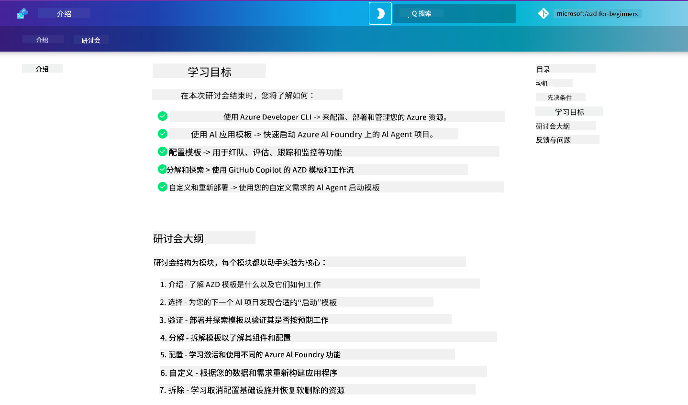

<!--
CO_OP_TRANSLATOR_METADATA:
{
  "original_hash": "9cc966416ab431c38b2ab863884b196c",
  "translation_date": "2025-09-24T08:50:37+00:00",
  "source_file": "workshop/README.md",
  "language_code": "zh"
}
-->
# AZD 面向 AI 开发者的工作坊

欢迎参加学习 Azure Developer CLI (AZD) 的动手实践工作坊，重点是 AI 应用的部署。本次工作坊将通过以下三个步骤帮助您深入了解 AZD 模板的实际应用：

1. **探索** - 找到适合您的模板。
1. **部署** - 部署并验证其功能。
1. **定制** - 修改并迭代，使其符合您的需求！

在整个工作坊过程中，您还将接触到核心开发工具和工作流程，帮助您优化端到端的开发旅程。

<br/>

## 基于浏览器的指南

工作坊课程以 Markdown 格式编写。您可以直接在 GitHub 中浏览，或者按照下图所示启动基于浏览器的预览。



使用此选项时，请将仓库 fork 到您的个人资料，并启动 GitHub Codespaces。一旦 VS Code 终端激活，输入以下命令：

```bash title="" linenums="0"
mkdocs serve > /dev/null 2>&1 &
```

几秒钟后，您会看到一个弹出对话框。选择“在浏览器中打开”选项。基于网页的指南将会在新的浏览器标签中打开。此预览的部分优势包括：

1. **内置搜索** - 快速查找关键字或课程。
1. **复制图标** - 鼠标悬停在代码块上即可看到此选项。
1. **主题切换** - 在深色和浅色主题之间切换。
1. **获取帮助** - 点击页脚中的 Discord 图标加入社区！

<br/>

## 工作坊概览

**时长：** 3-4 小时  
**难度：** 初学者到中级  
**前提条件：** 熟悉 Azure、AI 概念、VS Code 和命令行工具。

这是一个动手实践的工作坊，您将在实践中学习。一旦完成练习，我们建议您回顾 AZD 初学者课程，以继续学习安全性和生产力的最佳实践。

| 时间 | 模块  | 目标 |
|:---|:---|:---|
| 15 分钟 | [介绍](docs/instructions/0-Introduction.md) | 设定目标，了解工作坊内容 |
| 30 分钟 | [选择 AI 模板](docs/instructions/1-Select-AI-Template.md) | 探索选项并选择入门模板 | 
| 30 分钟 | [验证 AI 模板](docs/instructions/2-Validate-AI-Template.md) | 将默认解决方案部署到 Azure |
| 30 分钟 | [解构 AI 模板](docs/instructions/3-Deconstruct-AI-Template.md) | 探索结构和配置 |
| 30 分钟 | [配置 AI 模板](docs/instructions/4-Configure-AI-Template.md) | 激活并尝试可用功能 |
| 30 分钟 | [定制 AI 模板](docs/instructions/5-Customize-AI-Template.md) | 根据需求调整模板 |
| 30 分钟 | [拆除基础设施](docs/instructions/6-Teardown-Infrastructure.md) | 清理并释放资源 |
| 15 分钟 | [总结与下一步](docs/instructions/7-Wrap-up.md) | 学习资源，工作坊挑战 |

<br/>

## 您将学到什么

将 AZD 模板视为一个学习沙盒，用于探索 Azure AI Foundry 上端到端开发的各种功能和工具。在工作坊结束时，您应该对这些工具和概念有直观的理解。

| 概念  | 目标 |
|:---|:---|
| **Azure Developer CLI** | 了解工具命令和工作流程 |
| **AZD 模板**| 了解项目结构和配置 |
| **Azure AI Agent**| 配置并部署 Azure AI Foundry 项目 |
| **Azure AI Search**| 使用代理启用上下文工程 |
| **可观测性**| 探索追踪、监控和评估 |
| **红队测试**| 探索对抗性测试和缓解措施 |

<br/>

## 工作坊结构

工作坊的结构旨在引导您从模板探索到部署、解构和定制，基于官方 [AI Agents 入门指南](https://github.com/Azure-Samples/get-started-with-ai-agents) 的入门模板。

### [模块 1: 选择 AI 模板](docs/instructions/1-Select-AI-Template.md) (30 分钟)

- 什么是 AI 模板？
- 哪里可以找到 AI 模板？
- 如何开始构建 AI 代理？
- **实验室**: 使用 GitHub Codespaces 快速入门

### [模块 2: 验证 AI 模板](docs/instructions/2-Validate-AI-Template.md) (30 分钟)

- 什么是 AI 模板架构？
- 什么是 AZD 开发工作流程？
- 如何获取 AZD 开发帮助？
- **实验室**: 部署并验证 AI 代理模板

### [模块 3: 解构 AI 模板](docs/instructions/3-Deconstruct-AI-Template.md) (30 分钟)

- 探索 `.azure/` 中的环境
- 探索 `infra/` 中的资源设置
- 探索 `azure.yaml` 中的 AZD 配置
- **实验室**: 修改环境变量并重新部署

### [模块 4: 配置 AI 模板](docs/instructions/4-Configure-AI-Template.md) (30 分钟)
- 探索：检索增强生成
- 探索：代理评估与红队测试
- 探索：追踪与监控
- **实验室**: 探索 AI 代理 + 可观测性 

### [模块 5: 定制 AI 模板](docs/instructions/5-Customize-AI-Template.md) (30 分钟)
- 定义：基于场景需求的 PRD
- 配置：AZD 的环境变量
- 实现：生命周期钩子以添加任务
- **实验室**: 根据我的场景定制模板

### [模块 6: 拆除基础设施](docs/instructions/6-Teardown-Infrastructure.md) (30 分钟)
- 回顾：什么是 AZD 模板？
- 回顾：为什么使用 Azure Developer CLI？
- 下一步：尝试不同的模板！
- **实验室**: 取消基础设施配置并清理

<br/>

## 工作坊挑战

想挑战自己做得更多吗？以下是一些项目建议 - 或者与我们分享您的想法！

| 项目 | 描述 |
|:---|:---|
|1. **解构一个复杂的 AI 模板** | 使用我们概述的工作流程和工具，尝试部署、验证并定制一个不同的 AI 解决方案模板。_您学到了什么？_|
|2. **根据您的场景定制**  | 尝试为不同的场景编写 PRD（产品需求文档）。然后在模板仓库中使用 GitHub Copilot 的代理模式，并让它为您生成一个定制工作流程。_您学到了什么？如何改进这些建议？_|
| | |

## 有反馈吗？

1. 在此仓库中发布问题 - 标记为 `Workshop` 以便查找。
1. 加入 Azure AI Foundry Discord - 与同行交流！

| | | 
|:---|:---|
| **📚 课程主页**| [AZD 初学者指南](../README.md)|
| **📖 文档** | [AI 模板入门指南](https://learn.microsoft.com/en-us/azure/ai-foundry/how-to/develop/ai-template-get-started)|
| **🛠️AI 模板** | [Azure AI Foundry 模板](https://ai.azure.com/templates) |
|**🚀 下一步** | [接受挑战](../../../workshop) |
| | |

<br/>

---

**上一节：** [AI 故障排除指南](../docs/troubleshooting/ai-troubleshooting.md) | **下一节：** 开始 [实验室 1: AZD 基础知识](../../../workshop/lab-1-azd-basics)

**准备好开始使用 AZD 构建 AI 应用了吗？**

[开始实验室 1: AZD 基础知识 →](./lab-1-azd-basics/README.md)

---

